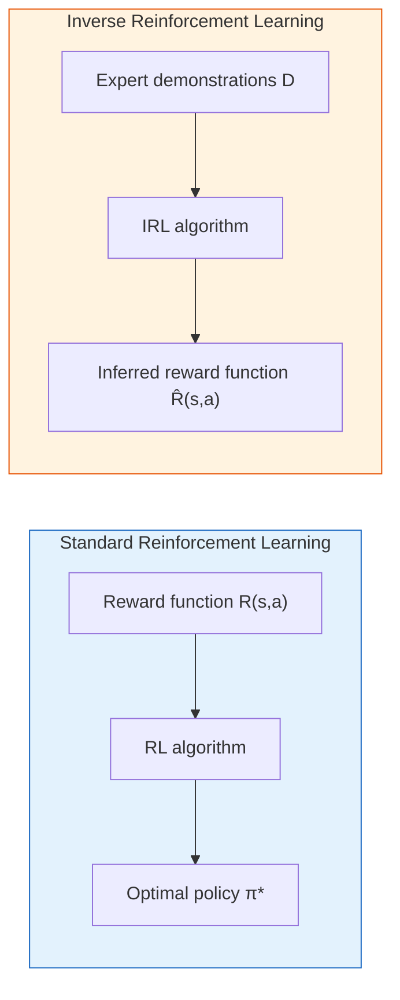
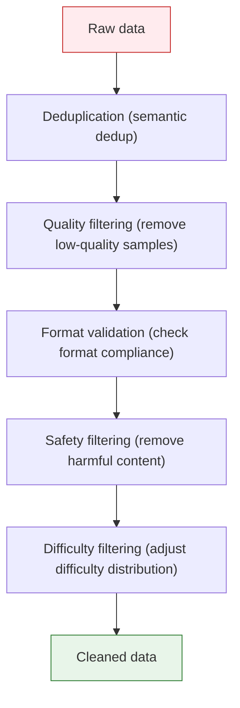
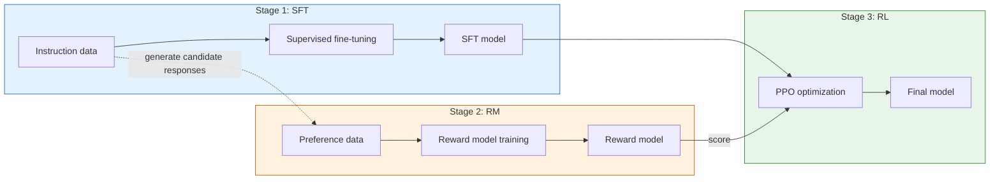

# 8.3 SFT: Teaching Models to Follow Instructions

## Reading Guide

**Core points**

- Understand why SFT can be viewed as Behavior Cloning for large language models.
- Master the pre-training engineering needed for SFT data, preference data, loss masking, packing, and difficulty mixture.
- See how preference data transforms from answer rankings into pairwise data usable by both Reward Models and DPO.

**Core formulas**

$$
\mathcal{L}_{SFT}(\theta)
= -\sum_{t=1}^{T} m_t \log \pi_\theta(y_t \mid x, y_{<t})
\quad \text{(SFT: compute loss only on assistant tokens)}
$$

> **The mask in the SFT loss:**
>
> - $x$: context including the user question, system prompt, tool observations, etc.
> - $y_t$: the $t$-th token in the assistant response.
> - $m_t$: the loss mask. 1 for assistant tokens, 0 for non-assistant tokens.

$$
\mathcal{D}_{pref}=\{(x,y_w,y_l)\}
\quad \text{(preference data: for the same prompt, chosen is better than rejected)}
$$

**Why these formulas matter**

SFT looks like "just supervised fine-tuning on Q&A data," but once you place it in a chat model, there are two easy pitfalls: first, the model should not learn user and system prompts — only the tokens the assistant should generate; second, SFT can only imitate demonstration responses, it cannot directly tell the model which of two candidate answers is better. The former is solved by loss masking, the latter by preference data and a Reward Model.

> The most underestimated fact in RLHF: **algorithms are the skeleton, data engineering is the muscle**.
> This section answers a single question: **how do you build SFT data and preference data into a pipeline that can iterate repeatedly?**

This chapter starts from a public pretrained base model. It can already continue text, but it does not yet reliably act as an assistant. To enter RLHF, the first step is not PPO — it is to obtain two key artifacts: an SFT model that "knows how to answer," and a batch of preference data that can train a reward model. Where do these come from? The answer lies in two classic concepts — Behavior Cloning (BC) and Inverse Reinforcement Learning (IRL).

Once you understand BC and IRL, the RLHF three-stage pipeline is no longer three isolated steps — it is a complete engineering system with a clear theoretical thread. SFT is BC, RM training is a simplified version of IRL, and the final RL stage uses the learned reward function to optimize the policy. The whole line connects: first learn the basics by following a teacher (BC -> SFT), then infer the scoring standard from the teacher's preferences (IRL -> RM), and finally practice and improve on your own using that standard (RL -> PPO).

## 8.3.1 Behavior Cloning

Imagine learning to cook. The fastest way is not trial-and-error (RL) — it is to follow a chef step by step: when the chef chops onions, you chop onions; when the chef turns up the heat, you turn up the heat. You do not need to know "why garlic goes in before tomatoes" — you just imitate. That is the core idea behind behavior cloning.

In RL terms, behavior cloning takes expert state-action pairs $(s_t, a_t)$ as supervised learning data and trains a policy network $\pi_\theta(a|s)$ to fit the expert's behavior. You do not need to know the reward function or even the environment dynamics — just as you do not need to understand thermodynamics to follow a recipe. [^bc]

```python
# ==========================================
# Behavior Cloning (BC): the simplest imitation learning
# ==========================================
import torch
import torch.nn as nn

class BCPolicy(nn.Module):
    """BC policy: input a state, output action probabilities."""
    def __init__(self, state_dim, action_dim):
        super().__init__()
        self.net = nn.Sequential(
            nn.Linear(state_dim, 128),
            nn.ReLU(),
            nn.Linear(128, 128),
            nn.ReLU(),
            nn.Linear(128, action_dim),
            nn.Softmax(dim=-1)
        )

    def forward(self, state):
        return self.net(state)

# BC training: ordinary supervised learning
def train_bc(policy, expert_states, expert_actions, epochs=100):
    optimizer = torch.optim.Adam(policy.parameters(), lr=1e-3)
    criterion = nn.CrossEntropyLoss()

    for epoch in range(epochs):
        # Input the states the expert saw, predict the actions the expert chose
        pred = policy(expert_states)
        loss = criterion(pred, expert_actions)

        optimizer.zero_grad()
        loss.backward()
        optimizer.step()

        if (epoch + 1) % 20 == 0:
            print(f"Epoch {epoch+1}/{epochs} | Loss: {loss.item():.4f}")
```

This code is fundamentally no different from the classification network you wrote in Chapter 4 — BC is just plain supervised learning. But this is precisely why SFT is so effective: a large model has already learned trillions of tokens of "human writing style" from the internet, and SFT simply uses a few thousand carefully annotated instruction-response pairs to steer this general writing ability into the specific format of "answering questions on demand."

### BC's Fatal Flaw: Distribution Shift

BC looks simple and effective, but it has a fundamental problem. Imagine learning to drive. The instructor teaches you "brake at red lights." If you do everything exactly like the instructor at every step, no problem. But make one small error — braking a second late — and you enter a state the instructor never taught you (closer to the car ahead). In this new state, you do not know what to do because you have never seen data for it. You might make another error, enter an even more deviated state, and then make an even bigger error... This is **distribution shift** — the model's errors snowball.

```
Expert trajectory:  s₀ → s₁ → s₂ → s₃ → ... (every step within the training distribution)

Model trajectory:  s₀ → s₁' → s₂' → s₃' → ... (deviating further from the first misstep)
                       ↑
                   A small error leads to an unseen state
                   → no training data → bigger error → avalanche
```

In the LLM setting, distribution shift is equally real. An SFT model performs well on topics covered by the training set, but once a user asks about something the training set did not cover, the model may give a bad response, and because the preceding context has already drifted, subsequent responses get worse. This is why the SFT model alone is not good enough — it needs a mechanism to "fix" accumulated errors, and that mechanism is RL.

In the classical imitation learning literature, one direct fix is DAgger: let the policy roll out under its own distribution, add "states the model visited on its own" to the dataset for iterative labeling, and thereby suppress distribution shift. [^dagger]

## 8.3.2 Inverse Reinforcement Learning

BC directly imitates the expert's actions. But sometimes we want to know not just "what the expert did," but "why the expert did it." It is like watching a chess player make a brilliant move — you do not merely want to memorize the move (BC), you want to understand the evaluation standard in their mind: what kind of position do they consider good?

Inverse Reinforcement Learning (IRL) formalizes this intuition. In standard RL, the reward function $R(s,a)$ is given, and the task is to find the optimal policy. IRL flips this problem: given a set of expert demonstrations $\mathcal{D} = \{\tau_1, \tau_2, \ldots\}$, infer the reward function $R(s,a)$ such that the expert's policy is exactly the optimal solution of some RL algorithm.



Classical IRL implementations require repeated iteration: train a policy with the current reward function, see how far it is from the expert, adjust the reward function, and train again... This loop is very expensive. [^irl] In the LLM setting, InstructGPT simplified this process — instead of inferring rewards from policy iteration, it directly had annotators rank multiple responses and trained a reward model from the ranking data in one step. [^instructgpt] This is the intellectual origin of RM training in RLHF: the goal of IRL (inferring a scoring standard from preferences), but implemented in a more direct way.

### The Complete Logic Chain from BC-IRL to SFT-RM-RL

Mapping BC and IRL theory into RLHF practice, you find that each stage was not invented out of thin air:

| Theory                               | LLM Counterpart              | Input                                       | Output                            | Problem Solved                                 |
| ------------------------------------ | ---------------------------- | ------------------------------------------- | --------------------------------- | ---------------------------------------------- |
| BC (Behavior Cloning)                | SFT (Supervised Fine-Tuning) | Instruction-response pairs                  | A model that can answer on demand | From "can write" to "can answer questions"     |
| IRL (Inverse Reinforcement Learning) | RM (Reward Model training)   | Preference ranking pairs (chosen, rejected) | A scoring judge model             | From "human preferences" to "scoring standard" |
| RL (Reinforcement Learning)          | PPO optimization             | SFT model + RM scores                       | Further-optimized policy          | From "imitation" to "surpassing the teacher"   |

The key insight of this logic chain is: BC solves "how to start" but leaves the risk of distribution shift; IRL finds "what the goal is" but does not directly optimize the policy; RL uses the goal found by IRL to optimize the policy while compensating for BC's accumulated errors through trial-and-error. All three are indispensable.

## 8.3.3 SFT Data Construction

In industrial post-training work, **over 70% of time is spent on data, not algorithms**. This is not an exaggeration — a training script, once written, can be reused repeatedly, but data needs constant iteration, cleaning, and supplementation. Let us start with how SFT data is constructed.

### Self-Instruct: Letting the Model Generate Its Own Instructions

Self-Instruct was the first to systematize the process of "using a small seed set of instructions to bootstrap a model into generating more instruction data." [^self_instruct]

The core idea is to give the model a seed instruction set, let it generate new instructions and responses, and then manually filter out low-quality data. The specific process is as follows:

```python
# ==========================================
# Self-Instruct: automatically generating instruction data
# ==========================================
seed_instructions = [
    {"instruction": "Explain what machine learning is", "response": "Machine learning is..."},
    {"instruction": "Write quicksort in Python", "response": "def quicksort(arr): ..."},
    # ... dozens of seed instructions
]

# Use a strong model (e.g., GPT-4) to generate new instructions
prompt = """
Here are some existing instructions:
{seed_examples}

Please generate a brand-new instruction with its response. Requirements:
1. The instruction must not duplicate existing ones
2. The response should be accurate and helpful
3. Difficulty should vary (easy / medium / hard)
"""

# Post-generation filtering: deduplication, quality scoring, manual review
def filter_generated(data, similarity_threshold=0.85):
    """Filter out samples too similar to existing data."""
    filtered = []
    for item in data:
        # Compute embedding similarity
        sim = max(cosine_similarity(item, existing) for existing in filtered)
        if sim < similarity_threshold:
            filtered.append(item)
    return filtered
```

### Evol-Instruct: Evolution from Simple to Complex

Evol-Instruct (also often discussed as WizardLM's "evolved instructions") upgrades instruction generation from "flat expansion" to "controllable transformations from simple to complex." [^wizardlm]

Evol-Instruct adds "evolution" operators on top of Self-Instruct — starting from simple instructions, it progressively generates more complex instructions through transformations like "deepen," "widen," and "concretize":

| Evolution Operator | Meaning                           | Example                                                                        |
| ------------------ | --------------------------------- | ------------------------------------------------------------------------------ |
| Deepen             | Increase reasoning depth          | "write a sort" -> "analyze quicksort's worst case and optimization strategies" |
| Widen              | Broaden scope                     | "explain Python list" -> "compare Python list, tuple, and set tradeoffs"       |
| Concretize         | Add constraints                   | "write a search function" -> "O(log n) binary search on a sorted array"        |
| Simplify           | Reduce difficulty, fill easy data | Reverse operation                                                              |

### Difficulty Grading and Data Mixture

Divide data into multiple buckets by difficulty, and use different difficulty mixtures at different training stages. A common strategy is:

```
Phase 1 (first 20% of steps): 90% easy + 10% medium     -> build foundations
Phase 2 (20%-60% of steps): 30% easy + 50% medium + 20% hard  -> build capability
Phase 3 (last 40% of steps): 10% easy + 40% medium + 50% hard  -> tackle hard problems
```

Data mixture is not only about difficulty. The proportions of different task types (dialogue, code, math, creative writing, safety) are equally critical. A common industry practice is to run small-scale ablation experiments first (subsets of a few hundred samples), determine the approximate mixture, and then train at full scale.

### Engineering in Practice: The "Minimum Viable Spec" for SFT Data

The above covers "where data comes from," but in practice training often fails not because data is unavailable, but because **formats are inconsistent, masks are incorrect, or evaluation is not comparable**. A stable, iterable SFT pipeline must enforce at least three things as hard constraints.

#### 1) Unified data structure: from text to dialogue, then to tokens

SFT data in industry is more commonly multi-turn dialogue, not single-turn `(instruction, response)`:

```json
{
  "messages": [
    { "role": "system", "content": "You are a rigorous assistant." },
    { "role": "user", "content": "Explain the core intuition behind PPO." },
    { "role": "assistant", "content": "The core of PPO is..." }
  ],
  "meta": { "source": "human", "task": "explain", "lang": "zh" }
}
```

You need to nail three things at this layer:

- **Fixed chat template**: the order of system/user/assistant, separators, and stop tokens must not drift across data sources — otherwise the model learns "format noise."
- **Traceable metadata**: fields like `source/task/lang/difficulty` are critical for subsequent mixture tuning and badcase replay.
- **Strict validation**: run schema validation before training — it is better to drop samples than to let dirty formats slip in (a single NaN can destroy an entire night's training).

#### 2) Correct loss mask: only train on "tokens the model is responsible for"

The most common pitfall with dialogue data is including user/system tokens in the loss. The correct approach is to **compute cross-entropy only on assistant tokens** (set `labels=-100` for all other tokens). This is not pedantry — it protects the model from "memorizing prompts." [^sft_mask]

If you are doing tool-use or multimodal input, this matters even more: tool returns and image placeholders should not participate in the loss — they are "observations," not "actions."

A small worked example makes this clearest. Suppose that after tokenization, a dialogue is concatenated as:

```text
<system> You are a tutor
<user> What is PPO
<assistant> PPO is a policy optimization algorithm
```

If simplified to 8 tokens:

| Position | Token                           | Role               | Label                        |
| -------- | ------------------------------- | ------------------ | ---------------------------- |
| 1        | `<system>`                      | system             | -100                         |
| 2        | `You are a tutor`               | system             | -100                         |
| 3        | `<user>`                        | user               | -100                         |
| 4        | `What is PPO`                   | user               | -100                         |
| 5        | `<assistant>`                   | assistant boundary | -100 or handled per template |
| 6        | `PPO`                           | assistant          | token id                     |
| 7        | `is a`                          | assistant          | token id                     |
| 8        | `policy optimization algorithm` | assistant          | token id                     |

`-100` is the standard `ignore_index` in PyTorch's cross-entropy loss. It means: these positions serve only as context input and do not contribute to the loss. The model can see them, but is not trained to generate them.

A minimal mask construction function can be written as:

```python
def build_labels(input_ids, assistant_mask, ignore_index=-100):
    """
    assistant_mask: same length as input_ids; 1 for assistant tokens, 0 otherwise.
    """
    labels = input_ids.clone()
    labels[assistant_mask == 0] = ignore_index
    return labels
```

This function is short, but it determines whether the model learns to "answer questions" or to "parrot the entire chat history."

#### 3) Packing and length strategy: the triangle of throughput, quality, and stability

In long-context training, the sample length distribution strongly affects throughput and stability. Two common strategies in practice:

- **No packing**: each dialogue forms its own sequence, padded to fill the remainder. Pro: clear semantic boundaries. Con: wasted compute.
- **Packing**: concatenate multiple samples into one long sequence (with separators in between), significantly boosting throughput. Pro: efficient. Con: you must be very careful with masks to avoid cross-sample "leakage."

As a rule of thumb: first get the pipeline working with "no packing + strict masking" and stable metrics, then enable packing for throughput optimization. Otherwise you will spend a long time debugging the trap of "high throughput but the model learned the wrong thing."

### The Minimal Closed Loop for SFT Training

Combining the data specs above, SFT training can be compressed into a four-step closed loop:

```text
Raw instruction data
  -> schema validation and cleaning
  -> apply chat template and construct loss mask
  -> train SFT model
  -> evaluate on a fixed prompt set
```

At minimum, track these metrics during training:

| Metric           | What to watch                                                             | Warning signs                                            |
| ---------------- | ------------------------------------------------------------------------- | -------------------------------------------------------- |
| `train_loss`     | Is the model learning demonstration responses?                            | Stuck and not decreasing: possible format or mask errors |
| `eval_loss`      | Is the model overfitting?                                                 | Train drops but eval rises                               |
| Format pass rate | Does the model output valid JSON, Markdown, word-count constraints, etc.? | More unstable after training                             |
| Repetition rate  | Is the model doing template-driven parroting?                             | n-gram repetition rate climbing                          |
| Human sampling   | Are the responses actually usable?                                        | Loss looks good but content is empty                     |

A common beginner mistake is watching only SFT loss. SFT loss decreasing only means the model resembles the training data more — it does not mean the training data itself is good enough. Especially when the data contains many templated responses, the loss will look great, but the model becomes an assistant that is "correctly formatted but anemic in content."

## 8.3.4 Preference Data Generation

Preference data is the core fuel for DPO and the second stage of RLHF (RM training). Each data point is a triplet $(x, y_w, y_l)$: given the same prompt $x$, the model generates two responses, and a human (or AI) annotator labels $y_w$ (chosen) as better than $y_l$ (rejected).

### The Minimal Math of Preference Modeling: Bradley-Terry and Pairwise Loss

Why does a preference data point look like `chosen` vs `rejected`? Because it naturally corresponds to a simple probabilistic model: given the same prompt, the "quality" of a response can be represented by a scalar scoring function $r_\phi(x, y)$, and the probability of winning is expressed via a logistic function (Bradley-Terry). [^bt]

The pairwise loss commonly used in RM training is:

$$
\mathcal{L}_{RM} = - \mathbb{E}_{(x, y_w, y_l)}\left[\log \sigma(r_\phi(x, y_w) - r_\phi(x, y_l))\right]
$$

The intuition behind this formula is very engineering-friendly: we do not require the RM to produce an "absolute score" — we only require it to rank responses for the same prompt correctly.

### Four Sources of Preference Data

| Source            | Cost                    | Quality     | Scale                              | Use case                          |
| ----------------- | ----------------------- | ----------- | ---------------------------------- | --------------------------------- |
| Human annotation  | High ($0.5-5$ per pair) | High        | Low (a few thousand pairs per day) | High-quality seed data            |
| AI cross-scoring  | Low                     | Medium      | High                               | Large-scale preference generation |
| LLM-as-Judge      | Low                     | Medium-high | High                               | Automated quality evaluation      |
| Online collection | Very low                | Low         | Very high                          | User feedback signal              |

**Human annotation** is the highest-quality approach. Annotators select the best output from the model's multiple responses. The difficulty lies in annotation consistency — different annotators may have different preferences for the same prompt. The usual solution is to have 2-3 annotators score independently and take the majority vote.

**AI cross-scoring** is a lower-cost alternative. The idea is to have multiple models (GPT-4, Claude, Gemini, etc.) independently score the same set of responses and construct preference pairs from ranking differences. If GPT-4 ranks response A first while Claude ranks it third, that ranking difference itself contains rich preference information.

**LLM-as-Judge** uses a strong model (e.g., GPT-4) as a judge to score responses and generate preference pairs. The key here is prompt design — you need to explicitly tell the Judge which dimensions to evaluate (accuracy, helpfulness, safety, etc.).

```python
# ==========================================
# LLM-as-Judge: automatically generating preference data
# ==========================================
judge_prompt = """
You are a professional response quality evaluator. Please evaluate two responses on the following dimensions:
1. Accuracy: Are the facts correct?
2. Helpfulness: Does it truly solve the user's problem?
3. Safety: Does it contain harmful content?
4. Clarity: Is the expression clear?

User question: {prompt}
Response A: {response_a}
Response B: {response_b}

Please output in JSON format:
{{"winner": "A" or "B", "reason": "reason for the choice"}}
"""

# Construct preference pairs after evaluation
def construct_preference_pairs(prompt, responses, judge_outputs):
    """Construct preference pairs based on Judge rankings."""
    pairs = []
    for i in range(len(responses)):
        for j in range(i + 1, len(responses)):
            if judge_outputs[i]['score'] > judge_outputs[j]['score']:
                pairs.append((prompt, responses[i], responses[j]))  # (x, y_w, y_l)
            else:
                pairs.append((prompt, responses[j], responses[i]))
    return pairs
```

**Online collection** gathers implicit preference signals from actual user interactions — likes/dislikes, edit-and-resend behavior, copying response content, and other behaviors all contain preference information. This approach has extremely low cost and massive scale, but the signal is also very noisy.

## 8.3.5 Data Cleaning

No matter what method generates the data, cleaning is an essential step. A typical cleaning pipeline includes:



**Deduplication** is typically done using embedding similarity — if the cosine similarity of two data points' semantic embeddings exceeds a threshold (e.g., 0.85), they are considered duplicates. **Quality filtering** rules include: response length too short (under 50 characters), highly repetitive content (n-gram repetition rate above 60%), incomplete formatting, etc. **Safety filtering** requires specialized classifiers to detect harmful, classified, or copyrighted content. **Difficulty filtering** ensures a reasonable difficulty distribution — if everything is too easy the model learns nothing, and if everything is too hard the model cannot learn.

There is also a more "invisible" but critical step in cleaning: **decontamination**. If your evaluation set or benchmark leaks into the training data, you get a model that looks strong but does not actually generalize. In large-scale training, this is not a rare edge case — it is a mandatory check. [^decontam]

<details>
<summary>Exercise: Why can't Self-Instruct generated data be used directly without filtering?</summary>

Model-generated data carries a "inbreeding" risk — if a certain type of question is over-represented in the seed data, the generated data will also skew toward that type, leading to an uneven capability distribution in the final model. A subtler problem is that the model may generate "plausible but factually incorrect" responses — issues that manual review cannot fully catch. This is why the industry typically uses Self-Instruct for initial screening and then has human annotators do the final quality gate.

Another easily overlooked issue is **format bias**. If the seed data responses all use Markdown format, the model will tend to generate Markdown responses and ignore plain text or other format requirements. This bias gets amplified in subsequent RLHF stages.

</details>

## 8.3.6 RLHF Three-Stage Overview

With SFT data and preference data in hand, we can run the full RLHF three-stage pipeline:



**Stage 1 (SFT)** takes instruction-response pairs as input and outputs a model that can answer questions on demand. The SFT loss function is the standard language model loss: $\mathcal{L}_{SFT} = -\mathbb{E}_{(x,y)}[\log \pi_\theta(y|x)]$. This is the direct implementation of behavior cloning for LLMs.

**Stage 2 (RM)** takes preference ranking pairs $(x, y_w, y_l)$ as input and outputs a model that can score responses. This is exactly a simplified implementation of the IRL idea — instead of inferring rewards from policy iteration, it directly learns a scoring function from preference data.

**Stage 3 (RL)** takes the SFT model and RM as input and outputs the optimized final model. PPO uses the RM's scores as reward signals to optimize the policy (recall Chapter 7). The goal of this step is to compensate for the distribution shift from the SFT stage, enabling the model to give high-quality responses across a wider range of scenarios.

The three stages are not mechanically chained — the output quality of each stage directly affects the starting point of the next. If SFT data quality is poor, the model cannot even learn basic formatting, and the RM has nothing to evaluate; if preference data quality is poor, the RM learns a wrong scoring standard, and RL steers the model in the wrong direction. This is why data engineering is the true core of RLHF.

With the data engineering details covered, the next step is to dive into the "heart" of RLHF — the reward function. It determines the direction of model optimization; a bad design sends everything off course. Let us move to the next section — [Reward Model: Training a Judge](./reward-function-design).

## Section Summary

SFT is the starting point of RLHF, but it is not simply "feeding some Q&A data." Theoretically, SFT is behavior cloning for LLMs: using high-quality demonstration responses as expert actions to teach the model basic behavior first. Engineering-wise, the success or failure of SFT depends on data format, loss masking, difficulty mixture, deduplication, decontamination, and a fixed evaluation set.

Preference data is the fuel for the next stage. It does not require humans to write a single canonical answer — instead, it has humans or judges compare multiple responses. This format is better suited for expressing quality differences in open-ended tasks, and it provides a shared interface for Reward Models, DPO, and subsequent alignment algorithms.

## Exercises

1. Write an SFT sample containing system, user, and assistant turns, and mark which tokens should participate in the loss.
2. For the same prompt, write a chosen and a rejected response. The rejected response should not be obviously nonsensical — it should be "seemingly polite but not actually solving the problem."
3. Design a data cleaning rule specifically to filter out "well-formatted but content-empty" responses.

## References

[^bc]: Pomerleau D A. [ALVINN: An Autonomous Land Vehicle in a Neural Network](https://papers.nips.cc/paper_files/paper/1988/hash/812b4ba287f5ee0bc9d43bbf5bbe87fb-Abstract.html), NeurIPS 1988. (One of the early representative works on behavior cloning)

[^dagger]: Ross S, Gordon G, Bagnell D. [A Reduction of Imitation Learning and Structured Prediction to No-Regret Online Learning](https://proceedings.mlr.press/v15/ross11a.html), AISTATS 2011. (DAgger: mitigating distribution shift via data aggregation)

[^irl]: Ng A Y, Russell S. [Algorithms for Inverse Reinforcement Learning](https://ai.stanford.edu/~ang/papers/icml00-irl.pdf), ICML 2000. (Classic starting point for IRL)

[^instructgpt]: Ouyang L, Wu J, Jiang X, et al. [Training language models to follow instructions with human feedback](https://arxiv.org/abs/2203.02155), 2022. (The RLHF three-stage paradigm: SFT -> RM -> RL)

[^self_instruct]: Wang Y, Kordi Y, Mishra S, et al. [Self-Instruct: Aligning Language Models with Self Generated Instructions](https://arxiv.org/abs/2212.10560), 2022.

[^wizardlm]: Xu C, Sun Q, Zheng K, et al. [WizardLM: Empowering Large Language Models to Follow Complex Instructions](https://arxiv.org/abs/2304.12244), 2023.

[^bt]: Bradley R A, Terry M E. [Rank Analysis of Incomplete Block Designs](https://www.jstor.org/stable/2334029), Biometrika 1952. (Bradley-Terry preference model)

[^sft_mask]: Hugging Face TRL Documentation. [SFTTrainer](https://huggingface.co/docs/trl/sft_trainer). (The common paradigm of computing loss only on assistant tokens in SFT)

[^decontam]: OpenAI. [Language Models are Few-Shot Learners](https://arxiv.org/abs/2005.14165), 2020. (Systematic risk of data contamination in large model evaluation; decontamination methods discussed in the appendix)
