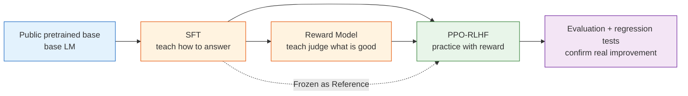

# The RLHF Pipeline

## Chapter Overview

**Core goals**

- Start from a public base model and explain why it is not yet a stable assistant.
- Run the classic three-stage RLHF pipeline end-to-end: SFT, Reward Model, PPO.
- Build an evaluation loop that can catch reward hacking, capability regression, length inflation, and template collapse.
- Understand how small TRL experiments map onto larger-scale systems such as OpenRLHF and NeMo RL / NeMo Aligner.

**Core formulas**

$$
\mathcal{L}_{SFT}
=-\mathbb{E}_{(x,y)\sim\mathcal{D}_{SFT}}
\left[\log \pi_\theta(y\mid x)\right]
\quad \text{(SFT: imitate high-quality assistant answers)}
$$

$$
\mathcal{L}_{RM}
=-\mathbb{E}_{(x,y_w,y_l)\sim\mathcal{D}_{pref}}
\left[\log\sigma(r_\phi(x,y_w)-r_\phi(x,y_l))\right]
\quad \text{(RM: learn reward from preferences)}
$$

$$
R_{PPO}(x,y)
=r_\phi(x,y)-\beta D_{KL}(\pi_\theta(\cdot\mid x)\|\pi_{ref}(\cdot\mid x))
\quad \text{(PPO-RLHF: optimize reward, but stay close to SFT)}
$$

## Why These Formulas Matter

In Chapter 7, we discussed PPO in classic RL environments: policy updates, advantage estimation, clipping, and stability. In this chapter we reuse the same language, but the objects change their clothing:

- the prompt is the start state,
- tokens are actions,
- a full response is a trajectory,
- a reward model becomes the reward function,
- and a frozen reference model is the anchor used by the KL constraint.

The three formulas above answer three sequential questions:

1. How do we make the model behave like an assistant at all? (SFT)
2. How do we convert human preference into a trainable scalar signal? (RM)
3. How do we improve under that signal without drifting into nonsense? (PPO with KL + clipping)

## Scope Boundary

RLHF does not include training a language model from scratch. Pretraining is the starting artifact, not the content of RLHF itself.

In practice we begin from a released base checkpoint such as:

- `HuggingFaceTB/SmolLM2-360M`
- `Qwen/Qwen2.5-0.5B`
- `EleutherAI/pythia-410m`

These models have learned next-token prediction, but they are not yet optimized to follow instructions, admit uncertainty, refuse harmful requests, or match human preferences in a stable way.

The methodology in this chapter follows OpenAI's InstructGPT: first use supervised fine-tuning (SFT) to teach the model to follow instructions, then train a Reward Model (RM) from preference data, and finally optimize the policy with PPO using the RM's signal. Small-scale experiments run on Hugging Face TRL; large-scale extensions reference frameworks like OpenRLHF and NVIDIA NeMo RL / NeMo Aligner.



## RL Language Echoes

In Chapter 3, we described sequential decision-making with the MDP tuple:

$$
\mathcal{M}=\langle \mathcal{S},\mathcal{A},P,R,\gamma\rangle
$$

In LLM RLHF, these objects change their clothing:

| MDP Object          | CartPole                       | LLM RLHF                                |
| ------------------- | ------------------------------ | --------------------------------------- |
| State $s_t$         | cart position, velocity, angle | prompt plus generated tokens            |
| Action $a_t$        | push left / push right         | next token                              |
| Policy $\pi_\theta$ | control network                | language model                          |
| Reward $R$          | +1 for survival                | RM score, rule reward, human preference |
| Episode             | one game until pole falls      | one response from start to EOS          |

RLHF is not "forcing RL onto LLMs." It treats LLM generation as a high-dimensional sequential decision problem. The difference: CartPole rewards come from environment rules; LLM rewards come from human preferences or a reward model. CartPole gives feedback at every step; LLM usually gets feedback only after the full response.

This chapter will repeatedly use Chapter 3's language to explain large-model alignment: SFT is behavior cloning, RM is learning reward from preferences, and PPO is KL-constrained policy optimization.

## A Mental Model: RLHF as an Artifact Pipeline

The real unit of work in RLHF is not a training script. It is a pipeline of artifacts:

```text
data -> model -> evaluation -> failure cases -> data ...
```

If you cannot trace which dataset, which checkpoint, and which evaluation produced a claimed improvement, you do not have an RLHF pipeline. You have a one-off experiment.

## Roadmap

| Section                                                               | Core question                                             | Deliverable                               |
| --------------------------------------------------------------------- | --------------------------------------------------------- | ----------------------------------------- |
| [8.1 From Base Model to Aligned Assistant](./base-model-to-assistant) | What does a base model miss?                              | base vs SFT vs RLHF comparison            |
| [8.2 The RLHF Pipeline](./standard-rlhf-pipeline)                     | What are the inputs/outputs of SFT -> RM -> PPO?          | artifact checklist + flow diagram         |
| [8.3 SFT Instruction Tuning](./imitation-learning-pipeline)           | How do we build SFT and preference data?                  | data pipeline and masking rules           |
| [8.4 Reward Models](./reward-function-design)                         | How do we turn preferences into reward?                   | RM loss + metrics + failure modes         |
| [8.5 PPO-RLHF](./ppo-rlhf-loop)                                       | How do Actor/Ref/RM/Critic work together?                 | the four-model loop + how to read metrics |
| [8.6 Evaluation](./evaluation)                                        | How do we prove we improved without cheating the RM?      | evaluation gate and badcase loop          |
| [8.7 Hands-On: veRL + GSM8K](./verl-ppo-gsm8k)                        | How does the pipeline look in an industrial framework?    | an end-to-end PPO experiment              |
| [8.8 Extended Practice](./extended-practice)                          | What does reward hacking look like in a controlled setup? | a repeatable debugging workflow           |

## 8.6 Why Evaluation Is Mandatory

RLHF can easily create an illusion: training logs look good, but the model has actually gotten worse. Rising RM scores may mean the model has learned to game the RM. Longer answers may be misjudged as more helpful. Higher win rates on preference data may come with degraded math, code, or factual accuracy.

This is why evaluation in this chapter is not optional — it is part of the RLHF pipeline. Section 8.6 uses three layers of evaluation:

- **Automated benchmarks**: fixed task sets checking whether general and domain-specific capabilities have regressed (instruction following, reasoning, factual QA, format compliance).
- **Preference evaluation**: pairwise battles between base / SFT / RLHF answers, judged by humans or strong models.
- **Manual spot-checks**: small-scale but high-quality sample review, focusing on reward hacking, length inflation, empty templates, safety regression, and factual hallucination.

A qualified RLHF experiment cannot just report "reward went up." It must answer at least three questions: is the model more aligned with human preferences? Has existing capability noticeably regressed? Are high-scoring answers actually usable?

## Boundary with Chapter 9

This chapter covers the **classical RLHF standard pipeline**. Chapter 9 departs from this pipeline and explains why modern post-training has progressively simplified it:

- DPO tries to eliminate the explicit Reward Model.
- GRPO tries to eliminate the Critic.
- RLVR replaces subjective preferences with verifiable rewards.
- DAPO, RLAIF, distillation, and data flywheels further change how training signals are sourced and scaled.

In other words, Chapter 8 is the "standard answer," and Chapter 9 is the "modern evolution." Run the standard RLHF pipeline first, then understand why people are reforming it, and the whole arc of large-model reinforcement learning will make sense.

When you are ready, we start from the first step: why a pretrained base model is not yet an assistant — [From Base Model to Aligned Assistant](./base-model-to-assistant).

## Learning Objectives

After reading this chapter, you should be able to:

- Describe LLM generation in RL terms: states, actions, policy, reward, and trajectories.
- Explain what each of the three stages — SFT, Reward Model, PPO-RLHF — solves.
- Write the Bradley-Terry reward model loss by hand, and explain what margin, accuracy, and reward calibration each measure.
- Read PPO-RLHF training logs and distinguish genuine improvement from reward hacking.
- Map the relationship between small TRL experiments, mid-scale OpenRLHF training, and large-scale NeMo RL / NeMo Aligner training.
