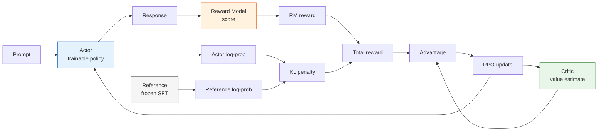
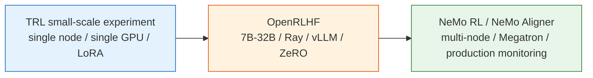

# 8.5 PPO-RLHF

## Reading Guide

**Core points**

- Understand why PPO-RLHF uses four roles: Actor, Reference, Reward Model, and Critic.
- Map classic PPO concepts to LLM training: KL penalty, token-level reward, advantage estimation, clipping.
- Learn to read PPO-RLHF training curves correctly: track reward, KL, length, entropy, and value loss together.

**Core formulas**

$$
r_t =
\begin{cases}
-\beta(\log \pi_\theta(y_t\mid s_t)-\log \pi_{ref}(y_t\mid s_t)), & t<T \\
r_{RM}(x,y)-\beta(\log \pi_\theta(y_t\mid s_t)-\log \pi_{ref}(y_t\mid s_t)), & t=T
\end{cases}
\quad \text{(RLHF token reward: per-step KL, RM score at the end)}
$$

$$
\rho_t(\theta)=\frac{\pi_\theta(y_t\mid s_t)}{\pi_{\theta_{old}}(y_t\mid s_t)}
\quad \text{(new vs old policy probability ratio)}
$$

$$
\mathcal{L}_{clip}(\theta)
=-\mathbb{E}_t\left[
\min(\rho_t A_t,\ \mathrm{clip}(\rho_t,1-\epsilon,1+\epsilon)A_t)
\right]
\quad \text{(PPO clipped objective)}
$$

> Keep one sentence in mind:
>
> PPO-RLHF is not "maximize reward without constraints." It is "nudge up the probability of high-quality responses while the Reference model anchors, PPO clipping limits step size, and the Critic reduces variance."

With an SFT model and a reward model in hand, the classic RLHF final stage is to optimize the policy using PPO. In an InstructGPT-style pipeline, PPO is not "one model training itself." It is a collaboration of four roles:

| Role                 | Source                       | Purpose                                 |
| -------------------- | ---------------------------- | --------------------------------------- |
| Actor                | continued training from SFT  | generates responses and is updated      |
| Reference            | frozen SFT checkpoint        | provides KL constraint to prevent drift |
| Reward model         | trained on preferences       | scores the full response                |
| Critic / value model | often initialized from Actor | estimates values to reduce variance     |



## Turning an LLM Response into a Trajectory

In Chapter 3, an RL trajectory looks like:

$$
s_0,a_0,r_0,s_1,a_1,r_1,\ldots
$$

In an LLM, once the prompt is fixed, generating a response is also a trajectory:

```text
s_0 = prompt
a_0 = token 1
s_1 = prompt + token 1
a_1 = token 2
...
s_T = prompt + full response
```

Actions are tokens, and the policy is the language model:

$$
\pi_\theta(a_t\mid s_t)=P_\theta(y_t\mid x,y_{<t})
$$

Unlike CartPole, LLMs usually do not receive a human reward for every token. The Reward Model typically produces a single score $r_{RM}(x,y)$ after the full response is complete. To enable token-level PPO updates, engineering practice splits the reward into two parts:

1. Every token gets a KL penalty to prevent drift from the reference.
2. The final token or EOS position receives the RM's sequence-level reward.

This is the token reward formula at the top of this section. It looks complicated, but the intuition is simple:

> You can try to write better, but every step costs a bit for "drifting from the original SFT model"; only after the full answer is done does the judge give the total score.

### Token-Level vs Sequence-Level Policy Gradient Loss

This reward split raises a question: **at what granularity should the policy gradient loss be computed?**

Let us clarify what each granularity means.

**Sequence-level: the entire response shares one gradient signal.** After the model generates a complete response, the RM gives a total score $R$. This $R$ is distributed uniformly across every token in the response -- whether it is a critical digit in the solution or an irrelevant filler word, the gradient update magnitude is identical.

$$
\nabla_\theta J \approx \frac{1}{T}\sum_{t=1}^{T} R \cdot \nabla_\theta \log \pi_\theta(y_t\mid s_t)
$$

**Token-level: each token has an independent gradient signal.** Although the reward is still concentrated at the end, the Critic estimates a value at each position, computes an independent advantage $A_t$ for each token, and updates with the PPO clipped objective:

$$
\mathcal{L}_{clip}(\theta) = -\frac{1}{T}\sum_{t=1}^{T}\min(\rho_t A_t,\ \mathrm{clip}(\rho_t,1-\epsilon,1+\epsilon)A_t)
$$

A concrete example. The user asks "What is 3 + 3 \* 6?", and the model generates 5 tokens:

```text
The  answer  is  2  1
t1   t2      t3  t4  t5
```

The RM gives a positive score $R = +1.5$.

- **Sequence-level approach**: every token's gradient is multiplied by $R = +1.5$. t4's "2" and t1's "The" get exactly the same update magnitude.
- **Token-level approach**: the model independently evaluates "how much did each token contribute to the final score." "21" directly determines whether the answer is right, so its contribution is largest and its gradient update is strongest; "The answer is" is just boilerplate -- replacing it with different phrasing would not affect the score, so its gradient update is weak. The model concentrates learning effort on the tokens that truly matter.

This distinction is not obvious in CartPole (every action directly affects the cart), but it is critical for LLMs: a response is typically tens to hundreds of tokens, and only a few truly determine quality. If all tokens are updated equally, the gradient signal is diluted by a mass of irrelevant tokens.

| Dimension           | Sequence-level                              | Token-level                                    |
| ------------------- | ------------------------------------------- | ---------------------------------------------- |
| Gradient signal     | all tokens share the same $R$               | each token has an independent $A_t$            |
| Credit assignment   | cannot distinguish key vs irrelevant tokens | distinguishes contributions via GAE backprop   |
| Learning efficiency | low: many tokens updated equally            | high: key tokens get stronger gradient signals |
| Typical methods     | REINFORCE                                   | PPO, GRPO                                      |

**The finer the granularity, the more the model can distinguish which decisions truly matter, and the higher the learning efficiency.** Later, GRPO (Chapter 9) and Agentic RL (Chapter 10) will further exploit this property on longer, more complex trajectories.

#### Current research consensus

Academia and industry have reached a fairly clear conclusion on this question:

- **Token-level outperforms sequence-level.** TDPO's experiments show that token-level DPO significantly outperforms standard DPO on long-text generation tasks. ReMax proves from a credit assignment perspective that sequence-level REINFORCE's gradient signal is diluted by irrelevant tokens, which is an important reason for low sample efficiency.
- **Credit assignment is the core difficulty.** The reward usually only gives one total score for the entire response. How to distribute this score reasonably across tokens is the key to token-level methods. PPO uses Critic + GAE to estimate each token's advantage; GRPO uses within-group relative ranking to replace the Critic. Both aim at more precise credit assignment.
- **The longer the sequence, the greater the advantage of token-level.** DeepSeekMath found in mathematical reasoning scenarios that the longer the reasoning chain, the more the sequence-level method's gradient signal is diluted, and the more pronounced the benefit of token-level methods. This is also one of the reasons GRPO performs well on long reasoning tasks.
- **Practical advice.** If training resources are limited and responses are short (e.g., single-turn Q&A), sequence-level and token-level differences are small. If responses are long (e.g., reasoning chains, multi-turn dialogue), prefer token-level methods. Current mainstream open-source frameworks (TRL, OpenRLHF, veRL) all default to token-level policy gradient loss.

::: details Code-level difference

The core difference between sequence-level and token-level is one line: **how advantages are computed**.

```python
# ---------- Sequence-level ----------
# The entire response shares one reward; all tokens get the same advantage
reward = rm_score - beta * kl_sum          # scalar
advantages = torch.full_like(logprobs, reward)  # fill every token with the same value

loss_seq = -(advantages * logprobs).mean()

# ---------- Token-level ----------
# First compute each token's value with the Critic, then use GAE to get per-token advantages
values = critic(prompt, response)          # [seq_len]
rewards = build_token_rewards(rm_score, kl_per_token)  # add rm_score at the last token
advantages = compute_gae(rewards, values)  # one independent advantage per token

loss_token = -(advantages * logprobs).mean()
```

Sequence-level does not need a Critic; it simply broadcasts the total reward to every position. Token-level adds a GAE computation step but gives each token a different advantage value.
:::

::: details Backpropagation differences

Both methods have the same backpropagation path -- both compute gradients from `loss.backward()` to update Actor parameters. The difference lies in **the intensity distribution of gradient signals**.

Suppose the response has $T$ tokens. Each token's policy gradient is approximately:

$$
\Delta\theta_t \propto A_t \cdot \nabla_\theta \log \pi_\theta(y_t \mid s_t)
$$

- **Sequence-level**: $A_t = R$ is the same for all $t$. Gradient updates are evenly distributed across parameters corresponding to all tokens.
- **Token-level**: $A_t$ varies by position. Tokens closer to the reward source (e.g., the final numeric answer) have larger $A_t$ and stronger gradient updates; prefix tokens far from the reward have smaller $A_t$ and weaker gradient updates.

From a parameter perspective, the lower layers of the language model are shared across all tokens. Sequence-level methods cause the lower layers to receive a gradient averaged over all tokens; token-level methods cause the lower-layer gradient to be biased toward the direction of key tokens. This is the concrete meaning of "more refined gradient signals" in backpropagation.
:::

::: details Further reading: papers on token-level policy gradients

- **InstructGPT** (Ouyang et al., 2022) -- [arxiv.org/abs/2203.02155](https://arxiv.org/abs/2203.02155). The classic work applying PPO to RLHF. Reward is sequence-level, but the policy gradient loss is computed at the token level. This is the standard industrial practice for token-level policy gradients.
- **DeepSeekMath** (Shao et al., 2024) -- [arxiv.org/abs/2402.03300](https://arxiv.org/abs/2402.03300). Proposes GRPO and analyzes the importance of token-level credit assignment for long reasoning chains in mathematical reasoning.
- **TDPO** (Zeng et al., 2024) -- [arxiv.org/abs/2404.11999](https://arxiv.org/abs/2404.11999). Token-level Direct Preference Optimization. Section 3 provides a clear mathematical comparison of token-level vs sequence-level losses.
- **ReMax** (Li et al., 2024) -- [arxiv.org/abs/2310.10505](https://arxiv.org/abs/2310.10505). Discusses the difference between token-level and sequence-level credit assignment, and proposes an improved REINFORCE-based method.
- **Sutton & Barto, _Reinforcement Learning: An Introduction_** Chapter 13 -- [incompleteideas.net/book](http://incompleteideas.net/book/the-book.html). Per-time-step derivation of policy gradients, the theoretical foundation for token-level policy gradients.
  :::

## One PPO-RLHF Update Step

The core PPO-RLHF loop can be broken into six steps:

1. Sample a batch of prompts from the prompt dataset.
2. Actor generates responses.
3. Reward Model scores the responses.
4. Reference computes log-probs for the same responses, producing the KL penalty.
5. Critic estimates values and, together with total reward, computes advantages.
6. PPO updates Actor and Critic using the clipped objective.

```python
# ==========================================
# PPO-RLHF training loop: conceptual version
# ==========================================
for batch in prompt_dataloader:
    prompts = batch["prompt"]

    # 1. Actor generates responses
    responses, actor_logprobs = actor.generate_with_logprobs(prompts)

    # 2. Reward Model scores
    rm_scores = reward_model.score(prompts, responses)

    # 3. Reference computes KL
    ref_logprobs = reference_model.logprobs(prompts, responses)
    kl_penalty = actor_logprobs - ref_logprobs

    # 4. Total reward = RM score - KL penalty
    rewards = rm_scores - beta * kl_penalty

    # 5. Critic estimates advantages
    values = critic.value(prompts, responses)
    advantages, returns = compute_gae(rewards, values)

    # 6. PPO updates Actor and Critic
    ppo_update(
        actor=actor,
        critic=critic,
        prompts=prompts,
        responses=responses,
        old_logprobs=actor_logprobs,
        advantages=advantages,
        returns=returns,
    )
```

This code omits many engineering details, but it captures the essence of classic RLHF: the Reward Model provides direction, the Reference anchors the boundary, the Critic reduces variance, and PPO controls the update magnitude.

### Hand-calculate one token's KL penalty

Suppose at some position, the Actor and Reference log-probs for the actually generated token are:

$$
\log \pi_\theta(y_t\mid s_t)=-1.2,\qquad
\log \pi_{ref}(y_t\mid s_t)=-1.6
$$

The Actor prefers this token more than the Reference, because $-1.2$ corresponds to a higher probability. The KL approximation term is:

$$
\log \pi_\theta-\log \pi_{ref}=0.4
$$

If $\beta=0.05$, this step's KL penalty is:

$$
-\beta \cdot 0.4 = -0.02
$$

If the RM gives $1.3$ for the entire response, the total reward can be understood as:

```text
Every preceding token: only KL deduction
Final EOS token: RM score - last-step KL
```

This is why RLHF reward curves must be read alongside KL. Actor score going up could mean the responses are genuinely better, or it could mean it is drifting further from the reference.

## The PPO Update Objective

For every generated token, PPO compares "the probability under the old policy" with "the probability under the current new policy." The ratio is:

$$
\rho_t(\theta)=\frac{\pi_\theta(y_t\mid s_t)}{\pi_{\theta_{old}}(y_t\mid s_t)}
$$

If advantage $A_t>0$, this token's trajectory is better than the Critic expected, so PPO wants to increase its probability. If $A_t<0$, it is worse than expected, so PPO wants to decrease it.

But it cannot increase or decrease without limit, so clipping is applied:

| Case    | What PPO wants to do       | What clipping does                                |
| ------- | -------------------------- | ------------------------------------------------- |
| $A_t>0$ | increase token probability | stop pushing hard once ratio reaches $1+\epsilon$ |
| $A_t<0$ | decrease token probability | stop pushing hard once ratio reaches $1-\epsilon$ |

This is exactly the same intuition as Chapter 7 PPO. The only difference is that actions have changed from "LunarLander thrust direction" to "a token from the vocabulary."

### A minimal PPO numerical example

Suppose a token's old probability is $0.10$ and new probability is $0.13$:

$$
\rho=\frac{0.13}{0.10}=1.3
$$

Clip range is $\epsilon=0.2$, so the upper bound is $1.2$. If this token's advantage is $A=2$:

$$
\rho A=1.3\times2=2.6
$$

After clipping:

$$
\mathrm{clip}(\rho,0.8,1.2)A=1.2\times2=2.4
$$

PPO takes the smaller value $2.4$, telling the optimizer: this token is indeed good, but the probability has already increased enough this step; do not push harder.

Without this clipping, LLM PPO can easily push certain template tokens' probabilities too high due to a few high-reward samples, causing output collapse.

## Training Instability in PPO-RLHF

PPO-RLHF is more fragile than standard supervised fine-tuning, and not just because "there are more hyperparameters." It has three structural risks:

| Risk                          | What happens                                                                                | What you see in training                                      |
| ----------------------------- | ------------------------------------------------------------------------------------------- | ------------------------------------------------------------- |
| non-stationary data           | every Actor update changes the next batch's response distribution                           | reward / KL / length curves pulling against each other        |
| RM out-of-distribution errors | the policy actively searches for regions the RM has not seen but scores highly              | reward rises but human-perceived quality drops                |
| reference drift               | Actor drifts too far from SFT reference, losing original language and instruction abilities | output becomes longer, repetitive, templated, or even garbled |

So the PPO-RLHF training objective is not "make reward go up as fast as possible." It is to let reward slowly improve while KL, length, diversity, and regression evaluation all remain healthy.

## The Role of the Reference Model

If you only maximize RM score, the Actor will quickly drift away from the SFT model into regions the RM has not seen. In those regions, RM scores are no longer reliable. The model may produce very long, very empty, very templated, or even harmful responses that still get high scores.

The Reference provides a "do not stray too far from the original assistant" constraint:

$$
R_{total}(x, y) = r_{RM}(x, y) - \beta D_{KL}(\pi_\theta(y|x) \| \pi_{ref}(y|x))
$$

Here $\pi_{ref}$ is usually the frozen SFT model. Larger $\beta$ makes it harder for the Actor to drift from SFT; smaller $\beta$ allows more exploration but also more reward hacking.

The Reference is not a "conservative ornament." It is the safety rope at the RM's generalization boundary. The RM was trained on a particular response distribution, usually sampled from the SFT model or similar models. If the Actor drifts too far from that distribution, the RM enters out-of-distribution prediction territory. Out-of-distribution high scores are often the most dangerous, because PPO treats them as real rewards and amplifies them further.

You can think of $\beta$ as a dial:

| $\beta$   | Training behavior                         | Risk                                          |
| --------- | ----------------------------------------- | --------------------------------------------- |
| too large | KL stays very low, reward does not move   | cannot learn; RLHF degenerates toward SFT     |
| right     | reward slowly rises, KL stays stable      | healthy updates                               |
| too small | reward rises fast, KL goes out of control | reward hacking, garbled output, mode collapse |

## The Role of the Critic

PPO does not just ask "what score did this response get." It also asks "how much better is this response than the current average?" The Critic estimates values, which are used to compute advantages:

$$
A_t = R_t - V_\phi(s_t)
$$

Without the Critic, reward signal variance would be much larger and training more unstable. Later, GRPO will try to replace the Critic with within-group relative scores, but in classic RLHF the Critic is an important component of the PPO stage.

More precisely, PPO-RLHF typically uses GAE to estimate advantages. It first computes TD error:

$$
\delta_t = r_t + \gamma V(s_{t+1}) - V(s_t)
$$

Then accumulates a weighted sum of TD errors over multiple time steps:

$$
A_t^{GAE} = \sum_{l=0}^{\infty}(\gamma\lambda)^l\delta_{t+l}
$$

This is the same machinery as in Chapters 6 and 7 on Actor-Critic / PPO. In the LLM setting, states are contexts, actions are tokens, rewards are mostly concentrated at the end, but advantage estimation still propagates along the token sequence.

Critic quality also needs monitoring. If value predictions are poor, advantages will be noisy. If value loss explodes, Actor updates usually become unstable as well.

## Mapping to TRL Concepts

In small-scale TRL experiments, you do not necessarily need to write four model classes by hand, but you should understand the role behind each config item:

| TRL concept                     | RLHF role           |
| ------------------------------- | ------------------- |
| policy model                    | Actor               |
| ref model                       | Reference           |
| reward model or reward function | Reward Model        |
| value head                      | Critic              |
| `kl_coef` / `target_kl`         | KL constraint       |
| `ppo_epochs` / `cliprange`      | PPO update strength |

The goal of small-model experiments is not to achieve the best performance, but to let you truly see how the four roles work together. Large-scale frameworks just split the same structure into distributed services.

### Rollout batch vs PPO batch

PPO-RLHF often uses several batch concepts simultaneously, which can be confusing:

| Name          | Meaning                                                    | Affects                               |
| ------------- | ---------------------------------------------------------- | ------------------------------------- |
| prompt batch  | how many prompts to generate from at once                  | rollout throughput                    |
| rollout batch | the set of prompt-response trajectories generated by Actor | reward / KL statistics                |
| mini-batch    | small batches used during PPO updates                      | gradient stability                    |
| PPO epochs    | how many times to reuse the same rollout batch             | sample efficiency vs overfitting risk |

The key property of on-policy PPO is: rollouts come from the current or very recent policy. You cannot reuse old data indefinitely. When `ppo_epochs` is too large, it looks like "more thorough training," but in practice it can cause the policy to overfit on old rollouts, breaking the on-policy assumption.

## Training Stability Toolbox

The difficulty of PPO-RLHF is not just "can you update," but "don't crash after updating." Stability and reward hacking should be monitored together as part of the PPO main loop:

| Tool                             | Purpose                                                | Key observation                         |
| -------------------------------- | ------------------------------------------------------ | --------------------------------------- |
| KL penalty                       | prevent Actor from drifting too far from SFT reference | is `kl_mean` outside the target range?  |
| adaptive `beta`                  | tighten when KL is high, relax when KL is low          | is reward completely suppressed by KL?  |
| learning rate warmup             | avoid overly aggressive gradients early in training    | are loss / grad norm abnormal?          |
| gradient clipping                | prevent explosions from extreme samples                | are there spikes in `grad_norm`?        |
| reward normalization             | control RM score scale                                 | is the reward distribution drifting?    |
| length and repetition monitoring | catch reward hacking                                   | response length, n-gram repetition rate |

Healthy PPO-RLHF usually does not show reward skyrocketing. Instead, reward rises slowly, KL stays in the target range, response length shows no anomalous growth, and output diversity does not drop noticeably. Whenever "reward rises but length and repetition rate spike together," pause training first and go back to check RM data and reward design.

The order of these tools matters too. KL penalty is the first boundary. Warmup and gradient clipping ensure updates do not explode at the start. Reward normalization controls the RM score scale. Length and repetition monitoring catches reward hacking. A common adaptive KL rule:

```python
def update_kl_coef(beta, observed_kl, target_kl, horizon=1000):
    """Tighten when KL exceeds target, relax when below."""
    error = (observed_kl - target_kl) / max(target_kl, 1e-8)
    multiplier = 1.0 + error / horizon
    return max(0.0, beta * multiplier)
```

Here, bigger `beta` is not always safer. When too large, the Actor is held back by the reference and reward cannot improve. When too small, the Actor quickly explores into the RM's blind spots. In actual training, watch `reward_mean`, `kl_mean`, `response_length`, `entropy`, and the fixed regression set simultaneously, not just the reward curve.

Common failure modes can be quickly mapped to fixes:

| Failure symptom                | Possible cause                       | How to check                           | Fix                                                      |
| ------------------------------ | ------------------------------------ | -------------------------------------- | -------------------------------------------------------- |
| Loss becomes NaN               | gradient explosion / LR too large    | check gradient norms                   | lower LR, increase gradient clipping                     |
| Reward does not move           | LR too small or KL penalty too large | check KL divergence changes            | lower `beta` or increase LR                              |
| Model outputs garbled text     | severe reference drift               | check if KL is anomalously large       | increase `beta`, lower LR                                |
| Mode collapse                  | policy entropy too low               | check entropy and repetition rate      | add entropy regularization, lower LR                     |
| Reward rises but quality drops | reward hacking                       | manual spot-check and judge comparison | multi-dimensional rewards, adversarial data augmentation |
| Responses keep getting longer  | length hack                          | check length-reward correlation        | add length penalty, recalibrate RM                       |

## Reading Training Logs

The most easily misread curve in PPO-RLHF is reward. Healthy training usually does not show reward shooting to the sky. Instead, multiple metrics maintain a productive tension:

| Metric            | Healthy signal                           | Danger signal                           |
| ----------------- | ---------------------------------------- | --------------------------------------- |
| `reward_mean`     | slowly rising                            | rising fast but human quality drops     |
| `kl_mean`         | fluctuating around target range          | continuously rising or approaching 0    |
| `response_length` | stable or naturally varying by task      | spiking together with reward            |
| `entropy`         | slowly decreasing but not collapsed      | dropping very fast to near zero         |
| `value_loss`      | controlled fluctuation                   | exploding or never decreasing           |
| `clip_fraction`   | some fraction being clipped              | approaching 0 or persistently very high |
| `judge_win_rate`  | small-sample win rate gradually improves | diverging from RM reward                |

Two typical reading patterns:

**Case 1: reward rises, KL stable, length stable, win rate improves.**
This is the healthiest signal, meaning the Actor found better responses near the reference.

**Case 2: reward rises, KL rises, length spikes, manual quality drops.**
This is not "just keep training." It is reward hacking. Pause PPO and go back to check RM data, length penalties, and adversarial samples.

## Minimal Tuning Order

If PPO-RLHF is unstable, do not tweak all parameters at once. Follow this order:

1. **Fix generation parameters first**: temperature, top_p, max_new_tokens should not drift between experiments.
2. **Check RM score scale**: are mean and variance reasonable, does it need standardization?
3. **Tune KL coefficient `beta`**: get `kl_mean` back into the target range.
4. **Tune learning rate and batch**: if loss NaN or KL spikes, lower LR first, add gradient clipping.
5. **Watch length and repetition rate**: if reward is strongly correlated with length, fix the reward first, do not just tune PPO.
6. **Run fixed evaluation set**: compare every checkpoint with the same prompt set.

The core of this sequence is: confirm "reward is trustworthy" and "boundaries are stable" before chasing higher reward.

## From Small Models to Large

The algorithmic structure of PPO-RLHF is the same on small and large models. The difference is that large-model training requires scaling this simple pipeline into a distributed system.

This chapter's small-scale experiments use TRL so you can see the full RLHF structure on a single consumer GPU. But industrial training cares about a different question: when the model scales from 360M or 0.5B to 7B, 32B, 70B, or larger, can this pipeline still run?

The answer is: **the algorithmic structure stays basically the same; the systems engineering gets much heavier.**



### Small-scale version (TRL)

The most important value of small-scale experiments is understandability. You can directly see how SFT changes a base model into an assistant, how the Reward Model learns preference ordering from chosen/rejected pairs, and how the PPO stage simultaneously uses Actor, Reference, Reward Model, and Critic.

The most appropriate stack here is `transformers`, `datasets`, `peft`, `trl`, `accelerate`. Models can be small base models like `HuggingFaceTB/SmolLM2-360M`, `Qwen/Qwen2.5-0.5B`, or `EleutherAI/pythia-410m`.

At the small-scale stage, make sure you have run through all of these:

| Question                                | Pass criterion                                              |
| --------------------------------------- | ----------------------------------------------------------- |
| Does SFT actually change base behavior? | fixed-prompt comparison clearly more assistant-like         |
| Can RM distinguish chosen/rejected?     | held-out accuracy and margin are reasonable                 |
| Is PPO stable?                          | reward slowly rises, KL and length do not go out of control |
| Is evaluation reproducible?             | same checkpoint re-run gives similar results                |
| Can badcases be replayed?               | failure samples can feed into the next data round           |

If these questions are not resolved at 0.5B, going straight to 7B will only multiply debugging cost tenfold.

### Mid-scale version (OpenRLHF)

When the model reaches 7B+, the bottleneck shifts from "can you write the code" to "can rollout and training throughput keep up." PPO-RLHF requires the model to repeatedly generate responses, have the RM score them, then go back to training. This generate-train loop is very taxing on ordinary training frameworks.

Frameworks like OpenRLHF package several systems solutions:

| Problem                | Small-scale TRL             | Large-scale OpenRLHF approach                        |
| ---------------------- | --------------------------- | ---------------------------------------------------- |
| rollout speed          | direct `generate`           | vLLM / Ray for high-throughput generation            |
| VRAM pressure          | LoRA or single GPU          | ZeRO, tensor parallelism, pipeline parallelism       |
| multi-model scheduling | same process, fairly simple | separate Actor, RM, Critic, Ref deployment           |
| data flow              | Python loop                 | distributed queues and rollout buffers               |
| monitoring             | local logs                  | experiment platform, checkpointing, failure recovery |

### Large-scale version (NeMo)

At 70B+, the training framework needs to be not only runnable but also recoverable, observable, and reproducible. NVIDIA NeMo RL / NeMo Aligner is closer to a production training perspective: multi-node multi-GPU, Megatron/FSDP, distributed checkpointing, mixed precision, model parallelism, data parallelism, and full monitoring must all be considered together.

The hardest part of large-scale RLHF is usually not the PPO formula, but the cost of keeping four models resident (Actor, Reference, Reward Model, Critic all consume VRAM or inference resources), switching between generation and training, reward model throughput, KL and length monitoring, checkpoint and recovery, and the evaluation loop.

Classic PPO-RLHF involves at least four model roles:

| Role         | Needs gradients? | Resource characteristics                           |
| ------------ | ---------------- | -------------------------------------------------- |
| Actor        | yes              | heaviest; used for both training and generation    |
| Critic       | yes              | can share backbone with Actor, or be independent   |
| Reference    | no               | frozen inference, but needs log-prob computation   |
| Reward Model | no               | frozen inference; throughput may become bottleneck |

This means "training a 7B model" does not mean only one 7B in VRAM. Even though Reference and RM are frozen, they still consume inference resources. Industrial systems make many engineering tradeoffs: Actor and Critic share a base with only an added value head; Reference uses a frozen copy of the same base with offloading when necessary; RM uses a smaller model or is deployed as a service; rollout and PPO update phases share GPUs but must handle switching overhead.

### Framework selection

| Scale   | Recommended route                                                     |
| ------- | --------------------------------------------------------------------- |
| 135M-1B | TRL, prioritize understanding the pipeline                            |
| 1B-7B   | TRL + Accelerate / DeepSpeed, can continue with LoRA                  |
| 7B-32B  | OpenRLHF, focus on rollout and distributed training                   |
| 70B+    | NeMo RL / NeMo Aligner, focus on multi-node and production monitoring |

Do not adopt a heavy framework too early. If you have not run SFT, RM, PPO, and evaluation on a small model, going straight to 7B/70B will only mix algorithmic problems with systems problems.

### Mapping small experiments to large-scale engineering

| This chapter's small experiment | Large-scale training counterpart                                               |
| ------------------------------- | ------------------------------------------------------------------------------ |
| `SFTTrainer`                    | distributed SFT, usually with LoRA, FSDP, ZeRO, or Megatron                    |
| `RewardTrainer`                 | distributed RM training, with separate RM accuracy / margin validation         |
| `PPOTrainer`                    | Actor-RM-Critic-Ref distributed PPO system                                     |
| local JSON preference data      | annotation platform, data versioning, quality audit, dedup and decontamination |
| simple judge prompt             | multi-judge, multi-dimensional rubric, human arbitration                       |
| local evaluation script         | automated benchmark, A/B test, red-teaming, safety regression                  |

This table makes one point: small-model experiments are not toys. They are a microcosm of large-scale training. As long as you understand the role of each artifact, you will not get lost when switching to a large-scale framework.

## Section Summary

The PPO stage of classic RLHF can be compressed into one sentence: **let the Actor pursue the RM's preference reward, while the Reference and PPO constraints prevent it from drifting, and the Critic reduces update noise.**

Small-scale experiments run with TRL; large-scale training scales with OpenRLHF or NeMo RL -- the algorithmic structure does not change, but systems engineering gets heavier.

Once the PPO-RLHF training loop is built, you cannot just check whether reward is rising. The next section uses benchmarks, preference evaluation, and manual review to confirm the model truly improved, and specifically checks for reward hacking and capability regression -- [Evaluation](./evaluation).

## Exercises

1. Suppose Actor log-prob is -2.0, Reference log-prob is -2.4, $\beta=0.1$. Hand-calculate this token's KL penalty.
2. Why can't `ppo_epochs` be increased without limit? Explain from the on-policy perspective.
3. Design a training log table with at least reward, KL, length, entropy, and judge win rate columns.
4. Draw your own RLHF system diagram, labeling which GPU or process hosts the Actor, Reference, RM, and Critic respectively.
5. Write a checklist for migrating from a 0.5B TRL experiment to 7B OpenRLHF.
