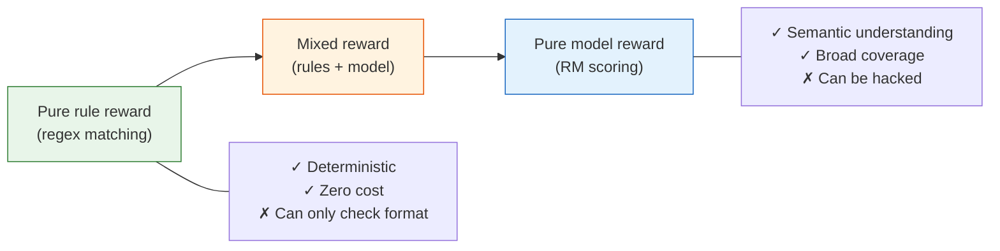

# 8.4 Reward Models

## Reading Guide

**Core points**

- Understand why the reward model is the "judge" in RLHF, and how it differs from an ordinary classifier.
- Master Bradley-Terry preference modeling, pairwise loss, margin, accuracy, and calibration.
- Learn how to combine RM scores into a mixed reward function, and how to recognize length hacking, template hacking, and out-of-distribution high scores.

**Core formulas**

$$
P(y_w \succ y_l \mid x)
= \sigma(r_\theta(x,y_w)-r_\theta(x,y_l))
\quad \text{(Bradley-Terry: larger score gap implies higher win probability for chosen)}
$$

$$
\mathcal{L}_{RM}
=-\mathbb{E}_{(x,y_w,y_l)}
\left[\log \sigma(r_\theta(x,y_w)-r_\theta(x,y_l))\right]
\quad \text{(RM pairwise loss)}
$$

$$
R_{total}(x,y)
= \hat r_{RM}(x,y)
+ \alpha R_{format}
+ \beta R_{correctness}
- \lambda R_{length}
- \eta R_{repeat}
\quad \text{(mixed reward: semantic reward + rule guardrails)}
$$

> **One sentence to remember**
>
> The reward model is not a "truth machine" — it is simply a judge trained from preference data. PPO will actively search for loopholes in it, so RM training and RM evaluation must be designed together.

In the previous section we prepared SFT data and preference data. Now we need to train the second key artifact of RLHF: the **reward model**. It takes a prompt and a response, and outputs a scalar score. This section opens that black box — how is the reward function designed, why is it designed that way, and what happens when the design is poor?

The reward function is the "objective function" of the entire RL system — it defines "what is good." The policy network does not care what you have in mind; it simply moves in the direction the reward function points. If the reward function says "more words is better," the model will produce long-winded responses. If the reward function says "including 'I'd be happy to help' is good," the model will append that pleasantry to every sentence. Designing a reward function is like giving instructions to an extremely obedient assistant with zero common sense — it will do exactly what you say, including every unintended side effect.

## 8.4.1 A Spectrum of Rewards

Reward functions are not a binary choice. They form a continuous spectrum from "pure rules" to "pure models":



**Pure rule rewards** are suited for tasks with objective ground-truth answers — whether the final answer to a math problem is correct, whether code runs, whether the output format is compliant. These rewards are fully deterministic and cannot be "hacked," but they can only check surface form and cannot evaluate semantic quality.

**Pure model rewards** mean training a reward model (RM): given $(prompt, response)$, it outputs a scalar score. The RM can understand semantics — it knows which is better between "helpful but blunt" and "polite but content-free." But the RM carries a fundamental risk: it is itself a model, and models can be adversarially exploited. This is the "reward hacking" problem we will discuss in detail later.

**Mixed rewards** are the most common approach in industry — use the RM for semantic judgment and use rules to cover dimensions the RM cannot capture. A typical mixed reward function looks like this:

$$R_{total} = R_{RM} + \alpha \cdot R_{format} + \beta \cdot R_{length} + \gamma \cdot R_{correctness}$$

where $\alpha, \beta, \gamma$ are hyperparameters that require tuning. $R_{format}$ checks format compliance, $R_{length}$ penalizes overly long or short answers, and $R_{correctness}$ verifies answers for questions with objective ground truth (math, code, etc.).

## 8.4.2 Bradley-Terry Model

The core task of a reward model is to learn a scoring function from human preference pairs. Given prompt $x$ and two responses $y_w$ (chosen) and $y_l$ (rejected), the human annotator judged $y_w$ as better than $y_l$. The RM needs to learn a function $r_\theta(x, y)$ such that $r_\theta(x, y_w) > r_\theta(x, y_l)$.

The Bradley-Terry model provides a probabilistic framework for this process:

$$P(y_w \succ y_l \mid x) = \sigma\left(r_\theta(x, y_w) - r_\theta(x, y_l)\right)$$

where $\sigma$ is the sigmoid function $\sigma(z) = \frac{1}{1 + e^{-z}}$. The intuition is clear: if the RM gives $y_w$ a much higher score than $y_l$, the probability of $y_w$ being chosen approaches 1; if the two scores are similar, the probability approaches 0.5.

The corresponding training loss is the negative log-likelihood:

$$\mathcal{L}_{RM} = -\mathbb{E}_{(x, y_w, y_l)} \left[ \log \sigma\left(r_\theta(x, y_w) - r_\theta(x, y_l)\right) \right]$$

Let us understand each term:

| Symbol               | Role              | Plain meaning                                                       |
| -------------------- | ----------------- | ------------------------------------------------------------------- |
| $r_\theta(x, y)$     | Reward function   | Assigns a score to a (question, answer) pair                        |
| $y_w$                | Chosen response   | The response annotators deemed better                               |
| $y_l$                | Rejected response | The response annotators deemed worse                                |
| $\sigma(\cdot)$      | Sigmoid           | Maps the score difference to a probability in $(0, 1)$              |
| $\log \sigma(\cdot)$ | Log-likelihood    | Optimization objective — makes the RM more likely to pick correctly |

```python
# ==========================================
# Reward Model Training: Bradley-Terry Loss
# ==========================================
import torch
import torch.nn as nn

class RewardModel(nn.Module):
    """Reward model: takes (prompt, response), outputs a scalar score."""
    def __init__(self, base_model, hidden_dim=1024):
        super().__init__()
        # Base model (typically the SFT model or a smaller pretrained model)
        self.base = base_model
        # Linear head on top of the last hidden state, outputting a scalar
        self.reward_head = nn.Linear(hidden_dim, 1)

    def forward(self, input_ids, attention_mask):
        # Take the last token's hidden state
        outputs = self.base(input_ids=input_ids, attention_mask=attention_mask)
        last_hidden = outputs.last_hidden_state[:, -1, :]  # (batch, hidden_dim)
        reward = self.reward_head(last_hidden)  # (batch, 1)
        return reward.squeeze(-1)


def bradley_terry_loss(rm, chosen_ids, chosen_mask, rejected_ids, rejected_mask):
    """Bradley-Terry preference loss."""
    r_chosen = rm(chosen_ids, chosen_mask)     # Score for chosen response
    r_rejected = rm(rejected_ids, rejected_mask)  # Score for rejected response

    # Core: make the chosen score higher than the rejected score
    loss = -torch.nn.functional.logsigmoid(r_chosen - r_rejected).mean()
    return loss
```

A few engineering details in this code are worth noting. First, the RM's base model is typically chosen to have the same architecture as the policy model but at a smaller scale — for example, a 7B policy might use a 3B RM. This is not because a larger RM would be worse, but because the RM needs to perform frequent inference during RL training (scoring at every step), and an oversized RM would severely slow down training. Second, the RM is typically fine-tuned from an SFT model rather than starting from a base model — the SFT model already understands the "response" format, and fine-tuning only needs to learn "which response is better."

### Computing Bradley-Terry Loss by Hand

The formula is straightforward, but it helps to work through it once manually. Suppose for the same prompt, the RM gives the chosen and rejected responses these scores:

$$
r_\theta(x,y_w)=2.0,\qquad r_\theta(x,y_l)=0.5
$$

The score difference is:

$$
\Delta r = 2.0 - 0.5 = 1.5
$$

The probability of the chosen response winning is:

$$
\sigma(1.5)=\frac{1}{1+e^{-1.5}}\approx 0.818
$$

The loss is:

$$
-\log 0.818 \approx 0.201
$$

This indicates the RM is fairly confident about this pair and in the correct direction. If it got the scores reversed — chosen score 0.5, rejected score 2.0:

$$
\Delta r=-1.5,\qquad \sigma(-1.5)\approx 0.182,\qquad -\log 0.182\approx 1.704
$$

The loss would be much larger, and the gradient would push the chosen score up and the rejected score down.

### Why Not Absolute Scoring?

You might ask: why not have annotators directly score responses from 1 to 10? The reason is that humans are very inconsistent with absolute scores. The same response might receive a 7 from one person and a 9 from another; even the same person might give different scores in the morning versus the evening. But humans are much better at relative judgments: is A better than B?

Preference modeling exploits exactly this strength:

| Annotation method      | Human consistency | Training signal                    | Main issue                             |
| ---------------------- | ----------------- | ---------------------------------- | -------------------------------------- |
| Absolute scoring       | Hard              | Regression scores                  | Annotator scale inconsistency          |
| Pairwise preference    | Easy              | Pairwise ranking                   | Can only compare same-prompt responses |
| Multi-response ranking | Moderate          | Can be split into preference pairs | Higher annotation cost                 |

In practice, a common annotation approach is to sample 4–9 responses per prompt, have annotators rank them, then split the rankings into multiple chosen/rejected pairs.

## 8.4.3 Reward Granularity

The RM assigns a single score to a response. How should that score be allocated? One score for the entire response, a separate score per token, or scores segmented by reasoning step? This is the question of reward granularity.

| Granularity    | Method                      | Pros                                   | Cons                                                       | Representative approach   |
| -------------- | --------------------------- | -------------------------------------- | ---------------------------------------------------------- | ------------------------- |
| Sequence-level | One score per response      | Simple, stable                         | Cannot distinguish which parts of a good response are good | PPO, GRPO                 |
| Step-level     | Segmented by reasoning step | Balance of granularity and feasibility | Requires step segmentation                                 | PRM (process supervision) |
| Token-level    | Independent score per token | Most fine-grained                      | High training cost, noisy signal                           | Early RLHF attempts       |

In practice, the most common choice is **sequence-level** combined with **rule-based augmentation**. Both PPO and GRPO default to assigning one overall reward score to the entire response, then supplementing token-level signals through rule rewards (e.g., format rewards that check whether each token conforms to a specific format).

Step-level rewards are a noteworthy direction, often referred to as Process Reward Models (PRMs) or process supervision. OpenAI compared outcome supervision and process supervision in their 2023 process supervision research, and released the PRM800K step-level feedback dataset. [^process_supervision] The intuition is easy to understand: if the final answer is wrong but some intermediate reasoning steps are correct, step-level rewards can reinforce those correct steps; sequence-level rewards would penalize the entire chain of reasoning.

```python
# ==========================================
# Reward computation at different granularities
# ==========================================
def sequence_reward(rm, prompt, response):
    """Sequence-level: one score for the entire response."""
    return rm.score(prompt, response)  # A scalar

def step_reward(rm, prompt, reasoning_steps):
    """Step-level: one score per reasoning step."""
    step_rewards = []
    for i, step in enumerate(reasoning_steps):
        # Score the cumulative content of the first i+1 steps
        partial = "\n".join(reasoning_steps[:i+1])
        step_rewards.append(rm.score(prompt, partial))
    return step_rewards  # A list

def combined_reward(rm, prompt, response, reasoning_steps):
    """Mixed: sequence-level RM + step-level rules."""
    r_rm = sequence_reward(rm, prompt, response)
    r_format = 0.2 if validate_format(response) else 0.0  # Format reward
    r_correct = 1.0 if check_answer_correct(prompt, response) else 0.0  # Correctness reward
    r_length = -0.01 * max(0, len(response) - 500)  # Length penalty

    return r_rm + r_format + r_correct + r_length
```

<details>
<summary>Exercise: Why is token-level reward rarely used in practice?</summary>

Token-level reward requires an independent score for every single token. In theory this is the most fine-grained — it can tell the model "the 3rd token was a good choice, the 7th token was a bad one." But in practice there are two fundamental difficulties:

First, **annotation cost**. Human annotators can rank entire responses ("A is better than B"), but they cannot provide fine-grained annotations per token ("is this token good or bad?"). This means token-level rewards almost always must be generated by a model, and the token-level signals produced by a model are themselves noisy.

Second, **credit assignment**. Whether a response is good or bad is typically the result of many tokens working together. Judging each token in isolation is very difficult — just as you cannot judge whether a dish tastes good by tasting each ingredient separately. Step-level rewards are a compromise: more fine-grained than sequence-level, while avoiding token-level's credit assignment problem.

</details>

### The Credit Assignment Problem in LLMs

Sequence-level RM has a fundamental difficulty: it only assigns a score after the response is complete. Suppose the model generates 200 tokens and the RM gives a low score. Which segment caused the low score?

| Possible cause                         | Location          | Can sequence reward pinpoint it? |
| -------------------------------------- | ----------------- | -------------------------------- |
| Misunderstood user intent at the start | First 20 tokens   | No                               |
| Skipped a reasoning step in the middle | Middle paragraphs | No                               |
| Final answer is wrong                  | End               | No                               |
| Overconfident tone                     | Entire response   | No                               |

This is one reason the Critic and advantage estimation in PPO-RLHF exist: they cannot perfectly solve credit assignment, but they can smooth the "is the whole response good or bad" signal back down to token-level updates. Later approaches like GRPO, RLVR, and process rewards are all essentially tackling this problem from different angles.

## 8.4.4 Rule Rewards vs Model Rewards

Whether to choose rule rewards or model rewards depends on your task type and constraints.

|                            | Rule rewards                                         | Model rewards (RM)                                                        |
| -------------------------- | ---------------------------------------------------- | ------------------------------------------------------------------------- |
| **Cost**                   | Nearly zero                                          | Training + inference cost                                                 |
| **Reliability**            | Deterministic, cannot be hacked                      | Can be adversarially exploited                                            |
| **Semantic understanding** | None, can only check format                          | Yes, can assess content quality                                           |
| **Generalization**         | Poor; new rules needed per task                      | Good; one RM can evaluate diverse responses                               |
| **Use cases**              | Math / code / format checks with objective standards | Dialogue / creative writing / safety alignment for subjective preferences |
| **Typical role**           | "Floor" in a mixed reward                            | "Main body" in a mixed reward                                             |

In the next chapter's RLVR (Reinforcement Learning with Verifiable Rewards) setting, rule rewards take center stage. Whether a math answer is correct can be verified by code; whether code runs can be checked by execution. But in open-domain dialogue, creative writing, and safety alignment, there are no objective standards, and model rewards are indispensable.

A practical rule of thumb: **use rule rewards wherever you can, and supplement with model rewards where rules cannot reach.** The benefit is that rule rewards provide a "safety net" — even if the RM is hacked, rule rewards still ensure basic formatting and correctness.

## 8.4.5 Engineering Details of RM Training

Training a reliable RM involves more than just the Bradley-Terry loss. There are many engineering details to get right.

**Data annotation**: annotators are typically asked to rank 4–9 responses for the same prompt, rather than giving absolute scores. Humans are better at comparisons — "A is better than B" is easier to agree on than "A deserves an 8." Ranking data can be split into multiple preference pairs for RM training.

**Training stability**: RM training has several key hyperparameters:

```python
# ==========================================
# Key RM training configuration
# ==========================================
rm_config = {
    # Base model: typically a smaller post-SFT model
    "base_model": "sft_model_3b",

    # Learning rate: more conservative than SFT
    "learning_rate": 5e-6,  # SFT typically uses 1e-5 to 2e-5

    # LR schedule: linear warmup + cosine decay
    "warmup_steps": 100,
    "lr_scheduler": "cosine",

    # Gradient clipping: prevent gradient explosion
    "max_grad_norm": 1.0,

    # Batch size: number of preference pairs
    "batch_size": 128,  # 128 (chosen, rejected) pairs per batch

    # Training epochs: usually only 1–2 epochs
    "epochs": 1,  # RM is prone to overfitting; do not train too many epochs
}
```

The RM is particularly prone to overfitting — because preference data typically consists of only tens of thousands to hundreds of thousands of pairs, while the RM may have billions of parameters. One epoch is usually optimal; going beyond two epochs often causes validation accuracy to start declining.

**RM evaluation** is also a discipline of its own. The most direct metric is "accuracy on held-out preference pairs" — how well does the RM reproduce human preference rankings. But this metric has a blind spot: it measures "is the ranking correct," not "is the scoring accurate." An RM might correctly rank all pairs but give the chosen and rejected responses very close scores — meaning its signal is too weak to provide sufficient guidance during the RL phase. Therefore, in practice you also need to monitor the RM's discrimination power (margin).

### Data Splitting: Don't Split by Pair

A subtle pitfall in RM training is how you split the data. If the same prompt has 6 candidate responses and you randomly assign the resulting pairs to train and eval, you get data leakage: training and validation sets share the same prompt, and possibly some of the same responses. The eval accuracy will be overly optimistic.

A safer approach is to split by prompt:

```python
def split_by_prompt(items, eval_ratio=0.1):
    """
    items: [{"prompt_id": str, "prompt": str, "chosen": str, "rejected": str}, ...]
    """
    import random
    prompt_ids = sorted({item["prompt_id"] for item in items})
    random.shuffle(prompt_ids)

    n_eval = int(len(prompt_ids) * eval_ratio)
    eval_ids = set(prompt_ids[:n_eval])

    train, eval_ = [], []
    for item in items:
        if item["prompt_id"] in eval_ids:
            eval_.append(item)
        else:
            train.append(item)
    return train, eval_
```

Splitting by prompt more realistically answers the question: when the RM encounters a new prompt it has never seen, can its preference ranking still generalize?

### RM Score Scale: Calibrate Before PPO

RM training only cares about the score difference, not the absolute scale. That is, if one RM outputs $(2, 1)$ and another outputs $(20, 10)$, they are both correct in terms of ranking, but the reward scales felt during the PPO phase are completely different.

This directly affects training stability:

| RM score scale | What might happen in PPO                                       |
| -------------- | -------------------------------------------------------------- |
| Too small      | Reward signal is overwhelmed by KL penalty; Actor cannot learn |
| Too large      | Reward dominates KL; Actor quickly drifts from reference       |
| Severe drift   | Advantage estimates become unstable across batches             |

A common practice is to standardize on a fixed calibration set:

```python
class RewardNormalizer:
    def __init__(self, mean, std, eps=1e-8):
        self.mean = mean
        self.std = std
        self.eps = eps

    def __call__(self, reward):
        return (reward - self.mean) / (self.std + self.eps)
```

The mean/std here should come from a fixed calibration set, not from arbitrarily updating with the current batch during training. Otherwise the reward scale will drift along with the Actor distribution, making debugging very painful.

### What to Look for in RM Evaluation

A reasonably complete RM report should include at least:

| Metric                    | Meaning                                                  | Typical use                             |
| ------------------------- | -------------------------------------------------------- | --------------------------------------- |
| Pairwise accuracy         | Does the chosen response score higher on held-out pairs? | Check ranking ability                   |
| Mean margin               | Average score difference between chosen and rejected     | Check signal strength                   |
| Margin distribution       | Is the score difference distribution healthy?            | Find "barely correct" pairs             |
| Reward-length correlation | Are scores overly dependent on length?                   | Check for length hacking risk           |
| Domain breakdown          | Accuracy/margin per task domain                          | Find domain-specific weaknesses         |
| Calibration samples       | Manual inspection of high/low score samples              | Check if RM aligns with human intuition |

A lightweight computation function:

```python
def rm_eval_metrics(r_chosen, r_rejected, chosen_lengths, rejected_lengths):
    import numpy as np

    margin = np.asarray(r_chosen) - np.asarray(r_rejected)
    accuracy = float((margin > 0).mean())

    rewards = np.concatenate([r_chosen, r_rejected])
    lengths = np.concatenate([chosen_lengths, rejected_lengths])
    length_corr = float(np.corrcoef(rewards, lengths)[0, 1])

    return {
        "pairwise_accuracy": accuracy,
        "mean_margin": float(margin.mean()),
        "median_margin": float(np.median(margin)),
        "length_reward_corr": length_corr,
    }
```

If `length_reward_corr` is high, go back and check the preference data: are the chosen responses generally longer than the rejected ones? If so, the RM may have learned "longer is better" rather than "more helpful is better."

## 8.4.6 Reward Hacking

The biggest risk in reward function design is not low RM accuracy, but systematic blind spots in the RM. During the PPO phase, the Actor is not a random user — it will actively search for output distributions that make the RM assign high scores. If the RM favors certain surface patterns, the Actor will push those patterns to the extreme.

| RM blind spot            | What the Actor may learn      | Surface metric               | Real problem                  |
| ------------------------ | ----------------------------- | ---------------------------- | ----------------------------- |
| Prefers long responses   | Writing longer and longer     | Reward increases             | Information density decreases |
| Prefers polite templates | Repeated pleasantries         | Judge may like it short-term | Content becomes empty         |
| Prefers Markdown         | Headings and lists everywhere | Format looks neater          | Not necessarily more accurate |
| Narrow safety data       | Mechanical refusals           | Risk decreases               | Usability decreases           |
| High scores for jargon   | Stacking technical terms      | Appears professional         | More hallucinations           |

So finishing RM training is not "hand it off to PPO and you're done." You need adversarial testing before running PPO:

```python
stress_cases = [
    ("empty response", ""),
    ("long rambling", "This question is very important." * 200),
    ("fixed template", "Of course. Here are some suggestions:\n" * 50),
    ("confident but factually wrong", "PPO is a deterministic search algorithm proposed in 1980."),
    ("correct but brief", "PPO uses clipping to limit the difference between new and old policies, preventing overly aggressive updates."),
]

for name, response in stress_cases:
    print(name, reward_model.score(prompt, response))
```

If "long rambling" scores higher than "correct but brief," do not run PPO yet. PPO will only amplify this problem.

## 8.4.7 Engineering Checklist for Reward Function Design

This section's content condensed into a practical checklist, for you to reference item by item when designing your own reward function:

| Check item         | Question                                                                        | Pass criterion                                     |
| ------------------ | ------------------------------------------------------------------------------- | -------------------------------------------------- |
| Reward granularity | What granularity of reward did you choose?                                      | Clear rationale for the chosen granularity         |
| Mixed reward       | Are you using both rule and model rewards?                                      | At least one rule reward as a floor                |
| Length penalty     | Is there a mechanism to prevent the model from writing too long?                | Explicit length penalty term                       |
| Repetition penalty | Is there a mechanism to prevent the model from repeating filler?                | N-gram repetition rate detection                   |
| RM discrimination  | Is the chosen/rejected score gap large enough?                                  | Mean margin > 1.0                                  |
| RM overfitting     | Does the RM perform well on the validation set?                                 | Validation accuracy > 65%                          |
| Edge cases         | Does the reward function behave sensibly on extreme inputs (empty, super-long)? | Edge cases are explicitly handled                  |
| Score calibration  | Is the RM output scale appropriate for PPO?                                     | Fixed calibration set mean and variance are stable |
| Domain breakdown   | Is performance consistent across task domains?                                  | No obvious domain weakness or safety degradation   |

This checklist cannot guarantee a perfect reward function, but it can help you avoid the most common pitfalls. Remember: the reward function is the north star of the RL system — if it points in the wrong direction, the faster the model runs, the further it deviates.

With the reward function designed, the next step is to wire the SFT model, Reward Model, Reference, and Critic into the PPO-RLHF training loop. Let us move on to the next section — [PPO-RLHF: Practicing with Rewards](./ppo-rlhf-loop).

## Section Summary

The reward model compresses human preferences into a scalar score. This compression is very useful because PPO needs an optimizable reward; but it is also dangerous because the quality of an open-ended response cannot be fully captured by a single scalar.

When training the RM, Bradley-Terry loss only solves the problem of "how to turn preference pairs into gradients." What actually makes the RM usable is data splitting, margin analysis, score calibration, length correlation checks, adversarial samples, and manual inspection. A good RM is not merely one with high held-out accuracy — it also avoids indiscriminately assigning high scores in the regions that PPO will explore.

## Exercises

1. Compute the Bradley-Terry loss by hand for two sets of RM scores: $(r_w,r_l)=(1.0,0.0)$ and $(0.0,1.0)$.
2. Write 5 stress cases to test whether an RM favors long responses or fixed templates.
3. Explain why RM training should split train/eval by prompt rather than randomly by pair.

## References

[^process_supervision]: OpenAI. [Improving mathematical reasoning with process supervision](https://openai.com/research/improving-mathematical-reasoning-with-process-supervision), 2023.
