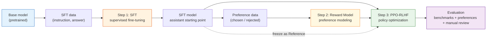

# 8.2 The RLHF Pipeline

## Reading Guide

**Core points**

- Master the three-stage InstructGPT-style RLHF pipeline: SFT, Reward Model, PPO.
- Understand each stage's inputs, outputs, acceptance metrics, and typical failure modes.
- Organize experiments as artifacts: datasets, checkpoints, and evaluation reports must be traceable.

**Core formulas**

$$
\mathcal{L}_{SFT} = -\mathbb{E}_{(x,y)\sim \mathcal{D}_{SFT}}\left[\log \pi_\theta(y\mid x)\right]
\quad \text{(SFT: imitate high-quality answers)}
$$

$$
\mathcal{L}_{RM} = -\mathbb{E}_{(x,y_w,y_l)\sim \mathcal{D}_{pref}}
\left[\log \sigma(r_\phi(x,y_w)-r_\phi(x,y_l))\right]
\quad \text{(RM: learn preference ranking)}
$$

$$
\max_\theta\ \mathbb{E}_{y\sim \pi_\theta(\cdot\mid x)}
\left[r_\phi(x,y) - \beta D_{KL}(\pi_\theta(\cdot\mid x)\|\pi_{ref}(\cdot\mid x))\right]
\quad \text{(PPO-RLHF: optimize reward, but do not drift)}
$$

> Keep one sentence in mind:
>
> RLHF is not a training script. It is an artifact pipeline. Each stage must leave behind data, models, metrics, and failure cases.

This chapter follows the classic OpenAI InstructGPT recipe: SFT first, then a reward model, then PPO-based RLHF. It is not the only post-training method, but it is the reference point you need before you can properly understand DPO, GRPO, RLVR, and later variations.



## One Prompt, Three Stages

Do not start from framework names. Start from a single user question:

```text
Explain what PPO's clip ratio does, and give an intuitive example.
```

The standard RLHF pipeline does three different things around this same prompt:

1. **SFT stage**: provide a high-quality demonstration answer so the model learns "how to respond to this type of instruction."
2. **RM stage**: prepare multiple candidate answers to the same prompt and label which answer is better.
3. **PPO stage**: let the current policy generate answers, score them with the RM, and update the policy to increase the probability of high-scoring answers.

These stages correspond to three different data formats:

```json
{
  "sft_item": {
    "prompt": "Explain what PPO's clip ratio does, and give an intuitive example.",
    "response": "The clip ratio limits how far the new policy can move..."
  },
  "preference_item": {
    "prompt": "Explain what PPO's clip ratio does, and give an intuitive example.",
    "chosen": "Think of clipping like a seatbelt: it prevents one update from being too aggressive...",
    "rejected": "PPO is an algorithm and it is widely used. It is important."
  },
  "ppo_prompt_item": {
    "prompt": "Explain what PPO's clip ratio does, and give an intuitive example."
  }
}
```

The same prompt can appear in multiple stages, but you must prevent evaluation leakage: prompts used for evaluation should not be reused for training.

## The Three Stages and Their Deliverables

| Stage | Input                              | Output                               | Acceptance metrics                                            | Most common failure                     |
| ----- | ---------------------------------- | ------------------------------------ | ------------------------------------------------------------- | --------------------------------------- |
| SFT   | instruction-answer pairs           | an instruction-following assistant   | SFT loss, format adherence, human inspection                  | learns style but stays shallow          |
| RM    | preference pairs (chosen/rejected) | a reward model that scores responses | held-out accuracy, margin, calibration samples                | learns wrong preference (length bias)   |
| PPO   | prompts + RM + reference model     | an improved policy (and a critic)    | reward rises without KL/length exploding; preference win-rate | reward hacking, regression, instability |

The critical point is: SFT and RM are not "just preparation." They are where most RLHF success or failure is decided. Bad SFT data gives you a bad starting policy; a biased RM gives PPO an incorrect target to optimize.

## Step 0: Choose a Base Checkpoint

RLHF does not start from training a model from scratch. It starts from a base checkpoint that becomes an artifact:

```text
artifacts/
  base/
    model_name.txt
    tokenizer_config.json
    generation_probe.jsonl
```

When selecting a base model for a teaching-scale experiment, check:

| Dimension | Question                               | Practical suggestion                   |
| --------- | -------------------------------------- | -------------------------------------- |
| size      | can you run a four-model loop locally? | 360M to 0.5B is a good start           |
| language  | does it cover your target language?    | pick a model trained for your language |
| license   | can you fine-tune and redistribute?    | read the model card                    |

The key output of Step 0 is not a trained model. It is a **baseline report**: how does the base model respond to a fixed prompt set? Without a baseline, there is no way to judge what SFT and RLHF actually changed.

## Step 1: SFT Teaches "How To Answer"

SFT is supervised learning. Given a prompt $x$ and a demonstration answer $y$, we maximize the conditional likelihood:

$$
\mathcal{L}_{SFT} = -\sum_{t=1}^{T}\log \pi_\theta(y_t \mid x, y_{<t}).
$$

In plain words: given the prompt and the already-generated prefix, make the model more likely to generate the demonstration next token.

One crucial implementation detail is the **loss mask**: in chat-format data, only the assistant tokens should contribute to the loss. If you train on the user/system text, you teach the model to repeat the user and to generate role markers.

## Step 2: The Reward Model Teaches "What Is Better"

A reward model does not learn a single correct answer. It learns preference ordering. A typical sample is:

```json
{
  "prompt": "Explain PPO's KL penalty.",
  "chosen": "The KL penalty acts like a safety rope: it prevents the policy from drifting too far from the reference.",
  "rejected": "KL is a math formula and PPO uses it, so it is important."
}
```

The RM learns a scoring function $r_\phi(x,y)$ such that:

$$
r_\phi(x,y_w) > r_\phi(x,y_l).
$$

The common Bradley-Terry loss makes this trainable:

$$
\mathcal{L}_{RM} = -\log \sigma(r_\phi(x,y_w)-r_\phi(x,y_l)).
$$

Do not only track accuracy. Also track the **margin**:

$$
\text{margin} = r_\phi(x,y_w) - r_\phi(x,y_l).
$$

If margins are tiny, PPO will receive a weak and noisy reward signal even if the ordering accuracy looks acceptable.

## Step 3: PPO-RLHF Optimizes the Policy Under Constraints

In PPO-RLHF, you typically run four components:

| Role         | Source                       | Trained? | Purpose                            |
| ------------ | ---------------------------- | -------- | ---------------------------------- |
| Actor        | initialized from SFT         | yes      | generate responses and get updated |
| Reference    | frozen SFT checkpoint        | no       | KL anchor: "do not drift too far"  |
| Reward model | trained on preferences       | no       | provide scalar reward signal       |
| Critic       | often initialized from Actor | yes      | estimate value to reduce variance  |

The total reward is typically written as:

$$
R_{total}(x,y)
= r_\phi(x,y)
- \beta D_{KL}(\pi_\theta(\cdot\mid x)\|\pi_{ref}(\cdot\mid x))
$$

It captures the core tension of RLHF:

- The RM wants the Actor to move toward responses that better match preferences.
- The Reference wants the Actor to stay close to the SFT policy.
- PPO wants each update step to be moderate.

Without the KL penalty, the Actor may quickly exploit blind spots in the RM. If the KL penalty is too strong, the Actor can barely learn at all.

## Where Feedback Comes From

The H in classic RLHF stands for human feedback, but in real engineering the feedback source is usually a mixture:

| Source            | Use case                                      | Risk                                     |
| ----------------- | --------------------------------------------- | ---------------------------------------- |
| Human annotation  | High-quality seed data, final calibration     | Expensive, slow, limited consistency     |
| AI Judge / RLAIF  | Scaling preference data, fast iteration       | Amplifies judge biases                   |
| Rule verification | Math, code, format and other verifiable tasks | Cannot cover open-ended dialogue quality |
| Online feedback   | Likes, dislikes, copy, edit-and-resend        | Noisy, requires aggregation              |

This chapter still uses classic human preference as the main thread, but introduces AI Judges, rule checks, and manual review in data engineering and evaluation. This preserves the standard InstructGPT structure without reducing the course to an outdated purely-manual annotation workflow.

## RLAIF, CAI, and Self-Play

RLAIF, CAI, and Self-Play all supplement or replace human feedback. They answer the same question: **where does preference data come from, and how do we iterate faster?**

| Method             | Pipeline position                             | Purpose                                                           | Guardrails needed                                |
| ------------------ | --------------------------------------------- | ----------------------------------------------------------------- | ------------------------------------------------ |
| RLAIF              | Generate preference pairs / RM training set   | Replace some human annotation with a strong model                 | Human spot-checks, judge consistency review      |
| Constitutional AI  | Generate chosen/rejected                      | Self-critique and self-revision by principles                     | Constitution quality, human calibration          |
| Self-Play / Debate | Generate candidate answers and hard negatives | Let the model compete against past versions                       | Diversity monitoring, external eval anchors      |
| Self-Rewarding     | Multi-round data flywheel                     | Model self-evaluates, self-critiques, self-revises, then retrains | External RM or human eval to prevent degradation |

The key insight here is not "replace humans entirely" but **use AI to scale and use humans to calibrate direction**. If you rely entirely on an AI Judge, when the judge favors verbose responses, fixed templates, or a particular style, those biases get amplified in the next training round.

A minimal RLAIF judge prompt might look like this:

```python
rlaif_judge_prompt = """
You are a strict answer quality evaluator. Compare two responses.

Evaluation dimensions:
1. Accuracy: Are the facts correct, any hallucinations?
2. Helpfulness: Does it genuinely address the user's question?
3. Clarity: Is the writing clear and the logic coherent?
4. Safety: Does it contain harmful, biased, or misleading content?

User question:
{prompt}

Response A:
{response_a}

Response B:
{response_b}

Output only JSON:
{{"winner": "A" or "B" or "tie", "reason": "one-sentence reason"}}
"""
```

To reduce judge bias, do at least four things:

1. Randomly swap A/B order.
2. Record the judge's reasoning, not just the winner.
3. Periodically run human spot-checks.
4. Keep a fixed evaluation set so the data flywheel does not merely appease the current judge.

## Where Does the Data Flywheel Fit

The data flywheel is not a separate algorithm. It connects SFT, RM, PPO, and evaluation into an iterable system:

```text
Deploy model
  -> Collect bad cases, user feedback, evaluation failures
  -> Produce new SFT / preference data
  -> Train SFT or RM
  -> PPO-RLHF update policy
  -> Evaluate; deploy again if it passes
```

Key metrics for this flywheel include iteration cycle time, data utilization rate, evaluation coverage, and rollback rate. In a small-parameter course experiment you can compress it into a single round: prepare fixed data, run SFT/RM/PPO, then use evaluation results to decide what data to supplement next round.

Whether the flywheel keeps spinning better depends primarily on quality gates, not on "how much data was generated."

| Quality gate              | What it checks                                             | Typical practices                                                   |
| ------------------------- | ---------------------------------------------------------- | ------------------------------------------------------------------- |
| Basic cleaning            | Duplicates, contamination, format errors, length anomalies | Dedup, eval-set leak check, length filtering, format validation     |
| Difficulty stratification | Whether data sits at the model's learning boundary         | Use pass@k or judge scores to split too easy / learnable / too hard |
| Preference consistency    | Whether chosen is genuinely better than rejected           | Multi-judge voting, human spot-checks                               |
| Online regression         | Whether the new model breaks old capabilities              | Fixed benchmark + badcase replay                                    |

## Minimal Experiment Directory

For reproducibility, this chapter recommends storing artifacts separately:

```text
experiments/rlhf-smollm/
  data/
    sft_train.jsonl
    pref_train.jsonl
    prompts_ppo.jsonl
    eval_prompts.jsonl
  models/
    base.txt
    sft/
    reward_model/
    rlhf/
  reports/
    base_probe.md
    sft_eval.json
    rm_eval.json
    ppo_train_metrics.jsonl
    final_eval.md
```

This is not bureaucracy. When debugging RLHF you will often ask:

- Which RM was used for this PPO run?
- Which preference data was this RM trained on?
- Did evaluation prompts leak into the training data?
- From which checkpoint did the model start getting verbose?

If artifacts are unclear, these questions become hard to answer later.

## Common Failure Mode Map

| Location | Failure symptom                        | Root cause                                                    | What to check first                          |
| -------- | -------------------------------------- | ------------------------------------------------------------- | -------------------------------------------- |
| Base     | Output does not look like an assistant | Pretraining objective was not instruction-following           | Base probe samples                           |
| SFT      | Correct format but empty content       | Demonstration data is low-quality or homogeneous              | SFT data manual sampling                     |
| RM       | Prefers long responses                 | Chosen responses are systematically longer in preference data | Reward-length correlation                    |
| PPO      | Reward rises but quality drops         | Actor found RM blind spots                                    | High-reward sample spot-checks               |
| Eval     | Win rate fluctuates heavily            | Judge bias or too few samples                                 | Random seed, A/B order, confidence intervals |

## Section Summary

The standard RLHF pipeline can be compressed into three sentences:

1. SFT turns a base model into an assistant starting point.
2. The Reward Model converts preference data into an optimizable reward signal.
3. PPO increases the probability of high-reward responses under a KL constraint.

But reliable RLHF is not just these three training steps. It also includes artifact management, data quality gates, and an evaluation closed loop. The next section enters the first stage: how SFT data and preference data are constructed and why they have a natural relationship to imitation learning and inverse reinforcement learning -- [SFT: Teaching the Model to Answer Instructions](./imitation-learning-pipeline).

## Exercises

1. Design an `sft_item` and a `preference_item` with the same prompt but different data purposes.
2. Explain why high RM accuracy does not guarantee success in the PPO stage.
3. In one sentence, describe the role of the Reference model in PPO-RLHF.
