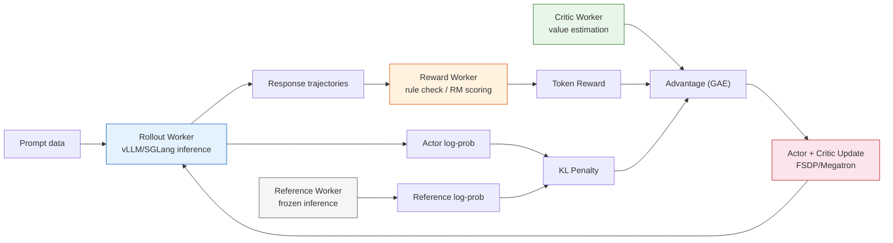

# 6.7 Hands-On: Running PPO on GSM8K with veRL

In Section 8.5, we explained the four-model collaboration behind PPO-RLHF: the roles of the Actor, Reference, Reward Model, and Critic, and the mathematical relationship between the KL penalty, token-level rewards, and advantage estimation. In this section, we take a more practical route: we will use the industrial-grade framework [veRL](https://github.com/volcengine/verl) to run PPO training end-to-end on the GSM8K mathematical reasoning dataset.

Handwritten pseudo-code helps you internalize the principles; veRL helps you run a real experiment. The relationship is similar to Chapter 7, where we run PPO with Stable Baselines3: the algorithm is the same, but the framework takes care of engineering details such as distributed scheduling, VRAM optimizations, and inference acceleration.

## An Introduction to veRL

[veRL](https://github.com/volcengine/verl) (Volcano Engine Reinforcement Learning), initiated by ByteDance's Seed team, is one of the most active LLM RL training frameworks in the community (10k+ GitHub stars). Its paper, _HybridFlow_, was published at EuroSys 2025.

Compared with the small-model TRL experiments we mentioned in Section 8.5, veRL's main value-adds are:

| Feature                   | TRL for Small Models            | veRL                                                             |
| ------------------------- | ------------------------------- | ---------------------------------------------------------------- |
| Inference engine          | item-by-item `model.generate()` | vLLM / SGLang continuous batching                                |
| Training engine           | single-GPU AdamW                | FSDP / FSDP2 / Megatron-LM                                       |
| Multi-model orchestration | same process, shared memory     | Ray remote calls; deploy Actor/RM/Critic/Ref as separate roles   |
| VRAM optimization         | LoRA or single-GPU              | ZeRO, gradient checkpointing, 3D-HybridEngine weight re-sharding |
| Distributed               | single process                  | Ray cluster; multi-node multi-GPU                                |
| Algorithms                | PPO                             | 10+ including PPO / GRPO / DAPO / RLOO / ReMax                   |
| Reward types              | Reward Model                    | Reward Model + rule-based reward (verifiable reward)             |

At the center of veRL is a **hybrid-controller programming model**: it decouples inference (rollout), training (update), and reward computation into independent workers, and schedules them with Ray to run alternately on the same pool of GPUs. With this design, the same codebase can run a 0.5B model on a single GPU, and also scale seamlessly to multi-node multi-GPU training for 70B+ models.



## Why GSM8K

[GSM8K](https://huggingface.co/datasets/openai/gsm8k) (Grade School Math 8K) is a grade-school math word-problem dataset released by OpenAI, with about 7,500 training examples and 1,319 test examples. It has become a standard benchmark for RL for LLMs for three reasons:

1. **It naturally supports rule-based rewards**: whether an answer is correct can be verified automatically, so you do not need to train a Reward Model. This differs from RLHF in Section 8.5, where an RM provides preference signals; for math problems, directly checking the numeric answer is sufficient.
2. **The reasoning chain length is moderate**: typical answers are 50 to 200 tokens. This is long enough for token-level advantages to matter, but not so long that it blows up VRAM like long code generation.
3. **There are abundant community baselines**: Volcano Engine provides a complete tutorial and evaluation results for running PPO on Qwen2.5-0.5B on a VKE cluster (42.08% → 54.89%), giving you a reference point.

The goal of this experiment is not to chase SOTA scores. Instead, it is to let you see the full lifecycle of PPO training on a real dataset: data preparation → reward-function design → configuration and tuning → training loop → interpreting metrics.

## Environment Setup

### Hardware Requirements

The configuration in this section targets a **single GPU** (24GB VRAM, such as an RTX 3090 / 4090 / A5000):

| Model             | Params | Training plan    | VRAM requirement    |
| ----------------- | ------ | ---------------- | ------------------- |
| Qwen/Qwen2.5-0.5B | 0.5B   | full fine-tuning | ~16 GB (single GPU) |
| Qwen/Qwen2.5-0.5B | 0.5B   | full FT + vLLM   | ~18 GB (single GPU) |
| Qwen/Qwen2.5-1.5B | 1.5B   | full fine-tuning | ~22 GB (single GPU) |
| Qwen/Qwen2.5-1.5B | 1.5B   | LoRA + vLLM      | ~20 GB (single GPU) |

PPO-RLHF loads the Actor and Critic (trainable) as well as the Reference and Reward components (frozen for inference). That makes the VRAM pressure higher than plain SFT. A 0.5B model with full fine-tuning is the safest starting point on a single GPU.

### Installing veRL

A conda environment plus a pip install is recommended:

```bash
# Create an environment
conda create -n verl python==3.10 -y
conda activate verl

# Install PyTorch (CUDA 12.x)
pip install torch torchvision --index-url https://download.pytorch.org/whl/cu121

# Install veRL
git clone https://github.com/volcengine/verl.git
cd verl
pip install -e .

# Install vLLM (inference engine)
pip install vllm==0.8.3

# Install Flash Attention
pip install flash-attn --no-build-isolation
```

After installation, verify the environment:

```bash
python -c "import verl; print(verl.__version__)"
python -c "import vllm; print(vllm.__version__)"
```

::: details Common installation issues

**Flash Attention build failure**: you need a CUDA toolkit and GCC. If compilation takes too long or fails, you can skip it. veRL will fall back to PyTorch's native attention, which is slower but functionally fine.

**vLLM version conflicts**: veRL requires vLLM >= 0.8.2. If you see `ImportError: cannot import name 'ForkingPickler'`, upgrade `tensordict` to 0.6.2: `pip install tensordict==0.6.2`.
:::

### Data Preparation

veRL provides a built-in GSM8K preprocessing script. A single command handles download and format conversion:

```bash
# Preprocess GSM8K with veRL's built-in script
python3 examples/data_preprocess/gsm8k.py --local_dir ~/data/gsm8k
```

This script downloads GSM8K automatically, extracts the canonical answer after `####` as `ground_truth`, and converts the dataset into the parquet format expected by veRL. After it finishes, you will get `train.parquet` and `test.parquet` under `~/data/gsm8k/`.

::: details Parquet schema

If you want to preprocess manually or customize the schema, each parquet row contains three key fields:

```json
{
  "prompt": "Natalia sold clips to 48 of her friends in April, and then she sold half as many clips in May. How many clips did Natalia sell altogether in April and May?",
  "reward_model": { "ground_truth": "72" },
  "data_source": "openai/gsm8k"
}
```

- **`prompt`**: the problem text; used as the Actor input during PPO training
- **`reward_model`**: a dict-like payload; `ground_truth` is the canonical answer and is used by the reward function
- **`data_source`**: a data-source tag used for logging/grouping

An equivalent manual preprocessing script is:

```python
from datasets import load_dataset

ds = load_dataset("openai/gsm8k", "main")
for split in ["train", "test"]:
    df = ds[split].to_pandas()
    df = df.rename(columns={"question": "prompt", "answer": "reward_model"})
    df["reward_model"] = df["reward_model"].apply(
        lambda x: {"ground_truth": x.split("####")[-1].strip()}
    )
    df["data_source"] = "openai/gsm8k"
    df.to_parquet(f"~/data/gsm8k/{split}.parquet")
```

In practice, prefer veRL's built-in script: it tracks veRL version changes and helps you avoid incompatible formats.
:::

## Designing the Reward Function

For GSM8K, you do not need to train a Reward Model. You can directly validate the final answer with rules. This is different from RLHF in Section 8.5: RLHF uses an RM to produce preference signals, while math reasoning uses **verifiable rewards**. Section 9.4 will discuss the RLVR paradigm in detail; here we start with a simple implementation.

This repository provides the course adaptation here: [`code/chapter15_rlhf/verl_gsm8k/gsm8k_reward.py`](../../../code/chapter15_rlhf/verl_gsm8k/gsm8k_reward.py). If you are working inside the veRL repository, you can also create the same file manually:

```python
# gsm8k_reward.py

import re
from typing import Any

REWARD_NAME = "gsm8k"
REWARD_TYPE = "sequential"


def extract_answer(response: str) -> str | None:
    """Extract the final answer from the model output.

    Supports \boxed{} format and <answer> tag format.
    """
    # First try \boxed{...}
    boxed = re.findall(r"\\boxed\{([^}]+)\}", response)
    if boxed:
        return boxed[-1].strip()

    # Then try <answer>...</answer>
    ans = re.search(r"<answer>(.*?)</answer>", response, re.DOTALL)
    if ans:
        return ans.group(1).strip()

    # Fallback: pick the last number in the last line
    lines = response.strip().split("\n")
    for line in reversed(lines):
        nums = re.findall(r"-?\d+\.?\d*", line)
        if nums:
            return nums[-1]

    return None


def check_answer(predicted: str | None, ground_truth: str) -> float:
    """Compare the predicted answer with the ground truth."""
    if predicted is None:
        return 0.0
    try:
        # Compare as numbers to reduce formatting differences
        pred_val = float(predicted.replace(",", ""))
        gt_val = float(ground_truth.replace(",", ""))
        return 1.0 if abs(pred_val - gt_val) < 1e-6 else 0.0
    except (ValueError, TypeError):
        return 1.0 if predicted.strip() == ground_truth.strip() else 0.0


def compute_score(reward_input: dict[str, Any], **kwargs) -> dict[str, float]:
    """Main reward function. veRL will pass reward_input automatically."""
    response = reward_input["response"]
    ground_truth = reward_input["ground_truth"]

    predicted = extract_answer(response)
    accuracy = check_answer(predicted, ground_truth)

    return {
        "overall": accuracy,
        "accuracy": accuracy,
        "format": 1.0 if predicted is not None else 0.0,
    }
```

Key design points of this reward function:

- **`extract_answer`**: extracts the final answer from the model output. It supports `\boxed{}` (common in math reasoning), an `<answer>` tag format (useful when your prompt template asks for it), and a final fallback of taking the last number from the last line.
- **`check_answer`**: numeric comparison. For example, `1,000` and `1000` are treated as the same; `42` and `42.0` are also treated as the same.
- **`compute_score`**: returns `overall` (the total reward used by PPO) and two auxiliary metrics (`accuracy` and `format`) that will be logged.

Why no Reward Model? Because GSM8K answers are **objectively verifiable**: correct is 1.0; incorrect is 0.0. The signal is sparse (an entire response yields a single 0/1), but it is precise, noise-free, and hard to game. This is exactly the core idea behind RLVR, which we will revisit in Section 9.4.

## Single-GPU Training Script

Based on veRL's official PPO scripts, this repository provides a single-GPU + 0.5B launch script here: [`code/chapter15_rlhf/verl_gsm8k/run_qwen2_5_0_5b_ppo_single_gpu.sh`](../../../code/chapter15_rlhf/verl_gsm8k/run_qwen2_5_0_5b_ppo_single_gpu.sh). The full content is:

```bash
#!/bin/bash
# run_qwen2.5_0.5b_ppo_single_gpu.sh
# PPO | GSM8K | single GPU | Qwen2.5-0.5B-Instruct

set -xeuo pipefail

# ==================== tunable parameters ====================
MODEL_PATH=${MODEL_PATH:-Qwen/Qwen2.5-0.5B-Instruct}
CRITIC_MODEL_PATH=${CRITIC_MODEL_PATH:-$MODEL_PATH}  # Critic is usually initialized from the same base model

# Single-GPU settings
NNODES=${NNODES:-1}
NDEVICES_PER_NODE=${NDEVICES_PER_NODE:-1}

# Training parameters (reduce for a single GPU)
TRAIN_BATCH_SIZE=${TRAIN_BATCH_SIZE:-128}      # number of prompts per rollout step
PPO_MINI_BATCH_SIZE=${PPO_MINI_BATCH_SIZE:-64}  # mini-batch size for PPO updates
MAX_PROMPT_LENGTH=${MAX_PROMPT_LENGTH:-512}     # max prompt length
MAX_RESPONSE_LENGTH=${MAX_RESPONSE_LENGTH:-256}  # max response length

# Learning rate
ACTOR_LR=${ACTOR_LR:-1e-6}
CRITIC_LR=${CRITIC_LR:-1e-5}

# Inference parameters
ROLLOUT_TP=${ROLLOUT_TP:-1}                     # tensor parallelism (single GPU = 1)
ROLLOUT_GPU_MEM_UTIL=${ROLLOUT_GPU_MEM_UTIL:-0.4}  # vLLM VRAM utilization
ROLLOUT_N=${ROLLOUT_N:-1}                       # number of samples per prompt

# Training control
TOTAL_EPOCHS=${TOTAL_EPOCHS:-20}
SAVE_FREQ=${SAVE_FREQ:-20}
TEST_FREQ=${TEST_FREQ:-5}

# Data paths
GSM8K_TRAIN_FILE=${GSM8K_TRAIN_FILE:-$HOME/data/gsm8k/train.parquet}
GSM8K_TEST_FILE=${GSM8K_TEST_FILE:-$HOME/data/gsm8k/test.parquet}

# Experiment name
EXPERIMENT_NAME=${EXPERIMENT_NAME:-qwen2.5_0.5b_ppo_gsm8k_$(date +%Y%m%d_%H%M)}
# ==================== end of tunable parameters ====================

# ---- Data config ----
DATA=(
    algorithm.adv_estimator=gae
    data.train_files="['$GSM8K_TRAIN_FILE']"
    data.val_files="['$GSM8K_TEST_FILE']"
    data.train_batch_size=${TRAIN_BATCH_SIZE}
    data.max_prompt_length=${MAX_PROMPT_LENGTH}
    data.max_response_length=${MAX_RESPONSE_LENGTH}
    data.filter_overlong_prompts=True
)

# ---- Model config ----
MODEL=(
    actor_rollout_ref.model.path="$MODEL_PATH"
    actor_rollout_ref.model.use_remove_padding=True
    actor_rollout_ref.model.enable_gradient_checkpointing=True
)

# ---- Actor config ----
ACTOR=(
    actor_rollout_ref.actor.optim.lr=${ACTOR_LR}
    actor_rollout_ref.actor.ppo_mini_batch_size=${PPO_MINI_BATCH_SIZE}
    actor_rollout_ref.actor.use_dynamic_bsz=True
    actor_rollout_ref.actor.ppo_max_token_len_per_gpu=16384
    actor_rollout_ref.actor.entropy_coeff=0
    actor_rollout_ref.actor.clip_ratio=0.2
    actor_rollout_ref.actor.fsdp_config.param_offload=False
    actor_rollout_ref.actor.fsdp_config.optimizer_offload=False
)

# ---- Rollout config ----
ROLLOUT=(
    actor_rollout_ref.rollout.name=vllm
    actor_rollout_ref.rollout.tensor_model_parallel_size=${ROLLOUT_TP}
    actor_rollout_ref.rollout.gpu_memory_utilization=${ROLLOUT_GPU_MEM_UTIL}
    actor_rollout_ref.rollout.n=${ROLLOUT_N}
    actor_rollout_ref.rollout.log_prob_use_dynamic_bsz=True
    actor_rollout_ref.rollout.log_prob_max_token_len_per_gpu=16384
)

# ---- Reference config ----
REF=(
    actor_rollout_ref.ref.log_prob_use_dynamic_bsz=True
    actor_rollout_ref.ref.log_prob_max_token_len_per_gpu=16384
    actor_rollout_ref.ref.fsdp_config.param_offload=True
)

# ---- Critic config ----
CRITIC=(
    critic.model.path="$CRITIC_MODEL_PATH"
    critic.model.use_remove_padding=True
    critic.model.enable_gradient_checkpointing=True
    critic.optim.lr=${CRITIC_LR}
    critic.use_dynamic_bsz=True
    critic.ppo_max_token_len_per_gpu=16384
    critic.fsdp.param_offload=False
    critic.fsdp.optimizer_offload=False
)

# ---- Trainer config ----
TRAINER=(
    trainer.balance_batch=True
    trainer.critic_warmup=0
    trainer.logger='["console","wandb"]'
    trainer.project_name=verl_ppo_gsm8k
    trainer.experiment_name=${EXPERIMENT_NAME}
    trainer.n_gpus_per_node=${NDEVICES_PER_NODE}
    trainer.nnodes=${NNODES}
    trainer.save_freq=${SAVE_FREQ}
    trainer.test_freq=${TEST_FREQ}
    trainer.total_epochs=${TOTAL_EPOCHS}
)

# ---- Launch training ----
python3 -m verl.trainer.main_ppo \
    "${DATA[@]}" \
    "${MODEL[@]}" \
    "${ACTOR[@]}" \
    "${ROLLOUT[@]}" \
    "${REF[@]}" \
    "${CRITIC[@]}" \
    "${TRAINER[@]}" \
    "$@"
```

### How to Read the Configuration

This script looks parameter-heavy, but the core decisions boil down to four choices.

**1. Training scale: `TRAIN_BATCH_SIZE=128, PPO_MINI_BATCH_SIZE=64`**

Each PPO update samples rollouts from 128 prompts, and splits them into 2 mini-batches (128/64) to compute gradients. The official Volcano Engine configuration uses `train_batch_size=256` on a 2-node × 2-GPU setup; for a single GPU, we cut that roughly in half. If you have ample VRAM (e.g., an A100 80GB), you can push the batch size to 256 for more stable training.

**2. Sequence lengths: `MAX_PROMPT_LENGTH=512, MAX_RESPONSE_LENGTH=256`**

GSM8K prompts are typically 50 to 150 tokens, and responses are typically 50 to 200 tokens. `max_response_length=256` is enough for GSM8K in the official setup. These two values directly determine memory usage: longer sequences consume more VRAM.

**3. Inference engine allocation: `ROLLOUT_GPU_MEM_UTIL=0.4`**

vLLM pre-allocates memory for KV cache. In the single-GPU setup, vLLM and training share the same GPU, so vLLM can only take around 40% of the VRAM. If you hit OOM, reduce it to 0.3.

**4. Critic learning rate > Actor learning rate: `ACTOR_LR=1e-6, CRITIC_LR=1e-5`**

This is a common practice in PPO-RLHF. The Critic needs to learn a reasonably accurate value function quickly; otherwise the advantage estimate becomes too noisy. The Actor learning rate is kept smaller so that policy updates stay conservative, working together with PPO clipping and KL constraints to prevent the policy from drifting.

### Mapping Back to the Four-Model Setup in Section 8.5

Recall the four-model collaboration in Section 8.5. In veRL, each role maps cleanly to configuration fields:

| Role in Section 8.5 | veRL config                     | Notes                                                         |
| ------------------- | ------------------------------- | ------------------------------------------------------------- |
| Actor               | `actor_rollout_ref.actor.*`     | trainable policy; generates outputs and gets updated          |
| Reference           | `actor_rollout_ref.ref.*`       | frozen SFT model; used to compute KL constraints              |
| Critic              | `critic.*`                      | trainable value function; used to estimate advantages via GAE |
| RM/Reward           | `gsm8k_reward.py:compute_score` | rule-based verification (no RM training needed for GSM8K)     |
| KL constraint       | default KL reward penalty       | prevents Actor from drifting too far from Reference           |
| PPO clip            | `actor.clip_ratio=0.2`          | limits update magnitude                                       |
| GAE                 | `algorithm.adv_estimator=gae`   | advantage estimation method                                   |

One important difference to keep in mind: here we replace the **Reward Model** from Section 8.5 with a **rule-based reward** (automatic answer verification). That means we do not need to train an RM, nor do we need preference data. The trade-off is that the reward signal is binary (0/1) instead of a smooth scalar indicating "how much better" one response is than another. For math reasoning, however, a 0/1 signal is often sufficient.

## Launching Training

### Option 1: Run the Script Directly

```bash
# Make the script executable
chmod +x run_qwen2.5_0.5b_ppo_single_gpu.sh

# Run with default parameters
bash run_qwen2.5_0.5b_ppo_single_gpu.sh
```

### Option 2: Override Parameters via Environment Variables

veRL's scripts are designed to be overridden via environment variables, so you can switch configurations quickly without editing the script:

```bash
# Switch to a 1.5B model
MODEL_PATH=Qwen/Qwen2.5-1.5B-Instruct \
TRAIN_BATCH_SIZE=64 \
PPO_MINI_BATCH_SIZE=16 \
bash run_qwen2.5_0.5b_ppo_single_gpu.sh
```

```bash
# Reduce batch sizes to save VRAM
TRAIN_BATCH_SIZE=64 \
PPO_MINI_BATCH_SIZE=16 \
ROLLOUT_GPU_MEM_UTIL=0.4 \
bash run_qwen2.5_0.5b_ppo_single_gpu.sh
```

Ray will initialize automatically inside `main_ppo`, so you do not need to start a Ray cluster manually. In the single-GPU setup, all workers (actor, critic, rollout, ref, reward) run alternately on the same GPU, and share model weights via the 3D-HybridEngine to avoid doubling memory.

### Training Logs

Once training starts, your terminal will print key metrics:

```
[Step 1]  train | reward/overall=0.05 | reward/accuracy=0.05 | kl=0.000 | actor_loss=0.82 | critic_loss=2.41
[Step 5]  val   | reward/overall=0.12 | reward/accuracy=0.12
[Step 6]  train | reward/overall=0.18 | reward/accuracy=0.18 | kl=0.002 | actor_loss=0.67 | critic_loss=1.89
[Step 10] val   | reward/overall=0.31 | reward/accuracy=0.31
...
```

If you enable WandB, these metrics will be uploaded automatically and you can inspect curves in the WandB dashboard.

## Interpreting Training Metrics

For PPO-RLHF, it is not enough to see "reward goes up". As we emphasized in Section 8.5, you should monitor multiple metrics together.

### Key Metrics

| Metric            | Healthy signal                       | Warning sign                            |
| ----------------- | ------------------------------------ | --------------------------------------- |
| `reward/accuracy` | rises gradually                      | stays flat for long, or spikes abruptly |
| `kl`              | grows slowly, then growth rate slows | keeps exploding or jumps suddenly       |
| `actor_loss`      | fluctuates around 0.5 to 1.0         | blows up to >10 or becomes NaN          |
| `critic_loss`     | decreases and stabilizes             | does not decrease or blows up           |
| `response_length` | stable or slightly increasing        | spikes together with reward             |
| `entropy`         | decreases slowly                     | collapses rapidly toward 0              |

### Typical Training Phases on GSM8K

**Phase 1: random exploration (steps 1 to 10)**. `accuracy` fluctuates around 5% to 15%; the model has not learned to solve these problems yet. `kl` is near 0, meaning the policy has barely deviated from the reference. `critic_loss` drops quickly as the Critic learns to approximate the value function.

**Phase 2: capability improvement (steps 10 to 40)**. `accuracy` starts to rise steadily, reaching 30% to 50%. `kl` slowly increases to around 0.01 to 0.05. This is the most effective window for PPO: the Actor finds better response strategies while staying close to the reference.

**Phase 3: diminishing returns (steps 40+)**. The growth of `accuracy` slows down and the curve flattens. Often this means the model is approaching the capability ceiling of a 0.5B model; the remaining errors are due to limitations in language understanding and reasoning rather than insufficient RL training.

### Comparing Against veRL's Official Baseline

The Volcano Engine team ran 20 epochs (580 steps) of PPO training with veRL on a VKE cluster (2 nodes × 2 × NVIDIA L20), and evaluated independently using [EvalScope](https://github.com/modelscope/evalscope):

| Model                                 | Method               | GSM8K accuracy |
| ------------------------------------- | -------------------- | -------------- |
| Qwen2.5-0.5B-Instruct (original)      | pretraining baseline | 42.08%         |
| Qwen2.5-0.5B-Instruct + PPO (step580) | veRL PPO training    | 54.89%         |

From 42.08% to 54.89%, PPO improved the math reasoning accuracy of this 0.5B model by **12.8 percentage points**. The gain does not come from "learning new math"; it comes from using the reward signal to better exploit what the model already knows: more disciplined reasoning formats, fewer arithmetic mistakes, and fewer "give up" behaviors. In principle, with more training steps and more data, there is still room for improvement.

> **Note**: the numbers above come from the official experiment on a VKE cluster (2 nodes × 2 × NVIDIA L20, `train_batch_size=256`). In this section's single-GPU script, we reduce batch size to 128, so the training dynamics (convergence speed, final accuracy) may differ slightly. The algorithmic flow and parameter ratios, however, match the official configuration.

## Model Evaluation

After training, you should evaluate the checkpoint independently to confirm that PPO genuinely improved capability. A practical choice is [EvalScope](https://github.com/modelscope/evalscope) for zero-shot GSM8K evaluation:

```bash
# Install EvalScope
pip install evalscope

# Run GSM8K evaluation
evalscope eval \
    --model /path/to/merged_model \
    --datasets gsm8k
```

When evaluating, pay attention to the following:

- **Use the test split**: evaluation must be done on GSM8K's test split (1319 examples). Do not evaluate on the training split; it will inflate the score.
- **Compare to a baseline**: evaluate the pre-RL SFT model (e.g., `Qwen/Qwen2.5-0.5B-Instruct`) as well, so you can quantify the real gain from PPO.
- **Inspect the reasoning process**: besides accuracy, sample some responses. After PPO training, the reasoning steps should be clearer and the language more concise.

### Exporting Checkpoints

veRL checkpoints contain sharded Actor and Critic weights (in FSDP format). You need veRL's merge script to export a standard HuggingFace format model:

```bash
# Merge FSDP shards into a standard HF model
python scripts/model_merger.py merge \
    --backend fsdp \
    --local_dir /path/to/checkpoints/global_step_580/actor \
    --target_dir ./merged_model
```

After merging, you can load it with standard Transformers tooling:

```python
from transformers import AutoModelForCausalLM

model = AutoModelForCausalLM.from_pretrained("./merged_model")
```

## veRL's Configuration Architecture

Once you understand the single-GPU script, it is worth stepping back and looking at how veRL organizes configuration. All configuration is passed via Hydra override syntax and can be grouped into six modules:

```mermaid
flowchart TD
    Entry["python3 -m verl.trainer.main_ppo"] --> Data["data\npaths & preprocessing"]
    Entry --> Model["actor_rollout_ref.model\nmodel paths"]
    Entry --> Actor["actor_rollout_ref.actor\nActor training params"]
    Entry --> Rollout["actor_rollout_ref.rollout\ninference engine params"]
    Entry --> Ref["actor_rollout_ref.ref\nReference params"]
    Entry --> Critic["critic\nCritic model & training"]
    Entry --> Trainer["trainer\ntraining loop control"]

    Data --> D1["train_files, val_files"]
    Data --> D2["train_batch_size"]
    Data --> D3["max_prompt/response_length"]

    Actor --> A1["optim.lr, clip_ratio"]
    Actor --> A2["ppo_mini_batch_size"]
    Actor --> A3["fsdp_config"]

    Rollout --> R1["name (vllm/sglang)"]
    Rollout --> R2["tensor_model_parallel_size"]
    Rollout --> R3["gpu_memory_utilization"]

    Critic --> C1["model.path, optim.lr"]
    Critic --> C2["ppo_max_token_len_per_gpu"]

    Trainer --> T1["total_epochs, save_freq"]
    Trainer --> T2["logger (wandb/console)"]
    Trainer --> T3["n_gpus_per_node, nnodes"]

    style Entry fill:#e3f2fd,stroke:#1565c0
    style Data fill:#fff3e0,stroke:#e65100
    style Actor fill:#e8f5e9,stroke:#2e7d32
    style Critic fill:#f3e5f5,stroke:#6a1b9a
    style Rollout fill:#e1f5fe,stroke:#0277bd
```



This flat dot-separated syntax (for example, `actor_rollout_ref.actor.optim.lr=1e-6`) maps directly to Hydra's OmegaConf configuration tree. The advantage is that you can switch configurations quickly without writing YAML files. The downside is that the command line becomes long when there are many parameters.

::: details Key parameter changes when scaling from single-GPU to multi-GPU

Once you understand the single-GPU setup, scaling to multiple GPUs only requires changing a few parameters:

```bash
# 8 GPUs on a single node
NNODES=1 NDEVICES_PER_NODE=8 \
TRAIN_BATCH_SIZE=1024 \
PPO_MINI_BATCH_SIZE=256 \
ROLLOUT_TP=2 \
bash run_qwen2.5_0.5b_ppo_single_gpu.sh
```

| Parameter              | 1 GPU | 8 GPUs | Notes                                         |
| ---------------------- | ----- | ------ | --------------------------------------------- |
| `NDEVICES_PER_NODE`    | 1     | 8      | number of GPUs                                |
| `TRAIN_BATCH_SIZE`     | 128   | 1024   | global batch (FSDP will shard it across GPUs) |
| `PPO_MINI_BATCH_SIZE`  | 64    | 256    | same as above                                 |
| `ROLLOUT_TP`           | 1     | 2      | vLLM tensor parallel degree                   |
| `ROLLOUT_GPU_MEM_UTIL` | 0.4   | 0.6    | with more GPUs, each GPU can allocate more    |

Other parameters (learning rates, `clip_ratio`, GAE settings, etc.) **do not need to change**: they are algorithmic knobs, not hardware-scaling knobs.
:::

## Advanced Reward Functions

The earlier `gsm8k_reward.py` uses only a 0/1 accuracy reward. In real training, you often add a format reward to guide the model toward cleaner outputs. This repository provides the advanced version here: [`code/chapter15_rlhf/verl_gsm8k/gsm8k_reward_advanced.py`](../../../code/chapter15_rlhf/verl_gsm8k/gsm8k_reward_advanced.py).

```python
# gsm8k_reward_advanced.py

import re
from typing import Any

REWARD_NAME = "gsm8k_advanced"
REWARD_TYPE = "sequential"


def format_reward(response: str) -> float:
    """Check whether the response follows a reasonable reasoning format.

    Good math answers often include:
    1. step-by-step reasoning (not only the final number)
    2. a clearly marked final answer (e.g., #### or <answer>)
    """
    # Reasoning steps (at least two non-empty lines)
    lines = [l.strip() for l in response.strip().split("\n") if l.strip()]
    has_reasoning = len(lines) >= 2

    # Explicit answer marker
    has_answer_marker = bool(
        re.search(r"####|\\boxed|<answer>", response)
    )

    score = 0.0
    if has_reasoning:
        score += 0.3
    if has_answer_marker:
        score += 0.2
    return score


def accuracy_reward(response: str, ground_truth: str) -> float:
    """Check whether the final answer is correct."""
    # Extract content after #### (GSM8K canonical format)
    answer_match = re.search(r"####\s*(.+)", response)
    if answer_match:
        predicted = answer_match.group(1).strip()
    else:
        # Fallback: take the last number
        nums = re.findall(r"-?\d+\.?\d*", response)
        predicted = nums[-1] if nums else None

    if predicted is None:
        return 0.0

    try:
        pred_val = float(predicted.replace(",", ""))
        gt_val = float(ground_truth.replace(",", ""))
        return 1.0 if abs(pred_val - gt_val) < 1e-6 else 0.0
    except (ValueError, TypeError):
        return 1.0 if predicted.strip() == ground_truth.strip() else 0.0


def compute_score(reward_input: dict[str, Any], **kwargs) -> dict[str, float]:
    """Advanced reward: 75% accuracy and 25% format."""
    response = reward_input["response"]
    ground_truth = reward_input["ground_truth"]

    acc = accuracy_reward(response, ground_truth)
    fmt = format_reward(response)

    return {
        "overall": 0.75 * acc + 0.25 * fmt,
        "accuracy": acc,
        "format": fmt,
    }
```

To use the advanced reward function, you need to adjust your training overrides to pass the function path. veRL supports custom reward functions via `custom_reward_function.path` and `custom_reward_function.name`.

### Designing Reward Weights

| Weighting scheme  | `accuracy` | `format` | Behavior                                                               |
| ----------------- | ---------- | -------- | ---------------------------------------------------------------------- |
| pure accuracy     | 1.0        | 0.0      | the model may be correct but use messy formatting                      |
| accuracy + format | 0.75       | 0.25     | encourages cleaner outputs while keeping correctness primary           |
| accuracy + format | 0.5        | 0.5      | format weight too high; the model may optimize formatting over solving |

**A practical rule of thumb**: keep the accuracy weight at least 0.7. Format rewards are auxiliary signals that help PPO with credit assignment (they tell the model that reasoning steps are valuable), but they should not dominate correctness.

## Tuning PPO's Key Hyperparameters

Based on veRL experience on GSM8K, the most impactful parameters are roughly ordered as follows.

### Priority 1: Learning rates

```bash
ACTOR_LR=1e-6    # Actor LR: search within 1e-7 ~ 5e-6
CRITIC_LR=1e-5   # Critic LR: typically 5 to 10x the Actor LR
```

The Actor learning rate is the most sensitive knob. Too large (>1e-5) tends to blow up KL and crash training; too small (<1e-7) often makes reward flatline. For small models on a single GPU, start from `1e-6`.

### Priority 2: KL control

By default, veRL PPO uses a KL reward penalty. Relevant overrides include:

```bash
# Append these overrides to the script
algorithm.use_kl_in_reward=True
algorithm.kl_ctrl.kl_coef=0.001
algorithm.kl_ctrl.type=fixed
```

`kl_coef` controls the strength of the KL penalty. In Section 8.5, we described this as the $\beta$ knob: too large and learning stalls; too small and you invite reward hacking. On GSM8K, because the reward is a 0/1 verifiable signal (harder to hack), you can often relax the KL penalty slightly.

### Priority 3: PPO update strength

```bash
actor_rollout_ref.actor.ppo_epochs=1       # one update epoch per rollout batch
actor_rollout_ref.actor.clip_ratio=0.2     # standard clipping range
```

`ppo_epochs=1` is a conservative on-policy choice. PPO should update using data generated by the current policy; if `ppo_epochs` is too large, it may overfit old rollouts.

### Failure-debugging checklist

| Symptom                                            | Likely cause                      | Fix                                         |
| -------------------------------------------------- | --------------------------------- | ------------------------------------------- |
| Loss becomes NaN                                   | gradient explosion / LR too large | lower `ACTOR_LR`, check gradient norms      |
| accuracy stays near 0                              | LR too small or KL too strong     | increase `ACTOR_LR`, lower `kl_coef`        |
| KL keeps exploding                                 | policy drifts from reference      | increase `kl_coef`, lower `ACTOR_LR`        |
| responses get longer but accuracy does not improve | length hacking                    | check whether reward correlates with length |
| training is extremely slow                         | insufficient VRAM for vLLM        | lower `ROLLOUT_GPU_MEM_UTIL`                |

## Summary: How This Relates to Section 8.5

The PPO training we ran with veRL is algorithmically identical to the PPO-RLHF principles in Section 8.5, but there are three engineering differences worth highlighting:

**1. Reward source**: Section 8.5 uses a Reward Model to provide continuous preference signals learned from data; this section uses rule-based verification to provide a 0/1 correctness signal computed automatically. This is the core idea of RLVR and will be covered in detail in Section 9.4.

**2. How the four models co-exist**: the TRL setup in Section 8.5 manages four models in a single process, which is simple but memory-inefficient. veRL uses Ray + FSDP to place Actor/Critic (trainable) and Reference/Reward (frozen) onto the same GPU pool, and switches between training and inference using the 3D-HybridEngine for better memory efficiency.

**3. Inference engine**: TRL uses item-by-item `model.generate()`, while veRL uses vLLM continuous batching, which can increase generation throughput by 5 to 10x. In on-policy RL, generation speed directly impacts training efficiency: PPO continuously generates fresh responses with the current policy, and rollout is often the bottleneck.

From an algorithmic viewpoint, this experiment follows the same six-step loop from Section 8.5: sample prompts → Actor generates → Reward scores → Reference computes KL → Critic estimates advantages → PPO updates. veRL simply accelerates each step with engineering optimizations.

## Extended Experiments

1. **Use a larger model**: change `MODEL_PATH` to `Qwen/Qwen2.5-1.5B-Instruct` and compare training curves and final accuracy. Larger models usually have higher ceilings.
2. **Enable LoRA**: if you only have 24GB VRAM but want to run a 1.5B or 3B model, append `actor_rollout_ref.actor.lora.rank=16` to enable LoRA, and combine it with `param_offload=True` to save more memory.
3. **Switch algorithms**: change `algorithm.adv_estimator` from `gae` (PPO) to `grpo`, and compare PPO vs GRPO training curves on the same dataset. GRPO does not require a Critic, so it uses less memory, but it estimates advantages differently.
4. **Scale to multi-GPU**: increase `NDEVICES_PER_NODE` and `TRAIN_BATCH_SIZE` and observe whether curves get smoother and final accuracy improves.
5. **Add the MATH dataset**: include both GSM8K and MATH in `data.train_files` and study how mixed training affects results.

## Repository Code Index

This section depends on external veRL and does not copy veRL source code. This repository only keeps the course adaptation layer:

| File                                                                                                                                              | Purpose                             |
| ------------------------------------------------------------------------------------------------------------------------------------------------- | ----------------------------------- |
| [`code/chapter15_rlhf/verl_gsm8k/README.md`](../../../code/chapter15_rlhf/verl_gsm8k/README.md)                                                   | External veRL index and usage notes |
| [`code/chapter15_rlhf/verl_gsm8k/gsm8k_reward.py`](../../../code/chapter15_rlhf/verl_gsm8k/gsm8k_reward.py)                                       | Basic 0/1 accuracy reward           |
| [`code/chapter15_rlhf/verl_gsm8k/gsm8k_reward_advanced.py`](../../../code/chapter15_rlhf/verl_gsm8k/gsm8k_reward_advanced.py)                     | Accuracy + format combined reward   |
| [`code/chapter15_rlhf/verl_gsm8k/run_qwen2_5_0_5b_ppo_single_gpu.sh`](../../../code/chapter15_rlhf/verl_gsm8k/run_qwen2_5_0_5b_ppo_single_gpu.sh) | Single-GPU 0.5B PPO launch script   |
| [`code/chapter15_rlhf/verl_gsm8k/run_qwen2_5_0_5b_ppo_8gpu.sh`](../../../code/chapter15_rlhf/verl_gsm8k/run_qwen2_5_0_5b_ppo_8gpu.sh)             | Single-node 8-GPU PPO launch script |

## Exercises

1. Why is the PPO reward signal on GSM8K binary (0/1), while RLHF in Section 8.5 uses a continuous reward? How do these signals affect PPO updates differently?
2. Change `ACTOR_LR` from `1e-6` to `1e-4` and observe how the training curves change. Explain what happened using the stability analysis framework from Section 8.5.
3. Add an auxiliary metric to `compute_score` that counts the number of reasoning lines in the response. How does this correlate with accuracy?
4. Design an experiment comparing "pure accuracy reward" vs "accuracy + format reward". Which configuration achieves higher final accuracy, and why?
5. Read veRL's `verl/trainer/main_ppo.py` source code. Draw the execution flow of the main function and label which code corresponds to each step of the six-step loop from Section 8.5.
