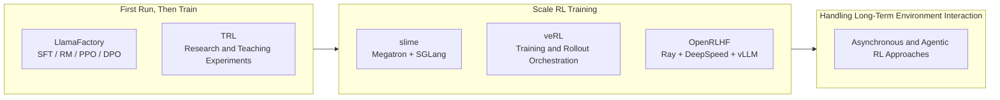

# 18.1 From Single-Machine Experiments to Industrial Training

[Chapter 13: RLHF](../chapter15_rlhf/base-model-to-assistant) establishes the classic alignment pipeline; [Chapter 14: DPO](../chapter17_dpo/dpo-objective-derivation) and [Chapter 15: GRPO, RLVR](../chapter18_grpo/grpo-practice-and-mechanism) present different model update and reward methods; [Chapter 16: Reasoning Models](../chapter19_reasoning/r1-zero-pure-rl-reasoning) and [Chapter 17: PRM](../chapter20_prm_search/outcome-vs-process) continue to expand the capabilities of training and reasoning stages. Now, putting these methods into the same industrial system, we observe how they share data, computing power, evaluation, and training infrastructure.

Chapter 18 gradually unfolds an industrial training task: this section first explains why single-machine experiments need to be scaled; [18.2](./industrial-post-training) connects data, training, evaluation, and data feedback into a complete flow; [18.3](./modern-industrial-practice) explains why training can become unstable; [18.4](./distributed-sync) describes how multiple GPUs can collaboratively execute this flow; [18.5](./data-engineering) then organizes tasks, environments, trajectories, and validation results into sustainable data assets.

Assume there is a question in the training data: "Why does the sky appear blue?" A single training run would go through the following steps:

1. **The Actor Generates Responses.** It is the language model being trained.
2. **The Reward Model Scores the Responses.** A higher score indicates that the response better aligns with human preferences.
3. **The Reference Model Provides a Baseline.** It helps compute the KL penalty, preventing the Actor from updating too drastically in a single step.
4. **The Critic Estimates How Much Better the Response Is Than Expected.** PPO uses this estimate to compute advantage; GRPO can use the relative scores of responses from the same group to replace the Critic.
5. **The Actor is Updated During Training.** The new parameters are then passed to the next round of generation for use.

When the model is relatively small, these roles can be run sequentially on the same machine. However, as the model and data scale, the main challenge arises from the execution approach: multiple models cannot be loaded simultaneously into limited GPU memory; generating responses typically takes longer than a single parameter update; and the newly trained parameters must be promptly passed to the generation process. If any of these steps takes too long, other GPUs will remain idle.

**The role of the training framework is to schedule these roles on which devices, when to exchange data, and when to synchronize new parameters.** It does not alter the mathematical definitions of PPO, GRPO, or reward models. Instead, it ensures that the same training process can run stably across multiple GPUs and multiple machines.

## 1. Understanding System Scale from Single-Machine Training

### 1.1 Training Scale and Framework Selection

Before choosing tools, first determine whether the model can be trained on existing machines:

| Your Situation                                                  | Can Start With | What You Need to Do                                                                                                                             |
| --------------------------------------------------------------- | -------------- | ----------------------------------------------------------------------------------------------------------------------------------------------- |
| First-time training your own model                              | LlamaFactory   | Prepare data and configurations, and sequentially run SFT, reward model, PPO, or DPO                                                            |
| Model is too large, not fitting or too slow on a single machine | slime          | Distribute model training and response generation across multiple GPUs, and synchronize the latest model parameters after each round of updates |

Start with LlamaFactory to understand how data enters training and what models are produced at each stage. When single-machine memory is insufficient or response generation is too slow, then learn how to use slime to manage multiple GPUs. This approach allows you to first address training methodology issues, and then move on to handling multi-machine systems.

This course will still use veRL to complete code generation RL experiments later. Both veRL and slime are capable of handling large-scale RL training, but they use different training and generation backends. OpenRLHF is another approach based on Ray, DeepSpeed, and vLLM, which will be introduced in the advanced comparison section.

### 1.2 Synchronous Training and Asynchronous Training

Suppose a batch of tasks includes nine short math problems and one task that requires repeatedly calling tools. The first nine problems finish quickly, while the last one takes several minutes to run.

- **Synchronous Training** waits for all tasks in the batch to complete before uniformly computing rewards and updating the model. The data is relatively fresh, and the process is easy to understand. However, all processes have to wait for the slowest task.
- **Asynchronous Training** allows completed results to enter the queue first, and the training process can continuously fetch data for updates. This reduces device waiting time, but the data may come from an earlier model, so it is also necessary to control the issue of stale experience.

The generation time of math and coding problems is relatively close, so synchronous training is typically used first. However, tasks involving tool calls, browser operations, and long-term environment interactions have significantly different execution times, making them more likely to benefit from asynchronous training.

::: tip Read this section on first pass
Remember this line: **Generate Answer → Compute Reward → Update Model → Synchronize New Parameters**. The following sections on frameworks, rewards, costs, and system design will explain how these four steps can be extended to larger models and clusters.

### 1.3 From Training Scripts to Distributed Frameworks

Let's start with training a mathematical problem-solving model on a single machine. The program fetches a batch of problems, asks the model to generate answers, uses a reward validator to compute rewards, and then updates the model based on these rewards. When the model is small and the answers are short, these steps can be implemented within a single training script. At this stage, the most important thing is to confirm three things: whether the data format is correct, whether the rewards truly reflect the quality of the answers, and whether the accuracy improves after parameter updates.

LlamaFactory and TRL are suitable for this stage. [LlamaFactory](https://arxiv.org/abs/2403.13372) organizes SFT, reward modeling, DPO, and PPO using a unified configuration; [TRL](https://huggingface.co/docs/trl/index) provides implementations of SFT, DPO, GRPO, and PPO through the Trainer interface. During the first experiment, the value of the framework lies in connecting data, algorithms, and models, allowing learners to clearly see how a single training process is completed.

As the model grows larger, the same script will encounter new challenges. The Actor is responsible for generating and updating responses, the Reference Model is responsible for computing KL divergence, and PPO also requires a Critic. During the generation phase, multiple responses need to be sampled for each problem. These models and intermediate results may not fit into a single set of GPUs at the same time, and the answer generation process can cause the training GPUs to wait for a long time. At this point, the framework needs to decide: which GPUs should each model be placed on, which process should receive the generated results, and how to synchronize the new weights back to the generation end after the Actor updates.

[veRL](https://arxiv.org/abs/2409.19256) represents the Actor, Critic, Reference Model, Reward Model, and rollout engine as schedulable roles, and the Driver then calls them in the order of PPO or GRPO. OpenRLHF, NeMo-Aligner, and slime also address these issues, though they use different underlying components: OpenRLHF uses Ray, DeepSpeed, and vLLM; NeMo-Aligner uses NeMo and Megatron; slime uses Megatron and SGLang. The main differences between them lie in resource scheduling and the backends for training and generation, while the algorithms remain the ones previously studied—PPO, DPO, or GRPO.



#### 1.3.1 Why Asynchronous Training is Needed for Long-Term Tasks

The length of answers to math problems is usually relatively consistent. Once a batch of questions begins to be generated, they often finish within a similar timeframe. Code repositories and browser tasks are different: some tasks pass the first test immediately, while others require repeated file reading, tool calls, and waiting for external environments. Tasks within the same batch can differ by several minutes or even longer.

Synchronous training must wait for the slowest task to finish before passing the entire batch of trajectories to the training process. Asynchronous training, on the other hand, places already completed trajectories into a queue, allowing the generation process to continue processing new tasks while the training process continuously samples data from the queue. This reduces GPU idle time, but introduces a new issue: a trajectory may be generated using an old version of the Actor, and by the time it is fed into training, the Actor may have already updated several times.

[AReaL](https://arxiv.org/abs/2505.24298) and [LlamaRL](https://arxiv.org/abs/2505.24034) are both addressing the issue of asynchronous progression in generation and training. AReaL generates a version of its policy for each trajectory and compares the generated policy with the current policy using importance sampling. Let the policy used to generate a trajectory be $\pi_{\theta_{\text{gen}}}$, and the policy used during training be $\pi_\theta$. The correction ratio for a particular action step is:

$$\rho_t^{\text{stale}} = \frac{\pi_\theta(a_t \mid s_t)}{\pi_{\theta_{\text{gen}}}(a_t \mid s_t)}$$

The numerator represents the probability that the current model selects action $a_t$ in state $s_t$, and the denominator represents the probability that the old model, which generated this trajectory, selected the same action at that time. If both are 0.2, the ratio is 1, indicating that the experience is consistent with the current policy. If they are 0.1 and 0.2 respectively, the ratio is 0.5, indicating that the current model is less likely to produce this action. The further the ratio deviates from 1, the older the trajectory. The system can reduce its training weight accordingly; when the versions differ too much, the trajectory can also be discarded directly.

#### 1.3.2 Agent Training Also Manages the Environment

A simple question-answering environment is straightforward: the program provides a question, and the verifier checks the answer. However, a single trajectory for a code-agent may involve reading files, modifying code, running tests, and handling errors; a browser agent also needs to save the webpage state, tool responses, and the reason for termination. As a result, the training framework must manage two threads: how the model updates, and how the external environment is created, interacted with, reset, and recycled.

[AgentRL](https://github.com/THUDM/AgentRL) manages multi-turn and multi-task environments using a Controller and Task Worker, and completes asynchronous GRPO using rollout, Actor, and Reference worker. [slime](https://github.com/THUDM/slime) integrates tool calls, sandbox interactions, and verifier feedback into the data generation process, then writes the data into the rollout buffer. Alibaba's [ROLL](https://alibaba.github.io/ROLL/) also provides environment and rollout interfaces, and integrates training and Agent deployment into a single lifecycle. They add environment management because Agent trajectories now include external states, and cannot be stored as just a segment of model responses.

#### 1.3.3 Choosing a Framework Based on the Current Problem

Now we can place the framework back into the problem it is intended to solve:

| System Stage                    | Representative Tools                | Primary Problem to Address                                               |
| ------------------------------- | ----------------------------------- | ------------------------------------------------------------------------ |
| Initial Training                | LlamaFactory, TRL                   | Whether data, reward, and algorithm settings can run correctly           |
| Scaling to Distributed RL       | veRL, OpenRLHF, NeMo-Aligner, slime | Multi-model placement, generation throughput, and weight synchronization |
| Training Long-Trajectory Agents | AReaL, LlamaRL, AgentRL, ROLL       | Asynchronous experience, environment lifecycle, and policy versions      |

First, determine which layer of the experiment you are currently addressing, and then consider the training and inference backends already in use by the team:

```text
What problem are you trying to solve?
├── First run of training
│   └── LlamaFactory / TRL
├── Need flexible orchestration of multiple models and various backends
│   └── veRL
├── Use Megatron + SGLang to scale RL
│   └── slime
├── Use Ray + DeepSpeed + vLLM
│   └── OpenRLHF
├── Already using NVIDIA NeMo / Megatron training stack
│   └── NeMo-Aligner
└── Long tool or environment interaction causing significant waiting
    └── Compare AReaL / LlamaRL / AgentRL / ROLL
```

## 2. Designing Training Rewards

Post-training commonly uses two types of rewards: verifiable tasks are judged by programs or rules, while open-ended tasks depend on human preferences or reward models. These two types of signals originate from different sources, and before mixed training, it is essential to understand their respective errors and applicability.

### 2.1 Definitions and Applicability of the Two Types of Rewards

**Verifiable Reward (VR)** comes from a **deterministic validator function**: given a prompt $q$ and a response $o$, the validator outputs a binary (or continuous) score:

$$r_{\text{VR}}(q, o) = \mathbb{1}[\text{extract}(o) == \text{answer}(q)]$$

Here, $q$ is the question, $o$ is the model's response, and $\text{extract}(o)$ extracts the final result from the response. The indicator function $\mathbb{1}[\cdot]$ returns 1 if the equality holds, and 0 otherwise. For example, if the correct answer is 42 and the extracted result is also 42, the reward is 1; if the extraction fails or the answer differs, the reward is 0.

Math problems can compare final answers, coding problems can run tests, and logical problems can use rule-based validators. Although the validation process can be repeated, it is still necessary to prevent issues such as incorrect answer parsing, insufficient test coverage, and environmental failures.

**Pairwise Preference Reward (PPR)** comes from a learned Reward Model $R_\phi$, which is trained on human preference data $(o_w, o_l)$ (chosen and rejected responses):

$$r_{\text{PPR}}(o_w, o_l) = R_\phi(o_w) - R_\phi(o_l)$$

This reward signal reflects the model's preference for one response over another, based on the learned reward model. It is particularly useful for open-ended tasks where the correct answer is not explicitly defined, and human feedback is used to guide the learning process.

$$\mathcal{L}_{\text{RM}} = -\mathbb{E}\left[\log \sigma\left(R_\phi(q, o_w) - R_\phi(q, o_l)\right)\right]$$

$o_w$ is the better response in the preference data, and $o_l$ is the worse response. The reward difference $R_\phi(q, o_w) - R_\phi(q, o_l)$ being larger makes the output of $\sigma$ closer to 1, resulting in a smaller loss. After training, $R_\phi(q, o)$ provides a scalar reward. It learns the distribution of preferences in the annotated data, and thus is affected by annotation consistency, sample coverage, and generalization ability.

| Dimension            | Verifiable Reward                                | Pairwise Preference Reward                          |
| -------------------- | ------------------------------------------------ | --------------------------------------------------- |
| Reward Source        | Rule Verifier / Execution Environment            | Learned Reward Model                                |
| Noise Source         | Parser, Testing, and Execution Environment       | Annotation Disagreement and RM Generalization Error |
| Annotation Cost      | Near Zero (Automatic Verification)               | High (Requires Pairwise Comparison)                 |
| Applicable Tasks     | Mathematics, Code, Logic, Tools                  | Open Dialogue, Writing, Safety, Style               |
| Reward Vulnerability | Incomplete Test Coverage, Rule Bypass            | Exploiting RM Bias                                  |
| Training Constraints | Validation of Verifier and Execution Environment | Monitoring KL and Independent Evaluation            |

### 2.2 Difficulty Filtering for Training Prompts

The success of VR training heavily depends on the quality of the prompts. A key observation from the Seed-Thinking paper [arXiv:2504.13914](https://arxiv.org/abs/2504.13914) is that **not all verifiable prompts are of training value**. If a question is too easy (all rollouts are correct) or too hard (all rollouts are incorrect) for the current policy, the group's reward variance becomes zero, and the advantage is also zero. Such data **contributes nothing to the gradient**.

Seed-Thinking provides three criteria for prompt selection:

1. **Learnability**: The pass rate of the current policy $\in [0.1, 0.9]$. Prompts that are always correct or always incorrect are filtered out.
2. **Diversity**: Questions cover different reasoning modes (algebra, geometry, combinatorics, number theory), avoiding the strategy collapsing into a single problem-solving template.
3. **Difficulty Stratification**: Prompts are bucketed based on the base model's pass rate (easy/medium/hard), and curriculum learning schedules tasks by bucket.

The specific implementation uses rejection sampling: first, the base model samples $N=16$ rollouts for each question, and the pass rate $p_i$ is calculated. Then, the prompts are filtered according to the following rules:

```python
def filter_prompts(prompts, base_model, num_rollouts=16):
    learnable = []
    for prompt in prompts:
        rollouts = [base_model.generate(prompt) for _ in range(num_rollouts)]
        rewards = [verifier(prompt, r) for r in rollouts]
        pass_rate = sum(rewards) / num_rollouts
        # Only keep prompts with pass rate in [0.1, 0.9]
        if 0.1 <= pass_rate <= 0.9:
            learnable.append((prompt, pass_rate))
    # Bucket by pass rate (curriculum)
    easy = [p for p, r in learnable if r >= 0.5]
    hard = [p for p, r in learnable if r < 0.5]
    return {"easy": easy, "hard": hard}
```

This strategy concentrates computational power on the current model's sometimes successful and sometimes failed questions. DAPO's Dynamic Sampling also continuously monitors the within-group reward variance for each prompt and reduces the sampling ratio for prompts with low variance.

### 2.3 Combining Verifiable Rewards and Generative Rewards

Product models typically face both verifiable tasks and open-ended tasks, and rewards can be combined based on task type:

$$R_{\text{total}}(q, o) = \alpha \cdot R_{\text{VR}}(q, o) + (1 - \alpha) \cdot R_{\text{GenRM}}(q, o)$$

where $\alpha\in[0,1]$ determines the proportion of the two types of rewards. For mathematical or coding tasks, $\alpha$ can be close to 1, while for open-ended writing tasks, it can be close to 0. If $R_{\text{VR}}=1$, $R_{\text{GenRM}}=0.6$, and $\alpha=0.75$, the total reward is $0.75\times1 + 0.25\times0.6 = 0.9$. Before mixing, the scales of the two rewards need to be aligned.

#### 2.3.1 Generative Reward Models and Discriminative Reward Models

**Discriminative RM** (Discriminative Reward Model) is the traditional approach: training a classification head to predict "which answer is better," outputting a scalar score $R_\phi(q, o) \in \mathbb{R}$.

**Generative RM (GenRM)** is a new trend in 2024: rephrasing the RM as a generation task. Given a prompt $q$ and two responses $o_1, o_2$, let the LLM generate a token "A" or "B" to indicate which one is better:

$$P_{\text{GenRM}}(o_1 \succ o_2 \mid q) = \frac{\pi_\theta(\text{"A"} \mid q, o_1, o_2)}{\pi_\theta(\text{"A"} \mid q, o_1, o_2) + \pi_\theta(\text{"B"} \mid q, o_1, o_2)}$$

The generative reward model has three characteristics:

- **Reuse of pre-trained capabilities**: There is no need to train a classification head from scratch; instead, it directly leverages the strong in-context reasoning ability of the large language model (LLM).
- **Support for chain-of-thought judgment**: Let the reward model first generate reasoning and then provide a judgment. This approach achieves 10–20% higher accuracy than direct scoring.
- **Interpretability**: The judgment process is in the form of text, making it auditable and debuggable.

The downside is that each judgment requires generating additional tokens. In practice, one can first pre-generate preferences and explanations offline, and then train a smaller discriminative reward model for online reinforcement learning (RL) use.

#### 2.3.2 Multi-layer Verification for Code Tasks

When code tasks only use public unit tests, the model may bypass the checks by hardcoding. RTV (Rule-Test-Verifier) divides the format rules, public tests, and hidden verification into three layers:

```python
def rtv_reward(prompt, code, test_cases):
    # Layer 1: Rule reward - Check code format, length, and whether forbidden patterns are present
    rule_score = check_format(code) + check_no_hardcode(code)

    # Layer 2: Test reward - Run public test cases
    test_score = run_tests(code, test_cases["public"])

    # Layer 3: Verifier reward - Run hidden tests + LLM judge scoring
    hidden_score = run_tests(code, test_cases["hidden"])
    judge_score = llm_judge(prompt, code, rubric="correctness, style, efficiency")

    return 0.1 * rule_score + 0.5 * test_score + 0.3 * hidden_score + 0.1 * judge_score
```

Each layer checks for different types of failure: the rule layer filters out format issues and obvious hardcoding, the test layer validates known behaviors, and hidden tests and model judges check for generalization, style, and efficiency. Each individual result should also be recorded separately, facilitating the identification of reward vulnerabilities originating from which layer.

### 2.4 Reward Scaling Alignment

The biggest engineering challenge when combining multiple rewards is **reward scale inconsistency**. The reward for a math problem is $\{0, 1\}$, the pass rate for a coding problem is $[0, 1]$, the GenRM score might be $[-3, 3]$, and the length penalty is $[-0.5, 0.5]$. Directly adding these rewards will let the large-scale rewards dominate the gradient.

The **Unified Rewarding System** in ERNIE 4.5 provides a standard approach — performing z-score normalization by task domain:

$$\tilde{r}_{\text{domain}} = \frac{r - \mu_{\text{domain}}}{\sigma_{\text{domain}}}$$

where $\mu_{\text{domain}}, \sigma_{\text{domain}}$ are the mean and standard deviation of the rewards within the same domain in the current batch. After normalization, all rewards are in the scale of $[-3, 3]$, making them safe to add together.

Another approach is to perform intra-group normalization for the $G$ rollouts of the same prompt. GRPO uses this statistic to construct relative advantages, ensuring that the original reward scales of different prompts do not directly enter the same intra-group comparison.

## 3. Estimating Training Costs

Training costs influence the selection of model, algorithm, and data scale. Below, we first estimate the computational workload for a single training run, then break down the costs for subsequent training stages.

### 3.1 The Basic Formula for Cost Models

First, estimate the total FLOPs, then divide by the actual FLOPs per second per GPU card, and finally convert the time from seconds to hours:

$$\text{GPU-hours} \approx \frac{6 \cdot N_{\text{active}} \cdot N_{\text{tokens}}}{\text{GPU\_FLOPS} \cdot \text{MFU} \cdot 3600}$$

Where:

- $N_{\text{active}}$ is the number of parameters actually involved in computation per token; for dense models, it equals the total number of parameters, while for MoE models, it only accounts for the experts that are routed to.
- $N_{\text{tokens}}$ is the number of training tokens.
- The coefficient 6 comes from the FLOPs estimation for forward + backward passes (2 times forward + 4 times backward, approximately 6 FLOPs per token per parameter).
- $\text{GPU\_FLOPS}$ is the theoretical peak performance per GPU card per second.
- $\text{MFU}$ (Model FLOPs Utilization) is the actual utilization rate, typically ranging from 30% to 50%.
- 3600 converts the computation time from seconds to hours.

Let's use an easy-to-calculate example: training a 7B dense model on 10 billion tokens, assuming a single card's peak performance is 989 TFLOPS and MFU is 40%, then

$$\text{GPU-hours} \approx \frac{6\times7\times10^9\times10^9}{989\times10^{12}\times0.4\times3600}\approx29.5$$

This indicates a total workload of approximately 29.5 GPU-hours: about 29.5 hours on a single card, or about 3.7 hours on 8 cards. Real training will also add time for communication, data loading, checkpoints, and pipeline idle time. MoE models cannot directly substitute the total parameter count into this formula. The cluster time published in the [DeepSeek-V3 technical report](https://arxiv.org/abs/2412.19437) should be used as the system's measured value, and cannot be precisely reversed by this simplified formula.

### 3.2 Cost Distribution Across Training Stages

The following table summarizes the training costs of several publicly available models (from technical reports or trusted estimates):

| Model             | Parameters | Pre-training Tokens | Pre-training GPU-hours | Post-training GPU-hours | Total Cost (Equivalent to H100, $2/hour) |
| ----------------- | ---------- | ------------------- | ---------------------- | ----------------------- | ---------------------------------------- |
| Llama 3 8B        | 8B         | 15T                 | 1.3M                   | 0.13M (10%)             | $2.86M                                   |
| Llama 3 70B       | 70B        | 15T                 | 6.4M                   | 0.64M (10%)             | $14.1M                                   |
| Llama 3 405B      | 405B       | 15T                 | 30.8M                  | 3.1M (10%)              | $67.8M                                   |
| Qwen2.5 72B       | 72B        | 18T                 | 7.7M                   | 1.5M (~20%)             | $18.4M                                   |
| DeepSeek-V3       | 671B (MoE) | 14.8T               | 2.664M (H800)          | ~0.3M                   | ~$5.9M                                   |
| DeepSeek-R1-Zero  | 671B (MoE) | -                   | -                      | ~128K GPU-hours         | ~$0.26M                                  |
| GPT-4 (Estimated) | ~1.8T      | ~13T                | ~80M                   | ~10M                    | ~$180M                                   |

The values in the table can be used to understand the three sources of cost:

1. **More tokens are processed during pre-training.** The pre-training cost of a typical model is higher than that of a single fine-tuning step, but fine-tuning often involves multiple rounds of data generation, experiments, and evaluation.

2. **MoE is calculated based on activated parameters.** DeepSeek-V3 has a total of 671B parameters, but only a portion is activated during each forward pass. Therefore, the computational cost cannot be directly compared with that of a Dense model by using the total number of parameters.

3. **RL cost depends on rollouts.** The number of samples per prompt, the length of the responses, and the type of verifier all affect the final GPU hours.

### 3.3 Cost Components of RL Training

RL training cost is more complex than SFT because it involves the computational overhead of multiple models. For example, in the case of veRL running GRPO, the cost per step can be decomposed as:

$$C_{\text{RL-step}} = C_{\text{rollout}} + C_{\text{actor-update}} + C_{\text{ref-forward}} + C_{\text{reward}}$$

The four components represent the cost of generating responses, updating the Actor, running the reference model, and computing the reward, respectively. This equation is used for cost accounting: first, measure the time consumed by each component, and then decide which one to optimize. It is not a fixed proportion formula; the proportion of each component varies depending on the response length, group size, and the type of verifier.

A typical distribution (for a 7B model, with batch size = 512 prompts × 8 rollouts):

| Component          | Computational Share | Description                                        |
| ------------------ | ------------------- | -------------------------------------------------- |
| Rollout generation | 50%-60%             | 4096 2K-token rollouts, vLLM inference             |
| Actor update       | 20%-25%             | FSDP backward pass                                 |
| Reference forward  | 10%-15%             | Compute KL divergence (no_grad)                    |
| Reward computation | 5%-10%              | VR is CPU computation; GenRM needs extra inference |

In this configuration, rollout accounts for more than half of the total computation. Therefore, both veRL and AReaL independently optimize for generation throughput, asynchronous scheduling, and parameter synchronization.

### 3.4 Cost Estimation Methods

Below are several practical empirical formulas:

**1. SFT Cost Estimation**

$$C_{\text{SFT}} \approx \frac{6 \cdot N_{\text{active}} \cdot N_{\text{tokens}}}{\text{GPU\_FLOPS} \cdot \text{MFU}_{\text{SFT}} \cdot 3600}$$

Here, the forward and backward training is still represented as approximately 6 FLOPs per token per parameter. The result is in GPU-hours. Since SFT does not involve the multiple rollouts of RL, the total number of tokens is typically easier to determine.

**2. RLHF Cost Estimation (PPO)**

RLHF requires per-step rollout, Actor/Critic updates, and forward passes for the reference model and reward model. It can be expressed as a multiple of the equivalent SFT token count:

$$C_{\text{RLHF}} \approx k_{\text{PPO}} \cdot C_{\text{SFT}}^{\text{equiv}}$$

$k_{\text{PPO}}$ incorporates these additional computations into a unified multiplier. It needs to be determined through practical measurements based on group size, response length, training epochs, and model placement. Common estimates typically fall in the range of several to ten times the SFT cost and cannot be treated as a fixed constant.

**3. RLVR Cost Estimation (GRPO)**

GRPO omits the Critic and does not require running a large reward model when using rule-based rewards. Its cost can be calculated by summing the costs of its components:

$$C_{\text{RLVR}} \approx C_{\text{rollout}}+C_{\text{actor-update}}+C_{\text{ref-forward}}+C_{\text{verifier}}$$

Omitting the Critic can reduce the forward, backward, and optimizer state of a large model; the actual savings ratio still depends on the rollout length, group size, and verification cost.

**4. Inference Cost Estimation (Deployment Phase)**

Inference cost after deployment is often overlooked, but it has a significant impact on long-term TCO:

$$C_{\text{inference}} \approx \text{requests} \cdot \text{avg\_tokens} \cdot \frac{2 \cdot N_{\text{active}}}{\text{GPU\_FLOPS} \cdot \text{MFU}_{\text{infer}} \cdot 3600}$$

Here, $N_{\text{active}}$ is used instead of the total parameters, because MoE models only activate a subset of experts during each inference. The result is a rough estimate of GPU-hours; deployment estimation also needs to include KV cache, batch efficiency, expert routing, and cross-GPU communication costs.

### 3.5 Cost Control Strategies

1. **Data Filtering Prioritizes Over Compute Stacking**: High-quality 10K samples outperform low-quality 100K samples, although filtering itself requires computational resources (rejection sampling).
2. a **Small Model First for Validation**: Validate algorithms and hyperparameters using a 7B model before scaling up to 70B/400B models, thus avoiding the need for retraining large models from scratch.
3. **Mixed Precision Training**: Training with BF16 is twice as fast as FP32; FP8 (supported by H100) can be 1.5–2 times faster. However, low-precision training imposes higher stability requirements, necessitating techniques such as QK-clip.
4. **Checkpoint Reuse**: Retain checkpoints from each stage—pretraining, SFT, and RL—to avoid retraining from scratch. The multi-stage training pipeline of DeepSeek is specifically designed based on checkpoint reuse.

## 4. Connecting Algorithms with Systems

The previous framework, rewards, and costs ultimately rest on three foundations: policy optimization determines how the model updates, parallel policies determine how the model is distributed across a cluster, and resource estimation determines how many devices and time are needed for an experiment. Below, we organize the formulas and engineering constraints according to these three groups.

### 4.1 From Policy Gradient to GRPO

From policy gradient to GRPO, each step refines the previous method in terms of variance, update magnitude, or memory cost. We begin with the gradient of the expected return.

#### Policy Gradient Theorem

Starting from the expected return:

$$J(\theta) = \mathbb{\mathbb{E}}_{\tau \sim \pi_\theta}\left[\sum_t \gamma^t r_t\right]$$

Taking the gradient with respect to $\theta$, we use the log-derivative trick:

$$\nabla_\theta J(\theta) = \mathbb{E}_{\tau \sim \pi_\theta}\left[\nabla_\theta \log \pi_\theta(\tau) \cdot R(\tau)\right] = \mathbb{E}\left[\sum_t \nabla_\theta \log \pi_\theta(a_t \mid s_t) \cdot G_t\right]$$

where $G_t = \sum_{t' \geq t} \gamma^{t'-t} r_{t'}$ is the return. For detailed derivation, see [Chapter 8 on REINFORCE](../chapter08_policy_gradient/reinforce).

#### Variance of REINFORCE and Value Baselines

Using $G_t$ directly as the weight leads to a large variance — the return fluctuates greatly in a single rollout. **Introducing a baseline** reduces the variance:

$$\nabla_\theta J(\theta) = \mathbb{E}\left[\nabla_\theta \log \pi_\theta(a_t \mid s_t) \cdot (G_t - b(s_t))\right]$$

Theoretical analysis shows that the optimal baseline is $b(s_t) = V^\pi(s_t)$ (the state value function). At this point, $(G_t - V^\pi(s_t))$ becomes the **advantage function** $A_t$. This is the prototype of Actor-Critic — a critic network is needed to estimate $V^\pi$.

#### Trust Region Policy Optimization (TRPO)

REINFORCE and vanilla policy gradient methods have an engineering issue: the step size is too large, leading to policy collapse. TRPO (Schulman et al. 2015) constrains the update magnitude using the Kullback-Leibler divergence:

$$\max_\theta \; \mathbb{E}\left[\frac{\pi_\theta(a_t \mid s_t)}{\pi_{\theta_{\text{old}}}(a_t \mid s_t)} A_t\right] \quad \text{s.t.} \quad \bar{D}_{\text{KL}}(\pi_{\theta_{\text{old}}} \| \pi_\theta) \leq \delta$$

TRPO uses conjugate gradient method + line search to solve this constrained optimization, which is engineering complex. Detailed derivation is in [Chapter 8 PPO](../chapter10_ppo/ppo-clip-objective).

#### PPO's Clipping Objective

PPO (Schulman et al. 2017) found that the constrained optimization of TRPO can be approximated with a simple clip:

$$\mathcal{L}_{\text{PPO}} = \mathbb{E}\left[\min\left(\rho_t A_t, \; \text{clip}(\rho_t, 1-\epsilon, 1+\epsilon) A_t\right)\right]$$

where $\rho_t = \pi_\theta(a_t \mid s_t) / \pi_{\theta_{\text{old}}}(a_t \mid s_t)$ is the importance sampling ratio. The clip prevents $\rho_t$ from deviating too far from 1, which is equivalent to the soft constraint of TRPO.

#### GRPO's Intra-Group Advantage

PPO requires training a Critic to estimate $A_t$, but in LLM scenarios, the Critic is a network of the same size as the Actor, doubling the memory usage. GRPO (DeepSeek, 2024) key insight: **sample a group of rollouts from the same prompt, and use the group mean to replace the Critic**:

$$A_i = \frac{r_i - \text{mean}(r_1, \ldots, r_G)}{\text{std}(r_1, \ldots, r_G)}$$

Among them, $r_i$ is the reward of the $i$-th rollout, and $G$ is the group size. This eliminates the need for a Critic network, and the advantage is directly derived from the statistical reward within the group. See [15.1 GRPO Training Mechanism](../chapter18_grpo/grpo-practice-and-mechanism) for detailed derivation.

#### Evolution Comparison

Putting the above changes into a table, we can see the problems solved and the added costs at each step:

| Evolution      | Problem Solved                        | Cost                                           |
| -------------- | ------------------------------------- | ---------------------------------------------- |
| PG → REINFORCE | Formalize policy gradient             | High variance                                  |
| REINFORCE → AC | Introduce baseline to reduce variance | Requires a Critic network                      |
| AC → TRPO      | Limit the magnitude of policy updates | Complex constrained optimization               |
| TRRO → PPO     | Simplify constraints to clip          | Hyperparameter $\epsilon$ sensitive            |
| PPO → GRPO     | Eliminate Critic                      | Group size sensitive, lose token-level signals |

In GRPO, the group mean acts as a baseline constructed from the current samples. If every response in a group receives the same reward, the normalized advantages contain no useful update signal.

### 4.2 DPO Family and Regularization

DPO transforms the reward optimization with KL constraint into a classification objective over preference data. After understanding this step, the differences between variants such as IPO, SimPO, and KTO will become clearer.

#### Core Derivation of DPO

Starting from the KL-constrained optimization objective of RLHF:

$$\max_\pi \; \mathbb{E}_{(q, o) \sim \pi}[r(q, o)] - \beta \cdot \text{KL}(\pi \| \pi_{\text{ref}})$$

The first term encourages the policy $\pi$ to generate high-reward responses, while the second term penalizes deviations from the reference policy $\pi_{\text{ref}}$. Here, $q$ is the prompt, $o$ is the response, and a larger $\beta$ makes the policy more conservative.

Key observation of DPO: This optimization problem has a **closed-form solution**. For each $q$, the optimal policy satisfies:

$$\pi^*(o \mid q) = \frac{1}{Z(q)} \pi_{\text{ref}}(o \mid q) \exp\left(\frac{r(q, o)}{\beta}\right)$$

Dividing both sides by the reference policy and taking the logarithm, we can derive the reward:

$$r(q, o) = \beta \log \frac{\pi^*(o \mid q)}{\pi_{\text{ref}}(o \mid q)} + \beta \log Z(q)$$

Preference data only compares two responses $o_w$ and $o_l$ under the same prompt. When substituting both rewards into the Bradley-Terry preference model $P(o_w \succ o_l) = \sigma(r(o_w) - r(o_l))$, the terms involving $\beta \log Z(q)$ cancel out:

$$P(o_w \succ o_l \mid q) = \sigma\left(\beta \log \frac{\pi^*(o_w \mid q)}{\pi_{\text{ref}}(o_w \mid q)} - \beta \log \frac{\pi^*(o_l \mid q)}{\pi_{\text{ref}}(o_l \mid q)}\right)$$

Finally, replacing the unknown optimal policy $\pi^*$ with the current policy $\pi_\theta$, and maximizing the likelihood of preference data, we obtain the DPO loss:

$$\mathcal{L}_{\text{DPO}} = -\mathbb{E}\left[\log \sigma\left(\beta \log \frac{\pi_\theta(o_w \mid q)}{\pi_{\text{ref}}(o_w \mid q)} - \beta \log \frac{\pi_\theta(o_l \mid q)}{\pi_{\text{ref}}(o_l \mid q)}\right)\right]$$

The expression inside the parentheses compares the "degree to which the current model improves the good response relative to the reference model" and the "degree to which the current model improves the bad response relative to the reference model." The larger the former and the smaller the latter, the closer the preference probability is to 1, and the lower the loss.

See detailed derivation in [Chapter 14: DPO Derivation](../chapter17_dpo/dpo-objective-derivation).

#### Comparison of DPO Family Methods

| Method    | Core Modification                                | Problem Solved                                |
| --------- | ------------------------------------------------ | --------------------------------------------- |
| **DPO**   | BT model + KL constraint closed-form solution    | Avoid RM training and RL loops                |
| **IPO**   | Use squared loss instead of log-sigmoid          | DPO overfits when preferences are strong      |
| **KTO**   | Use Kahneman-Tversky utility function            | No need for paired data, only good/bad labels |
| **SimPO** | Remove reference model, use length normalization | Eliminate ref model, simple deployment        |
| **ORPO**  | Combine SFT and preference optimization          | No need for separate SFT stage                |

#### Regularization in DPO

Common failure patterns in DPO training:

1. **Reward Hacking**: The model makes $\pi_\theta(o_w)$ much larger than $\pi_{\text{ref}}(o_w)$, but generalizes poorly.
2. **Length Bias**: DPO tends to make the chosen responses longer than the rejected ones.
3. \textbf{Distribution Shift}: DPO is an offline algorithm, and the training data distribution may be out of alignment with the current policy.

Industrial-level regularizations include:

- **KL Regularization**: $\mathcal{L}_{\text{DPO+KL}} = \mathcal{L}_{\text{DPO}} + \lambda \cdot \text{KL}(\pi_\theta \| \pi_{\text{ref}})$
- **Length Normalization**: Divide the log-ratio by $|o|$ to eliminate length bias
- **Conservative DPO (cDPO)**: Apply label smoothing on the labels to avoid overconfidence
- **Iterative DPO**: Generate new preference data using the current policy and retrain, mitigating distribution shift

### 4.3 DeepSpeed and Megatron's Parallel Strategies

When a model cannot fit into a single GPU, it needs to be split across training states, weight matrices, or network layers. DeepSpeed ZeRO and Megatron 3D Parallelism respectively focus on these two types of splitting strategies.

#### Memory Optimization in DeepSpeed and the ZeRO Series

[DeepSpeed](https://github.com/microsoft/DeepSpeed) (Microsoft) core innovation is **ZeRO (Zero Redundancy Optimizer)**, which shards training states across multiple GPUs:

- **ZeRO-1**: Shards optimizer states (about 16 bytes/parameter, corresponding to Adam's m, v)
- **ZeRO-2**: Shards optimizer states + gradients
- **ZeRO-3**: Shards optimizer states + gradients + parameters (most aggressive)

ZeRO-3 reduces the per-GPU memory usage from $O(N)$ to $O(N / \text{GPUs})$, at the cost of increased communication overhead. DeepSpeed also integrates MoE, Pipeline Parallelism, and Long Sequence Attention.

#### Megatron-LM and 3D Parallelism

[Megatron-LM](https://github.com/NVIDIA/Megatron-LM) (NVIDIA) follows the **3D Parallelism** approach:

- **Data Parallelism**: Splits the model input across GPUs.
- **Model Parallelism**: Splits the model weights across GPUs.
- **Pipeline Parallelism**: Splits the model into stages and processes them sequentially across GPUs.

This 3D parallelism strategy allows for efficient training of large-scale models by distributing the workload across multiple GPUs.

- **Data Parallelism (DP)**: Different GPUs process different batches
- **Tensor Parallelism (TP)**: Single-layer weight matrices are split column-wise across multiple GPUs (e.g., Q/K/V matrices split by head)
- **Pipeline Parallelism (PP)**: The model is divided into segments by layer, with each segment placed on a group of GPUs, and executed in a pipeline

The advantage of 3D parallelism is high memory efficiency and clear communication patterns, making it particularly suitable for extremely large models. Megatron's TP implementation has high requirements for interconnect bandwidth, such as NVLink or RoCE.

#### Comparison of Parallelism Approaches

| Dimension                | DeepSpeed ZeRO                           | Megatron 3D Parallel                                           |
| ------------------------ | ---------------------------------------- | -------------------------------------------------------------- |
| Core Idea                | State sharding (data parallel extension) | Orthogonal dimensions (DP + TP + PP)                           |
| Communication Pattern    | All-gather / Reduce-scatter              | All-reduce / All-to-all / P2P                                  |
| Interconnect Requirement | Medium (InfiniBand is sufficient)        | High (NVLink full interconnect is optimal)                     |
| Memory Efficiency        | ZeRO-3 achieves the highest              | Medium (weight splitting via TP)                               |
| Ease of Use              | Simple configuration                     | Complex configuration (requires manual TP/PP dimension tuning) |
| Typical Users            | Open-source community, HuggingFace       | NVIDIA, Llama, Qwen                                            |
| MoE Support              | Yes (DeepSpeed-MoE)                      | Yes (Megatron-Core MoE)                                        |
| Long Context             | Yes (DeepSpeed-Ulysses)                  | Yes (Megatron-Context)                                         |

#### Parallelism Selection

Model size and cluster interconnect determine the parallelism approach:

- **Small models (<10B)**: DeepSpeed ZeRO-2, simple and sufficient
- **Medium models (10B-100B)**: DeepSpeed ZeRO-3 + Megatron TP (hybrid parallelism)
- **Large models (100B+)**: Megatron 3D parallelism + Megatron-Core MoE
- **Domestic chips (Ascend, Cambricon)**: DeepSpeed has better compatibility, Megatron depends on NVIDIA stack

veRL supports both FSDP (DeepSpeed style) and Megatron backend, allowing users to choose based on scale.

### 4.4 Training Resource Estimation

Resource estimation starts from model size, training tokens, single-card compute power, and actual utilization. Below is a calculation example using a GRPO task.

#### Calculation Example

> "Using Qwen2.5-7B for GRPO, 100,000 math problems, with 8 rollouts per problem, each rollout averaging 1024 tokens, training for 3 epochs. How many GPUs are needed? How long will training take?"

**Calculation Steps**:

**Step 1: Estimate Total Token Count**

$$N_{\text{tokens}} = 10^5 \times 8 \times 1024 \times 3 = 2.46 \times 10^9 \text{ tokens}$$

Note that this is the token count for rollouts. Adding the backward propagation token count for actor updates (of similar magnitude), the total computation doubles.

**Step 2: Estimating Total FLOPs**

Each step in GRPO requires: rollout generation (inference) + actor update (training) + ref forward (KL). A rough estimate of the total FLOPs is:

$$
\text{FLOPs} = 6 \cdot N_{\text{params}} \cdot N_{\text{tokens}} \cdot k
$$

where $k$ is the RL coefficient (approximately 3–4 for GRPO, including rollout + update + ref). For a 7B model:

$$
\text{FLOPs} = 6 \times 7 \times 10^9 \times 2.46 \times 10^9 \times 3.5 \approx 3.6 \times 10^{20}
$$

**Step 3: Estimating GPU Hours**

Assuming the use of A100 80GB (BF16 312 TFLOPS, MFU 35%):

$$
\text{GPU-hours} = \frac{3.6 \times 10^{20}}{312 \times 10^{12} \times 0.35 \times 3600} \approx 916 \text{ GPU-hours}
$$

The denominator first calculates the effective throughput per second per card as $312 \times 10^{12} \times 0.35$, then multiplies by 3600 to convert to throughput per hour. The total FLOPs are divided by this value to obtain approximately 916 physical GPU-hours.

**Step 4: Converting to Actual Resources**

If using 8 A100 GPUs, and reserving 20% of time for scheduling, checkpoint saving, and fault tolerance, the available throughput is approximately $8 \times 24 \times 0.8 = 153.6$ GPU-hours/day:

$$
\text{Days} = \frac{916}{153.6} \approx 6.0 \text{ days}
$$

If using 4 nodes with the same configuration (32 GPUs), under the ideal assumption of unchanged parallel efficiency, it would take about 1.5 days; however, cross-node communication may further extend the time.

**Step 5: Cost Estimation**

Assuming the cloud price of A100 is \$2 per hour:

$$
\text{Cost} = 916 \times 2 = \$1,832
$$

This estimate does not include storage, network, validator CPU, and the cost of retraining due to failures.

#### Engineering Adjustments in Estimation

The formula provides an ideal estimate, but when applied to a real cluster, the following factors need to be adjusted:

1. **Memory Check**: A 7B model with GRPO requires about 60GB per card (Actor 14GB + Ref 14GB + Rollout 14GB + Activations + KV cache). An A100 with 80GB can accommodate this; if using a 40GB A100, two cards are needed for TP.
2. **MFU Calibration**: When using small batches, MFU is only about 20%; large batches can reach 40%. Provide an estimated range of MFU, not just a guess.
3. **Failure Retraining Budget**: If reserving 30%, the resource budget should be increased from 916 to about 1190 GPU-hours.
4. **Hardware Comparison**: When switching to H100, re-calculate the peak FLOPs and measured MFU, then compare the GPU-hours multiplied by the unit price; do not simply convert based on theoretical peak performance.

### 4.5 Design of a Complete RLHF System

Now, we put all the previous components together into a complete system. Assume the goal is to support a 70B model, 1 million preference data samples, and complete training within two weeks:

**"Design an RLHF training system that supports a 70B model, 1 million preference data samples, with training time < 2 weeks."**

The system must include at least six components:

1. **Data Layer**: Preference data storage, sampling, deduplication, and quality filtering
2. **Training Layer**: RM training (70B RM) + Actor PPO training
3. a. **Inference Layer**: vLLM rollout engine, weight synchronization strategy
4. **Monitoring Layer**: Reward curve, KL divergence, response length, reward hacking detection
5. **Resource Allocation**: How many GPUs are used for RM training, Actor training, and rollout
6. **Failure Recovery**: Checkpoint strategy, resuming from checkpoints, and warm-up startup

These six components must collectively satisfy the time and memory constraints. Choosing only PPO is not sufficient to determine the rollout throughput, model placement, fault recovery, and evaluation capabilities.

## Summary of This Section

- When scaling from single-machine experiments to industrial training, the basic definitions of PPO, GRPO, and reward models remain unchanged; executing them requires more devices and processes.
- The training framework is responsible for resource allocation and data flow between generation, reward computation, parameter updates, and weight synchronization.
- LlamaFactory is suitable for first running through the pipeline before training; slime, veRL, and OpenRLHF handle the data flow and resource orchestration of scaled RL using different technical stacks.
- Synchronous training waits for the entire batch of generations to complete; asynchronous training continuously consumes completed data, making it more suitable for long tasks with varying execution times.

[18.2 Industrial Post-Training Pipeline](./industrial-post-training) will continue to explain how these steps compose a complete post-training process; [18.4 Distributed RL Training](./distributed-sync) will elaborate on the implementation details of multi-machine systems; [18.5 Large-Scale RL Data Engineering](./data-engineering) will explain how the tasks, environments, and trajectories required for training enter the same data production line.

## Further Reading

### Training Frameworks

- [HybridFlow: A Flexible and Efficient RLHF Framework (veRL, arXiv:2409.19256)](https://arxiv.org/abs/2409.19256)
- [OpenRLHF: An Easy-to-use, Scalable and High-performance RLHF Framework](https://arxiv.org/abs/2405.11143)
- [AReaL: A Large-Scale Asynchronous Reinforcement Learning System for Language Reasoning (arXiv:2505.24298)](https://arxiv.org/abs/2505.24298)
- [LlamaRL: A Distributed Asynchronous Reinforcement Learning Framework for LLMs (arXiv:2505.24034)](https://arxiv.org/abs/2505.24034)
- [NeMo-Aligner: Scalable Toolkit for Efficient Model Alignment](https://arxiv.org/abs/2405.01481)

### Reward Design and Data Strategy

- [Seed1.5-Thinking: Advancing Superb Reasoning Models with Reinforcement Learning (arXiv:2504.13914)](https://arxiv.org/abs/2504.13914)
- [Generative Reward Models](https://arxiv.org/abs/2410.12832)
- [Skywork-OR1: Mitigating Premature Entropy Collapse in RL (arXiv:2505.22312)](https://arxiv.org/abs/2505.22312)
- [DAPO: An Open-Source LLM RL System at Scale](https://arxiv.org/abs/2503.14476)

### Training Costs and Infrastructure

- [DeepSeek-V3 Technical Report (arXiv:2412.19437)](https://arxiv.org/abs/2412.19437)
- [DeepSeek-R1: Incentivizing Reasoning Capability via RL (arXiv:2501.12948)](https://arxiv.org/abs/2501.12948)
- [Llama 3 Herd of Models](https://arxiv.org/abs/2407.21783)
- [Qwen2.5 Technical Report (arXiv:2412.15115)](https://arxiv.org/abs/2412.15115)

### Distributed Training Systems

- [Megatron-LM: Training Multi-Billion Parameter Language Models Using Model Parallelism](https://arxiv.org/abs/1909.08053)
- [DeepSpeed: System Optimizations Enable Training Deep Learning Models with Over 100 Billion Parameters](https://dl.acm.org/doi/10.1145/3394486.3406703)
- [ZeRO: Memory Optimizations Toward Training Trillion Parameter Models](https://arxiv.org/abs/1910.02054)
