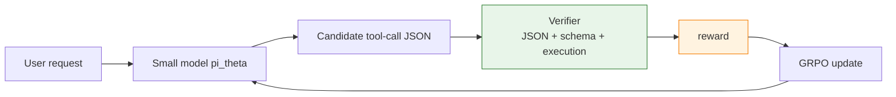

# 9.5 Hands-On: Training a Small Model with GRPO for Stable Financial API Calls

In the previous section, we used math problems to understand RLVR: as long as the answer can be verified by rules, we do not necessarily need to train a Reward Model. Now let us move the same idea into a more enterprise-like setting. A user asks a financial question in natural language, and a small model must choose the correct API, fill the correct arguments, and produce the right answer after the tool returns.

Start with the intuition. In a math task, the action is "write the answer." In a financial assistant, the action is "call a tool." For example, if the user asks:

> What was AAPL's closing price on 2025-01-03?

A reliable tool-calling model should not answer from memory. It should generate a structured call:

```json
{
  "name": "get_stock_price",
  "arguments": { "ticker": "AAPL", "date": "2025-01-03" }
}
```

What this step means is: the model is no longer only a language generator. It is choosing an action from a controlled API menu. The real issue is that small models often make three kinds of mistakes: wrong function name, wrong arguments, or invalid JSON. For enterprise APIs, these errors are more dangerous than ordinary text mistakes, because a bad tool call may query the wrong customer, place the wrong order, or update the wrong database.

This section follows the idea of AWS's financial tool-calling GRPO + TRL example[^aws-financial-tool-grpo], but keeps the experiment smaller and easier to reproduce. We first define a small synthetic financial API dataset, then build a verifier that scores tool calls, and finally train a small model with TRL's `GRPOTrainer`. The goal is not to reproduce cloud-scale throughput, but to make the key idea clear: **enterprise API calls can also be trained with RLVR**.

## Task: From Natural Language to API Calls

We keep the environment minimal. Suppose the enterprise system exposes only three financial APIs:

| Tool               | Purpose                                          | Required arguments                       |
| ------------------ | ------------------------------------------------ | ---------------------------------------- |
| `get_stock_price`  | Get the closing price of a ticker on a date      | `ticker`, `date`                         |
| `get_revenue`      | Get annual revenue for a company and fiscal year | `company`, `fiscal_year`                 |
| `convert_currency` | Convert money using a fixed exchange rate        | `amount`, `from_currency`, `to_currency` |

A natural-language request may require one tool call, or it may require no tool at all:

| User request                                  | Correct action          |
| --------------------------------------------- | ----------------------- |
| "Get MSFT close price on 2025-01-02."         | call `get_stock_price`  |
| "What was Tesla revenue in fiscal year 2024?" | call `get_revenue`      |
| "Convert 120 USD to EUR."                     | call `convert_currency` |
| "Write a poem about markets."                 | no tool call            |

The RLVR signal comes from an executable verifier. After the model generates JSON, we check whether it can be parsed, whether the function name exists, whether the arguments match the schema, and whether execution returns the expected result. This is not "does it look plausible?" It is "can it really call the right thing?"



## Data: Small but Complete

In real enterprise settings, data usually comes from three sources: historical API logs, manually curated business cases, and query-call pairs synthesized by stronger models. For this small experiment, we use a simple data generator. Each sample contains:

- `prompt`: the user request and tool specification
- `gold_call`: the reference tool call
- `expected_result`: the expected result after executing the tool

```python
import json
from datasets import Dataset

TOOLS = [
    {
        "name": "get_stock_price",
        "description": "Get the closing stock price for a ticker on a date.",
        "parameters": {
            "ticker": {"type": "string"},
            "date": {"type": "string", "format": "YYYY-MM-DD"},
        },
        "required": ["ticker", "date"],
    },
    {
        "name": "get_revenue",
        "description": "Get annual revenue for a company and fiscal year.",
        "parameters": {
            "company": {"type": "string"},
            "fiscal_year": {"type": "integer"},
        },
        "required": ["company", "fiscal_year"],
    },
    {
        "name": "convert_currency",
        "description": "Convert money between currencies.",
        "parameters": {
            "amount": {"type": "number"},
            "from_currency": {"type": "string"},
            "to_currency": {"type": "string"},
        },
        "required": ["amount", "from_currency", "to_currency"],
    },
]

STOCK_DB = {
    ("AAPL", "2025-01-02"): 243.85,
    ("AAPL", "2025-01-03"): 243.36,
    ("MSFT", "2025-01-02"): 418.58,
    ("MSFT", "2025-01-03"): 423.35,
}

REVENUE_DB = {
    ("Apple", 2024): 391_035_000_000,
    ("Microsoft", 2024): 245_122_000_000,
    ("Tesla", 2024): 97_690_000_000,
}

FX_DB = {
    ("USD", "EUR"): 0.92,
    ("EUR", "USD"): 1.09,
    ("USD", "JPY"): 157.2,
}


def execute_tool(name: str, arguments: dict):
    if name == "get_stock_price":
        return STOCK_DB[(arguments["ticker"], arguments["date"])]
    if name == "get_revenue":
        return REVENUE_DB[(arguments["company"], arguments["fiscal_year"])]
    if name == "convert_currency":
        rate = FX_DB[(arguments["from_currency"], arguments["to_currency"])]
        return round(arguments["amount"] * rate, 2)
    raise ValueError(f"Unknown tool: {name}")


def build_prompt(user_query: str) -> str:
    return (
        "You are a financial assistant. Choose exactly one tool call if a tool "
        "is needed. Return only JSON with this shape: "
        '{"name": "...", "arguments": {...}}. '
        "If no tool is needed, return "
        '{"name": "no_call", "arguments": {}}.\n\n'
        f"Available tools:\n{json.dumps(TOOLS, ensure_ascii=False, indent=2)}\n\n"
        f"User request: {user_query}\n"
    )


def make_dataset() -> Dataset:
    rows = []
    examples = [
        (
            "What was AAPL's closing price on 2025-01-03?",
            {"name": "get_stock_price", "arguments": {"ticker": "AAPL", "date": "2025-01-03"}},
        ),
        (
            "Get MSFT close price on 2025-01-02.",
            {"name": "get_stock_price", "arguments": {"ticker": "MSFT", "date": "2025-01-02"}},
        ),
        (
            "How much revenue did Tesla report in fiscal year 2024?",
            {"name": "get_revenue", "arguments": {"company": "Tesla", "fiscal_year": 2024}},
        ),
        (
            "Convert 120 USD to EUR.",
            {
                "name": "convert_currency",
                "arguments": {"amount": 120, "from_currency": "USD", "to_currency": "EUR"},
            },
        ),
    ]

    for query, gold_call in examples:
        rows.append(
            {
                "prompt": build_prompt(query),
                "gold_call": json.dumps(gold_call, ensure_ascii=False),
                "expected_result": str(execute_tool(gold_call["name"], gold_call["arguments"])),
            }
        )

    rows.append(
        {
            "prompt": build_prompt("Write a short poem about financial markets."),
            "gold_call": json.dumps({"name": "no_call", "arguments": {}}),
            "expected_result": "no_call",
        }
    )
    return Dataset.from_list(rows)
```

This dataset is tiny. It is only meant to make the training loop visible. A real experiment should expand each tool into dozens or hundreds of query templates and include negative cases: missing arguments, wrong date formats, no available tool, and confusingly similar tools.

## Reward: Four Verifiable Scores

Math RLVR often asks only whether the final answer is correct. Tool calling needs a more detailed reward, otherwise the model will not know where it failed.

| Subreward                | What it checks               | Score |
| ------------------------ | ---------------------------- | ----- |
| JSON parseability        | machine-readable output      | `0.2` |
| correct function name    | correct API selection        | `0.3` |
| schema correctness       | required arguments and types | `0.3` |
| correct execution result | tool output matches target   | `0.2` |

This is not subjective judgment. It is a rule-based verifier.

```python
def parse_call(text: str) -> dict | None:
    try:
        return json.loads(text.strip())
    except json.JSONDecodeError:
        return None


def schema_ok(call: dict, gold: dict) -> bool:
    if call.get("name") != gold.get("name"):
        return False
    if not isinstance(call.get("arguments"), dict):
        return False
    for key, gold_value in gold["arguments"].items():
        if key not in call["arguments"]:
            return False
        if not isinstance(call["arguments"][key], type(gold_value)):
            return False
    return True


def tool_reward(completions, gold_call, expected_result, **kwargs):
    rewards = []
    for completion, gold_raw, expected in zip(completions, gold_call, expected_result):
        gold = json.loads(gold_raw)
        call = parse_call(completion)
        if call is None:
            rewards.append(0.0)
            continue

        reward = 0.2
        if call.get("name") == gold["name"]:
            reward += 0.3
        if schema_ok(call, gold):
            reward += 0.3

        if gold["name"] == "no_call":
            if call.get("name") == "no_call":
                reward += 0.2
            rewards.append(reward)
            continue

        try:
            result = execute_tool(call["name"], call["arguments"])
            if str(result) == expected:
                reward += 0.2
        except Exception:
            pass

        rewards.append(reward)
    return rewards
```

Look at it from another angle: this reward function is a miniature enterprise API test framework. It does not care whether the model gives a beautiful explanation. It cares whether the model produces an executable, correct, auditable action. For tool calling, executability is the first principle of reward design.

## Training with TRL's GRPOTrainer

Once we have data and a verifier, we can train with GRPO. The code below shows the minimal skeleton. If GPU memory is limited, start with `Qwen/Qwen2.5-0.5B-Instruct`; to mirror the AWS example more closely, use `Qwen/Qwen3-1.7B`.

```python
from peft import LoraConfig
from trl import GRPOConfig, GRPOTrainer


dataset = make_dataset()

peft_config = LoraConfig(
    r=16,
    lora_alpha=32,
    lora_dropout=0.05,
    target_modules=[
        "q_proj",
        "k_proj",
        "v_proj",
        "o_proj",
        "gate_proj",
        "up_proj",
        "down_proj",
    ],
    task_type="CAUSAL_LM",
)

training_args = GRPOConfig(
    output_dir="outputs/financial-tool-grpo",
    learning_rate=5e-6,
    per_device_train_batch_size=1,
    gradient_accumulation_steps=4,
    num_generations=4,
    max_prompt_length=2048,
    max_completion_length=256,
    temperature=0.8,
    logging_steps=1,
    save_steps=50,
    max_steps=100,
)

trainer = GRPOTrainer(
    model="Qwen/Qwen3-1.7B",
    args=training_args,
    train_dataset=dataset,
    reward_funcs=tool_reward,
    peft_config=peft_config,
)

trainer.train()
```

The training logic is the same as math RLVR:

1. sample `num_generations=4` tool calls for the same prompt
2. score each candidate with `tool_reward()`
3. compute relative advantages within the group
4. increase the probability of high-scoring calls and decrease low-scoring calls

The only difference is the reward shape: math tasks verify the final answer, while tool-calling tasks verify JSON, schema, and execution result.

## Evaluation: Do Not Only Watch Mean Reward

Tool-calling training can create a dangerous illusion: reward rises, but the model is still unsafe for production APIs. This happens when one subreward dominates. For example, the model may learn valid JSON while still choosing the wrong function.

Evaluate at least four metrics:

```python
def evaluate_tool_call(predictions: list[str], examples: list[dict]) -> dict:
    total = len(examples)
    valid_json = 0
    name_match = 0
    schema_match = 0
    exact_match = 0

    for pred, ex in zip(predictions, examples):
        gold = json.loads(ex["gold_call"])
        call = parse_call(pred)
        if call is None:
            continue

        valid_json += 1
        if call.get("name") == gold["name"]:
            name_match += 1
        if schema_ok(call, gold):
            schema_match += 1

        try:
            if gold["name"] == "no_call":
                if call.get("name") == "no_call":
                    exact_match += 1
            else:
                result = execute_tool(call["name"], call["arguments"])
                if str(result) == ex["expected_result"]:
                    exact_match += 1
        except Exception:
            pass

    return {
        "response_validity": valid_json / total,
        "function_name_accuracy": name_match / total,
        "schema_match": schema_match / total,
        "exact_match": exact_match / total,
    }
```

The metrics answer different questions:

- `response_validity`: can the system parse the output?
- `function_name_accuracy`: did the model choose the right tool?
- `schema_match`: are argument names and types correct?
- `exact_match`: does executing the call produce the expected result?

The AWS financial tool-calling example reports similar improvements: after GRPO/RLVR, Qwen3-1.7B improves exact match from about `0.62` to `0.96`, response validity from about `0.78` to `0.99`, and schema match from about `0.90` to `0.95`[^aws-financial-tool-grpo]. The important point is that small models can learn enterprise API calling when correctness is made explicit and optimizable.

## Difference from SFT

Why not just use SFT and show the model the gold JSON?

SFT is useful, especially for teaching the output format. But SFT learns "imitate the gold answer"; GRPO/RLVR learns "compare attempts by whether they actually work."

| Training method | What it learns                                            | Common failure                                                                         |
| --------------- | --------------------------------------------------------- | -------------------------------------------------------------------------------------- |
| SFT             | JSON format and common function-selection patterns        | new argument combinations, similar-tool confusion, guessing when arguments are missing |
| GRPO/RLVR       | which calls are executable and which errors are penalized | reward hacking if the verifier is incomplete                                           |

In practice, the common order is: use SFT to teach the tool-call format, then use GRPO/RLVR to correct tool-call mistakes. It is not A replacing B. It is B giving A a sharper post-training signal.

## Common Pitfalls

**First, do not reward only valid JSON.** If valid JSON receives too much reward, the model will learn fixed templates instead of correct tool selection.

**Second, include no-call examples.** Otherwise the model will force every request into an API call. One of the most important abilities of an enterprise assistant is knowing when not to act.

**Third, create confusingly similar tools.** If every prompt maps to an obvious tool, the model will not learn fine-grained distinctions. In real systems, `get_revenue`, `get_profit`, and `get_cash_flow` may be very close; mistakes often happen there.

**Fourth, isolate side effects.** Query APIs can be executed directly. Write APIs must use sandboxing, mocks, or dry-run mode. RL training explores heavily; the model must not mutate production databases.

## Summary

This section extends RLVR from math answers to enterprise tool calling. The algorithm is not the main change. The verifier is.

- Math RLVR verifies final answers.
- Code RLVR runs unit tests.
- Tool-calling RLVR verifies JSON, schema, tool choice, and execution results.

Tool calling is therefore a natural entry point for RLVR in enterprise settings. Enterprise APIs already have schemas, argument types, permission boundaries, and executable results. These are exactly the ingredients of a verifier. Once a business action can be wrapped as a verifiable environment, a small model can use GRPO to learn more stable tool calls.

[^aws-financial-tool-grpo]: AWS Builder Center, [Fine-tune Small Language Models for Production-Grade Tool Calling with GRPO using Hugging Face TRL on Amazon SageMaker AI](https://builder.aws.com/content/35x6VR6kZYSn3JgNQmcNmIVK32Y/fine-tune-small-language-models-for-production-grade-tool-calling-with-grpo-using-hugging-face-trl-on-amazon-sagemaker-ai).
