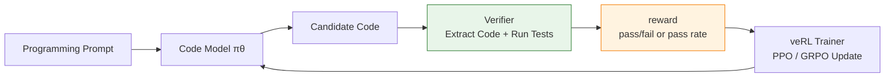

# 15.8 Hands-on: Training Code Generation with veRL

> **Section goal**: Connect a code-execution verifier to veRL, train a code model from test pass rates, and complete data preparation, sandbox checks, PPO training, and before-and-after evaluation.

> **Learning path**: [15.3 RLVR Rewards](./rlvr) → [13.8 veRL PPO on GSM8K](../chapter15_rlhf/verl-ppo-gsm8k) → **15.8 Code Generation with veRL**

> **Code and resources**: [data preparation](https://github.com/walkinglabs/hands-on-modern-rl/blob/main/code/chapter18_grpo/verl_code_rlvr/prepare_data.py) · [code reward](https://github.com/walkinglabs/hands-on-modern-rl/blob/main/code/chapter18_grpo/verl_code_rlvr/code_reward.py) · [single-GPU launcher](https://github.com/walkinglabs/hands-on-modern-rl/blob/main/code/chapter18_grpo/verl_code_rlvr/run_qwen_coder_ppo_single_gpu.sh)

Section 13.8 already used veRL to train a mathematical model, requiring only the extraction of the final number and comparison with the standard answer. For code tasks, an additional step is required: the program generated by the model must be placed in an isolated environment, undergo syntax checks, execution, and unit testing, and the pass rate of the tests becomes the reward. Below, we reuse the same veRL training framework, only replacing the data processing and reward pipeline.

This section references the veRL Code Sandbox tutorial from VolcEngine[^volcengine-verl-code-sandbox], specifically the following content:

- **Training Configuration**: The overall plan using the Eurus-2-RL-Data dataset (only code samples) + Qwen2.5 series models + PPO (GAE advantage estimation).
- **Data Processing**: The process of filtering excessively long prompts and randomly sampling 1,000 training data samples.
- **Reward Design Idea**: Treat the code generated by the model as an independent program, run stdin/stdout tests to calculate the pass rate (see the reward function design below).
- **Evaluation Methods and Data**: The evaluation process using EvalScope on GSM8K, HumanEval, and LiveCodeBench, as well as the comparison data before and after RL training.

The original VolcEngine tutorial used VKE plus SandboxFusion for large-scale distributed training. This section demonstrates the reward wiring with a local subprocess and replaces the cluster launcher with single- or multi-GPU scripts. A subprocess isolates interpreter state only; it does not replace a security sandbox. Run the training job inside a least-privilege container or virtual machine. The complete industrial-level code agent experiment is placed in [19.8 Training DeepCoder Agent with rLLM](../chapter22_agentic/rllm-deepcoder-lab), where the focus is on AgentFlow and sandbox cookbook; this section focuses on wiring a code verifier into veRL.



## 15.8.1 Why Code Generation is Suitable for RLVR

General conversation tasks are difficult to define a "correct answer". The same response may be preferred by some for being concise and by others for being detailed. The Reward Model may also be gamed by the model.

In code tasks, the test suite can provide clear feedback. For example, if the task is to write a `two_sum(nums, target)`:

```python
def two_sum(nums, target):
    ...
```

We can prepare tests like:

```python
assert two_sum([2, 7, 11, 15], 9) == [0, 1]
assert two_sum([3, 2, 4], 6) == [1, 2]
assert two_sum([3, 3], 6) == [0, 1]
```

No matter how elegant the model's code is, if the tests fail, the reward will be low. No matter how long the model's explanation is, if it does not provide executable code, the reward will also be low. This feedback is much more reliable than text-based scoring that relies on "looks like a correct answer."

The reward in code RLVR typically has three layers:

| Level         | What is Checked                                       | Typical Reward |
| ------------- | ----------------------------------------------------- | -------------- |
| Format Check  | Whether code block is extracted, function name exists | 0.0–0.2        |
| Compile/Check | Whether import or execution is possible               | 0.0–0.3        |
| Unit Tests    | How many test cases are passed                        | 0.0–1.0        |

The most important is the third level. The first two levels are just to ensure that there is some signal in the early stages of training.

## 15.8.2 Environment Preparation

### Hardware Requirements

This section is configured for **a single GPU** (24GB VRAM, such as RTX 3090 / 4090 / A5000) or **multi-GPU** environments:

| Model              | Parameters | Training Scheme        | VRAM Requirement                      |
| ------------------ | ---------- | ---------------------- | ------------------------------------- |
| Qwen2.5-Coder-0.5B | 0.5B       | Full parameters + vLLM | ~18 GB (single GPU)                   |
| Qwen2.5-Coder-1.5B | 1.5B       | LoRA + vLLM            | ~20 GB (single GPU)                   |
| Qwen2.5-Coder-7B   | 7B         | Full training          | ~80 GB (single A100 GPU or multi-GPU) |

As in Section 13.8, PPO requires loading both the Actor, Critic (trainable), and Reference (frozen) models simultaneously, along with the vLLM inference engine, so the VRAM pressure is greater than that of pure SFT. The 0.5B code model with full parameter training is the safest starting point for a single GPU.

### Installation of veRL

If you have already installed veRL as described in Section 13.8, you can skip this step. Otherwise:

```bash
# Create environment
conda create -n verl python==3.10 -y
conda activate verl

# Install PyTorch (CUDA 12.x)
pip install torch torchvision --index-url https://download.pytorch.org/whl/cu121

# Install veRL
git clone https://github.com/volcengine/verl.git
cd verl
pip install -e .

# Install vLLM (inference engine)
pip install vllm==0.8.3

# Install Flash Attention
pip install flash-attn --no-build-isolation
```

### Data Preparation

This section uses the [Eurus-2-RL-Data](https://huggingface.co/datasets/PRIME-RL/Eurus-2-RL-Data) dataset, from the PRIME-RL project, which is a specially designed **math + code** reasoning dataset for reinforcement learning.

> **Note (issue #53):** Eurus-2-RL-Data **does not** have top-level fields such as `entry_point` or `tests`. Its actual structure is native to veRL, and the validation information is stored in the `reward_model` column:
>
> | Field          | Meaning                                                                                                                                                                                                 |
> | -------------- | ------------------------------------------------------------------------------------------------------------------------------------------------------------------------------------------------------- |
> | `prompt`       | Array of chat messages: `[{ "role": "system", ... }, { "role": "user", ... }]`. The `system` is the PRIME reasoning action template (`[ASSESS]`/`[ADVANCE]`/...), and the `user` is the actual question |
> | `ability`      | `"math"` or `"code"`, and this experiment only uses `code`                                                                                                                                              |
> | `reward_model` | `{"ground_truth": <answer>, "style": "rule"}`. For code samples, the `ground_truth` is a JSON string `{"inputs": [...], "outputs": [...]}`, i.e., a stdin/stdout test pair                              |
> | `data_source`  | Question source: `codecontests` / `taco` / `apps` / `codeforces`                                                                                                                                        |
> | `extra_info`   | `{"index": ..., "split": ...}`                                                                                                                                                                          |

That is, these code samples are **"read from stdin, write to stdout" competitive programming problems**, not "implement a function signature" type of questions — so there is no `entry_point`, and the tests are not `assert` statements, but rather input-output pairs. The reward function should treat the model-generated code as an independent program, feed it the input, and compare the output.

The dataset is already split: train has 480,000 samples (of which `ability == "code"` has 25,000), and validation has 2,048 samples (of which code has 1,024).

The script to process the data is available at [code/chapter18_grpo/verl_code_rlvr/prepare_data.py](https://github.com/walkinglabs/hands-on-modern-rl/blob/main/code/chapter18_grpo/verl_code_rlvr/prepare_data.py). It generates the parquet files needed for veRL in one go:

```bash
conda activate test
python code/chapter18_grpo/verl_code_rlvr/prepare_data.py
```

What the script does:

1. **Filter code samples**: `ability == "code"`, resulting in 25,000 code problems.
2. **Reconstruct the prompt**: Remove the PRIME reasoning template from the system message (which is irrelevant for code generation), and retain only the user's problem. Reconstruct it into a **chat message format** `[{"role":"system","content":"You are a competitive programming assistant."}, {"role":"user","content":"Read stdin, write stdout instruction + problem"}]`. ⚠️ Do not use plain text strings — veRL will apply `apply_chat_template` to the prompt, and the string will be discarded (see the field table notes below).
3. **Filter + Sampling**: Filter out samples with prompts exceeding 512 tokens (1 token ≈ 4 characters), then randomly sample 1,000 samples and save them as `~/data/eurus2/train1000.parquet`; validation is saved directly as `~/data/eurus2/validation.parquet`.

After processing, the columns of `train1000.parquet` are in the native format of veRL:

| Field          | Meaning                                                   | Example                                                                                                                       |
| -------------- | --------------------------------------------------------- | ----------------------------------------------------------------------------------------------------------------------------- |
| `prompt`       | **Chat message list** (system instruction + user problem) | `[{"role":"system","content":"You are a competitive programming assistant."}, {"role":"user","content":"Read the problem…"}]` |
| `reward_model` | `{"ground_truth": I/O test JSON, "style": "rule"}`        | `'{"inputs": [...], "outputs": [...]}'`                                                                                       |
| `data_source`  | Problem source                                            | `"codecontests"` / `"taco"` / `"apps"`                                                                                        |
| `ability`      | `"code"`                                                  | `"code"`                                                                                                                      |
| `extra_info`   | `{index, split}`                                          | `{"index": 0, "split": "dummy"}`                                                                                              |

> **Why must the prompt be in chat message format, rather than plain text?** veRL's RLHFDataset passes the `prompt` to the model's `apply_chat_template`. If the `prompt` is plain text, Qwen's template will directly discard the content, only generating the two special tokens `system` and `assistant` (in practice, only 24 tokens), and the model will not see the problem, resulting in a reward that is always 0. Therefore, `prepare_data.py` reconstructs the prompt using the structure `[{"role": "system", ...}, {"role": "user", ...}]`.

During training, the model only sees the `prompt`, and veRL passes the `reward_model.ground_truth` to the reward function for validation. This is the core of the code RLVR — **the reward function does not evaluate the writing style, but only evaluates whether the code can pass the tests**.

## 15.8.3 Reward Function Design

The GSM8K reward function in Section 13.8 only needs to extract the final number from the model's output and perform a numerical comparison. The code task is completely different: it requires extracting the code block from markdown, placing it in an isolated environment for execution, and handling compilation errors, runtime exceptions, and timeouts.

This is the biggest engineering difference between this section and Section 13.8. Below, we explain the design of the reward function module by module.

### Extracting Code from Model Output

The output of a model is typically a block of text that contains explanations and code in markdown format. We need to extract the Python code portion from this text:

````python
import re

_CODE_BLOCK_RE = re.compile(r"```(?:python)?\n(.*?)```", re.DOTALL)


def extract_code(response: str) -> str:
    """Extract Python code blocks from model output.

    Models often output text similar to the following:
        "```python\nimport sys\n\nfor line in sys.stdin: ...```"
    We only need the part between ```python and ```.
    If the model does not output code in a code block format, the entire response
    is treated as code (as a fallback).
    """
    match = _CODE_BLOCK_RE.search(response)
    if match:
        return match.group(1).strip()
    return response.strip()
````

If the model does not output code in the expected block format, `extract_code` will treat the entire response as code — which typically results in syntax errors and a reward of 0. This itself becomes a training signal, forcing the model to learn how to output code in the correct format.

### Running stdin/stdout Tests (I/O Validation)

This is the biggest difference between this section and Section 13.8. The code sample for Eurus-2-RL-Data **does not include `tests` (assert statements)**, and `reward_model.ground_truth` is a JSON string `{"inputs": [...], "outputs": [...]}` — that is, **the generated code is run as an independent program**: for each input, the input is fed into stdin, and the stdout is compared with the expected output.

`subprocess` separates interpreter state and supports timeouts, but it retains the current user's filesystem, network, and environment-variable access. The executor below must run inside an already isolated container or virtual machine. It refuses to execute code by default; set `HOMRL_ALLOW_UNSAFE_CODE_EXECUTION=1` only after that outer isolation is in place:

```python
import json
import subprocess
import sys
import tempfile
from pathlib import Path


def run_io_tests(code: str, ground_truth_json: str, timeout_s: float = 10.0):
    """Run the code as an independent program and test it using the ground truth inputs/outputs.

    Returns (pass_rate, detailed results of the first few test cases). Any exceptions
    (syntax errors, crashes, timeouts, output mismatches) only affect the current test case,
    and do not interrupt the scoring.
    """
    tests = json.loads(ground_truth_json)
    inputs, outputs = tests["inputs"], tests["outputs"]

    with tempfile.NamedTemporaryFile("w", suffix=".py", delete=False) as f:
        f.write(code)
        tmp_path = f.name

    try:
        passed = 0
        for inp, expected in zip(inputs, outputs):
            try:
                proc = subprocess.run(
                    [sys.executable, tmp_path],
                    input=inp, capture_output=True, text=True, timeout=timeout_s,
                )
                got = proc.stdout.strip()
                if proc.returncode == 0 and got == expected.strip():
                    passed += 1
            except subprocess.TimeoutExpired:
                pass  # Timeout (dead loop / inefficient code) only counts as this test case failing
        return passed / len(inputs)
    finally:
        Path(tmp_path).unlink(missing_ok=True)
```

The timeout is set to 10 seconds. Most single-test problems in competitions can be completed within 1 second, and the 10-second limit provides sufficient buffer. If a timeout occurs, it suggests that the model may have written an infinite loop or extremely inefficient code, and only the points for this particular problem will be deducted.

### Packaging the Reward Interface as veRL

The `RewardManager` in veRL (located at `verl/workers/reward_manager/naive.py`) calls the reward function with the following signature:

```python
score = self.compute_score(
    data_source=data_source,   # data_source column of the dataset
    solution_str=response_str, # the full response generated by the model (markdown text)
    ground_truth=ground_truth, # ground_truth from reward_model["ground_truth"]
    extra_info=extra_info,     # extra_info column of the dataset (not used in this dataset)
)
```

Therefore, `compute_score` should be written according to this signature. When returning a dictionary, veRL uses `"score"` as the main reward for PPO, and the other keys (`pass_rate`, `format`) are added as log information:

```python
def compute_score(data_source, solution_str, ground_truth, extra_info=None):
    """The entry function for veRL reward.

    Args:
        data_source: The source of the dataset (e.g., codecontests/taco/apps/codeforces)
        solution_str: The full response generated by the model (markdown text)
        ground_truth: reward_model["ground_truth"], which is a JSON string for code samples
        extra_info: The extra_info column of the dataset (not used in this dataset)

    Returns:
        {"score": pass_rate, "pass_rate": pass_rate, "format": whether code is extracted}
    """
    match = _CODE_BLOCK_RE.search(solution_str)
    format_ok = 1.0 if match else 0.0
    code = extract_code(solution_str)
    if not code:
        return {"score": 0.0, "pass_rate": 0.0, "format": 0.0}

    pass_rate, _ = run_io_tests(code, ground_truth)
    return {"score": pass_rate, "pass_rate": pass_rate, "format": format_ok}
```

### Complete Code

The complete file is available at [code/chapter18_grpo/verl_code_rlvr/code_reward.py](https://github.com/walkinglabs/hands-on-modern-rl/blob/main/code/chapter18_grpo/verl_code_rlvr/code_reward.py). You can run it directly for self-checking (without relying on the training environment):

```bash
HOMRL_ALLOW_UNSAFE_CODE_EXECUTION=1 \
  python code/chapter18_grpo/verl_code_rlvr/code_reward.py
```

Output example:

```
Correct code -> score=1.00 pass_rate=1.00 format=1
Incorrect code -> score=0.00 pass_rate=0.00 format=1
No code -> score=0.00 pass_rate=0.00 format=0
```

The core idea of this reward function is: **do not evaluate the writing style, only evaluate whether the code can pass the tests**. If the code cannot run, the reward is 0, regardless of how long the model's explanation is. This hard signal is much more reliable than the soft scores of RM.

## 15.8.4 Prompt Template

When training the code model, the prompt should be as constrained as possible. In the early stages, do not allow the model to write long explanations, as this would require the verifier to spend a lot of effort to extract the code.

The code samples in Eurus-2-RL-Data are from "reading from stdin and writing to stdout" programming competition problems, and **do not** include fields such as `entry_point`/`problem_statement`. When `prepare_data.py` rebuilds the prompt, it uses the **chat message format** (see `CODE_GEN_SYSTEM` / `CODE_GEN_USER_TEMPLATE` in [prepare_data.py](https://github.com/walkinglabs/hands-on-modern-rl/blob/main/code/chapter18_grpo/verl_code_rlvr/prepare_data.py)):

```json
[
  {
    "role": "system",
    "content": "You are a competitive programming assistant."
  },
  {
    "role": "user",
    "content": "Read the problem below and write a Python solution that reads from stdin and writes to stdout.\nReturn only one Python code block, with no explanations.\n\nProblem:\n{problem}"
  }
]
```

Among them, `{problem}` is the question from the user's message in the dataset (retaining the Input/Output format specification and examples). Compared to the earlier version of the document, this version omits `Function name: {entry_point}` — because such questions do not require implementing a specific function signature, but instead require the program to read from stdin and write to stdout.

**Why must it be in chat format?** veRL will pass the `prompt` to `apply_chat_template`. Plain text strings will be directly discarded by the Qwen template (leaving only the system and assistant special tokens), and the model will not see the question. Therefore, even when training a base coder, it is recommended to maintain the chat structure so that the template can correctly construct the full prompt. The key is to keep the training and evaluation templates consistent.

## 15.8.5 Single-GPU Training Script

Based on the structure of the veRL PPO script in Section 13.8, this script is adapted for code generation tasks. The overall framework remains unchanged, with three key differences: the dataset is changed to Eurus-2-RL-Data (only code samples are selected), the reward function is changed to code validation, and `max_response_length` is increased from 256 to 512 (code answers are typically longer than mathematical reasoning).

The design philosophy of the script is completely consistent with Section 13.8: all parameters are set with default values through environment variables, and if adjustments are needed, they can be made directly via the command line without modifying the script. The complete script is available at [code/chapter18_grpo/verl_code_rlvr/run_qwen_coder_ppo_single_gpu.sh](https://github.com/walkinglabs/hands-on-modern-rl/blob/main/code/chapter18_grpo/verl_code_rlvr/run_qwen_coder_ppo_single_gpu.sh).

Compared to the GSM8K script in Section 13.8, the key new configuration in this section is the **Reward wiring** — if `custom_reward_function` is not configured, the reward will not be activated at all (this was an omission in the earlier version of the document):

```bash
# ---- Reward Configuration ----
# Use code_reward.py for rule-based reward (run stdin/stdout tests), do not train Reward Model
# This is the biggest difference between this section and Section 13.8: the reward comes from code execution validation, not from a pre-trained RM
REWARD=(
    reward_model.enable=False
    custom_reward_function.path="$REWARD_FILE"
    custom_reward_function.name=compute_score
)
```

The `$REWARD_FILE` defaults to `code_reward.py` in the same directory as the script. `custom_reward_function.name=compute_score` tells veRL to call the `compute_score` function in `code_reward.py`. When starting training, add `${REWARD[@]}` to the parameter list of `main_ppo`:

```bash
python3 -m verl.trainer.main_ppo \
    "${DATA[@]}" "${MODEL[@]}" "${ACTOR[@]}" "${ROLLOUT[@]}" \
    "${REF[@]}" "${CRITIC[@]}" "${REWARD[@]}" "${TRAINER[@]}" "$@"
```

The rest of the script (data, model, Actor/Reference/Critic, Trainer configuration) is largely consistent with Section 13.8.

### Configuration Interpretation

Compared to the PPO configuration for GSM8K in Section 13.8, there are several key differences:

| Configuration Item    | GSM8K (Section 13.8) | Code Generation (This Section)      | Reason                                                        |
| --------------------- | -------------------- | ----------------------------------- | ------------------------------------------------------------- |
| Dataset               | GSM8K math problems  | Eurus-2-RL-Data (only code samples) | Code tasks require verifiable test cases                      |
| Reward function       | `gsm8k_reward`       | `code_reward`                       | Code requires extraction + execution of stdin/stdout tests    |
| `max_response_length` | 256                  | 512                                 | Code answers are typically longer than mathematical reasoning |
| Base model            | Qwen2.5-0.5B         | Qwen2.5-Coder                       | Coder variant performs better for code generation             |
| Reward wiring         | —                    | `custom_reward_function`            | Code reward is a custom function and must be explicitly wired |

Other parameters (learning rate, clip_ratio, GAE, etc.) remain consistent with Section 13.8 — they are algorithm parameters of PPO and do not vary with task types.

### Correspondence with the Four Model Roles in Section 13.8

As in Section 13.8, the training of PPO involves four model roles:

| Role in Section 13.8 | Corresponding in This Section  | Description                                                              |
| -------------------- | ------------------------------ | ------------------------------------------------------------------------ |
| Actor                | `actor_rollout_ref.actor.*`    | Trainable policy that generates candidate code and updates               |
| Reference            | `actor_rollout_ref.ref.*`      | Frozen SFT model used to compute KL constraints                          |
| Critic               | `critic.*`                     | Trainable value function that estimates advantage using GAE              |
| RM/Reward            | `code_reward.py:compute_score` | Code validation: extract code → run in subprocess → compare input/output |

The key difference is the last row: Section 13.8 uses mathematical answer matching (extracting numbers for numerical comparison), while this section uses code execution validation (extract code → run in subprocess → compare input/output). The reward signal is a score between 0 and 1 based on test pass rate, but the engineering complexity of the code reward is higher.

## 15.8.6 Starting Training

### Directly Running the Script

```bash
chmod +x run_qwen_coder_ppo_single_gpu.sh
bash run_qwen_coder_ppo_single_gpu.sh
```

### Overriding Parameters via Environment Variables

```bash
# Switching to the 1.5B coder model
MODEL_PATH=Qwen/Qwen2.5-Coder-1.5B-Instruct \
TRAIN_BATCH_SIZE=64 \
PPO_MINI_BATCH_SIZE=16 \
bash run_qwen_coder_ppo_single_gpu.sh
```

```bash
# Multi-GPU extension (8 GPUs)
NNODES=1 NDEVICES_PER_NODE=8 \
TRAIN_BATCH_SIZE=1024 \
PPO_MINI_BATCH_SIZE=256 \
ROLLOUT_TP=2 \
bash run_qwen_coder_ppo_single_gpu.sh
```

Ray will automatically initialize within `main_ppo`. In a single-GPU scenario, all workers take turns executing on the same GPU; for multiple GPUs, Ray automatically distributes the workload, and there is no need to manually manage the cluster.

### Training Output

After the training starts, the terminal will output key metrics:

```
[Step 1]  train | reward/score=0.03 | reward/pass_rate=0.03 | reward/format=0.15 | kl=0.000
[Step 5]  val   | reward/score=0.08 | reward/pass_rate=0.08
[Step 6]  train | reward/score=0.12 | reward/pass_rate=0.12 | reward/format=0.45 | kl=0.002
[Step 10] val   | reward/score=0.21 | reward/pass_rate=0.21
```

> The metric names are `reward/score` (i.e., the `score` key returned by `compute_score`, which veRL uses as the main reward for PPO), and `pass_rate` and `format` are additional logging metrics.

Note that the `format` metric typically rises before `pass_rate` — the model first learns to "output code blocks in a formatted way," and then gradually learns to "write code that passes tests." This is the typical training dynamics of code RLVR.

## 15.8.7 Training Metric Analysis

### Key Metric Interpretation

| Metric             | Healthy Signal             | Danger Signal                                |
| ------------------ | -------------------------- | -------------------------------------------- |
| `reward/pass_rate` | Slowly increasing          | Long-term 0 or sudden spike                  |
| `reward/format`    | Rises before pass_rate     | Always very low (model does not output code) |
| `kl`               | Slowly increasing          | Continuously surging                         |
| `actor_loss`       | Fluctuates between 0.5~1.0 | Explodes to >10 or NaN                       |
| `response_length`  | Stable or slightly growing | Rises in sync with reward                    |

### Typical Training Curve of Code RLVR

**Stage 1: Learning Format (step 1~10)**. `pass_rate` is close to 0, but `format` begins to rise. The model is learning to "output code within a ```python code block", but most of the generated code is still not executable. `kl` is close to 0.

**Stage 2: Learning to Write Code (step 10~40)**. `pass_rate` starts to rise steadily. The model has stabilized in outputting code format and is beginning to learn how to write compilable code, then code that passes some tests. This stage is the most effective window for PPO.

**Stage 3: Diminishing Returns (step 40+)**. `pass_rate` growth slows down. Remaining errors are typically due to the model's capability ceiling — the problem is too difficult, or the model's parameter count is insufficient.

### Evaluation Results

The following evaluation data is based on the official experiment from the VolcEngine (Qwen2.5-7B-Instruct-1M, Eurus-2-RL-Data with approximately 1,000 training data samples, 130 steps of PPO) [^volcengine-verl-code-sandbox]. The data was evaluated using [EvalScope](https://github.com/modelscope/evalscope) on three benchmarks:

| Model                               | GSM8K | HumanEval | LiveCodeBench |
| ----------------------------------- | ----- | --------- | ------------- |
| Qwen2.5-7B-Instruct-1M (Original)   | 0.82  | 0.59      | 0.50          |
| Qwen2.5-7B-Instruct-1M-step130 (RL) | 0.83  | 0.59      | 0.53          |

As observed:

- **LiveCodeBench shows the most significant improvement** (0.50 → 0.53), which directly reflects the model's coding ability. The RL training has enabled the model to perform better on dynamic programming problems.
- **GSM8K shows a slight improvement** (0.82 → 0.83), indicating that the code-based RL training also has some transfer effect on mathematical reasoning.
- **HumanEval remains unchanged** (0.59). This benchmark consists of relatively fixed problems, and the coverage of 1,000 training data samples is limited.

After RL training, the model's mathematical reasoning steps are more logically clear, the language is more concise, and it is better able to output answers in the required format as specified by the prompt. Theoretically, there is still room for further improvement by increasing the number of training steps and using more training data.

## 15.8.8 Model Evaluation

After training is completed, the checkpoint should be evaluated independently to confirm that the PPO training has indeed led to an improvement in capability.

### Checkpoint Merging

veRL is trained using FSDP, and the saved checkpoints are sharded by GPU. They need to be merged into the standard HuggingFace format:

```bash
python scripts/model_merger.py merge \
    --backend fsdp \
    --local_dir /path/to/checkpoints/global_step_20/actor \
    --target_dir ./merged_model
```

### EvalScope Evaluation

Use [EvalScope](https://github.com/modelscope/evalscope) for independent evaluation:

```bash
# Install EvalScope
pip install evalscope

# Evaluate code capability (HumanEval + LiveCodeBench)
evalscope eval \
    --model ./merged_model \
    --datasets humaneval livecodebench \
    --limit 100

# Evaluate mathematical reasoning (as a baseline)
evalscope eval \
    --model ./merged_model \
    --datasets gsm8k \
    --limit 100
```

During evaluation, please note the following:

- **Use the test set**: Do not evaluate on the training set, as this would lead to artificially inflated scores.
- **Compare with baseline**: Evaluate the original model before RL to quantify the real improvement brought by PPO.
- **Multiple benchmarks for comparison**: Relying solely on HumanEval is insufficient; LiveCodeBench better reflects the actual capability of code models.

## 15.8.9 Scaling from Single GPU to Multi-GPU

Once you understand the single-GPU configuration, scaling to multiple GPUs requires only a few key parameter changes:

| Parameter              | Single GPU | 8 GPUs | Description                                  |
| ---------------------- | ---------- | ------ | -------------------------------------------- |
| `NDEVICES_PER_NODE`    | 1          | 8      | Number of GPUs                               |
| `TRAIN_BATCH_SIZE`     | 128        | 1024   | Total batch (automatically split by FSDP)    |
| `PPO_MINI_BATCH_SIZE`  | 64         | 256    | Same as above                                |
| `ROLLOUT_TP`           | 1          | 2      | vLLM tensor parallelism                      |
| `ROLLOUT_GPU_MEM_UTIL` | 0.4        | 0.6    | More memory per GPU when using multiple GPUs |

Learning rate, clip_ratio, GAE parameters, and others are **not changed** — they are algorithm parameters that do not vary with hardware scale.

## 15.8.10 Relationship with the DeepCoder Experiment

This section and [19.8](../chapter22_agentic/rllm-deepcoder-lab) are both about the same overarching direction: using sandbox reward to train code models. The difference lies in the focus:

| Section           | Framework | Focus                                                             |
| ----------------- | --------- | ----------------------------------------------------------------- |
| 15.8 This Section | veRL      | Integrating a code verifier into the PPO/GRPO training framework  |
| 19.8              | rLLM      | Running complete Agentic experiments using the DeepCoder cookbook |

If you want to run through an end-to-end example first, prioritize reading 10.5. If you are already familiar with veRL and want to extend the mathematical RLVR to code tasks, follow the data, reward, and trainer interfaces outlined in this section to complete the implementation.

## 15.8.11 Experiment Checklist

Before starting the formal training, at least check these points:

- The test set must not appear in the training data.
- Disable network access, remove credentials, and run the verifier as an unprivileged user inside a container or virtual machine.
- The reward function must include a timeout to prevent infinite loops from stalling rollouts.
- Reward logs must record three types of errors: compilation failure, runtime failure, and test failure.
- Do not only look at the training reward; instead, fixate on an independent evaluation set to monitor Pass@1.
- If adding format rewards, the weights should not exceed the weight of the test pass reward.

The advantage of code generation RL is that the feedback is hard and reproducible; the challenge lies in the more complex engineering boundaries. Stabilizing the verifier is more important than tuning the hyperparameters of PPO/GRPO.

## Section Summary

- The reward for the code RLVR comes from actual execution and test pass rate, while the format and syntax rewards are only used to supplement early signals.
- A subprocess is not a security sandbox; use an outer container or VM to restrict filesystem, network, credentials, and resources.
- To assess training effectiveness, compare the independent Pass@1 of the base model and the trained model, and classify the diagnosis according to compilation, execution, and test failure.

[^volcengine-verl-code-sandbox]: Huo Shan Engine, "veRL Code Sandbox Code Generation Reinforcement Learning", https://www.volcengine.com/docs/6460/1756203
