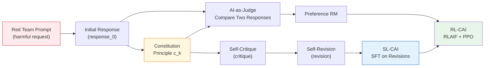
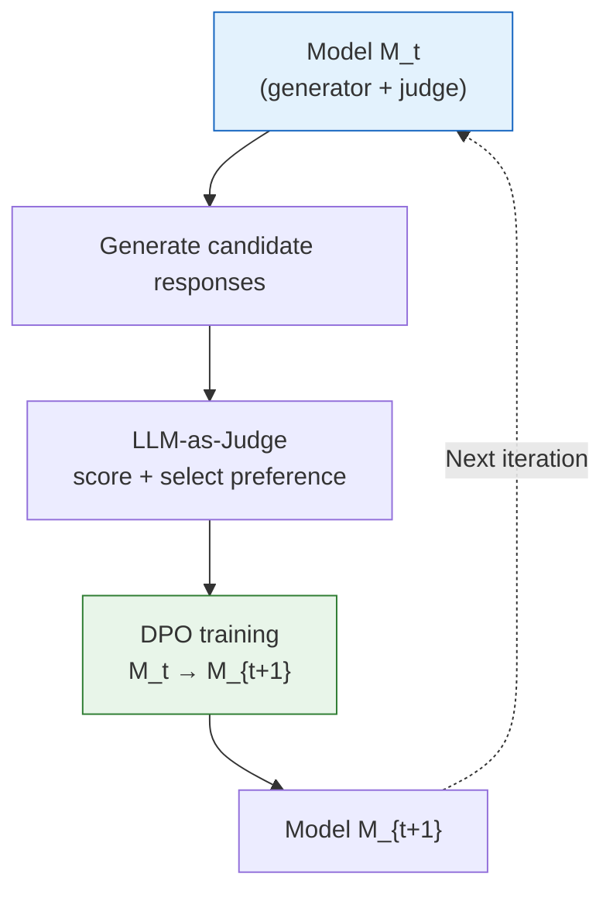

# 13.3 AI Feedback and Safety Principles

> The previous sections [13.1 From Base Model to Instruction Alignment](../chapter15_rlhf/base-model-to-assistant) and [13.2 Supervised Fine-Tuning (SFT)](../chapter15_rlhf/imitation-learning-pipeline) have explained how to collect human preferences and transform `chosen/rejected` responses into training signals for reward models. This approach relies on a premise: **preference data comes from humans**. When a model's capability approaches or exceeds that of human annotators, human annotation faces bottlenecks in terms of cost, speed, and professional judgment. This section raises a question: **where else can training signals come from?** In 2022, Anthropic proposed Constitutional AI, which allows AI to evaluate responses, revise responses, and generate preference pairs based on clear safety principles. This also provides another source of feedback for subsequent RL fine-tuning.

## Constitutional AI Framework

The pain point of RLHF is not "the training algorithm is not good enough," but rather "there is not enough annotated data." When training the first version of Claude, Anthropic identified two specific issues:

1. **The cost of annotating harmful content explodes.** Letting annotators rate two responses to "how to make a weapon" is slow, psychologically burdensome, and prone to inconsistency.
2. **Helpful and Harmless are in conflict within RLHF.** The more a model tries to avoid harmful content, the more it tends to avoid all slightly sensitive topics, eventually becoming a "refusal to answer anything" useless assistant. Anthropic refers to this phenomenon as **evasiveness** (avoidance).

The core insight of Constitutional AI (CAI, Bai et al. 2022) is: **do not ask humans to judge "which response is safer," but instead provide the model with a set of clear principles, allowing the model to evaluate its own responses.** This set of principles is called _Constitution_ (Constitution), which comes from three sources:

- The United Nations' Universal Declaration of Human Rights
- Trust & Safety industry guidelines
- Anthropic's internal research documents on "non-violence, honesty, and usefulness"

### Constitution: Natural Language Principles

Constitution is not a mathematical formula, but a set of **natural language rules**, each of which takes the form:

> "Please select the least harmful response. If both responses are harmless, select the more useful one."

> "Please evaluate whether the response is helping the user engage in illegal or violent activities; if so, select the response that refuses the request in the most polite and firm manner."

Each principle $c_k$ is a prompt template that is fed to the model to evaluate a response $y$. The text generated by the model as its evaluation is the **AI feedback**.

### Two Paths: SL-CAI and RL-CAI

CAI is split into two stages in engineering. Both stages share the same Constitution, but the way the training signal is generated differs.



**SL-CAI (Supervised Learning)**: Let the model first generate an initial response $y_0$ to a red team prompt $x$; then use the Constitution $c_k$ to have the model critique itself $\text{critique}(x, y_0, c_k)$; finally, have it write a revised version $y^* = \text{revise}(x, y_0, \text{critique}, c_k)$. Use the pair $(x, y^*)$ as SFT data to train the model. The advantage of this path is that it **directly teaches the model how to write harmless responses**.

**RL-CAI (Reinforcement Learning)**: For each prompt, generate two responses $y_1, y_2$, and have the model (acting as a judge) select the better one according to the Constitution, producing preference pairs $(x, y_w, y_l)$; train a reward model $r_\phi$ on these preference pairs; finally, use PPO to maximize $r_\phi$ minus KL divergence. This path reuses the [RLHF PPO loop](../chapter15_rlhf/ppo-rlhf-loop), with the only difference being that the "labeler" is replaced by an "AI judge." Therefore, RL-CAI is often also called **RLAIF**.

### A Minimal Pseudocode for SL-CAI

```python
def sl_cai_generate(base_model, redteam_prompts, constitution):
    sft_pairs = []
    for x in redteam_prompts:
        # 1. Let the model generate the original response freely
        y0 = base_model.generate(x)

        # 2. Select a constitutional principle and let the model criticize itself
        c = constitution.sample()
        critique = base_model.generate(
            f"{x}\nAnswer: {y0}\n"
            f"Please criticize the above answer according to the following principle: {c}\nCriticize: "
        )

        # 3. Let the model write the revised version
        y_star = base_model.generate(
            f"{x}\nOriginal Answer: {y0}\nCriticize: {critique}\n"
            f"Please rewrite according to '{c}': "
        )

        s(f"prompt": x, "response": y_star)

    return sft_pairs  # Use this data for SFT
```

The pseudocode appears simple, yet its effects are remarkable. According to Anthropic, the Claude trained with CAI outperforms the pure RLHF version in harmlessness, while maintaining almost the same level of usefulness—this precisely breaks the "HH tug-of-war" curse in RLHF.

## RLAIF: Using AI Feedback to Replace Human Annotation

RLAIF (Reinforcement Learning from AI Feedback) shares the PPO framework with RLHF, differing only in the source of preference pairs. Below, we will clarify this pipeline step by step and make a precise comparison with RLHF.

### Generation of Preference Pairs

Given a set of prompts $\{x_i\}$, for each $x_i$:

1. Sample two responses $y_1^{(i)}, y_2^{(i)} \sim \pi_t(\cdot \mid x_i)$ using the current model $\pi_t$.
2. Construct a judge prompt by combining a particular principle $c_k$ from the Constitution:

   $$
   J(x, y_1, y_2, c_k) = \text{"Given the request } x \text{ and two responses } y_1, y_2, \text{choose the one that best follows: } c_k"
   $$

3. Let the judge model $\pi_J$ generate a choice, and parse out the winning response $y_w$ and the losing response $y_l$.
4. Write the pair $(x, y_w, y_l)$ into the preference dataset $\mathcal{D}_{\text{AI}}$.

Note that the judge model can be the current model $\pi_t$ itself (self-evaluation), or a stronger model (distillation mode).

### Training Preference RM

RLAIF still trains a RM, with the same structure as RLHF, and the loss function remains the pairwise preference form introduced in [Section 13.2](../chapter15_rlhf/imitation-learning-pipeline):

$$
\mathcal{L}_{RM}(\phi) = -\mathbb{E}_{(x, y_w, y_l) \sim \mathcal{D}_{AI}} \log \sigma\big(r_\phi(x, y_w) - r_\phi(x, y_l)\big)
$$

The only difference is that $\mathcal{D}_{AI}$ comes from an AI judge, whereas in RLHF, $\mathcal{D}_{pref}$ comes from humans.

### PPO Loop

After obtaining $r_\phi$, we run the standard RLHF-PPO:

$$
R_{\text{RLAIF}}(x, y) = r_\phi(x, y) - \beta \, D_{KL}\big(\pi_\theta(\cdot \mid x) \,\|\, \pi_{\text{ref}}(\cdot \mid x)\big)
$$

This step is identical to that in [Chapter 8 on PPO](../chapter10_ppo/ppo-clip-objective). The KL coefficient $\beta$ still prevents the policy from drifting too far.

### RLHF vs RLAIF: Fundamental Differences

| Dimension               | RLHF                                      | RLAIF                                                               |
| ----------------------- | ----------------------------------------- | ------------------------------------------------------------------- |
| Preference Source       | Human annotators in pairwise comparisons  | AI judge scores based on Constitution                               |
| Annotation Cost         | \$0.5-\$5 per example, requiring millions | Only inference cost, ~\$10^{-4} per example                         |
| Annotation Speed        | Weeks to months                           | Millions of examples per day                                        |
| Annotation Consistency  | Cohen's κ ≈ 0.4-0.6 between annotators    | Same judge scores multiple times, κ ≈ 0.7-0.9                       |
| Suitable Capabilities   | Values, style, common sense               | Mathematics, code, long context, expertise                          |
| Unsuitable Capabilities | Reasoning beyond annotator level          | Open-ended questions where the model itself doesn't know the answer |

::: warning Limitations of RLAIF
The quality of RLAIF is constrained by the judge model itself. During the Claude 2 phase, when Claude 2 judges itself, a **self-preference bias** emerges — the judge tends to select responses that are more stylistically similar to itself. When the model being judged exceeds the judge's capabilities, RLAIF can actually reinforce incorrect answers. This is precisely the "sycophancy" (flattery) and "reward model over-optimization" issues discussed in [Chapter 25 on Reward Hacking](../chapter30_alignment_failures/classical-failures).
:::

### Rough Estimate of Cost Comparison

Assume we want to train a SOTA assistant, requiring 500,000 preference pairs.

- **RLHF Route**: Each annotation costs \$2, total cost \$1,000,000, time about 3 months.
- **RLAIF Route**: Using H100 cluster for inference, each prompt + 2 responses is about 8,000 tokens, H100 inference price is \$0.002 per 1,000 tokens ⇒ each pair costs about \$0.016, total cost \$8,000, time about 2 days.

The cost difference is two orders of magnitude, which is why after 2024, almost all large model alignment efforts have shifted to a **hybrid approach of RLAIF + a small set of high-quality human preferences**.

## Self-Correction and Self-Rewarding

The two core mechanisms of CAI — **Self-Critique** and **Self-Revision** — essentially make "thinking" explicit in text. This section dissects their mathematical structure and extends to Meta's 2024 Self-Rewarding Language Models.

### Formalization of Self-Critique

Given $(x, y_0, c_k)$, self-critique is a conditional generation:

$$
\text{critique} \sim \pi_\theta(\cdot \mid x, y_0, c_k, \text{"critique:"})
$$

It produces not a score, but a **textual critique**. This has two advantages:

1. **Interpretability**: The critique text can be directly read by humans, making it much more transparent than a black-box scalar score.
2. **Chain-of-Thought Effect**: By making the model first write a critique and then a revision, it is forced to first "think through where it went wrong" before "fixing" it — this is the same mechanism as [CoT prompting](../chapter19_reasoning/r1-zero-pure-rl-reasoning).

Empirically, **critique followed by revision** is 10–20% better than directly having the model rewrite (Lee et al., 2023, "Star" self-correction experiment).

### Self-Revision Formalization

The revised response is also a conditional generation:

$$
y^* \sim \pi_\theta(\cdot \mid x, y_0, \text{critique}, c_k, \text{"revision:"})
$$

The overall training objective of SL-CAI is to enable $\pi_\theta$ to learn the conditional distribution $p(y^* \mid x, y_0, c_k)$ — specifically implemented through SFT:

$$
\mathcal{L}_{\text{SL-CAI}} = -\mathbb{0}_{(x, y_0, c_k)} \big[\log \pi_\theta(y^* \mid x, y_0, c_k)\big]
$$

Note there is a subtle point here: the $y^*$ in the SFT data is generated by the same model. **The model is learning "the best answer it already knows."** This seems like circular reasoning, but it effectively distills the "how to revise" capability into the model's weights, eliminating the need for explicit critique steps during deployment.

### Self-Rewarding Language Models

Meta's 2024 Self-Rewarding Language Models (Yuan et al., arXiv:2401.10020) take the CAI idea to its extreme: **no human annotations are used, and no separate RM is trained**. Instead, the model acts as its own judge within the DPO loop.

Each iteration consists of three steps:



Formally: given a prompt $x$, the model generates $N$ candidate responses $\{y_1, \ldots, y_N\}$, and then evaluates them using an "LLM-as-Judge" prompt to obtain scores $\{s_1, \ldots, s_N\}$. The highest-scoring response $y_w$ and the lowest-scoring response $y_l$ are selected to form a preference pair, which is fed into [DPO](../chapter17_dpo/dpo-theory-and-family):

$$
\mathcal{L}_{\text{DPO}}(\theta) = -\log \sigma\Big(\beta \log \frac{\pi_\theta(y_w \mid x)}{\pi_{\text{ref}}(y_w \mid x)} - \beta \log \frac{\pi_\theta(y_l \mid x)}{\pi_{\text{ref}}(y_l \mid x)}\Big)
$$

**Key Observation:** DPO does not require an explicit RM (as proved in Chapter 17, [DPO Theory and Family](../chapter17_dpo/dpo-theory-and-family)), so the **entire process is self-contained** — the model simultaneously acts as a generator, a judge, and a learner.

### Effect of Three Iterations

Meta used Llama 2-70B to perform three rounds of self-rewarding (M1 → M2 → M3), and the results were:

- **AlpacaEval 2 win rate:** M1 55% → M2 65% → M3 72%
- **Judge capability (on RewardBench):** M1 75% → M2 80% → M3 83%

::: details Why Self-Rewarding Converges
Theoretically, self-rewarding could fall into a "self-praise" trap — the model learns how to make the judge satisfied, and the judge is itself. Meta's experiments show that the first three rounds are still effective, but **after the fourth round, performance typically plateaus**. There are two main reasons:

1. DPO's reference model $\pi_{\text{ref}}$ is updated every round, which acts as a soft KL constraint, limiting drift;
2. A certain proportion of real SFT data is mixed in to prevent capability collapse.

A deeper theoretical analysis (Yuan et al. 2024 follow-up) shows that iteration is effective when the judge's capability is ≥ the generator's capability, and conversely, it leads to "reward hacking" where the model self-reinforces. This is why self-rewarding must be combined with **external validation signals** (such as RLVR) to be effective.
:::

AI is now capable of generating preference data, critiquing responses, and completing revisions. The next challenge is to determine the criteria for judgment: on what principles does the model distinguish between useful, safe, and honest responses? Anthropic summarizes these three goals as HHH — **Helpful, Harmless, Honest**.

## HHH Alignment Principles

The underlying value framework of Constitutional AI is **HHH**—Helpful, Harmless, Honest. These three are not mere slogans; they are three optimizable objectives formalized as preference functions by Anthropic.

### Helpful: Maximizing User Utility

A helpful assistant should **truly solve the user's problem**, rather than avoid or be evasive. Formally:

$$
\text{Helpful}(y \mid x) = \mathbb{E}_{u \sim \text{user}} \big[U_u(x, y)\big]
$$

where $U_u(x, y)$ is the utility of user $u$ for the response $y$ to the prompt $x$. In RLHF/RLAIF, $U$ is approximated by preference data.

A common failure mode of helpfulness is **verbosity**—the RM tends to give high scores to long responses, leading the policy to become increasingly verbose. To address this, Anthropic explicitly adds a length penalty term in the training of Claude:

$$
r_{\text{adj}}(x, y) = r_\phi(x, y) - \lambda_{\text{len}} \cdot |y|
$$

### Harmless: Refusing Harmful Requests

The formalization of Harmless is more subtle—**not saying anything** is not the goal, but rather **not helping the user cause harm**. A typical definition is:

$$
\text{Harmless}(y \mid x) = 1 - \mathbb{P}(\text{harm} \mid x, y)
$$

where $\mathbb{P}(\text{harm})$ is the probability that the response causes real harm. This quantity is itself unobservable, and CAI approximates it using Constitution + AI judge.

::: warning Tension Between Helpful and Harmless
Models trained with RLHF often exhibit **evasiveness**—preferring to refuse rather than take risks. As a result, both "how to make fertilizer" and "how to write a science article about fertilizer" are often refused. CAI's Constitution explicitly includes a clause: "If the request itself is harmless (e.g., for writing, research, or education), the model should comply even if the topic is sensitive." This is a key improvement of CAI over pure RLHF.
:::

### Honest: No False Information

Honest requires the model to not lie, not pretend to know, and to express uncertainty. Formally:

$$
\text{Honest}(y \mid x) = 1 - D_{KL}\big(p_{\text{model}}(\cdot \mid x) \,\|\, p_{\text{true}}(\cdot \mid x)\big)
$$

Here, $p_{\text{true}}$ is the "objective truth distribution." In practice, we cannot access $p_{\text{true}}$, so we use **verifiable rewards** (mathematical answers, code testing, and fact retrieval) to approximate it. This is also the connection point between [RLVR](../chapter18_grpo/rlvr) and HHH — RLVR is essentially a hard verification version of the Honest principle.

### Joint Optimization of the Three HHH Principles

CAI combines the three objectives with weighted sums:

$$
r_{\text{HHH}}(x, y) = \alpha_H \cdot \text{Helpful}(y \mid x) + \alpha_{HL} \cdot \text{Harmless}(y \mid x) + \alpha_{Ho} \cdot \text{Honest}(y \mid x)
$$

Different principles in Constitution correspond to different $\alpha$ values: some emphasize Helpfulness ("if the request is legal, try to comply as much as possible"), while others emphasize Harmlessness ("do not assist in violence"). When AI judge scores, these principles are combined according to the Constitution's weights, which is equivalent to an implicit HHH-weighted combination.

| Principle | Typical Failure Mode                | CAI's Approach                                                  |
| --------- | ----------------------------------- | --------------------------------------------------------------- |
| Helpful   | Length inflation, template collapse | Length penalty + diversity reward                               |
| Harmless  | Over-refusal (over-rejection)       | Constitution distinguishes "sensitive but legal" vs "dangerous" |
| Honest    | Hallucination, pretending to know   | Explicit "I don't know" training + RLVR verification            |

## Practical Applications of CAI in Claude Training

CAI is not just a paper experiment; it is the real training process for the full series of Claude models. This section outlines the evolution of CAI from Claude 2 to Claude 3 to Claude 3.5, with a focus on specific changes made in industrial practice.

### Claude 2 (2023): The First Full-Featured CAI Implementation

Claude 2 was the first product-level model to fully implement both SL-CAI and RL-CAI. Key technical details include:

- **Constitution Size**: Approximately 40 principles, covering the three major categories of HHH.
- **Self-Critique Length**: Each critique is limited to 200–400 tokens to avoid excessively long critiques that could slow down training.
- **Judge Model**: A larger model than the generator is used as the judge (Claude 2 used an internal 100B+ model to judge the 50B model), to avoid self-preference bias.
- **Data Mixing**: Approximately 70% AI feedback and 30% high-quality human feedback. Human feedback is still retained, but only for edge cases where the AI was uncertain.

Anthropic Report: Compared to a pure RLHF version, **Claude 2 reduced harmfulness by over 50% and decreased excessive avoidance by 30%**.

### Claude 3 (2024): Constitution Expansion and Collective CAI

The Claude 3 series expanded the Constitution from 40 to approximately 80 principles, adding new dimensions including:

- **Collective Constitutional AI**: Anthropic collaborated with public survey institutions to have over 1,000 respondents from diverse cultural backgrounds vote on which values AI should follow. The results revealed several highly consistent principles across global respondents: honesty, not assisting in violence, and respecting privacy.
- **Reducing Over-Avoidance**: Added the principle that "refusal of requests should be based on actual risk rather than topic sensitivity."
- **Multilingual Alignment**: The Constitution was translated into over 20 languages, but a single English master version was retained as the ground truth, avoiding value drift introduced by translation.

Engineering-wise, Claude 3 continued the critique-revision loop of Constitutional AI (Bai et al., 2022): allowing the model to critique past responses, and using these critiques as additional SFT data. This effectively closed the deployment data loop back to training.

### Claude 3.5 (2024–2025): CAI and RLVR Integration

The key change in the Claude 3.5 era was that **CAI was no longer a standalone process but was integrated with RLVR**. Specifically:

1. **Helpfulness Training**: Primarily using RLVR, with rule-based validation for mathematics and code, and RLAIF for writing and instruction following.
2. **Harmlessness Training**: Primarily using CAI, as "safety" could not be validated through rules and required Constitution + AI judge.
3. **Honesty Training**: A hybrid approach—fact-based questions used retrieval augmentation + verifier models, while open-ended questions used AI judge + RLVR.

These three lines were combined in PPO with weighted rewards:

$$
R(x, y) = w_{\text{task}} r_{\text{RLVR}}(x, y) + w_{\text{safe}} r_{\text{CAI}}(x, y) + w_{\text{hon}} r_{\text{verifier}}(x, y) - \beta D_{KL}
$$

This **multi-objective reinforcement learning** is the core training paradigm of Claude 3.5 / 4, and one of the reward combination methods discussed in [Chapter 17 on PRM-Guided Search](../chapter20_prm_search/inference-time-search).

### Engineering Experience with Claude 3.5

::: tip Industry Consensus (as of 2025)

1. **Pure RLAIF is Unreliable**: A small amount of high-quality human feedback is essential.
2. **Longer Constitution is Harder to Tune**: 80 rules are already at the point of diminishing returns; more principles can lead to conflicting priorities.
3. **Judge Model Must Be Stronger than Generator**: Otherwise, self-preference bias becomes severe.
4. analogously, **Safety Training and Capability Training Must Be Decoupled**: Otherwise, KL constraints will slow down capability improvements.
   :::

HHH provides the goal, but dozens of parallel principles may still conflict with each other. The Constitution of the Claude 4 series further organizes these principles into a hierarchical value framework, and implements these principles in engineering systems through contextual training and audit mechanisms.

## From Principle Lists to Contextualized Values

Anthropic released an 80-page document on the Constitution of the Claude 4 series in 2026. It advanced constitutional alignment from "listing rules" to "socialization": the model needs to understand value conflicts in specific contexts and make judgments based on higher-level goals.

### From Rule Lists to Value Frameworks

The old version of the Constitution was mainly composed of parallel principles. The new version introduces a hierarchical structure:

```
Top Level: North Star Value
  ├── Helpful Subtree
  │     ├── Truly Solve Problems
  │     ├── Distinguish Requests from Actions
  │     └── Actively Clarify Ambiguities
  ├── Harmless Subtree
  │     ├── Do Not Assist in Serious Harm
  │     ├── Proportionality Principle (Reject with Strength Matching Risk)
  │     └── Protect Vulnerable Groups
  └── Honest Subtree
        ├── Express Uncertainty
        ├── Distinguish Facts from Speculation
        └── Acknowledge Errors
```

Each leaf node corresponds to a specific principle, and conflicts are resolved by the priority of the upper level. For example, when "Helpful Solve Problems" and "Harmless Proportionality Principle" conflict, the system weighs the risk level: low-risk tasks emphasize helping more, while high-risk tasks emphasize controlling harm more.

This hierarchical structure gives the AI judge a clear order of judgment, reducing the problem of dozens of parallel principles conflicting with each other.

### Socialization: Letting the Model Internalize Values

Socialization borrows the concept of "socialization" from sociology. Value judgments are formed through observation, imitation, and correction within specific contexts, and cannot be acquired merely by memorizing rules.

In terms of engineering implementation, Claude 4's training introduces **contextual alignment**:

1. Instead of having the model memorize individual principles $c_k$ separately, a large number of **scenario-action pairs** are constructed, allowing the model to demonstrate values within specific contexts.
2. The judge prompt is changed from "evaluate based on principle $c_k$" to "In this context, what should an ideal assistant do?"
3. The training loss is expanded from a single preference loss to include both a preference loss and a context consistency regularizer:

$$
\mathcal{L} = \mathcal{L}_{\text{pref}} + \lambda_{\text{ctx}} \cdot \mathcal{L}_{\text{context-consistency}}
$$

Here, $\mathcal{L}_{\text{context-consistency}}$ measures whether the model's responses across different contexts are consistent with the Constitution framework.

::: details Why Socialization is More Robust than Rule Lists
Rules cannot cover all real-world deployment scenarios. Socialization trains the model's ability to make value judgments, enabling it to handle new situations not present in the training data. According to Anthropic, Claude 4 demonstrates higher robustness in out-of-distribution safety scenarios compared to the rule list version. This aligns directly with the requirement in [Computer Use](../chapter25_computer_use/training) for models to generalize across new environments.
:::

### Audibility

The hierarchical Constitution also requires that model decisions be traceable back to specific principles. This necessitates the support of three components:

1. **Explainable Judge Decisions**: The Judge, in addition to providing scores, must explain the basis for its judgment.
2. **Traceable Training Data**: Each preference pair must be traceable to which nodes in the Constitution it triggered.
3. a **Auditable Deployment Log**: Record the basis used by the model when making value judgments, supporting post-hoc inspection.

Formally, the model's output $ y $ is accompanied by an attribution $ a(y) \in \mathcal{P}(\text{Constitution}) $, representing the distribution of principles on which the response is based. The judge's preference loss can be written as:

$$
\mathcal{L}_{\text{audit}} = -\mathbb{E} \big[\log \sigma\big(r_\phi(x, y_w, a_w) - r_\phi(x, y_l, a_l)\big)\big] + \lambda_{\text{attr}} \cdot \text{Entropy}(a_w)
$$

The entropy term prevents attribution from collapsing to a single principle; when multiple principles influence a decision, the system must explicitly retain these justifications.

### Engineering Evolution of the Claude Constitution

| Dimension                          | Claude 2/3 Constitution     | Claude 4 Constitution                                |
| ---------------------------------- | --------------------------- | ---------------------------------------------------- |
| Structure                          | Parallel list of principles | Hierarchical value tree                              |
| Learning Method                    | Rule matching + AI judge    | Contextual socialization                             |
| Conflict Resolution                | Implicitly decided by judge | Explicit arbitration by value hierarchy              |
| Interpretability                   | Implicit reward             | Principle attribution and judgment explanation       |
| Out-of-Distribution Generalization | Weak                        | Improved via contextual training                     |
| Audit Capability                   | Difficult to trace          | Decisions traceable to corresponding principle nodes |

This trajectory, together with [Chapter 25 on AI supervision and misalignment studies](../chapter30_alignment_failures/classical-failures) and [Appendix A.2 on training system foundations](../appendix_industrial_training/rl-infrastructure), forms an industrial-grade alignment system.

## Summary of This Section

Shifting from human feedback to AI feedback has changed the way preference data is generated and introduced new reliability issues:

1. **Constitutional AI** allows models to self-criticize and revise themselves based on natural language principles. SL-CAI and RL-CAI use this data respectively through SFT and PPO.
2. **RLAIF** extends preference annotation by using AI judges, but the quality of the data depends on the judges' capabilities and biases, so high-quality human feedback is still needed for calibration.
3. **Self-correction and Self-rewarding** enable models to act as generators, judges, and learners simultaneously. External validation signals are used to limit the errors of self-reinforcement.
4. **HHH** organizes Helpful, Harmless, and Honest into three optimizable objectives and handles conflicts between them through multi-objective rewards.
5. **Hierarchical Constitution** replaces simple rule listing with situational training and principle attribution, enabling models to handle new situations and support auditing.

[Chapter 15: RL Environments and Verifiers](../chapter18_grpo/rl-environments) continues the discussion of another part of the reward signal: how to use executable environments and verifiers to judge whether mathematical answers, code, and tool calls are correct, thus combining soft preferences with hard rules.

## Further Reading

- [Bai et al. 2022 “Constitutional AI: Harmlessness from AI Feedback”](https://arxiv.org/abs/2212.08073)
- [Lee et al. 2023 “RLAIF: Scaling Reinforcement Learning from Human Feedback with AI Feedback”](https://arxiv.org/abs/2309.00267)
- [Yuan et al. 2024 “Self-Rewarding Language Models”](https://arxiv.org/abs/2401.10020)
- [Askell et al. 2021 “A General Language Assistant as a Laboratory for Alignment”](https://arxiv.org/abs/2112.00861)
- [Anthropic 2024 “Collective Constitutional AI: Aligning a Language Model with Public Input”](https://www.anthropic.com/research/collective-constitutional-ai-aligning-a-language-model-with-public-input)
- [Anthropic 2026 “Claude 4 Constitution”](https://www.anthropic.com/research/claudes-constitution)
- [Sharma et al. 2023 “Towards Understanding Sycophancy in Language Models”](https://arxiv.org/abs/2310.13548)
- [Gao et al. 2022 “Scaling Laws for Reward Model Overoptimization”](https://arxiv.org/abs/2210.10760)
