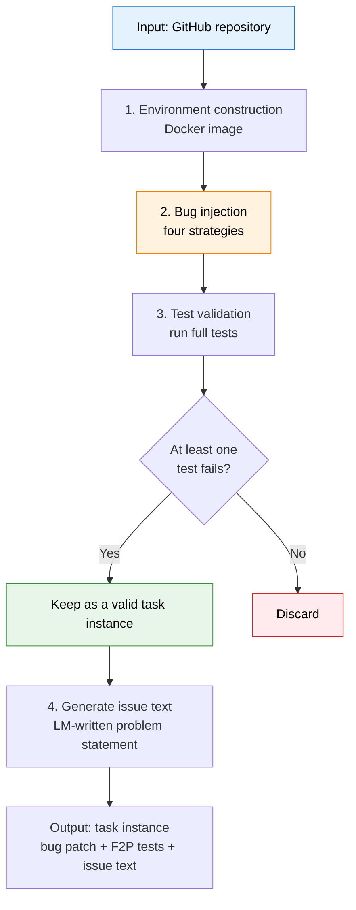
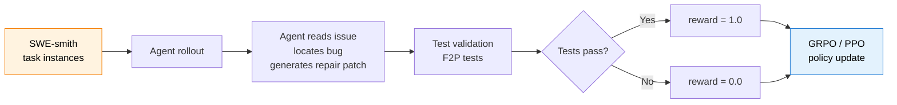

# 10.4 Agent Data Synthesis: SWE-smith as an Example

The previous sections discussed the theoretical frame of Agentic RL, tool-use policies, and evaluation. We now face a more practical question: **where does the training data come from?**

RL training for code agents needs many triples of "problem, code edit, test verification." Real bug reports and repair records are scarce. SWE-bench required hundreds of hours of manual curation and still collected only 2,294 usable instances. That scale is far from enough to train a strong code agent.

SWE-smith (Yang et al., 2025) takes a different route: **do not wait for real bugs; manufacture bugs automatically**. It can generate hundreds to thousands of task instances for an arbitrary Python repository. Across 128 GitHub repositories, it produced more than 50,000 training instances, an order of magnitude more than previous datasets combined.

## Core Idea: Modify Code, Run Tests, Keep Valid Cases

The intuition behind SWE-smith is simple: **intentionally inject bugs into good code, then run tests to see which bugs are detected**.

A good training sample must satisfy two conditions:

1. **The code is actually broken**: the modified code contains a real bug.
2. **The tests can detect it**: at least one test in the repository fails because of the change.

The second condition is especially important. If an injected bug is not caught by tests, the agent learns that arbitrary edits are acceptable, rather than learning to find and fix real bugs.

The pipeline is:



Let us unpack each stage.

## Step 1: Environment Construction: One Repository, One Docker Image

Before injecting bugs, the original repository must be able to run its tests reliably. This sounds simple but is often tedious: different repositories need different Python versions, system libraries, databases, and environment variables. SWE-smith uses this workflow:

1. Let SWE-agent attempt to install the repository and run tests.
2. Manually review the operation trace and extract the correct installation steps.
3. Freeze those steps into a Dockerfile and build a Docker image.

Each repository needs only one image. All later bug injection and validation runs execute inside that image.

::: tip Storage optimization
SWE-bench creates a separate Docker image for each task instance, often 1-3 GB per instance. One thousand tasks can require about 1 TB of storage. SWE-smith uses **one image per repository**, so one thousand tasks for the same repository may need only about 1 GB. The task instances share the base environment and differ only in code patches.
:::

## Step 2: Bug Injection: Four Strategies

Once the environment is ready, SWE-smith injects bugs. It provides four complementary strategies that cover simple and complex cases.

### Strategy 1: LM Generation: Let the Model Write Bugs

The LM receives the source code of a function and is asked to break it. This sounds easy, but the LM may accidentally improve the function or create a syntax error. A syntax error is not a good training bug, because it is too easy to detect. SWE-smith therefore asks the LM to introduce a subtle logic error.

```text
Simplified prompt to the LM:

You are a software testing engineer. Below is the source code of a Python function:

{function_source}

Introduce a subtle logic error while preserving the function signature.
Requirements:
1. Do not change the function name or parameters.
2. The code should still run normally and not raise exceptions.
3. It should return an incorrect result on specific inputs.

Output the full modified function.
```

For example, consider a simplified version of `collections.Counter.most_common`:

```python
# Original code, simplified.
def most_common(self, n=None):
    if n is None:
        return sorted(self.items(), key=_itemgetter(1), reverse=True)
    return _heapq.nlargest(n, self.items(), key=_itemgetter(1))


# LM-injected bug: change reverse=True to reverse=False.
# The sort direction is wrong: it returns the least common items first.
def most_common(self, n=None):
    if n is None:
        return sorted(self.items(), key=_itemgetter(1), reverse=False)  # bug!
    return _heapq.nlargest(n, self.items(), key=_itemgetter(1))
```

This bug preserves the signature, runs without crashing, and returns results that look plausible but are ordered incorrectly. LM-generated bugs are often semantically rich and useful for training localization and reasoning.

### Strategy 2: Programmatic Mutation: AST-Level Transforms

Instead of using an LM, SWE-smith can mechanically transform the abstract syntax tree. It defines 13 transformations in four broad categories:

| Category         | Transform              | Typical effect                             | Yield of valid bugs |
| ---------------- | ---------------------- | ------------------------------------------ | ------------------- |
| **Class**        | Shuffle method order   | Break logic that depends on initialization | 1.93%               |
| **Control flow** | Delete conditional arm | Skip required logic                        | about 30%           |
|                  | Delete loop body       | Turn a loop into a no-op                   | about 20%           |
|                  | Invert condition       | Change `if A` into `if not A`              | 47.04%              |
| **Expression**   | Replace operator       | Change `+` to `-`, or `==` to `!=`         | about 25%           |
|                  | Replace constant       | Change `0` to `1`, or `True` to `False`    | about 15%           |
| **Removal**      | Delete function body   | Make a function `pass` or return `None`    | about 35%           |
|                  | Delete return          | Make a function return `None`              | about 30%           |

For example:

```python
# Original code.
def format(self, format_string):
    result = []
    for token in format_string:
        if token in self.format_mapping:
            result.append(str(self.format_mapping[token]))
        else:
            result.append(token)
    return "".join(result)


# After inverting the condition.
def format(self, format_string):
    result = []
    for token in format_string:
        if token not in self.format_mapping:  # inverted
            result.append(str(self.format_mapping[token]))
        else:
            result.append(token)
    return "".join(result)
```

After inversion, formatting tokens are preserved as ordinary characters, while ordinary characters are treated as format tokens. The output becomes wrong in a structured way.

::: warning Yields differ dramatically
Shuffling method order produces valid bugs only rarely, while inverting conditions works almost half the time. In practice, the strategy mix should be adapted to the repository.
:::

### Strategy 3: PR Mirroring: Reverse Real Pull Requests

A real pull request often represents a human-reviewed fix. SWE-smith can reverse the repair, effectively reintroducing a known bug:

```text
Repository before PR -> contains bug
    PR fix
Repository after PR -> bug fixed
    SWE-smith reverses PR
Reversed code -> bug is back
```

PR mirroring has a yield around 13.18%, much higher than SWE-bench's 2.46% in comparable settings. One reason is that SWE-smith uses a carefully built repository-level environment, while SWE-bench often needs separate commit-level environments.

### Strategy 4: Bug Composition: Combine Simple Bugs into Complex Bugs

The first three strategies usually create bugs in a single function or file. SWE-smith can also combine already validated bugs:

- **Same-file composition**: merge two bugs in the same file.
- **Cross-module composition**: merge bugs from different files.

The resulting task requires the agent to locate and fix multiple faults. The yield is very high because each component bug has already been validated.

## Step 3: Test Validation: Use the Test Suite as a Sieve

After injecting a bug, SWE-smith runs the full test suite in Docker and keeps only task instances that satisfy:

- **At least one Fail-to-Pass (F2P) test**: the test fails under the buggy code and passes under the original code.
- **No unrelated Pass-to-Fail (P2F) noise**, when possible: avoid failures caused by environment or unrelated changes.

This validation stage is the quality gate. It ensures each training example is a real, verifiable code repair task.

## Step 4: Generate Issue Text

A validated bug patch still lacks a natural-language task description. SWE-smith uses an LM to generate GitHub-issue-style text from:

- the `.diff` patch showing what changed,
- the source of a random F2P test,
- the test output after applying the bug patch.

````
Simplified generated issue:

## Bug: Counter.most_common() returns results in wrong order

### Description

When calling `Counter('abracadabra').most_common(3)`, the method returns
`[('r', 2), ('b', 2), ('a', 5)]` instead of the expected
`[('a', 5), ('b', 2), ('r', 2)]`. The results appear to be sorted in
ascending rather than descending order.

### Reproduction

```python
from collections import Counter

c = Counter("abracadabra")
print(c.most_common(3))
# Expected: [('a', 5), ('b', 2), ('r', 2)]
# Actual:   [('r', 2), ('b', 2), ('a', 5)]
```

### Environment

Python 3.11, collections module
````

At this point, a complete task instance contains three pieces: the bug patch, F2P tests, and issue text. Together they form a SWE-bench-style training sample.

## Hands-On: Manufacture Training Data for a Repository

The following example uses `sympy/sympy`, a Python symbolic mathematics library.

### Environment Setup

```bash
# Install SWE-smith.
pip install swesmith

# Build the Docker environment for sympy.
python -m swesmith.build_repo sympy/sympy
```

This creates a `sympy__sympy` Docker image with dependencies and runnable tests.

### LM-Generated Bugs

```python
from swesmith.bug_gen.lm import generate_bug_lm

# Generate bugs for selected functions in sympy.
task_instances = generate_bug_lm(
    repo="sympy__sympy",
    target_functions=["simplify", "expand", "factor"],
    model="gpt-4o",
    num_bugs_per_func=5,
)

print(f"Generated {len(task_instances)} candidate bugs")
```

### Programmatic Mutation

```python
from swesmith.bug_gen.procedural import generate_bug_procedural

# Apply mechanical AST-level transforms.
task_instances = generate_bug_procedural(
    repo="sympy__sympy",
    strategies=["invert_conditional", "remove_loop", "change_operator"],
    num_candidates=100,
)
```

### Validation and Filtering

```python
from swesmith.validate import validate_task_instances

# Run tests and keep only valid task instances.
valid_instances = validate_task_instances(
    repo="sympy__sympy",
    candidates=task_instances,
    docker_image="sympy__sympy",
    timeout=300,  # up to 5 minutes per test run
)

print(f"Valid: {len(valid_instances)} / {len(task_instances)}")
```

### Generate Issues

```python
from swesmith.issue_gen import generate_issue

for instance in valid_instances:
    instance.issue_text = generate_issue(
        patch=instance.bug_patch,
        test_source=instance.f2p_test_code,
        test_output=instance.test_output,
    )
```

### Output: One Complete Task Instance

The final data structure looks like this:

````python
task_instance = {
    # Basic metadata.
    "repo": "sympy/sympy",
    "instance_id": "sympy__sympy-12345",

    # Bug patch.
    "bug_patch": """
diff --git a/sympy/simplify/simplify.py b/sympy/simplify/simplify.py
@@ -123,7 +123,7 @@
 def simplify(expr, **kwargs):
-    expr = sympify(expr)
+    expr = expand(expr)  # Bug: should be sympify, not expand
     ...
""",

    # F2P test: fails before repair and passes after repair.
    "test_patch": """
diff --git a/sympy/simplify/tests/test_simplify.py
+def test_simplify_basic():
+    assert simplify("x^2 + 2*x + 1") == "(x+1)^2"
""",

    # Issue text shown to the agent.
    "problem_statement": """
## Bug: simplify() incorrectly expands instead of simplifying

When calling `simplify("x^2 + 2*x + 1")`, the result is
`x**2 + 2*x + 1` instead of the expected `(x+1)**2`.

### Reproduction

```python
from sympy import simplify

result = simplify("x^2 + 2*x + 1")
print(result)  # Expected: (x+1)**2, Got: x**2 + 2*x + 1
```
""",
}
````

## Comparing and Choosing the Four Strategies

| Strategy                  | Yield                | Bug character                   | Compute cost             | Best use case                      |
| ------------------------- | -------------------- | ------------------------------- | ------------------------ | ---------------------------------- |
| **LM generation**         | Medium, about 20%    | Semantic and close to real bugs | High, requires LM calls  | Generate high-quality diverse bugs |
| **Programmatic mutation** | Wide range, 2-47%    | Mechanical and predictable      | Very low, AST edits      | Quickly generate many candidates   |
| **PR mirroring**          | Fairly high, 13%     | Real and human-reviewed         | Medium, needs PR history | Align with real bug distribution   |
| **Bug composition**       | Very high, above 90% | Multi-fault and difficult       | Low, combines known bugs | Increase difficulty and diversity  |

In practice, use several strategies together: generate many base bugs with programmatic mutation and LM generation, then compose verified bugs into harder tasks.

## Data Scale and Training Effect

Using this pipeline, SWE-smith generated more than 50,000 task instances across 128 popular Python repositories, including web frameworks, data science libraries, and developer tools.

| Metric         | SWE-bench         | SWE-gym       | R2E-gym       | **SWE-smith**   |
| -------------- | ----------------- | ------------- | ------------- | --------------- |
| Task instances | 2,294             | 1,283         | 1,468         | **50,000+**     |
| Repositories   | 12                | 11            | 8             | **128**         |
| Storage        | ~2.3 TB           | ~1.3 TB       | ~1.5 TB       | **~128 GB**     |
| Human labeling | Hundreds of hours | Tens of hours | Tens of hours | **Almost none** |

The SWE-agent-LM-32B model trained on this data reached 40.2% Pass@1 on SWE-bench Verified, which was a leading open-source result at the time.

## From Data Manufacturing to Agent Training

Manufacturing data is only the first step. These task instances naturally support RL training:



The training loop has three steps:

1. **Rollout**: the agent reads the issue, explores the repository, locates the bug, and produces a repair patch.
2. **Verification**: run F2P tests to check whether the repair is correct.
3. **Policy update**: update the agent with GRPO or PPO based on test results.

The elegant part is that **SWE-smith data naturally fits RLVR**. No reward model is needed; test pass/fail is the reward. This reduces training complexity and limits reward hacking.

## Lessons and Limitations of SWE-smith

### Lessons

**Data manufacturing is often better than data collection.** The traditional approach waits for real bugs, collects reports, and labels them manually. SWE-smith shows a more scalable route: actively manufacture bugs, verify them automatically, and generate data in bulk. The same idea can transfer to any domain with automatic verification, such as math proofs, circuit design, or games.

**Verification is the key.** Injecting bugs is not difficult. The real contribution is the validation pipeline: only bugs detected by tests become training samples. This explains why yield matters. The question is not how many bugs were injected, but how many survived validation.

**Environment reuse lowers the barrier.** One-image-per-repository reduces storage by orders of magnitude, making it feasible for individual researchers to process many repositories.

### Limitations

**Python only.** SWE-smith currently targets Python repositories. JavaScript, Java, C++, and other languages require different environment and test pipelines.

**Bug distribution differs from real bugs.** Programmatic mutations such as inverted conditions are mechanical. LM-generated bugs are closer to real bugs but lower yield and higher cost.

**Test coverage is the ceiling.** If a repository has weak tests, many injected bugs will not trigger failures and will be filtered out. SWE-smith works best on repositories with strong test suites.

## Section Summary

SWE-smith represents an important direction in agent data engineering: **use algorithms to manufacture training data instead of relying on expensive manual labeling**. Its core pipeline, "inject bug, run tests, filter valid cases, generate issue," is simple, scalable, and applicable to any Python repository with tests.

The approach aligns naturally with RLVR from Chapter 9. Each manufactured task has a clear verifier, so test pass/fail can be used directly as the RL reward without training an additional reward model.

The broader principle is: **find the automatic verifier in the domain, then build a data manufacturing pipeline around it**.

::: details References

- Yang J, Lieret K, Jimenez CE, et al. "SWE-smith: Scaling Data for Software Engineering Agents." [arXiv:2504.21798](https://arxiv.org/abs/2504.21798), NeurIPS 2025 D&B Spotlight.
- SWE-smith official website: [swesmith.com](https://swesmith.com)
- GitHub repository: [SWE-bench/SWE-smith](https://github.com/SWE-bench/SWE-smith)
- Dataset: [SWE-bench/SWE-smith on Hugging Face](https://huggingface.co/datasets/SWE-bench/SWE-smith)
- Trained model: [SWE-agent-LM-32B](https://huggingface.co/SWE-bench/SWE-agent-LM-32B)

:::
