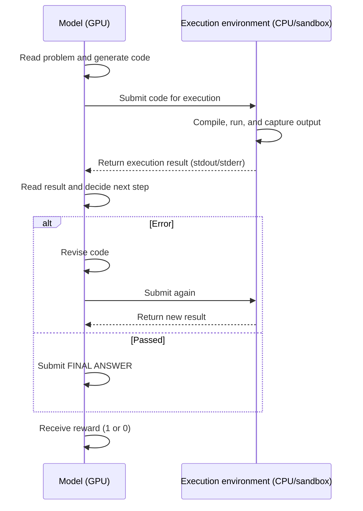
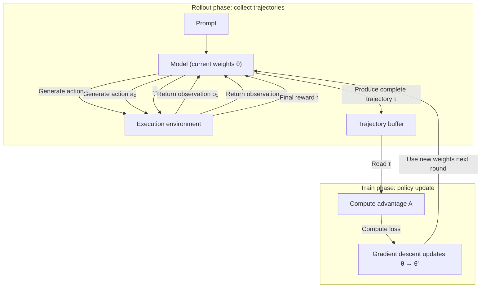
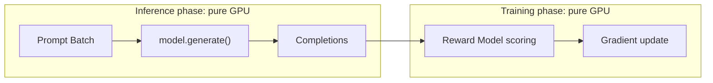
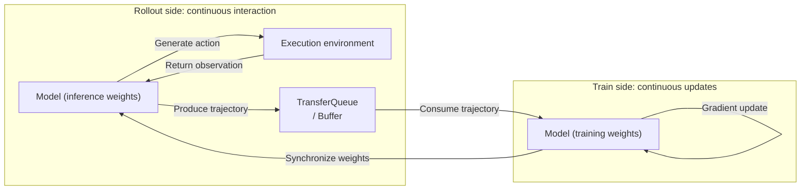
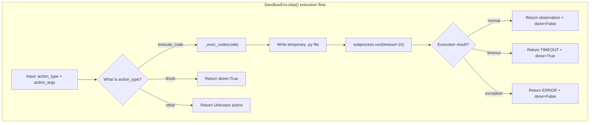
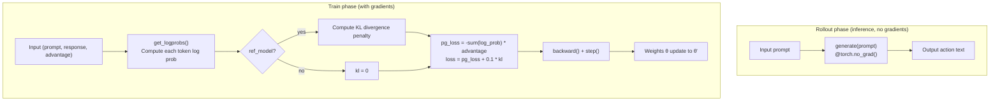
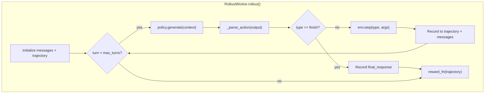
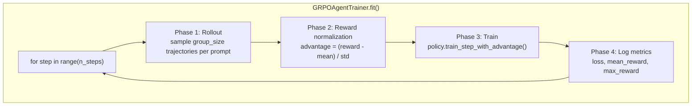
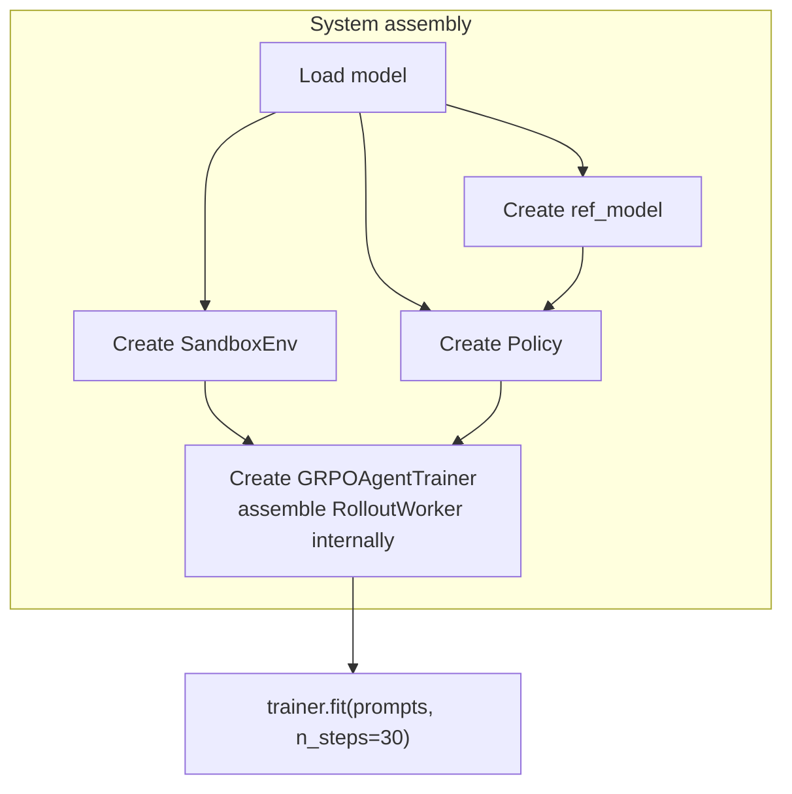

# 20.7 Hands-On: Building an Agentic RL Training System from Scratch

In Sections 22.1 and 10.2, we discussed the decision framework and environment interaction design for Agentic RL. In Sections 22.3 through 10.5, we analyzed the architectures of frameworks such as OpenRLHF, veRL, and Relax. This section starts from those discussions and turns the concepts into a runnable implementation.

Specifically, we will train a language model agent that can autonomously solve programming problems: after reading a problem, it writes code, executes it, reads the output, and if errors occur, revises the code and re-executes until it produces a correct answer. The entire system is kept under 500 lines of code and runs on CPU.

This implementation follows the approach of [hyunwoongko/nanoRLHF](https://github.com/hyunwoongko/nanoRLHF) — using minimal code to reproduce core structures. But our goal is not merely to "get it running." It is to **understand how the structure of a training system is naturally derived from the training loop itself**. After reading this section, reading the source code of veRL or Relax will give you a much clearer understanding of their abstraction layers.

The complete implementation for this section is available in the book's GitHub repository: `https://github.com/walkinglabs/hands-on-modern-rl/tree/main/docs/chapter22_agentic/code/`.

## Infrastructure Fundamentals of an Agentic RL Training System

To understand why an Agentic RL training system looks the way it does in Relax or veRL, we need to return to the training loop itself — not the framework's class diagrams, but **what actually happens inside a single episode**.

### The Flow of One Episode

Consider the complete process of an agent solving a programming problem:



This flow has two key characteristics:

1. **Action dependency**: The model cannot decide the next action until it receives the environment's feedback. The output $a_t$ at step $t$ depends on the observation $o_{t-1}$ from step $t-1$, so we cannot parallelize sampling of complete sequences as in plain text generation.
2. **Cross-device latency**: Each interaction round involves a **GPU (model inference) → CPU (action parsing) → sandbox (code execution) → CPU (result relay) → GPU (next inference)** round-trip. The sandbox execution time scale ranges from milliseconds to seconds, far exceeding GPU internal memory access latency.

### The Training Loop Flow

The interaction of a single episode merely produces one trajectory. Training itself is a repeated cycle:



Specifically:

- **Rollout phase**: The model interacts with the environment under the current policy $π_θ$, completing one or more episodes and producing complete interaction trajectories $τ = (s_0, a_0, o_0, s_1, a_1, o_1, ..., r)$. The key here is **on-policy**: trajectories must be generated by the current policy to accurately evaluate that policy's performance.
- **Reward computation**: The reward is calculated based on the trajectory's final outcome (e.g., whether the answer is correct). There is no immediate feedback for intermediate steps.
- **Advantage estimation**: Using methods like GRPO, multiple trajectories for the same prompt are normalized within the group, and each trajectory's advantage is computed.
- **Gradient update**: Based on the advantage, gradient ascent is performed on the policy parameters $θ$ (increasing the probability of high-advantage trajectories), yielding updated weights $θ'$.
- **Loop**: The next rollout uses the updated weights $θ'$ to re-sample trajectories, and the cycle repeats.

This cycle is the classic **rollout → reward → train → repeat**. In traditional RLHF, rollout and train can be tightly completed within one batch. But in Agentic RL, the rollout phase is frequently interrupted by environment I/O. If executed serially, the train phase waits idle for long periods.

### Comparison with Traditional RLHF

The training pipeline for traditional RLHF (e.g., PPO/GRPO for summarization or dialogue) is fundamentally different:



In RLHF:

- **Inference** generates completions for a batch of prompts **in parallel**, entirely within the GPU, with no external environment interaction.
- **Training** computes rewards and advantages for this batch of completions, then performs one gradient update.
- Both phases internally consist of **continuous GPU operations** with no I/O interruptions, allowing efficient batch-aligned execution: one batch of inference → one batch of training.

But in Agentic RL, the inference process is frequently interrupted by environment interactions. If we execute inference and training **serially** — waiting until an entire episode finishes before doing a gradient update — the GPU sits **idle** throughout the episode.

A single episode may involve multiple interaction rounds, each with its own environment latency. The accumulated idle time becomes significant. In modern training clusters, **GPU is the scarcest computational resource**. Leaving the GPU waiting for I/O for extended periods is unacceptable.

### Core Design Principle: Decoupling Inference from Training

Therefore, the core design principle of an Agentic RL training system is: **inference (rollout) and training (train) must be decoupled into two independent execution flows**.



- **Rollout side**: Continuously interacts with the environment, producing complete interaction trajectories and pushing them into a buffer.
- **Train side**: Continuously pulls trajectory data from the buffer, computes advantages, and performs gradient updates.
- The two sides are decoupled via a **buffer** (such as Relax's TransferQueue or veRL's ActorBuffer), each running at its own pace rather than waiting serially for the other.

### Problems Introduced by Decoupling

This "seemingly simple decoupling" is precisely the source of all complexity:

- **Weight synchronization**: How do updated weights from the Train side get synced to the Rollout side in time? If Rollout is still using stale weights to generate trajectories, those trajectories no longer accurately evaluate the current policy.
- **Queue management**: Rollout production speed may far exceed Train consumption speed. Will the buffer overflow? Will data pile up?
- **Consistency**: The trajectories consumed by the Train side were generated using model weights different from the current weights. How should this **temporal gap** be handled?

The **DCS weight synchronization**, **heartbeat mechanisms**, **PlacementGroup scheduling**, **streaming queues**, and other designs found in production frameworks like Relax and veRL are, at their core, engineering solutions built around this central problem of "asynchronous inference and training execution."

In this section, we will not address these advanced concerns. Instead, we write a **synchronous version** — rollout completes, then training runs immediately, then the next rollout begins. The purpose is to make each of the four core components' responsibilities and interaction patterns clearly visible in a simple setting. Once you understand the synchronous version, introducing async decoupling, distribution, and fault tolerance will follow naturally.

## From Training Loop to Component Design

Above we described the four phases of the training loop: rollout → reward → train → repeat. In the synchronous version, these four phases execute sequentially, forming the main training loop. Now we ask: what components does the system need to implement this loop?

### What the Rollout Phase Needs

The core task of the Rollout phase is "the model interacts with the environment and produces trajectories." Breaking this down:

- **Where does the environment execute?** The agent's generated code needs to be sent somewhere for execution, and the results need to be safely returned to the model. If we run `while True: pass` directly in the training process, the entire process hangs. Therefore we need an **isolated execution environment** — this is the responsibility of the **Environment**.
- **Who drives the multi-turn interaction?** A single `generate()` call outputs only one frame, but an episode typically requires multiple rounds of "generate → execute → observe → regenerate." We need a loop driver that connects the model and the environment, collecting the complete interaction history — this is the responsibility of the **RolloutWorker**.
- **How does the model generate actions and accept gradients?** The model needs one interface for inference (generating code during rollout) and another for training (accepting advantages for gradient updates). The same weights must support both uses — this is the responsibility of the **Policy**.

### What the Train Phase Needs

The core task of the Train phase is "compute advantage from trajectories, then perform gradient updates." Breaking this down:

- **How is advantage computed?** GRPO requires sampling multiple trajectories per prompt and normalizing within the group. Who orchestrates the "sample multiple → compute mean/std → assign advantage" pipeline?
- **How are gradient updates triggered?** The Policy provides a training interface, but who decides when to call it, how many times, and with what data?
- **How is the overall training loop orchestrated?** Rollout produces trajectories, advantages are computed, Policy training is invoked, metrics are logged — the sequencing and execution logic of these steps needs unified management.

This is the responsibility of the **Trainer**: orchestrating the entire "rollout → reward → train" loop, assembling the other three components into a runnable training pipeline.

### Component Overview

| Component         | What It Solves                                                                     | Training Phase        |
| ----------------- | ---------------------------------------------------------------------------------- | --------------------- |
| **Environment**   | Where is the agent's code safely executed?                                         | Rollout               |
| **Policy**        | Who generates actions? Who accepts gradient updates?                               | Rollout + Train       |
| **RolloutWorker** | How is single-step inference chained into a multi-turn interaction loop?           | Rollout               |
| **Trainer**       | How is the "sample → compute advantage → gradient update" training loop organized? | Train (orchestration) |

Below we first look at a complete interaction example, then implement each of these four components.

## What a Complete Interaction Looks Like

Before writing code, let us look at a concrete example. Suppose the problem is "compute the 10th Fibonacci number."

Ideally, the agent gets it right in one try:

| Turn | Role  | Content                                |
| ---- | ----- | -------------------------------------- |
| 0    | User  | "Compute the 10th Fibonacci number"    |
| 1    | Agent | Generate Python code `def fib(n): ...` |
| 1    | Env   | Execute code, return `55`              |
| 2    | Agent | FINAL ANSWER: 55                       |

But more often, the agent writes buggy code and fixes it after seeing errors:

| Turn | Role  | Content                             |
| ---- | ----- | ----------------------------------- |
| 0    | User  | "Compute the 10th Fibonacci number" |
| 1    | Agent | Generate code with a bug            |
| 1    | Env   | Return `ERROR: NameError`           |
| 2    | Agent | See ERROR, revise code              |
| 2    | Env   | Execute revised code, return `55`   |
| 3    | Agent | FINAL ANSWER: 55                    |

This example shows the complete process of agent-environment interaction. Ideally the agent writes correct code in one attempt, but more often it requires multiple rounds of trial and error. In either case, the interaction pattern is fixed: the agent generates an action → the environment executes and returns an observation → the agent decides the next step based on the observation.

Below we start from the most fundamental need of the Rollout phase — **isolated execution**.

## Environment — Sandbox and Tool Execution

Where should the agent's generated code be executed? A natural idea is to run it directly in the training process. But if the agent writes an infinite loop like `while True: pass`, the entire training process hangs. Worse, the agent might generate malicious code that deletes files. Therefore, we need a mechanism to execute the agent's actions in an isolated environment while safely returning execution results to the agent.

This isolated environment must satisfy three conditions: accept the agent's action (code), execute it safely with resource limits, and return the execution result and termination status. This is the responsibility of the **Environment** component, and it is the minimal implementation of the sandbox problem discussed in Section 22.2.



```python
# environment.py
import subprocess
import tempfile
import os


class SandboxEnv:
    """Lightest-weight sandbox: subprocess + resource limits

    Responsibility: accept the agent's action, execute it in an isolated environment,
    return (observation, done).
    Isolation method: execute code via subprocess in a separate process, preventing
    infinite loops / malicious code from affecting the main training process.
    """

    def __init__(self, timeout=10, max_memory=256 * 1024 * 1024):
        self.timeout = timeout          # Timeout limit: prevent infinite loops
        self.max_memory = max_memory    # Memory limit (not enforced in this minimal
                                        # implementation; production needs cgroups)

    def step(self, action_type: str, action_args: dict) -> dict:
        """Execute one action step, return observation and termination status.

        Corresponds to the POMDP observation function O(s_t): given an action,
        return (observation, done).
        Supports two action types: execute_code (execute code) and finish (end episode).
        """
        if action_type == "execute_code":
            return self._exec_code(action_args["code"])
        elif action_type == "finish":
            return {"observation": "", "done": True}
        else:
            return {"observation": f"Unknown action: {action_type}", "done": False}

    def _exec_code(self, code: str) -> dict:
        """Execute code in a subprocess, limiting CPU time and memory.

        Core isolation mechanism:
        1. Create a temporary file and write the code (avoids polluting the main process filesystem)
        2. subprocess.run() executes in a separate process
        3. timeout parameter limits execution time; raises TimeoutExpired when exceeded
        4. Only return the last 500 characters of stdout/stderr (prevent excessive output from consuming memory)
        """
        try:
            with tempfile.NamedTemporaryFile(mode="w", suffix=".py", delete=False) as f:
                f.write(code)
                f.flush()
                # Execute in a separate subprocess; timeout prevents infinite loops
                result = subprocess.run(
                    ["python", f.name],
                    timeout=self.timeout,
                    capture_output=True,
                    text=True,
                )
                os.unlink(f.name)  # Delete temp file immediately after execution
                return {
                    "observation": (result.stdout + result.stderr)[-500:],  # Truncate long output
                    "done": False,
                }
        except subprocess.TimeoutExpired:
            # Timeout: the agent wrote an infinite loop, episode should terminate
            return {"observation": "TIMEOUT", "done": True}
        except Exception as e:
            # Other exceptions: compilation errors, syntax errors, etc.
            return {"observation": f"ERROR: {e}", "done": False}

    def reset(self):
        """Reset environment state (called when a new episode starts).

        In this minimal implementation the sandbox is stateless and needs no cleanup.
        Production environments may need to clear the filesystem, reset networking, etc.
        """
        pass
```

Design notes:

- `step()` accepts a structured action (`action_type` + `action_args`), not raw text. This corresponds to the action space $A = A_{\text{text}} \cup A_{\text{action}}$ from Section 22.1.
- `_exec_code()` uses subprocess isolation with a timeout to prevent infinite loops — the lightest sandbox approach discussed in Section 22.2.
- The return value includes `observation` (environment feedback) and `done` (termination status), corresponding to the POMDP observation function $O(s_t)$.

## Policy — Model Inference and Training

The environment can execute code, but who decides what code to write? We need a Policy to generate actions. Here we use a 0.5B-parameter Qwen2.5 as the policy model.

But a key question arises: this model is used both for generating code during rollout (inference) and for accepting gradient updates during training. How can the same weights support these two very different uses? This is the core problem discussed in Section 22.1 — we need to provide two interfaces for the same weights: one for inference generation and one for gradient updates.



```python
# policy.py
import torch
import torch.nn.functional as F


class Policy:
    """Wraps a language model, providing two sets of interfaces.

    Core problem: the same weights must support both inference (rollout) and training (gradient updates).
    Solution:
      - generate() / get_logprobs(): used during rollout phase, @torch.no_grad() skips gradient computation
      - train_step_with_advantage(): used during training phase, computes gradients and updates weights
    """

    def __init__(self, model, tokenizer, lr=1e-5):
        self.model = model                # Main model: used for both inference and training
        self.tokenizer = tokenizer
        self.optimizer = torch.optim.AdamW(model.parameters(), lr=lr)
        self.ref_model = None             # KL anchor: stores a copy of the initial policy

    def set_ref_model(self, ref_model):
        """Save a copy of the initial weights to use as an anchor for KL divergence computation.

        Purpose: prevent the trained policy from drifting too far from the initial policy,
        maintaining stability of the output distribution.
        """
        self.ref_model = ref_model

    @torch.no_grad()
    def generate(self, prompt: str, max_new_tokens=128) -> str:
        """Inference mode: given a prompt, generate text.

        Corresponds to "model generates action" during the rollout phase.
        Uses @torch.no_grad() because rollout does not need gradient computation, saving memory.
        """
        inputs = self.tokenizer(prompt, return_tensors="pt").to(self.model.device)
        outputs = self.model.generate(**inputs, max_new_tokens=max_new_tokens)
        return self.tokenizer.decode(outputs[0], skip_special_tokens=True)

    @torch.no_grad()
    def get_logprobs(self, prompt: str, response: str) -> torch.Tensor:
        """Compute the log probability of each token in the given response under the model.

        Rollout phase: used to compute the current policy's probability for a new trajectory (importance sampling).
        Training phase: used to compute new_logprobs (current policy) and ref_logprobs (old policy).

        Key detail: only take log probs for the response portion (excluding the prompt).
        """
        full_text = prompt + response
        inputs = self.tokenizer(full_text, return_tensors="pt").to(self.model.device)
        logits = self.model(**inputs).logits

        # Compute prompt length for splitting out the response portion
        prompt_len = len(self.tokenizer(prompt, return_tensors="pt")["input_ids"][0])
        # response_logits[i] corresponds to the prediction distribution for the i-th response token
        response_logits = logits[:, prompt_len - 1:-1, :]
        response_ids = inputs["input_ids"][:, prompt_len:]

        # log_softmax converts logits to log probability distribution
        logprobs = F.log_softmax(response_logits, dim=-1)
        # gather: extract the log prob corresponding to the actually generated token from the distribution
        token_logprobs = logprobs.gather(2, response_ids.unsqueeze(-1)).squeeze(-1)
        return token_logprobs

    def train_step_with_advantage(self, trajectories: list):
        """One GRPO training step (REINFORCE + advantage + KL penalty).

        Args:
            trajectories: list of (prompt, response, advantage)
                          prompt: the initial question
                          response: the agent's complete interaction text
                          advantage: the GRPO-normalized advantage value

        Computation flow:
        1. For each trajectory, compute new_logprobs (probability under current policy)
        2. If ref_model exists, compute KL divergence penalty
        3. Policy gradient loss = -sum(log_prob) * advantage
        4. Total loss = pg_loss + 0.1 * kl, averaged and backpropagated
        """
        losses = []
        for prompt, response, advantage in trajectories:
            new_logprobs = self.get_logprobs(prompt, response)

            if self.ref_model is not None:
                with torch.no_grad():
                    # ref_logprobs: probability of the initial policy generating this response
                    ref_logprobs = self._get_ref_logprobs(prompt, response)
                # KL divergence (approximation): p * (log p - log q)
                kl = (new_logprobs.exp() * (new_logprobs - ref_logprobs)).sum()
            else:
                kl = 0.0

            # Policy gradient: advantage > 0 increases trajectory probability,
            # advantage < 0 decreases it
            pg_loss = -(new_logprobs.sum() * advantage)
            loss = pg_loss + 0.1 * kl
            losses.append(loss)

        total_loss = torch.stack(losses).mean()
        self.optimizer.zero_grad()
        total_loss.backward()
        self.optimizer.step()
        return total_loss.item()
```

Design notes:

- `generate()` and `get_logprobs()` are used during the rollout phase, while `train_step_with_advantage()` is used during the training phase — two uses of the same weights.
- `ref_model` is the KL penalty anchor, preventing the model from drifting too far from the initial policy.
- This implements the simplest policy gradient (REINFORCE + advantage) without PPO clipping — get it running first, then optimize.

## RolloutWorker — Driving the Agent Loop

The Policy can generate single-step actions, and the Environment can execute a single action and return results. But recall the earlier example: an agent solving a programming problem often requires multiple rounds of interaction — write code, see errors, revise, re-execute. A single `generate()` call outputs only one frame. How do we chain them into a "generate → execute → observe → regenerate" loop?

We need another component to drive this loop and collect the complete interaction trajectory during the process. This is the responsibility of the **RolloutWorker**.



````python
# rollout_worker.py


class RolloutWorker:
    """Drives the Agent Loop, collecting multi-turn interaction trajectories.

    Core responsibility: chain the "generate → execute → observe → regenerate"
    multi-turn loop. Each rollout produces one complete trajectory containing
    the prompt, all interaction rounds, the final answer, and the reward.
    """

    def __init__(self, policy, env, max_turns=5):
        self.policy = policy    # Policy model: used to generate actions
        self.env = env          # Execution environment: used to execute actions and return observations
        self.max_turns = max_turns  # Maximum interaction rounds: prevents infinite loops

    def rollout(self, prompt: str, reward_fn) -> dict:
        """Execute one complete Agent Loop, return trajectory and reward.

        Corresponds to the Rollout phase of the training loop:
        1. Initialize conversation history (only the prompt)
        2. Loop (up to max_turns rounds):
           - Concatenate history messages into a prompt → policy.generate() produces an action
           - _parse_action() parses the action type and arguments
           - If the action is finish: episode ends, record the final answer
           - Otherwise: env.step() executes the action, returns observation
           - Add (action, observation) to the trajectory and conversation history
        3. Use reward_fn to compute the reward for the entire trajectory
        """
        # Conversation history: maintains the complete context of multi-turn interaction
        messages = [{"role": "user", "content": prompt}]
        # Trajectory structure: contains prompt, interaction list, final answer, reward
        trajectory = {"prompt": prompt, "interactions": []}

        for turn in range(self.max_turns):
            # Step 1: Concatenate conversation history into a prompt the model can understand
            context = self._format_context(messages)
            # Step 2: Model generates an action (inference, no gradient computation)
            model_output = self.policy.generate(context)
            # Step 3: Parse structured action from free-text output
            action = self._parse_action(model_output)

            if action["type"] == "finish":
                # Agent decides to end the episode, submitting the final answer
                trajectory["interactions"].append({
                    "turn": turn,
                    "response": model_output,
                    "action": action,
                    "observation": None,
                })
                trajectory["final_response"] = action.get("answer", model_output)
                break

            # Step 4: Environment executes the action, returns observation and termination status
            obs = self.env.step(action["type"], action["args"])

            # Step 5: Record this interaction round in the trajectory
            trajectory["interactions"].append({
                "turn": turn,
                "response": model_output,      # Agent's generated action (raw text)
                "action": action,              # Parsed structured action
                "observation": obs["observation"],  # Environment-returned observation
            })

            # Step 6: Add this round's interaction to conversation history for the next round
            messages.append({"role": "assistant", "content": model_output})
            messages.append({"role": "user", "content": f"Execution result:\n{obs['observation']}"})

            if obs.get("done"):
                # Environment reports episode end (e.g., timeout)
                break

        # Step 7: Compute reward for the entire trajectory (only given when trajectory ends)
        trajectory["reward"] = reward_fn(trajectory)
        return trajectory

    def _format_context(self, messages):
        """Concatenate the multi-turn message list into a prompt the model can understand.

        Production frameworks would use the tokenizer's chat_template;
        here we use the simplest string concatenation.
        """
        parts = []
        for msg in messages:
            if msg["role"] == "user":
                parts.append(f"User: {msg['content']}")
            else:
                parts.append(f"Assistant: {msg['content']}")
        return "\n".join(parts)

    def _parse_action(self, model_output: str) -> dict:
        """Parse a structured action from the model's free-text output.

        Supports two action formats:
        1. ```python ... ``` → execute_code (extract code block content)
        2. FINAL ANSWER: ... → finish (extract final answer)
        3. Other → execute_code (treat entire output as code to execute)

        Production frameworks use special tokens for structured parsing;
        string matching is sufficient here for understanding the concept.
        """
        if "```python" in model_output:
            code = model_output.split("```python")[1].split("```")[0]
            return {"type": "execute_code", "args": {"code": code}}
        elif "FINAL ANSWER:" in model_output:
            answer = model_output.split("FINAL ANSWER:")[1].strip()
            return {"type": "finish", "answer": answer}
        else:
            return {"type": "execute_code", "args": {"code": model_output}}
````

Design notes:

- `rollout()` is the code version of the Agent Loop: each round includes model inference (`policy.generate()`) → action parsing (`_parse_action()`) → environment execution (`env.step()`) → observation relay.
- The trajectory structure is `{"prompt", "interactions": [...], "final_response", "reward"}` — far more complex than single-turn RL's `(prompt, completion, reward)`, but it preserves complete multi-turn interaction information.
- `_parse_action()` is a simplified parser. Production frameworks use tokenizers + special tokens for structured parsing; string matching suffices here for understanding the concept.

## Trainer — Orchestrating the Training Loop

At this point, we can already collect complete interaction trajectories. But trajectories alone are not enough — we need to turn them into gradients that update the model parameters. Recall from Chapter 9 that GRPO's core idea is to sample multiple trajectories per prompt and compare within the group to compute advantage.

So, who is responsible for the complete training loop of "sample multiple trajectories → compute advantage → perform gradient update → repeat"? This is the **Trainer**'s responsibility.



```python
# trainer.py

from rollout_worker import RolloutWorker


class GRPOAgentTrainer:
    """Orchestrates the Agentic RL training loop: rollout -> reward -> train -> repeat.

    Core responsibility: assemble Policy, Environment, and RolloutWorker into
    a complete training pipeline. Each training round contains four phases
    (corresponding to the four code blocks in fit()):
    1. Rollout: sample group_size trajectories for each prompt
    2. Reward normalization: GRPO within-group comparison, compute advantage
    3. Train: policy gradient update using advantage
    4. Logging: print training metrics
    """

    def __init__(self, policy, env, reward_fn, group_size=4, max_turns=5):
        self.policy = policy        # Policy model: inference + training
        self.env = env              # Execution environment: sandbox
        self.reward_fn = reward_fn  # Reward function: judges whether answer is correct
        self.group_size = group_size  # GRPO group size: how many trajectories to sample per prompt
        # Create RolloutWorker: chains policy and env into a multi-turn loop
        self.worker = RolloutWorker(policy, env, max_turns=max_turns)
        self.history = []           # Training history: records loss and reward per step

    def fit(self, prompts: list, n_steps: int = 50):
        """Main training loop: repeat n_steps times (rollout -> reward -> train).

        Args:
            prompts: list of programming problems for training
            n_steps: number of training steps (each step = one complete rollout + train round)
        """
        for step in range(n_steps):
            # ==================== Phase 1: Rollout ====================
            # For each prompt, sample group_size independent trajectories
            # These trajectories form a "group" for GRPO's within-group comparison
            batch_trajectories = []
            for prompt in prompts:
                group = []
                for _ in range(self.group_size):
                    # Rollout one complete trajectory: multi-turn interaction until finish or max_turns
                    traj = self.worker.rollout(prompt, self.reward_fn)
                    group.append(traj)
                batch_trajectories.append(group)

            # ==================== Phase 2: Reward Normalization (GRPO) ====================
            # GRPO core: normalize multiple trajectories for the same prompt within the group
            # advantage = (reward - mean) / std
            # Each trajectory's advantage represents how good/bad it is relative to "group average"
            all_rewards = []
            for group in batch_trajectories:
                group_rewards = [t["reward"] for t in group]
                mean_r = sum(group_rewards) / len(group_rewards)
                std_r = (sum((r - mean_r) ** 2 for r in group_rewards) / len(group_rewards)) ** 0.5 + 1e-8
                for t, r in zip(group, group_rewards):
                    t["advantage"] = (r - mean_r) / std_r
                all_rewards.extend(group_rewards)

            # ==================== Phase 3: Train ====================
            # Feed all trajectories' (prompt, response, advantage) to Policy for gradient update
            train_data = []
            for group in batch_trajectories:
                for traj in group:
                    # Serialize multi-turn interaction into text as the model's "response"
                    full_response = self._serialize_trajectory(traj)
                    train_data.append((
                        traj["prompt"],      # Initial question
                        full_response,       # Complete interaction history (all agent outputs)
                        traj["advantage"],   # GRPO-computed advantage value
                    ))

            # Policy gradient update: trajectories with advantage > 0 get probability boost,
            # advantage < 0 get probability reduction
            loss = self.policy.train_step_with_advantage(train_data)

            # ==================== Phase 4: Log Metrics ====================
            mean_reward = sum(all_rewards) / len(all_rewards)
            self.history.append({
                "step": step,
                "loss": loss,
                "mean_reward": mean_reward,
                "max_reward": max(all_rewards),
            })
            if step % 5 == 0:
                print(f"Step {step:3d} | loss={loss:.4f} | "
                      f"reward_mean={mean_reward:.3f} | "
                      f"reward_max={max(all_rewards):.3f}")

        return self.history

    def _serialize_trajectory(self, traj: dict) -> str:
        """Serialize a multi-turn trajectory into text for train_step.

        Serialization format:
            Assistant: <action1>
            Observation: <result1>
            Assistant: <action2>
            Observation: <result2>
            ...

        Note: this is simplified — all tokens participate in the loss.
        Production frameworks use loss masks to distinguish model-generated tokens
        (participate in loss) from environment-returned tokens (masked out).
        See the loss mask discussion in Section 22.2.
        """
        parts = []
        for interaction in traj["interactions"]:
            parts.append(f"Assistant: {interaction['response']}")
            if interaction["observation"]:
                parts.append(f"Observation: {interaction['observation']}")
        return "\n".join(parts)
```

Design notes:

- The main loop of `fit()` follows the "producer-consumer" pattern: RolloutWorker produces trajectories, Policy consumes them for gradient updates.
- GRPO's within-group comparison is implemented in the Reward normalization section: for multiple trajectories sharing a prompt, advantage = (reward - mean) / std.
- `_serialize_trajectory()` flattens multi-turn trajectories into text. This is simplified — production frameworks use loss masks to distinguish model-generated tokens from environment-returned tokens (see the loss mask discussion in Section 22.2).

## Putting It All Together

At this point, all four components have been individually implemented. The Environment provides isolated execution, the Policy provides inference and training interfaces, the RolloutWorker drives the multi-turn interaction loop, and the Trainer orchestrates the GRPO training pipeline. But they are still independent modules. How do we assemble them into a runnable system?



We write an entry-point script to initialize each component and start training:

```python
# run.py
from transformers import AutoModelForCausalLM, AutoTokenizer

from environment import SandboxEnv
from policy import Policy
from trainer import GRPOAgentTrainer

# ==================== Step 1: Load Model ====================
# Use a small model (0.5B parameters), runnable on CPU
model_name = "Qwen/Qwen2.5-0.5B-Instruct"
model = AutoModelForCausalLM.from_pretrained(model_name)
tokenizer = AutoTokenizer.from_pretrained(model_name)

# ==================== Step 2: Initialize Four Components ====================
# 2.1 Environment: sandbox for isolated execution of agent-generated code
env = SandboxEnv(timeout=10)

# 2.2 Policy: wraps the model, providing both inference and training interfaces
policy = Policy(model, tokenizer, lr=5e-5)

# 2.3 ref_model: KL penalty anchor, stores a copy of the initial policy
# Note: reload a separate copy of weights from the same checkpoint
ref_model = AutoModelForCausalLM.from_pretrained(model_name)
policy.set_ref_model(ref_model)

# ==================== Step 3: Define Reward Function ====================
# Reward is sparse: only given when the trajectory ends, no intermediate feedback
# Simple rule: if any execution round succeeds (no ERROR/TIMEOUT), reward = 1
def code_reward(trajectory):
    """Judge whether the trajectory contains a successful code execution result.

    Note: this is a simplified reward.
    Production environments may combine rules + RM + LLM-as-Judge.
    """
    for interaction in trajectory["interactions"]:
        obs = interaction.get("observation", "")
        # If any round executed successfully (no ERROR and no TIMEOUT), consider answer correct
        if obs and "ERROR" not in obs and "TIMEOUT" not in obs:
            return 1.0
    return 0.0


# ==================== Step 4: Training Data ====================
# Prompts: list of programming problems; the agent will train on these
prompts = [
    "Write Python code to compute the 10th Fibonacci number and print the result.",
    "Write code to check if a string is a palindrome.",
    "Write code to perform bubble sort on a list.",
]

# ==================== Step 5: Assemble Trainer and Start Training ====================
# The Trainer orchestrates the entire training loop:
# rollout (sample 4 trajectories per prompt) -> reward (GRPO normalization) -> train (gradient update)
trainer = GRPOAgentTrainer(
    policy=policy,        # Policy model
    env=env,              # Execution environment
    reward_fn=code_reward,  # Reward function
    group_size=4,         # GRPO group size: sample 4 trajectories per prompt for comparison
    max_turns=3,          # Maximum 3 interaction rounds per trajectory
)

# Start training: 30 steps on 3 prompts
history = trainer.fit(prompts, n_steps=30)
```

## Gaps Compared to Production Frameworks

After running the code above, you have mastered the basic skeleton of an Agentic RL training system. But what gaps remain between this implementation and production frameworks like Relax and veRL?

| Aspect             | This Minimal Implementation            | Production Frameworks (Relax / veRL)                                        |
| ------------------ | -------------------------------------- | --------------------------------------------------------------------------- |
| Inference engine   | `model.generate()` per-item generation | vLLM / SGLang, continuous batching, KV cache                                |
| Training engine    | Single-GPU AdamW                       | FSDP / Megatron, 3D parallelism, gradient accumulation                      |
| Distribution       | Single process                         | Ray cluster, multi-node multi-GPU, PlacementGroup                           |
| Async training     | Rollout and train serial               | TransferQueue streaming decoupling, DCS async weight sync                   |
| Sandbox            | subprocess + timeout                   | Docker container pool / MicroVM, warm-up pool, resource isolation           |
| Loss mask          | All tokens participate in loss         | Model-generated tokens participate in loss, tool-returned tokens are masked |
| Reward             | Simple rules                           | Rules + RM + LLM-as-Judge + verifier combination                            |
| Trajectory storage | In-memory dicts                        | Distributed storage (Redis / S3), indexed by task/step                      |
| Fault tolerance    | None                                   | Heartbeat monitoring, auto-restart, checkpoint recovery                     |

Each gap represents an independent engineering optimization direction. After understanding the skeleton, you can dive deeper into any direction as needed.

## Extension Exercises

1. **Add PPO clipping**: Add PPO's clipped surrogate objective to `train_step_with_advantage()` (refer to Chapter 7), and compare training stability between REINFORCE and PPO.
2. **Add loss mask**: In `_serialize_trajectory()`, mark which tokens were generated by the model and which were returned by the environment. Only compute loss on model-generated tokens.
3. **Add more tools**: Add a search tool to `SandboxEnv` (a mock version suffices), so the model learns to choose between code execution and search.
4. **Async rollout**: Use `multiprocessing` to split rollout and train into separate processes, pass trajectory data via `Queue`, and observe changes in GPU utilization.

---

This section implemented a minimal yet complete Agentic RL training system. Looking back at the entire process, its core structure can be summarized as: **nesting the Agent Loop (Section 22.1) and environment interaction (Section 22.2) inside a rollout → reward → train RL cycle**. All the complexity of production frameworks like Relax and veRL arises from scaling this skeleton to multi-node multi-GPU, high-throughput, long-running production environments.
