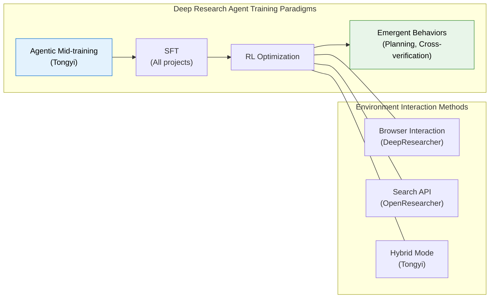
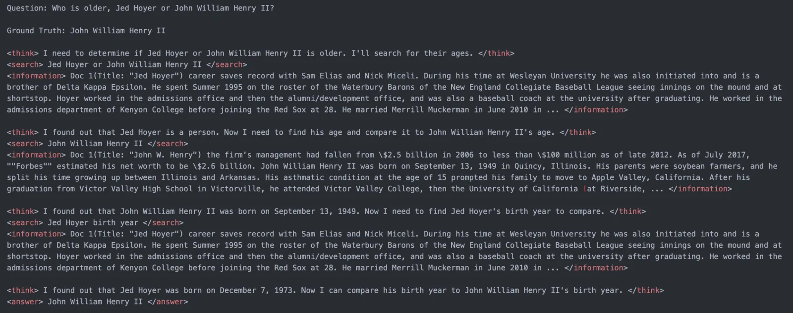
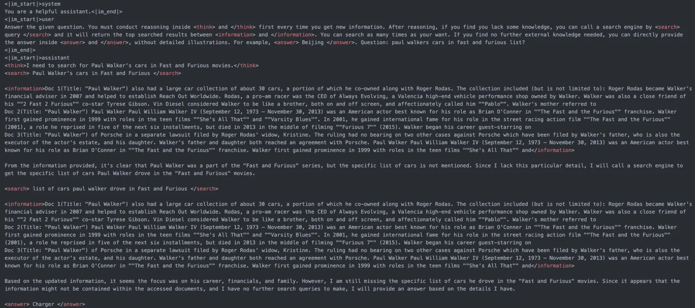
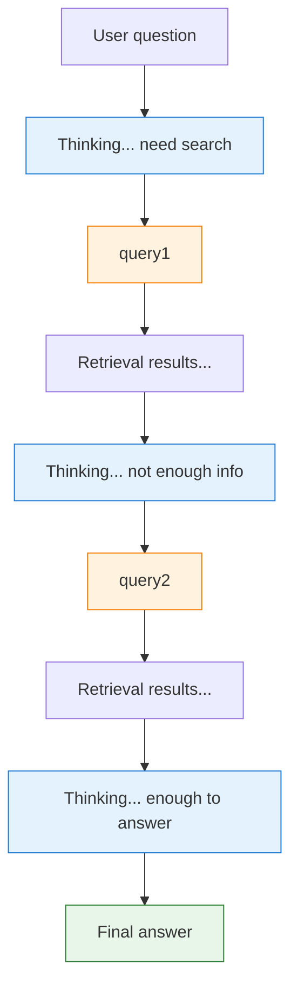
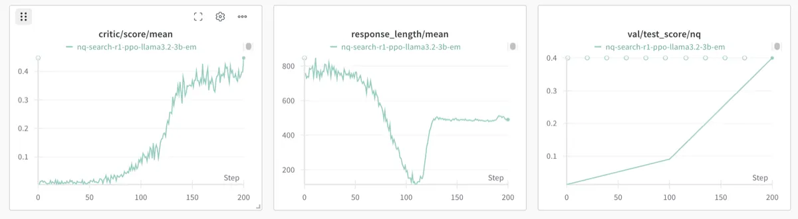

# 20.5 Deep Research

Previous sections discussed multi-turn RL credit assignment, trajectory synthesis, and tool-use training for Web Agents and Code Agents. Now we look at an application that integrates all of these: the **Deep Research Agent**. Its goal is to make AI behave like a human researcher — autonomously conducting long-horizon, multi-step information search, analysis, and synthesis, ultimately outputting a trustworthy research report.

In 2025-2026, Deep Research Agents became one of the most active directions in Agentic RL. This section covers six layers: global understanding, reasoning paradigms, core systems, reward design, data synthesis, and evaluation.

## What Is a Deep Research Agent?

A Deep Research Agent is not simply "search + summarize." It must solve a fundamental problem: **how to make AI conduct robust, credible deep research in a real, complex web environment.** This means it must plan search strategies, cross-validate information sources, handle dynamic web content, and maintain logical coherence across multi-step reasoning.

Compared with the previous section's Web Agent, the core differences are structural:

| Dimension           | Web Agent                                                    | Deep Research Agent                                                                 |
| ------------------- | ------------------------------------------------------------ | ----------------------------------------------------------------------------------- |
| Task goal           | Complete a single operation (book a ticket, search products) | Comprehensive research (multi-source analysis, cross-validation, report generation) |
| Interaction turns   | Usually 3-10 turns                                           | Usually 20-100+ turns                                                               |
| Evaluation criteria | Task success/failure                                         | Answer accuracy + citation quality + logical rigor                                  |
| Core challenge      | Element grounding, dynamic pages                             | Long-horizon planning, information synthesis, hallucination containment             |

### Browser Interaction vs Search API: Two Technical Paths

Deep Research Agents interact with the web in two broad approaches:

**Browser interaction** — AI operates a browser like a human, handling dynamically loaded pages, clicking buttons, filling forms. Representative projects include DeepResearcher (end-to-end RL training in a real web search environment)[^deepresearcher] and WebAgent-R1 (directly interacting with the online web environment). This approach can access dynamic, unstructured content, but has high engineering complexity and latency.

**Search API** — Structured API requests return JSON-formatted search results. Representative projects include OpenResearcher (works on pre-downloaded large-scale local corpora, zero network dependency)[^openresearcher] and PokeeResearch-7B (relies on third-party search API services). This approach is efficient, stable, and easy to reproduce, but may miss dynamic content.

The two paths are not mutually exclusive. Frontier projects tend to combine both — for example, Tongyi DeepResearch equips Search (search engine API), Visit (web content extraction), and Python Interpreter as high-level tools [^tongyi_dr].

## Reasoning Paradigms: From ReAct to Long-Horizon Research Collaboration

Deep Research Agent reasoning did not arrive in one step. Over the past two years, this direction has evolved through roughly three levels:


_Figure: Deep Research Agent multiple technical path comparison (Source: [Tongyi DeepResearch](https://tongyi-agent.github.io/blog/introducing-tongyi-deep-research/))_

1. **ReAct: The basic closed loop of thinking while doing**
   - Core pattern: Thought → Action → Observation.
   - Suitable for short-chain tasks: search first, then open a webpage, then continue based on observation.
   - It solves the question "can the model start using tools."

2. **Iterative Research: Iterative research for long-horizon tasks**
   - When the task goes from "find one answer" to "write a credible research report," simple ReAct is no longer enough.

   
   _Figure: Tongyi DeepResearch iterative research paradigm (Source: [Tongyi DeepResearch](https://tongyi-agent.github.io/blog/introducing-tongyi-deep-research/))_
   - The model needs to repeatedly execute the cycle of "retrieve → read → compare sources → revise hypothesis → retrieve again."
   - The key at this level is no longer just tool calling itself, but long-horizon planning, cross-validation, and context compression.

3. **Multi-agent Synthesis: Structured division of labor for information synthesis**
   - When task scale further increases, systems split the single researcher into multiple roles, such as search, reading, evidence organization, and final writing.
   - Multi-agent value is not just parallel speedup, but separating "discovering information" from "synthesizing information," reducing cognitive load on any single trajectory.
   - Work like DeepResearcher and Fathom-DeepResearch both reflect this trend.

The three can be understood as different stages on the same capability chain: **ReAct establishes the tool loop, iterative research extends the loop, and multi-agent synthesis creates structured division of labor for long-horizon research tasks.** Agentic RL's role is to make the model not just follow templates to call tools, but gradually learn through real feedback when to search, when to stop, and when cross-validation is needed.

## Core Models and Frameworks

Below are the most representative open-source Deep Research models and training frameworks. Their common goal is evolving LLMs from "chat models" to "research models."

### DeepResearcher: End-to-End RL Training

DeepResearcher is the first framework to conduct end-to-end RL training in a **real, dynamic, open web environment** [^deepresearcher]. Previous work mostly trained in controlled RAG environments or relied on carefully designed prompt engineering — DeepResearcher directly lets the model interact with real search engines and webpages, learning from real feedback.

Its architecture uses multi-agent collaboration: dedicated "Browsing Agents" extract information from complex webpage structures, while the main agent plans research strategies and synthesizes information. The training objective is pure answer correctness (RLVR), with no process rewards.


_Figure: DeepResearcher emergent high-level behavior cases after RL training (Source: [GAIR-NLP/DeepResearcher](https://github.com/GAIR-NLP/DeepResearcher))_

**Core finding: Behavioral emergence.** This is DeepResearcher's most surprising result — through RL training, the model spontaneously emerged multiple categories of high-level behaviors that were **never explicitly trained**:

1. **Planning**: The model learned to decompose questions before searching, formulating multi-step search plans
2. **Cross-verification**: The model proactively verifies the same fact from multiple sources, rather than trusting only the first search result
3. **Self-reflection and redirection**: When search results are unsatisfactory, the model autonomously adjusts its research direction
4. **Honest expression**: When unable to find a clear answer, the model learned to be honest rather than fabricate

This shows RL's value in agent training is not just "optimizing known strategies" — it can **discover new strategies that humans never designed.** This finding has profound implications for the entire Agentic RL field: rather than trying to teach models all behaviors through SFT, let models explore optimal strategies through RL.

### Tongyi DeepResearch: Agentic Mid-training + Post-training

Alibaba Tongyi Lab's Tongyi DeepResearch is one of the strongest open-source Deep Research models [^tongyi_dr]. It surpasses OpenAI o3, DeepSeek-V3.1 (671B), and other much larger models on multiple benchmarks, with only 30.5B total parameters — the key is the MoE (Mixture of Experts) architecture, which activates only 3.3B parameters per inference, achieving extreme parameter efficiency.


_Figure: Tongyi DeepResearch asynchronous RL training architecture (Source: [Tongyi DeepResearch](https://tongyi-agent.github.io/blog/introducing-tongyi-deep-research/))_

**Two-stage training paradigm.** Tongyi DeepResearch's core innovation is proposing the **Agentic Mid-training + Post-training** two-stage pipeline:

1. **Agentic Mid-training (Agentic CPT)**: Continual pre-training on synthetic large-scale tool-use trajectories. Two steps: first train basic agentic capabilities on 32K context, then extend to 128K introducing long-sequence (64K-128K) agentic behavior data. This stage's goal is not teaching the model "how to do good research," but giving it **inductive biases for agentic behavior** — making the model already "familiar" with basic tool-use patterns before encountering specific research tasks. A small amount of general pre-training data is interleaved to prevent loss of general language capabilities.

2. **Agentic Post-training**: Three steps — SFT cold start (learning research templates on high-quality synthetic trajectories), on-policy RL (optimizing policy with customized GRPO in real + simulated environments), and model merging (fusing model variants with different capability preferences through parameter averaging).

**Two key techniques.** Beyond the training paradigm, Tongyi DeepResearch has two noteworthy engineering innovations:

- **Context Management inference paradigm**: The core bottleneck of long-horizon research is the limited context window. Tongyi proposes Context Management based on Markov state reconstruction — at each step, instead of retaining full history, it maintains a continuously updated "research report summary" as compressed memory. This lets the model maintain reasoning capability at arbitrary exploration depth.
- **Phased environment strategy**: Different training stages use environments of different fidelity. Mid-training uses "prior world environment" (zero cost, zero interaction) and "simulated environment" (low cost, controllable); Post-training's RL stage first validates algorithms in simulated environments, then deploys to real environments for final training. This strategy addresses the problems of unstable, high-latency, high-cost real environment APIs.

It achieves SOTA on BrowseComp, WebWalkerQA, FRAMES, HLE, and other deep research benchmarks [^tongyi_dr].

### PokeeResearch-7B: Small Model, Big Potential

PokeeResearch-7B is one of the smallest usable open-source Deep Research models, with only 7B parameters [^pokeeresearch]. Its significance is proving one thing: **deep research capability is not exclusive to large models.**

Its practical implication: if your scenario doesn't need "all-discipline expert-level" research capability, but focuses on domain-specific (e.g., e-commerce, legal, medical) information integration, a 7B-level model with carefully designed tool chains and data strategies can fully suffice. This dramatically lowers the deployment barrier for Deep Research Agents — no A100 cluster needed; a single consumer-grade GPU can run it.

### SFR-DeepResearch: Autonomous Single Agent

Salesforce's SFR-DeepResearch takes a different route from multi-agent approaches: **Autonomous Single Agent** [^sfr_dr]. It doesn't decompose the research flow into search, reading, writing, and other roles, but lets one model complete the entire research pipeline end-to-end.

This approach's advantage is **architectural simplicity** — no communication overhead or coordination costs between multiple agents. But the challenge is obvious: a single model must simultaneously master search strategy, information synthesis, long-text generation, and other capabilities, making capability conflicts likely. SFR's solution is to continue agent RL training on a **reasoning-enhanced model** (already RL-trained in math, code, and other domains), leveraging the model's existing strong reasoning capabilities to support research tasks.

### rStar2-Agent: Extreme Training Efficiency

rStar2-Agent demonstrates the enormous potential of efficient RL algorithms [^rstar2]. It uses a GRPO-based agent RL algorithm to train a 14B reasoning model. Its core idea: **it's not that bigger models are better, but that more precise training methods are better.**

Its practical value: if you're computationally constrained and can't train 100B+ models, rStar2-Agent provides a viable alternative — through carefully designed RL algorithms (e.g., better sampling strategies, more stable gradient estimation), 14B-level models can demonstrate extremely strong competitiveness on tasks like mathematical reasoning.



## Reward and Algorithm Innovation: Beyond "Only Looking at Outcomes"

In Deep Research, "only checking whether the final answer is correct" rewards work poorly — because the research process can span dozens of steps, and using only terminal rewards cannot guide the model to learn effective intermediate strategies. The following work focuses on designing more refined, intelligent reward functions.

### Citation-Aware Reward: CaRR

**Problem**: The most common and dangerous hallucination type in Deep Research Agents is not "fabricating facts" but "fabricating citations" — the model gives a seemingly reasonable assertion with a seemingly real but non-existent URL, or cites a real paper but distorts its conclusions. Traditional outcome reward (only checking whether the answer is correct) cannot detect such issues.

**Solution**: Citation-aware Rubric Rewards (CaRR), jointly proposed by Tsinghua University and Zhipu AI, explicitly encodes citation quality into the RL reward function [^carr_dr]. Its core approach is not simply applying penalties but computing a positive ratio reward:

1. **Rubric decomposition**: Multi-hop questions are decomposed into atomic fact statements (Rubrics), each containing key entities to verify.
2. **Entity recognition**: A judge model checks whether the model's final answer identifies key entities from each Rubric.
3. **Citation verification**: URLs cited in the answer (up to 20) are extracted, web content fetched, and the judge evaluates whether each Rubric is supported by cited content.
4. **Evidence connectivity**: A bipartite graph is constructed, and BFS verifies whether Rubrics are logically connected to the final answer.

The final reward is the ratio of satisfied and logically connected Rubrics to total Rubrics. This ratio reward is mixed with outcome reward (answer correctness) at a tunable weight $\alpha$ as the comprehensive reward signal for GRPO training.

**Implication**: CaRR's design philosophy can be generalized to other scenarios requiring "verifiability" — not just citations; whether code can execute, whether mathematical derivations are correct, all can use similar "decompose → verify → compute ratio" frameworks for reward design.

### Atomic Thought Reward: Atom-Searcher

**Problem**: Deep Research trajectories can span dozens of steps. If using only terminal reward (correct answer = 1, incorrect = 0), credit assignment is nearly impossible — the model has no idea which of those dozens of steps were key good decisions and which were inconsequential bad ones.

**Solution**: Atom-Searcher proposes **Atomic Thought Reward (ATR)** [^atom_searcher], decomposing complex reasoning into atomic-level units and providing process rewards at each intermediate step. The core idea: rather than waiting until the final answer to give reward, provide feedback at each "atomic reasoning step."

**Why "atomic" rather than "step"?** Note that ATR is not simply "scoring each step." It first decomposes the reasoning chain into indivisible atomic units (e.g., "deriving B from A"), then independently evaluates each atomic unit for logical correctness and information value. This decomposition is more refined than step-level scoring and more semantically meaningful than token-level scoring.

**Practical value**: ATR primarily helps in early training. When the model hasn't yet formed stable research strategies, dense process signals can dramatically accelerate convergence. Once the model learns basic research patterns, ATR's weight can be gradually annealed, returning to terminal reward dominance — consistent with the human learning process: first learn how to do each step, then learn to evaluate overall results.

### Evolving Rubrics: DR Tulu

**Problem**: RL training has a classic trap — **Reward Hacking**. Models find "loopholes" in scoring criteria to get high scores, rather than truly improving research quality. For example, discovering "more citations = higher score" leads to citation stuffing, or "longer answers = higher score" leads to padding. Once the model learns to game the system, training enters a "scoring high but not improving" death spiral.

**Solution**: Allen AI's DR Tulu proposes **RLER (Reinforcement Learning with Evolving Rubrics)** [^dr_tulu] — letting scoring criteria themselves evolve dynamically during training. Its core strategy is "shooting at a moving target":

1. **Early training**: Use loose Rubrics to encourage exploration. For example, "any citation gets points," not demanding citation quality
2. **Mid training**: When the model reaches a certain score level under current criteria, automatically tighten standards. For example, "citations must be accessible to get points"
3. **Late training**: Use strict standards to improve final quality. For example, "cited content must support the assertion to get points"

Each time standards tighten, the model's previously learned "shortcuts" no longer work, forcing it to find strategies that truly improve quality.

**Implication**: RLER's thinking is analogous to "progressive exams" in education — you can't always give the same test; standards must rise as students improve. This strategy naturally complements CaRR's citation verification and Web-Shepherd's process scoring.

### RL Without Fine-tuning: Memento

**Problem**: RL training requires massive computational resources, complex engineering infrastructure, and stable environment interaction. For many teams, this barrier is too high. Is there a lighter-weight way to make Agents stronger?

**Solution**: Memento provides a completely different technical route [^memento] — **not modifying model parameters**, but using external "Episodic Memory" to let Agents retrieve similar cases during inference to guide behavior:

1. **Case accumulation**: Store past successful and failed research trajectories as cases
2. **Case retrieval**: For new questions, retrieve the most similar successful cases from memory
3. **Strategy guidance**: Provide retrieved cases as context to the model, guiding it to adopt similar successful strategies

**Why is this important?** Memento ranked first on the GAIA validation set (87.88% Pass@3), surpassing many models that underwent extensive RL training. It powerfully demonstrates: **sometimes "better retrieval" is more effective than "better training."** This also reminds us that RL is not the only path to improving Agent capabilities — external memory and inference-time strategies are equally worthwhile directions. For resource-constrained teams, Memento's approach may offer far better cost-effectiveness than full RL training.

### Step-Level Process Reward: Web-Shepherd

**Problem**: In web interaction scenarios, outcome reward (only checking whether the final answer is correct) has extremely low information content. An Agent may search 30 times, with 28 invalid operations, but happen to find the correct answer on the last try — outcome reward gives the entire trajectory a high score, actually reinforcing a large amount of invalid behavior.

**Solution**: Web-Shepherd specifically trains a **step-level Process Reward Model (PRM)** to evaluate the quality of each step in web interaction [^web_shepherd]. Unlike ORM (Outcome Reward Model), PRM independently scores each step, providing dense training signals.

**Key design**: Web-Shepherd's PRM independently evaluates quality at each step in web navigation trajectories, providing denser, more accurate training signals than traditional outcome rewards.

**Experimental results**: PRM brings a 10.9 percentage point performance improvement. This number may seem modest, but considering it comes purely from "more accurate reward signals" rather than any model architecture or data improvements, its practical significance is substantial — it directly proves **the practical value of process-level signals**.

**Relationship to other work**: Web-Shepherd's PRM and Atom-Searcher's ATR share similar goals (providing process-level signals) but differ in granularity — PRM scores by step, ATR scores by atomic reasoning unit. The two can be used complementarily.

## Data and Trajectory Synthesis: RL's "Fuel"

Long-horizon, high-quality research trajectories are the key input for training Deep Research Agents, and also the biggest bottleneck. The following work focuses on solving this problem.

### OpenResearcher: Fully Open-Source Trajectory Synthesis

**Problem**: Training Deep Research Agents requires massive long-horizon research trajectories, but real web environments are unstable, API calls are expensive, and reproduction is difficult. Most research teams lack the conditions to collect real trajectories at scale.

**Solution**: OpenResearcher provides a **fully offline, zero-network-dependency** trajectory synthesis pipeline [^openresearcher]. It works on large-scale pre-downloaded local corpora, centered on three simulated "browser primitives": `search`, `open`, and `find`. These three operations cover most research scenarios and are fully controllable and reproducible.

**Scale and quality**: OpenResearcher generated over 97K trajectories, with some containing 100+ tool calls. These trajectories cover everything from simple fact queries to complex multi-step reasoning.

**Practical value**: For resource-limited researchers, OpenResearcher is the friendliest starting point — no API key needed, no GPU cluster required, a regular computer can run the entire synthesis pipeline. It's also an excellent tool for validating new algorithms: rapid iteration in a fully controllable, reproducible environment.

### Tongyi DeepResearch's Data Synthesis Pipeline: Fully Automated, Super-Human Level

Tongyi DeepResearch's data synthesis pipeline [^tongyi_dr] is one of its core innovations — fully automated with no human annotation needed. It uses a **phased, complexity-increasing** strategy, customizing different data types for different training stages:

- **Mid-training phase**: Synthesizes large-scale agent behavior data covering the full research lifecycle. Specifically includes four types of action data:
  - **Question synthesis**: Entity-anchored open-world memory generating multi-style questions (multi-hop reasoning, numerical computation, etc.)
  - **Planning actions**: Question decomposition and first-step action prediction — planning accuracy directly determines whether the task can succeed
  - **Reasoning actions**: Given questions and relevant knowledge, generating complete logical reasoning chains, with quality assured by dual filtering on reasoning length and answer consistency
  - **Decision actions**: Exploring the space of feasible actions at each decision point in trajectories, reconstructing trajectories into multi-step decision sequences

- **Post-training phase**: Constructing highly interconnected information structures through knowledge graph random walks, modeling information retrieval questions using formal methods (based on set theory), gradually increasing uncertainty to raise question difficulty, ultimately generating super-human QA pairs and PhD-level research questions

**"Data flywheel" mechanism**: This pipeline's most unique feature is its self-evolution capability. After completing one training round, the stronger model can in turn generate higher-quality synthetic data, forming a positive feedback loop. This means training data quality continuously improves with model capability, rather than being fixed.

### O-Researcher: Multi-Agent Collaboration and Distillation

**Problem**: If using only a single LLM (e.g., directly calling GPT-4 API) to generate research trajectories, the model often gives superficial answers or skips search steps entirely, relying on internal knowledge to "blind guess," unable to generate rigorous multi-step reasoning trajectories for Agent training.

**Solution**: OPPO AI Agent team's O-Researcher [^oresearcher] proposes a **Multi-Agent Distillation** framework. It doesn't rely on single-model one-shot generation, but uses multiple strong closed-source models to form a virtual "research team" for automatic synthesis of high-quality training data:

1. **Decomposition and Planning (Planner Agent)**: Decomposes complex user questions into multiple independent sub-questions.
2. **Search and Execution (Searcher/Executor Agent)**: Independently conducts web search, web scraping, and information extraction for each sub-question.
3. **Synthesis and Summary (Summarizer Agent)**: Cross-validates all retrieved information and synthesizes it into a final research report with precise citations.
4. **Debate and Quality Control (Reviewer Agent)**: Through multi-agent debate and verification, if logical holes or citation errors are found, the work is sent back for revision.

**Core insight**: This "multi-agent workflow" simulating human research team collaboration forces the generation of trajectories containing **complete trial-and-error, cross-validation, and long-horizon reasoning.** Subsequently, O-Researcher "distills" these extremely high-quality trajectory data through supervised fine-tuning (SFT) and Agentic RL (e.g., GRPO) onto single open-source small models (e.g., 7B/72B). This proves: **for complex tasks, multi-agent is an excellent means of synthesizing high-quality SFT data, and for final deployment, we can compress capabilities into a single strong Agent.**

### Fathom-DeepResearch: Multi-Agent Self-Play

**Problem**: Synthetic data often faces the "not hard enough" problem — research trajectories generated by GPT-4 level models may be too simple for training similarly capable models.

**Solution**: Fathom-DeepResearch uses **multi-agent self-play** to generate the DUETQA dataset [^fathom_dr]. It has two 4B parameter models playing different roles:

- **Searcher (Fathom-Search-4B)**: Responsible for searching and locating information on the web
- **Reasoner (Fathom-Synthesizer-4B)**: Responsible for synthesizing retrieved information into coherent answers

The two models work collaboratively through self-play — the searcher locates information, the reasoner synthesizes answers, and their interaction produces high-quality, diverse training data.

**Implication**: Fathom's approach is analogous to GANs — using two models' adversarial interaction to improve data quality. Even with unchanged total parameter count, splitting capabilities into specialized sub-models can unlock stronger data generation capabilities. This also suggests the value of "specialized division of labor" in agent training.

## Evaluation: What Counts as "Good" Deep Research?

> This section focuses on evaluation dimensions specific to the Deep Research scenario. The broader Agentic evaluation system (including tool use, end-to-end tasks, comprehensive capability benchmark panoramas, and evaluation system construction) is in [Section 22.3: Industrial Practice, Evaluation, and Badcases](./industrial-evaluation).

A Deep Research Agent's "goodness" goes far beyond final answer correctness. An excellent Deep Research result must simultaneously satisfy four levels:

| Level                | Meaning                                          | Evaluation Method                                       |
| -------------------- | ------------------------------------------------ | ------------------------------------------------------- |
| Answer correctness   | Is the final conclusion correct                  | Compare with ground truth (Exact Match/F1)              |
| Citation reliability | Is each assertion traceable to sources           | URL accessibility + content relevance                   |
| Process rigor        | Is the reasoning chain logically self-consistent | Step-level PRM scoring                                  |
| Execution efficiency | Is the task completed with minimal steps         | Number of interaction turns needed to complete the task |

Mainstream evaluation benchmarks include:

- **GAIA**: Real-world complex QA, emphasizing multi-step reasoning, tool use, and comprehensive analysis.
- **Humanity's Last Exam (HLE)**: Multi-disciplinary expert-level problems, testing model ceilings on high-difficulty knowledge tasks.
- **BrowseComp / BrowseComp-ZH**: Complex information-seeking benchmark, emphasizing progressive search, location, verification, and integration of answers in open web pages.
- **WebWalkerQA**: Emphasizes path selection and information extraction during web browsing, suitable for evaluating "browse while reasoning" capability.
- **FRAMES**: Focuses on long-horizon information integration and multi-source evidence organization, closer to the "assembling materials into research conclusions" scenario.
- **xbench-DeepSearch**: User-centered deep research evaluation, testing whether systems can complete end-to-end tasks around real research needs.
- **WebArena / Mind2Web**: Success rate of operations in web environments, more about interaction execution than research conclusions.
- **BFCL**: Precision of tool/API calls, suitable for evaluating basic tool-use capability.

These benchmarks can be grouped into three categories:

- **Research outcome-oriented**: GAIA, HLE, FRAMES, xbench-DeepSearch
- **Information seeking-oriented**: BrowseComp, BrowseComp-ZH, WebWalkerQA
- **Interaction execution-oriented**: WebArena, Mind2Web, BFCL

This is why Deep Research Agent evaluation cannot rely on a single leaderboard: some benchmarks are more like "exam questions," some like "finding information," and some like "operating a browser." Only by looking at all three types of signals together can you determine whether a system can truly research, or merely search, or just click web pages.

### What Behaviors Are Penalized?

Understanding "good" standards also means knowing which behaviors are penalized during RL training:

- **Hallucinated citations**: Fabricating non-existent paper titles, URLs, or data sources
- **Shortcut-taking**: Directly guessing answers without searching, relying on outdated internal model knowledge
- **Information cherry-picking**: Only searching for information supporting pre-set conclusions, ignoring contrary evidence
- **Inefficient loops**: Repeatedly searching the same keywords, consuming massive tokens without progress
- **Misattribution**: Attributing information to wrong sources

## How to Design Reward Functions: From Simple to Frontier

Depending on task complexity, reward functions can be designed in stages:

**Stage 1 — Outcome-oriented:**

```python
# Simplest reward: only look at final answer
reward = 1.0 if answer == ground_truth else 0.0
```

**Stage 2 — Add process signals:**

```python
# Add tool-call quality and efficiency
reward = (
    accuracy_score(answer, ground_truth)      # Answer accuracy
    + 0.2 * valid_tool_call_ratio             # Tool call effectiveness rate
    - 0.1 * (num_turns / max_turns)           # Efficiency penalty
)
```

**Stage 3 — Frontier approach:**

```python
# Citation quality + cross-validation + efficiency
reward = (
    0.4 * accuracy_score(answer, ground_truth)
    + 0.3 * citation_quality_score(answer)    # Citation accessibility + content relevance
    + 0.2 * cross_validation_score(answer)    # Whether key info confirmed from multiple sources
    + 0.1 * efficiency_bonus(num_turns)       # Fewer steps = higher reward
)
```

## Selected Open-Source Resources

| Resource     | Type                | Core Value                                                                                                 |
| ------------ | ------------------- | ---------------------------------------------------------------------------------------------------------- |
| Awesome-GRPO | Resource repository | Tracking GRPO and other frontier RL algorithm variants                                                     |
| LLM-Explorer | Plugin tool         | Produced by Tsinghua; enhances RL algorithm exploration capability, average 37.27% performance improvement |
| WebSailor-V2 | Open-source project | Bridges the gap between open-source and closed-source Agents through synthetic data and scalable RL        |
| ReLook       | Research work       | Multi-modal LLM web encoding RL, using visual feedback as reward signals                                   |

## Practice Suggestions

If you want hands-on practice with Deep Research Agents, we recommend starting with these three projects:

1. **DeepResearcher**: Provides a complete framework for end-to-end RL training in real environments, letting you directly experience the full process of training a "researcher."
2. **OpenResearcher**: Fully open-sources the entire data synthesis pipeline, serving as a cornerstone for researching and practicing Deep Research.
3. **rStar2-Agent**: If you want to explore RL algorithm improvements themselves, it demonstrates how to achieve top-tier performance with extremely low training costs.

## Report Generation: Deep Research's Final Output

Previous discussions focused on "search strategy" and "information synthesis" — Deep Research's "input" and "processing" stages. But a complete Deep Research system also needs high-quality **output**: converting research results into structured reports. In vertical domains like e-commerce, finance, and consulting, report quality directly determines the Agent's practical value.

### Unique Challenges of Report Generation RL

Unlike code generation and mathematical reasoning where "answers are verifiable," report generation RL training faces unique challenges:

**Rewards are subjective and multi-dimensional.** A good report must simultaneously satisfy accuracy, structural clarity, readability, completeness, and citation reliability. These dimensions may have trade-offs — the most accurate report may be hard to read due to jargon stacking.

**Output is extremely long.** A complete research report may be 3,000-10,000 words, far exceeding standard RLHF's single-turn output (500-1,000 words). Ultra-long output brings gradient propagation difficulties and consistency maintenance problems.

**Structural constraints.** Reports are not free text — they need headings, paragraphs, citations, and other structured elements. The model must generate structurally compliant output while maintaining content quality.

### Long-Text RL: LongWriter-Zero

LongWriter-Zero[^longwriter] solves the core problem: how to make models generate 10,000+ character long texts **without any long-text annotation data.** Its approach is a triple composite reward model:

```python
def longwriter_reward(text, prompt):
    """Triple composite reward"""
    # 1. Length control (closer to target length is better)
    target = extract_target_length(prompt)
    length_reward = compute_length_reward(len(text), target)

    # 2. Writing quality (specialized RM evaluation)
    quality_reward = writing_quality_model.score(text)

    # 3. Structure score (headings, paragraphs, logical coherence)
    structure_reward = evaluate_structure(text)

    return 0.3 * length_reward + 0.4 * quality_reward + 0.3 * structure_reward
```

Its surprising finding: **RL can make models naturally emerge long-text capability from short-text capability.** No specialized long-text SFT data is needed; composite reward can guide models to learn long-text structure planning.

Writer-R1[^writerr1] further introduces **memory augmentation** — through Memory-augmented Replay Policy Optimization, saving "success patterns" from high-quality writing and "error patterns" from low-quality writing, retrieving relevant patterns in new tasks to improve generative writing quality.

### Hierarchical Constraints for Structured Output

RL-Struct[^rlstruct] proposes a **hierarchical reward function**, decomposing structured output into constraint levels:

| Level   | Constraint Type                                             | Scoring Method              |
| ------- | ----------------------------------------------------------- | --------------------------- |
| Level 0 | Output format validity (valid JSON/Markdown)                | Violation = 0 points        |
| Level 1 | Required field completeness                                 | Deduction per missing field |
| Level 2 | Field content format (dates are dates, numbers are numbers) | Format error deduction      |
| Level 3 | Content quality (accurate, coherent)                        | RM continuous scoring       |
| Level 4 | Expression quality (fluent, precise)                        | RM continuous scoring       |

Lower-level constraints are hard (violation = direct 0), higher levels are soft (RM gives continuous scores). The model first learns to satisfy hard constraints, then gradually optimizes soft quality.

### Multi-Dimensional Reward Framework for Reports

Decomposing report quality into computable dimensions:

```python
def report_reward(report, task, verified_facts=None):
    """Multi-dimensional reward for report generation"""
    accuracy = accuracy_reward(report, verified_facts or {})
    structure = structure_reward(report)
    citation = citation_reward(report)
    length = length_reward(len(report), task.target_length)
    relevance = compute_relevance(report, task.question)

    return (
        0.30 * accuracy +
        0.20 * structure +
        0.15 * citation +
        0.10 * length +
        0.25 * relevance
    )
```

During training, it is recommended to use **short-to-long curriculum learning** — first train on 500-word short reports, then gradually increase to 5,000-word complete reports. This is consistent with Section 22.2 HardGen's[^hardgen] difficulty-adaptive approach.

### Two-Stage RL for Deep Research

Report generation and the search reasoning discussed earlier can form a complete Deep Research training pipeline:

```
Stage 1: Search Reasoning RL
  → Train search strategy, information integration, citation verification
  → Reward: answer accuracy + citation quality

Stage 2: Report Generation RL
  → Train structured output, long-text planning, multi-dimensional quality
  → Reward: structural completeness + content quality + readability
```

Staged training is typically more stable — the model first learns to "find correct information," then learns to "write good reports." But when engineering conditions permit, end-to-end RL can achieve better overall results.

## End-to-End Case: From Rubrics to Search Agent RL Training

We've separately discussed search strategy, reward design, and report generation. Now let's string them together and look at a complete end-to-end process: **how to train an AI search Agent with RL from scratch.** This case covers the full chain from scoring criteria design to Reward Model training to RL optimization.

### Step 1: Define Multi-Dimensional Rubrics for AI Search

Rubrics (scoring criteria) are the first step in converting "what is a good search result" into measurable indicators. Good AI search Agent scoring criteria typically include:

| Dimension                | Meaning                                          | Scoring Method                          |
| ------------------------ | ------------------------------------------------ | --------------------------------------- |
| Answer relevance         | Is the response precisely on-topic               | Semantic similarity + LLM judgment      |
| Factual accuracy         | Is the information correct without hallucination | Cross-verification with trusted sources |
| Citation quality         | Are credible sources provided                    | URL accessibility + content relevance   |
| Information completeness | Does it cover all aspects of the question        | Key information coverage rate           |
| Timeliness               | Is the information up-to-date                    | Publication time detection              |

Each dimension defines a 1-5 scoring standard, for example "answer relevance": 1 = completely irrelevant, 3 = partially relevant but with omissions, 5 = completely precise and comprehensive.

### Step 2: From Rubrics to Reward Model

With Rubrics, the next step is collecting preference data and training a Reward Model.

**Data collection.** For the same search query, have the model (or different models) generate multiple search results. Then have annotators (or use LLM-as-Judge) score each result according to Rubrics, constructing preference pairs — "result A is better than result B."

**RM training.** Train a Reward Model using the Bradley-Terry model (Chapter 8's reward model). Input is (query, search_result) pairs; output is a scalar score. This RM will serve as the reward source for subsequent RL training.

But there's a key choice: **train a single comprehensive RM, or independent RMs for each Rubric dimension?**

A single RM is simple but cannot do fine-grained credit assignment. Multi-dimensional RMs can separately optimize each dimension but have higher training costs. In practice, recommend starting with a single RM for quick validation, then splitting into multi-dimensional RMs as needed.

```python
def train_search_reward_model(preference_data, base_model):
    """Train a Reward Model for the search scenario"""
    # preference_data: [(query, result_better, result_worse), ...]
    # Train with Bradley-Terry model
    # loss = -log(sigmoid(rm(query, better) - rm(query, worse)))

    rm = RewardModel(base_model)
    for query, better, worse in preference_data:
        score_better = rm.score(query, better)
        score_worse = rm.score(query, worse)
        loss = -torch.log(torch.sigmoid(score_better - score_worse))
        loss.backward()
        rm.update()
    return rm
```

### Step 3: Train Search Agent with RL

With the RM, RL training can begin. Using GRPO as an example (no separate Critic needed):

```python
async def search_agent_grpo_step(model, rm, queries, group_size=4, max_turns=10):
    """Search Agent GRPO training step"""
    all_groups = []

    for query in queries:
        trajectories = []
        for _ in range(group_size):
            # Rollout: Agent performs search task
            result = await rollout_search_agent(model, query, max_turns)
            # Score search results with RM
            reward = rm.score(query, result.final_answer)
            # Add Rubric-dimension auxiliary rewards
            reward += 0.2 * citation_bonus(result)       # Citation reward
            reward += 0.1 * efficiency_bonus(result)      # Efficiency reward
            reward -= 0.3 * hallucination_penalty(result)  # Hallucination penalty
            trajectories.append((result, reward))

        # In-group ranking
        trajectories.sort(key=lambda x: x[1], reverse=True)
        all_groups.append(trajectories)

    # GRPO update
    for group in all_groups:
        best, worst = group[0], group[-1]
        if best[1] > worst[1]:
            await model.grpo_update(
                prompt=best[0].prompt,
                chosen=best[0].trajectory,
                rejected=worst[0].trajectory,
                advantage=best[1] - worst[1]
            )

    return all_groups
```

### Step 4: Reward Hacking Detection and Mitigation

The most common trap in RL training is **Reward Hacking** — the model learns to "game the reward function" rather than truly improving search quality. Common manifestations:

- **Citation stuffing**: The model discovers "more citations = higher reward," so adds 3-4 citations per assertion (many redundant or irrelevant)
- **Keyword matching**: The model discovers that including ground truth keywords in answers yields high scores, so stuffs keywords rather than truly understanding
- **Length inflation**: The model discovers longer answers are more likely to "stumble upon" correct information, so writes increasingly longer

**Detection methods.** Regularly check the model's real search quality on an independent evaluation set that does not participate in training. If RM scores are rising but performance on the independent evaluation set is unchanged or declining, that is a Reward Hacking signal.

**Mitigation strategies.** DR Tulu[^rler_dr]'s RLER (evolving rubrics) is an effective mitigation — when the model "scores up" to a certain level under current Rubrics, automatically tighten scoring criteria, making previous "shortcuts" no longer effective. Additionally, CaRR[^carr_dr]'s citation-aware ratio reward can effectively curb citation stuffing — it not only checks whether citations exist, but also verifies through evidence connectivity checks whether cited content logically supports the final answer.

### Step 5: Search Quality Evaluation and Iteration

After training (and during training), a systematic evaluation scheme is needed to continuously monitor search quality:

**Automated evaluation.** Regularly evaluate with a fixed test set: answer accuracy, citation accessibility rate, average interaction turns. These metrics can be automatically collected as a "dashboard" for training health.

**Manual spot-checks.** Periodically sample and check model output quality — automated metrics cannot fully capture dimensions like "is the search strategy reasonable" and "is information synthesis adequate."

**Adversarial testing.** Use specially designed "trap questions" (e.g., questions containing outdated information, contradictory information requiring cross-validation) to test whether the model will "take shortcuts" or produce hallucinations.

This "Rubrics → RM → RL → Hacking Detection → Evaluation" closed loop is a continuous iterative process. Each iteration may require adjusting Rubrics, retraining RM, or modifying RL's reward composition.

## Hands-On Reproduction: Search-R1 — Training LLMs to "Reason + Search" with RL

::: info Expected Outcomes

After completing this section, you will:

- Build Search-R1's offline Wikipedia retrieval environment from scratch
- Understand the interleaved reasoning & search rollout mechanism
- Train 3B-7B models with GRPO or PPO to **autonomously learn** when to search, what to search, and how to use search results
- Reproduce the paper's reported results of **Qwen2.5-7B +41%, 3B +20%** on 7 QA benchmarks
- Master key engineering details like Retrieved Token Masking, outcome reward, and multi-turn search interaction

Project: [PeterGriffinJin/Search-R1](https://github.com/PeterGriffinJin/Search-R1)
Paper: Jin et al. "Search-R1: Training LLMs to Reason and Leverage Search Engines with Reinforcement Learning" (arXiv 2503.09516)

:::

### What Does Search-R1 Do?

Search-R1 is the first open-source framework to let LLMs **autonomously learn** to call search engines during RL training. Its core idea is not using prompts to teach the model "search when uncertain," but letting the model discover optimal search strategies through **trial-and-error + reward signals**.


_Figure: Search-R1 system architecture (Source: [PeterGriffinJin/Search-R1](https://github.com/PeterGriffinJin/Search-R1))_

Before training, the model blindly answers questions; after training, the model spontaneously produces behaviors like:

```text
Question: "Which novel by the author of 'The Old Man and the Sea' won the Pulitzer Prize?"

Model's thinking process (after training):
<thinkpad>... Who is the author of 'The Old Man and the Sea'?</thinkpad>
<search>author The Old Man and the Sea</search>
<information>Ernest Hemingway wrote The Old Man and the Sea (1952)...</information>
<thinkpad>... Which of Hemingway's novels won the Pulitzer Prize?</thinkpad>
<search>Ernest Hemingway Pulitzer Prize novel</search>
<information>The Old Man and the Sea won the Pulitzer Prize for Fiction in 1953.</information>
<thinkpad>... Enough information to answer</thinkpad>
<answer>The Old Man and the Sea</answer>
```

The key point: **the model was never explicitly taught the "search author first, then search awards" strategy** — it learned it through repeated rollout + reward feedback during RL training. This is consistent with DeepResearcher's[^deepresearcher] "behavioral emergence" finding.


_Figure: Qwen2.5-7B-Base learns multi-turn search and reasoning (Source: [PeterGriffinJin/Search-R1](https://github.com/PeterGriffinJin/Search-R1))_

### Why Choose Search-R1 for Reproduction?

Among many Deep Research projects, Search-R1 is the most suitable for classroom reproduction:

| Dimension     | Search-R1                             | Other Projects                                   |
| ------------- | ------------------------------------- | ------------------------------------------------ |
| Hardware      | **Single L4 (24GB) can run PPO demo** | DR Tulu needs 2 GPUs, Tongyi needs large cluster |
| Retrieval     | **Offline Wikipedia, no API key**     | DeepResearcher needs Serper/Bing API             |
| Data          | Public QA datasets, direct download   | Tongyi needs custom synthesis pipeline           |
| Framework     | veRL, ~1000 lines, clear structure    | rLLM/AReaL more general but more complex         |
| Model         | 3B-7B works                           | DR Tulu 8B, Tongyi 30B                           |
| Paper Results | Clear comparison data on 7 benchmarks | Some projects only report overall metrics        |

### Environment Setup

#### Hardware Requirements

| Configuration             | What it can do                                     |
| ------------------------- | -------------------------------------------------- |
| **Single L4 (24GB)**      | PPO training Qwen2.5-3B, Jupyter Notebook tutorial |
| **Single A100 (40/80GB)** | GRPO/PPO training Qwen2.5-7B                       |
| **2-4 x A100**            | Multi-node training for 30B+ models                |

::: tip
Search-R1 provides a [free Lightning Studio Notebook](https://lightning.ai) for running PPO training on a single L4 at zero cost.
:::

#### Step 1: Create Training Environment

```bash
# Main training environment
conda create -n searchr1 python=3.9
conda activate searchr1

# Install PyTorch (CUDA 12.1)
pip install torch==2.4.0 --index-url https://download.pytorch.org/whl/cu121

# Install vLLM (inference engine)
pip3 install vllm==0.6.3

# Install veRL (RL training framework)
git clone https://github.com/PeterGriffinJin/Search-R1.git
cd Search-R1
pip install -e .

# Flash Attention 2 (accelerate training)
pip3 install flash-attn --no-build-isolation

# Logging
pip install wandb
```

#### Step 2: (Optional) Create Retrieval Environment

For local retrieval (offline Wikipedia), a separate environment is needed:

```bash
conda create -n retriever python=3.10
conda activate retriever

# PyTorch (faiss-gpu needs conda install)
conda install pytorch==2.4.0 torchvision==0.19.0 torchaudio==2.4.0 \
    pytorch-cuda=12.1 -c pytorch -c nvidia

# Retrieval-related
pip install transformers datasets pyserini
conda install -c pytorch -c nvidia faiss-gpu=1.8.0

# API service
pip install uvicorn fastapi
```

#### Verify Installation

```bash
python -c "import vllm; import verl; print('OK')"
# Should output OK, no errors
```

### Data Preparation

Search-R1 supports three retrieval backends. For reproducing paper results, **offline Wikipedia retrieval** is recommended — no API key needed, fully reproducible.

#### Training Data

Training data uses public QA datasets, automatically downloaded from HuggingFace:

```bash
# Data downloads automatically on first training run
# Main datasets used:
# - Natural Questions (NQ)
# - HotpotQA (multi-hop reasoning)
# - TriviaQA
# - 2WikiMultiHopQA
# - MuSiQue
# - Bamboogle
# - BeerQA
```

#### Build Offline Wikipedia Index

```bash
# Start local retrieval service
bash retrieval_launch.sh
```

`retrieval_launch.sh` supports three retrieval modes:

| Mode     | Description           | Use Case                         |
| -------- | --------------------- | -------------------------------- |
| `sparse` | BM25 sparse retrieval | Quick validation, no GPU needed  |
| `dense`  | ANN dense retrieval   | Paper reproduction, best results |
| `online` | Call Serper/Bing API  | Real web environment experiments |

Recommend starting with `sparse` for quick pipeline validation, then `dense` for reproducing paper results.

### Training

#### Core Mechanism: Interleaved Reasoning and Search

Search-R1's most critical design is allowing the model's **reasoning and search to alternate.** The model reasons within `<thinkpad>...</thinkpad>`, calls search within `<search>query</search>`, and search results return through `<information>...</information>`:



#### Retrieved Token Masking

Search-returned tokens (the `<information>` part) are **masked out** when computing RL loss — only model-generated tokens participate in gradient updates. The reason is intuitive: search result quality is not controlled by the model, so the model should not be penalized for low-quality search engine results.

This is consistent with the Agent Loop design principles discussed in [Section 22.1](./intro): **environment feedback doesn't change policy; only the policy's own decisions change policy.**

#### Reward Function

Search-R1 uses the simplest **outcome reward**:

```python
# Correct answer = 1.0, incorrect = 0.0
reward = 1.0 if answer_matches(response, ground_truth) else 0.0
```

No format reward, process reward, or search efficiency reward is introduced. The paper found that pure 0/1 outcome reward is sufficient to drive the model to learn complex search strategies — consistent with DeepSeek-R1's RLVR finding: simple reward + large-scale rollouts = emergent behavior.

#### GRPO Training

```bash
# Train Qwen2.5-7B-Instruct (requires A100 40GB+)
bash train_grpo.sh
```

Key hyperparameters for `train_grpo.sh`:

| Parameter                  | Recommended Value          | Description                  |
| -------------------------- | -------------------------- | ---------------------------- |
| `actor_model_name_or_path` | `Qwen/Qwen2.5-7B-Instruct` | Policy model (3B also works) |
| `max_new_tokens`           | 2048                       | Max tokens per rollout       |
| `group_size`               | 4-8                        | GRPO group sampling count    |
| `temperature`              | 0.7                        | Sampling temperature         |
| `max_turns`                | 10                         | Max search rounds            |
| `reward_fn`                | `exact_match`              | Reward function              |

#### PPO Training

```bash
# PPO needs Value Function, slightly higher memory requirements
bash train_ppo.sh
```

PPO compared to GRPO adds a Critic network for more precise advantage estimation. But the paper's ablation experiments show GRPO performs comparably to PPO on search tasks with simpler implementation.

### Inference and Evaluation

#### Inference

```bash
python infer.py \
    --model_path ./checkpoints/searchr1_qwen7b_grpo \
    --retriever_url http://localhost:8000 \
    --max_turns 10
```

#### Evaluation Benchmarks

Search-R1 evaluates on 7 QA benchmarks:

| Benchmark              | Type                  | Difficulty |
| ---------------------- | --------------------- | ---------- |
| Natural Questions (NQ) | Single-hop factual QA | Medium     |
| TriviaQA               | Knowledge QA          | Medium     |
| HotpotQA               | Multi-hop reasoning   | High       |
| 2WikiMultiHopQA        | Multi-hop reasoning   | High       |
| MuSiQue                | Multi-hop reasoning   | Very High  |
| Bamboogle              | Multi-hop reasoning   | Medium     |
| BeerQA                 | Multi-hop reasoning   | High       |

#### Expected Results

Paper's core results (compared with RAG baseline):


_Figure: LLaMA3.2-3B-Base performance comparison before and after RL training (Source: [PeterGriffinJin/Search-R1](https://github.com/PeterGriffinJin/Search-R1))_

| Model       | Baseline (RAG) | Search-R1 (RL) | Improvement |
| ----------- | -------------- | -------------- | ----------- |
| Qwen2.5-7B  | ~35%           | **~76%**       | **+41%**    |
| Qwen2.5-3B  | ~30%           | **~50%**       | **+20%**    |
| LLaMA3.2-3B | ~25%           | **~35%**       | **+10%**    |

::: details Note: Reproduction Variance

Search-R1++ (arXiv 2602.19526) found in independent reproduction that due to minor differences in training configuration (prompt templates, reward function details, retriever version, etc.), exactly matching paper numbers may require tuning. It is recommended to first reproduce **consistent trends** (RL scores do increase), then gradually align specific values.
:::

### Key Code Explanation

#### Search Interaction in Rollout

Search-R1's core rollout logic is in the `search_r1/` directory. Key flow:

1. **Model generates tokens** until encountering `<search>` tag
2. **Pause generation**, extract search query
3. **Call retriever** (local Wikipedia or online API)
4. **Append search results to context** (`<information>...</information>`)
5. **Continue generation** until encountering `<answer>` tag or reaching max length

```python
# Simplified rollout pseudocode
def rollout(model, question, retriever, max_turns=10):
    context = format_prompt(question)
    for turn in range(max_turns):
        # Model generates until encountering <search> or <answer>
        output = model.generate(context, stop_tokens=["<search>", "<answer>"])

        if "<answer>" in output:
            return extract_answer(output)

        # Extract search query
        query = extract_search_query(output)

        # Call retriever
        search_results = retriever.search(query, top_k=3)

        # Append results, continue generation
        context += output + f"<information>{search_results}</information>"

    return context  # Max turns reached, return existing content
```

#### Token Masking Implementation

```python
# Core idea: distinguish model-generated tokens from environment-returned tokens
# Only model-generated tokens participate in loss computation
#
# Build info_mask:
#   1 = model-generated token (participates in loss)
#   0 = environment-returned token (masked, does not participate in loss)
#
# In veRL's implementation:
# - Tokens between <thinkpad>...</thinkpad> -> mask=1 (model reasoning)
# - Tokens between <search>...</search> -> mask=1 (model generates search request)
# - Tokens between <information>...</information> -> mask=0 (environment returns)
# - Tokens between <answer>...</answer> -> mask=1 (model output)
```

This is consistent with the Agent Loop discussed in [Section 22.1](./intro): environment-returned observations should not affect policy gradients.

### Reproduction Results Report Template

After completing training, organize results using this template:

**Table 1: Before / After Comparison**

| Benchmark | Base Model (RAG) | Search-R1 (RL) | Delta  |
| --------- | ---------------- | -------------- | ------ |
| NQ        | _fill in_        | _fill in_      | _calc_ |
| HotpotQA  |                  |                |        |
| TriviaQA  |                  |                |        |
| ...       |                  |                |        |

**Table 2: Training Cost**

| Metric                  | Value |
| ----------------------- | ----- |
| Training GPU hours      |       |
| Avg searches / question |       |
| Avg rollout token count |       |
| Training epochs         |       |

**Table 3: Badcase Analysis**

Sample 10-20 error cases and analyze:

- Was the search query reasonable?
- Did search results contain the correct answer?
- Did the model correctly use search results?
- Was the issue insufficient searching or insufficient reasoning?

These three tables are fundamental for Deep Research Agent training reports. Paper-level work would also add reward hacking detection (reward rising but independent eval not rising), trajectory length analysis, search query quality evaluation, and other dimensions.

### Advanced Directions

After reproducing Search-R1, you can explore these directions:

1. **Better reward design**: Replace 0/1 outcome reward with CaRR[^carr_dr]'s citation-aware reward or Atom-Searcher[^atom_searcher]'s atomic thought reward
2. **Real web environment**: Replace local retriever with Serper/Bing API to experience DeepResearcher[^deepresearcher]'s real-web RL
3. **Trajectory synthesis + SFT**: Follow O-Researcher[^oresearcher]'s multi-agent distillation, use SFT cold start then RL
4. **Larger models**: Use multi-node training for 30B+ models, approaching Tongyi DeepResearch[^tongyi_dr]'s results
5. **Evolving rubrics**: Replace static reward with DR Tulu[^dr_tulu]'s RLER to combat reward hacking

<details>
<summary>Thought Exercise: Search-R1's Connections to Previous Chapters</summary>

Search-R1 is the concrete implementation of all RL knowledge from previous chapters in the search Agent scenario:

- **RLVR (Chapter 9)**: Search-R1's reward is purely "is the answer correct," requiring no Reward Model — this is exactly RLVR's core idea.
- **GRPO (Chapter 9)**: Search-R1 defaults to GRPO, with group sampling + relative comparison replacing PPO's Critic network.
- **Agent Loop (Section 22.1)**: Search-R1's Rollout is the concrete implementation of the Agent Loop — the model alternates between reasoning and tool calls.
- **ORM vs PRM (Section 22.1)**: Search-R1 only uses ORM (terminal reward). Atom-Searcher[^atom_searcher] and Web-Shepherd[^web_shepherd] add PRM (process rewards) on top.
- **Retrieved Token Masking**: Consistent with the idea of masking prompt tokens in PPO — only do gradient updates on policy-controllable parts.

</details>

## Recommended Practical Tutorials

If you want more practice after the Search-R1 experiment, here are 5 accessible Agentic RL tutorials with clear training improvement data. All can be reproduced on 1-2 consumer or professional GPUs, covering scenarios from mathematical reasoning to biomedicine.

| Tutorial                                  | What it trains                                                                                                                  | Improvement                            | GPU           | Link                                                                                                                                                                 |
| ----------------------------------------- | ------------------------------------------------------------------------------------------------------------------------------- | -------------------------------------- | ------------- | -------------------------------------------------------------------------------------------------------------------------------------------------------------------- |
| **GRPO from Scratch** (Sebastian Raschka) | 0.6B model on MATH dataset for math reasoning, implementing every GRPO step from scratch                                        | MATH-500: **15% -> 47%**               | 1 GPU         | [GitHub](https://github.com/rasbt/reasoning-from-scratch)                                                                                                            |
| **ART-E Email Search Agent** (OpenPipe)   | Qwen 2.5 14B on Enron email dataset learns to search emails for natural language questions, multi-objective reward              | **Surpasses o3**, single GPU <$80      | 1xH100        | [ZenML Case Study](https://www.zenml.io/llmops-database/building-art-e-reinforcement-learning-for-email-search-agent-development)                                    |
| **Agent RFT 9-Step Guide** (TensorOps)    | 7B model for financial doc QA agent (search/list/read tools), complete 9-step flow from data construction to grader to training | Includes base vs fine-tuned comparison | 1x24GB (LoRA) | [TensorOps Blog](https://tensorops.ai/blog/practical-guide-to-agent-reinforcement-fine-tuning)                                                                       |
| **Open Deep Research** (OpenPipe ART)     | Qwen 2.5 14B trained as deep research agent with SFT + GRPO, evaluated on DeepResearch Bench                                    | **Surpasses Sonnet 4**                 | 1xH200, ~$350 | [ART Tutorial](https://art.openpipe.ai/tutorials/open-deep-research)                                                                                                 |
| **Agentic AI Researcher** (Owkin)         | Qwen3-8B generates innovative drug target hypotheses, reward from 5-dimensional LLM judge panel                                 | **Comprehensively surpasses GPT-5**    | 2xH200        | [Owkin Blog](https://www.owkin.com/blogs-case-studies/unlocking-the-next-era-of-therapeutic-discovery-training-an-agentic-ai-researcher-with-reinforcement-learning) |

## References

[^deepresearcher]: Zheng Y, et al. "DeepResearcher: Scaling Deep Research via Reinforcement Learning in Real-world Environments." [arXiv:2504.03160](https://arxiv.org/abs/2504.03160), EMNLP 2025.

[^tongyi_dr]: Tongyi DeepResearch Team. "Tongyi DeepResearch Technical Report." [arXiv:2510.24701](https://arxiv.org/abs/2510.24701), 2025.

[^sfr_dr]: Nguyen X-P, et al. "SFR-DeepResearch: Towards Effective Reinforcement Learning for Autonomously Reasoning Single Agents." [arXiv:2509.06283](https://arxiv.org/abs/2509.06283), 2025.

[^pokeeresearch]: PokeeResearch-7B. [HuggingFace Model Card](https://huggingface.co/PokeeAI/pokee_research_7b), 2025.

[^openresearcher]: Li Z, Jiang D, et al. "OpenResearcher: A Fully Open Pipeline for Long-Horizon Deep Research Trajectory Synthesis." [arXiv:2603.20278](https://arxiv.org/abs/2603.20278), 2026.

[^oresearcher]: Yao Y, Zhu H, Wang P, et al. "O-Researcher: An Open Ended Deep Research Model via Multi-Agent Distillation and Agentic RL." [arXiv:2601.03743](https://arxiv.org/abs/2601.03743), 2026.

[^fathom_dr]: Singh S, Singh K, Moturi P. "Fathom-DeepResearch: Unlocking Long Horizon Information Retrieval and Synthesis for SLMs." [arXiv:2509.24107](https://arxiv.org/abs/2509.24107), 2025.

[^carr_dr]: Zhang J, Lv X, Feng L, Hou L, Li J. "Chaining the Evidence: Robust Reinforcement Learning for Deep Search Agents with Citation-Aware Rubric Rewards." [arXiv:2601.06021](https://arxiv.org/abs/2601.06021), 2026.

[^atom_searcher]: Deng Y, et al. "Atom-Searcher: Enhancing Agentic Deep Research via Fine-Grained Atomic Thought Reward." [arXiv:2508.12800](https://arxiv.org/abs/2508.12800), 2025.

[^dr_tulu]: Shao R, Asai A, et al. "DR Tulu: Reinforcement Learning with Evolving Rubrics for Deep Research." [arXiv:2511.19399](https://arxiv.org/abs/2511.19399), 2025.

[^rler_dr]: Shao R, Asai A, et al. "DR Tulu: Reinforcement Learning with Evolving Rubrics for Deep Research." [arXiv:2511.19399](https://arxiv.org/abs/2511.19399), 2025.

[^web_shepherd]: Chae H, et al. "Web-Shepherd: Advancing PRMs for Reinforcing Web Agents." [arXiv:2505.15277](https://arxiv.org/abs/2505.15277), NeurIPS 2025 Spotlight.

[^rstar2]: Shang N, et al. "rStar2-Agent: Agentic Reasoning Technical Report." [arXiv:2508.20722](https://arxiv.org/abs/2508.20722), 2025.

[^hardgen]: Hao B, et al. "From Failure to Mastery: Generating Hard Samples for Tool-use Agents." [arXiv:2601.01498](https://arxiv.org/abs/2601.01498), 2026.

[^longwriter]: Wu Y, et al. "LongWriter-Zero: Mastering Ultra-Long Text Generation via Reinforcement Learning." [arXiv:2506.18841](https://arxiv.org/abs/2506.18841), 2025.

[^writerr1]: Zhao J, et al. "Writer-R1: Enhancing Generative Writing in LLMs via Memory-augmented Replay Policy Optimization." [arXiv:2603.15061](https://arxiv.org/abs/2603.15061), 2026.

[^rlstruct]: Hu R, Wu S. "RL-Struct: A Lightweight Reinforcement Learning Framework for Reliable Structured Output in LLMs." [arXiv:2512.00319](https://arxiv.org/abs/2512.00319), 2025.

[^memento]: Zhou H, et al. "Memento: Fine-tuning LLM Agents without Fine-tuning LLMs." [arXiv:2508.16153](https://arxiv.org/abs/2508.16153), 2025.

[^browsecomp]: OpenAI. "BrowseComp: A Benchmark for Browsing Agents." [OpenAI Research](https://openai.com/index/browsecomp/), 2025.

[^trl_grpo]: Hugging Face TRL. "GRPO Trainer." [Official Documentation](https://huggingface.co/docs/trl/en/grpo_trainer).
