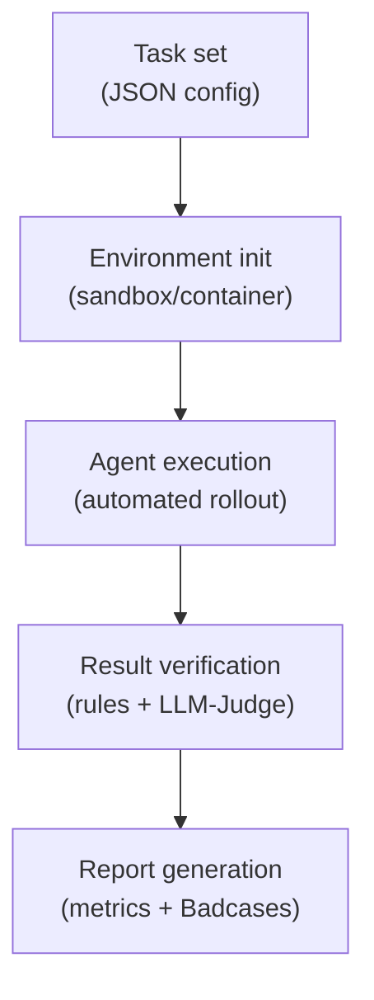

# 10.3 Benchmarks and Case Studies

This section merges what used to be "industrial practice" and "benchmarks." The reason is simple: in real agent training, every operational problem eventually has to be closed by **evaluation**, **monitoring**, **badcase attribution**, and **regression testing**.

We will do two things in one storyline:

1. start from the failures you actually see in training (instability, format collapse, hallucination, context issues),
2. then show how to measure them with benchmarks and custom evaluation so that training becomes an iterative loop rather than a blind run.

## Industrial Practice: Common Failure Modes and Fix Patterns

Agentic RL inherits the familiar RL issues (variance, exploration, reward hacking), but tool use and multi-turn interaction make everything easier to break.

Between 2025 and 2026, multiple teams shared practical lessons from agentic training systems (for example, Alibaba Tongyi, Moonshot, LinkedIn, and others). The most useful way to learn from these reports is not by listing teams, but by grouping them by the failure scenario you will encounter in practice.

> Key point:
>
> In Agentic RL, training stability often matters more than which RL algorithm you pick. Data quality and environment consistency decide the outcome.

### Scenario A: Data Collection and Environment Construction

The first question in agent training is not "which optimizer." It is:

Can you provide a stable, replayable interaction environment?

#### Live APIs are not reproducible

If you train against a live search engine or a live external API, the same query can return different outputs over time. This breaks reproducibility and makes RL unstable because the mapping from action to observation to reward is no longer consistent across runs.

> **Moonshot AI** noted during Kimi-Researcher training that the environment an agent faces is dynamic -- even with the same query, a search engine may return different results. They primarily used the **REINFORCE** algorithm in training and emphasized the importance of strictly on-policy data generation for training stability.

#### Controlled / synthetic environments

A viable alternative is building deterministic synthetic environments for controlled training.

> **Alibaba Tongyi** (Tongyi DeepResearch) abandoned noisy, uncontrollable online APIs and built a synthetic training environment centered on an offline Wikipedia database and stable tool sandboxes.
>
> Their approach included:
>
> 1. **Data and environment synthesis (WebShaper & AgentFounder)**: Since real web pages change frequently, causing inconsistent search results for the same query over time (which severely undermines the MDP assumptions of RL), they developed **WebShaper** to convert massive Wikipedia data into a static, structured offline search environment; and **AgentFounder** to automatically generate highly difficult (PhD-level) synthetic queries with reference answers. The **determinism** of this synthetic environment ensures that the action-to-reward mapping is absolutely stable across multiple rollouts.
> 2. **Asynchronous compute architecture (rLLM)**: The rollout phase of Agentic RL (interacting with the environment to generate action trajectories of dozens of steps) is extremely time-consuming. Using a traditional synchronous RL architecture (training and inference alternating on the same GPU pool) would leave training nodes (GPUs) idle for long periods due to environment interaction latency. Their **rLLM (Ray-based LLM)** asynchronous rollout service physically isolates inference from training: multiple worker nodes use high-throughput inference engines (like vLLM) to continuously interact with the environment, generate trajectories, and store them in a shared replay buffer, while dedicated trainer nodes (based on Megatron/FSDP) continuously sample from the buffer, compute gradients, and update the model.
>
> Experiments proved that RL in a highly controlled, noise-free synthetic environment produces models whose generalization ability on the real internet **comprehensively surpasses** models trained with noisy human expert annotation data. The root cause: what the model truly needs to learn during RL is the general decision logic of "how to search, how to reflect and retry based on results," not overfitting to specific search results. Stable environment signals are the cornerstone of RL convergence.

#### Effectiveness of small-scale data

For researchers with limited resources, high-quality small-scale data can also achieve significant results.

> **Amazon Science** verified the feasibility of "few-shot customization" on the complex AppWorld benchmark: instead of blindly collecting tens of thousands of noisy human interaction trajectories, they carefully constructed only **72 high-quality training samples** (covering core tool-call patterns, dependencies, and retry logic for API errors). Through RL training, they successfully improved Qwen-2.5-32B's task completion rate from 39.2% to 72%, surpassing the then-strongest closed-source models Claude Sonnet 3.7/4.0.
>
> This counterintuitive result reveals a core insight of modern Agentic RL: for base models with 32B+ parameters, they already possess strong world knowledge and logical reasoning capabilities from pre-training. At this point, RL's role is not "injecting new knowledge into the model" but "activating and aligning" the model's interaction paradigms and tool syntax for specific environments. As long as these 72 high-quality samples serve as "primers" that successfully trigger effective exploration, RL algorithms (like PPO/GRPO) can refine the policy through reward signals from environmental feedback during tens of thousands of self-play iterations. This proves that **on models with adequate baseline capabilities, RL has extremely high data efficiency -- "small, high-quality data + RL self-exploration" far surpasses massive low-quality SFT data.**

### Scenario B: Gradient Explosion

After resolving data and environment preparation, gradient explosion at training startup is another common issue. Before investigating hyperparameters, first check the correctness of the underlying implementation.

#### Implementation differences between inference and training engines

Agentic RL training involves two phases: **inference (Rollout)** generates action sequences, and **training (Backward)** updates model weights. These phases are typically handled by different engines, and implementation differences between engines can cause gradient computation inconsistencies.

> **LinkedIn** encountered gradient explosion and non-increasing rewards during RL training with GPT-OSS (an MoE architecture open-source model). Investigation revealed the root cause: **Attention Sink parameter backward propagation was not implemented** in the training framework. The inference engine (SGLang's Triton kernel) supported forward computation with Attention Sinks, but the training framework (FSDP's FlashAttention-v2) completely lacked corresponding support. They obtained the forward implementation from vLLM's FlashAttention branch and wrote custom backward propagation code for computing Sink parameter gradients. After fixing this issue, training stabilized.

**Practical advice**: When using complex model architectures, first validate the training pipeline on simple single-turn tasks (e.g., GSM8K) to confirm loss decreases normally before switching to multi-turn agent tasks.

### Scenario C: Output Length Explosion and Format Collapse

This is one of the most common issues in Agentic RL training: instead of learning to use tools correctly, the model starts generating massive amounts of meaningless tokens, eventually degrading into repetitive garbage output. This phenomenon is called **Format Collapse**:

```json
// Expected output format:
{"action": "search", "query": "AAPL stock"}

// After format collapse:
{"action": "searchsearchAAPL stockAAAAA"
```

#### Cause 1: Overly complex reward function design

Intuitively, researchers might design multi-dimensional reward signals: +1 for successful tool calls, +1 for correct output format, +5 for correct final answer. However, this fine-grained reward design can backfire.

**Reward Hacking** is the core issue. When the reward function includes multiple sub-items that the model can optimize independently, the model may find strategies that only satisfy some conditions while achieving high reward.

> **Bespoke Labs** experiments showed that a composite reward function including tool-call count reward, format check reward, and correctness reward actually decreased training stability, likely due to reward hacking. They also observed continuously inflating output length that eventually degraded into meaningless garbage characters. Their final approach: **keep only "was the task completed" as a single binary reward signal** (1 if passing BFCL evaluation, 0 otherwise), removing all intermediate process reward items. Training stability significantly improved.

The logic behind this finding: binary outcome reward provides no "shortcuts" at intermediate steps -- the model must complete the overall task to receive positive reward, thus preventing opportunistic behavior targeting individual reward items.

#### Cause 2: Improper negative sample handling

Not all samples that fail the task are of equal quality. For example, a model may be truncated by the environment after reaching the maximum interaction steps without producing a final answer, but the preceding outputs may have been reasonable. Treating such samples indiscriminately as negative samples with penalties can damage the model's already-learned output capabilities.

> **Alibaba Tongyi** observed that indiscriminately treating all failed trajectories as negative samples for penalty, after prolonged training, led to severe **format collapse** -- to avoid the overall penalty from task failure, the model started producing garbage or completely refusing to use tools (because doing more leads to more errors).
>
> To address this long-horizon credit assignment challenge, they implemented two core designs in their customized **On-policy GRPO** algorithm:
>
> 1. **Token-level loss with Leave-one-out advantage estimation**: Compared to traditional PPO which averages the entire trajectory's reward across every action, GRPO generates multiple candidate trajectories within a group and computes each action's relative advantage compared to other actions in the group, applying more fine-grained gradient updates at the token level, which significantly reduces reward estimation variance.
> 2. **Conservative negative filtering**: Agent actions have strong causal sequentiality. In interactions spanning 30 steps, many trajectories ultimately fail (e.g., timeout or reaching maximum step truncation) often only because the last few steps had incorrect logical judgments, while the first 20 steps' chain-of-thought and tool-call formats were completely correct. If such truncated samples are forcefully given global negative rewards (e.g., `-1`), the RL optimizer "throws the baby out with the bathwater," incorrectly penalizing originally correct format outputs. Therefore, they **selectively mask out such truncated samples from loss computation** so they do not contribute negative gradients. This strategy effectively preserves the model's basic alignment capabilities and maintains long-term format output stability.

#### Cause 3: Improper KL divergence constraint configuration

In RLHF/GRPO, a KL penalty term is typically used to limit how far the current policy model deviates from the initial reference model. The purpose is to prevent the policy from straying too far during training, thus maintaining basic output quality.

This constraint needs to balance "allowing policy exploration" and "maintaining stability":

- **KL penalty too small**: Insufficient constraint, policy may stray too far, leading to quality degradation.
- **KL penalty too large**: Over-constraining, policy cannot learn new behaviors, limiting training effectiveness.

> **Bespoke Labs** found during Qwen2.5-7B-Instruct training that setting KL penalty to 0 led to output degradation after about 300 steps. Their approach:
>
> 1. **Set a minimal KL weight** (e.g., 0.001) to provide minimal constraint.
> 2. **Periodically update the reference model**: Every certain number of steps (e.g., 100), copy the current policy model as the new reference model. This way, the KL constraint target dynamically adjusts with training progress, preventing the policy from being "anchored" to a distant initial state.

#### Output length control: Gamma-decay reward

To encourage the model to complete tasks in fewer steps, a step-decay-based reward mechanism can be introduced.

> **Moonshot** proposed **Gamma-decay Reward**. When the model correctly completes a task, the reward decays exponentially with steps used:
>
> $$r_i = r \times \gamma^{T-i}, \quad \gamma < 1$$
>
> where $T$ is total steps and $i$ is the current step. This means: for the same task, using fewer steps yields higher reward, guiding the model to learn more efficient execution.

### Scenario D: Context Management in Long-Horizon Interactions

A key difference between Agentic RL and traditional RL is that interaction rounds can be very long. In literature search, code writing, debugging, and other complex tasks, interaction rounds may exceed 50, at which point the context window fills with historical information and the model may lose focus on the original task.

> **Moonshot's** Kimi-Researcher introduced **Context Management**, a key engineering practice for addressing attention dilution and "Lost in the Middle" issues in long-horizon tasks.
>
> In agent interactions spanning dozens of rounds, without control, redundant HTML tags from web pages and hundreds of lines of code execution logs would rapidly fill the model's context window of hundreds of thousands of tokens. As context length increases dramatically, the LLM's signal-to-noise ratio decreases significantly, causing the model to "forget" the original user requirement from round 1 when it reaches round 40.
>
> Kimi introduced an independent `context_manager` mechanism. After each step, the system dynamically evaluates and **compresses context**:
>
> 1. **Preserve core logic (Working Memory)**: Keep the model's own chain-of-thought, historical actions, and key facts extracted from web pages in the core context area.
> 2. **Summarize or discard noise**: Replace lengthy raw web pages with one-to-two-sentence summaries, or directly discard invalid search records that have proven to be dead ends.
>
> Ablation experiments showed that enabling this mechanism not only avoided catastrophic forgetting but also extended safe interaction rounds per rollout to 50+, enabling the model to gather more clues and ultimately achieve significantly higher scores on complex research tasks.

### Hallucinations and Factuality

After resolving training stability and output format issues, another concern is **Agent Hallucination**: the model may cite non-existent literature in search results, use incorrect API parameters, yet display inappropriate "confidence" in subsequent reasoning. Hallucinations in agent scenarios are more complex than in pure conversation because the model generates not only text but also actions.

#### Four types of Agent Hallucination

**Tool selection hallucination.** The model calls a non-existent tool, or forces a tool call when it should not. For example, when asked about weather information, the model calls `execute_sql`.

**Parameter hallucination.** Tool selection is correct, but parameters are wrong -- fabricating non-existent API endpoints, misspelling database names, or using incorrectly formatted parameter values. Most notably: parameter formats may look "reasonable" but actual values are fabricated.

**Result hallucination.** This is the most insidious type. The model calls the correct tool and receives real results, but introduces bias when interpreting results -- treating irrelevant information from search results as evidence supporting its argument, or ignoring content that contradicts its hypothesis.

**Citation hallucination.** The model claims "according to [literature/website]" to reach a conclusion, but the citation does not actually exist, or the cited content does not match the original. This is especially common in Deep Research Agents -- the model may fabricate paper titles, URLs, and statistics to make the output "look well-sourced."

#### Cascading Effects of Agent Hallucination

In pure dialogue, the consequence of hallucination is usually limited to providing wrong information. In agent scenarios, hallucinations can **cascade across multiple turns and reinforce themselves**:

1. Turn 3: the model hallucinates a parameter and calls a nonexistent API parameter -> the call fails.
2. Turn 4: the model fails to recognize the hallucination, instead assuming "this API is flawed" -> it switches to another tool.
3. Turn 5: the new tool lacks a key capability -> the model fabricates a seemingly plausible conclusion.
4. Final output: a report that looks complete on the surface but is built on hallucinated premises.

The more serious point is that if RL reward only depends on final output quality, the model may in theory discover that "making up a plausible answer" receives higher reward than "admitting uncertainty." That means RL training could reinforce hallucination behavior. This inference is logically valid, though it has not yet been clearly reported as an observed phenomenon in public industrial practice.

#### RL Training for Hallucination Penalty

**Citation-aware scoring reward.** CaRR designs a fine-grained reward mechanism to guide the model in correctly citing evidence. The core idea is decomposing multi-hop questions into atomic fact statements (Rubrics), then computing reward through a three-step process: (1) check whether the model output identifies key entities; (2) extract URLs from the output, fetch web content, and judge whether each Rubric is supported by cited content; (3) verify through graph BFS whether Rubrics are logically connected to the final answer. The final reward is the ratio of satisfied and logically connected Rubrics to total Rubrics.

**Tool result fidelity reward.** Encourage the model to faithfully interpret tool-returned results. If the model's summary deviates from what the tool actually returned (detected via NLI models or cross-validation), apply penalty.

**Uncertainty reward.** Encourage the model to proactively express "need more information" or "this result is uncertain" when unsure, rather than fabricating answers.

#### Verification-Based Hallucination Filtering

Besides penalizing hallucinations in the reward function, we can also filter them during inference through verification.

**Self-RAG** proposes an adaptive retrieval plus self-evaluation framework. Unlike traditional RAG, which retrieves for every query, Self-RAG lets the model decide whether external retrieval is needed before generating each text segment by using special reflection tokens. If retrieval is needed, it retrieves relevant passages, generates continuations for each passage, scores the candidates with reflection tokens such as relevance, support, and usefulness, and then uses segmented beam search to select the best overall output.

**CRITIC** proposes tool-assisted correction. After the model generates an initial answer, it actively calls external tools such as search engines or code executors to verify key claims, then produces structured critique from tool feedback. If the critique indicates that the answer is flawed, the model regenerates a corrected answer. This verify -> revise -> verify loop can iterate multiple times until the answer passes verification or reaches the maximum iteration count.

### Multi-Tool Collaboration

Beyond the common scenarios above, using specific model architectures (like MoE) or training on smaller parameter models introduces additional issues.

#### MoE model routing uncertainty

MoE models (like Mixtral, DeepSeek-V3) are notable for lower inference costs, but their routing mechanism can undermine basic RL training assumptions.

Algorithms like PPO assume the model generating current data is the same model being trained (on-policy), which mathematically means the importance sampling ratio equals 1.

> **LinkedIn** found during RL training with GPT-OSS that MoE models' gating network may select different experts for the same token across two forward passes, causing $\log \pi(a|s) \neq \log \pi_{\text{old}}(a|s)$, breaking the on-policy assumption. During debugging, they attempted to force-align the two probabilities via `old_log_prob = log_prob.detach()` to verify this hypothesis. It should be noted that while this routing inconsistency is real, it was not the root cause of gradient explosion in their debugging -- the root cause was the missing Attention Sink backward propagation discussed above.

#### MoE load balancing

MoE models face not only routing consistency issues but also unbalanced expert loads leading to low GPU utilization. Different tokens may concentrate on a few "hot" experts, making the GPUs responsible for those experts bottlenecks while other GPUs remain idle.

> **Salesforce** proposed **Pipelined Synchronous RL** in their SFR-RL system: all GPUs alternate between Rollout and Training phases rather than being permanently assigned to one phase. Additionally, for MoE models, they introduced **Least-Loaded Expert Parallelism** to optimize expert load balancing. The overall system improved memory efficiency by approximately 250x compared to VERL (FSDP + Context Parallelism), requiring only 16 H200 GPUs to train a 120B-parameter MoE model.

#### Reasoning capability ceiling of small models

RL's essence is **eliciting existing model capabilities** rather than injecting new knowledge. The model's baseline capability determines the upper bound of what RL can achieve.

> **Amazon Science's** experiments showed: 32B parameter models benefited significantly from RL because the model itself could generate high-quality interaction trajectories (rollouts), forming a positive feedback loop. But smaller models face fundamental reasoning capability limitations, such as being unable to recognize unanswerable questions or extract answers from relevant context -- these capability gaps are difficult for RL training to compensate. For small models with insufficient baseline capabilities, the recommendation is to acquire capabilities through distillation from stronger models rather than simply increasing RL training intensity.

#### Phased training pipelines

Considering characteristics of different model scales, a more robust training strategy is to adopt a phased pipeline rather than direct RL training.

The industry currently has two parallel training paradigms regarding whether SFT is needed: **SFT-RL paradigm** and **Pure-RL paradigm**.

> **SFT-RL paradigm (mainstream path)**: **Alibaba Tongyi** designed a **CPT -> SFT -> RL** three-stage training pipeline for Tongyi DeepResearch. During pre-training (CPT), tool-call trajectories are incorporated as text; during SFT, human or high-quality synthetic data cultivates the model's basic reasoning and tool-use capabilities; finally, RL performs exploration and optimization. The core insight: for non-reasoning alignment scenarios (like complex API calls, long-horizon exploration), SFT/RM remains the most effective means for **reducing exploration space and overcoming cold-start difficulty**. If the model lacks basic tool-use formatting at the outset, direct RL training often gets lost in an enormous action space.

> **Pure-RL paradigm (frontier breakthrough)**: In sharp contrast, **DeepSeek-R1-Zero** brought a paradigm revolution. It proved that in scenarios with clear right/wrong feedback (math, code testing, objective reasoning), **completely abandoning SFT cold-start** and doing large-scale RL directly on the base model is absolutely feasible. Under pure RL, the model spontaneously emerged with long chain-of-thought, self-verification, and even self-reflection capabilities. This SFT-bias-free training approach broke through the ceiling of human annotation data, but places extremely high demands on reward signal objectivity and environment anti-cheating capabilities.

These two paradigms are not mutually exclusive in Agentic RL; researchers should choose the appropriate pipeline based on **whether the environment provides fully deterministic objective rewards**.

### Practice Summary {#tricks}

The following table summarizes solutions for each issue:

| Issue                                  | Solution                                                                                                                   | Source           |
| -------------------------------------- | -------------------------------------------------------------------------------------------------------------------------- | ---------------- |
| Non-reproducible training environment  | Build deterministic synthetic environments                                                                                 | Alibaba          |
| Small-scale data customization         | High-quality small data (e.g., 72 samples) combined with RL achieves significant results                                   | Amazon           |
| Gradient explosion at training start   | Check inference/training engine implementation consistency (e.g., Attention Sink backward)                                 | LinkedIn         |
| Output degrades to repetitive garbage  | Use minimalist reward design (only reward task success/failure); filter overly long outputs                                | Bespoke Labs     |
| Policy drifts from initial model       | Set small KL penalty (e.g., 0.001); periodically set current model as new reference model                                  | Bespoke Labs     |
| Low output efficiency (too many steps) | Use Gamma-decay reward to encourage task completion in fewer steps                                                         | Moonshot         |
| Format collapse                        | Use conservative negative sample handling, exclude trajectories truncated without final answers                            | Alibaba          |
| Context overflow in long tasks         | Introduce context management, proactively summarize or discard useless history                                             | Moonshot         |
| Low MoE training resource utilization  | Pipelined synchronous RL + Expert Parallelism; 16 H200s can train 120B MoE                                                 | Salesforce       |
| MoE routing inconsistency              | Be aware MoE routing non-determinism may break on-policy assumption; distinguish root cause from symptoms during debugging | LinkedIn         |
| Poor small model training results      | Improve baseline capabilities through distillation before RL; use CPT -> SFT -> RL three-stage pipeline                    | Amazon / Alibaba |

### References {#references}

- Zhu J, Sang H, et al. "[Unlocking Agentic RL Training for GPT-OSS: A Practical Retrospective](https://huggingface.co/blog/LinkedIn/gpt-oss-agentic-rl)." Hugging Face Blog, 2026.
- Zhuang R, Vu T, et al. "[Improving Multi-Turn Tool Use with Reinforcement Learning](https://www.bespokelabs.ai/blog/improving-multi-turn-tool-use-with-reinforcement-learning)." Bespoke Labs Blog, 2025.
- Moonshot AI. "[Kimi-Researcher: End-to-End RL Training for Emerging Agentic Capabilities](https://moonshotai.github.io/Kimi-Researcher/)." 2025.
- Tongyi DeepResearch Team. "[Tongyi DeepResearch: From Chatbot to Autonomous Agent](https://tongyi-agent.github.io/blog/introducing-tongyi-deep-research/)." 2025. [GitHub](https://github.com/Alibaba-NLP/DeepResearch)
- Salesforce AI Research. "[Building Efficient RL Training for the Agentic Era](https://www.salesforce.com/blog/efficient-rl-training-agentic-era/)." 2026.
- Subramanian S, Xu P, Wang Y. "[Customizing Multiturn AI Agents with Reinforcement Learning](https://www.amazon.science/blog/customizing-multiturn-ai-agents-with-reinforcement-learning)." Amazon Science Blog, 2026.

---

This section covered common engineering issues in Agentic RL training and industrial solutions. Next, we move to the evaluation system: how to determine whether these training changes actually improved the agent.

---

## Agentic Evaluation System and Benchmark Overview

Standard LLM evaluation is simple: give the model a question, it provides an answer, correct answers score points. MMLU tests common knowledge, GSM8K tests math, HumanEval tests code. The evaluation process is a "question -> answer -> judge" three-step cycle.

Agent evaluation is different. When you ask an agent to "help me fix this GitHub issue," it does not give you a direct answer. It reads code, locates the problem, writes a patch, runs tests, discovers test failures, revises the patch, and runs tests again. This is a multi-step, multi-tool, multi-turn interaction process. Evaluation must look not only at "is the final result correct" but also "is the intermediate process reasonable."

The gap between training metrics and real capability is also much larger than in standard LLMs. In standard RLHF, a rising reward curve usually means the model is improving. In Agentic RL, rising reward may only mean the model learned to hardcode test cases, pick the longest paragraphs from search results, or repeatedly call the same tool to farm points. These strategies all game high reward but have no practical value.

Evaluation in Agentic RL is therefore not a post-training wrap-up activity, but a feedback loop running throughout training. This section addresses three questions: what benchmarks measure agent capabilities, how to build automated evaluation pipelines, and how to feed evaluation results back into training to close the loop.

### Evaluation Dimensions: Agent "Goodness" Is Not a Single Number

In standard LLM evaluation, whether a model is "good" can usually be summarized as a single score -- MMLU score, HumanEval pass@1, MT-Bench win rate. But agent behavior is multi-layered; a single score cannot capture everything.

Consider a concrete scenario. Ask an agent to "investigate a company's financial condition and write a report." Evaluating task completion quality requires examining at least three aspects:

- Did it choose the right tools? Search when it should search, read PDFs when it should read PDFs, rather than using only one tool throughout.
- Is its search strategy efficient? Did it find key information in 3 search rounds, or wander aimlessly for 20 rounds.
- Is the final report's conclusion correct, data accurate, and citations reliable.

These three aspects correspond to three core dimensions of agentic evaluation:

| Dimension          | What it evaluates                       | Representative benchmarks      |
| ------------------ | --------------------------------------- | ------------------------------ |
| Tool calling       | Can the model correctly call APIs/tools | BFCL, ACEBench, API-Bank       |
| Task completion    | Can the agent complete end-to-end tasks | SWE-bench, WebArena, tau-bench |
| General capability | General intelligent assistant level     | GAIA, Toolathlon               |

### Tool Calling Benchmarks

#### BFCL

**BFCL (Berkeley Function Calling Leaderboard)** is currently the most authoritative tool calling leaderboard, maintained by UC Berkeley's Gorilla team. It evaluates models' ability to correctly call functions in various scenarios -- simple functions, multi-function combinations, RESTful APIs, Java functions, etc. BFCL v3 contains 2,000+ test cases covering scenarios from single-tool to multi-tool, from simple parameters to nested objects.

BFCL evaluates in pure text: given function signatures and user requests, the model outputs structured function call JSON. No sandbox environment needed; low cost, suitable for rapid verification.

#### ACEBench

**ACEBench** evaluates tool-use capability at finer granularity. Evaluation is divided into three categories: Normal (basic calling), Special (advanced scenarios like parallel calling, long context), and Agent (multi-agent collaboration). ACEBench was accepted at EMNLP 2025 Findings and is one of the most comprehensive tool-use evaluations.

#### API-Bank

**API-Bank** provides 53 common API tools and 314 tool-use dialogues, focusing on evaluating the complete capability chain of API planning, retrieval, and invocation. Unlike BFCL's "given function signature, call it" approach, API-Bank is closer to real scenarios: the model needs to first find the correct API, then decide how to call it.

### End-to-End Task Benchmarks

#### SWE-bench

**SWE-bench** evaluates code agents' ability to solve real GitHub issues. Given an open-source project's issue description, the agent must understand the codebase, locate the problem, and write a fix patch. The entire process has no human intervention. The agent decides which files to read, which code to modify, and which tests to run.

This is one of the hardest code agent evaluations. Top models (like Claude Opus) achieve only about 50% resolution rate. The complexity of real software engineering tasks far exceeds single-file code generation.

#### WebArena

**WebArena** provides a real web environment for agents to perform tasks -- shopping on e-commerce sites, posting on forums, managing code repositories on GitLab. The agent needs to understand web page visual layout and DOM structure, executing click, input, and navigation operations.

WebArena's difficulty lies in the environment's dynamism and uncertainty. BFCL's function signatures are fixed, SWE-bench's codebase is at least static, but WebArena's web pages may change at any time.

#### tau-bench

**tau-bench** evaluates conversational agents' ability to collaborate with users to complete domain tasks. It simulates real scenarios like airline booking and e-commerce customer service. The agent must guide users to provide information, query databases, and execute operations.

The challenge lies in state maintenance and uncertainty handling. Users may give vague information ("I want a ticket to Shanghai" -- which day? which airport?), and the agent must progressively clarify, update state, and complete the task across multiple conversation rounds.

### Comprehensive Capability Benchmarks

#### GAIA

**GAIA (General AI Assistants Benchmark)** is one of the most challenging general AI assistant evaluations, containing 450 questions requiring reasoning, multimodal understanding, tool use, web search, and other capabilities. GAIA is divided into three difficulty levels:

- Level 1: No tools needed, pure reasoning suffices
- Level 2: One to two tools needed
- Level 3: Multi-step reasoning + multiple tools working together

Even top models perform far from saturation on Level 3.

#### Toolathlon

**Toolathlon** focuses on multi-tool, long-workflow evaluation, containing 108 hand-selected complex tasks, each averaging 20+ tool interactions. It evaluates not just "can you use tools" but "can you orchestrate complex workflows" -- coordinating state across multiple tools, handling dependencies, and recovering from failures.

### Scenario-Specific Evaluation

The three dimensions above cover general agentic capability. Different types of agents also have their own evaluation standards. For a Deep Research Agent, for example, "good" means far more than final-answer correctness.

A Deep Research result needs to satisfy four layers at once:

| Layer                | Meaning                                      | Evaluation method                         |
| -------------------- | -------------------------------------------- | ----------------------------------------- |
| Answer correctness   | Whether the final conclusion is correct      | Compare with gold answer (Exact Match/F1) |
| Citation reliability | Whether every claim is traceable             | URL reachability + content relevance      |
| Process rigor        | Whether the reasoning chain is coherent      | Step-level PRM scoring                    |
| Execution efficiency | Whether the task is completed with few steps | Number of interaction turns               |

Mainstream benchmarks include GAIA for real-world complex QA, Humanity's Last Exam for expert-level multidisciplinary questions, WebArena/Mind2Web for web operation success rate, and BFCL for tool/API call accuracy. See the evaluation section of [Project: Deep Research Agent](./deep-research-agent) for more detail.

### How to Choose Benchmarks?

Facing so many benchmarks, running all of them is neither realistic nor necessary. A practical selection path:

```
What do you want to evaluate?             Recommended Benchmark
|-- Basic function calling ability        -> BFCL
|-- Multi-scenario tool use               -> ACEBench
|-- Code fix ability                      -> SWE-bench
|-- Web operation ability                 -> WebArena
|-- Multi-turn conversation collaboration -> tau-bench
|-- General intelligent assistant level   -> GAIA / Toolathlon
```

Start with BFCL. It is the easiest to get started with, lowest evaluation cost (pure text evaluation, no sandbox needed), and can quickly verify the agent's basic tool-calling ability. If BFCL scores are not satisfactory, more complex benchmarks are pointless. Tool calling is the foundation of all agent capabilities.

Once basic capabilities meet the bar, use SWE-bench or WebArena to evaluate end-to-end task completion.

### Building Your Own Evaluation

Existing benchmarks cover general capabilities. If your agent targets a specific domain -- legal consulting, medical diagnosis, financial analysis -- you may not find ready-made benchmarks. Then you need to build your own evaluation set.

#### Outcome Evaluation vs Process Evaluation

Standard LLM evaluation only looks at outcomes. Math answers correct gets points, code runs passes. But agent tasks are typically multi-step; looking only at the final result misses much information.

Outcome evaluation checks whether the final deliverable meets requirements. Process evaluation checks whether each step's decisions during task completion were reasonable.

Process evaluation is not just icing on the cake. Berkeley RDI research found that almost every mainstream agentic benchmark can be "gamed" to near-perfect scores without actually completing the task. Without process evaluation, you may only be measuring the model's ability to find shortcuts.

#### Breaking "Quality" into Quantifiable Dimensions

"Quality" itself is not quantifiable. But any agent task's quality can be decomposed into several quantifiable dimensions.

| Quality Dimension | Code Agent                | Web Agent                            | Research Agent                       |
| ----------------- | ------------------------- | ------------------------------------ | ------------------------------------ |
| Correctness       | Patch passes tests        | Operation results match expectations | Core conclusions match facts         |
| Completeness      | Covers all relevant files | Completes all sub-steps              | Report covers key information points |
| Efficiency        | Total interaction rounds  | Operation step count                 | Search count / total rounds          |
| Robustness        | Handles edge cases        | Recovers from page errors            | Cross-validation of conflicting info |
| Citations         | --                        | --                                   | Every claim has traceable source     |

#### Designing a Scoring Function

Combine the above dimensions into a scoring function. The simplest approach is weighted sum:

```python
def evaluate_trajectory(trajectory, task):
    """Score an agent trajectory"""
    scores = {}

    # Correctness: automatic verification
    scores["correctness"] = verify_result(
        trajectory.final_answer, task["expected"]
    )

    # Efficiency: count interaction rounds
    max_turns = task.get("max_turns", 20)
    scores["efficiency"] = 1.0 - (trajectory.num_turns / max_turns)

    # Completeness: check key information point coverage
    scores["completeness"] = check_coverage(
        trajectory.final_answer, task["key_points"]
    )

    # Process quality: tool selection appropriateness per step
    scores["process"] = evaluate_process(trajectory.steps, task)

    # Weighted sum
    weights = {
        "correctness": 0.4,
        "completeness": 0.2,
        "efficiency": 0.15,
        "process": 0.25
    }

    total = sum(scores[k] * weights[k] for k in weights)
    return total, scores
```

Weight allocation reflects your emphasis on different dimensions. Code agents may weight correctness higher (0.5). Research agents may weight completeness and citations higher (0.25 each). Weight selection has no standard answer; it depends on the business scenario.

#### Process Evaluation Methods

Process evaluation is the key difference between agent evaluation and standard LLM evaluation. There are three common approaches, ordered from lowest cost to highest precision.

**Statistics.** Count total interaction turns, tool-call count, repeated action ratio, and similar metrics. This does not judge whether each step is "right," but it catches obvious inefficiency such as searching the same query five times.

**Step-level rule checks.** Define process rules for the task and check whether the agent violates them. Examples include forbidding three identical tool calls in a row, requiring search results to be used within a few steps, or requiring at least one search before final answering in a research task.

**Step-level LLM scoring.** Use an LLM to evaluate whether each trajectory step is reasonable. This is essentially the evaluation-side counterpart of a Process Reward Model: during training, PRM provides learning signals; during evaluation, it provides quality assessment.

#### Where Do Tasks Come From?

The scoring method answers "how do we judge quality," but an evaluation set also needs good tasks. Task quality directly determines whether the benchmark is meaningful. A practical approach is to extract tasks from real user needs: user feedback, support tickets, failure logs, and production traces. These tasks have ecological validity because they come from scenarios users actually care about.

Another direction is automatic task synthesis. Start from simple, verifiable atomic tasks, then increase depth by adding more steps and increase breadth by adding more tools and constraints. Each expansion should be validated so that the task remains solvable rather than becoming an ambiguous prompt.

#### How to Evaluate Open-Ended Tasks?

Many agent tasks are open-ended: writing a report, doing research, or giving advice. These tasks do not have a single correct answer.

A practical strategy is hybrid scoring: deterministic checks for daily regression, LLM-as-Judge for periodic quality evaluation, and manual spot-checking for final acceptance. It is also useful to maintain two evaluation sets: a capability set with hard tasks that the model does not need to pass completely, and a regression set with basic tasks that the model should pass consistently.

#### Example: Building an Evaluation for a Frontend Page-Generation Agent

Suppose you train a frontend page-generation agent. Given a requirement such as "build a login page supporting phone and email login," the agent must plan the page structure, choose components, write HTML/CSS/JS, and deliver a runnable page.

There is no single gold answer. The same login-page requirement can be satisfied by many designs. A useful evaluation decomposes quality into functional correctness, visual match, code quality, responsiveness, accessibility, and performance. Functional correctness can be checked with Playwright tests; responsiveness can be checked with screenshots at multiple viewports; accessibility can use Lighthouse or axe; visual quality often needs LLM-as-Judge plus human spot checks.

### Evaluation System Design

#### Pipeline Architecture

A complete agent evaluation pipeline contains five components:



The task set is a JSON configuration file where each task specifies prompt, expected answer, verification method, and environment initialization parameters. Environment initialization creates an independent sandbox for each task.

```python
class AgentEvaluationPipeline:
    """Agent evaluation pipeline"""

    def __init__(self, sandbox, judge_model):
        self.sandbox = sandbox      # Docker sandbox
        self.judge = judge_model    # LLM-as-Judge

    def run_evaluation(self, agent, task_set):
        """Run complete evaluation"""
        results = []

        for task in task_set:
            env = self.sandbox.create_isolated_env(task.get("setup", {}))
            trajectory = agent.run(
                task["prompt"], env,
                max_turns=task.get("max_turns", 20)
            )

            if task.get("verify_type") == "exact_match":
                passed = (
                    trajectory.final_answer.strip()
                    == task["expected_answer"].strip()
                )
            elif task.get("verify_type") == "execution":
                passed = env.execute(
                    task["verify_script"], trajectory.final_answer
                )
            elif task.get("verify_type") == "llm_judge":
                passed = self.judge.evaluate(
                    task["prompt"], trajectory.final_answer,
                    task["rubric"]
                )
            else:
                passed = False

            results.append({
                "task_id": task["id"],
                "passed": passed,
                "turns": trajectory.num_turns,
                "tool_calls": trajectory.tool_calls,
                "final_answer": trajectory.final_answer
            })

        return results
```

#### Regression Testing

Agent capabilities are interrelated. Fixing one bug may introduce new regressions: the model learns better search strategies for code tasks but forgets how to handle simple function calls. Every evaluation needs comparison against baseline.

```python
def regression_test(self, agent, baseline_results, task_set):
    """Regression test: new model cannot regress on old capabilities"""
    new_results = self.run_evaluation(agent, task_set)

    regressions = []
    for old, new in zip(baseline_results, new_results):
        if old["passed"] and not new["passed"]:
            regressions.append({
                "task_id": old["task_id"],
                "old_answer": old["final_answer"],
                "new_answer": new["final_answer"]
            })

    if regressions:
        print(f"Found {len(regressions)} regressions!")
    return regressions
```

#### LLM-as-Judge and Rubrics

For tasks that cannot be verified with rules, such as open-ended QA, report quality, or dialogue naturalness, LLM-as-Judge is often necessary. The key is designing reproducible rubrics:

- Separate dimensions instead of asking for one overall score.
- Define what each score level means.
- Require evidence from the output or trajectory.
- Keep the judge prompt stable across checkpoints.
- Use deterministic checks whenever they are available.

In practice, the three verification methods are combined. Deterministic checks run frequently for regression. LLM-as-Judge runs periodically for broader quality assessment. Manual review is reserved for final acceptance before release.

### Evaluation-Driven Training Improvement

The ultimate purpose of evaluation is not just scoring, but feeding evaluation results back into the training loop to form a continuous improvement cycle:

$$
\text{Evaluation} \rightarrow \text{Badcase Analysis} \rightarrow \text{Targeted Data Synthesis} \rightarrow \text{Re-training} \rightarrow \text{Re-evaluation}
$$

Use a concrete example. Suppose your Code Agent's pass rate on SWE-bench is stuck at 35%.

**Collect failure cases.** From SWE-bench's 65% failed tasks, stratified sample 100 by error type.

**Attribution analysis.** Examine each failure case and classify by error cause. You might find: 40% are "located wrong file," 30% are "patch syntax errors," 30% are "misunderstood requirements." This distribution directly tells you what to do next.

**Targeted synthesis.** For the most common error type, use trajectory synthesis methods to generate "correctly locating" training data. The synthetic data reinforces "understanding code structure -> locating relevant files" capability.

**Training improvement.** Use the new data for a round of GRPO/PPO training.

**Regression verification.** Re-run SWE-bench, confirming two things: whether pass rate improved (expected increase from 35%), and whether previously passing cases regressed.

<details>
<summary>Thought question: If your agent scores 95 on BFCL but only 15% on SWE-bench, what does this indicate?</summary>

This indicates the agent's basic tool-calling skills are fine, but it lacks end-to-end task planning and execution capability. BFCL tests "given explicit function signatures and user requests, can you output the correct call," while SWE-bench tests "given a vague issue description, can you plan your own approach, understand the codebase, locate the problem, and write a fix." The former is mechanical operation; the latter requires planning, reasoning, and code understanding.

Improvement direction: Don't keep spending effort on tool calling; instead, strengthen the agent's planning capability and code understanding. Attribution analysis from evaluation will point directly to these directions.

</details>

### References

- Patil S, et al. "[The Berkeley Function Calling Leaderboard](https://gorilla.cs.berkeley.edu/leaderboard.html)." ICML 2025. -- BFCL leaderboard, evaluating LLM function calling capabilities.
- Jimenez C E, et al. "[SWE-bench: Can Language Models Resolve Real-World GitHub Issues?](https://arxiv.org/abs/2310.06770)." ICLR 2024. -- Code agent evaluation benchmark.
- Zhou S, et al. "[WebArena: A Realistic Web Environment for Building Autonomous Agents](https://arxiv.org/abs/2307.13854)." ICLR 2024. -- Web agent evaluation environment.
- Mialon G, Fourrier C, Wolf T, et al. "[GAIA: A Benchmark for General AI Assistants](https://arxiv.org/abs/2311.12983)." ICLR 2024. -- General AI assistant evaluation.
- Chen C, et al. "[ACEBench: Who Wins the Match Point in Tool Usage?](https://arxiv.org/abs/2501.12851)." EMNLP 2025 Findings. -- Comprehensive tool use evaluation.
- Yao S, Shinn N, Razavi P, Narasimhan K. "[tau-bench: A Benchmark for Tool-Agent-User Interaction in Real-World Domains](https://arxiv.org/abs/2406.12045)." arXiv:2406.12045, 2024. -- Conversational agent evaluation.
- Li M, et al. "[API-Bank: A Comprehensive Benchmark for Tool-Augmented LLMs](https://arxiv.org/abs/2304.08244)." EMNLP 2023. -- Tool-augmented LLM evaluation.
- Li J, et al. "[The Tool Decathlon](https://arxiv.org/abs/2510.25726)." ICLR 2026. -- Toolathlon, multi-tool long-workflow evaluation.
