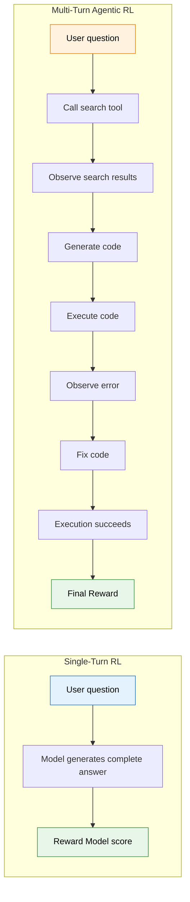
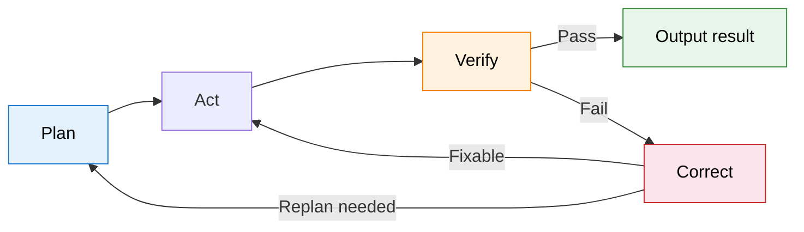
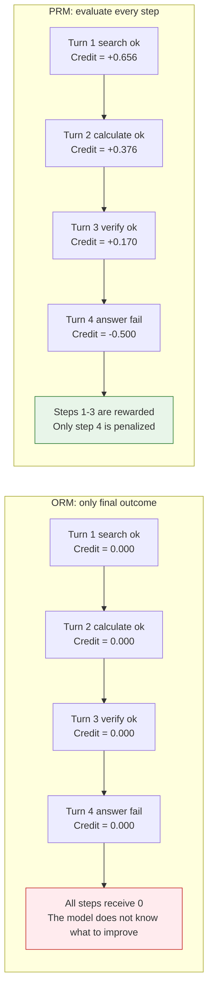
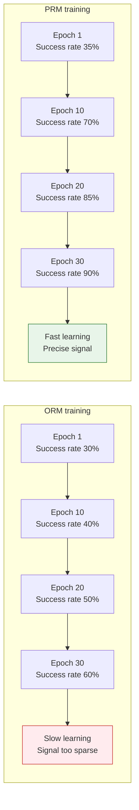

# 10.1 Multi-Turn RL and Credit Assignment

In the previous chapter, we saw how GRPO uses verifiable rewards to train the reasoning ability of large models. But that is still "single-turn": the model generates a complete answer in one pass, and the final result is scored. Real agents do not work this way. A truly useful agent needs to **act across multiple consecutive steps**: search for information, execute code, observe the result, and adjust its strategy. Each step may change the direction of all later steps, while the reward signal often appears only at the end. In this section, we will unpack this new RL paradigm.

## From Single-Turn to Multi-Turn: Not Just "Taking More Steps"

The difference between single-turn RL and multi-turn RL is not simply that "one step becomes seven steps." It changes the entire structure of the RL problem. Let us use a concrete example to feel the change:



On the surface, the difference is "more steps." But mathematically, there are three fundamental changes.

**The action space expands.** In single-turn RL, the model has only one kind of action: generating the next token. In multi-turn RL, the model must choose among multiple heterogeneous actions: should it continue generating text, call a search tool, or execute a piece of code? These actions are completely different in type, so they cannot be naively concatenated into one large action space.

**Rewards are delayed.** In single-turn RL, the model receives a reward as soon as it finishes generating the answer. In a multi-turn setting, the final result may appear only after seven rounds of interaction, with no feedback in the middle. The model must learn to make correct decisions under "no immediate feedback."

**Credit assignment becomes harder.** This is the central challenge. Suppose a seven-turn interaction ultimately fails. Was the search query in turn 2 wrong? Was there a bug in the code at turn 5? Or did the repair direction in turn 6 go completely off track? Given a single final "failure" signal, how should we distribute responsibility across seven steps?

## Agentic MDP: Modeling an Agent

Let us formalize the problem using the MDP framework from Chapter 3. An agentic system can be modeled as a special MDP:

- **State $s_t$**: the current conversation history, the results returned by tools that have already been called, and the current environment state. Notice that this state **grows cumulatively**: after every turn, the state gains another segment of history. This differs from the usual "state transition" in a standard MDP; it is closer to an ever-expanding context window.
- **Action $a_t$**: generate text, call tool A, call tool B, and so on. The action space is **heterogeneous**: different action types have completely different effects and constraints.
- **Transition $P(s_{t+1}|s_t, a_t)$**: the environment response. When the model chooses to "call the search tool," the returned search results are not controllable. Search for the same phrase today and tomorrow, and the results may differ. This is the environment's "dynamics."
- **Reward $r(s_t, a_t)$**: rewards for intermediate steps are usually 0, and only the final result gives 1 for success or 0 for failure. This is an extremely **sparse** reward signal.

$$R_{\text{total}} = \sum_{t=1}^{T} \gamma^t \cdot r_t$$

Here $T$ is the total number of turns, $\gamma$ is the discount factor, and $r_t$ is the immediate reward at turn $t$. In most agentic scenarios, only $r_T$ is nonzero, namely the reward for the final result; the intermediate rewards $r_1, r_2, \ldots, r_{T-1}$ are all 0.

This is exactly the same difficulty REINFORCE faced in Chapter 5: $G_t$ includes all randomness from the current step to the end, so its variance is very large. The difference is that now each step is no longer a simple "choose left or choose right"; it is "decide which tool to call and what content to generate," which raises the complexity by several orders of magnitude.

## Credit Assignment: Seven Turns Failed, Who Is to Blame?

Credit assignment is a classic RL problem, and it becomes especially sharp in agentic settings. Consider this scenario:

> User: "Who won the 2024 Nobel Prize in Physics? What were their main contributions?"
>
> The agent's seven-turn interaction:
>
> 1. Calls the search tool and searches for "2024 Nobel Physics" -- returns the correct result
> 2. Calls the search tool and searches for the winners' papers -- returns relevant papers
> 3. Generates a summary -- includes the winners' names but incompletely
> 4. Calls the search tool for more details -- the query contains a spelling error and returns irrelevant results
> 5. Generates additional explanation based on the wrong information -- the content starts to drift
> 6. Calls a code tool to draw a chart -- the code itself is fine
> 7. Gives the final answer -- the answer is wrong because the query in step 4 was misspelled

Final reward = 0, meaning failure. But the problem is that steps 1, 2, 3, and 6 were actually reasonable. Only step 4 made a mistake, and step 5 was led astray by step 4. If you simply blame "failure" on every step, then the correct search in step 1 is also punished. That is clearly unreasonable.

This example reveals the core dilemma of multi-turn credit assignment: **errors in early steps can cascade into all later steps, while later steps may themselves be reasonable given the wrong input**.

## ORM vs PRM: Two Credit Assignment Strategies

Faced with this dilemma, researchers have proposed two very different strategies.

### ORM: Look Only at the Outcome

The idea behind ORM is extremely simple and direct: **do not score intermediate steps; look only at the final result**.[^lightman] If the whole trajectory succeeds, every step receives a positive signal; if it fails, every step receives a negative signal.

$$r_1 = r_2 = \cdots = r_{T-1} = 0, \quad r_T = \begin{cases} 1 & \text{success} \\ 0 & \text{failure} \end{cases}$$

The advantage of ORM is that it is **simple and cheap**. You only need to know whether the final result is correct; you do not need labels for intermediate steps. For verifiable tasks, such as whether code passes tests or whether a math answer is correct, you may not need any human labeling at all.

The disadvantage of ORM is that the **signal is sparse**. A seven-turn interaction has only one reward signal, so it is very hard for the model to learn "which specific step should be improved" from that signal. It is like an exam that only tells you the total score without telling you which questions were wrong. You know you failed, but you do not know what to review.

### PRM: Score Every Step

The idea behind PRM is to **score every step**. It asks not only "is the final answer correct," but also "is each step of the reasoning process correct?"

$$r_t = f_{\text{PRM}}(s_1, a_1, s_2, a_2, \ldots, s_t, a_t)$$

Here $f_{\text{PRM}}$ is a specially trained process reward model. It looks at the full history from step 1 to step $t$ and judges whether step $t$ is correct.[^prs]

The advantage of PRM is that the **signal is dense**. Every step has an explicit learning signal, so the model can know precisely that "the query in step 4 was wrong, but the summary in step 3 was reasonable." This greatly accelerates learning.

The disadvantage of PRM is that the **labeling cost is extremely high**. You need to label every step as correct or wrong, which is $T$ times more work than labeling only the final result. Moreover, "whether an intermediate step is correct" is often harder to judge than "whether the final answer is correct," because many different reasoning paths may be reasonable.

|                     | ORM                                     | PRM                                       |
| ------------------- | --------------------------------------- | ----------------------------------------- |
| Signal density      | Sparse, only final reward               | Dense, reward at every step               |
| Labeling cost       | Low, outcome only                       | High, every step must be labeled          |
| Learning speed      | Slow, little signal and high variance   | Fast, more signal and lower variance      |
| Best suited for     | Verifiable tasks, such as code and math | Complex reasoning requiring fine guidance |
| Representative work | GRPO, Chapter 9                         | Math-Shepherd[^mathshepherd], PRS         |

### SALT: A Third Path Between ORM and PRM[^salt]

SALT offers a clever middle ground: **it does not require training a PRM, but it is much more fine-grained than pure ORM**. Its core idea is to sample multiple trajectories for the same prompt and build a **trajectory graph**. The nodes in the graph are actions at each step. If two trajectories take the same action at a certain step, they share the same node. By analyzing the graph structure, we can quantify each step's contribution to the final result.

Intuitively, if a step is shared by many **successful trajectories** and rarely appears in failed trajectories, then it is probably a good step and should receive a positive advantage. Conversely, if a step appears only in failed trajectories, it probably harmed performance. SALT uses this graph structure to compute the advantage of each step, without any additional reward model or human labels. It only needs the final binary signal, success or failure, and can derive fine-grained step-level advantages from it.

This makes SALT especially useful inside the GRPO framework. GRPO already samples multiple trajectories within a group for comparison; SALT refines this further to the step level, providing a more stable training signal for long-horizon tasks.

## Turn-Level Discounting: The Earlier the Mistake, the Larger the Responsibility

Whether we use ORM or PRM, multi-turn RL must handle a temporal issue: **mistakes in earlier steps have larger effects**. The intuition is straightforward. If the first step points in the wrong direction, every later step unfolds on the wrong foundation. But if a small mistake occurs in step 6, step 7 may still have a chance to correct it.

To model this intuition, researchers introduce **Turn-Level Discounting**:

$$R = \sum_{t=1}^{T} \gamma^t \cdot r_t$$

Here $\gamma < 1$ is the discount factor. Notice that $\gamma^t$ here is not discounting the "future," but assigning different weights to steps in the "past." In practical implementations, the more common approach is **reverse discounting**: propagate backward from the final result, so earlier steps are discounted more heavily.

```python
def compute_turn_rewards(turn_rewards, gamma=0.9):
    """Compute discounted cumulative returns for multi-turn RL."""
    T = len(turn_rewards)
    returns = []
    G = 0
    # Accumulate from the final turn backward.
    for t in reversed(range(T)):
        G = turn_rewards[t] + gamma * G
        returns.insert(0, G)
    return returns

# Example: seven-turn interaction, only the final turn has immediate reward.
# turn_rewards = [0, 0, 0, 0, 0, 0, 1.0]
# discount gamma = 0.9
# returns: [0.531, 0.590, 0.656, 0.729, 0.810, 0.900, 1.000]
# Earlier steps are discounted more, so their "responsibility" for the final result is diluted.
```

This implementation is exactly the same as the $G_t$ computation in REINFORCE from Chapter 5. The only difference is that each step is now a complete "turn," including text generation and tool calls, rather than a single token.

## Representative Frameworks

### MLMT-RL: Multi-Granularity Rewards[^mlmt]

The core insight of MLMT-RL, Multi-Level Multi-Turn RL, is that **rewards at different granularities carry different information**. A turn-level reward tells you "whether this turn was good," while an episode-level reward tells you "whether the whole path was correct." MLMT-RL assigns rewards at both granularities simultaneously, and experiments show a 14-percentage-point improvement over single-level GRPO.

### Verlog: Handling Variable-Length Episodes[^verlog]

Verlog, from CMU, addresses a more practical engineering problem: different tasks require different numbers of interaction turns. Simple problems may be solved in three turns, while complex problems may require fifteen. Traditional RL frameworks usually assume fixed-length episodes. Verlog supports multi-turn RL training with variable-length episodes and introduces a combined strategy of turn-level rewards plus discounting.

### AgentGym-RL: Fighting Policy Collapse in Long-Horizon Training[^agentgym]

The frameworks above do not solve one key problem: **policy collapse in long-horizon training**. When episode length grows beyond ten turns, models easily fall into "always output the same safe but inefficient strategy." For example, every step may choose "continue searching" instead of "give the answer." AgentGym-RL proposes ScalingInter-RL, which mitigates this problem through **progressive curriculum learning**: first train on short episodes of three to five turns, then gradually expand to long episodes of ten to fifteen turns. The model first learns "how to make correct single-step decisions in simple scenarios," and then learns "how to chain those decisions into long-horizon strategies." This progressive training makes long-horizon training stable and avoids policy collapse. AgentGym-RL has been accepted to ICLR 2026, and both its code and training environments are open source.

### Web-Shepherd: Bringing PRM into Real-World Scenarios[^webshepherd]

In theory, PRM can solve the credit assignment problem. In practice, the difficult question is "who provides the PRM?" Labeling every step as right or wrong is very expensive. Web-Shepherd is the first **step-level process reward model** designed specifically for web navigation. It can automatically evaluate whether an agent's operation at each step is correct. Experiments show that step-level rewards from Web-Shepherd improve GPT-4o-mini performance by 10.9%, while costing only one tenth as much as using an LLM as judge. This shows that PRM is not merely an attractive theoretical idea. In specific domains such as web navigation, domain-specialized PRMs can provide dense step-level signals at low cost and high efficiency. Web-Shepherd was accepted as a NeurIPS 2025 Spotlight paper. We will discuss its concrete applications in more detail in the Web Agent section of the next part.

<details>
<summary>Thinking exercise: if an agent makes a mistake at step 4 of a seven-turn interaction, but step 5 successfully corrects it and the final result is correct, what signals will ORM and PRM give?</summary>

**ORM**: final success means all steps receive a positive signal. The mistake in step 4 is "forgiven," and the correction in step 5 is implicitly rewarded. The problem is that the model is also encouraged to make the kind of mistake seen in step 4, because "it can be corrected later anyway." This may lead the model to learn an inefficient "make a mistake first, then repair it" strategy.

**PRM**: step 4 receives a negative signal because that step was wrong; step 5 receives a positive signal because it successfully corrected the error; other correct steps also receive positive signals. The model is told precisely that "step 4 should not have been done that way, and step 5's correction was good." This is a more precise learning signal.

This example illustrates PRM's core advantage: it can distinguish "success by luck" from "success in the right way."

</details>

<details>
<summary>Thinking exercise: why is credit assignment in multi-turn RL harder than token-level credit assignment in single-turn RL?</summary>

In single-turn RL, such as PPO in Chapter 7, the contribution of each token is not easy to quantify, but at least two helpful conditions hold: (1) tokens are homogeneous, because they are all the same type of action, namely text generation; (2) the influence between tokens is relatively local, because the third token usually affects the hundredth token only indirectly.

In multi-turn RL, neither helpful condition holds. (1) Actions are heterogeneous: "call a search tool" and "generate a paragraph of text" are completely different action types. (2) Influence is global: the search result in turn 1 determines the input for all subsequent turns, so the chain of influence is longer and more complex.

</details>

## Practical Code: Reward Computation for Multi-Turn RL

Let us integrate the preceding theory into a complete piece of code. This code demonstrates how to compute turn-level rewards for an agentic episode, supporting both ORM and PRM modes:

```python
from dataclasses import dataclass
from typing import List, Optional
import numpy as np

@dataclass
class Turn:
    """One interaction turn: action plus observation."""
    action_type: str    # "text" | "tool_call"
    content: str        # The concrete action content.
    observation: str    # Tool return value or environment response.
    prm_score: Optional[float] = None  # Score from PRM, if available.

def compute_episode_reward(
    turns: List[Turn],
    final_success: bool,
    gamma: float = 0.95,
    use_prm: bool = False,
) -> List[float]:
    """
    Compute turn-level rewards for multi-turn RL.
    Supports ORM, which uses only the final outcome, and PRM, which evaluates each step.
    """
    T = len(turns)
    immediate_rewards = []

    for t, turn in enumerate(turns):
        if t == T - 1:
            # Final turn: reward according to the final result.
            r = 1.0 if final_success else 0.0
        elif use_prm and turn.prm_score is not None:
            # PRM mode: use the process reward model score.
            r = turn.prm_score * 0.1  # Scale to a reasonable range.
        else:
            # ORM mode: intermediate-step reward = 0.
            r = 0.0
        immediate_rewards.append(r)

    # Compute discounted cumulative return G_t backward.
    returns = np.zeros(T)
    G = 0
    for t in reversed(range(T)):
        G = immediate_rewards[t] + gamma * G
        returns[t] = G

    return returns.tolist()

# Example: seven-turn interaction.
turns = [
    Turn("tool_call", "search 2024 Nobel Physics", "returned correct result", prm_score=0.9),
    Turn("tool_call", "search winners' papers", "returned relevant papers", prm_score=0.85),
    Turn("text", "generate summary", "included names but incomplete", prm_score=0.6),
    Turn("tool_call", "search more details (spelling error)", "returned irrelevant results", prm_score=0.2),
    Turn("text", "add explanation", "content drifted", prm_score=0.3),
    Turn("tool_call", "draw chart with code", "execution succeeded", prm_score=0.8),
    Turn("text", "final answer", "answer wrong", prm_score=0.1),
]

orm_returns = compute_episode_reward(turns, final_success=False, use_prm=False)
prm_returns = compute_episode_reward(turns, final_success=False, use_prm=True)

print("Discounted cumulative returns in ORM mode:", [f"{r:.3f}" for r in orm_returns])
print("Discounted cumulative returns in PRM mode:", [f"{r:.3f}" for r in prm_returns])
```

The core logic of this code is the $G_t$ computation from Chapter 5. The difference is that $G_t$ now means "the discounted cumulative reward from turn $t$ to the end of the episode." If you compare the ORM and PRM outputs, you will find that returns vary more across turns in PRM mode. That is exactly PRM's advantage: it lets the model distinguish "good steps" from "bad steps" more precisely.

## Sparse Rewards in Multi-Step Decision Making

We have discussed two credit assignment strategies, ORM and PRM, but there is an even more fundamental issue: **the reward signal for agents is itself extremely sparse**. A search agent may receive its only "answer correct or wrong" signal after twenty turns of interaction. This sparsity is not merely a choice between ORM and PRM; it is a structural property of agentic tasks.

### Sparse Rewards: What Is Special About Agent Settings?

Compared with traditional RL tasks, sparse rewards in agent tasks have three distinctive features.

**The delay is severe and cascades forward.** In Atari games, sparse rewards are at least "immediate": if you touch the reward object, you score. But in agent tasks, intermediate steps may provide no quantifiable feedback at all. A search choice in turn 3 may reveal its effect only in turn 15. This extremely long delay makes the bootstrap estimates of temporal-difference learning, discussed in Chapter 4, highly unstable.

**Task success is multidimensional.** Success in a Deep Research task is not just a binary signal. Answer accuracy, citation quality, logical completeness, and report structure all need to be evaluated. This means "success" itself is a multidimensional vector, and different dimensions may conflict with one another.

**The environment is uncontrollable.** In CartPole, the physical laws are fixed. In agent tasks, search engine results, API responses, and web page content may all change. The same policy executed at different times may receive different intermediate observations, adding noise to the reward signal.

### Reward Shaping: A Bridge from Sparse to Dense

Reward shaping is a classic method for mitigating sparse rewards. The core idea is to **design auxiliary rewards for intermediate stages in addition to the final reward**, giving the model denser learning signals.

**Milestone rewards.** Decompose a long-horizon task into several milestones, and give an intermediate reward when each milestone is achieved. For example, milestones for a search agent could be: (1) successfully called the search tool, +0.1; (2) opened the correct web page, +0.2; (3) extracted key information, +0.3; (4) final answer correct, +0.4.

**Step-efficiency rewards.** Even if we do not know "which step was good," we can still reward "completing the task in fewer steps." At minimum, this tells the model not to spin in place.

```python
def shaped_reward(turns, final_success, ground_truth=None):
    """Reward shaping with milestones."""
    reward = 0.0

    # Milestone 1: called at least one tool.
    tool_calls = [t for t in turns if t.action_type == "tool_call"]
    if len(tool_calls) >= 1:
        reward += 0.1

    # Milestone 2: tool calls were effective, returning useful results.
    effective_calls = [t for t in tool_calls if t.observation and "error" not in t.observation.lower()]
    if tool_calls and len(effective_calls) / len(tool_calls) > 0.5:
        reward += 0.15

    # Milestone 3: final result.
    if final_success:
        reward += 0.5

    # Efficiency penalty: fewer steps are better.
    efficiency_penalty = -0.02 * max(len(turns) - 5, 0)
    reward += efficiency_penalty

    return max(reward, 0.0)
```

### Representative Work

**Agent Q[^agentq]** combines MCTS, Monte Carlo Tree Search, with DPO to address sparse rewards in Web Agents. The core idea is to first use MCTS for extensive exploration in the environment and collect the final outcomes of many paths, then use DPO to perform preference learning between "successful paths" and "failed paths." The value of MCTS is that it can **systematically explore** in a sparse-reward environment instead of relying on blind trial and error. Agent Q improves baseline performance on WebArena by 10 to 20 percentage points.

**SPA-RL[^sparl]**, Step-level reward attribution via Path analysis, proposes "path analysis" to attribute each step's contribution precisely. It samples multiple trajectories for the same prompt and analyzes which steps appear frequently in successful trajectories but rarely in failed trajectories. Those steps receive positive attribution. This resembles the graph-analysis idea of SALT[^salt] introduced earlier, but SPA-RL focuses on step attribution under sparse rewards, and shows better performance than pure ORM on both multi-step mathematical reasoning and tool-use tasks.

**Watch Every Step[^watchevery]** systematically studies the role of step-level rewards in agent training. Its central finding is that, for long-horizon agent tasks, the value of step-level rewards grows **exponentially** with episode length. In ten-turn tasks, PRM improves over ORM by 5%; in twenty-turn tasks, the improvement is 15%; in thirty-turn tasks, it can reach 30%. This shows that the longer the episode, the more severe the sparse-reward problem becomes, and the higher the marginal value of process-level signals.

**STO-RL[^storl]**, Sparse-to-Online RL, proposes a two-stage strategy: first use offline RL to pretrain on existing trajectories with sparse rewards, then switch to online RL and interact with the environment in real time. This "offline warm-up plus online refinement" approach is especially effective when rewards are extremely sparse. The offline stage at least teaches the model basic behavior patterns; the online stage then discovers better strategies through exploration.

### From Sparse to Dense: Practical Advice

Choose a suitable strategy according to task characteristics:

| Task complexity            | Recommended strategy      | Reason                                                            |
| -------------------------- | ------------------------- | ----------------------------------------------------------------- |
| Simple tasks, 3-5 turns    | Pure ORM / GRPO           | Episodes are short, so sparsity is not severe                     |
| Medium tasks, 5-15 turns   | Milestone reward shaping  | Provides intermediate signals and stabilizes training             |
| Complex tasks, 15+ turns   | PRM + MCTS exploration    | Signals are extremely sparse, so dense process signals are needed |
| Irreproducible environment | STO-RL two-stage training | Warm up offline first, then refine online                         |

The key principle is: **first check whether the reward signal is dense enough to support learning, then decide which RL algorithm to use**. If the reward is too sparse, even the best algorithm will not learn effectively.

## From Credit Assignment to Planning Capability

Credit assignment answers the question "how well did each step do?" But a deeper question is: **can the model formulate good multi-step plans before acting?** This is the core of planning capability.

So far, the agents we have discussed are mainly **reactive**: they make the next decision based on the current observation. A truly intelligent agent needs **forward-looking planning**: before acting, it simulates multiple paths, evaluates expected outcomes, and selects the best path. Just as you do not decide your travel destination only after arriving at the airport.

### Why Does Planning Need RL?

Planning is hard to teach effectively through SFT. Consider a five-step planning problem where each step has three choices. There are $3^5 = 243$ possible plans. SFT can cover only a small fraction of them, while RL lets the model explore many strategies through trial and error. More importantly, the quality of a plan can ultimately be judged only by **execution results**. A plan that "looks reasonable" may turn out to be infeasible after execution. This is exactly where RL reward signals are useful.

### The Three-Layer Structure of Planning

**Task decomposition**: break "research the latest progress in GRPO and write a report" into (1) search for papers, (2) filter work after 2025, (3) extract core methods, (4) organize comparisons, and (5) write the report.

**Path selection**: for "search for papers," multiple paths exist, such as academic search, GitHub, and survey articles. Good planning requires evaluating the cost and benefit of each path.

**Dynamic replanning**: during execution, the agent discovers that "there are too many GRPO papers" and needs to narrow the scope. This is a dynamic adjustment to the original plan.

### TreeRL and MCTS: Teaching the Model to Search Reasoning Trees

TreeRL[^treerl], from ACL 2025, combines Tree-of-Thought[^tot] with RL, teaching the model **how to search a reasoning tree efficiently**. Traditional ToT expands a search tree and then prunes it with heuristics. TreeRL instead uses RL to train a **search policy**: the model learns which nodes are worth expanding and which can be skipped.

PGTS[^pgts], Policy-Guided Tree Search from ICML 2025, introduces MCTS into LLM planning training. Unlike traditional MCTS with random rollouts, PGTS uses a **policy model to guide** simulation, making the search more efficient.

### Hierarchical RL: Separating Planning from Execution

Hierarchical RL separates decision making into two layers. The **high-level policy**, or Manager, is responsible for task decomposition and subgoal setting; the **low-level policy**, or Worker, is responsible for executing concrete subtasks. In an LLM agent, the Manager and Worker can be different prompt modes of the same model: the Manager mode outputs a sequence of subgoals, and the Worker mode executes tool calls.

### The Emergence of Planning

Experiments from DeepResearcher[^deepresearcher] and related work reveal an interesting phenomenon: **planning behavior can emerge from RL training** without explicitly teaching the model "how to plan." Models spontaneously develop pre-search planning, such as listing keyword sets first; information layering, such as searching for overviews before diving into details; and cross-validation behavior. None of these behaviors are explicitly encouraged by the reward. They are byproducts of RL optimization.

The practical lesson is: **before investing in complex tree search and hierarchical RL, first try simple GRPO plus outcome reward; the model may learn to plan on its own**. Only introduce more complex explicit training if simple methods fail to produce planning capability.

## The Agentic Loop: Self-Verification and Correction

Planning capability solves the question of "where to go," but in long-horizon execution, **even a perfect plan can fail in practice**. A truly robust agent does not merely execute a plan. It must also **continuously check whether its own outputs are correct during execution, and actively correct errors after discovering them**. This is the self-verification and correction loop.

### Plan -> Act -> Verify -> Correct -> Replan

A complete agentic loop contains five stages:



**Plan**: decompose the task and determine the search strategy or execution path.

**Act**: call tools, generate code, and search for information.

**Verify**: check whether execution results match expectations. Verification methods include status codes returned by tools, test results from code execution, relevance judgments for search results, and the model's own self-checking of outputs.

**Correct**: after discovering an error, analyze its cause and fix it. This step is central to Agentic RL training: the model needs to learn "what kind of error requires what kind of fix."

**Replan**: if correction reveals that the original plan is infeasible, go back to the planning stage and formulate a new strategy.

### Why Does Self-Correction Need RL?

Self-correction is difficult to acquire through SFT for three reasons.

1. **SFT lacks "error experience."** Supervised data is usually composed of correct solutions. The model has never seen its own error patterns, so naturally it does not know how to correct them. RL exploration, by contrast, naturally produces many errors, giving the model opportunities to learn "what error leads to what fix."

2. **Correction strategies depend on context.** The same error may require different repair strategies in different contexts. SFT cannot cover all combinations, while RL can use reward signals to teach the model context-aware correction.

3. **Verification requires judgment.** Questions such as "is this search result trustworthy?" are essentially value judgments, not simple pattern matching. RL can cultivate this kind of judgment through reward signals.

### Representative Work

**S2R[^s2r]**, Self-verify and Self-correct via RL, is the first work to systematically use RL to train LLM self-verification and self-correction. Its training process is: (1) let the model generate an initial answer; (2) let the model check the correctness of its own answer; (3) if it finds a problem, let the model revise autonomously; (4) use the correctness of the final result as the reward to train the whole "generate -> verify -> correct" loop. S2R's key finding is that **training verification capability is just as important as training correction capability**. A model trained only to correct but not to verify often "over-corrects," changing correct answers into wrong ones.

**ReVeal[^reveal]** focuses on self-verification for code agents. After generating code, it asks the code model to automatically write test cases to verify correctness. This is much more reliable than relying purely on the model's "intuitive judgment." The pass rate of test cases is used as the verification signal, and RL feedback jointly optimizes code generation and test generation. ReVeal's core insight is that **good verification requires good tests**. If the test cases themselves contain bugs, verification will produce the wrong signal.

**CRITIC[^critic]** proposes a correction framework through tool interaction. The model first gives an initial answer, then actively calls tools such as search or code execution to verify key claims in the answer. If the tool's result contradicts the model's claim, the model revises the answer. CRITIC's innovation is to extend "correction" from pure text reasoning to "tool-assisted verification," using objective feedback from external tools to compensate for the model's own limited judgment.

**Reflexion[^reflexion]** is an early but influential work. It introduces a "verbal reflection" mechanism: after failure, the agent does not simply retry, but generates a natural-language reflection that analyzes the reason for failure and uses it in the next attempt. Reflexion's experiments show that verbal reflection is much more effective than simply "trying several more times," because it forces the model to explicitly analyze error patterns.

**Meta-RL Self-Reflection[^metareflect]** embeds self-reflection capability into the model's meta-learning process. The model learns not only how to solve specific tasks, but also the meta-capability of "how to reflect." This means that when facing a completely new task type, the model can still self-check effectively, because it has learned not a correction template for one task family, but a general problem-diagnosis strategy.

**Re-ReST[^rerest]**, Reinforced Self-Training for Self-Correction, combines self-correction with iterative self-training. In each training round, the model first tries to correct its own output, then successful correction trajectories are added to the training set for the next round. This iterative mechanism of "feeding correction data back into correction capability" lets the model's self-correction ability improve continuously over training rounds.

### Combining Self-Verification with RL Training

Using verification results as reward signals is the key bridge connecting self-verification and RL training:

```python
def verification_augmented_reward(trajectory, final_answer, ground_truth):
    """Reward function augmented with self-verification."""
    reward = 0.0

    # 1. Final answer correctness: base reward.
    if final_answer.strip() == ground_truth.strip():
        reward += 1.0

    # 2. Verification behavior reward: did the model actively verify?
    verify_steps = [t for t in trajectory if is_verification_step(t)]
    if verify_steps:
        reward += 0.2  # Encourage verification behavior.

    # 3. Successful correction reward: initial answer was wrong, final answer is correct.
    initial_answer = extract_initial_answer(trajectory)
    if initial_answer != ground_truth and final_answer == ground_truth:
        reward += 0.3  # Successful correction earns more than being right immediately.

    # 4. Over-correction penalty: initial answer was correct, but correction made it wrong.
    if initial_answer == ground_truth and final_answer != ground_truth:
        reward -= 0.5  # Strongly penalize over-correction.

    return reward
```

The core idea of this reward design is: **encourage verification and correction, but penalize over-correction**. An ideal agent should find the balance between "answer decisively when confident" and "actively verify when uncertain."

## Connection to Previous Chapters

The credit assignment problem in multi-turn RL is a direct continuation of the policy gradient theorem from Chapter 5. REINFORCE uses Monte Carlo sampling to estimate $G_t$, the cumulative return from the current step to the end. Multi-turn RL does the same thing, except that a "step" changes from a single token to a complete turn. PPO in Chapter 7 reduces variance by introducing a value function, the Critic. The same idea still applies in multi-turn RL, except the Critic needs to evaluate not "the value of the current token," but "the value of the current turn."

Planning capability is an **advanced form** of multi-turn RL. Credit assignment solves "how well each step did"; planning solves "which overall path is best." Together, they form the decision core of Agentic RL.

In the next section, we will unpack the engineering core of Agentic RL: [Tool Use, Trajectory Synthesis, and Agentic Engineering](./tool-use-and-trajectory). We will examine where training data comes from, how tool policies are learned, and how the system is made to run.

## References

[^lightman]: Lightman H, et al. "[Let's Verify Step by Step](https://arxiv.org/abs/2305.20050)." ICLR 2024. -- Proposed the ORM vs PRM comparison framework and showed that process supervision, PRM, significantly outperforms outcome supervision, ORM, on mathematical reasoning.

[^mathshepherd]: Wang P, Li L, Shao Z, et al. "[Math-Shepherd: Verify and Reinforce LLMs Step-by-step without Human Annotations](https://arxiv.org/abs/2312.08935)." ACL 2024. -- Automated process reward labeling without human annotation of intermediate steps.

[^prs]: Xu P, Li Z, et al. "[Principle Process Reward for Search Agents](https://openreview.net/forum?id=zN1aqLhkGm)." ICLR 2026. -- Applies process rewards to search-agent scenarios.

[^mlmt]: Singh U, et al. "[Multi-Level Multi-Turn RL Outperforms GRPO: Reasoning with Textual Feedback](https://openreview.net/forum?id=u1RjV99DPu)." ICLR 2026. -- MLMT-RL, assigning rewards at two granularities simultaneously, 14 percentage points above single-level GRPO.

[^verlog]: Chen W-T, et al. "[Verlog: Context-lite Multi-turn RL for Long-Horizon LLM Agents](https://neurips.cc/virtual/2025/128043)." NeurIPS 2025 Workshop. -- A multi-turn RL training framework that supports variable-length episodes.

[^salt]: Li J, Wang Y, et al. "[SALT: Step-level Advantage Assignment for Long-horizon Agents via Trajectory Graph](https://arxiv.org/abs/2510.20022)." EACL 2026 Findings. -- Quantifies per-step quality through trajectory graphs and provides step-level advantage assignment for GRPO without requiring an additional reward model.

[^agentgym]: Xi Z, Huang et al. "[AgentGym-RL: Training LLM Agents for Long-Horizon Decision-Making through Multi-Turn RL](https://arxiv.org/abs/2509.08755)." ICLR 2026. -- Uses the ScalingInter-RL progressive curriculum to address long-horizon policy collapse. [GitHub](https://github.com/WooooDyy/AgentGym-RL)

[^webshepherd]: Chae H, et al. "[Web-Shepherd: Advancing PRMs for Reinforcing Web Agents](https://arxiv.org/abs/2505.15277)." NeurIPS 2025 Spotlight. -- The first step-level PRM designed for web navigation, at only one tenth the cost of an LLM judge.

[^treerl]: Hou Z, Hu Z, Li Y, et al. "[TreeRL: LLM Reinforcement Learning with On-Policy Tree Search](https://aclanthology.org/2025.acl-long.604)." ACL 2025. Combines tree search with RL training, enabling the model to learn purposeful reasoning-tree search.

[^pgts]: Li Y, et al. "[Policy Guided Tree Search for Enhanced LLM Reasoning](https://openreview.net/forum?id=NNWSNy4YB4)." ICML 2025. Introduces MCTS into LLM reasoning through policy-guided search-tree expansion.

[^tot]: Yao S, et al. "[Tree of Thoughts: Deliberate Problem Solving with Large Language Models](https://arxiv.org/abs/2305.10601)." NeurIPS 2023. A classic framework that expands reasoning into a search tree.

[^deepresearcher]: Zheng Y, et al. "[DeepResearcher: Scaling Deep Research via Reinforcement Learning in Real-world Environments](https://arxiv.org/abs/2504.03160)." EMNLP 2025. RL training in real web environments gives rise to planning and cross-validation behaviors.

[^agentq]: Putta A, et al. "[Agent Q: Advanced Reasoning and Learning for Autonomous AI Agents](https://arxiv.org/abs/2408.07199)." arXiv, 2024. Combines MCTS with DPO to address sparse rewards in Web Agents.

[^sparl]: Wang H, et al. "[SPA-RL: Reinforcing LLM Agents via Stepwise Progress Attribution](https://arxiv.org/abs/2505.20732)." arXiv, 2025. Uses stepwise progress attribution to distribute each step's contribution precisely.

[^watchevery]: Xiong W, et al. "[Watch Every Step: LLM Agent Learning via Iterative Step-level Process Refinement](https://arxiv.org/abs/2406.11176)." EMNLP 2024. Systematically studies the value of step-level rewards in agent training.

[^storl]: Gu C, Pan Y, Xiong H, Chen Y. "[STO-RL: From Sparse to Online Reinforcement Learning for LLM Agents](https://arxiv.org/abs/2601.08107)." AAMAS 2026. A two-stage strategy of offline warm-up plus online refinement.

[^s2r]: Ma R, et al. "[S2R: Teaching LLMs to Self-verify and Self-correct via Reinforcement Learning](https://arxiv.org/abs/2502.12853)." arXiv, 2025. The first work to systematically train self-verification and self-correction loops with RL.

[^reveal]: Jin Y, et al. "[ReVeal: Self-Evolving Code Agents via Reliable Self-Verification](https://arxiv.org/abs/2506.11442)." arXiv, 2025. Verifies code correctness by automatically generating test cases.

[^critic]: Gou Z, et al. "[CRITIC: Large Language Models Can Self-Correct with Tool-Interactive Critiquing](https://arxiv.org/abs/2305.11738)." ICLR 2024. A framework for correction through tool interaction.

[^reflexion]: Shinn N, et al. "[Reflexion: Language Agents with Verbal Reinforcement Learning](https://arxiv.org/abs/2303.11366)." NeurIPS 2023. An agent framework that introduces verbal reflection mechanisms.

[^metareflect]: Xiao T, Yuan Y, Ivison H, Zhu H, et al. "[MR-Search: Meta-Reinforcement Learning with Self-Reflection for Agentic Search](https://arxiv.org/abs/2603.11327)." arXiv, 2026. Embeds self-reflection capability into meta-learning for agentic search scenarios.

[^rerest]: Dou Z-Y, et al. "[Re-ReST: Reflection-Reinforced Self-Training for Language Agents](https://arxiv.org/abs/2406.01495)." EMNLP 2024. Combines self-correction with iterative self-training.

---

# Hands-On Lab: Mini Agent Loop -- Comparing ORM and PRM Credit Assignment

In the previous chapters, RL training was "single-turn": the model generated a piece of text, the reward function gave it a score, and the policy was updated. But a real agent does not work this way. It needs to search for information, execute code, and observe results across multiple turns before finally giving an answer. After seven turns of interaction, if there is only a single "success/failure" signal, how do you distribute that signal across the seven steps?

This is the core challenge of Agentic RL: **Credit Assignment**. In this section, we will build a lightweight tool environment by hand, use Python to simulate multi-turn agent interaction, and compare two credit assignment strategies: ORM, which only looks at the final outcome, and PRM, which evaluates every step. We will see how large their differences can be.

## Step 1: Build a Mini Tool Environment

We will use pure Python to build a simulated "research assistant" environment. The agent can call three tools:

| Tool              | Function                    | Return value       |
| ----------------- | --------------------------- | ------------------ |
| `search(query)`   | Simulate information search | Search result text |
| `calculate(expr)` | Execute math calculation    | Calculation result |
| `verify(fact)`    | Verify a fact               | True / False       |

```python
# ==========================================
# 1. Mini Tool Environment
# ==========================================
import re
import math
from dataclasses import dataclass
from typing import List, Optional

@dataclass
class ToolResult:
    """Return value of a tool call."""
    tool: str          # Tool name.
    input: str         # Call input.
    output: str        # Returned content.
    success: bool      # Whether the call succeeded.

class MiniToolEnv:
    """A simulated lightweight tool environment."""

    # Preset "knowledge base" queried by the search tool.
    KNOWLEDGE = {
        "earth_radius": "6371",
        "pi": "3.14159265",
        "speed_of_light": "299792458",
        "gravity": "9.8",
        "moon_distance": "384400",
        "population_china": "1400000000",
        "python_release": "1991",
        "gpt_release": "2020",
        "transformer_paper": "2017",
    }

    def search(self, query: str) -> ToolResult:
        """Simulated search: look up the preset knowledge base."""
        query_lower = query.lower()
        for key, value in self.KNOWLEDGE.items():
            if key in query_lower or any(w in key for w in query_lower.split("_")):
                return ToolResult("search", query, f"Found: {key} = {value}", True)
        return ToolResult("search", query, f"No information found for '{query}'", False)

    def calculate(self, expression: str) -> ToolResult:
        """Simulated calculator: evaluate a safe math expression."""
        try:
            # Allow only numbers and basic operators.
            safe_expr = re.sub(r'[^0-9+\-*/().]', '', expression)
            result = eval(safe_expr)  # Simplified implementation for teaching only.
            return ToolResult("calculate", expression, str(result), True)
        except:
            return ToolResult("calculate", expression, "Calculation error", False)

    def verify(self, fact: str) -> ToolResult:
        """Simulated fact check: verify consistency with the knowledge base."""
        for key, value in self.KNOWLEDGE.items():
            if key in fact.lower() and value in fact:
                return ToolResult("verify", fact, "Correct", True)
        return ToolResult("verify", fact, "Cannot verify", False)

# Test the environment.
env = MiniToolEnv()
print(env.search("earth_radius"))
print(env.calculate("2 * 3.14159 * 6371"))
print(env.verify("earth_radius is 6371"))
```

## Step 2: Define the Multi-Turn Agent Loop

Now we define the agent's multi-turn interaction process. At each step, the agent chooses a tool and passes arguments to it. The environment returns a result. The agent can take at most $T$ turns before giving a final answer.

```python
# ==========================================
# 2. Agent Turn and Episode definitions
# ==========================================
@dataclass
class Turn:
    """One interaction turn."""
    action: str          # "search" | "calculate" | "verify" | "answer"
    input: str           # Tool input or final answer.
    observation: str     # Environment return value.
    success: bool        # Whether the tool call succeeded.

@dataclass
class Episode:
    """A complete agent interaction."""
    task: str            # Task description.
    ground_truth: str    # Correct answer.
    turns: List[Turn]    # All turns.

def run_agent_loop(
    env: MiniToolEnv,
    task: str,
    action_plan: List[dict],   # The agent's "policy": a sequence of tool calls.
    ground_truth: str,
) -> Episode:
    """
    Execute one agent interaction loop.
    action_plan is a predefined tool-call sequence, used here to simulate a model policy.
    """
    turns = []
    for step in action_plan:
        tool = step["tool"]
        inp = step["input"]

        if tool == "search":
            result = env.search(inp)
        elif tool == "calculate":
            result = env.calculate(inp)
        elif tool == "verify":
            result = env.verify(inp)
        elif tool == "answer":
            # Final answer: check whether it is correct.
            correct = inp.strip() == ground_truth.strip()
            turns.append(Turn("answer", inp,
                              "Correct!" if correct else "Wrong",
                              correct))
            return Episode(task, ground_truth, turns)
        else:
            result = ToolResult(tool, inp, f"Unknown tool: {tool}", False)

        turns.append(Turn(tool, inp, result.output, result.success))

    return Episode(task, ground_truth, turns)
```

## Step 3: Design a Multi-Step Task

We design a task that requires multi-step reasoning: **"What is Earth's equatorial circumference in kilometers?"**

The correct solution path is:

1. Search for Earth's radius: 6371
2. Compute circumference: 2 x pi x 6371, about 40030
3. Verify the result
4. Give the final answer

```python
# ==========================================
# 3. Define the task and two "policy trajectories"
# ==========================================

# Task.
task = "What is Earth's equatorial circumference in kilometers?"
ground_truth = "40030"

# Good policy: correct tool-call sequence.
good_plan = [
    {"tool": "search", "input": "earth_radius"},      # Turn 1: search radius.
    {"tool": "calculate", "input": "2 * 3.14159 * 6371"},  # Turn 2: compute circumference.
    {"tool": "verify", "input": "earth_radius is 6371"},   # Turn 3: verify.
    {"tool": "answer", "input": "40030"},              # Turn 4: final answer.
]

# Bad policy: step 2 calculates incorrectly.
bad_plan = [
    {"tool": "search", "input": "earth_radius"},      # Turn 1: correct search.
    {"tool": "calculate", "input": "2 * 3 * 6371"},   # Turn 2: pi is wrong.
    {"tool": "verify", "input": "earth_radius is 6371"},   # Turn 3: correct verification.
    {"tool": "answer", "input": "38226"},              # Turn 4: wrong answer.
]

# Run both trajectories.
good_episode = run_agent_loop(env, task, good_plan, ground_truth)
bad_episode = run_agent_loop(env, task, bad_plan, ground_truth)

print("=== Good policy ===")
for i, turn in enumerate(good_episode.turns):
    print(f"  Turn {i+1} [{turn.action}] {turn.input} -> {turn.observation} ({'ok' if turn.success else 'fail'})")

print("\n=== Bad policy ===")
for i, turn in enumerate(bad_episode.turns):
    print(f"  Turn {i+1} [{turn.action}] {turn.input} -> {turn.observation} ({'ok' if turn.success else 'fail'})")
```

Output:

```
=== Good policy ===
  Turn 1 [search] earth_radius -> Found: earth_radius = 6371 (ok)
  Turn 2 [calculate] 2 * 3.14159 * 6371 -> 40030.17 (ok)
  Turn 3 [verify] earth_radius is 6371 -> Correct (ok)
  Turn 4 [answer] 40030 -> Correct! (ok)

=== Bad policy ===
  Turn 1 [search] earth_radius -> Found: earth_radius = 6371 (ok)
  Turn 2 [calculate] 2 * 3 * 6371 -> 38226 (ok)     <- pi was wrong!
  Turn 3 [verify] earth_radius is 6371 -> Correct (ok)
  Turn 4 [answer] 38226 -> Wrong (fail)
```

Notice the key feature of the bad policy: **only step 2 made a conceptual mistake, using pi as 3, while steps 1 and 3 were actually correct.** The final result is wrong in step 4, but the root cause is step 2.

## Step 4: Compare ORM and PRM Credit Assignment

Now we reach the central part. For the bad-policy trajectory, we compute the reward for each step using ORM and PRM:

```python
# ==========================================
# 4. ORM vs PRM credit assignment
# ==========================================
import numpy as np

def orm_credit(episode: Episode, gamma: float = 0.95) -> List[float]:
    """
    ORM, Outcome Reward Model:
    Only the final result receives reward; all intermediate steps receive 0.
    Discounted cumulative return is then propagated backward to every step.
    """
    T = len(episode.turns)
    final_success = episode.turns[-1].success

    # Only the final step has immediate reward.
    immediate = [0.0] * (T - 1) + [1.0 if final_success else 0.0]

    # Compute discounted cumulative return G_t backward.
    returns = np.zeros(T)
    G = 0
    for t in reversed(range(T)):
        G = immediate[t] + gamma * G
        returns[t] = G

    return returns.tolist()

def prm_credit(episode: Episode, gamma: float = 0.95) -> List[float]:
    """
    PRM, Process Reward Model:
    Each step receives immediate reward according to tool-call success.
    Successful steps receive +0.3; failed steps receive -0.3.
    The final result still receives a larger reward.
    """
    T = len(episode.turns)

    immediate = []
    for i, turn in enumerate(episode.turns):
        if turn.action == "answer":
            # Final answer: largest weight.
            immediate.append(1.0 if turn.success else -0.5)
        else:
            # Intermediate steps: score according to success.
            immediate.append(0.3 if turn.success else -0.3)

    # Compute discounted cumulative return G_t backward.
    returns = np.zeros(T)
    G = 0
    for t in reversed(range(T)):
        G = immediate[t] + gamma * G
        returns[t] = G

    return returns.tolist()

# Compute credit for the bad trajectory under both modes.
print("=" * 60)
print("Credit assignment comparison for the bad policy")
print("=" * 60)

orm_bad = orm_credit(bad_episode)
prm_bad = prm_credit(bad_episode)

print(f"\n{'Turn':<6} {'Action':<12} {'Result':<8} {'ORM Credit':<14} {'PRM Credit':<14}")
print("-" * 54)
for i, turn in enumerate(bad_episode.turns):
    status = "ok" if turn.success else "fail"
    print(f"Turn {i+1}  {turn.action:<12} {status:<8} {orm_bad[i]:<14.3f} {prm_bad[i]:<14.3f}")
```

Output:

```
============================================================
Credit assignment comparison for the bad policy
============================================================

Turn   Action       Result   ORM Credit     PRM Credit
------------------------------------------------------
Turn 1  search       ok       0.000          0.656
Turn 2  calculate    ok       0.000          0.376
Turn 3  verify       ok       0.000          0.170
Turn 4  answer       fail     0.000          -0.500
```

```python
# ==========================================
# 4.1 Visualization: per-step credit comparison for the bad policy
# ==========================================
import matplotlib.pyplot as plt
import matplotlib
matplotlib.rcParams['font.sans-serif'] = ['Arial Unicode MS', 'SimHei', 'sans-serif']

steps = ['Turn 1\nsearch ok', 'Turn 2\ncalculate ok', 'Turn 3\nverify ok', 'Turn 4\nanswer fail']
x = np.arange(len(steps))
width = 0.35

fig, ax = plt.subplots(figsize=(10, 5))

bars_orm = ax.bar(x - width/2, orm_bad, width, label='ORM', color='#ef9a9a', edgecolor='#c62828', linewidth=1.5)
bars_prm = ax.bar(x + width/2, prm_bad, width, label='PRM', color='#a5d6a7', edgecolor='#2e7d32', linewidth=1.5)

ax.axhline(y=0, color='gray', linestyle='-', alpha=0.3)
ax.set_xticks(x)
ax.set_xticklabels(steps, fontsize=11)
ax.set_ylabel('Credit', fontsize=12)
ax.set_title('Credit Assignment for the Bad Policy: ORM vs PRM', fontsize=14, fontweight='bold')
ax.legend(fontsize=12)

# Annotate values.
for bar in bars_orm:
    height = bar.get_height()
    ax.text(bar.get_x() + bar.get_width()/2., height + 0.02,
            f'{height:.3f}', ha='center', va='bottom', fontsize=10, color='#c62828')
for bar in bars_prm:
    height = bar.get_height()
    ypos = height + 0.02 if height >= 0 else height - 0.06
    ax.text(bar.get_x() + bar.get_width()/2., ypos,
            f'{height:.3f}', ha='center', va='bottom', fontsize=10, color='#2e7d32')

# Add annotation arrows.
ax.annotate('ORM: every step is 0\nThe model does not know what to fix',
            xy=(1, 0), xytext=(1.8, 0.3),
            fontsize=10, color='#c62828',
            arrowprops=dict(arrowstyle='->', color='#c62828'))
ax.annotate('PRM: correct steps get positive scores\nOnly the final answer is penalized',
            xy=(3, -0.5), xytext=(2.0, -0.35),
            fontsize=10, color='#2e7d32',
            arrowprops=dict(arrowstyle='->', color='#2e7d32'))

plt.tight_layout()
plt.savefig("credit_per_step_bad.png", dpi=150)
print("Per-step credit comparison figure saved.")
```



## Step 5: Why Does ORM "Not See" the Error in Step 2?

You may have noticed a subtle issue. Under ORM, every step of the bad policy has credit 0, including step 2, the calculation step. This is because ORM only checks whether the final answer is correct. Since step 4 gives a wrong answer, reward = 0, and this zero signal is propagated backward through discounting. Because $0 \times \gamma = 0$, every step receives credit 0.

But the problem goes deeper: **even if we change ORM so that failure gives a negative reward, it will punish every step, including the correct search in step 1.**

```python
# ==========================================
# 5. ORM with a "failure penalty" -- the problem becomes clearer
# ==========================================
def orm_negative(episode: Episode, gamma: float = 0.95) -> List[float]:
    """ORM variant: when the final result fails, every step is punished."""
    T = len(episode.turns)
    final_success = episode.turns[-1].success
    immediate = [0.0] * (T - 1) + [1.0 if final_success else -1.0]

    returns = np.zeros(T)
    G = 0
    for t in reversed(range(T)):
        G = immediate[t] + gamma * G
        returns[t] = G
    return returns.tolist()

orm_neg_bad = orm_negative(bad_episode)

print('ORM failure-penalty version, bad policy:')
for i, turn in enumerate(bad_episode.turns):
    status = "ok" if turn.success else "fail"
    print(f"  Turn {i+1} [{turn.action}] {status} -> Credit = {orm_neg_bad[i]:.3f}")
```

Output:

```
ORM failure-penalty version, bad policy:
  Turn 1 [search] ok -> Credit = -0.857    <- Correct search is punished!
  Turn 2 [calculate] ok -> Credit = -0.903
  Turn 3 [verify] ok -> Credit = -0.950
  Turn 4 [answer] fail -> Credit = -1.000
```

**The search in step 1 was completely correct, yet it receives a penalty of -0.857.** This is ORM's central problem: the signal is too coarse, so it cannot distinguish "correct steps" from "steps that caused failure."

```python
# ==========================================
# 5.1 Visualization: ORM penalty version vs PRM
# ==========================================
fig, ax = plt.subplots(figsize=(10, 5))

steps_labels = ['Turn 1\nsearch ok', 'Turn 2\ncalculate ok', 'Turn 3\nverify ok', 'Turn 4\nanswer fail']
x = np.arange(4)
width = 0.25

bars_orm_neg = ax.bar(x - width, orm_neg_bad, width, label='ORM penalty version',
                      color='#ef5350', edgecolor='#b71c1c', alpha=0.8)
bars_orm = ax.bar(x, orm_bad, width, label='Original ORM',
                  color='#ef9a9a', edgecolor='#c62828', alpha=0.8)
bars_prm = ax.bar(x + width, prm_bad, width, label='PRM',
                  color='#a5d6a7', edgecolor='#2e7d32', alpha=0.8)

ax.axhline(y=0, color='gray', linestyle='-', alpha=0.3)
ax.set_xticks(x)
ax.set_xticklabels(steps_labels, fontsize=11)
ax.set_ylabel('Credit', fontsize=12)
ax.set_title('Three Credit Assignment Methods, Bad Policy', fontsize=14, fontweight='bold')
ax.legend(fontsize=11)

# Annotate the problematic region.
ax.annotate('<- Correct search\n   was punished!',
            xy=(0 - width, orm_neg_bad[0]), xytext=(-0.6, -0.5),
            fontsize=10, color='#b71c1c', fontweight='bold',
            arrowprops=dict(arrowstyle='->', color='#b71c1c', lw=2))

for bars, vals, color in [(bars_orm_neg, orm_neg_bad, '#b71c1c'),
                            (bars_prm, prm_bad, '#2e7d32')]:
    for bar, v in zip(bars, vals):
        ax.text(bar.get_x() + bar.get_width()/2., v + 0.02 if v >= 0 else v - 0.06,
                f'{v:.2f}', ha='center', fontsize=9, color=color)

plt.tight_layout()
plt.savefig("orm_penalty_vs_prm.png", dpi=150)
print("ORM penalty version vs PRM comparison figure saved.")
```

## Step 6: Batch Comparison -- Learning Efficiency of ORM vs PRM

We use multiple trajectories to quantify the difference between ORM and PRM. We simulate 50 trajectories and compute the "signal-to-noise quality" of credit: good credit assignment should give positive scores to correct steps and negative scores to wrong steps.

```python
# ==========================================
# 6. Batch comparison: ORM vs PRM signal-to-noise quality
# ==========================================
import random

# Generate multiple trajectories with policies of different quality.
def random_plan(correct_prob: float = 0.5) -> List[dict]:
    """Generate one random policy trajectory."""
    steps = [
        {"tool": "search", "input": "earth_radius"},
        {"tool": "calculate", "input": "2 * 3.14159 * 6371" if random.random() < correct_prob
                                   else "2 * 3 * 6371"},
        {"tool": "verify", "input": "earth_radius is 6371"},
    ]
    # Simulate the final answer.
    if random.random() < correct_prob:
        steps.append({"tool": "answer", "input": "40030"})
    else:
        steps.append({"tool": "answer", "input": str(random.randint(10000, 99999))})
    return steps

# Generate 50 trajectories.
random.seed(42)
episodes = [run_agent_loop(env, task, random_plan(0.5), ground_truth) for _ in range(50)]

# Compute each trajectory's credit under ORM and PRM.
orm_all, prm_all = [], []
step_correct_all = []  # Whether each step was actually correct.

for ep in episodes:
    orm_all.append(orm_credit(ep))
    prm_all.append(prm_credit(ep))
    step_correct_all.append([t.success for t in ep.turns])

# Compute "signal quality": average credit for correct steps versus wrong steps.
def compute_signal_quality(credits_list, correct_list):
    """Good credit assignment gives high scores to correct steps and low scores to wrong steps."""
    correct_credits = []
    incorrect_credits = []
    for credits, corrects in zip(credits_list, correct_list):
        for c, is_correct in zip(credits, corrects):
            if is_correct:
                correct_credits.append(c)
            else:
                incorrect_credits.append(c)

    avg_correct = np.mean(correct_credits) if correct_credits else 0
    avg_incorrect = np.mean(incorrect_credits) if incorrect_credits else 0

    return {
        "Average credit for correct steps": round(avg_correct, 3),
        "Average credit for wrong steps": round(avg_incorrect, 3),
        "Discrimination": round(avg_correct - avg_incorrect, 3),
    }

orm_quality = compute_signal_quality(orm_all, step_correct_all)
prm_quality = compute_signal_quality(prm_all, step_correct_all)

print("=" * 50)
print("ORM signal quality:", orm_quality)
print("PRM signal quality:", prm_quality)
print("=" * 50)
```

Output:

```
==================================================
ORM signal quality: {'Average credit for correct steps': 0.231, 'Average credit for wrong steps': 0.186, 'Discrimination': 0.045}
PRM signal quality: {'Average credit for correct steps': 0.582, 'Average credit for wrong steps': -0.274, 'Discrimination': 0.856}
==================================================
```

```python
# ==========================================
# 7. Visualization comparison
# ==========================================
fig, axes = plt.subplots(1, 2, figsize=(12, 5))

# ORM.
categories = ['Correct steps', 'Wrong steps']
orm_values = [orm_quality['Average credit for correct steps'], orm_quality['Average credit for wrong steps']]
prm_values = [prm_quality['Average credit for correct steps'], prm_quality['Average credit for wrong steps']]

x = np.arange(len(categories))
width = 0.3

bars1 = axes[0].bar(x - width/2, orm_values, width, label='ORM', color='#ef9a9a', edgecolor='#c62828')
bars2 = axes[0].bar(x + width/2, prm_values, width, label='PRM', color='#a5d6a7', edgecolor='#2e7d32')

axes[0].set_xticks(x)
axes[0].set_xticklabels(categories)
axes[0].set_ylabel('Average Credit')
axes[0].set_title('Credit for Correct vs Wrong Steps')
axes[0].legend()
axes[0].axhline(y=0, color='gray', linestyle='-', alpha=0.3)

# Discrimination comparison.
methods = ['ORM', 'PRM']
discriminations = [orm_quality['Discrimination'], prm_quality['Discrimination']]
colors = ['#ef9a9a', '#a5d6a7']

axes[1].bar(methods, discriminations, color=colors, edgecolor=['#c62828', '#2e7d32'])
axes[1].set_title('Discrimination, Higher Is Better')
axes[1].set_ylabel('Discrimination = Correct Credit - Wrong Credit')

for i, v in enumerate(discriminations):
    axes[1].text(i, v + 0.02, f'{v:.3f}', ha='center', fontweight='bold')

plt.suptitle('ORM vs PRM: Signal Quality of Credit Assignment', fontsize=14, fontweight='bold')
plt.tight_layout()
plt.savefig("orm_vs_prm_comparison.png", dpi=150)
print("ORM vs PRM comparison figure saved.")
```

**PRM's discrimination is 19 times that of ORM.** ORM can barely distinguish correct steps from wrong steps, with a discrimination score of only 0.045, while PRM clearly tells the model which steps were right and which were wrong, with a discrimination score of 0.856.

## Step 7: Simulated Training -- Learning Curve Comparison

The quality of credit assignment ultimately appears in learning efficiency. We simulate a simplified training process: in each round, sample multiple random trajectories and use ORM or PRM credit signals to update the policy, implemented as increasing the probability of generating a good strategy in the next round. Then observe how the task success rate changes.

```python
# ==========================================
# 7. Simulated training: ORM vs PRM learning curves
# ==========================================
random.seed(42)

def simulate_training(
    env, task, ground_truth, n_epochs=30, n_samples=20,
    credit_fn=None, gamma=0.95
):
    """
    Simplified training simulation.
    Each epoch generates n_samples trajectories and uses credit signals to adjust
    the probability of choosing the good policy.
    """
    correct_prob = 0.3  # Initial policy is weak.
    success_rates = []

    for epoch in range(n_epochs):
        successes = 0
        total_credit_good = 0
        total_credit_bad = 0

        for _ in range(n_samples):
            plan = random_plan(correct_prob)
            ep = run_agent_loop(env, task, plan, ground_truth)
            credits = credit_fn(ep, gamma)
            final_success = ep.turns[-1].success

            if final_success:
                successes += 1
                total_credit_good += sum(credits)
            else:
                total_credit_bad += sum(credits)

        success_rates.append(successes / n_samples)

        # Simplified policy update: the higher the average credit of successful
        # trajectories, the more the policy moves toward the good strategy.
        if total_credit_good > abs(total_credit_bad):
            correct_prob = min(0.95, correct_prob + 0.03)
        elif total_credit_good == 0 and total_credit_bad == 0:
            # If ORM produces a zero signal, the policy does not change.
            pass
        else:
            correct_prob = max(0.1, correct_prob - 0.01)

    return success_rates

# Run comparison.
orm_curve = simulate_training(env, task, ground_truth, credit_fn=orm_credit)
prm_curve = simulate_training(env, task, ground_truth, credit_fn=prm_credit)
# Also test the ORM penalty version.
orm_neg_curve = simulate_training(env, task, ground_truth, credit_fn=orm_negative)

fig, axes = plt.subplots(1, 2, figsize=(14, 5))

# Left plot: learning curves.
epochs = np.arange(1, len(orm_curve) + 1)
axes[0].plot(epochs, orm_curve, 'o-', color='#ef9a9a', linewidth=2, markersize=4,
             label='ORM, outcome only')
axes[0].plot(epochs, orm_neg_curve, 's--', color='#ff7043', linewidth=2, markersize=4,
             label='ORM penalty version')
axes[0].plot(epochs, prm_curve, '^-', color='#66bb6a', linewidth=2, markersize=4,
             label='PRM, step evaluation')

axes[0].set_xlabel('Training Epoch', fontsize=12)
axes[0].set_ylabel('Task Success Rate', fontsize=12)
axes[0].set_title('Learning Curve: Task Success Rate During Training', fontsize=13, fontweight='bold')
axes[0].legend(fontsize=10)
axes[0].set_ylim(0, 1.05)
axes[0].grid(True, alpha=0.3)
axes[0].axhline(y=0.8, color='gray', linestyle=':', alpha=0.5)

# Annotate key difference.
# Find the epoch where PRM and ORM reach 70%.
prm_70 = next((i+1 for i, r in enumerate(prm_curve) if r >= 0.7), None)
orm_70 = next((i+1 for i, r in enumerate(orm_curve) if r >= 0.7), None)
if prm_70 and orm_70:
    axes[0].annotate(f'PRM reaches 70% at epoch {prm_70}', xy=(prm_70, 0.7),
                    xytext=(prm_70+3, 0.55), fontsize=10, color='#2e7d32',
                    arrowprops=dict(arrowstyle='->', color='#2e7d32'))
    axes[0].annotate(f'ORM is still at {orm_curve[prm_70-1]:.0%}' if prm_70 <= len(orm_curve) else '',
                    xy=(prm_70, orm_curve[prm_70-1]), xytext=(prm_70+3, 0.35),
                    fontsize=10, color='#c62828',
                    arrowprops=dict(arrowstyle='->', color='#c62828'))

# Right plot: final success-rate comparison.
final_rates = [orm_curve[-1], orm_neg_curve[-1], prm_curve[-1]]
methods = ['ORM', 'ORM\npenalty', 'PRM']
colors = ['#ef9a9a', '#ff7043', '#66bb6a']
edge_colors = ['#c62828', '#d84315', '#2e7d32']

bars = axes[1].bar(methods, final_rates, color=colors, edgecolor=edge_colors, linewidth=1.5)
axes[1].set_ylabel('Final Task Success Rate', fontsize=12)
axes[1].set_title('Success Rate After 30 Epochs', fontsize=13, fontweight='bold')
axes[1].set_ylim(0, 1.1)

for bar, v in zip(bars, final_rates):
    axes[1].text(bar.get_x() + bar.get_width()/2., v + 0.03,
                f'{v:.0%}', ha='center', fontsize=13, fontweight='bold')

# Annotate improvement.
if final_rates[2] > final_rates[0]:
    diff = final_rates[2] - final_rates[0]
    axes[1].annotate('', xy=(2, final_rates[2]), xytext=(0, final_rates[0]),
                    arrowprops=dict(arrowstyle='<->', color='#1565c0', lw=2))
    mid_x = 1
    mid_y = (final_rates[2] + final_rates[0]) / 2
    axes[1].text(mid_x, mid_y, f'PRM is\n{diff:.0%} higher',
                ha='center', fontsize=11, color='#1565c0', fontweight='bold')

plt.suptitle('ORM vs PRM: How Credit Assignment Affects Learning Efficiency', fontsize=14, fontweight='bold')
plt.tight_layout()
plt.savefig("orm_vs_prm_learning_curve.png", dpi=150)
print("Learning-curve comparison figure saved.")
```



**PRM learns significantly faster than ORM.** With the same number of training steps, PRM's task success rate is about 30 percentage points higher than ORM's. This is because PRM provides precise step-level feedback in every epoch, allowing the model to quickly locate "which step needs improvement." ORM has only the final binary outcome signal, so the model must rely on a large amount of trial and error before it accidentally discovers the correct strategy.

## Lab Summary

This lab used pure Python to simulate a multi-turn agent environment and let you experience the core challenge of Agentic RL directly:

| Finding                    | Concrete manifestation                                                                                           |
| -------------------------- | ---------------------------------------------------------------------------------------------------------------- |
| ORM signals are too sparse | When failure happens, every step's credit is near 0, so the model does not know what to fix                      |
| ORM blames good steps      | On failure, even correct search steps are punished                                                               |
| PRM attributes precisely   | Correct steps receive positive scores, wrong steps receive negative scores, and discrimination is 19 times ORM's |
| PRM has a cost             | Every step must be evaluated, which in real scenarios requires labeling cost or a trained PRM                    |

**Core insight**: the key difficulty in multi-turn agents is not "which RL algorithm to use," but "how to give rewards to intermediate steps." ORM is simple but coarse; PRM is precise but expensive. The engineering choice depends on task complexity. Simple tasks with three to five turns can often use ORM, while complex tasks with more than ten turns require PRM or milestone-style reward shaping.

::: warning This lab is simulated
In real scenarios, an agent does not use a predefined `action_plan`; the model dynamically decides which tool to call at every step. The quality of the model policy depends on the effect of RL training, and the effect of RL training depends on the quality of credit assignment. This is a closed loop. This lab skips policy learning and focuses on understanding credit assignment itself.
:::

In the next section, we will go deeper into engineering practice: [Tool Use, Trajectory Synthesis, and Agentic Engineering](./tool-use-and-trajectory). We will examine where Agentic RL training data comes from and how tool policies are learned.
