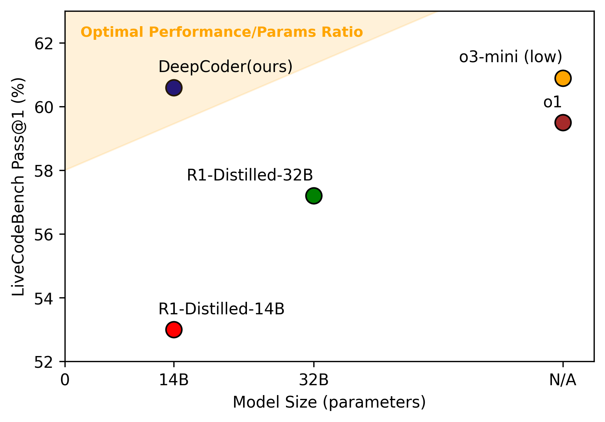
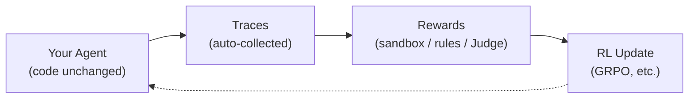
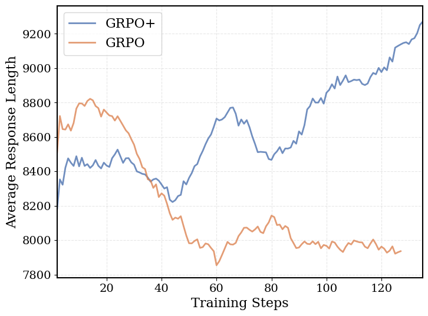

# 20.4 Hands-On: Training a DeepCoder Agent with rLLM

The previous sections covered the conceptual framework of Agentic RL—rollouts, credit assignment, tool use, and evaluation. Now it is time for hands-on work: **use an industrial-grade framework (rLLM) to run the full RL training pipeline for a code-generation agent—from what the data looks like, to how training runs, to how to judge whether the results are good or bad.**

Our experimental subject is **DeepCoder**—a code reasoning model from Berkeley Sky Lab. Its 14B version achieves 60.6% Pass@1 on LiveCodeBench, matching OpenAI o3-mini. What we will do is replicate its evaluation and training pipeline using the rLLM framework, and see how much the model improves after RL training and where the improvements come from.

### Experiment Goal: Before vs. After RL Training

We will use Qwen2.5-Coder-3B-Instruct as the base model, run GRPO RL training with the rLLM framework, and evaluate on the LiveCodeBench test set. Expected results:

| Phase      | Model                                  | LiveCodeBench Pass@1 | Notes                              |
| ---------- | -------------------------------------- | -------------------- | ---------------------------------- |
| **Before** | Qwen2.5-Coder-3B-Instruct (base)       | ~30%                 | Original model without RL training |
| **After**  | + DeepCoder RL (1 epoch, LoRA rank 32) | ~38-40%              | +8-10 percentage points after RL   |

With a larger model and longer training, the effect is more pronounced:

| Model                            | LiveCodeBench Pass@1     |
| -------------------------------- | ------------------------ |
| Qwen3-4B-Instruct (base)         | ~38%                     |
| + DeepCoder RL (1 epoch)         | ~46%                     |
| DeepCoder-14B-Preview (full run) | 60.6% (matching o3-mini) |

This hands-on lab focuses on the 3B model—a single 24GB GPU is sufficient, letting you personally verify that "RL training does make a code agent stronger."



<div style="text-align: center; font-size: 0.9em; color: var(--vp-c-text-2); margin-top: -10px; margin-bottom: 20px;">
  <em>Figure 1: DeepCoder score progression on LiveCodeBench. DeepCoder-14B-Preview (64K inference) achieves 60.6% Pass@1, matching o3-mini. Source: <a href="https://pretty-radio-b75.notion.site/DeepCoder-A-Fully-Open-Source-14B-Coder-at-O3-mini-Level-1cf81902c14680b3bee5eb349a512a51" target="_blank" rel="noopener noreferrer">Agentica Blog</a></em>
</div>

## rLLM Framework Overview

**rLLM** is a framework-agnostic Agentic RL training framework [^rllm]. Its core idea: **your agent code does not need to change. rLLM transparently intercepts LLM calls through a gateway, automatically collecting all information needed for training.**



rLLM has been validated on multiple tasks:

| Project        | Model Size | Result                                                            |
| -------------- | ---------- | ----------------------------------------------------------------- |
| **DeepCoder**  | 14B        | LiveCodeBench 60.6%, matching o3-mini [^deepcoder]                |
| **DeepScaleR** | 1.5B       | AIME 2024 43.1%, surpassing O1-Preview [^deepscaleR]              |
| **DeepSWE**    | 32B        | SWEBench-Verified 59%, open-source SOTA [^deepswe]                |
| **FinQA**      | 4B         | Financial analysis surpasses Qwen3-235B (59.7% vs 51.4%) [^finqa] |



<div style="text-align: center; font-size: 0.9em; color: var(--vp-c-text-2); margin-top: -10px; margin-bottom: 20px;">
  <em>Figure 2: DeepCoder RL training pipeline. The complete loop from data sampling, model generation, sandbox verification to GRPO policy update. Source: <a href="https://pretty-radio-b75.notion.site/DeepCoder-A-Fully-Open-Source-14B-Coder-at-O3-mini-Level-1cf81902c14680b3bee5eb349a512a51" target="_blank" rel="noopener noreferrer">Agentica Blog</a></em>
</div>

## Step Zero: Environment Setup

### Hardware Requirements

| Phase      | Minimum                         | Recommended           |
| ---------- | ------------------------------- | --------------------- |
| Evaluation | 1 GPU (vLLM inference endpoint) | RTX 4090 / A5000 24GB |
| Training   | 1 GPU (Tinker backend)          | A100 80GB or 2xA6000  |
| Data prep  | No GPU needed                   | Any machine           |

### Installation

```bash
# Install rllm (Python >= 3.11)
pip install rllm

# Clone the repo for cookbooks
git clone https://github.com/rllm-org/rllm.git
cd rllm

# Install the deepcoder cookbook
uv pip install --no-deps -e cookbooks/deepcoder

# Verify installation
rllm agent list  # Should show "deepcoder"
```

### Launch the Inference Endpoint

Both training and evaluation require an OpenAI-compatible inference endpoint:

```bash
# Use Qwen2.5-Coder-3B as base (24GB VRAM sufficient)
python -m vllm.entrypoints.openai.api_server \
  --model Qwen/Qwen2.5-Coder-3B-Instruct \
  --port 8000 \
  --tensor-parallel-size 1
```

Once the endpoint is running, `http://localhost:8000/v1` becomes the `--base-url` for rLLM. All subsequent `rllm eval` and `rllm train` commands will call the model through this endpoint.

---

## Step 1: Designing Rewards with rLLM

With the environment ready, before diving in, let us understand the rLLM reward interface. This is the foundation for all subsequent experiments—DeepCoder's sandbox verification and the travel agent's hybrid scoring both build on the same interface.

### `@rllm.evaluator`: One Function = One Scorer

rLLM's reward design follows a minimalist principle: **one Python function is a complete scorer.** Register it with the `@rllm.evaluator` decorator. It receives a task (the problem) and an episode (the agent's complete execution record), and returns an `EvalOutput`:

```python
import rllm
from rllm.eval.types import EvalOutput, Signal
from rllm.types import Episode, Task

@rllm.evaluator
def my_evaluator(task: Task, episode: Episode) -> EvalOutput:
    # episode.artifacts holds the agent's output
    answer = episode.artifacts.get("answer", "")

    # Your scoring logic
    reward = ...  # float between 0.0 and 1.0

    return EvalOutput(
        reward=reward,                  # Total score (0.0 ~ 1.0)
        is_correct=reward >= 0.7,       # Whether "passed" (you set the threshold)
        signals=[                       # Fine-grained signals (optional but strongly recommended)
            Signal(name="accuracy", value=...),
            Signal(name="format", value=...),
        ],
        metadata={...},                 # Additional info (e.g., per-test-case results)
    )
```

**What are the inputs?**

| Parameter | Type      | Contents                                                                                                         |
| --------- | --------- | ---------------------------------------------------------------------------------------------------------------- |
| `task`    | `Task`    | Problem info: `task.instruction` (user prompt), `task.metadata` (ground truth, etc.)                             |
| `episode` | `Episode` | Agent's complete execution record: `episode.artifacts` (final output), `episode.trajectories` (per-step details) |

**What is the output?**

| Field        | Type           | Meaning                                                                                                                              |
| ------------ | -------------- | ------------------------------------------------------------------------------------------------------------------------------------ |
| `reward`     | `float`        | Total score, 0.0~1.0. RL training directly optimizes this value                                                                      |
| `is_correct` | `bool`         | Whether passed. Used to compute Pass@1                                                                                               |
| `signals`    | `list[Signal]` | Per-dimension scores. **This is key for diagnosing model quality**—looking at reward alone cannot distinguish "where it falls short" |
| `metadata`   | `dict`         | Additional details. Can store per-test-case pass/fail, judge comments, etc.                                                          |

### Three Reward Design Paradigms

Depending on how verifiable the task is, reward design ranges from simple to complex in three tiers:

#### Paradigm 1: Sandbox / RLVR (Fully Verifiable)

**Best for**: Code generation, math reasoning—tasks with a unique correct answer.

```python
@rllm.evaluator
def sandbox_evaluator(task, episode):
    answer = episode.artifacts.get("answer", "")
    code = extract_last_python_block(answer)

    # Run code in sandbox, compare against hidden tests
    results = run_tests(code, task.metadata["ground_truth"])

    all_passed = all(r["passed"] for r in results)
    return EvalOutput(
        reward=1.0 if all_passed else 0.0,  # Only 0 and 1
        is_correct=all_passed,
        signals=[Signal(name="accuracy", value=sum(r["passed"] for r in results) / len(results))],
        metadata={"test_results": results},
    )
```

Characteristics: zero noise, zero cost, no external API needed. This is what DeepCoder uses.

#### Paradigm 2: Rule Matching (Partially Verifiable)

**Best for**: Tasks with clear format requirements and key fields that can be automatically checked.

```python
@rllm.evaluator
def rule_evaluator(task, episode):
    answer = episode.artifacts.get("answer", "")
    meta = task.metadata or {}

    checks = {
        "format":      bool(re.search(r'<result>.*?</result>', answer, re.DOTALL)),
        "keyword_hit": meta.get("keyword", "") in answer,
        "length_ok":   50 <= len(answer) <= 2000,
    }

    # Each check has equal weight
    reward = sum(checks.values()) / len(checks)

    return EvalOutput(
        reward=reward,
        is_correct=all(checks.values()),
        signals=[Signal(name=k, value=float(v)) for k, v in checks.items()],
    )
```

Characteristics: multiple checks, can yield intermediate scores, still no external API needed. The hard constraint portion of the travel agent uses this.

#### Paradigm 3: LLM as Judge (Subjective Quality Assessment)

**Best for**: Text quality, creativity, user experience—dimensions that cannot be automatically judged by rules.

```python
@rllm.evaluator
def llm_judge_evaluator(task, episode):
    answer = episode.artifacts.get("answer", "")
    from openai import OpenAI
    client = OpenAI()

    judge_prompt = f"""Rate the quality of the following answer (1-5):
Question: {task.instruction}
Answer: {answer}
Scoring criteria: 1=unusable, 3=usable but room for improvement, 5=exceeds expectations
Output only a single number."""

    resp = client.chat.completions.create(
        model="gpt-4o-mini",
        messages=[{"role": "user", "content": judge_prompt}],
        max_tokens=10,
    )
    score = int(re.search(r'(\d)', resp.choices[0].message.content).group(1))
    reward = score / 5.0

    return EvalOutput(
        reward=reward,
        is_correct=score >= 4,
        signals=[Signal(name="judge_score", value=score)],
    )
```

Characteristics: flexible but has API cost (~$0.01-0.05 per call), scoring has some noise.

#### Hybrid Paradigm: Hard Rules + LLM Judge

The most common approach in practice is combining Paradigm 2 and Paradigm 3—use rules for what can be automatically checked, and use a judge for what requires semantic understanding. The travel agent's reward uses this pattern:

```python
# Hard rules (0.8 points): format, destination, budget, attractions
hard_reward = rule_based_check(answer, task.metadata)

# LLM Judge (0.2 points): itinerary quality, logical coherence, user experience
llm_reward = llm_as_judge(answer, task.instruction)

total_reward = hard_reward + llm_reward  # Maximum 1.0
```

Composition principle: **use rules for dimensions with stronger objectivity, use judges for dimensions with stronger subjectivity.** The higher the proportion of rule-based scoring, the more stable the training signal; the higher the proportion of judge-based scoring, the better the optimization of "soft quality."

### Common Pitfalls in Reward Design

| Pitfall                | Symptom                                                                                     | Solution                                                                              |
| ---------------------- | ------------------------------------------------------------------------------------------- | ------------------------------------------------------------------------------------- |
| **Reward too sparse**  | Only 0/1, mostly 0; model learns nothing                                                    | Add intermediate rewards (e.g., +0.2 for correct format), or increase GRPO group_size |
| **Reward hacking**     | Model exploits loopholes (e.g., keyword stuffing for high score without true understanding) | Cross-validate across dimensions, periodically check with an independent eval set     |
| **Unstable judge**     | Same answer gets different scores across two judge calls                                    | Fix temperature=0, use deterministic scoring rubric, take mean over multiple samples  |
| **Dimension conflict** | Format reward and content reward conflict—model focuses on format at the expense of content | Hard constraints as prerequisites (wrong format = 0), quality score as bonus          |

### The Importance of Signals

`signals` are not optional extras—**they are your core tool for diagnosing training problems.** If you only look at `reward`, you see the score going up but do not know why; with `signals`, you can see which dimension is improving and which is stuck.

```text
# Only reward -- low information
Epoch 1 | reward_mean: 0.45

# With signals -- can pinpoint problems
Epoch 1 | reward_mean: 0.45 | format: 0.92 | accuracy: 0.28 | budget_ok: 0.15
                              ^^^^^^^^^^^^     ^^^^^^^^^^^^^^    ^^^^^^^^^^^^^^^
                              Format learned    Accuracy lacking  Budget control weakest
```

Now you know the next step: increase the weight of budget_ok in the reward, or add more budget-control training data.

## Step 2: What Does the Data Look Like?

### Data Sources

DeepCoder's training data comes from four competitive programming platforms, all automatically downloaded via HuggingFace:

| Data Source          | Train/Test   | Characteristics                                                            |
| -------------------- | ------------ | -------------------------------------------------------------------------- |
| **LiveCodeBench v5** | Train + Test | Continuously updated code eval benchmark; no data leakage                  |
| **TACO**             | Train        | University of Waterloo competitive programming problems, difficulty-graded |
| **PrimeIntellect**   | Train        | Synthetic programming problems covering diverse algorithmic patterns       |
| **Codeforces**       | Test         | Real competitive programming problems, higher difficulty                   |

### Download Data

```bash
# Quick version -- 200 train + 50 test problems, for verifying the pipeline
python cookbooks/deepcoder/prepare_deepcoder_data.py \
  --train-size 200 --test-size 50

# Full version -- all data
python cookbooks/deepcoder/prepare_deepcoder_data.py
```

The script automatically downloads `agentica-org/DeepCoder-Preview-Dataset` from HuggingFace, unpacks it, and registers it with rLLM's `DatasetRegistry`.

### What Does One Data Record Look Like?

Each record is a JSON object. Below is a real example from LiveCodeBench (abridged):

```python
{
    # Problem description: what the model sees
    "question": """
You are given an array of integers `nums` and an integer `k`.
Return the maximum sum of a subarray of length exactly `k`.

Example 1:
  Input: nums = [1,4,2,10,23,3,1,0,20], k = 4
  Output: 39
  Explanation: The subarray [4,2,10,23] has the maximum sum.

Constraints:
  1 <= k <= nums.length <= 10^5
""",
    # Hidden test cases: the model does not see these; the evaluator uses them for scoring
    "ground_truth": "["
        '{"input": "1 4 2 10 23 3 1 0 20\\n4", "output": "39", "testtype": "stdin_stdout"},'
        '{"input": "100 200 300\\n3", "output": "600", "testtype": "stdin_stdout"},'
        '{"input": "-1 -2 -3 -4\\n2", "output": "-3", "testtype": "stdin_stdout"}'
    "]",

    "data_source": "livecodebench",  # Source tag
    "starter_code": "",              # Optional template code
    "uid": "lcb_v5_00142",          # Unique ID
}
```

Key points:

- **`question`** is the full problem description the model receives in the prompt
- **`ground_truth`** is a set of hidden input-output test pairs that **the model does not see**
- **`testtype`** has two forms:
  - `stdin_stdout`: code reads from stdin, writes to stdout
  - `functional`: code implements a function; the test framework calls it

Here is another example in Codeforces style:

```python
{
    "question": """
Alice and Bob are playing a game. There are n piles of stones.
On each turn, a player removes 1 or 2 stones from any pile.
The player who cannot make a move loses.
Given n and the sizes of each pile, determine who wins if both play optimally.

Input: The first line contains n. The second line contains n integers.
Output: "Alice" or "Bob"
""",
    "ground_truth": "["
        '{"input": "3\\n1 2 3", "output": "Alice", "testtype": "stdin_stdout"},'
        '{"input": "2\\n4 4", "output": "Bob", "testtype": "stdin_stdout"}'
    "]",
    "data_source": "codeforces",
}
```

::: details Test Case Format Details

`ground_truth` is a JSON-encoded list. Each element is a test case:

| Field      | Meaning                                                       |
| ---------- | ------------------------------------------------------------- |
| `input`    | Input to the program (stdin or function arguments)            |
| `output`   | Expected output (stdout or return value)                      |
| `testtype` | `stdin_stdout` (standard I/O) or `functional` (function call) |

For `stdin_stdout` type, the evaluator executes: `echo "input" | python solution.py`, then checks whether stdout matches `output`.

For `functional` type, the evaluator imports your function, calls it with `input` as arguments, and checks whether the return value matches `output`.
:::

## Step 3: What Does Model Output Look Like? How Does the Evaluator Score It?

### Model Output Format

After receiving the problem, the model outputs its reasoning process + Python code in a single assistant response. For example:

````text
This problem asks to find the maximum subarray sum of length k.

Approach: sliding window. Maintain a window of size k, track the current sum,
add the new element and subtract the departing element on each right shift, update the maximum.

Time complexity O(n), space complexity O(1).

```python
import sys

def solve():
    data = sys.stdin.read().split()
    nums = list(map(int, data[:-1]))
    k = int(data[-1])

    current_sum = sum(nums[:k])
    max_sum = current_sum

    for i in range(k, len(nums)):
        current_sum += nums[i] - nums[i - k]
        max_sum = max(max_sum, current_sum)

    print(max_sum)

solve()
```
````

### Evaluator Scoring Flow

The evaluator does three things:

```text
1. Extract the last `python` code block
2. Execute the code in a sandbox, using each hidden test case as input
3. Compare actual output with expected output -- all match => reward=1.0, otherwise reward=0.0
```

Core code (abridged; full version at [cookbooks/deepcoder/deepcoder_eval.py](https://github.com/rllm-org/rllm/blob/main/cookbooks/deepcoder/deepcoder_eval.py)):

````python
@rllm.evaluator
def deepcoder_evaluator(task, episode):
    from rllm.rewards.code_reward import RewardCodeFn, RewardConfig

    # 1. Extract the model's full output from episode artifacts
    answer = str(episode.artifacts.get("answer", ""))

    # 2. RewardCodeFn automatically extracts the last ```python``` block
    #    then runs each ground_truth test case
    grader = RewardCodeFn(RewardConfig())
    result = grader(task_info=task_info(task), action=answer)

    # 3. Return evaluation results
    is_correct = bool(result.is_correct)
    return EvalOutput(
        reward=float(result.reward),       # 1.0 (all pass) or 0.0 (any fail)
        is_correct=is_correct,             # True / False
        signals=[Signal(name="accuracy", value=1.0 if is_correct else 0.0)],
        metadata=result.metadata,          # Detailed per-test-case results
    )
````

### Scoring Example: A Concrete Case

Suppose the model outputs code for the sliding window problem above. The evaluator's internal execution process:

```text
Test case 1: input="1 4 2 10 23 3 1 0 20\n4"
            Expected output: "39"
            Actual output:   "39"  PASS

Test case 2: input="100 200 300\n3"
            Expected output: "600"
            Actual output:   "600"  PASS

Test case 3: input="-1 -2 -3 -4\n2"
            Expected output: "-3"
            Actual output:   "-3"  PASS

All passed -> reward = 1.0, is_correct = True
```

If the model output has a bug, e.g., forgot to handle negative numbers:

```text
Test case 1: PASS
Test case 2: PASS
Test case 3: Expected "-3", got "-1"  FAIL

Test failure -> reward = 0.0, is_correct = False
```

The reward only takes values 0 and 1—no intermediate states. This is the **RLVR (Reinforcement Learning with Verifiable Rewards)** discussed in Chapter 9: code is either correct or incorrect; no Reward Model guesswork needed.

## Step 4: Run Baseline Evaluation—How Strong Is the Model Before Training?

Before training, first check the base model's raw performance:

```bash
rllm eval deepcoder \
  --agent deepcoder \
  --evaluator deepcoder \
  --model Qwen/Qwen2.5-Coder-3B-Instruct \
  --base-url http://localhost:8000/v1 \
  --split test \
  --max-examples 20
```

Parameter meanings:

| Parameter               | Meaning                                                    |
| ----------------------- | ---------------------------------------------------------- |
| `--agent deepcoder`     | Use deepcoder's AgentFlow (registered via `@rllm.rollout`) |
| `--evaluator deepcoder` | Use deepcoder's evaluator (sandbox scoring)                |
| `--model`               | Model name (passed to the vLLM inference endpoint)         |
| `--base-url`            | Inference endpoint address                                 |
| `--split test`          | Evaluate on the test set (no overlap with training set)    |
| `--max-examples 20`     | Run 20 problems first to quickly verify the pipeline       |

### How to Read Evaluation Results

After evaluation completes, results are stored in `~/.rllm/eval_results/`:

```bash
# View evaluation summary
ls ~/.rllm/eval_results/
# Output similar to: deepcoder_20260512_143022/

# Use rllm view to inspect
rllm view

# Or directly read JSON
cat ~/.rllm/eval_results/latest/*.json | python -m json.tool
```

Each episode's JSON contains the full scoring details:

```json
{
  "task_id": "lcb_v5_00142",
  "reward": 1.0,
  "is_correct": true,
  "signals": [{ "name": "accuracy", "value": 1.0 }],
  "metadata": {
    "test_results": [
      {
        "input": "1 4 2 10 23 3 1 0 20\n4",
        "expected": "39",
        "actual": "39",
        "passed": true
      },
      {
        "input": "100 200 300\n3",
        "expected": "600",
        "actual": "600",
        "passed": true
      },
      {
        "input": "-1 -2 -3 -4\n2",
        "expected": "-3",
        "actual": "-3",
        "passed": true
      }
    ],
    "num_passed": 3,
    "num_total": 3
  }
}
```

A failed episode looks like this:

```json
{
  "task_id": "lcb_v5_00089",
  "reward": 0.0,
  "is_correct": false,
  "metadata": {
    "test_results": [
      {
        "input": "5\n1 2 3 4 5",
        "expected": "YES",
        "actual": "YES",
        "passed": true
      },
      {
        "input": "3\n1 1 1",
        "expected": "NO",
        "actual": "YES",
        "passed": false
      }
    ],
    "num_passed": 1,
    "num_total": 2,
    "error": "Test case 2 failed: expected 'NO', got 'YES'"
  }
}
```

**How to judge results**: look at the mean of `reward` across all episodes—the sum of all episode `reward` values divided by the total count equals **Pass@1** (one-shot pass rate).

```bash
# Quick Pass@1 calculation
python -c "
import json, glob
files = glob.glob('$HOME/.rllm/eval_results/latest/*.json')
results = [json.load(open(f)) for f in files]
pass1 = sum(r['reward'] for r in results) / len(results)
print(f'Pass@1: {pass1:.1%} ({sum(r["is_correct"] for r in results)}/{len(results)})')
"
```

Typical output:

```text
Pass@1: 30.0% (6/20)
```

This means the base model solved 6 out of 20 problems. This is the pre-training baseline.

## Step 5: Understanding the DeepCoder AgentFlow

Before starting training, understand how rLLM turns model calls into trainable data structures.

DeepCoder is a **single-turn** agent—one LLM call produces the answer. Its core code is about 50 lines (abridged; full version at [cookbooks/deepcoder/deepcoder_flow.py](https://github.com/rllm-org/rllm/blob/main/cookbooks/deepcoder/deepcoder_flow.py)):

````python
import rllm
from rllm.types import AgentConfig, Episode, Step, Task, Trajectory
from openai import AsyncOpenAI

SYSTEM_PROMPT = """\
You are a competitive programmer. Reason step by step, then put your
final solution in a single fenced code block:

```python
# your solution here
```
"""

@rllm.rollout(name="deepcoder")
async def deepcoder_flow(task: Task, config: AgentConfig) -> Episode:
    """One-shot coding flow: LLM emits a single response, evaluator grades."""
    question = str((task.metadata or {}).get("question", ""))
    client = AsyncOpenAI(base_url=config.base_url, api_key="EMPTY")

    messages = [
        {"role": "system", "content": SYSTEM_PROMPT},
        {"role": "user", "content": question},
    ]

    # Single LLM call
    resp = await client.chat.completions.create(
        model=config.model, messages=messages,
        temperature=0.6, max_tokens=16384,
    )
    content = resp.choices[0].message.content or ""

    # Wrap as rLLM Episode
    return Episode(
        trajectories=[Trajectory(name="deepcoder", steps=[
            Step(chat_completions=messages + [{"role": "assistant", "content": content}]),
        ])],
        artifacts={"answer": content},
    )
````

Key design points:

1. **`@rllm.rollout` decorator**: turns the async function into an rLLM AgentFlow. The gateway automatically intercepts `AsyncOpenAI` calls, recording token IDs and logprobs.

2. **`config.base_url`**: during eval it points to your inference endpoint; during training, rLLM automatically switches to its own gateway. **The same code works for both eval and training.**

3. **`artifacts["answer"]`**: the evaluator extracts code from here, taking only the last ` ```python ``` ` block.

## Step 6: GRPO RL Training

### Start Training with One Command

```bash
rllm train deepcoder \
  --agent deepcoder \
  --evaluator deepcoder \
  --model Qwen/Qwen2.5-Coder-3B-Instruct \
  --group-size 4 \
  --batch-size 16 \
  --lora-rank 32 \
  --epochs 1 \
  --val-freq 20
```

### Hyperparameter Guide

| Parameter      | Value | Meaning                                  | How to Tune                                           |
| -------------- | ----- | ---------------------------------------- | ----------------------------------------------------- |
| `--group-size` | 4     | GRPO samples 4 solutions per problem     | Larger = more accurate advantage estimate, but slower |
| `--batch-size` | 16    | 16 problems per batch                    | Limited by VRAM                                       |
| `--lora-rank`  | 32    | LoRA rank -- only train low-rank adapter | 16-64 all work; larger = finer training but more VRAM |
| `--epochs`     | 1     | One pass through training set            | Small datasets can go to 2-3                          |
| `--val-freq`   | 20    | Validate every 20 steps                  | Smaller = more granular monitoring but slower         |

### What Happens During Training?

GRPO's training loop (corresponds to the algorithm in Chapter 9):

```text
For each problem:
  1. Sample 4 solutions (group_size=4)
     - Same problem, model generates code 4 times (temperature > 0)
     - Each may produce a different algorithm/implementation

  2. Score each solution
     - Sandbox runs tests: all pass = 1.0, otherwise = 0.0
     - E.g., rewards for these 4 solutions: [0, 1, 0, 1]

  3. Compute in-group advantage (GRPO core)
     - Group mean = 0.5, std = 0.5
     - advantage = (reward - mean) / std
     - Result: [-1, +1, -1, +1]
     - Meaning: correct solutions are reinforced, incorrect ones suppressed

  4. Policy gradient update
     - For solutions with advantage > 0: increase probability of generating similar code
     - For solutions with advantage < 0: decrease probability of generating similar code
     - Updated via LoRA, modifying only a small number of parameters
```


<div style="text-align: center; font-size: 0.9em; color: var(--vp-c-text-2); margin-top: -10px; margin-bottom: 20px;">
  <em>Figure 3: Training reward curves comparing GRPO+ and standard GRPO. GRPO+ achieves higher average reward with the same amount of data through improved within-group advantage estimation. Source: <a href="https://pretty-radio-b75.notion.site/DeepCoder-A-Fully-Open-Source-14B-Coder-at-O3-mini-Level-1cf81902c14680b3bee5eb349a512a51" target="_blank" rel="noopener noreferrer">Agentica Blog</a></em>
</div>


<div style="text-align: center; font-size: 0.9em; color: var(--vp-c-text-2); margin-top: -10px; margin-bottom: 20px;">
  <em>Figure 4: LiveCodeBench Pass@1 score vs. training steps. From 16K to 32K context length extension, problem-solving ability continues to improve. Source: <a href="https://pretty-radio-b75.notion.site/DeepCoder-A-Fully-Open-Source-14B-Coder-at-O3-mini-Level-1cf81902c14680b3bee5eb349a512a51" target="_blank" rel="noopener noreferrer">Agentica Blog</a></em>
</div>

### How to Read Training Logs

During training, rLLM outputs real-time logs:

```text
Epoch 1 | Step  5 | loss: 0.352 | reward_mean: 0.25 | val_reward: 0.30
Epoch 1 | Step 10 | loss: 0.328 | reward_mean: 0.33 | val_reward: 0.35
Epoch 1 | Step 15 | loss: 0.298 | reward_mean: 0.38 | val_reward: 0.40
Epoch 1 | Step 20 | loss: 0.275 | reward_mean: 0.42 | val_reward: 0.43
...
```

| Metric        | Meaning                       | Normal Trend                                                  |
| ------------- | ----------------------------- | ------------------------------------------------------------- |
| `loss`        | GRPO policy gradient loss     | Gradually decreasing                                          |
| `reward_mean` | Mean reward on training set   | Gradually increasing                                          |
| `val_reward`  | Mean reward on validation set | Also increasing; if it diverges from reward_mean, overfitting |

If `reward_mean` stays at 0—the model has not solved any problem correctly yet. You may need to reduce problem difficulty or increase `group_size`.

You can also use the rLLM UI for visualization:

```bash
rllm ui  # Launch local Web UI to view training curves and episode details
```

### Training Backend Options

| Backend    | Use Case                 | Notes                                                      |
| ---------- | ------------------------ | ---------------------------------------------------------- |
| **Tinker** | Single-machine (1-2 GPU) | Default backend; recommended for getting started           |
| **Verl**   | Distributed (multi-GPU)  | `uv pip install -e ".[verl]"`, launch with `train_verl.sh` |

## Step 7: Post-Training Evaluation—Did It Really Improve?

### Run Post-Training Evaluation

Run the exact same command as the baseline:

```bash
rllm eval deepcoder \
  --agent deepcoder \
  --evaluator deepcoder \
  --model Qwen/Qwen2.5-Coder-3B-Instruct \
  --base-url http://localhost:8000/v1 \
  --split test \
  --max-examples 50
```

### Before / After Comparison

```text
Before RL Training (base model)
  Pass@1 (n=20): 30.0%    # 6 out of 20 problems correct

After RL Training (1 epoch, LoRA rank 32)
  Pass@1 (n=50): 39.0%    # ~20 out of 50 problems correct, +9 percentage points
```

### How to Judge Whether Results Are Trustworthy?

Seeing Pass@1 go up is not enough. You need to check three things:

**1. Is the validation set independent?**

Training data and test data must not overlap. DeepCoder's dataset design already guarantees this—training uses TACO/PrimeIntellect/LiveCodeBench training set, testing uses Codeforces/LiveCodeBench test set. If you split data yourself, ensure `--split test` never participated in training.

**2. Is there reward hacking?**

If Pass@1 went up but the model's code logic did not actually improve, the model may have found a loophole in the reward. How to check:

```bash
# Sample a few problems, manually inspect whether the model's generated code is reasonable
rllm view  # View each episode's input, output, and test results
```

For DeepCoder's sandbox reward, reward hacking risk is low—code either passes hidden tests or it does not; there is no room for "gaming the system." This is much safer than scenarios using a Reward Model for scoring.

**3. Is the improvement stable?**

```bash
# Run multiple times, check variance
rllm eval deepcoder --split test --max-examples 50  # Run 1
rllm eval deepcoder --split test --max-examples 50  # Run 2
rllm eval deepcoder --split test --max-examples 50  # Run 3
```

If all three results fall in the 37%-41% range, the improvement is stable. If one run is 40% and another 25%, the training is unstable or the eval sample is too small.

### What Did the Model Actually Learn?

Look at episode comparisons in `rllm view`. After RL, the model's changes are mainly:

1. **Better edge case handling**: empty inputs, large data volumes, special characters no longer cause crashes
2. **More thorough reasoning**: the model tends to analyze the problem before writing code, producing longer reasoning chains
3. **Fewer "almost correct" solutions**: GRPO's within-group comparison teaches the model to avoid traps

These behaviors are not taught by SFT—the model autonomously discovered more effective problem-solving strategies during RL training.

## Key Design: Why Is the Reward So Simple?

DeepCoder's reward only has two values: 1.0 and 0.0. Is this really sufficient?

**For code tasks, binary reward is not only sufficient—it may be the optimal choice.**

1. **Noise-free signal**: `assert fib(10) == 55` either passes or fails; no ambiguity. Unlike text quality assessment (subjective, multi-dimensional).

2. **GRPO solves sparse rewards**: a single trajectory with only 0/1 does have low information content. But GRPO generates 4 solutions for the same problem at once; as long as at least one in the group is correct, a valid advantage signal can be produced.

3. **No Reward Model needed**: training an RM is itself a complex ML task—requiring preference data, needing to prevent reward hacking. Sandbox verification is free, instant, and always correct.

::: details Comparison with FinQA's Judge LLM Reward

Also an rLLM cookbook, FinQA (financial analysis agent) uses a completely different reward:

| Dimension           | DeepCoder                     | FinQA                                                 |
| ------------------- | ----------------------------- | ----------------------------------------------------- |
| Reward source       | Sandbox code execution        | Judge LLM (gpt-5-nano)                                |
| Reward value        | 0.0 / 1.0                     | Continuous score + table-access bonus                 |
| External dependency | None                          | Requires OpenAI API                                   |
| Cost                | Zero                          | ~$0.01-0.05 per evaluation                            |
| Use case            | Code, math (verifiable tasks) | Finance, research (tasks needing subjective judgment) |

Code tasks need only the simplest RLVR; tasks requiring semantic understanding need more complex reward design (see Section 22.1's discussion of ORM vs PRM).
:::

## What to Explore from DeepCoder

### Swap the Base Model

Changing models requires only one parameter:

```bash
# Larger model
rllm train deepcoder --model Qwen/Qwen3-8B

# Specialized code model
rllm train deepcoder --model deepseek-ai/DeepSeek-Coder-V2-Lite-Instruct
```

### Swap the Benchmark

rLLM supports multiple benchmarks:

```bash
rllm eval gsm8k    # Math reasoning
rllm eval math     # Math competitions
rllm eval finqa    # Financial analysis (multi-tool agent)
```

### FinQA: Multi-Tool Search Agent

If the code experiment sparked your interest in rLLM, try the FinQA cookbook. It is a multi-turn ReAct agent equipped with 4 tools (SQL queries, calculator, table lookup, etc.) that surpasses the 235B Qwen3 on financial analysis tasks using a 4B model [^finqa]:

```bash
uv pip install --no-deps -e cookbooks/finqa
python cookbooks/finqa/prepare_finqa_data.py
rllm eval finqa --model rLLM/rLLM-FinQA-4B --base-url http://localhost:8000/v1
```

### Hands-On: Custom Travel Itinerary Agent

DeepCoder is single-turn code generation. If you want to train a more complex agent—say, a travel assistant that can search for information, compare prices, and plan routes—rLLM supports that too. This example demonstrates reward design for **non-code tasks**: combining hard rule verification with LLM as Judge.

#### AgentFlow: Multi-Turn Search + Itinerary Planning

```python
import rllm, json
from rllm.types import AgentConfig, Episode, Step, Task, Trajectory
from openai import AsyncOpenAI

# Simulated travel information database (in practice, could be a search API)
TRAVEL_DB = {
    "Tokyo": {"hotels": {"economy": 500, "comfort": 1200, "luxury": 3000}, "attractions": ["Senso-ji", "Shibuya", "Akihabara"]},
    "Paris": {"hotels": {"economy": 600, "comfort": 1500, "luxury": 4000}, "attractions": ["Eiffel Tower", "Louvre", "Arc de Triomphe"]},
    "New York": {"hotels": {"economy": 800, "comfort": 1800, "luxury": 5000}, "attractions": ["Statue of Liberty", "Times Square", "Central Park"]},
}

SYSTEM_PROMPT = """\
You are a travel itinerary planning assistant. The user will give you a travel request. You need to:

1. Use <search>destination</search> to look up hotel and attraction information
2. Plan an itinerary based on budget and preferences
3. Output the final result in this format:

<itinerary>
Destination: xxx
Days: x
Budget: xxx yuan
Daily schedule:
  Day 1: ...
  Day 2: ...
Hotel recommendation: xxx (xxx yuan/night)
Total cost: xxx yuan
</itinerary>
"""

@rllm.rollout(name="travel_agent")
async def travel_agent_flow(task: Task, config: AgentConfig) -> Episode:
    client = AsyncOpenAI(base_url=config.base_url, api_key="EMPTY")

    messages = [
        {"role": "system", "content": SYSTEM_PROMPT},
        {"role": "user", "content": task.instruction},  # e.g., "Plan a 3-day Tokyo trip, budget 5000 yuan"
    ]

    all_steps = []
    import re

    for turn in range(3):  # Maximum 3 interaction rounds
        resp = await client.chat.completions.create(
            model=config.model, messages=messages,
            temperature=0.7, max_tokens=2048,
        )
        content = resp.choices[0].message.content or ""
        messages.append({"role": "assistant", "content": content})
        all_steps.append(Step(model_response=content))

        # Check if <search> was called
        search_match = re.search(r'<search>(.*?)</search>', content)
        if search_match:
            query = search_match.group(1).strip()
            # Simulate search results
            result = TRAVEL_DB.get(query, "No relevant information found, please try another destination")
            obs = f"\n<search_result>\n{json.dumps(result, ensure_ascii=False, indent=2)}\n</search_result>\n"
            messages.append({"role": "user", "content": obs})
            all_steps.append(Step(model_response=obs))
        else:
            break  # No search request means the model output the final itinerary

    # Extract itinerary from the last message
    final_content = messages[-1]["content"] if messages[-1]["role"] == "assistant" else ""

    return Episode(
        trajectories=[Trajectory(name="travel_agent", steps=all_steps)],
        artifacts={"answer": final_content},
    )
```

#### Data Format

Each task is a travel request + expected information:

```python
{
    "instruction": "Plan a 3-day Tokyo trip, budget 5000 yuan, prefer cultural attractions",
    "metadata": {
        "destination": "Tokyo",
        "days": 3,
        "budget": 5000,
        "preferences": ["cultural"],
        "expected_attractions": ["Senso-ji"],  # Attractions expected to be included
    }
}
```

#### Reward Design: Hard Rules + LLM as Judge

This is the key point. Travel itineraries cannot be automatically scored in a sandbox like code—whether an itinerary is "good" has a subjective component. Therefore the reward is split into two layers:

```python
import rllm
from rllm.eval.types import EvalOutput, Signal
from rllm.types import Episode, Task
import re
from openai import OpenAI

@rllm.evaluator
def travel_evaluator(task, episode):
    answer = str(episode.artifacts.get("answer", ""))
    meta = task.metadata if hasattr(task, 'metadata') else task
    meta = meta or {}

    # ===== Layer 1: Hard rules (auto-verified) =====
    hard_reward = 0.0

    # 1. Format check: does it contain <itinerary> structure
    has_itinerary = bool(re.search(r'<itinerary>.*?</itinerary>', answer, re.DOTALL))
    hard_reward += 0.2 if has_itinerary else 0.0

    # 2. Correct destination
    dest = meta.get("destination", "")
    has_dest = dest in answer if dest else True
    hard_reward += 0.1 if has_dest else 0.0

    # 3. Day count matches
    expected_days = meta.get("days", 0)
    day_matches = re.findall(r'Day (\d+)', answer)
    has_days = len(day_matches) >= expected_days if expected_days else True
    hard_reward += 0.1 if has_days else 0.0

    # 4. Budget reasonable (total cost <= budget * 1.1, allowing 10% flexibility)
    budget = meta.get("budget", 0)
    cost_match = re.search(r'Total cost[:：]\s*(\d+)', answer)
    if cost_match and budget:
        cost = int(cost_match.group(1))
        hard_reward += 0.2 if cost <= budget * 1.1 else 0.0
    elif budget == 0:
        hard_reward += 0.2  # No budget requirement, give full points

    # 5. Includes expected attractions
    expected = meta.get("expected_attractions", [])
    if expected:
        hits = sum(1 for a in expected if a in answer)
        hard_reward += 0.2 * (hits / len(expected))
    else:
        hard_reward += 0.2

    # ===== Layer 2: LLM as Judge (semantic quality) =====
    llm_reward = 0.0

    if has_itinerary:  # Only call judge if format is correct, to save API cost
        client = OpenAI()  # Use default API key
        judge_prompt = f"""Rate the quality of this travel itinerary (1-5):

User request: {meta.get('instruction', '')}
Itinerary:
{answer}

Scoring criteria:
1: Completely unusable
2: Obvious omissions
3: Basically usable but room for improvement
4: Well-arranged, comprehensive information
5: Exceeds expectations, attention to detail

Output only a single number (1-5)."""

        try:
            resp = client.chat.completions.create(
                model="gpt-4o-mini",
                messages=[{"role": "user", "content": judge_prompt}],
                max_tokens=10,
            )
            score_text = resp.choices[0].message.content.strip()
            llm_score = int(re.search(r'(\d)', score_text).group(1))
            llm_reward = llm_score / 5.0 * 0.2  # Maximum 0.2
        except Exception:
            llm_reward = 0.0  # Judge call failure does not affect hard score

    # ===== Combined reward =====
    total_reward = hard_reward + llm_reward  # Maximum 1.0

    return EvalOutput(
        reward=total_reward,
        is_correct=total_reward >= 0.7,
        signals=[
            Signal(name="hard_reward", value=hard_reward),     # Hard rule score
            Signal(name="llm_reward", value=llm_reward),       # LLM judge score
            Signal(name="format", value=1.0 if has_itinerary else 0.0),
            Signal(name="budget_ok", value=1.0 if cost_match and int(cost_match.group(1)) <= budget * 1.1 else 0.0),
        ],
    )
```

#### Reward Composition Summary

| Layer     | Dimension                      | Points  | Method             |
| --------- | ------------------------------ | ------- | ------------------ |
| Hard      | Correct format (`<itinerary>`) | 0.2     | Regex matching     |
| Hard      | Correct destination            | 0.1     | String matching    |
| Hard      | Day count matches              | 0.1     | Regex matching     |
| Hard      | Budget reasonable              | 0.2     | Numeric comparison |
| Hard      | Includes expected attractions  | 0.2     | Keyword matching   |
| LLM Judge | Itinerary quality              | 0.2     | GPT-4o-mini score  |
| **Total** |                                | **1.0** |                    |

#### How to Read Results?

After evaluation completes, the `signals` field tells you the score for each dimension:

```json
{
  "task_id": "travel_001",
  "reward": 0.88,
  "is_correct": true,
  "signals": [
    { "name": "hard_reward", "value": 0.8 },
    { "name": "llm_reward", "value": 0.08 },
    { "name": "format", "value": 1.0 },
    { "name": "budget_ok", "value": 1.0 }
  ]
}
```

- `hard_reward = 0.8` means 4 out of 5 hard checks passed
- `llm_reward = 0.08` means the LLM judge gave 2/5 (2/5 \* 0.2 = 0.08)
- Overall: format and budget are fine, but itinerary quality still has room for improvement

If `format = 0.0`, the model did not even output the `<itinerary>` structure—format is not yet learned; in this case, adding SFT warmup is more effective than RL.

This reward design approach can be generalized to any "partially verifiable + partially subjective" task:

- **Auto-verifiable parts use hard rules** (format, numbers, keywords)—zero cost, no noise
- **Semantically-understood parts use LLM as Judge**—has cost but more flexible
- **Weight between the two is task-dependent**—the more objective the task, the higher the hard-rule proportion

#### How to Judge Trajectory Quality?

Whether a trajectory is good or bad cannot be determined by `reward` alone. rLLM records complete hierarchical trajectory data; you need to examine it layer by layer:

**rLLM Trajectory Hierarchy (coarse to fine):**

```text
Episode (one task)
  └── Trajectory (one agent run)
        ├── Step 1 (first LLM call)
        │     ├── chat_completions: complete messages list
        │     ├── model_response: model output
        │     └── token_ids + logprobs: auto-recorded (gateway intercept)
        ├── Step 2 (second LLM call, if tool interaction)
        │     └── ...
        └── artifacts: final output (e.g., {"answer": "itinerary content"})
```

| Level          | What It Represents            | What to Look At                                                                  |
| -------------- | ----------------------------- | -------------------------------------------------------------------------------- |
| **Episode**    | One complete task execution   | `reward` total, `is_correct`, `signals` per dimension                            |
| **Trajectory** | Full process of one agent run | How many interaction rounds (`len(steps)`), whether it ended early               |
| **Step**       | Each individual LLM call      | What the model thought and output in `model_response`, whether tools were called |

**Concrete Judgment Method—Travel Agent Example:**

A **good trajectory** looks like this:

```text
Episode reward: 0.92
  Trajectory (2 steps):
    Step 1: Model outputs "<search>Tokyo</search>" -> searched correct destination
    Step 2: Model outputs complete <itinerary>, budget 4800 yuan (<= 5000), includes Senso-ji

  Signals: format=1.0, budget_ok=1.0, hard_reward=0.8, llm_reward=0.12
  Analysis: All hard checks passed, judge gave 3/5, itinerary basically usable
```

A **bad trajectory** looks like this:

```text
Episode reward: 0.20
  Trajectory (1 step):
    Step 1: Model directly output <itinerary> without searching, destination listed as "Osaka" (wrong)

  Signals: format=1.0, budget_ok=0.0, hard_reward=0.2, llm_reward=0.0
  Analysis: Format correct but content all wrong -- wrote itinerary without calling the search tool
```

**Discovering Problems from Trajectories:**

| Symptom                    | Signal in Trajectory                               | Interpretation                                                            |
| -------------------------- | -------------------------------------------------- | ------------------------------------------------------------------------- |
| reward always 0            | `len(steps) == 1`, no tool calls                   | Model does not know how to use search tool; needs SFT for format teaching |
| reward fluctuates          | `hard_reward` stable but `llm_reward` varies       | Hard checks pass but itinerary quality is inconsistent                    |
| budget_ok always 0         | `Step 2` total cost far exceeds budget             | Model has not learned cost control; add budget penalty to reward          |
| Searched wrong destination | `Step 1` `<search>` content does not match problem | Model's search query construction is weak; needs more training data       |

**Use `rllm view` to inspect episode by episode:**

```bash
# Launch interactive viewer
rllm view

# Or directly analyze JSON
python -c "
import json, glob
episodes = [json.load(open(f)) for f in glob.glob('$HOME/.rllm/eval_results/latest/*.json')]

# Sort by reward, look at the worst ones
episodes.sort(key=lambda e: e['reward'])
for ep in episodes[:3]:
    print(f\"Task {ep['task_id']}: reward={ep['reward']:.2f}\")
    for s in ep.get('signals', []):
        print(f\"  {s['name']}: {s['value']}\")
    print()
"
```

Example output:

```text
Task travel_003: reward=0.20
  format: 1.0
  budget_ok: 0.0
  hard_reward: 0.2
  llm_reward: 0.0

Task travel_007: reward=0.40
  format: 1.0
  budget_ok: 0.0
  hard_reward: 0.4
  llm_reward: 0.0

Task travel_012: reward=0.52
  format: 0.0
  budget_ok: 0.0
  hard_reward: 0.3
  llm_reward: 0.02
```

This lets you quickly identify: which episodes are the worst, and why (format issue, budget issue, or overall quality issue), then target improvements to the reward or add more training data.

## References

[^rllm]: rLLM Team. "rLLM: Democratizing Reinforcement Learning for LLMs." [GitHub](https://github.com/rllm-org/rllm), 2025. A framework-agnostic Agentic RL training framework from Berkeley Sky Computing Lab.

[^deepcoder]: Agentica Project. "DeepCoder: A Fully Open-Source 14B Coder at O3-mini Level." [Blog](https://pretty-radio-b75.notion.site/DeepCoder-A-Fully-Open-Source-14B-Coder-at-O3-mini-Level-1cf81902c14680b3bee5eb349a512a51), 2025. Fine-tuned from DeepSeek-R1-Distilled-Qwen-14B with distributed RL; LiveCodeBench 60.6% Pass@1.

[^deepscaleR]: Agentica Project. "DeepScaleR: Surpassing O1-Preview with a 1.5B Model by Scaling RL." [Blog](https://pretty-radio-b75.notion.site/DeepScaleR-Surpassing-O1-Preview-with-a-1-5B-Model-by-Scaling-RL-19681902c1468005bed8ca303013a4e2), 2025. Only 1.5B parameters, AIME 2024 43.1%, surpassing O1-Preview.

[^deepswe]: Agentica Project. "DeepSWE: Training a Fully Open-sourced, State-of-the-Art Coding Agent by Scaling RL." [Blog](https://pretty-radio-b75.notion.site/DeepSWE-Training-a-Fully-Open-sourced-State-of-the-Art-by-Scaling-RL-22281902c1468193aabbe9a8c59bbe33), 2025. 32B model, SWEBench-Verified 59%, open-source SOTA.

[^finqa]: rLLM Team. "rLLM-FinQA: How a 4B Model Outperforms 235B and Rivals Gemini 2.5 Pro on Financial Analysis." [Blog](https://rllm-project.com/blog/post.html?post=finqa.md), 2026. Multi-turn ReAct agent; 4B model surpasses Qwen3-235B on financial analysis.
