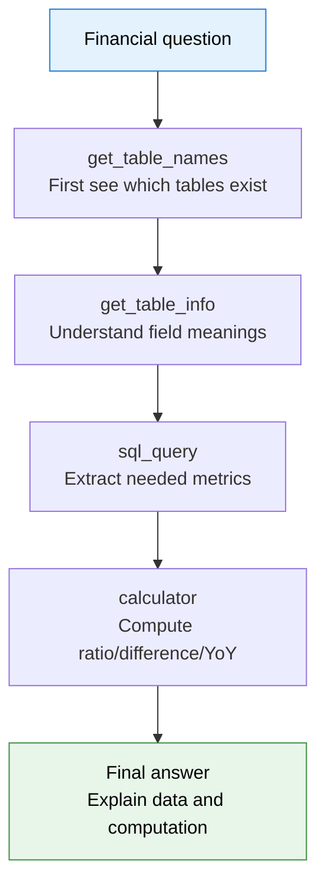

# 20.5 Hands-On: Training a Financial Analysis Agent with rLLM

In the previous section, DeepCoder showed a typical code post-training case: the model writes code, a sandbox runs tests, and test results provide verifiable reward. That example is rigorous but has a prerequisite: code-task reward is clean, while real business tasks are rarely so simple.

Consider a more business-like scenario. A user asks:

> What fraction of this company's 2023 R&D expenses was as a percentage of revenue? How much did it change compared to 2022?

A plain language model might answer from memory or get lost in long tables. A more dependable approach is not to generate conclusions from impressions, but to first find the company's 10-K financial tables, confirm which tables exist, write SQL to extract revenue and R&D expenses, do the division, and finally explain the calculation clearly. The core here is no longer single-turn QA but a typical **tool-use Agent**:

```text
User question
  → Check which tables the company has
  → Inspect table schema and columns
  → Write SQL to query metrics
  → Call calculator for ratio computation
  → Compose the final answer
  → Judge or benchmark evaluates correctness
```

The **rLLM-FinQA** case we dissect in this section is exactly such a financial Agent post-training example. It uses the rLLM framework to train Qwen3-4B-Instruct-2507 into a financial table-analysis Agent, achieving 59.7% accuracy on the Snorkel Finance Benchmark — surpassing Qwen3-235B's 51.4% and approaching Gemini 2.5 Pro's 60.6%[^rllm-finqa].

This experiment is well-suited as a first business case for Agentic RL, because it simultaneously has three properties: the task comes from real financial reports, the tool-calling path is clear, and both training and evaluation are fully reproducible.


<div style="text-align: center; font-size: 0.9em; color: var(--vp-c-text-2); margin-top: -10px; margin-bottom: 20px;">
  <em>Figure 1: Snorkel and rLLM collaborate on a financial analysis Agent post-training solution. A 4B model surpasses a 235B general-purpose model on the Snorkel Finance Benchmark. Source: <a href="https://snorkel.ai/" target="_blank" rel="noopener noreferrer">Snorkel AI</a></em>
</div>

## Why Financial QA Fits Agentic RL

Start with the intuition. Financial questions are usually not "memorize one fact" but "extract numbers from structured materials, compute, and explain." For example: "How much did gross margin change year-over-year?", "Does operating cash flow cover capital expenditures?", "What fraction of revenue does this expense represent?" These questions share two properties.

First, answers must be grounded in external data. The model cannot just say "according to the financial report, the company performed well." It must be able to point to which table and which field the numbers come from. Second, many answers require intermediate computation. Finding revenue and cost is not enough; you must also compute ratios, differences, or year-over-year changes.

This compresses the core challenges of Agentic RL into a controllable environment:

- **State**: current question, tables already inspected, SQL query results, calculator results.
- **Action**: select a tool, construct SQL, call calculator, output answer.
- **Environment feedback**: table schema, query results, computation results, judge score.
- **Reward**: whether the final answer addresses the financial question, cites correct data, and computes reasonably.

Compared with Web Agents, the financial Agent environment is more stable. Compared with SWE Agents, the engineering cost is lower. Compared with pure math RLVR, it retains real tool calling and multi-turn decision-making. That is why it works well as a hands-on section.

## rLLM-FinQA Task Setup

The rLLM-FinQA goal is clear: train a small model to answer financial-report questions through tools.

The official case uses `Qwen3-4B-Instruct-2507` as the base model, published after training as `rLLM/rLLM-FinQA-4B`. The dataset contains 5,110 financial QA samples covering 207 companies; underlying tables come from SEC 10-K filings, totaling 6,923 tables. The data is split into 4,030 training, 522 validation, and 558 test samples[^rllm-finqa].

These numbers are worth pausing on. 5,110 samples is not large, but each sample has a queryable company-table environment behind it. The model is not learning a static "question → answer" mapping; it is learning "when facing a financial question, how should I inspect tables, write SQL, compute, and answer." In other words, the real training target is the **decision process**, not a single answer string.

A sample can be understood as:

```json
{
  "question": "What was the ratio of R&D expenses to revenue in 2023?",
  "company": "example_corp",
  "tables": ["income_statement", "operating_expenses", "..."],
  "answer": "The ratio was ...",
  "metadata": {
    "source": "10-K",
    "split": "train"
  }
}
```

The actual data structure is more complex, but the learning focus is right here: the question points to a company, the environment has multiple tables, and the Agent must decide which table to inspect first, which fields to query, and how to compute.

## Agent Architecture: ReAct + Four Financial Tools

rLLM-FinQA uses a ReAct-style tool agent. ReAct can be understood as having the model alternate between "thinking" and "acting": first judge what information is needed next, then call a tool, then continue reasoning based on the tool's output.

In the official case, the Agent can use four tools:

| Tool              | Purpose                                                            |
| ----------------- | ------------------------------------------------------------------ |
| `get_table_names` | List available tables for a company                                |
| `get_table_info`  | Inspect a table's metadata, column names, types, and sample values |
| `sql_query`       | Execute a SQL query against in-memory SQLite tables                |
| `calculator`      | Perform mathematical computation on retrieved numbers              |

These four tools form a natural workflow:




<div style="text-align: center; font-size: 0.9em; color: var(--vp-c-text-2); margin-top: -10px; margin-bottom: 20px;">
  <em>Figure 2: The rLLM-FinQA Agent environment. Facing a financial question, the model interacts with SEC 10-K financial tables through four tools — get_table_names, get_table_info, sql_query, and calculator — to complete multi-step reasoning and computation. Source: <a href="https://snorkel.ai/" target="_blank" rel="noopener noreferrer">Snorkel AI</a></em>
</div>

The real problem is that the model does not initially know this path. It might write SQL directly, query the wrong table, confuse revenue with net income, or miscalculate a ratio after getting two numbers. Post-training optimizes precisely these behavioral probabilities: correct tool selections should appear more often, and wrong table-inspection and computation paths should be suppressed.

## What a Rollout Looks Like

A successful financial Agent trajectory is usually not very long, but each step carries clear information gain. Here is a simplified illustration:

```text
Task:
  Compute Company X's 2023 R&D expense as a fraction of revenue, and compare with 2022.

Step 1:
  Thought: Need to find tables containing revenue and R&D expenses.
  Action: get_table_names(company="...")
  Observation: ["consolidated_income_statement", "operating_expenses", ...]

Step 2:
  Thought: income_statement likely has revenue; operating_expenses likely has R&D.
  Action: get_table_info(table="operating_expenses")
  Observation: columns = ["year", "research_and_development", ...]

Step 3:
  Thought: Extract R&D expenses for 2022 and 2023.
  Action: sql_query("SELECT year, research_and_development FROM operating_expenses WHERE year IN (2022, 2023)")
  Observation: [(2022, 1820), (2023, 2140)]

Step 4:
  Thought: Still need revenue for both years.
  Action: sql_query("SELECT year, revenue FROM consolidated_income_statement WHERE year IN (2022, 2023)")
  Observation: [(2022, 39400), (2023, 42100)]

Step 5:
  Thought: Compute both ratios and the change.
  Action: calculator("2140 / 42100 - 1820 / 39400")
  Observation: 0.0046

Final:
  2023 R&D expenses were about 5.08% of revenue, vs about 4.62% in 2022, an increase of about 0.46 percentage points.
```

The key point: Agentic RL trains not "how to write the final sentence" but the distribution over every decision along the path. The model learns to check table schemas first, then write SQL; learns to delegate computation to the calculator instead of doing mental arithmetic in natural language; and learns to explain the provenance of numbers in the final answer.

## Reward: Why LLM-as-Judge

Code tasks can run unit tests; math problems can compare against reference answers. Financial QA is trickier: the same correct answer can be expressed in many ways. For example, "an increase of 0.46 percentage points" and "from 4.62% to 5.08%" are essentially equivalent, but string matching would easily misjudge them.

rLLM-FinQA therefore uses **LLM-as-Judge reward**. The official training configuration uses GPT-5-nano as the reward judge, with a Portkey gateway for caching to reduce repeated scoring costs[^rllm-finqa].

An important detail: the judge is not just asked "is this answer good?" A trainable judge reward typically needs an explicit rubric:

```text
Evaluate the answer on the following dimensions:
1. Did it use data from the correct company?
2. Did it select the correct years?
3. Did it query the correct financial metrics?
4. Is the computation correct?
5. Does the final answer directly address the question?

Output a score between 0 and 1.
```

If the judge only evaluates fluency, the model will learn to write polished but unreliable financial analysis. If the judge focuses on data provenance and computation consistency, the model will be pushed toward genuine tool use. The key in Agentic RL reward design is not "using a judge" but whether the judge is aligned with the task objective.

In practice, reward can be decomposed into two layers:

```text
Rule checks:
  Is the SQL executable?
  Were the necessary tools called?
  Does the final answer contain numbers?

LLM judge:
  Were the correct metrics selected?
  Is the computation reasonable?
  Is the answer faithful to the table results?
```

Rule checks reduce noise; the LLM judge covers semantic quality. Financial scenarios are well-suited for this hybrid reward.

## GRPO Training: Learning Preferences from Multiple Trajectories

rLLM-FinQA uses GRPO for post-training. Chapter 9 already introduced GRPO's intuition: sample a group of answers for the same question, estimate advantages from within-group relative scores, then update the policy.

Applied to the financial Agent, GRPO's objects are no longer single responses but complete trajectories:

```text
Same financial question
  → rollout 1: correct tables, correct computation, reward = 1.0
  → rollout 2: correct tables, wrong computation, reward = 0.5
  → rollout 3: wrong metric, reward = 0.2
  → rollout 4: no tool calls, direct answer, reward = 0.0

GRPO update:
  Increase probability of model actions in rollout 1
  Slightly increase probability of effective actions in rollout 2
  Decrease probability of wrong paths in rollouts 3/4
```

This is a key difference from plain SFT. SFT can only imitate existing good trajectories; GRPO allows the model to explore multiple paths itself, then reinforce better paths based on reward. The action space for financial QA is not too large, making it more suitable than Web navigation or SWE bug-fixing for beginners to observe whether RL actually brings improvement.

## Reproduction Path 1: Run Inference and Evaluation First

If the goal is to fully understand the project, do not jump straight to training. A safer order is: prepare data, run official model inference, and confirm that the environment and toolchain all work.

The official steps are roughly:

```bash
git clone https://github.com/rllm-org/rllm.git
cd rllm

# Install FinQA dependencies
uv pip install -r projects/finqa/requirements.txt

# Download and process data
python -m projects.finqa.prepare_finqa_data
```

The data preparation script does several things:

- Downloads the `rLLM/finqa` dataset from Hugging Face;
- Extracts 6,923 tables from 207 companies;
- Generates train/val/test splits;
- Registers data in rLLM's DatasetRegistry.

Then start an OpenAI-compatible vLLM service:

```bash
python -m vllm.entrypoints.openai.api_server \
  --model rLLM/rLLM-FinQA-4B \
  --host 0.0.0.0 \
  --port 30000 \
  --dtype bfloat16
```

Run the financial Agent:

```bash
python -m projects.finqa.run_finqa
```

The goal of this step is not to beat the benchmark but to check three things: whether the model can stably call tools, whether SQLite tables load correctly, and whether the output contains interpretable table-inspection and computation steps. Only when this step works does training become meaningful.

## Reproduction Path 2: Small-Scale GRPO Post-Training

For actual training, the official project provides two paths: the default verl backend and the tinker LoRA backend.

verl backend for 4B model training:

```bash
export OPENAI_API_KEY=...
export PORTKEY_API_KEY=...

bash projects/finqa/train_finqa.sh
```

tinker backend for 30B MoE model LoRA training:

```bash
export OPENAI_API_KEY=...
export PORTKEY_API_KEY=...

bash projects/finqa/train_finqa_tinker.sh
```

If reproducing on a personal machine or single GPU, do not directly pursue the full official training. A more reasonable mini version is:

1. Take only 200–500 training samples;
2. Fix a small rollout group size;
3. Use LoRA or a smaller model;
4. Run 1–2 epochs first;
5. Compare base model vs RL model on the validation set for tool-call success rate and answer accuracy.

The value of this mini version is not achieving the official 59.7% score, but running the full closed loop:

```text
Data preparation → Agent rollout → Judge reward → GRPO update → Eval → Error analysis
```

As long as this closed loop runs stably, you already have a complete Agentic RL training system.

## Evaluation: Do Not Only Look at Overall Accuracy

The core result reported by the official project:

| Model          | Parameters    | Snorkel Finance Benchmark Accuracy |
| -------------- | ------------- | ---------------------------------- |
| rLLM-FinQA-4B  | 4B            | 59.7%                              |
| Gemini 2.5 Pro | Not disclosed | 60.6%                              |
| Qwen3-235B     | 235B          | 51.4%                              |


<div style="text-align: center; font-size: 0.9em; color: var(--vp-c-text-2); margin-top: -10px; margin-bottom: 20px;">
  <em>Figure 3: Snorkel Finance Benchmark evaluation metric comparison across models. rLLM-FinQA-4B reaches 59.7% on financial analysis, close to Gemini 2.5 Pro's 60.6%, far exceeding Qwen3-235B's 51.4%. Source: <a href="https://snorkel.ai/" target="_blank" rel="noopener noreferrer">Snorkel AI</a></em>
</div>

This result tells us something important: with a strong tool environment and appropriate reward, a small model can surpass a much larger general-purpose model through post-training. The reason is not mysterious. The 235B general model has stronger language ability, but it has never specifically learned "how to inspect tables, write SQL, compute, and answer when facing SEC filings." The 4B financial Agent's advantage comes from specialized training on the task distribution.

However, when reproducing, do not only look at the final accuracy. More instructive is to decompose metrics:

| Metric                   | What It Measures                                                    |
| ------------------------ | ------------------------------------------------------------------- |
| Tool call rate           | Whether the model actually learned to use tools vs guessing answers |
| SQL success rate         | Whether generated SQL can execute                                   |
| Table selection accuracy | Whether the correct table was selected for target metrics           |
| Computation accuracy     | Whether retrieved numbers were computed correctly                   |
| Judge score distribution | Whether reward clusters at 0/1 or has learnable middle gradients    |
| Average turn count       | Whether the model completes the same task in fewer steps            |

These metrics answer a more critical question: where exactly did the model improve? Fewer SQL syntax errors? Better table selection? Better at explaining computation in the final answer? Agentic RL evaluation must be able to localize capability gains; otherwise, changes in overall score are hard to guide the next training round.

## Common Failure Modes

Financial Agent failures are usually not "completely unable to answer" but getting stuck at a specific step.

**First type: querying the wrong table.** The model sees `income_statement` and assumes all metrics are there, but some expense items may be in a separate operating expense table. This kind of error requires better `get_table_info` usage habits, or penalizing SQL queries issued without first inspecting the table schema.

**Second type: SQL looks correct but uses the wrong metric.** For example, treating `net_sales` as `revenue`, or confusing `research_and_development` with `selling_general_admin`. This type of error is well-suited for judge evaluation, since string rules cannot easily know which field is semantically more appropriate.

**Third type: wrong computation direction.** The user asks "how many percentage points did it increase from 2022 to 2023," but the model computes relative growth rate instead. This requires explicitly distinguishing ratio, percentage point, and year-over-year growth in training samples and judge rubrics.

**Fourth type: excessive tool calls.** Some questions only need one SQL query, but the model repeatedly inspects table schemas, increasing cost. Agentic RL should optimize not just accuracy but also average step count and call cost.

**Fifth type: judge noise.** If the judge gives unstable scores for the same answer, GRPO's advantage estimates become noisy. In practice, fix judge temperature, cache judge results, and periodically sample for manual review.

## How to Adapt This Into Your Own Project

The real value of rLLM-FinQA is not just financial QA itself, but the transferable template it provides. As long as a task satisfies three conditions, you can follow its pattern to build a new industry Agent:

1. You have a batch of structured or semi-structured data.
2. You can define a small number of stable tools.
3. You can score final answers with rules or a judge.

For example:

| Industry Scenario  | Data                                        | Tools                                        | Reward                     |
| ------------------ | ------------------------------------------- | -------------------------------------------- | -------------------------- |
| E-commerce support | Orders, logistics, refund policies          | Query order, query logistics, compute refund | Status check + judge       |
| Corporate finance  | Financial reports, budgets, expense details | SQL, table query, calculator                 | Number consistency + judge |
| Legal contracts    | Contract clauses, regulation database       | Search, clause location, summarization       | Rubric judge               |
| Data analysis      | CSV, databases, metric definitions          | SQL, Python, chart generation                | Unit checks + judge        |

For a course project, you could name it:

> Hands-On: Training a Corporate Finance Analysis Agent with rLLM

The minimum version only needs 100–300 QA pairs, a few company tables, four tools, and a judge reward. What truly matters is preserving the complete closed loop, not pursuing data scale from the start.

## Section Summary

rLLM-FinQA demonstrates a clear template for Agentic RL on enterprise tasks: the model no longer just generates answers but executes multi-step decisions in a structured financial environment. It inspects tables, writes SQL, computes, then answers; during training, an LLM judge evaluates the quality of the entire trajectory, and GRPO reinforces more reliable tool-use paths.

The key takeaway: **the difficulty of Agentic RL lies not only in the algorithm but in connecting the task environment, tools, reward, and benchmark into a closed loop.** The financial Agent is valuable because it is realistic enough yet controllable — a good first step from code RL toward enterprise Agent post-training.

[^rllm-finqa]: rLLM official case page: [FinQA Financial Agent](https://docs.rllm-project.com/projects/finqa), including model, data, tools, training commands, and benchmark results.
