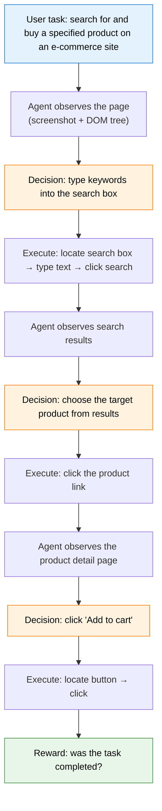
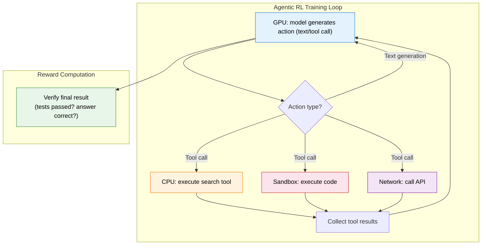
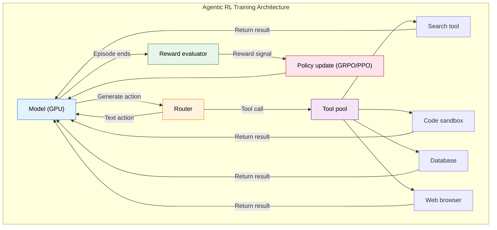

# Legacy Page: Tool Use and Agentic Engineering (Merged into 10.2)

> This page is kept as an entry point for old links. The core content has been merged into [10.2 Tool Use, Trajectory Synthesis, and Agentic Engineering](./tool-use-and-trajectory). The original material is preserved below so readers arriving from older links can still compare it with the new section.

# 12.3 Tool-Use RL: Web Agents and Code Agents

In the previous section, we unpacked the credit assignment problem in multi-turn RL: if a seven-turn interaction fails, which step should we blame? Now we turn to another key question: how does a model learn to "use tools"? Supervised fine-tuning (SFT) can teach a model what the JSON format of a tool call looks like, but it cannot reliably teach the model when to call a tool, which tool to call, or how to combine several tools. Those are strategic decisions, and this is exactly where RL is strong.

## Why Is RL Crucial for Tool Use?

Imagine training a model to help users analyze data. During SFT, you show it thousands of examples of "correct tool calls", and the model learns:

```json
{ "tool": "sql_query", "query": "SELECT * FROM users WHERE age > 30" }
```

It has learned the format. But in real use, the model faces strategic decisions:

- If the user asks, "How many high-value users do we have?", should the model query the database directly, or first search internal documentation to learn the definition of "high-value user"?
- After querying the database and finding 100,000 rows, should it filter further or aggregate the data?
- After aggregation reveals an anomaly, should it report the anomaly or try a different query?

These decisions do not have a single standard answer. Different strategies may lead to different outcomes, and SFT can only teach the model to imitate expert trajectories. It cannot teach the model to explore better strategies. RL's advantage is that you only need to tell the model whether the final result is correct. Through trial and error, the model can learn when to use which tool.

|                     | SFT                                  | RL                                                     |
| ------------------- | ------------------------------------ | ------------------------------------------------------ |
| What it learns      | Tool-call syntax and format          | When to call, which tool to call, how to compose tools |
| Training data       | Human-labeled tool-call trajectories | Only final outcomes (success/failure) as reward        |
| Generalization      | Limited to seen tool combinations    | Can explore new tool-use strategies                    |
| Error recovery      | Does not teach recovery from errors  | Learns repair strategies through trial and error       |
| Representative work | Toolformer[^toolformer]              | ReTool, VERL-TOOL, ToolRL                              |

## Core Methods

### ReTool: Calling Tools During Reasoning[^retool]

ReTool (Reasoning with Tools) lets the model call tools **freely** during reasoning, instead of deciding in advance "when the tool will be called". While generating an answer, the model can pause text generation at any time, call a tool such as a calculator or code interpreter, receive the result, and then continue generating.

RL optimizes the policy for when to call a tool. The model may discover that for simple arithmetic, mental calculation is faster than calling a calculator, but for complex numerical computation, the calculator is more accurate. This kind of context-sensitive strategy is hard to teach with SFT, but RL can let the model discover it from reward signals.

### VERL-TOOL: Cross-Domain Tool Use[^verltool]

VERL-TOOL is a cross-domain RL training framework for tool use, covering mathematical reasoning, SQL generation, web search, software engineering, and other settings. Its key innovation is a **unified tool-call interface**: tools from different domains, such as calculators, databases, and search engines, are abstracted into one RL action space and can be trained with the same RL algorithms.

### ToolRL: Tools as RL Actions[^toolrl]

ToolRL treats a tool call as a **special action** in RL and expands the policy's action space. A standard LLM's action space is the vocabulary, usually tens of thousands of tokens. ToolRL adds actions such as "call tool A" and "call tool B". The policy network must choose between generating text and calling a tool.

```python
class ToolAugmentedPolicy(nn.Module):
    """Tool-augmented policy network: choose between text generation and tool calls."""

    def __init__(self, base_model, tools):
        super().__init__()
        self.base_model = base_model  # Base LLM
        self.tools = tools             # Available tools

    def forward(self, state):
        """
        Given the current state (conversation history + tool results),
        decide whether the next step should generate text or call a tool.
        """
        # Base model outputs logits.
        logits = self.base_model(state)

        # Detect a special "tool-call token".
        # If the model selects a tool-call token, parse arguments and execute it.
        if self._is_tool_call(logits):
            tool_name, tool_args = self._parse_tool_call(logits)
            return ToolAction(tool_name, tool_args)
        else:
            return TextAction(logits)  # Normal text generation
```

## Reward Design: The Scenario Determines the Reward

Unlike preference alignment, tool-use reward is often not subjective. It can be designed from objective signals. In fact, this is a direct application of **RLVR (Reinforcement Learning from Verifiable Rewards)** from Chapter 9 to agentic settings.

| Scenario               | Reward source                                  | Type                             | Special consideration                  |
| ---------------------- | ---------------------------------------------- | -------------------------------- | -------------------------------------- |
| Code generation        | Unit-test pass rate                            | Continuous (0-1)                 | Partial reward for partial pass rates  |
| Mathematical reasoning | Whether the final answer is correct            | Binary (0/1)                     | Intermediate steps can use a PRM       |
| Web search             | Whether the correct answer was found           | Binary + path-efficiency penalty | Encourage fewer search turns           |
| SQL generation         | Whether query results match expectations       | Binary + execution-time penalty  | Avoid inefficient queries              |
| Data analysis          | Whether the conclusion is correct and complete | Multi-dimensional score          | Evaluate both accuracy and readability |

One important pattern is that many agentic rewards include an **efficiency penalty**. This is not only to make the model faster, but also because every tool call has a cost: API fees, latency, and resource consumption. A good agent should not merely complete the task; it should complete it efficiently.

Formally, the total reward for tool-use RL can be written as:

$$R_{\text{total}} = R_{\text{task}} - \lambda_{\text{efficiency}} \cdot T - \lambda_{\text{format}} \cdot \mathbb{1}(\text{format error})$$

Here, $R_{\text{task}}$ is the task completion reward (0 or 1), $T$ is the number of interaction turns used, $\lambda_{\text{efficiency}}$ is the efficiency penalty coefficient, and $\lambda_{\text{format}}$ is the format-error penalty. This formula unifies "complete the task successfully" and "complete the task efficiently" into one reward signal.

```python
def compute_agent_reward(task_success, num_turns, max_turns=10):
    """Compute the combined reward for agentic RL."""
    # Base reward for task completion
    success_reward = 1.0 if task_success else 0.0

    # Efficiency penalty: more turns means a larger penalty.
    efficiency_penalty = -0.1 * (num_turns / max_turns)

    # Additional penalty for malformed tool calls
    # (if the model generates a tool call that cannot be parsed)
    format_penalty = -0.5 if has_format_error else 0.0

    return success_reward + efficiency_penalty + format_penalty
```

## Web Agent RL: Teaching a Model to Browse the Web

Web agents are one of the most intuitive applications of agentic RL: train an agent that can browse web pages, fill forms, and search for information. This sounds simple, but the implementation is full of challenges.

**Action space.** A web agent's actions are not "generate text", but browser-level operations: click an element, type into an input field, scroll the page, or navigate to a new URL. Every action must precisely locate its target element, usually by coordinates $(x, y)$ or a DOM element ID.

**State space.** The state received by a web agent usually has two parts: a page screenshot (visual information) and the DOM tree (structural information). The screenshot provides visual layout, while the DOM tree provides precise element locations. Both are necessary. With only a screenshot, it is hard to click small buttons precisely; with only the DOM tree, it is hard to understand visual layout.

**Reward signal.** A web agent's reward is based on task completion. For example, for "book a flight from Beijing to Shanghai for tomorrow on Trip.com", the reward depends on whether the agent found the correct flight, filled in all required information, and submitted the order.



The main challenge in Web Agent RL is the enormous and dynamic state space. A web page may contain thousands of DOM elements; page content may load dynamically; and the layout of the same website may change over time. This means the agent needs strong generalization. It cannot memorize "the button is in the upper-left corner"; it must understand what a submit button usually looks like.

### ReLook: Scoring Web Pages with Vision[^relook]

Existing web-agent rewards mostly rely on DOM-structure matching or binary task-completion judgments. ReLook introduces a new source of reward: **visual feedback**. Its workflow is: the agent generates web-page code, the page is rendered into a screenshot, a multimodal LLM scores the screenshot visually, and that visual score becomes the RL reward. This "score after seeing the result" approach is closer to how humans judge a good web page. After all, users see the rendered page, not the source code.

### Agent Workflow Memory: Learning Workflows from Experience[^awm]

Agent Workflow Memory (AWM) addresses the **memory** problem for web agents. AWM extracts reusable workflows from an agent's past successful experiences and proactively provides relevant workflows to guide future tasks. For example, after many shopping tasks, the agent may learn the general procedure "search → add to cart → fill address → pay". AWM stores this workflow and activates it automatically for similar shopping tasks later. Experiments on WebArena and Mind2Web show that this kind of learning from experience significantly improves agent generalization on new websites.

### Web-Shepherd: A PRM Built for Web Navigation[^webshepherd2]

In the previous section, we mentioned Web-Shepherd as a real-world example of a PRM. Here we discuss its application to web agents in more detail. A traditional web-agent reward has only one signal: whether the final task was completed. Web-Shepherd gives a score after each operation: "Was this click correct?" "Was this form filled correctly?" It uses a structured checklist to guide evaluation, together with a dedicated PRM trained on 40,000 labeled examples. Its evaluation cost is only one tenth that of using GPT-4o-mini as a judge. This lets web-agent training replace sparse episode-level rewards with denser step-level rewards, greatly improving both training efficiency and final performance.

## Code Agent RL: Writing, Debugging, and Iterating on Code

Code Agent RL trains an agent that can **write code, execute code, read errors, and fix code**. This is closer to how real programmers work than one-shot code generation: instead of writing perfect code at once, the agent iterates through a loop of "write → run → error → fix".

Code Agent RL has a natural advantage: the **reward is very clear**. Code either passes all unit tests (reward = 1), or it does not (reward < 1, with partial credit based on pass rate). This is much easier to quantify and automate than the "task completion" reward of web agents.

```python
def code_agent_reward(generated_code, test_cases):
    """Reward for a code agent: based on test pass rate."""
    results = []
    for test_input, expected_output in test_cases:
        try:
            # Execute generated code in a sandbox.
            actual_output = execute_in_sandbox(generated_code, test_input)
            results.append(actual_output == expected_output)
        except Exception:
            results.append(False)  # Runtime exception = failed test

    # Base reward = pass rate
    pass_rate = sum(results) / len(results)

    # Extra reward: code concision (shorter is better, with a minimum requirement)
    # Extra penalty: excessive execution time
    return pass_rate
```

One key finding in Code Agent RL comes from ICML 2025 research: **single-step reward can effectively guide multi-turn code generation**. In other words, you do not need to reward every round of "write code → run → error → fix". You only need to reward whether the final code passes the tests, and the model can learn the complete strategy of writing correct code and fixing errors. This matches the ORM idea from the previous section: if the reward is clear enough, sparse signals can still work.

### rStar2-Agent: A Practical 14B Beats 671B Benchmark[^rstar2]

If the earlier discussion was about theoretical feasibility, rStar2-Agent is one of the strongest practical demonstrations. This 14B-parameter model trained by Microsoft used **only 510 RL training steps** on 64 AMD MI300X GPUs and reached 80.6% accuracy on the AIME24 math competition, surpassing the 671B-parameter DeepSeek-R1.

The core innovation of rStar2-Agent is **GRPO-RoC** (Group Relative Policy Optimization with Resampling on Correct). Standard GRPO samples a group and compares samples once. GRPO-RoC **resamples correct trajectories**: if the model succeeds on a trajectory, it continues exploring from that successful trajectory to see whether it can find an even better path. This provides a finer learning signal than simple within-group comparison.

This result contains two important insights. First, **the training efficiency of agentic RL is much higher than expected**: 510 RL steps can outperform a model 40 times larger, suggesting that RL data efficiency can be very high for large models. Second, **small model + RL can beat large model + SFT**. The key is that RL teaches the model how to use tools and reasoning strategies effectively, rather than merely imitating expert behavior.

### Agnostics: Code RL in Any Language[^agnostics]

Most existing Code Agent RL assumes Python for code execution and verification. Agnostics breaks this limitation. Through a **language-agnostic code execution verifier**, it can train with RL for any programming language. The verifier workflow is simple: extract code from model output, compile it if necessary, execute it, and compare the result. Whether the code is Python, Rust, Go, or SQL, the verifier treats it uniformly. This means the same RL framework can train a code model that can write in many languages, without designing a separate training pipeline for each language. The code, data, and configuration are all open source.

### Scoring Without Execution: Agentic Code Reasoning[^agcodereason]

So far, all Code Agent RL rewards have depended on **code execution**: run the code and see whether the result is correct. Meta's research shows a more elegant alternative: **let the model reason about code behavior without executing it**. This method is called semi-formal reasoning. The model must explicitly list premises, track every execution path, and write formal conclusions, much like a mathematical proof. It cannot skip steps or remain vague.

This method reaches 93% accuracy on real-world patch verification. Its core value is that it needs no sandbox, no execution environment, and introduces no execution security risk. You can think of it as a low-cost alternative for Code Agent RL: if the reward signal only needs to decide whether a piece of code is roughly right or wrong, semi-formal reasoning may be enough. If exact output matching is required, you still need to execute the code.

### Scaling Laws from Code Bootstrapping[^zeroscaling]

Chapter 12 discusses standard RL scaling laws in detail: more training steps often lead to stronger reasoning ability. Agentic RL has its own scaling laws as well. ZeroTIR lets a model spontaneously learn to generate and execute code to support reasoning **without supervised examples**. Researchers found a predictable relationship: there is a **power-law relationship** between training steps, code execution frequency, and final accuracy. This means you can predict final model performance early in training. If code execution frequency is still rising after 100 steps, the model is still learning and training should continue. If the frequency has plateaued, learning is close to saturation and training can stop early.

This finding is important for engineering practice. It gives you a **free training-progress indicator**: without running the entire training process, you can monitor code execution frequency to decide whether training should continue. ZeroTIR was accepted by NeurIPS 2025.

<details>
<summary>Thinking question: What is the essential difference between reward design for web agents and code agents? How does this affect RL training strategy?</summary>

Web-agent reward is usually **binary and indivisible**: either the task is completed or it is not, and intermediate states are hard to quantify. This makes the reward signal extremely sparse and training difficult.

Code-agent reward is **decomposable**: if 7 out of 10 unit tests pass, the reward is 0.7. This continuous reward signal makes training easier. Even if the code is not fully correct, the model receives a signal that it is moving in the right direction. This is why Code Agent RL has advanced faster than Web Agent RL.

The implication for training strategy is that Web Agent RL needs PRMs (step-by-step evaluation) more strongly to provide dense signals, while Code Agent RL can often achieve good results with ORM alone (only looking at the final test outcome).

</details>

## Search-Tool RL: SearchR1 and Search-Augmented Reasoning

The web-agent and code-agent settings discussed above each have their own focus, but one tool scenario is especially important and especially challenging: **search engines**. Search differs from calculators and databases. Search results are open-ended and unstructured, and a good search strategy depends heavily on context. If the question is "What is the difference between GRPO and PPO?", the model may not need search. But if the question is "Who won the 2025 Nobel Prize in Physics?", the model must search, because its internal knowledge may be out of date.

In 2025, SearchR1[^searchr1] (Jin et al.) pioneered the use of RL for search-tool training, allowing models to **learn autonomously when to search, what to search for, and how to use search results**. Later work such as ReSearch[^research] and ToRL[^torl] advanced this direction from different angles.

### Why Prompting Is Not Enough

Before SearchR1, the mainstream approach was to use prompting to teach the model that "you may call a search engine during reasoning". ReAct[^react], Self-RAG[^selfrag], and related methods follow this route. But prompting has three fundamental limits.

**The timing of search cannot be exhaustively specified.** You can write in the prompt, "search when knowledge is uncertain", but what counts as "uncertain"? The model may be very confident about outdated information, not knowing that it does not know; or it may over-search obvious common knowledge.

**Search-query strategy cannot be imitated mechanically.** For a task such as "compare the latest performance data for three quantum-computing platforms", the search strategy must adapt dynamically to previous results. The first query, "quantum computing benchmark 2025", may be too broad, so the second query becomes "IBM quantum advantage vs Google Sycamore 2025". This kind of **adaptive query generation** is a policy-learning problem, not just a language-modeling problem.

**Long-horizon optimization over multiple searches.** A complex task may require 5-10 searches. Stopping too early means insufficient information; stopping too late wastes resources. This trade-off is exactly where RL is useful.

### SearchR1's MDP Formulation

SearchR1 formulates search-augmented reasoning as a special MDP:

- **State $s_t$**: the current reasoning context (generated text + previous search results)
- **Action $a_t$**: two types: (1) continue generating tokens, or (2) generate a search query and trigger search using `<search>...</search>` tags
- **Transition**: a search action triggers the search engine, and the result is appended to the context
- **Reward**: final-answer correctness (RLVR) + search-efficiency penalty

```
Reasoning + search interaction process:

User: "Who received the 2025 Turing Award?"

Model reasoning: "This question concerns recent 2025 information, so I need to search."
Model action: <search>2025 Turing Award winner</search>
Search result: "The 2025 ACM Turing Award was given to..."
Model reasoning: "Now I have enough information."
Final answer: [complete answer]

Reward: answer correctness - λ × number of searches
```

Training uses GRPO group sampling plus within-group comparison. The key design is that the text returned by search is **masked out** from the loss. The model should not be reinforced simply because the search engine returned good content. Search behavior **emerges spontaneously** during RL training: even if SFT never taught search, the model gradually learns to trigger search at the right time.

### Key Findings from SearchR1

- **Search behavior emerges from RL.** RL can do more than optimize known strategies; it can discover new ones.
- **Scaling law for search frequency.** As training steps increase, the model's search frequency rises on questions that require search and falls on questions that do not. The model learns to distinguish the two settings.
- **Generalization to unseen search scenarios.** Search strategies trained on math problems can generalize to history and science questions.

### Technical Lineage After SearchR1

| Work                       | Core innovation                                                                                         | Citations    |
| -------------------------- | ------------------------------------------------------------------------------------------------------- | ------------ |
| **SearchR1 **[^searchr1]   | RL trains the model to search autonomously, GRPO + RLVR                                                 | 819          |
| **ReSearch **[^research]   | Deep integration of reasoning and search; each reasoning step can include reflection on search strategy | -            |
| **ToRL **[^torl]           | Extends to computational tools (code executors), finding scaling laws for tool use                      | 131          |
| **ReTool **[^retool]       | Distinguishes reasoning tasks from computational tasks; RL lets the model choose tools strategically    | 247          |
| **ZeroTIR **[^zeroscaling] | Models spontaneously learn code execution without supervised examples; power-law scaling law            | NeurIPS 2025 |

The 32B model trained by ToRL[^torl] outperformed a 70B model without tools on mathematical reasoning, showing that "small model + tools > large model with pure reasoning". ReTool[^retool] further teaches models strategic tool selection: not every problem needs a tool; the model should decide dynamically based on the problem's characteristics.

```python
def search_reward(answer, ground_truth, num_searches, max_searches=5):
    """Reward function for search RL."""
    correctness = 1.0 if verify_answer(answer, ground_truth) else 0.0
    efficiency_penalty = -0.05 * num_searches  # Search-cost penalty
    return correctness + efficiency_penalty
```

## Training Process for Tool-Use Policies

Putting the concepts above together, a complete tool-use RL training pipeline usually contains three stages.

**Stage 1: SFT teaches format.** Use human-labeled tool-call trajectories for supervised fine-tuning, teaching the model what the JSON format of a tool call looks like. This step does not involve policy optimization. The model only learns how to format a tool-call request correctly.

**Stage 2: RL teaches strategy.** Starting from the SFT model, use RL to optimize the tool-use policy. The model begins exploring different ways to use tools: sometimes it fails to call a tool when it should, and sometimes it calls one when it should not. The reward signal, task success or failure, tells the model which strategies are better.

**Stage 3: Iterative optimization.** As RL training proceeds, the model reveals weaknesses in its own policy, such as "it often forgets to search before answering in some scenarios". These weaknesses can be fixed by adding targeted training data, forming a continuous improvement loop.

```python
# Simplified tool-use RL training loop
def tool_rl_training_loop(
    model, tool_env, tasks, num_epochs=100, group_size=4
):
    """Core training loop for tool-use RL (simplified)."""
    optimizer = torch.optim.Adam(model.parameters(), lr=1e-6)

    for epoch in range(num_epochs):
        for task in tasks:
            # Generate multiple trajectories (group sampling, similar to GRPO).
            trajectories = []
            for _ in range(group_size):
                traj = model.interact_with_tools(task, tool_env)
                trajectories.append(traj)

            # Compute reward for each trajectory.
            rewards = [compute_agent_reward(t.success, t.num_turns) for t in trajectories]

            # Within-group comparison (GRPO idea): use relative ranking to compute advantage.
            mean_reward = np.mean(rewards)
            std_reward = np.std(rewards) + 1e-8
            advantages = [(r - mean_reward) / std_reward for r in rewards]

            # Policy-gradient update
            for traj, advantage in zip(trajectories, advantages):
                loss = traj.total_log_prob * (-advantage)  # Policy gradient
                loss.backward()

            optimizer.step()
            optimizer.zero_grad()
```

The core idea of this training loop is very similar to GRPO in Chapter 9: sample multiple trajectories within a group and compute advantages through relative comparison. The difference is that GRPO compares multiple text answers, while here we compare multiple tool-call trajectories.

## Connection to RLVR

You may have noticed that reward design for tool-use RL is very similar to RLVR in Chapter 9. This is not a coincidence. **Agentic RL is the natural extension of RLVR to multi-turn interaction settings**. The core idea of RLVR is to use verifiable outcomes as rewards, without training a reward model. In tool-use settings, tool execution results are naturally verifiable: whether code passes tests, whether SQL query results are correct, whether search results contain the target information. All of these can be verified automatically without human labels.

This is also one reason agentic RL is considered more suitable for agent training than preference alignment (RLHF/DPO). Preference alignment needs a reward model to simulate human preferences, while agent tasks usually have objective evaluation criteria. Directly using verifiable rewards is enough.

<details>
<summary>Thinking question: What are the similarities and differences between the two-stage paradigm "SFT teaches format + RL teaches strategy" and DPO from Chapter 2?</summary>

The similarity is that both follow a "SFT first, RL second" pattern: supervised learning first teaches the model basic formats and capabilities, and then RL optimizes the policy. This is a common paradigm in large-model training.

The difference lies in the target. In DPO, the RL stage optimizes the preference ranking of answers: which answer humans prefer. In tool-use RL, the RL stage optimizes the tool-use strategy: when to use which tool. The former needs a reward model, or an implicit preference model; the latter can use verifiable rewards and does not need an additional reward model.

The deeper difference is that DPO still lives in a single-turn paradigm: input a prompt and output a complete answer. Tool-use RL lives in a multi-turn paradigm: the model must make continuous decisions over several interaction steps. This creates a more complex credit assignment problem, which was the central difficulty discussed in the previous section.

</details>

In the next section, we will look at practical agentic RL experience from industry: [Industrial Practice](./industrial-practice).

## References

[^toolformer]: Schick T, Dwivedi-Yu J, et al. "[Toolformer: Language Models Can Teach Themselves to Use Tools](https://arxiv.org/abs/2302.04761)." NeurIPS 2023. Representative work on using SFT to teach tool-call format, showing that LLMs can learn to use tools.

[^retool]: Feng J, et al. "[ReTool: Reinforcement Learning for Strategic Tool Use in LLMs](https://arxiv.org/abs/2504.11536)." arXiv:2504.11536, 2025. Uses RL to optimize tool-use strategies during reasoning.

[^toolrl]: Qian C, Acikgoz EC, et al. "[ToolRL: Reward is All Tool Learning Needs](https://arxiv.org/abs/2504.13958)." NeurIPS 2025. Treats tool calls as special actions in RL and expands the policy action space.

[^verltool]: verl-tool Team. "[verl-tool](https://github.com/volcengine/verl-tool)." GitHub, 2025. A tool-use enhanced version of VeRL and a cross-domain RL training framework for tool use.

[^rstar2]: Shang N, Liu Y, Zhu Y, et al. "[rStar2-Agent: Agentic Reasoning Technical Report](https://arxiv.org/abs/2508.20722)." arXiv:2508.20722, 2025. A 14B model using GRPO-RoC reaches 80.6% on AIME24, surpassing the 671B DeepSeek-R1.

[^agnostics]: Boruch-Gruszecki A, et al. "[Agnostics: Learning to Code in Any Programming Language](https://arxiv.org/abs/2508.04865)." arXiv:2508.04865, 2025. A language-agnostic code RL training pipeline that supports any programming language through a general execution verifier. [Project page](https://abgru.me/project/agnostics/)

[^agcodereason]: Ugare S, Chandra S. "[Agentic Code Reasoning](https://arxiv.org/abs/2603.01896)." arXiv:2603.01896, 2026. Uses semi-formal reasoning to verify patches without executing code, reaching 93% accuracy.

[^zeroscaling]: Mai X, Xu H, Wang X, et al. "[Agent RL Scaling Law: Agent RL with Spontaneous Code Execution for Mathematical Problem Solving](https://arxiv.org/abs/2505.07773)." NeurIPS 2025. ZeroTIR: spontaneous code execution without supervised examples, revealing a power-law relationship between training steps and performance.

[^relook]: Li Y, Zhang C, Lv R, et al. "[ReLook: Vision-Grounded RL with a Multimodal LLM Critic for Agentic Web Coding](https://arxiv.org/abs/2510.11498)." arXiv:2510.11498, 2025. Uses a multimodal LLM to visually score rendered webpage screenshots as RL reward.

[^awm]: Wang Z, Mao J, et al. "[Agent Workflow Memory](https://arxiv.org/abs/2409.07429)." ICML 2025. Extracts reusable workflows from an agent's past experience to improve generalization in web navigation. [GitHub](https://github.com/zorazrw/agent-workflow-memory)

[^webshepherd2]: Chae H, et al. "[Web-Shepherd: Advancing PRMs for Reinforcing Web Agents](https://arxiv.org/abs/2505.15277)." NeurIPS 2025 Spotlight. The first step-level PRM specialized for web navigation, reducing judging cost to one tenth of GPT-4o-mini.

[^searchr1]: Jin B, et al. "[Search-R1: Training LLMs to Reason and Leverage Search Engines with Reinforcement Learning](https://arxiv.org/abs/2503.09516)." COLM 2025. First work to formulate search-tool use as an RL problem. [GitHub](https://github.com/PeterGriffinJin/Search-R1)

[^torl]: Li X, et al. "[ToRL: Scaling Tool-Integrated RL](https://arxiv.org/abs/2503.23383)." arXiv:2503.23383, 2025. Extends tool-use RL to computational tools and discovers scaling laws for tool use.

[^research]: Chen M, et al. "[ReSearch: Learning to Reason with Search for LLMs via Reinforcement Learning](https://arxiv.org/abs/2503.19470)." arXiv:2503.19470, 2025. A framework for deep integration of reasoning and search.

[^react]: Yao S, et al. "[ReAct: Synergizing Reasoning and Acting in Language Models](https://arxiv.org/abs/2210.03629)." ICLR 2023. A classic prompting method for combining reasoning and action.

[^selfrag]: Asai A, et al. "[Self-RAG: Learning to Retrieve, Generate, and Critique through Self-Reflection](https://arxiv.org/abs/2310.11511)." ICLR 2024. Retrieval-augmented generation through self-reflection.

---

# Agentic RL Engineering Practice

The previous sections covered credit assignment in multi-turn RL, trajectory synthesis, and strategic learning for tool use. Now we face a more grounded question: how do we turn these ideas into a training system that actually runs? The engineering complexity of agentic RL is far beyond standard LLM RL. You must manage not only model training on GPUs, but also tool execution on CPUs, environment interaction over the network, and code execution inside safety sandboxes. This section decomposes these engineering challenges.

## Environment Bottlenecks: Why Agentic RL Is Slow

In standard LLM RL training, such as PPO from Chapter 7 or GRPO from Chapter 9, the training loop is purely GPU-based: the model generates answers on the GPU, the reward model scores them on the GPU, and gradients are computed on the GPU. The slowest part is usually GPU computation.

The training loop for agentic RL is completely different. Whenever the model generates a "tool-call" action, generation must pause and wait for the tool execution result. This execution happens outside the GPU:



This creates three core bottlenecks.

**Safety.** Code execution must happen in a sandbox. The model may generate malicious code such as "delete system files" or "read environment variables". Docker containers are the most common sandboxing solution, but container creation and destruction add millisecond-level overhead. Accumulated inside the training loop, this becomes a significant bottleneck.

**Reproducibility.** RL training expects the same input to produce the same output. But tool-call results may be nondeterministic. A search engine may return different results for the same query at different times, and API response times may fluctuate. This makes a training trajectory impossible to reproduce exactly and increases debugging difficulty.

**Latency.** Tool-call response time ranges from milliseconds for local code execution to seconds for network API calls. In standard RL training, GPU computation is continuous. In agentic RL, the GPU often sits idle while waiting for tool execution results, leading to low GPU utilization.

```python
import asyncio
import docker

class ToolSandbox:
    """Secure tool-execution sandbox: use Docker containers to isolate code execution."""

    def __init__(self, image="python:3.11-slim", timeout=30):
        self.client = docker.from_client()
        self.image = image
        self.timeout = timeout

    async def execute(self, code: str) -> dict:
        """Execute code asynchronously in the sandbox and return result plus status."""
        try:
            container = self.client.containers.run(
                self.image,
                command=f"python -c '{code}'",
                detach=True,
                mem_limit="512m",      # Memory limit
                cpu_period=100000,
                cpu_quota=50000,        # CPU limit (50%)
                network_mode="none",    # Disable network access
                remove=True,
            )
            result = container.wait(timeout=self.timeout)
            output = container.logs().decode("utf-8")
            return {"success": result["StatusCode"] == 0, "output": output}
        except Exception as e:
            return {"success": False, "output": str(e)}
```

## Infrastructure Comparison: Standard LLM RL vs Agentic RL

Now that we understand the bottlenecks, let us compare the core differences between the two kinds of RL training infrastructure:

| Component               | Standard LLM RL                 | Agentic RL                                                                     |
| ----------------------- | ------------------------------- | ------------------------------------------------------------------------------ |
| Rollout engine          | GPU text generation             | GPU text generation + **CPU tool execution** (heterogeneous computation)       |
| Environment interaction | None (pure text generation)     | **Requires tool sandboxes, web environments, code executors**                  |
| Reward source           | Reward-model scoring (GPU)      | **Environment execution results** (code pass/fail, asynchronous)               |
| Episode length          | Fixed (generate `max_tokens`)   | **Variable** (different tasks require different numbers of turns)              |
| Parallelism strategy    | Batched GPU generation          | **Asynchronous concurrency** (many trajectories wait for tool returns at once) |
| Fault tolerance         | Retry generation failures       | **Tool execution may time out or crash**, requiring fallback mechanisms        |
| Reproducibility         | High (deterministic generation) | **Low** (tool execution results may be nondeterministic)                       |

This comparison reveals a key insight: **agentic RL training infrastructure is essentially a distributed system**. It must simultaneously manage GPU computation, CPU execution, network communication, and state synchronization. This is an order of magnitude more complex than the "pure GPU" training used in standard LLM RL.

Formally, standard LLM RL throughput is mainly limited by GPU computation time:

$$\text{Throughput}_{\text{standard}} \propto \frac{1}{T_{\text{GPU}}}$$

Agentic RL throughput is limited by the **maximum** of GPU computation time and tool execution time:

$$\text{Throughput}_{\text{agentic}} \propto \frac{1}{\max(T_{\text{GPU}}, T_{\text{tool}})}$$

When tool execution time is much larger than GPU computation time ($T_{\text{tool}} \gg T_{\text{GPU}}$), the GPU spends most of its time waiting. This is why asynchronous concurrency, discussed below, is the key engineering optimization for agentic RL.

## Representative Frameworks

### AWorld-RL: A Complete Agentic RL Environment

AWorld-RL provides a complete agentic RL training environment, including multiple tools (search, code execution, database query), standardized environment interfaces, and accompanying RL algorithms. Its design philosophy is to make agentic RL as easy to use as Gymnasium: you define the task and reward, and the framework handles engineering details such as tool execution, sandbox management, and trajectory collection.

### Agent-R1: An End-to-End Agentic RL Framework

Agent-R1, developed by USTC, is a benchmark open-source project in agentic RL. It extends the traditional MDP to better describe the complex, dynamic environments faced by LLM agents. The framework consists of modules such as BaseTool (tool abstraction), BaseToolEnv (state management), and ToolGenerationManager (multi-turn conversation management). These modules are highly decoupled and easy to extend. It explicitly distinguishes process reward from outcome reward, providing an effective tool for sparse-reward problems in long-horizon tasks.

### AReaL: Fully Asynchronous RL Training

AReaL, from Tsinghua University and Ant Group, has one core innovation: **fully asynchronous training**. It completely decouples actor rollouts, tool execution, and learner updates, allowing different components to run in parallel at different rates. Experiments show that the fully asynchronous strategy improves training speed by up to 2.77x and natively supports multi-turn agentic RL training. For agentic settings that frequently interact with tool environments, asynchronous architecture can significantly improve GPU utilization.

### NeMo Gym: NVIDIA's Scientific Agent Training Platform

NeMo Gym is NVIDIA's agentic RL training infrastructure for scientific agents. It provides scientific computing environments such as molecular simulation and drug discovery, supporting efficient parallel tool execution and distributed training.

### Agentic RL Training Recipes

Agentic RL Training Recipes is a community-maintained collection of open-source training recipes, covering everything from simple tool-use RL to complex multi-turn agent RL. Each recipe includes complete code, configuration, and training curves.



## Asynchronous Concurrency: Keeping the GPU from Waiting

As discussed above, the biggest engineering bottleneck in agentic RL is that the GPU waits for tool execution. One key engineering optimization is **asynchronous concurrency**: launch tool calls for many trajectories at the same time, so the GPU can process another group of trajectories while waiting for one group of tools to return.

```python
import asyncio

async def rollout_single_trajectory(model, task, sandbox, max_turns=10):
    """Asynchronous rollout for a single trajectory."""
    state = task.initial_state()
    turns = []

    for t in range(max_turns):
        # GPU: model generates action.
        action = await model.generate_async(state)
        turns.append(action)

        if action.is_final_answer():
            break

        # CPU/network: execute tool asynchronously.
        observation = await sandbox.execute_async(action)
        state = state.update(observation)

    return turns, task.evaluate(turns)

async def parallel_rollouts(model, tasks, sandbox, num_workers=16):
    """Launch multiple rollouts in parallel to fully use the GPU and tool executors."""
    coroutines = [
        rollout_single_trajectory(model, task, sandbox)
        for task in tasks
    ]
    # asyncio.gather provides concurrency: while one trajectory waits for tool results,
    # other trajectories can use the GPU.
    results = await asyncio.gather(*coroutines)
    return results
```

The core idea is that **GPU generation and tool execution are different kinds of computation, and they can be pipelined**. When the tool for trajectory A is executing on the CPU, the GPU can generate an action for trajectory B. It is like a restaurant pipeline: the cook does not need to wait until one table has finished eating before starting the next dish.

In real systems, this asynchronous concurrency can often raise GPU utilization from 20-30% to 70-80% and increase training throughput by 2-3x. But it is much more complex to implement than it sounds. You must handle timeouts, retries, state synchronization, and other classic distributed-systems problems.

## Cross-Chapter Connections: Mapping Agentic RL to Earlier Concepts

Agentic RL did not appear from nowhere. It connects to almost every concept covered in earlier chapters. The table below organizes these connections:

| Concept                      | Earlier chapters                                  | Correspondence in agentic RL                                          |
| ---------------------------- | ------------------------------------------------- | --------------------------------------------------------------------- |
| Action space                 | Only "generate token" (Chapters 5-9)              | Expanded to "generate text + call tools" (heterogeneous actions)      |
| Reward source                | RM scoring / preference comparison (Chapters 8-9) | Environment execution results (verifiable; Chapter 9 RLVR)            |
| Credit assignment            | Token-level PPO/RLHF (Chapters 7-8)               | Turn level (across multiple turns, ORM vs PRM)                        |
| GRPO within-group comparison | Comparing multiple answers (Chapter 9)            | Comparing multiple trajectories (same idea applies)                   |
| Experience replay            | DQN replay buffer (Chapter 4)                     | Replay of tool-call trajectories (requires reproducible environments) |
| Policy gradient theorem      | REINFORCE (Chapter 5)                             | Multi-turn policy gradient (turn-level discounting)                   |
| Actor-Critic                 | PPO (Chapter 7)                                   | Agentic PPO (critic estimates turn-level value)                       |
| RLVR                         | Verifiable rewards (Chapter 9)                    | Natural verifiability of tool execution results                       |

Experience replay in agentic RL is more subtle than in standard DQN. DQN can reuse old data directly because the environment is deterministic in the relevant sense: CartPole physics does not change. In agentic RL, tool execution results may change over time, for example search engine results are updated. Old trajectories may no longer be valid. This means experience replay for agentic RL needs an **expiration mechanism**: old trajectories should be discarded after enough time has passed or after the environment state has changed.

After training, how do you know whether your agent is actually good? Evaluation and benchmarks are large topics in agentic RL: from tool-call leaderboards to end-to-end task benchmarks, from evaluation-pipeline construction to closed loops where evaluation drives training improvement. We discuss these together in **[Section 10.3: Industrial Practice, Evaluation, and Bad Cases](./industrial-evaluation)**.

## Agent Reward Design and Evaluation Systems

The discussion above assumed that you already have a reward function. But in real projects, **designing a good reward function is often the hardest part of agentic RL**. This section breaks down how to design a multidimensional reward for agents from scratch, and how to convert "human intuition" into a computable reward.

### Three Dimensions of Agent Reward

A good agent reward function usually covers three orthogonal dimensions:

**Task completion.** Did the agent ultimately accomplish the user's goal? This is the most basic dimension. For verifiable tasks such as code execution and SQL queries, this is a binary signal. For open-ended tasks such as report writing and search research, it requires more fine-grained evaluation.

**Process quality.** Was the agent's execution process reasonable? Even if the final result is correct, an agent has low process quality if it uses 50 steps for a task that should take 5, or makes many unnecessary mistakes along the way. Process quality includes tool-use efficiency, search-strategy rationality, error-recovery ability, and information-synthesis quality.

**Execution efficiency.** How many resources did the agent use to complete the task? This includes number of interaction turns, number of tool calls, and token consumption. The importance of efficiency varies by deployment scenario. It matters a lot in latency-sensitive settings such as customer service, while quality-sensitive settings such as research reports may tolerate looser efficiency constraints.

```python
def comprehensive_agent_reward(trajectory, final_result, task):
    """Three-dimensional reward framework for agents."""
    # Dimension 1: task completion
    completion = task.evaluate_result(final_result)  # 0.0 ~ 1.0

    # Dimension 2: process quality
    tool_calls = [t for t in trajectory if t.action_type == "tool_call"]
    effective_calls = [t for t in tool_calls if is_effective(t)]
    process_quality = (
        0.4 * (len(effective_calls) / max(len(tool_calls), 1))  # Tool effectiveness
        + 0.3 * reasoning_coherence_score(trajectory)            # Reasoning coherence
        + 0.3 * error_recovery_score(trajectory)                 # Error-recovery ability
    )

    # Dimension 3: execution efficiency
    efficiency = compute_efficiency(
        num_turns=len(trajectory),
        num_tool_calls=len(tool_calls),
        total_tokens=sum(t.token_count for t in trajectory),
        baseline=task.expected_complexity  # Baseline: expected task complexity
    )

    # Weighted combination (weights can be adjusted by task type)
    return (
        0.50 * completion +
        0.30 * process_quality +
        0.20 * efficiency
    )
```

### From Rubrics to Reward Models: Methodology

When human experts evaluate agent outputs, they usually use a scoring rubric. Converting these rubrics into computable rewards takes three steps.

**Step 1: Define scoring dimensions.** Work with domain experts to identify the key dimensions of a good agent output. For a search agent, examples include answer accuracy, citation quality, search strategy, and information coverage.

**Step 2: Collect preference data.** Ask human annotators, or use an LLM-as-Judge, to compare paired agent outputs: "Which is better, A or B? Why?" The main challenge is **annotation consistency**. Different annotators may have different standards for "process quality". The solution is to first align annotation criteria on a small sample, and only then annotate at scale.

**Step 3: Train a reward model.** Use preference data to train an RM. This is consistent with the Bradley-Terry model used for Reward Model training in Chapter 8. The key difference is that an agent RM may need independent scores along multiple dimensions, instead of a single scalar score, so that RL training can perform fine-grained credit assignment.

### Evolving Rubrics: RLER

Allen AI's DR Tulu proposed **RLER[^rler_eng]** (Reinforcement Learning with Evolving Rubrics), a framework that lets scoring criteria evolve dynamically during training. The core insight is:

- **Early training**: the model is weak, so use relaxed criteria to encourage exploration. Give reward as long as the answer is roughly in the right direction.
- **Middle training**: the model becomes more reliable, so tighten the criteria. Now the answer should be mostly correct and citations should be at least partially verifiable.
- **Late training**: the model is already strong, so use strict criteria for refinement. Require precise correctness, verifiable citations, and an efficient process.

RLER is implemented by maintaining a versioned library of scoring criteria. Every $N$ training steps, the strictness of the criteria is adjusted according to the model's current performance. This resembles curriculum learning from Section 10.2, but in RLER, the **scoring criteria evolve**, rather than the task difficulty increasing.

### Tool-Aware Reward Design: ToolRL

**ToolRL[^toolrl_eng]** (NeurIPS 2025) specifically studies reward design for tool-use settings. It finds a counterintuitive result: **in tool-use RL, a "rough but correct" reward function often works better than a "fine-grained but biased" reward function.**

The reason is that fine-grained reward design often contains many human assumptions, such as "finishing within three steps is good", and these assumptions may not hold for all tasks. A simple reward such as "whether the task was completed + basic format checks" is coarse, but at least it does not mislead the model.

ToolRL's practical advice is:

1. **Start with the simplest reward**: only check whether the task was completed.
2. **Observe model failure modes**: are failures caused by format errors, wrong tool choices, or low efficiency?
3. **Add specific penalties for failure modes**: if the model overuses tools, add an efficiency penalty; if it outputs malformed tool calls, add a format reward or penalty.
4. **Iterate gradually**: do not design a complex reward all at once. Observe training curves and adjust reward dimensions step by step.

### LLM-as-Judge: Automated Reward Evaluation

In scenarios where an exact reward function cannot be defined, such as report quality or conversational naturalness, an LLM can serve as an automatic judge:

```python
def llm_judge_reward(agent_output, task_description, judge_model):
    """Reward function using an LLM as judge."""
    prompt = f"""Evaluate the quality of the following agent output.

Task: {task_description}

Agent output:
{agent_output}

Score it along the following dimensions (0-10):
1. Task completion: does it fully answer the user's question?
2. Accuracy: is the information accurate, with no hallucinations?
3. Structural clarity: is the answer logically clear and well organized?
4. Citation reliability: are the cited sources real and trustworthy?

Output JSON format: {{"completion": X, "accuracy": X, "structure": X, "citation": X}}"""

    scores = judge_model.generate(prompt)
    return weighted_average(scores, weights=[0.4, 0.3, 0.15, 0.15])
```

The advantage of LLM-as-Judge is flexibility and low cost. Its weakness is that it **may have systematic bias**, such as preferring longer or more "polite" answers. In practice, LLM-as-Judge is usually used for **initial filtering**, while human annotation is used for **quality calibration**.

### Practical Roadmap

Choose the right reward-design strategy according to the project stage:

| Project stage          | Recommended strategy                      | Reason                                      |
| ---------------------- | ----------------------------------------- | ------------------------------------------- |
| Early validation       | Simple binary reward (success/failure)    | Quickly verify that the training loop works |
| Mid-stage optimization | Multi-dimensional rubrics + manual reward | Optimize for concrete failure modes         |
| Late-stage refinement  | RLER evolving criteria + LLM-as-Judge     | Fine-grained optimization for complex tasks |

The core principle is: **reward design should follow an iterative principle of "simple first, observation-driven"**. Do not design a complex reward before training begins. First get the loop running, observe model failure modes, and then add reward dimensions targeted to those failures.

## Chapter Summary

Let us review the core takeaways from Chapter 9:

**1. Agentic RL = multi-turn RL + tool use.** Moving from "generating text" to "acting in an environment" is the key leap from conversational models to autonomous agents.

**2. Credit assignment is the central difficulty.** If a seven-turn interaction fails, which step should be blamed? ORM only looks at the outcome, which is simple but sparse. PRM scores every step, which is dense but expensive to annotate. In practice, combinations of the two, such as MLMT-RL's multi-granularity rewards, work best.

**3. RLVR is a natural fit for agentic RL.** Tool execution results are objective and verifiable: whether code passes tests, whether SQL query results are correct. No additional reward model is required.

**4. The environment is the engineering bottleneck.** Safety sandboxes, reproducibility, and low latency are not secondary details. These engineering problems directly determine whether agentic RL can move from papers to production.

<details>
<summary>Thinking question: If you wanted to train a Code Agent that can independently complete a software project, how would you design the RL training plan?</summary>

This is an open-ended question with no single correct answer, but there are several key considerations.

**Reward design**: You cannot only check whether the final code passes tests. A good Code Agent also needs readable code, clear naming and comments, reasonable architecture, appropriate module decomposition, and robustness to edge cases. These can be modeled with multidimensional reward.

**Credit assignment**: A software project may require dozens of interaction turns. Pure ORM would be very difficult because the signal is too sparse. A PRM or some kind of milestone reward, such as "database design completed" as an intermediate milestone, may be more appropriate.

**Curriculum learning**: The agent should not start with full projects. Increase task difficulty gradually: single function → single file → multiple files → complete project.

**Safety constraints**: A code execution sandbox is mandatory, but you must also prevent the model from learning shortcuts, such as hard-coding test cases to pass tests instead of truly solving the problem.

</details>

At this point, we have covered the core theory and engineering practice of agentic RL. In the next section, we will examine practical agentic RL experience across industry: [Industrial Practice: How Do Different Companies Build Agentic RL?](./industrial-practice). We will break down the training recipes, failure reports, and key trade-offs from LinkedIn, Bespoke Labs, Moonshot, Alibaba Tongyi, Salesforce, and Amazon.

## References

- Cheng M, Ouyang J, Yu S, et al. "[Agent-R1: Training Powerful LLM Agents with End-to-End Reinforcement Learning](https://arxiv.org/abs/2511.14460)." arXiv:2511.14460, 2025. A benchmark agentic RL framework that extends MDP modeling and distinguishes process rewards from outcome rewards. [GitHub](https://github.com/AgentR1/Agent-R1)
- AReaL Team. "[AReaL: Async RL for Language Reasoning](https://arxiv.org/abs/2505.24298)." arXiv:2505.24298, 2025. An asynchronous RL framework from Tsinghua University and Ant Group; fully asynchronous training improves speed by 2.77x. [GitHub](https://github.com/inclusionAI/AReaL)
- NVIDIA. "[NeMo Gym](https://github.com/NVIDIA-NeMo/Gym)." NVIDIA's scientific agent training platform.
- Patil S, et al. "[The Berkeley Function Calling Leaderboard](https://gorilla.cs.berkeley.edu/leaderboard.html)." ICML 2025. BFCL leaderboard for evaluating LLM function-calling ability.
- Jimenez C E, et al. "[SWE-bench: Can Language Models Resolve Real-World GitHub Issues?](https://arxiv.org/abs/2310.06770)." ICLR 2024. Evaluation benchmark for code agents.
- Zhou S, et al. "[WebArena: A Realistic Web Environment for Building Autonomous Agents](https://arxiv.org/abs/2307.13854)." ICLR 2024. Evaluation environment for web agents.
- Mialon G, Fourrier C, Wolf T, et al. "[GAIA: A Benchmark for General AI Assistants](https://arxiv.org/abs/2311.12983)." ICLR 2024. Benchmark for general AI assistants.
- Chen C, et al. "[ACEBench: Who Wins the Match Point in Tool Usage?](https://arxiv.org/abs/2501.12851)." EMNLP 2025 Findings. Comprehensive tool-use evaluation.
- Yao S, Shinn N, Razavi P, Narasimhan K. "[τ-bench: A Benchmark for Tool-Agent-User Interaction in Real-World Domains](https://arxiv.org/abs/2406.12045)." arXiv:2406.12045, 2024. Evaluation for conversational agents.
- Li M, et al. "[API-Bank: A Comprehensive Benchmark for Tool-Augmented LLMs](https://arxiv.org/abs/2304.08244)." EMNLP 2023. Tool-augmented LLM evaluation.
- Qin Y, et al. "[ToolLLM: Facilitating Large Language Models to Master 16000+ Real-world APIs](https://arxiv.org/abs/2307.16789)." ICLR 2024. ToolBench platform for tool learning.
- Li J, et al. "[The Tool Decathlon](https://arxiv.org/abs/2510.25726)." ICLR 2026. Toolathlon, an evaluation for long-horizon multi-tool workflows.
- Zhu J, Sang H, et al. "[Unlocking Agentic RL Training for GPT-OSS: A Practical Retrospective](https://huggingface.co/blog/LinkedIn/gpt-oss-agentic-rl)." Hugging Face Blog, 2026. LinkedIn team's practical debugging experience with agentic RL on GPT-OSS MoE models, including attention-sink backward implementation.
- Zhuang R, Vu T, et al. "[Improving Multi-Turn Tool Use with Reinforcement Learning](https://www.bespokelabs.ai/blog/improving-multi-turn-tool-use-with-reinforcement-learning)." Bespoke Labs Blog, 2025. Detailed failure reports and stability recipes for GRPO training of multi-turn tool use.
- Moonshot AI. "[Kimi-Researcher: End-to-End RL Training for Emerging Agentic Capabilities](https://moonshotai.github.io/Kimi-Researcher/)." 2025. End-to-end REINFORCE training for autonomous research agents, including partial rollout and context management.
- Tongyi DeepResearch Team. "[Tongyi DeepResearch: From Chatbot to Autonomous Agent](https://tongyi-agent.github.io/blog/introducing-tongyi-deep-research/)." 2025. Three-stage Agentic CPT → SFT → RL pipeline for a 30B MoE Deep Research Agent. [GitHub](https://github.com/Alibaba-NLP/DeepResearch)
- Salesforce AI Research. "[Building Efficient RL Training for the Agentic Era](https://www.salesforce.com/blog/efficient-rl-training-agentic-era/)." 2026. SFR-RL's pipelined synchronous architecture and MoE expert-parallelism optimizations.
- Subramanian S, Xu P, Wang Y. "[Customizing Multiturn AI Agents with Reinforcement Learning](https://www.amazon.science/blog/customizing-multiturn-ai-agents-with-reinforcement-learning)." Amazon Science Blog, 2026. Small-data (72 questions) RL customization for agents, showing that data quality matters more than quantity.

[^rler_eng]: Shao R, Asai A, et al. "[DR Tulu: Reinforcement Learning with Evolving Rubrics for Deep Research](https://arxiv.org/abs/2511.19399)." arXiv, 2025. RL training with evolving scoring rubrics, where criteria change dynamically over the training process.

[^toolrl_eng]: Qian C, et al. "[ToolRL: Reward is All Tool Learning Needs](https://openreview.net/forum?id=eOLdGbXT6t)." NeurIPS 2025. Reward-design research for tool-use settings, finding that simple correct rewards outperform fine-grained but biased rewards.
