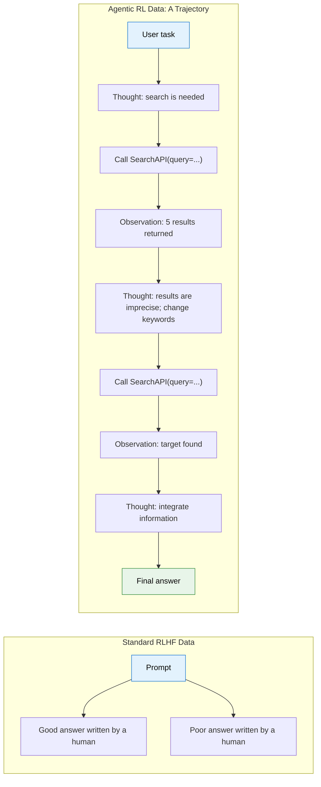
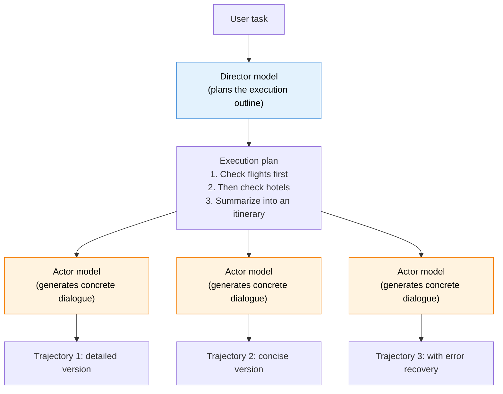
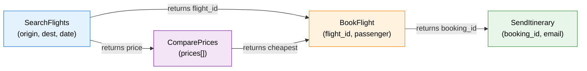
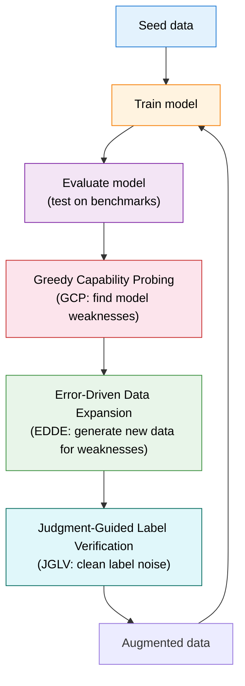
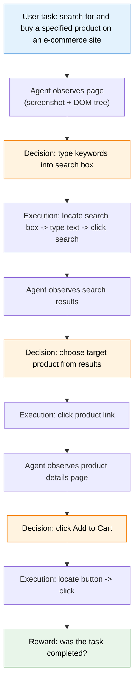
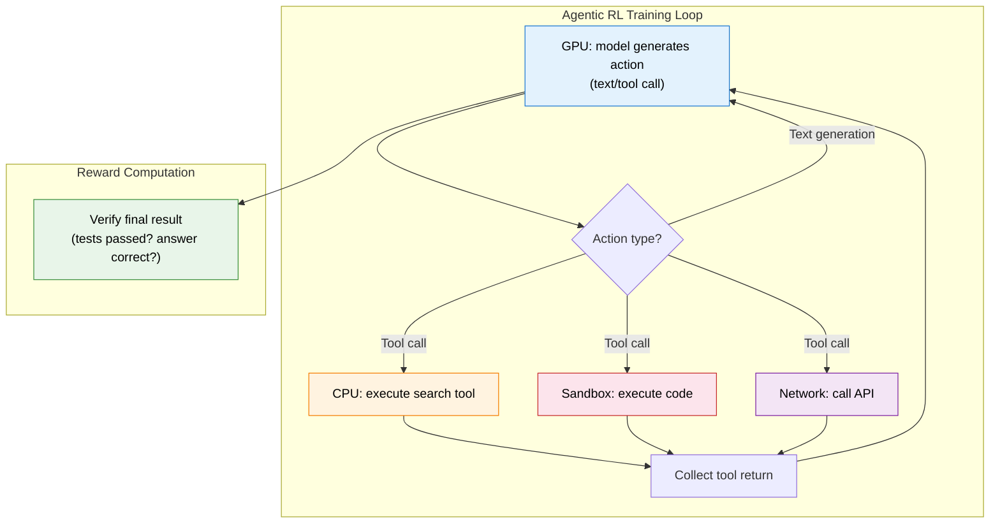
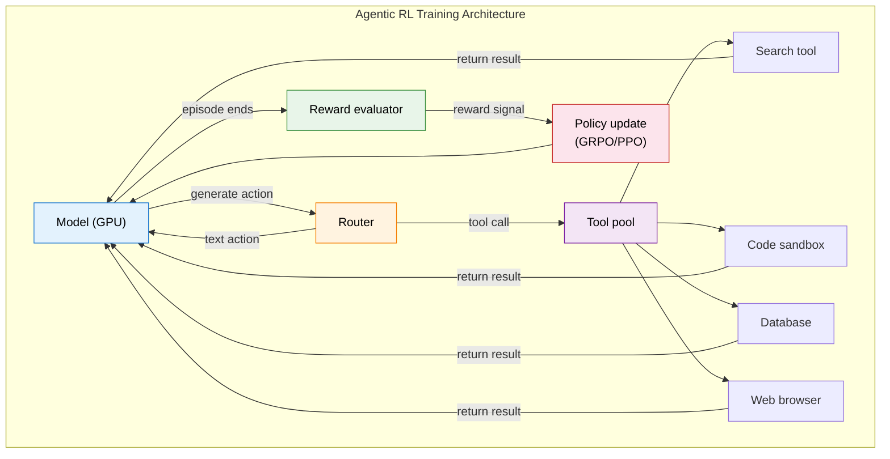

# 10.2 Tool Use, Trajectory Synthesis, and Agentic Engineering

This section merges the original topics of "trajectory synthesis and data engineering" and "tool use and Agentic engineering" into one engineering storyline. We first ask where the training data comes from, then discuss how a model learns tool-use policies, and finally land on the environment, sandboxing, asynchronous rollout, and reward-design problems that real training systems must solve.

## Trajectory Synthesis: Where Does the Training Data Come From?

In the previous section, we unpacked the credit-assignment problem in multi-turn RL. But before training begins, there is an even more basic question: **where does the data come from?** Standard LLM RL, such as GRPO in Chapter 9, only needs a prompt plus a verifiable answer. The model generates the response itself and checks it itself; no external data is required. Agentic RL is different. The model must interact with an environment: call tools, execute code, browse the web. The "trajectories" produced by these interactions are both the training data and the source of reward. High-quality trajectories determine the ceiling of the model. In this section, we unpack the data-engineering core of Agentic RL: trajectory synthesis.

### Why Do We Need Trajectory Synthesis?

Agentic RL training data is fundamentally different from standard RLHF data. In RLHF, the data is "good answers written by humans" and "preference pairs annotated by humans." In Agentic RL, the data is a complete **interaction trajectory**: every step of reasoning, every tool call, and every observation returned during a multi-turn conversation.



Writing such a trajectory by hand is more than ten times as expensive as writing a good answer, because every step requires the annotator to: (1) decide how the model should reason; (2) construct reasonable tool-call parameters; (3) simulate the results returned by the tools; and (4) ensure that the whole trajectory is logically coherent. A seven-turn trajectory may take an expert 30 minutes to write.

This leads to the core motivation for trajectory synthesis: **use algorithms to automatically generate large quantities of high-quality interaction trajectories, replacing expensive manual annotation**.

### Six Mainstream Synthesis Methods

#### Method 1: Rejection Sampling, the Simplest Approach

The idea behind rejection sampling is extremely intuitive: let the current model attempt the same task repeatedly, and keep only the successful trajectories as training data.

```python
def rejection_sampling(model, task, tool_env, num_samples=64):
    """Rejection sampling: generate many trajectories and keep only the successful ones."""
    trajectories = []
    for _ in range(num_samples):
        traj = model.interact_with_tools(task, tool_env)
        if traj.final_success:  # Keep only successful trajectories.
            trajectories.append(traj)
    return trajectories

# Problem: if the model's success rate is only 5%, sampling 64 times yields only about 3 successful trajectories.
# Worse, those 3 trajectories may all follow the same success path and lack diversity.
```

The advantage of rejection sampling is that it is **simple to implement**. You only need a verifier that can judge "success" or "failure." The RLVR training in Chapter 9 uses exactly this idea.

Its weaknesses are also obvious: **low efficiency and poor diversity**. If the current success rate of the model is only 5%, you need to sample 20 trajectories to obtain one success. More seriously, successful trajectories tend to concentrate on "strategies the model already knows well." Paths the model has not explored, even if they might be better, never appear under rejection sampling.

#### Method 2: Director-Actor, Separating Planning from Execution

To address the diversity problem of rejection sampling, researchers proposed the "Director-Actor" pattern. The core idea is to **split trajectory generation into two levels: macro-level planning and micro-level execution**.



The director model understands the task objective and generates a high-level execution outline: "do A first, then B, and finally C." The actor model fills in the details according to the outline, generating concrete tool-call parameters and natural-language responses. This separation brings two benefits.

**Logical coherence is easier to guarantee.** The director ensures that the outline itself is reasonable, and the actor only needs to "perform according to the script." This is much more stable than asking one model to handle planning and execution at the same time, just as directors and actors have different jobs in a film.

**The same outline can generate multiple different trajectories.** By changing the actor model, or changing the sampling temperature, the same outline of "check flights first, then hotels" can produce trajectories in different styles. This increases training-data diversity.

Representative works include IBSEN[^ibsen], CoDi, and related frameworks. This pattern is especially good at simulating complex multi-step interaction scenarios.

#### Method 3: Graph-Based Synthesis, Magnet[^magnet]

Magnet takes a more structured approach. It models the calling relationships among tools as a **Function Signature Graph**, then generates logically rigorous trajectories through graph operations.

The nodes of the graph are tool parameters and return values, and the edges are data flows. For example, the return value of a "search flights" tool contains a `flight_id`, while a "book flight" tool requires `flight_id` as input. There is therefore an edge between these two tools.



Magnet defines two core graph operations.

**MAGNIFY**: select a node in the graph and expand its internal structure to generate a more fine-grained call chain. For example, "search flights" can be expanded into "construct query -> call API -> parse results -> filter."

**CONNECT**: create a new path between two nodes that are not directly connected. This can generate complex call chains spanning multiple tools, such as "search flights -> compare prices -> book the cheapest one -> send itinerary."

Magnet's core advantage is that it **guarantees the logical correctness of tool calls at the source**. Paths generated from the graph are legal by construction: parameter types match and call order is reasonable. This is much more reliable than asking an LLM to freely generate calls. The Magnet-14B model trained with this method outperformed its teacher model on BFCL-v3 and ToolQuery.

#### Method 4: Closed-Loop Iteration, LoopTool[^looptool]

LoopTool is currently one of the most active trajectory-synthesis frameworks in the community. It addresses a common weakness of the previous three methods: **the generated data is static and does not adapt to the model's weaknesses**.

LoopTool's core innovation is a **closed loop that tightly couples data generation with model training**.



The closed loop contains three key modules.

**Greedy Capability Probing (GCP)**: run the model on a test set and measure which capability dimensions have the highest failure rates. For example, it may find that the success rate for "handling optional parameters" is only 30%, while the success rate for "basic single-tool calls" is already 90%.

**Error-Driven Data Expansion (EDDE)**: generate new training examples targeted at the weaknesses discovered by GCP. If the model performs poorly on "handling optional parameters," EDDE generates many tool-call trajectories involving optional parameters.

**Judgment-Guided Label Verification (JGLV)**: use a judge model to automatically check whether the labels of synthetic data are correct and remove noise. This step is important. Synthetic data inevitably contains wrong labels, such as "should call tool A" being labeled as "call tool B." If such data is not cleaned, it will mislead training.

LoopTool's experimental results are impressive. Using a 32B Qwen3 model as the data generator, it trains an 8B model that **surpasses the 32B generator itself** on BFCL-v3. This shows that the data quality achieved by closed-loop iteration can far exceed static synthesis.

#### Method 5: Difficulty Adaptation, HardGen[^hardgen]

HardGen specifically addresses the problem that synthetic data is often "too easy." Its core insight is that **model improvement mainly comes from difficult examples**. Simple trajectories, such as tasks solved with a single tool call, contribute little to training.

HardGen first lets the model attempt a batch of tasks and collects failure cases. It then builds a **dynamic API graph** from those failures, analyzing which tool combinations and parameter types the model is most likely to fail on. Next, it uses this graph to generate difficult trajectories, ensuring that every trajectory touches the model's weaknesses.

Experiments show that a 4B model trained on HardGen data outperforms several mainstream closed-source models. This again confirms that difficult examples are far more valuable than easy examples.

#### Method 6: Hindsight Rewriting, ECHO[^echo]

ECHO follows the same spirit as HER, Hindsight Experience Replay, which we will meet in Chapter 11: **failed trajectories do not have to be thrown away. Change the goal, and they become successful trajectories**.

In Section 11.3, we will see HER in robotics. The robot's goal is to "put the ball at position A," but it actually puts the ball at position B. From the perspective of goal A, this is a failure; from the perspective of goal B, it is a perfect success. ECHO brings this idea to LLM trajectories. It first uses an LLM to analyze what a failed trajectory actually accomplished, then changes the goal label to the goal that was actually achieved. The failed trajectory is rewritten as a successful example for a new goal.

This method greatly improves sample efficiency. Under rejection sampling, failed trajectories are directly discarded. But if the model's current success rate is only 10%, then 90% of the generations are wasted. ECHO makes these "wasted" trajectories valuable again. Combined with the discussion in Section 11.3, we can understand ECHO as "HER applied in language space": HER changes the target position label in robotics, while ECHO changes the semantic goal label of a language task.

#### End-to-End Synthesis: ASTRA[^astra]

The six methods above focus on "how to generate high-quality trajectories." ASTRA goes one step further. It not only synthesizes multi-turn interaction trajectories, but also **automatically packages the trajectories into independent, verifiable RL training environments**. This means the whole process from "data generation" to "environment construction" is automated. Given only a task specification, ASTRA can output pairs of trajectories and environments that can be directly used for GRPO/PPO training. This end-to-end idea is especially suitable for engineering scenarios that need to quickly build training data for new domains. The framework unifies SFT data, synthetic trajectories, and RL environments, verifiable arenas, in one pipeline. The official code and environments have been open-sourced.

### Comparing the Six Methods

| Method                | Core idea                                                    | Diversity | Quality     | Cost   | Representative work |
| --------------------- | ------------------------------------------------------------ | --------- | ----------- | ------ | ------------------- |
| Rejection sampling    | Generate -> filter -> keep only successes                    | Low       | Medium      | Low    | GRPO, TinyZero      |
| Director-Actor        | Separate planning from execution                             | Medium    | High        | Medium | IBSEN, CoDi         |
| Graph synthesis       | Generate legal paths from a tool-relation graph              | High      | Very high   | High   | Magnet              |
| Closed-loop iteration | Train -> diagnose weaknesses -> targeted strengthening       | Adaptive  | Highest     | Medium | LoopTool            |
| Difficulty adaptation | Generate difficult examples from failures                    | Adaptive  | High        | Medium | HardGen             |
| Hindsight rewriting   | Turn failed trajectories into successes by changing the goal | High      | Medium-high | Low    | ECHO                |

In practice, **LoopTool's closed-loop iteration is the most recommended idea**. It does not require you to know in advance what mistakes the model will make; the system discovers and strengthens weaknesses automatically. If your resources are limited, rejection sampling is the easiest starting point.

### Trajectory Quality Control: Synthesis Is Not the End

No matter which method generates the trajectories, **quality control** is required. Synthetic data inevitably contains noise: wrong tool-call parameters, logically incoherent reasoning steps, and even "accidentally successful" trajectories that reach the right result by taking a terrible path.

Quality control usually has three dimensions.

**Correctness**: Are the tool-call parameters correct? Is the call order reasonable? This can be checked with **automatic verifiers**: static-analysis tools can inspect parameter types, while executors can actually run the calls and verify results.

**Diversity**: Do the trajectories cover different strategies? If 100 trajectories all follow the same pattern of "search first, then summarize," the model will not learn the alternative strategy of "analyze first, then search." This is often measured by **clustering trajectory embeddings**. If trajectories form multiple clusters in embedding space, they cover multiple strategies.

**Difficulty distribution**: Is the ratio of easy, medium, and difficult examples reasonable? Too many easy examples let the model "settle" into known strategies; too many difficult examples may destabilize training. A good distribution is often 30% easy, 50% medium, and 20% difficult.

**Step-level calibration**: Beyond filtering and ranking, there is a more fine-grained method: **directly correct undesirable steps inside trajectories**. The core insight of STeCa, Step-level Trajectory Calibration[^steca], is that if a trajectory is mostly correct but contains a few flawed steps, it is better to find and fix those steps than to discard the whole trajectory. The method identifies which steps lower overall quality through step-level reward comparison, then uses a stronger model or rules to calibrate those steps. This is much more precise than a simple success/failure binary split. A trajectory may do well in 6 out of 7 steps, with only the fourth step using a suboptimal search strategy. STeCa keeps the first 6 good steps, calibrates only the fourth, and obtains a trajectory better than the original.

```python
def filter_trajectories(trajectories, quality_threshold=0.7):
    """Trajectory quality control: filter low-quality synthetic data."""
    filtered = []
    for traj in trajectories:
        # 1. Correctness check: are tool-call arguments legal?
        if not all(is_valid_call(call) for call in traj.tool_calls):
            continue

        # 2. Coherence check: are there logical jumps between adjacent steps?
        if not is_coherent(traj):
            continue

        # 3. Difficulty assessment: is the trajectory too simple, finishing in only 1-2 steps?
        if len(traj.turns) < 2 and traj.success:
            continue  # Skip overly simple successful trajectories.

        # 4. Overall quality score.
        if traj.quality_score >= quality_threshold:
            filtered.append(traj)

    return filtered
```

### How Trajectory Synthesis Connects to Chapter 9

You may have noticed that many ideas in trajectory synthesis are closely related to RLVR from Chapter 9. The core of RLVR is "use verifiable outcomes as reward." Trajectory synthesis pushes this idea one step earlier: verification is used not only for reward, but also to **filter and generate better training data**.

Concretely, RLVR has three uses at the data layer of Agentic RL:

1. **Filtering**: generate many trajectories and use an RLVR verifier to remove incorrect ones, as in rejection sampling.
2. **Ranking**: rank multiple trajectories by RLVR signal and use the ranking to guide within-group comparison in GRPO.
3. **Diagnosis**: analyze trajectories that fail verification, identify the model's systematic weaknesses, and generate targeted strengthening data, as in LoopTool's GCP module.

This also explains why Agentic RL is considered more suitable for trajectory synthesis than RLHF. RLHF requires manually annotated preferences, which are expensive and hard to scale. Agentic RL can obtain reward automatically through environment interaction: whether code passes tests, whether search results contain target information, and so on. These can all be automatically verified.

It is also worth noting that trajectory synthesis can do more than distill from existing data. It can use "search" to generate higher-quality trajectories. TSR, Trajectory-Search Rollouts[^tsr], takes test-time search techniques that Chapter 12 will discuss, such as beam search and best-of-N, and moves them into training-time rollouts. When generating a trajectory, TSR does not sample randomly. It uses search strategies to explore multiple paths, then selects the highest-quality trajectories as training data. Experiments show that combining TSR with PPO or GRPO can bring up to 15% performance improvement. In essence, TSR gives training-time data generation the ability to "think," instead of merely exploring at random.

<details>
<summary>Reflection question: Are "successful trajectories" generated by rejection sampling necessarily good training data?</summary>

Not necessarily. Rejection sampling keeps all successful trajectories, but "successful" is not the same as "a good strategy."

Consider a task where the model needs to search for a factual answer. The model uses a very inefficient strategy: it first searches 5 irrelevant keywords, and only happens to find the answer on the sixth search. The trajectory "succeeds," but the first 5 searches are completely useless. If this trajectory is used for training, the model may learn the inefficient strategy that "searching many times will eventually find it."

This is why "efficiency evaluation" in trajectory quality control matters. We should not only ask whether the final outcome succeeded, but also whether the path to success was efficient. The reward-design discussion in the second half of this section introduces efficiency penalties, which are meant to solve exactly this problem.

</details>

<details>
<summary>Reflection question: Why can an 8B model trained on data generated by a 32B model in LoopTool surpass the 32B generator?</summary>

This seems counterintuitive: "the student surpasses the teacher." The key is LoopTool's closed-loop iteration mechanism.

When the 32B model generates the initial data, the data quality is limited by the model's own ability. But LoopTool is not a "generate once and stop" process. It diagnoses the 8B model's weaknesses and adds targeted data. After multiple rounds of iteration, the final dataset is the accumulation of "initial data from the 32B model plus multiple rounds of strengthening data targeted at the 8B model's weaknesses." The quality of this accumulated dataset can far exceed the data generated by the 32B model in a single pass.

The deeper reason is that **generating data and understanding data are two different abilities**. Although the 8B model's generation ability is weaker than the 32B model's, its ability to learn and generalize may not be inferior. If it receives better training data, it can realize more of its potential. This is also why "data quality > model scale" is becoming a community consensus.

</details>

### Hands-On Code: A Simple Trajectory Synthesis Pipeline

The following code combines rejection sampling with simple quality control to form a basic trajectory-synthesis pipeline.

```python
from dataclasses import dataclass, field
from typing import List, Optional
import random

@dataclass
class Trajectory:
    """A complete interaction trajectory."""
    task: str                          # User task.
    turns: List[dict] = field(default_factory=list)  # Per-turn (thought, action, observation).
    success: bool = False              # Whether the final outcome succeeded.
    num_tool_calls: int = 0            # Number of tool calls.

def trajectory_synthesis_pipeline(
    model, tool_env, tasks, num_samples_per_task=16, quality_threshold=0.6
):
    """Simple trajectory synthesis pipeline: rejection sampling + quality filtering."""
    all_trajectories = []

    for task in tasks:
        # Stage 1: batch sampling.
        candidates = []
        for _ in range(num_samples_per_task):
            traj = model.interact_with_tools(task, tool_env)
            candidates.append(traj)

        # Stage 2: rejection sampling; keep only successful trajectories.
        success_trajs = [t for t in candidates if t.success]

        # Stage 3: quality filtering.
        for traj in success_trajs:
            # Efficiency check: succeeding only after more than 8 tool calls means the strategy is inefficient.
            if traj.num_tool_calls > 8:
                continue

            # Diversity check: duplication with existing trajectories.
            if not is_too_similar(traj, all_trajectories):
                traj.quality_score = compute_quality(traj)
                if traj.quality_score >= quality_threshold:
                    all_trajectories.append(traj)

    return all_trajectories

def is_too_similar(new_traj, existing_trajs, threshold=0.85):
    """Check whether the new trajectory is too similar to existing ones, based on action sequences."""
    new_actions = [t["action"] for t in new_traj.turns]
    for old_traj in existing_trajs:
        old_actions = [t["action"] for t in old_traj.turns]
        # Simplification: use Jaccard similarity over action sequences.
        overlap = len(set(new_actions) & set(old_actions))
        union = len(set(new_actions) | set(old_actions))
        if union > 0 and overlap / union > threshold:
            return True
    return False

def compute_quality(traj):
    """Compute an overall quality score for a trajectory."""
    # Efficiency score: fewer tool calls are better, encouraging efficient strategies.
    efficiency = max(0.0, 1.0 - 0.1 * traj.num_tool_calls)

    # Completeness score: every turn has a complete (thought, action, observation).
    completeness = sum(
        1 for t in traj.turns
        if t.get("thought") and t.get("action") and t.get("observation")
    ) / max(len(traj.turns), 1)

    return 0.5 * efficiency + 0.5 * completeness
```

This pipeline is simple, but it contains the core stages of trajectory synthesis: generation, filtering, and quality control. In real engineering systems, you can gradually replace rejection sampling with LoopTool-style closed-loop iteration, and replace simple quality checks with more fine-grained verifiers.

Next, we focus on another key dimension of Agentic RL: tool-use RL, and how a model learns "when to use a tool and which tool to use."

### References

[^ibsen]: Han S, Chen L, Lin L-M, et al. "[IBSEN: Director-Actor Agent Collaboration for Controllable and Interactive Drama Script Generation](https://arxiv.org/abs/2407.01093)." ACL 2024. A representative Director-Actor work that splits trajectory generation into planning and execution.

[^magnet]: Yin F, Wang Z, Hsu I-H, et al. "[Magnet: Multi-turn Tool-use Data Synthesis and Distillation via Graph Translation](https://arxiv.org/abs/2503.07826)." ACL 2025. Graph-based trajectory synthesis using function signature graphs and MAGNIFY/CONNECT operations to generate legal call paths.

[^looptool]: LoopTool Team. "[LoopTool: Closing the Data-Training Loop for Robust LLM Tool Calls](https://arxiv.org/abs/2511.09148)." arXiv:2511.09148, 2025. A closed-loop iteration framework that uses GCP, JGLV, and EDDE to make data evolve with the model. [GitHub](https://github.com/Rednote-DeepExperience/LoopTool)

[^hardgen]: Hao B, et al. "[From Failure to Mastery: Generating Hard Samples for Tool-use Agents](https://arxiv.org/abs/2601.01498)." arXiv:2601.01498, 2026. Targeted generation of difficult training data from model failure cases. [Dataset](https://huggingface.co/datasets/Bingguang/HardGen)

[^echo]: Hu B, et al. "[Sample-Efficient Online Learning in LM Agents via Hindsight Trajectory Rewriting](https://arxiv.org/abs/2510.10304)." arXiv:2510.10304, 2025. ECHO borrows hindsight replay from HER and rewrites failed trajectories as successful examples for other goals, greatly improving sample efficiency.

[^astra]: Tian X, Wang H, et al. "[ASTRA: Automated Synthesis of agentic Trajectories and Reinforcement Arenas](https://arxiv.org/abs/2601.21558)." arXiv:2601.21558, 2026. End-to-end framework that automatically synthesizes multi-turn interaction trajectories and packages them as verifiable RL environments. [GitHub](https://github.com/LianjiaTech/astra)

[^tsr]: Djuhera A, Kadhe S, et al. "[TSR: Trajectory-Search Rollouts for Multi-Turn RL of LLM Agents](https://arxiv.org/abs/2602.11767)." arXiv:2602.11767, 2026. Moves test-time search, such as beam search and best-of-N, into training-time rollouts, with up to 15% performance improvement.

[^steca]: Wang H, Wang J, et al. "[STeCa: Step-level Trajectory Calibration for LLM Agent Learning](https://arxiv.org/abs/2502.14276)." ACL 2025 Findings. Identifies and corrects undesirable actions in trajectories through step-level reward comparison, instead of simple filtering. [GitHub](https://github.com/WangHanLinHenry/STeCa)

---

## Tool-Use RL: Web Agents and Code Agents

In the previous section, we unpacked the credit-assignment problem in multi-turn RL: if a seven-turn interaction fails, which step should be blamed? Now we focus on another key question: how does a model learn to "use tools"? Supervised fine-tuning, SFT, can teach the model "what the JSON format of a tool call looks like," but it cannot teach the model "when to call a tool, which tool to call, and how to combine multiple tools." The latter requires strategic decision-making, and this is exactly where RL is useful.

### Why Is RL Essential for Tool Use?

Imagine you are training a model to help users analyze data. During SFT, you show it thousands of examples of "correct tool calls," and the model learns:

```json
{ "tool": "sql_query", "query": "SELECT * FROM users WHERE age > 30" }
```

It learns the format. But in real use, the model faces strategic decisions:

- When the user asks, "How many of our high-end users do we have?", should the model query the database directly, or first search internal documentation to understand the definition of "high-end user"?
- After querying the database and finding 100,000 records, should it filter further or compute aggregate statistics?
- After aggregation reveals an anomaly, should it report the anomaly or try another query method?

These decisions have no single "standard answer." Different strategies may lead to different outcomes. SFT can only teach the model to imitate expert trajectories; it cannot teach the model to explore better strategies. The advantage of RL is that you only need to tell the model whether the final result is correct, and the model learns through trial and error when to use which tool.

|                     | SFT                                           | RL                                                         |
| ------------------- | --------------------------------------------- | ---------------------------------------------------------- |
| What is learned     | Syntax and format of tool calls               | When to call, which tool to call, and how to combine tools |
| Training data       | Manually annotated tool-call trajectories     | Only final outcome, success/failure, as reward             |
| Generalization      | Can only handle tool combinations it has seen | Can explore new tool-use strategies                        |
| Error recovery      | Does not teach recovery from errors           | Learns to repair strategies through trial and error        |
| Representative work | Toolformer[^toolformer]                       | ReTool, VERL-TOOL, ToolRL                                  |

### Core Methods

#### ReTool: Calling Tools During Reasoning[^retool]

ReTool, Reasoning with Tools, lets the model call tools **freely** during reasoning, instead of deciding in advance "when to call." While generating an answer, the model can pause text generation at any time, call a tool such as a calculator or code interpreter, receive the result, and continue generation.

The role of RL is to optimize the policy for "when to call a tool." The model may discover that for simple arithmetic, mental calculation is faster than calling a calculator; but for complex numerical computation, a calculator is more accurate. Such context-dependent strategy is hard to teach with SFT, but RL can let the model discover it from reward signals.

#### VERL-TOOL: Cross-Domain Tool Calling[^verltool]

VERL-TOOL is a cross-domain RL training framework for tool use. It covers math reasoning, SQL generation, web search, software engineering, and other scenarios. Its key innovation is a **unified tool-call interface**: tools from different domains, such as calculators, databases, and search engines, are abstracted into a unified RL action space and can be trained with the same RL algorithms.

#### MCP-RL: Turning a Tool Protocol into a Training Environment[^mcp_intro][^mcp_tools][^mcprl]

From another angle, tool-use RL has an easily underestimated problem: tools are highly fragmented. Search tools have one interface, database tools have another, and file-system tools yet another. For product engineering, this is already troublesome. For RL training, it is even more serious, because the training system must know not only "which tools exist," but also each tool's parameter schema, return format, error states, permission boundary, and how a tool call should be recorded in a trajectory.

This is exactly why MCP, the Model Context Protocol, belongs in an Agentic RL textbook. MCP itself is not an RL algorithm. It is more like a **standard interface layer for tool environments**. Servers expose tools, resources, and prompts to the model. Tools are discovered through `tools/list` and invoked through `tools/call`. Each tool has a name, description, input schema, and optional output schema. In other words, MCP organizes "what the external world can do" into a structured action space readable by both the model and the training system.

Once MCP is placed inside the RL training loop, the elements of the MDP become clearer:

| RL element             | Corresponding object in MCP-RL                                                                                                          |
| ---------------------- | --------------------------------------------------------------------------------------------------------------------------------------- |
| State $s_t$            | Current conversation, observed tool results, available MCP servers and tool lists                                                       |
| Action $a_t$           | Continue generating text, or choose an MCP tool and fill in JSON arguments                                                              |
| Environment transition | MCP server executes the tool and returns text, structured content, images, or resource links                                            |
| Trajectory record      | Model output, `tools/call` arguments, tool return, errors, and latency                                                                  |
| Reward                 | Whether the task was completed, whether tool selection was reasonable, whether arguments were correct, and whether calls were efficient |

The meaning behind this table is that MCP turns tool calling from "a pile of engineering glue code" into "an environment interface that can be observed and optimized by an RL system." In an ordinary application, a failed tool call may just be an error. In RL training, it becomes part of the trajectory, affects reward, and affects the next policy update. If the model calls a nonexistent tool, fills in the wrong arguments, repeatedly calls the same low-value tool, or keeps searching even after the returned information is sufficient, all of this can be recorded and turned into training signal.

Look at it from another angle. Without a unified protocol, every new tool requires the training system to write a separate parser, executor, and logging format. A policy trained this way can easily overfit to a fixed tool set and fail when the environment changes. MCP's value is that it moves "tool descriptions" into structured information: what the model sees is not just a natural-language prompt, but a schema-bearing set of action candidates. Training is no longer merely about "imitating one tool-call format"; it becomes learning to choose among discoverable actions.

This also changes how we understand trajectory data. Ordinary LLM trajectories are mainly token sequences. MCP-RL trajectories look more like structured execution logs: which tools were discovered at which turn, which tool was selected, whether the arguments were legal, what the tool returned, whether it timed out, and whether the final task was completed. During training, tool returns themselves usually should not participate in the model loss. What should be reinforced are the decision tokens generated by the model: why it chose this tool, why it filled these arguments, and why it stopped at this moment. This is the same class of problem as the loss masks discussed earlier for SearchR1 and Code Agents.

OpenPipe's MCP-RL article gives a very intuitive training pipeline: first automatically discover tools from MCP servers; then generate training scenarios based on the tool list; sample multiple agent trajectories for the same scenario; use relative-scoring methods such as RULER, an LLM-as-judge approach, to compare trajectory quality; finally update the model with GRPO. The key is not that "yet another new algorithm" has been invented, but that MCP allows different tool servers to be connected to the same training process. Today you can train a database agent; tomorrow you can switch to a file-management agent or weather agent while keeping the broad training code unchanged.

This pipeline is especially suitable for teaching, because it connects several parts of Agentic RL into one line. MCP provides the action space. Scenario generation constructs the task distribution. Multiple rollouts provide exploration. RULER or another reward method compares the quality of trajectories. GRPO converts relative quality into a policy update. What this step really shows is that the protocol layer, data layer, reward layer, and algorithm layer each have their own job. If these four layers are not separated, many discussions become tangled: "tools are easy to connect" is mistaken for "the model has learned to use tools," or "the tool call succeeded" is mistaken for "the policy is optimal."

However, MCP-RL also reminds us of an important boundary: **a standardized interface does not solve safety or reward design**. The MCP specification explicitly states that tools may represent arbitrary code execution or data access, so clients must handle user authorization, privacy, and tool safety. In RL training, this is even more important. The model explores tool calls for reward. If the training environment has no sandbox, permission isolation, request cache, or audit logs, MCP will only make tools easier to connect; it will not automatically make exploration safe.

There is another finer boundary: MCP can standardize "how to call a tool," but it cannot automatically define "what it means to call it well." For the same `search` tool, a fact-checking question should encourage multi-source cross-validation; a simple date question should penalize excessive search; a coding question may require combining search results with local test results. In other words, MCP provides the action interface, but reward must still be determined by task semantics. The real issue is that the easier tools are to connect, the more carefully reward must be designed; otherwise, the model may learn not "how to solve problems better," but "how to exploit the tool interface to get points."

Therefore, the best positioning for MCP in this chapter is that it is the **environment abstraction and tool-protocol layer** of Agentic RL. PPO, GRPO, and GSPO still handle policy optimization. RLVR, RULER, and PRMs still handle reward. MCP organizes external tools into a discoverable, callable, and recordable environment interface. Once this division of labor is clear, the reader can understand why "training an agent that can use tools" is not only a model problem, but also a protocol, environment, and evaluation problem.

#### ToolRL: Tools as RL Actions[^toolrl]

ToolRL treats tool calls as a **special action** in RL, expanding the policy's action space. The action space of a standard LLM is the vocabulary, tens of thousands of tokens. ToolRL adds actions such as "call tool A" and "call tool B" on top of that. The policy network must choose between "generate text" and "call a tool."

```python
class ToolAugmentedPolicy(nn.Module):
    """Tool-augmented policy network: choose between text generation and tool calls."""

    def __init__(self, base_model, tools):
        super().__init__()
        self.base_model = base_model  # Base LLM.
        self.tools = tools             # Available tools.

    def forward(self, state):
        """
        Given the current state, conversation history plus tool returns,
        decide whether the next step is text generation or a tool call.
        """
        # The base model outputs logits.
        logits = self.base_model(state)

        # Detect the special "tool-call token."
        # If the model chooses a tool-call token, parse arguments and execute the call.
        if self._is_tool_call(logits):
            tool_name, tool_args = self._parse_tool_call(logits)
            return ToolAction(tool_name, tool_args)
        else:
            return TextAction(logits)  # Normal text generation.
```

### Reward Design: The Scenario Determines the Reward

Tool-call reward is not as subjective as preference alignment. It can be designed from objective signals. This is a direct application of **RLVR, Reinforcement Learning from Verifiable Rewards**, from Chapter 9 in agentic scenarios.

| Scenario        | Reward source                                | Type                             | Special consideration                  |
| --------------- | -------------------------------------------- | -------------------------------- | -------------------------------------- |
| Code generation | Unit-test pass rate                          | Continuous, 0-1                  | Partial pass receives partial reward   |
| Math reasoning  | Whether final answer is correct              | Binary, 0/1                      | Intermediate steps can use a PRM       |
| Web search      | Whether the correct answer was found         | Binary + path-efficiency penalty | Encourage fewer search rounds          |
| SQL generation  | Whether query results match expectation      | Binary + execution-time penalty  | Avoid inefficient queries              |
| Data analysis   | Whether conclusions are correct and complete | Multi-dimensional score          | Evaluate both accuracy and readability |

One notable pattern is that many agentic rewards include **efficiency penalties**. This is not only to make the model faster, but also because every tool call has a cost: API fees, latency, and resource consumption. A good agent does not merely "complete the task"; it "completes the task efficiently."

Formally, the total reward for tool-use RL can be written as:

$$R_{\text{total}} = R_{\text{task}} - \lambda_{\text{efficiency}} \cdot T - \lambda_{\text{format}} \cdot \mathbb{1}(\text{format error})$$

Here, $R_{\text{task}}$ is the task-completion reward, 0 or 1; $T$ is the number of interaction turns used; $\lambda_{\text{efficiency}}$ is the efficiency-penalty coefficient; and $\lambda_{\text{format}}$ is the format-error penalty. This formula unifies "completing the task successfully" and "completing it efficiently" into one reward signal.

```python
def compute_agent_reward(task_success, num_turns, max_turns=10):
    """Compute the overall reward for Agentic RL."""
    # Base reward for task completion.
    success_reward = 1.0 if task_success else 0.0

    # Efficiency penalty: more turns mean a larger penalty.
    efficiency_penalty = -0.1 * (num_turns / max_turns)

    # Extra penalty for malformed tool calls.
    # For example, the model generated a tool call that cannot be parsed.
    format_penalty = -0.5 if has_format_error else 0.0

    return success_reward + efficiency_penalty + format_penalty
```

### Web Agent RL: Teaching a Model to Use the Web

Web Agents are one of the most intuitive applications of Agentic RL: train an agent that can browse web pages, fill forms, and search for information. This sounds simple, but it is full of challenges in implementation.

**Action space.** A Web Agent's actions are not "generate text," but browser-level operations: click an element, type text into an input box, scroll the page, navigate to a new URL. Each action must precisely locate a target element, usually through coordinates `(x, y)` or a DOM element ID.

**State space.** The state received by a Web Agent usually has two parts: a page screenshot, visual information, and the DOM tree, structural information. The screenshot gives visual layout; the DOM tree gives precise element locations. Neither is sufficient alone. Screenshots alone make it hard to click small buttons precisely, while the DOM tree alone makes it hard to understand visual layout.

**Reward signal.** Web Agent reward is based on task completion. For example, for "book a flight from Beijing to Shanghai tomorrow on Ctrip," reward depends on whether the agent found the correct flight, filled all information successfully, and submitted the order.



The main challenge of Web Agent RL is the huge and dynamic state space. A web page may have thousands of DOM elements. Page content may load dynamically. The layout of the same website may change over time. This means the agent needs strong generalization: it cannot memorize that "a certain button is in the upper-left corner"; it must understand what a submit button usually looks like.

#### ReLook: Grading Web Pages with Eyes[^relook]

Existing Web Agent rewards mainly rely on DOM-structure matching or binary judgments of task completion. ReLook introduces a new source of reward: **visual feedback**. Its workflow is: the agent generates web-page code, the code is rendered into a screenshot, a multimodal LLM scores the screenshot visually, and the visual score becomes the RL reward. This "look at the result and then grade it" approach is closer to how humans judge a good web page than pure text rewards, because users see the rendered page, not the source code.

#### Agent Workflow Memory: Learning Workflows from Experience[^awm]

Agent Workflow Memory, AWM, addresses the **memory** problem of Web Agents. AWM extracts reusable workflows from an agent's past successful experiences and proactively provides relevant workflows to guide the agent in future tasks. For example, after many shopping tasks, the agent may learn a general workflow: "search first -> add to cart -> fill address -> pay." AWM stores this workflow and automatically activates it the next time a similar shopping task appears. Experiments on WebArena and Mind2Web show that this "learn from experience" approach significantly improves the agent's generalization to new websites.

#### Web-Shepherd: A PRM Built for Web Navigation[^webshepherd2]

In the previous section, we mentioned Web-Shepherd as a real-world case of PRM deployment. Here we discuss its concrete use in Web Agents in more detail. Traditional Web Agent rewards have only one signal: whether the final task was completed. Web-Shepherd assigns a score after each action: "Was this click correct?" "Was this form filled correctly?" It uses a structured checklist to guide evaluation, and a dedicated PRM trained on 40,000 annotated examples. Its evaluation cost is only one-tenth that of using GPT-4o-mini as a judge. This allows Web Agent training to replace sparse episode-level reward with denser step-level reward, greatly improving both training efficiency and final performance.

### Code Agent RL: Write Code, Debug, and Iterate

Code Agent RL trains agents that can **write code, execute code, read errors, and fix code**. This is closer to how real programmers work than one-shot code generation: programmers do not write perfect code at once; they complete tasks through the loop "write -> execute -> error -> fix."

Code Agent RL has a natural advantage: **the reward is very clear**. Code either passes all unit tests, reward = 1, or it does not, reward < 1 with partial credit by pass rate. This is easier to quantify and automate than Web Agent task completion.

```python
def code_agent_reward(generated_code, test_cases):
    """Code Agent reward: based on test pass rate."""
    results = []
    for test_input, expected_output in test_cases:
        try:
            # Execute generated code in a sandbox.
            actual_output = execute_in_sandbox(generated_code, test_input)
            results.append(actual_output == expected_output)
        except Exception:
            results.append(False)  # Execution exception means the test failed.

    # Base reward is the pass rate.
    pass_rate = sum(results) / len(results)

    # Extra reward: code simplicity, shorter is better but with a minimum requirement.
    # Extra penalty: execution time is too long.
    return pass_rate
```

One key finding in Code Agent RL comes from ICML 2025 research: **single-step reward can effectively guide multi-turn code generation**. In other words, you do not need to reward every cycle of "write code -> execute -> error -> fix." A single signal for whether the final code passes tests is enough for the model to learn the full strategy of "write correct code -> repair errors." This is consistent with the ORM idea from the previous section: if the reward is clear enough, sparse signals can work.

#### rStar2-Agent: A Practical Benchmark Where 14B Beats 671B[^rstar2]

If the previous discussion was about "theoretical feasibility," rStar2-Agent is one of the strongest practical demonstrations. This 14B-parameter model trained by Microsoft used **only 510 RL training steps** on 64 AMD MI300X GPUs and reached 80.6% accuracy on the AIME24 math competition, surpassing the 671B-parameter DeepSeek-R1.

rStar2-Agent's core innovation is **GRPO-RoC**, Group Relative Policy Optimization with Resampling on Correct. Traditional GRPO performs one within-group comparison after group sampling. GRPO-RoC **resamples correct trajectories**: if the model succeeds on one trajectory, training continues to explore from that successful trajectory to see whether a better path can be found. This provides a more fine-grained learning signal than simple within-group comparison.

This result contains two important insights. First, **the training efficiency of Agentic RL is far higher than expected**. Only 510 RL steps can surpass a model roughly 48 times larger, 671B versus 14B, suggesting that RL is highly data-efficient on large models. Second, **small model + RL can beat large model + SFT**. The key is that RL teaches the model how to use tools and reasoning strategies effectively, instead of merely imitating expert behavior.

#### Agnostics: Code RL in Any Programming Language[^agnostics]

Most existing Code Agent RL assumes Python for code execution and verification. Agnostics breaks this limitation. With a **language-agnostic code execution verifier**, it can perform RL training for any programming language. The verifier's workflow is simple: extract code from the model output -> compile if needed -> execute -> compare results. Whether the code is Python, Rust, Go, or SQL, the verifier treats it uniformly. This means you can train a code model that "knows how to write every language" with the same RL framework, instead of designing a separate training pipeline for each language. The code, data, and configuration have all been open-sourced.

#### Scoring Without Execution: Agentic Code Reasoning[^agcodereason]

So far, all Code Agent RL rewards have depended on **code execution**: run the code and see whether the result is correct. But Meta's research shows a more elegant approach: **let the model reason about the behavior of code without executing it**. This method is called semi-formal reasoning. The model must explicitly list assumptions, trace each execution path, and write formal conclusions, much like a mathematical proof. It cannot skip steps or be vague.

This method achieved 93% accuracy on real-world patch verification. Its core value is that it **requires no sandbox, no execution environment, and has no security risk**. You can understand it as a low-cost alternative for Code Agent RL. If the reward signal only needs to know whether a piece of code is roughly right or wrong, semi-formal reasoning may be enough. If exact output matching is required, then code must still be executed.

#### The Scaling Law of Code Bootstrapping[^zeroscaling]

Chapter 12 discusses standard RL scaling laws in detail: more training steps often produce stronger reasoning ability. Agentic RL has its own scaling law. ZeroTIR lets the model spontaneously learn to generate and execute code to assist reasoning **without supervised examples**. Researchers found a predictable relationship: training steps, code-execution frequency, and final accuracy follow a **power-law relationship**. This means you can predict final model performance early in training. If after 100 training steps the code-execution frequency is still rising, the model is still learning and training can continue. If the frequency has plateaued, learning is close to saturation and training can be stopped early.

This finding is very important for engineering practice. It gives you a **free training-progress indicator**. You do not need to run the whole training job; by monitoring code-execution frequency, you can judge whether to keep training. ZeroTIR was accepted by NeurIPS 2025.

<details>
<summary>Reflection question: What is the essential difference between reward design for Web Agents and Code Agents? How does it affect RL training strategy?</summary>

Web Agent reward is usually **binary and hard to decompose**. Either the task is completed or it is not, and intermediate states are hard to quantify. This makes reward extremely sparse and training difficult.

Code Agent reward is **decomposable**. If 7 out of 10 unit tests pass, the reward is 0.7. This continuous reward signal makes training easier: even if the code is not completely correct, the model still receives a signal that it is "moving in the right direction." This is why Code Agent RL has progressed faster than Web Agent RL.

The impact on training strategy is that Web Agent RL needs PRMs, step-by-step evaluation, more strongly to provide dense signal, while Code Agent RL can often achieve good results with ORM, evaluating only final test results.

</details>

### Search Tool RL: SearchR1 and Search-Augmented Reasoning

The Web Agent and Code Agent discussions above emphasize different aspects, but one tool scenario is especially important and especially challenging: **search engines**. Search is different from calculators and databases. Its returned results are open-ended and unstructured, and a "good" search strategy is highly context-dependent. For the question "What is the difference between GRPO and PPO?", the model does not need to search. But for "Who won the 2025 Nobel Prize in Physics?", the model must search, because its internal knowledge may be outdated.

In 2025, SearchR1[^searchr1], by Jin et al., pioneered the use of RL for search-tool training, allowing models to **autonomously learn when to search, what to search for, and how to use search results**. Subsequent works such as ReSearch[^research] and ToRL[^torl] advanced this direction from different angles.

#### Why Prompting Is Not Enough

Before SearchR1, the mainstream method was to teach the model through prompting that "you can call a search engine during reasoning." ReAct[^react] and Self-RAG[^selfrag] both follow this route. But prompting has three fundamental limitations.

**Search timing cannot be exhaustively specified.** You can write "search when knowledge is uncertain" in the prompt, but what counts as "uncertain"? The model may be fully confident about outdated information, not knowing that it does not know. It may also over-search obvious common knowledge.

**Search-query strategy cannot be imitated as a fixed pattern.** For a task like "compare the latest performance data of three quantum-computing platforms," the search strategy must adapt dynamically based on previous results. The first query, "quantum computing benchmark 2025," may be too broad, so the second query becomes "IBM quantum advantage vs Google Sycamore 2025." This **adaptive query generation** is a policy-learning problem, not a language-modeling problem.

**Long-term optimization of multi-turn search.** A complex task may require 5-10 searches. Stopping too early means insufficient information; stopping too late wastes resources. This trade-off is exactly where RL is useful.

#### SearchR1's MDP Formulation

SearchR1 models search-augmented reasoning as a special MDP:

- **State $s_t$**: the current reasoning context, generated text plus previous search results.
- **Action $a_t$**: two categories: (1) continue generating tokens; (2) generate a search query and trigger search through `<search>...</search>` tags.
- **Transition**: the search action triggers the search engine, and the results are appended to the context.
- **Reward**: based on final-answer correctness, RLVR, plus a search-efficiency penalty.

```text
Interaction process of reasoning + search:

User: "Who received the 2025 Turing Award?"

Model reasoning: "This question involves recent information from 2025, so I need to search."
Model action: <search>2025 Turing Award winner</search>
Search return: "The 2025 ACM Turing Award was given to..."
Model reasoning: "Now the information is sufficient."
Final answer: [complete answer]

Reward: answer correctness - lambda * number of searches
```

Training uses GRPO group sampling plus within-group comparison. A key design is that text returned by search is **masked out** in the loss. The model should not be reinforced because the search engine returned good results. Search behavior **emerges spontaneously from RL training**: even if SFT never teaches search, the model gradually learns to trigger search at appropriate times.

#### Key Findings from SearchR1

- **Search behavior emerges from RL**. RL can not only optimize known strategies, but also discover new ones.
- **Scaling law of search frequency**. As training steps increase, search frequency rises on questions that require search and falls on questions that do not. The model learns to distinguish the two scenarios.
- **Generalization to unseen search scenarios**. Search strategies trained on math problems can generalize to history and science questions.

#### Technical Lineage After SearchR1

| Work                      | Core innovation                                                                                                 | Citation     |
| ------------------------- | --------------------------------------------------------------------------------------------------------------- | ------------ |
| **SearchR1**[^searchr1]   | RL trains the model to search autonomously; GRPO + RLVR                                                         | 819          |
| **ReSearch**[^research]   | Deep integration of reasoning and search; each reasoning step can include reflection on search strategy         | -            |
| **ToRL**[^torl]           | Extends to computation tools, such as code executors, and discovers a scaling law of tool use                   | 131          |
| **ReTool**[^retool]       | Distinguishes reasoning-type and computation-type tasks; RL teaches strategic tool selection                    | 247          |
| **ZeroTIR**[^zeroscaling] | Without supervised examples, the model spontaneously learns code execution and exhibits a power-law scaling law | NeurIPS 2025 |

The 32B model trained by ToRL[^torl] surpasses a 70B model without tools on mathematical reasoning, proving that "small model + tools > large model with pure reasoning." ReTool[^retool] further teaches the model strategic tool choice: not every problem needs a tool; the model should decide dynamically based on task features.

```python
def search_reward(answer, ground_truth, num_searches, max_searches=5):
    """Reward function for search RL."""
    correctness = 1.0 if verify_answer(answer, ground_truth) else 0.0
    efficiency_penalty = -0.05 * num_searches  # Search-cost penalty.
    return correctness + efficiency_penalty
```

### Training Flow for Tool-Use Strategy

Putting the ideas above together, a complete tool-use RL training flow usually has three stages.

**Stage 1: SFT teaches format.** Use manually annotated tool-call trajectories for supervised fine-tuning, teaching the model what the JSON format of a tool call looks like. This step does not involve policy optimization. The model only learns how to correctly format a tool-call request.

**Stage 2: RL teaches strategy.** On top of the SFT model, use RL to optimize tool-use strategy. The model begins to explore different ways of using tools: sometimes it fails to call a tool when it should, and sometimes it calls a tool when it should not. Reward signals, task success or failure, tell the model which strategies are better.

**Stage 3: Iterative optimization.** As RL training progresses, the model discovers weaknesses in its strategy, such as "in some scenarios it always forgets to search before answering." These weaknesses can be fixed by adding targeted training data, forming a continuous improvement loop.

```python
# Simplified tool-use RL training loop.
def tool_rl_training_loop(
    model, tool_env, tasks, num_epochs=100, group_size=4
):
    """Core training loop for tool-use RL, simplified."""
    optimizer = torch.optim.Adam(model.parameters(), lr=1e-6)

    for epoch in range(num_epochs):
        for task in tasks:
            # Generate multiple trajectories, group sampling similar to GRPO.
            trajectories = []
            for _ in range(group_size):
                traj = model.interact_with_tools(task, tool_env)
                trajectories.append(traj)

            # Compute reward for each trajectory.
            rewards = [compute_agent_reward(t.success, t.num_turns) for t in trajectories]

            # Within-group comparison, GRPO style: use relative ranking to compute advantages.
            mean_reward = np.mean(rewards)
            std_reward = np.std(rewards) + 1e-8
            advantages = [(r - mean_reward) / std_reward for r in rewards]

            # Policy-gradient update.
            for traj, advantage in zip(trajectories, advantages):
                loss = traj.total_log_prob * (-advantage)  # Policy gradient.
                loss.backward()

            optimizer.step()
            optimizer.zero_grad()
```

Notice that the core idea of this training loop is very similar to GRPO in Chapter 9: sample multiple trajectories within a group and use relative comparison to compute advantages. The difference is that GRPO compares multiple text answers, while here we compare multiple tool-use trajectories.

### Connection to RLVR

You may have noticed that reward design for tool-use RL is very similar to RLVR from Chapter 9. This is not a coincidence. **Agentic RL is the natural extension of RLVR to multi-turn interaction scenarios**. The core idea of RLVR is "use verifiable outcomes as reward, without training a Reward Model." In tool-use scenarios, tool execution results are naturally verifiable: whether code passes tests, whether SQL query results are correct, and whether search results contain the target information can all be automatically verified without human annotation.

This is also one reason Agentic RL is considered more suitable for agent training than preference alignment, RLHF/DPO. Preference alignment needs a Reward Model to simulate human preferences. Agent tasks usually have objective evaluation criteria, so verifiable rewards can be used directly.

<details>
<summary>Reflection question: What are the similarities and differences between the two-stage pattern of "SFT teaches format + RL teaches strategy" and DPO in Chapter 2?</summary>

The similarity is that both follow "SFT first, then RL." Supervised learning first teaches the model basic format and capability, and RL then optimizes strategy. This is a common training pattern for large models.

The difference is the objective. In DPO, the RL stage optimizes preference ranking of answers: which answer humans prefer. In tool-use RL, the RL stage optimizes tool-use strategy: when to use which tool. The former needs a Reward Model or an implicit preference model; the latter can use verifiable rewards without an additional Reward Model.

The deeper difference is that DPO is still in a single-turn paradigm: input a prompt and output a complete answer. Tool-use RL is in a multi-turn paradigm: the model must make continuous decisions across multiple interaction steps. This creates the more complex credit-assignment problem discussed in the previous section.

</details>

In the next part, we will look at industry practice and evaluation systems for Agentic RL.

### References

[^toolformer]: Schick T, Dwivedi-Yu J, et al. "[Toolformer: Language Models Can Teach Themselves to Use Tools](https://arxiv.org/abs/2302.04761)." NeurIPS 2023. A representative SFT work for teaching tool-call formats, showing that LLMs can learn to use tools themselves.

[^retool]: Feng J, et al. "[ReTool: Reinforcement Learning for Strategic Tool Use in LLMs](https://arxiv.org/abs/2504.11536)." arXiv:2504.11536, 2025. Uses RL to optimize tool-call strategy during reasoning.

[^toolrl]: Qian C, Acikgoz EC, et al. "[ToolRL: Reward is All Tool Learning Needs](https://arxiv.org/abs/2504.13958)." NeurIPS 2025. Treats tool calls as special actions in RL and expands the policy action space.

[^verltool]: verl-tool Team. "[verl-tool](https://github.com/volcengine/verl-tool)." GitHub, 2025. Tool-call-enhanced version of VeRL and a cross-domain RL framework for tool use.

[^mcp_intro]: Model Context Protocol. "[What is the Model Context Protocol (MCP)?](https://modelcontextprotocol.io/docs/getting-started/intro)." Official MCP documentation, defining MCP as an open standard for connecting AI applications with external systems.

[^mcp_tools]: Model Context Protocol. "[Tools](https://modelcontextprotocol.io/specification/2025-06-18/server/tools)." MCP tool specification, explaining tool discovery, tool calls, argument schemas, return content, and safety considerations.

[^mcprl]: OpenPipe ART. "[MCP-RL: Training Agents to Use MCP Servers](https://art.openpipe.ai/features/mcp-rl)." Connects MCP servers to the ART/GRPO training flow: tool discovery, scenario generation, RULER scoring, and RL updates.

[^rstar2]: Shang N, Liu Y, Zhu Y, et al. "[rStar2-Agent: Agentic Reasoning Technical Report](https://arxiv.org/abs/2508.20722)." arXiv:2508.20722, 2025. A 14B model using GRPO-RoC reaches 80.6% on AIME24, surpassing 671B DeepSeek-R1.

[^agnostics]: Boruch-Gruszecki A, et al. "[Agnostics: Learning to Code in Any Programming Language](https://arxiv.org/abs/2508.04865)." arXiv:2508.04865, 2025. A language-agnostic code RL pipeline that supports any programming language through a universal execution verifier. [Project page](https://abgru.me/project/agnostics/)

[^agcodereason]: Ugare S, Chandra S. "[Agentic Code Reasoning](https://arxiv.org/abs/2603.01896)." arXiv:2603.01896, 2026. Achieves 93% accuracy on patch verification without executing code, using semi-formal reasoning.

[^zeroscaling]: Mai X, Xu H, Wang X, et al. "[Agent RL Scaling Law: Agent RL with Spontaneous Code Execution for Mathematical Problem Solving](https://arxiv.org/abs/2505.07773)." NeurIPS 2025. ZeroTIR: spontaneous code execution without supervised examples, discovering a power-law relationship between training steps and performance.

[^relook]: Li Y, Zhang C, Lv R, et al. "[ReLook: Vision-Grounded RL with a Multimodal LLM Critic for Agentic Web Coding](https://arxiv.org/abs/2510.11498)." arXiv:2510.11498, 2025. Uses a multimodal LLM to visually score rendered web-page screenshots as RL reward.

[^awm]: Wang Z, Mao J, et al. "[Agent Workflow Memory](https://arxiv.org/abs/2409.07429)." ICML 2025. Extracts reusable workflows from an agent's past experience to improve generalization in web navigation. [GitHub](https://github.com/zorazrw/agent-workflow-memory)

[^webshepherd2]: Chae H, et al. "[Web-Shepherd: Advancing PRMs for Reinforcing Web Agents](https://arxiv.org/abs/2505.15277)." NeurIPS 2025 Spotlight. The first step-level PRM dedicated to web navigation, reducing cost to one-tenth of GPT-4o-mini as judge.

[^searchr1]: Jin B, et al. "[Search-R1: Training LLMs to Reason and Leverage Search Engines with Reinforcement Learning](https://arxiv.org/abs/2503.09516)." COLM 2025. First to model search tool use as an RL problem. [GitHub](https://github.com/PeterGriffinJin/Search-R1)

[^torl]: Li X, et al. "[ToRL: Scaling Tool-Integrated RL](https://arxiv.org/abs/2503.23383)." arXiv:2503.23383, 2025. Extends tool-use RL to computation tools and discovers a scaling law of tool use.

[^research]: Chen M, et al. "[ReSearch: Learning to Reason with Search for LLMs via Reinforcement Learning](https://arxiv.org/abs/2503.19470)." arXiv:2503.19470, 2025. A framework for deep integration of reasoning and search.

[^react]: Yao S, et al. "[ReAct: Synergizing Reasoning and Acting in Language Models](https://arxiv.org/abs/2210.03629)." ICLR 2023. Classic prompting method for synergizing reasoning and action.

[^selfrag]: Asai A, et al. "[Self-RAG: Learning to Retrieve, Generate, and Critique through Self-Reflection](https://arxiv.org/abs/2310.11511)." ICLR 2024. Retrieval-augmented generation through self-reflection.

---

## Agentic RL Engineering Practice

In the previous sections, we covered credit assignment in multi-turn RL, trajectory synthesis methods, and policy learning for tool use. Now we face a more grounded question: how do we turn these ideas into a training system that actually runs? The engineering complexity of Agentic RL is far higher than standard LLM RL. You must manage not only model training on GPUs, but also tool execution on CPUs, environment interaction over networks, and code execution inside safety sandboxes. This section unpacks these engineering challenges.

### Environment Bottlenecks: Why Agentic RL Is Slow

In standard LLM RL training, such as PPO in Chapter 7 or GRPO in Chapter 9, the training loop is purely GPU-based: the model generates answers on the GPU, the Reward Model scores on the GPU, and gradients are computed on the GPU. The slowest part is usually GPU computation.

The Agentic RL training loop is completely different. Whenever the model generates a "tool-call" action, it must pause and wait for the tool result. This execution happens outside the GPU:



This creates three core bottlenecks.

**Safety.** Code execution must run in a sandbox. The model may generate malicious code such as "delete system files" or "read environment variables." Docker containers are the most common sandboxing approach, but creating and destroying containers has millisecond-level overhead. Accumulated across the training loop, this becomes a significant bottleneck.

**Reproducibility.** RL training expects the same input to produce the same output. But tool-call results may be nondeterministic. A search engine may return different results for the same query at different times, and API response time may fluctuate. This makes exact reproduction of a training trajectory difficult and increases debugging complexity.

**Latency.** Tool-call response times range from milliseconds, local code execution, to seconds, network API calls. In standard RL training, GPU computation is continuous. In Agentic RL, the GPU often waits for tool results, leading to low GPU utilization.

```python
import asyncio
import docker

class ToolSandbox:
    """Safe tool execution sandbox: isolate code execution with Docker containers."""

    def __init__(self, image="python:3.11-slim", timeout=30):
        self.client = docker.from_client()
        self.image = image
        self.timeout = timeout

    async def execute(self, code: str) -> dict:
        """Execute code asynchronously in a sandbox and return result and status."""
        try:
            container = self.client.containers.run(
                self.image,
                command=f"python -c '{code}'",
                detach=True,
                mem_limit="512m",      # Memory limit.
                cpu_period=100000,
                cpu_quota=50000,        # CPU limit, 50%.
                network_mode="none",    # Disable network access.
                remove=True,
            )
            result = container.wait(timeout=self.timeout)
            output = container.logs().decode("utf-8")
            return {"success": result["StatusCode"] == 0, "output": output}
        except Exception as e:
            return {"success": False, "output": str(e)}
```

### Infrastructure Comparison: Standard LLM RL vs Agentic RL

With these bottlenecks in mind, let us compare the core differences between the two kinds of RL training infrastructure.

| Component                | Standard LLM RL                    | Agentic RL                                                                    |
| ------------------------ | ---------------------------------- | ----------------------------------------------------------------------------- |
| Rollout engine           | GPU text generation                | GPU text generation + **CPU tool execution**, heterogeneous compute           |
| Environment interaction  | None, pure text generation         | **Requires tool sandboxes, web environments, code executors**                 |
| Reward source            | Reward Model scoring, GPU          | **Environment execution results**, code pass/fail, asynchronous               |
| Episode length           | Fixed, generate up to `max_tokens` | **Variable**, different tasks require different numbers of turns              |
| Parallelization strategy | Batched GPU generation             | **Asynchronous concurrency**, many trajectories wait for tools simultaneously |
| Fault tolerance          | Retry failed generations           | **Tool execution may time out or crash**, requiring fallback mechanisms       |
| Reproducibility          | High, deterministic generation     | **Low**, tool execution results may be nondeterministic                       |

This comparison reveals a key insight: **Agentic RL training infrastructure is essentially a distributed system**. It must manage GPU computation, CPU execution, network communication, and state synchronization at the same time. This is an order of magnitude more complex than the "pure GPU" training of standard LLM RL.

Formally, the training throughput of standard LLM RL is mainly limited by GPU computation time:

$$\text{Throughput}_{\text{standard}} \propto \frac{1}{T_{\text{GPU}}}$$

The throughput of Agentic RL is limited by the **maximum** of GPU computation and tool execution:

$$\text{Throughput}_{\text{agentic}} \propto \frac{1}{\max(T_{\text{GPU}}, T_{\text{tool}})}$$

When tool execution time is much greater than GPU computation time, $T_{\text{tool}} \gg T_{\text{GPU}}$, the GPU spends most of its time waiting. This is why asynchronous concurrency, discussed below, is a key engineering optimization for Agentic RL.

### Representative Frameworks

#### AWorld-RL: A Complete Agentic RL Environment

AWorld-RL provides a complete Agentic RL training environment, including multiple tools, such as search, code execution, and database query, standardized environment interfaces, and supporting RL training algorithms. Its design philosophy is "make Agentic RL as easy to use as Gymnasium." You only define tasks and reward, while the framework handles tool execution, sandbox management, trajectory collection, and other engineering details.

#### Agent-R1: An End-to-End Agentic RL Framework

Agent-R1, from the University of Science and Technology of China, is a benchmark open-source project in Agentic RL. It extends the traditional MDP so that it can better describe the complex and dynamic environments faced by LLM agents. The framework consists of modules such as BaseTool, tool abstraction; BaseToolEnv, state management; and ToolGenerationManager, multi-turn dialogue management. The modules are highly decoupled and easy to extend. It clearly distinguishes Process Reward from Outcome Reward, providing an effective way to address sparse rewards in long-horizon tasks.

#### AReaL: Fully Asynchronous RL Training

AReaL, from Tsinghua and Ant Group, has a core innovation: **fully asynchronous training**. Actor rollout, tool execution, and Learner updates are completely decoupled, and different components run in parallel at different rates. Experiments show that fully asynchronous training improves speed by up to 2.77x and natively supports multi-turn Agentic RL training. For agentic scenarios that frequently interact with tool environments, asynchronous architecture can significantly improve GPU utilization.

#### NeMo Gym: NVIDIA's Platform for Training Scientific Agents

NeMo Gym is an Agentic RL training infrastructure from NVIDIA focused on scientific agents. It provides scientific-computing environments such as chemical molecular simulation and drug discovery, and supports efficient parallel tool execution and distributed training.

#### Agentic RL Training Recipes

Agentic RL Training Recipes is a community-maintained collection of open-source training recipes. It covers many setups, from simple tool-use RL to complex multi-turn Agent RL. Each recipe contains complete code, configuration, and training curves.



### Asynchronous Concurrency: Stop Letting the GPU Wait

As noted above, the biggest engineering bottleneck in Agentic RL is the GPU waiting for tool execution. A key optimization is **asynchronous concurrency**: start tool calls for many trajectories at the same time, so the GPU can process another group of trajectories while waiting for one group of tools to return.

```python
import asyncio

async def rollout_single_trajectory(model, task, sandbox, max_turns=10):
    """Asynchronous rollout for a single trajectory."""
    state = task.initial_state()
    turns = []

    for t in range(max_turns):
        # GPU: model generates an action.
        action = await model.generate_async(state)
        turns.append(action)

        if action.is_final_answer():
            break

        # CPU/network: execute tool asynchronously.
        observation = await sandbox.execute_async(action)
        state = state.update(observation)

    return turns, task.evaluate(turns)

async def parallel_rollouts(model, tasks, sandbox, num_workers=16):
    """Launch rollouts for multiple trajectories in parallel, using both GPU and tool executors."""
    coroutines = [
        rollout_single_trajectory(model, task, sandbox)
        for task in tasks
    ]
    # asyncio.gather provides concurrency: while one trajectory waits for a tool return,
    # other trajectories can use the GPU.
    results = await asyncio.gather(*coroutines)
    return results
```

The core idea is that **GPU generation and tool execution are different kinds of computation, and they can be pipelined**. When the tool for trajectory A runs on the CPU, the GPU can generate an action for trajectory B at the same time. It is like a restaurant workflow: the cook, GPU, does not need to wait for one table's food to be served before starting the next table.

In real engineering systems, this kind of asynchronous concurrency often raises GPU utilization from 20-30% to 70-80%, improving training throughput by 2-3x. But implementation is much more complex than it sounds. You must handle timeouts, retries, state synchronization, and other classic distributed-systems problems.

### Cross-Chapter Connections: Mapping Earlier Concepts to Agentic RL

Agentic RL does not appear from nowhere. It is connected to almost every concept studied in the previous chapters. The table below summarizes these connections:

| Concept                      | Earlier chapters                                 | Corresponding idea in Agentic RL                                      |
| ---------------------------- | ------------------------------------------------ | --------------------------------------------------------------------- |
| Action space                 | Only "generate token," Chapters 5-9              | Expanded to "generate text + call tools," heterogeneous actions       |
| Reward source                | RM scoring / preference comparison, Chapters 8-9 | Environment execution results, verifiable; Chapter 9 RLVR             |
| Credit assignment            | Token-level PPO/RLHF, Chapters 7-8               | Turn level across multiple rounds, ORM vs PRM                         |
| GRPO within-group comparison | Compare multiple answers, Chapter 9              | Compare multiple trajectories, same idea applies                      |
| Experience replay            | DQN Replay Buffer, Chapter 4                     | Replay of tool-call trajectories, requiring reproducible environments |
| Policy gradient theorem      | REINFORCE, Chapter 5                             | Multi-turn policy gradient, turn-level discounting                    |
| Actor-Critic                 | PPO, Chapter 7                                   | Agentic PPO, critic estimates turn-level value                        |
| RLVR                         | Verifiable rewards, Chapter 9                    | Natural verifiability of tool execution results                       |

Experience replay is more subtle in Agentic RL than in standard DQN. DQN can directly reuse old data because the environment is deterministic, the physics of CartPole do not change. In Agentic RL, tool execution results may change over time, such as search-engine results being updated. Old trajectories may therefore no longer be valid. This means Agentic RL experience replay needs an **expiration mechanism**: old trajectories should be discarded after a certain time or when the environment state changes.

After training, how do you know whether your agent is actually good? Evaluation and benchmarks are a large enough topic in Agentic RL, from tool-call leaderboards to end-to-end task benchmarks, from evaluation-pipeline construction to closed-loop evaluation-driven training improvement. The next article will discuss industrial practice and evaluation systems on the same line.

### Agent Reward Design and Evaluation Systems

The discussion above assumes that you already have a reward function. But in real projects, **designing a good reward function is often the hardest part of Agentic RL**. This section unpacks how to design multidimensional agent rewards from scratch, and how to turn "human intuition" into computable reward.

#### The Three Dimensions of Agent Reward

A good agent reward function usually needs to cover three orthogonal dimensions.

**Task Completion.** Did the agent ultimately accomplish the user's goal? This is the most basic dimension. For verifiable tasks, such as code execution and SQL query, it is a binary signal. For open-ended tasks, such as writing a report or conducting search-based research, it requires more detailed evaluation.

**Process Quality.** Was the agent's execution process reasonable? Even if the final result is correct, the process quality is low if the agent used 50 steps to solve a task that should take 5 steps, or made many unnecessary mistakes along the way. Process quality includes tool-use efficiency, reasonableness of search strategy, error-recovery ability, and quality of information synthesis.

**Execution Efficiency.** How many resources did the agent use to complete the task? This includes number of interaction turns, number of tool calls, and token consumption. The importance of efficiency changes with deployment scenario. It matters greatly in latency-sensitive scenarios such as customer support, while quality-sensitive scenarios such as research reports may relax efficiency somewhat.

```python
def comprehensive_agent_reward(trajectory, final_result, task):
    """Three-dimensional reward framework for agents."""
    # Dimension 1: task completion.
    completion = task.evaluate_result(final_result)  # 0.0 to 1.0.

    # Dimension 2: process quality.
    tool_calls = [t for t in trajectory if t.action_type == "tool_call"]
    effective_calls = [t for t in tool_calls if is_effective(t)]
    process_quality = (
        0.4 * (len(effective_calls) / max(len(tool_calls), 1))  # Tool effectiveness.
        + 0.3 * reasoning_coherence_score(trajectory)            # Reasoning coherence.
        + 0.3 * error_recovery_score(trajectory)                 # Error-recovery ability.
    )

    # Dimension 3: execution efficiency.
    efficiency = compute_efficiency(
        num_turns=len(trajectory),
        num_tool_calls=len(tool_calls),
        total_tokens=sum(t.token_count for t in trajectory),
        baseline=task.expected_complexity  # Baseline: expected task complexity.
    )

    # Weighted combination; weights can be adjusted by task type.
    return (
        0.50 * completion +
        0.30 * process_quality +
        0.20 * efficiency
    )
```

#### From Rubrics to Reward Models: A Methodology

When human experts evaluate agent outputs, they usually use a scoring rubric. Turning these rubrics into computable rewards requires three steps.

**Step 1: Define scoring dimensions.** Work with domain experts to identify the key dimensions of "good agent output." For a search agent, these might include answer accuracy, citation quality, search strategy, and information coverage.

**Step 2: Collect preference data.** Ask human annotators, or use LLM-as-Judge, to compare pairs of agent outputs: "Which is better, A or B, and why?" The core challenge is **annotation consistency**. Different annotators may have different standards for "process quality." The solution is to align annotation standards on a small sample first, then annotate at scale.

**Step 3: Train a Reward Model.** Train an RM on preference data. This is consistent with the Bradley-Terry model used for Reward Model training in Chapter 8. The key difference is that an agent RM may need independent scores along multiple dimensions, instead of one scalar score, so that RL training can perform more fine-grained credit assignment.

#### Evolving Rubrics: RLER

Allen AI's DR Tulu proposed **RLER[^rler_eng]**, Reinforcement Learning with Evolving Rubrics, a framework where scoring standards evolve dynamically during training. The core insight is:

- **Early training**: the model is weak, so use loose standards to encourage exploration. Give reward as long as the answer is roughly in the right direction.
- **Middle training**: the model becomes more reliable, so tighten the standard. Now require basically correct answers and at least partially verifiable citations.
- **Late training**: the model is already strong, so use strict standards for refinement. Require precise correctness, fully verifiable citations, and efficient process.

RLER maintains a versioned library of scoring rubrics and adjusts the strictness of the rubric every $N$ training steps based on the model's current performance. This is similar in spirit to curriculum learning in the trajectory-synthesis discussion above, but RLER evolves the scoring standard rather than increasing task difficulty.

#### Tool-Aware Reward Design: ToolRL

**ToolRL[^toolrl_eng]**, NeurIPS 2025, specifically studies reward design in tool-call scenarios. It finds a counterintuitive conclusion: **in tool-use RL, a "rough but correct" reward function often works better than a "fine-grained but biased" reward function**.

The reason is that fine-grained reward design usually contains many human assumptions, such as "finishing within 3 steps is good." These assumptions may not hold for some tasks. A simple reward like "task completed + basic format check" is crude, but at least it is less likely to mislead the model.

ToolRL's practical advice:

1. **Start with the simplest reward**: only check whether the task was completed.
2. **Observe model failure modes**: are errors due to formatting, tool selection, or low efficiency?
3. **Add concrete penalties for specific failure modes**: if the model overuses tools, add an efficiency penalty; if it produces malformed outputs, add a format reward or penalty.
4. **Iterate gradually**: do not design a complex reward all at once. Watch the training curves and adjust step by step.

#### LLM-as-Judge: Automated Reward Evaluation

When an exact reward function cannot be defined, such as report quality or conversational naturalness, an LLM can be used as an automatic judge:

```python
def llm_judge_reward(agent_output, task_description, judge_model):
    """Reward function using an LLM as judge."""
    prompt = f"""Evaluate the quality of the following agent output.

Task: {task_description}

Agent output:
{agent_output}

Please score it on the following dimensions, from 0 to 10:
1. Task completion: did it fully answer the user's question?
2. Accuracy: is the information accurate, and are there hallucinations?
3. Structural clarity: is the answer logical and well organized?
4. Citation reliability: are the cited sources real and trustworthy?

Output JSON format: {{"completion": X, "accuracy": X, "structure": X, "citation": X}}"""

    scores = judge_model.generate(prompt)
    return weighted_average(scores, weights=[0.4, 0.3, 0.15, 0.15])
```

The advantage of LLM-as-Judge is flexibility and low cost. The disadvantage is that it **may have systematic bias**, such as preferring longer or more polite answers. In practice, LLM-as-Judge is usually used for **preliminary filtering**, while human annotation is used for **quality calibration**.

#### Practical Roadmap

Choose the reward-design strategy according to the project stage:

| Project stage          | Recommended strategy                          | Reason                                         |
| ---------------------- | --------------------------------------------- | ---------------------------------------------- |
| Early validation       | Simple binary reward, success/failure         | Quickly verify whether the training loop works |
| Mid-stage optimization | Multidimensional rubrics + handcrafted reward | Optimize specific failure modes                |
| Late-stage refinement  | RLER evolving rubrics + LLM-as-Judge          | Fine-grained optimization for complex tasks    |

The core principle is: **reward design should follow an iterative rule of "simple first, then complex; observation-driven."** Do not design a complex reward before training starts. First get the system running, observe model failure modes, and then add reward dimensions in a targeted way.

### Chapter Summary

Let us review the core takeaways from Chapter 10 so far.

**1. Agentic RL = multi-turn RL + tool use.** Expanding from "generating text" to "acting in an environment" is the key leap from dialogue models to autonomous agents.

**2. Credit assignment is the core difficulty.** If a seven-turn interaction fails, which step should be blamed? ORM only looks at outcomes, which is simple but sparse. PRM scores every step, which is dense but expensive to annotate. In practice, combining the two, as in MLMT-RL's multi-granularity reward, works best.

**3. RLVR is a natural choice for Agentic RL.** Tool execution results are objectively verifiable. Whether code passes tests and whether SQL query results are correct do not require an extra Reward Model.

**4. The environment is the engineering bottleneck.** Safety sandboxes, reproducibility, and low latency directly determine whether Agentic RL can move from papers to production.

<details>
<summary>Reflection question: If you wanted to train a Code Agent that can independently complete software projects, how would you design the RL training plan?</summary>

This is an open-ended question without a single standard answer, but several considerations are essential.

**Reward design**: You cannot only check whether the final code passes tests. A good Code Agent also needs readable code, clear naming and comments; reasonable architecture, appropriate module decomposition; and robustness, handling edge cases. These can be modeled with multidimensional rewards.

**Credit assignment**: A software project may require dozens of interaction turns. Pure ORM is very difficult here because the signal is too sparse. PRM or milestone rewards, such as "database design completed" as an intermediate milestone, may be more appropriate.

**Curriculum learning**: Do not start with full projects. Increase task difficulty gradually: single function -> single file -> multi-file project -> complete project.

**Safety constraints**: A code-execution sandbox is required. But you must also prevent the model from learning shortcuts, such as hardcoding test cases to pass tests instead of actually solving the problem.

</details>

At this point, we have covered the core theory and engineering practice of Agentic RL. The next article will continue with industrial training schemes, failure cases, evaluation systems, and key trade-offs.

### References

- Cheng M, Ouyang J, Yu S, et al. "[Agent-R1: Training Powerful LLM Agents with End-to-End Reinforcement Learning](https://arxiv.org/abs/2511.14460)." arXiv:2511.14460, 2025. Benchmark Agentic RL framework that extends MDP modeling and distinguishes process reward from outcome reward. [GitHub](https://github.com/AgentR1/Agent-R1)
- AReaL Team. "[AReaL: Async RL for Language Reasoning](https://arxiv.org/abs/2505.24298)." arXiv:2505.24298, 2025. Asynchronous RL framework from Tsinghua and Ant Group; fully asynchronous training improves speed by 2.77x. [GitHub](https://github.com/inclusionAI/AReaL)
- NVIDIA. "[NeMo Gym](https://github.com/NVIDIA-NeMo/Gym)." NVIDIA's training platform for scientific agents.
- Patil S, et al. "[The Berkeley Function Calling Leaderboard](https://gorilla.cs.berkeley.edu/leaderboard.html)." ICML 2025. BFCL leaderboard for evaluating LLM function-calling ability.
- Jimenez C E, et al. "[SWE-bench: Can Language Models Resolve Real-World GitHub Issues?](https://arxiv.org/abs/2310.06770)." ICLR 2024. Benchmark for code agents.
- Zhou S, et al. "[WebArena: A Realistic Web Environment for Building Autonomous Agents](https://arxiv.org/abs/2307.13854)." ICLR 2024. Evaluation environment for Web Agents.
- Mialon G, Fourrier C, Wolf T, et al. "[GAIA: A Benchmark for General AI Assistants](https://arxiv.org/abs/2311.12983)." ICLR 2024. Benchmark for general AI assistants.
- Chen C, et al. "[ACEBench: Who Wins the Match Point in Tool Usage?](https://arxiv.org/abs/2501.12851)." EMNLP 2025 Findings. Comprehensive tool-use evaluation.
- Yao S, Shinn N, Razavi P, Narasimhan K. "[τ-bench: A Benchmark for Tool-Agent-User Interaction in Real-World Domains](https://arxiv.org/abs/2406.12045)." arXiv:2406.12045, 2024. Benchmark for conversational agents.
- Li M, et al. "[API-Bank: A Comprehensive Benchmark for Tool-Augmented LLMs](https://arxiv.org/abs/2304.08244)." EMNLP 2023. Benchmark for tool-augmented LLMs.
- Qin Y, et al. "[ToolLLM: Facilitating Large Language Models to Master 16000+ Real-world APIs](https://arxiv.org/abs/2307.16789)." ICLR 2024. ToolBench platform for tool learning.
- Li J, et al. "[The Tool Decathlon](https://arxiv.org/abs/2510.25726)." ICLR 2026. Toolathlon, a benchmark for long-horizon multi-tool workflows.
- Zhu J, Sang H, et al. "[Unlocking Agentic RL Training for GPT-OSS: A Practical Retrospective](https://huggingface.co/blog/LinkedIn/gpt-oss-agentic-rl)." Hugging Face Blog, 2026. LinkedIn team's Agentic RL debugging practice on GPT-OSS MoE models, including attention sink backward implementation.
- Zhuang R, Vu T, et al. "[Improving Multi-Turn Tool Use with Reinforcement Learning](https://www.bespokelabs.ai/blog/improving-multi-turn-tool-use-with-reinforcement-learning)." Bespoke Labs Blog, 2025. Detailed lessons and stability recipes for GRPO training of multi-turn tool use.
- Moonshot AI. "[Kimi-Researcher: End-to-End RL Training for Emerging Agentic Capabilities](https://moonshotai.github.io/Kimi-Researcher/)." 2025. End-to-end REINFORCE training for autonomous research agents, including partial rollout and context-management mechanisms.
- Tongyi DeepResearch Team. "[Tongyi DeepResearch: From Chatbot to Autonomous Agent](https://tongyi-agent.github.io/blog/introducing-tongyi-deep-research/)." 2025. Three-stage Agentic CPT -> SFT -> RL pipeline for a 30B MoE Deep Research Agent. [GitHub](https://github.com/Alibaba-NLP/DeepResearch)
- Salesforce AI Research. "[Building Efficient RL Training for the Agentic Era](https://www.salesforce.com/blog/efficient-rl-training-agentic-era/)." 2026. SFR-RL's pipelined synchronous architecture and MoE Expert Parallelism optimization.
- Subramanian S, Xu P, Wang Y. "[Customizing Multiturn AI Agents with Reinforcement Learning](https://www.amazon.science/blog/customizing-multiturn-ai-agents-with-reinforcement-learning)." Amazon Science Blog, 2026. Practice of RL-customizing agents with small data, 72 tasks, showing that data quality matters more than quantity.

[^rler_eng]: Shao R, Asai A, et al. "[DR Tulu: Reinforcement Learning with Evolving Rubrics for Deep Research](https://arxiv.org/abs/2511.19399)." arXiv, 2025. RL training with evolving scoring rubrics whose standards adjust dynamically as training progresses.

[^toolrl_eng]: Qian C, et al. "[ToolRL: Reward is All Tool Learning Needs](https://openreview.net/forum?id=eOLdGbXT6t)." NeurIPS 2025. Reward-design research for tool-call scenarios, finding that simple correct rewards outperform fine-grained but biased rewards.
