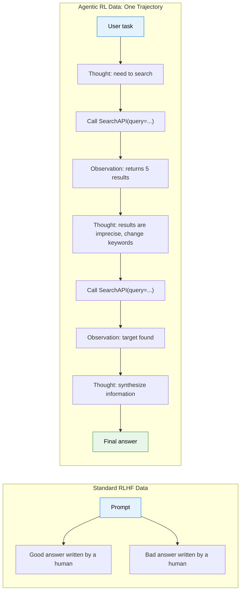
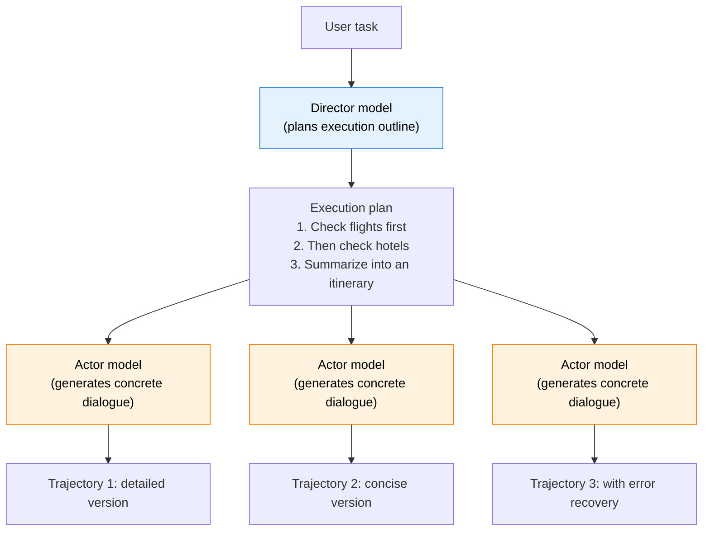
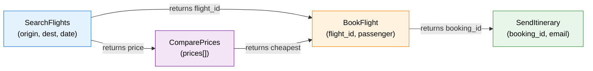
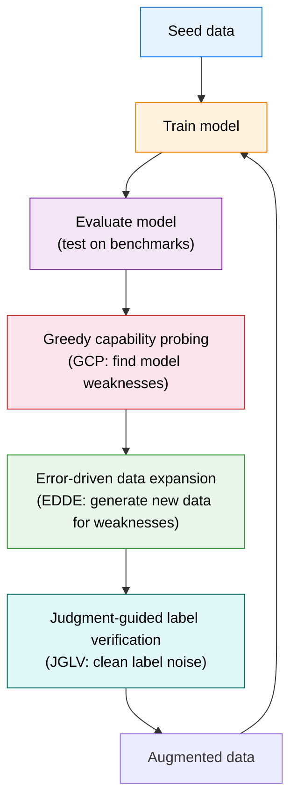

# Old Page: Trajectory Synthesis and Data Engineering (Merged into 10.2)

> This page is kept as an entry point for old links. The core content has already been merged into [10.2 Tool Use, Trajectory Synthesis, and Agentic Engineering](./tool-use-and-trajectory). The original content is preserved below for readers who arrive through legacy links and want a point of comparison.

# 12.2 Trajectory Synthesis: Where Training Data Comes From

In the previous section, we unpacked the credit assignment problem in multi-turn RL. Before training even begins, however, there is an even more basic question: **where does the data come from?** Standard LLM RL, such as the GRPO setting in Chapter 9, only needs a prompt plus a verifiable answer. The model generates its own response and compares it against the verifier; no external interaction data is required. Agentic RL is different. The model must interact with an environment: calling tools, executing code, browsing the web, and observing results. These interactions produce "trajectories", which are both the training data and the source of reward. The quality of those trajectories determines the ceiling of the model. In this section, we examine the data-engineering core of Agentic RL: trajectory synthesis.

## Why Trajectory Synthesis Is Needed

Training data for Agentic RL is fundamentally different from training data for standard RLHF. In RLHF, the data consists of "good answers written by humans" and "preference pairs labeled by humans". In Agentic RL, the data is a complete **interaction trajectory**: every reasoning step, every tool call, and every observation produced during a multi-turn interaction.



Writing one trajectory like this by hand costs more than ten times as much as writing a good answer, because every step requires the annotator to (1) decide how the model should reason, (2) construct reasonable tool-call arguments, (3) simulate the tool's returned result, and (4) ensure that the whole trajectory remains logically coherent. A 7-turn trajectory may take an expert 30 minutes to write.

This leads to the central motivation for trajectory synthesis: **use algorithms to automatically generate large quantities of high-quality interaction trajectories, replacing expensive human annotation**.

## Six Mainstream Synthesis Methods

### Method 1: Rejection Sampling, the Simplest Baseline

The idea behind rejection sampling is extremely intuitive: let the current model repeatedly attempt the same task, and keep only the successful trajectories as training data.

```python
def rejection_sampling(model, task, tool_env, num_samples=64):
    """Rejection sampling: generate many trajectories and keep only successful ones."""
    trajectories = []
    for _ in range(num_samples):
        traj = model.interact_with_tools(task, tool_env)
        if traj.final_success:  # Keep only successful trajectories.
            trajectories.append(traj)
    return trajectories

# Problem: if the model's success rate is only 5%, sampling 64 trajectories
# yields only about 3 successful trajectories.
# Worse, those 3 trajectories may all follow the same success path, with little diversity.
```

The advantage of rejection sampling is that it is **simple to implement**. You only need a verifier that can decide "success" versus "failure". The RLVR training discussed in Chapter 9 uses exactly this idea.

Its weaknesses are just as clear: **low efficiency and poor diversity**. If the model's current success rate is only 5%, you need to sample 20 trajectories to obtain 1 successful trajectory. More seriously, successful trajectories tend to concentrate on strategies the model is already good at. Paths the model has not explored, even if they may be better, will never appear under plain rejection sampling.

### Method 2: Director-Actor, Separating Planning from Execution

To address the diversity problem in rejection sampling, researchers proposed the "Director-Actor" pattern. The core idea is to **split trajectory generation into two levels: macro-level planning and micro-level execution**.



The director model is responsible for understanding the task goal and producing a high-level execution outline: "do A first, then B, and finally C." The actor model fills in the details according to that outline, generating concrete tool-call arguments and natural-language responses. This separation brings two benefits.

**Logical coherence is easier to guarantee.** The director model ensures that the outline itself is reasonable, and the actor only needs to "perform according to the script". This is much more stable than asking one model to handle both planning and execution at the same time, much like the division of labor between a director and actors in a film.

**The same outline can produce multiple different trajectories.** By changing the actor model, or by changing the sampling temperature, the same outline of "check flights first, then check hotels" can generate trajectories in different styles. This increases training-data diversity.

Representative works include IBSEN[^ibsen], CoDi, and related frameworks. This pattern is especially good at simulating complex multi-step interaction scenarios.

### Method 3: Graph-Based Synthesis, Magnet[^magnet]

Magnet takes a more structured approach. It models the calling relationships between tools as a **Function Signature Graph**, then uses graph operations to generate logically rigorous trajectories.

The graph's nodes are tool arguments and return values, and its edges represent data flow. For example, the return value of a "search flights" tool contains a "flight ID", while a "book flight" tool needs a "flight ID" as input. These two tools therefore have an edge between them.



Magnet defines two core graph operations.

**MAGNIFY**: select one node in the graph, expand its internal structure, and generate a more fine-grained call chain. For example, "search flights" can be expanded into "construct query -> call API -> parse results -> filter".

**CONNECT**: create a new path between two nodes that are not directly connected. This can generate complex call chains spanning multiple tools, such as "search flights -> compare prices -> book the cheapest option -> send itinerary".

Magnet's core advantage is that it **guarantees tool-call correctness at the source**. Paths generated from the graph are necessarily legal: argument types match and call order is reasonable. This is far more reliable than letting an LLM freely generate tool calls. The Magnet-14B model trained with this method outperformed its teacher model on the BFCL-v3 and ToolQuery benchmarks.

### Method 4: Closed-Loop Iteration, LoopTool[^looptool]

LoopTool is currently one of the most active trajectory-synthesis frameworks in the community. It addresses a shared weakness of the first three methods: **the generated data is static; it does not adapt to the model's weaknesses**.

LoopTool's central innovation is a **closed loop that tightly couples data generation with model training**:



This loop contains three key modules.

**Greedy capability probing (GCP)**: run the model on a test set and estimate which capability dimensions have the highest failure rates. For example, the system may find that the model succeeds only 30% of the time when handling optional arguments, while it already succeeds 90% of the time on basic single-tool calls.

**Error-driven data expansion (EDDE)**: generate new training examples targeted at the weaknesses discovered by GCP. If the model performs poorly on optional arguments, EDDE generates many tool-use trajectories that include optional arguments.

**Judgment-guided label verification (JGLV)**: use a judging model to automatically check whether labels in the synthetic data are correct and remove noise. This step matters because synthetic data inevitably contains labeling errors, such as labeling a case as "should call tool B" when the correct action is "should call tool A". If this noise is not cleaned, it misleads training.

LoopTool's experimental results are striking. Using a 32B Qwen3 model as the data generator, the resulting 8B model **surpasses the 32B generator itself** on BFCL-v3. This shows that closed-loop data iteration can produce data whose quality far exceeds static synthesis.

### Method 5: Difficulty Adaptation, HardGen[^hardgen]

HardGen specifically addresses the problem that synthetic data is often "too easy". Its core insight is that **model improvement mainly comes from hard examples**. Simple trajectories, such as tasks completed with a single tool call, contribute little to training.

HardGen works as follows. First, let the model attempt a batch of tasks and collect its failures. Then construct a **dynamic API graph** from those failures, analyzing which tool combinations and argument types most often cause the model to fail. Finally, generate hard trajectories from this graph, ensuring that each trajectory touches the model's weaknesses.

Experiments show that a 4B model trained on HardGen data outperforms multiple mainstream closed-source models. This again confirms that the value of hard examples far exceeds that of easy examples.

### Method 6: Hindsight Rewriting, ECHO[^echo]

ECHO follows the same spirit as HER, hindsight experience replay, which we will discuss in Chapter 11: **failed trajectories do not have to be discarded; with a different goal, they can become successful trajectories**.

In Section 11.3, we saw the idea behind HER. A robot's goal is to "place the ball at position A", but it actually places the ball at position B. From the perspective of goal A, this is a failure. From the perspective of goal B, it is a perfect success. ECHO transfers this idea to LLM trajectories. It first uses an LLM to analyze what a failed trajectory actually accomplished, then changes the goal label to the goal that was actually achieved. The failed trajectory is thereby rewritten as a successful example for a new goal.

This method greatly improves sample efficiency. Under rejection sampling, failed trajectories are simply thrown away. If the model's current success rate is only 10%, then 90% of generations are wasted. ECHO makes these "wasted" trajectories valuable again. In connection with the discussion in Section 11.3, we can understand ECHO as "HER applied in language space": HER changes the position label of a robot goal, while ECHO changes the semantic goal label of a language task.

### End-to-End Synthesis: ASTRA[^astra]

The six methods above focus on "how to generate high-quality trajectories". ASTRA goes one step further. It not only synthesizes multi-turn interaction trajectories, but also **automatically packages those trajectories into independent, verifiable RL training environments**. This means the whole process from "data generation" to "environment construction" is automated. Given a task specification, ASTRA can output a set of trajectory-environment pairs that can be used directly for GRPO/PPO training. This end-to-end approach is especially useful in engineering settings where new scenario-specific training data must be built quickly. The framework unifies SFT data, meaning synthetic trajectories, and RL environments, meaning verifiable arenas, in a single pipeline. Its code and environments have been open-sourced.

## Comparing the Six Methods

| Method                | Core idea                                               | Diversity | Quality     | Cost   | Representative work |
| --------------------- | ------------------------------------------------------- | --------- | ----------- | ------ | ------------------- |
| Rejection sampling    | Generate -> filter -> keep only successes               | Low       | Medium      | Low    | GRPO, TinyZero      |
| Director-Actor        | Separate planning from execution                        | Medium    | High        | Medium | IBSEN, CoDi         |
| Graph synthesis       | Generate legal paths from a tool-relation graph         | High      | Very high   | High   | Magnet              |
| Closed-loop iteration | Train -> diagnose weaknesses -> targeted reinforcement  | Adaptive  | Highest     | Medium | LoopTool            |
| Difficulty adaptation | Generate hard examples from failures                    | Adaptive  | High        | Medium | HardGen             |
| Hindsight rewriting   | Turn failed trajectories into successes under new goals | High      | Medium-high | Low    | ECHO                |

In practice, **LoopTool's closed-loop iteration is the most recommended approach**. You do not need to know in advance what mistakes the model will make; the system discovers and reinforces those weaknesses automatically. If resources are limited, rejection sampling is the easiest starting point.

## Trajectory Quality Control: Synthesis Is Not the End

No matter which method generates the trajectories, **quality control** is necessary. Synthetic data inevitably contains noise: incorrect tool-call arguments, logically incoherent reasoning steps, or even "accidentally successful" trajectories that reach the right result through a poor path.

Quality control usually has three dimensions.

**Correctness**: are the tool-call arguments correct? Is the call order reasonable? This can be checked with an **automatic verifier**: static analysis can inspect argument types, and an executor can actually run the calls to verify the result.

**Diversity**: do the trajectories cover different strategies? If 100 trajectories all follow the same pattern of "search first, then summarize", the model will not learn the alternative strategy of "analyze first, then search". Diversity is often measured by **clustering trajectory embeddings**. If trajectories form multiple clusters in embedding space, the data covers multiple strategies.

**Difficulty distribution**: is the ratio of easy, medium, and hard examples reasonable? Too many easy examples let the model become comfortable with already-known strategies; too many hard examples may make training unstable. A good distribution is often around 30% easy, 50% medium, and 20% hard.

**Step-level calibration**: beyond filtering and ranking, there is a more fine-grained approach: **directly correcting suboptimal steps inside a trajectory**. The core insight of STeCa, Step-level Trajectory Calibration[^steca], is that if a trajectory is mostly correct but contains a few flawed steps, it is better to identify and correct those steps than to discard the whole trajectory. Concretely, STeCa uses step-level reward comparisons to identify which steps reduce overall quality, then calibrates those steps with a stronger model or with rules. This is much more precise than a simple success/failure binary. A trajectory may do 6 out of 7 steps well, with only the fourth step using a weak search strategy. STeCa keeps the first 6 steps, calibrates only the fourth, and ultimately produces a better calibrated trajectory than the original.

```python
def filter_trajectories(trajectories, quality_threshold=0.7):
    """Trajectory quality control: filter low-quality synthetic data."""
    filtered = []
    for traj in trajectories:
        # 1. Correctness check: are tool-call arguments legal?
        if not all(is_valid_call(call) for call in traj.tool_calls):
            continue

        # 2. Coherence check: are there logical jumps between adjacent steps?
        if not is_coherent(traj):
            continue

        # 3. Difficulty assessment: is it too simple, finishing in only 1-2 steps?
        if len(traj.turns) < 2 and traj.success:
            continue  # Skip overly simple successful trajectories.

        # 4. Overall quality score.
        if traj.quality_score >= quality_threshold:
            filtered.append(traj)

    return filtered
```

## How Trajectory Synthesis Connects to Chapter 9

You may have noticed that many ideas in trajectory synthesis are closely related to RLVR from Chapter 9. The core of RLVR is "use a verifiable result as the reward". Trajectory synthesis pushes this idea one step earlier: it uses verification results not only as rewards, but also to **filter and generate better training data**.

More concretely, RLVR has three data-level uses in Agentic RL.

1. **Filtering**: generate many trajectories and use an RLVR verifier to remove incorrect ones, as in rejection sampling.
2. **Ranking**: rank multiple trajectories by RLVR signals and use the ranking to guide within-group comparison in GRPO.
3. **Diagnosis**: analyze trajectories that fail verification, identify systematic model weaknesses, and generate targeted reinforcement data, as in LoopTool's GCP module.

This also explains why Agentic RL is considered more suitable for trajectory synthesis than RLHF. RLHF requires human-labeled preferences, which are costly and hard to scale. In Agentic RL, reward can be obtained automatically through environmental interaction: whether code passes tests, whether search results contain the target information, and so on. These signals can be automatically verified.

It is also worth noting that trajectory synthesis can do more than refine "existing data"; it can also use "search" to generate higher-quality trajectories. TSR, Trajectory-Search Rollouts[^tsr], moves test-time search techniques that will be discussed in Chapter 12, such as beam search and best-of-N, into rollouts during training. When generating trajectories, it does not rely on random sampling alone. Instead, it uses a search strategy to explore multiple paths and selects the highest-quality trajectories as training data. Experiments show that combining TSR with PPO or GRPO can improve performance by up to 15%. In essence, TSR gives training-time data generation the ability to "think", rather than merely explore at random.

<details>
<summary>Reflection Question: Are "successful trajectories" produced by rejection sampling always good training data?</summary>

Not necessarily. Rejection sampling keeps all successful trajectories, but "successful" does not mean "good strategy".

Consider a factual search task. The model uses a very inefficient strategy: it first searches 5 unrelated keywords, then happens to find the answer on the sixth search. This trajectory "succeeds", but the first 5 searches are completely useless. If we train on it, the model may learn the inefficient strategy that "if you search enough times, you will eventually find it".

This is why "efficiency evaluation" matters in trajectory quality control. We should not only ask whether the final result is correct, but also whether the path to success is efficient. The reward design in Section 10.3 introduces efficiency penalties, which are essentially meant to solve this problem.

</details>

<details>
<summary>Reflection Question: Why can an 8B model trained on data generated by a 32B model in LoopTool surpass the 32B generator?</summary>

At first this seems counterintuitive: "the student surpasses the teacher." The key lies in LoopTool's closed-loop iteration.

When the 32B model generates the initial data, data quality is limited by the model's own ability. But LoopTool is not a "generate once and stop" process. It diagnoses the 8B model's weaknesses and supplements the data accordingly. After multiple rounds of iteration, the final dataset is the accumulation of "the 32B model's initial data plus multiple rounds of reinforcement targeted at the 8B model's weaknesses". This accumulated dataset can be much better than data generated by the 32B model in a single pass.

The deeper reason is that **generating data and understanding data are different abilities**. Although the 8B model may have weaker generation ability than the 32B model, its learning and generalization ability may not be worse. Given better training data, it can realize more of its potential. This is also why "data quality > model scale" is becoming a community consensus.

</details>

## Hands-On Code: A Simple Trajectory Synthesis Pipeline

The following code combines rejection sampling with simple quality control to form a basic trajectory synthesis pipeline:

```python
from dataclasses import dataclass, field
from typing import List, Optional
import random

@dataclass
class Trajectory:
    """A complete interaction trajectory."""
    task: str                          # User task.
    turns: List[dict] = field(default_factory=list)  # (thought, action, observation) for each turn.
    success: bool = False              # Whether the final outcome succeeds.
    num_tool_calls: int = 0            # Number of tool calls.

def trajectory_synthesis_pipeline(
    model, tool_env, tasks, num_samples_per_task=16, quality_threshold=0.6
):
    """Simple trajectory synthesis pipeline: rejection sampling + quality filtering."""
    all_trajectories = []

    for task in tasks:
        # Stage 1: batch sampling.
        candidates = []
        for _ in range(num_samples_per_task):
            traj = model.interact_with_tools(task, tool_env)
            candidates.append(traj)

        # Stage 2: rejection sampling: keep only successful trajectories.
        success_trajs = [t for t in candidates if t.success]

        # Stage 3: quality filtering.
        for traj in success_trajs:
            # Efficiency check: succeeding after more than 8 tool calls means the strategy is inefficient.
            if traj.num_tool_calls > 8:
                continue

            # Diversity check: overlap with existing trajectories.
            if not is_too_similar(traj, all_trajectories):
                traj.quality_score = compute_quality(traj)
                if traj.quality_score >= quality_threshold:
                    all_trajectories.append(traj)

    return all_trajectories

def is_too_similar(new_traj, existing_trajs, threshold=0.85):
    """Check whether a new trajectory is too similar to existing ones, based on action sequences."""
    new_actions = [t["action"] for t in new_traj.turns]
    for old_traj in existing_trajs:
        old_actions = [t["action"] for t in old_traj.turns]
        # Simplification: use Jaccard similarity over action sequences.
        overlap = len(set(new_actions) & set(old_actions))
        union = len(set(new_actions) | set(old_actions))
        if union > 0 and overlap / union > threshold:
            return True
    return False

def compute_quality(traj):
    """Compute the trajectory's overall quality score."""
    # Efficiency score: fewer tool calls are better, encouraging efficient strategies.
    efficiency = max(0.0, 1.0 - 0.1 * traj.num_tool_calls)

    # Completeness score: every turn contains a complete (thought, action, observation).
    completeness = sum(
        1 for t in traj.turns
        if t.get("thought") and t.get("action") and t.get("observation")
    ) / max(len(traj.turns), 1)

    return 0.5 * efficiency + 0.5 * completeness
```

Although this pipeline is simple, it contains the core stages of trajectory synthesis: generation -> filtering -> quality control. In real engineering systems, you can gradually replace rejection sampling with LoopTool's closed-loop iteration and replace simple quality checks with more precise verifiers.

In the next section, we focus on another key dimension of Agentic RL: [tool-use RL for Web Agents and Code Agents](./tool-use-agents). We will examine how a model learns "when to use tools, and which tools to use".

## References

[^ibsen]: Han S, Chen L, Lin L-M, et al. "[IBSEN: Director-Actor Agent Collaboration for Controllable and Interactive Drama Script Generation](https://arxiv.org/abs/2407.01093)." ACL 2024. A representative work on the Director-Actor pattern, splitting trajectory generation into planning and execution levels.

[^magnet]: Yin F, Wang Z, Hsu I-H, et al. "[Magnet: Multi-turn Tool-use Data Synthesis and Distillation via Graph Translation](https://arxiv.org/abs/2503.07826)." ACL 2025. Graph-based trajectory synthesis using function signature graphs, generating legal call paths through MAGNIFY/CONNECT graph operations.

[^looptool]: LoopTool Team. "[LoopTool: Closing the Data-Training Loop for Robust LLM Tool Calls](https://arxiv.org/abs/2511.09148)." arXiv:2511.09148, 2025. A closed-loop iteration framework that uses GCP, JGLV, and EDDE to realize "model-driven data evolution". [GitHub](https://github.com/Rednote-DeepExperience/LoopTool)

[^hardgen]: Hao B, et al. "[From Failure to Mastery: Generating Hard Samples for Tool-use Agents](https://arxiv.org/abs/2601.01498)." arXiv:2601.01498, 2026. Targeted generation of hard training data from model failure cases. [Dataset](https://huggingface.co/datasets/Bingguang/HardGen)

[^echo]: Hu B, et al. "[Sample-Efficient Online Learning in LM Agents via Hindsight Trajectory Rewriting](https://arxiv.org/abs/2510.10304)." arXiv:2510.10304, 2025. ECHO borrows the idea of hindsight experience replay from HER, rewriting failed trajectories into successful examples for other goals and greatly improving sample efficiency.

[^astra]: Tian X, Wang H, et al. "[ASTRA: Automated Synthesis of agentic Trajectories and Reinforcement Arenas](https://arxiv.org/abs/2601.21558)." arXiv:2601.21558, 2026. An end-to-end framework that automatically synthesizes multi-turn interaction trajectories and packages them as verifiable RL environments. [GitHub](https://github.com/LianjiaTech/astra)

[^tsr]: Djuhera A, Kadhe S, et al. "[TSR: Trajectory-Search Rollouts for Multi-Turn RL of LLM Agents](https://arxiv.org/abs/2602.11767)." arXiv:2602.11767, 2026. Moves test-time search, such as beam search and best-of-N, into training-stage rollouts, improving performance by up to 15%.

[^steca]: Wang H, Wang J, et al. "[STeCa: Step-level Trajectory Calibration for LLM Agent Learning](https://arxiv.org/abs/2502.14276)." ACL 2025 Findings. Identifies and corrects suboptimal actions inside trajectories through step-level reward comparisons, rather than simply filtering whole trajectories. [GitHub](https://github.com/WangHanLinHenry/STeCa)
