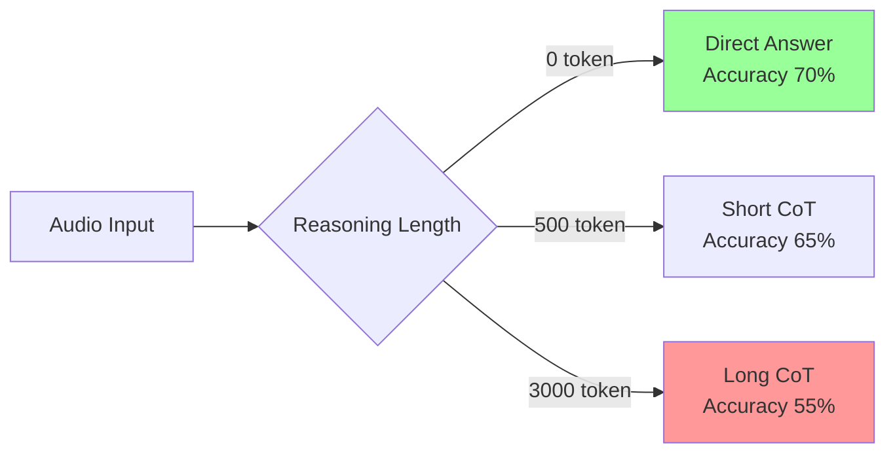
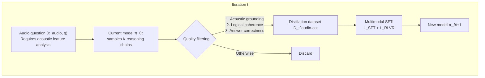
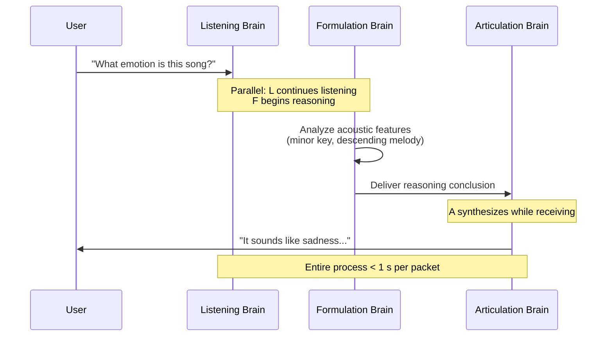
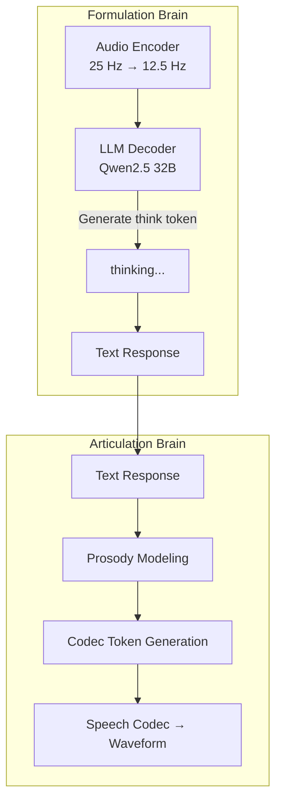

# 24.1 Reward Design for Audio

> [Chapter 23: VLM RL](../chapter26_vlm/vlm-challenges) extends reinforcement learning from text to visual understanding. Chapter 24 continues along the multimodal path: Sections 24.1–24.2 discuss audio reasoning, rewards, and speech agents, while 24.3 connects perception to robot actions. Sections 24.4–24.5 then shift back to image and video generation. These three paths face the same question: when inputs, actions, and outputs are no longer just text tokens, how can rewards describe the quality of real-world tasks? We begin with speech, analyzing the modality-grounded reasoning of Step-Audio-R1, and the reason why Step-Audio-R1.5 shifts from RLVR to RLHF.

## Overview of Audio Language Models

Text language models process sequences of discrete tokens. However, audio is a continuous waveform at 24 kHz—24,000 floating-point samples per second. To enable Transformers to process audio, it must first be "tokenized." This is the task of the **Neural Audio Codec**.

The Neural Audio Codec converts raw audio waveforms into a sequence of discrete tokens that can be processed by neural networks. This process typically involves two main steps: **feature extraction** and **tokenization**. First, the audio signal is transformed into a spectrogram or a series of mel-frequency cepstral coefficients (MFCCs), which capture the essential characteristics of the audio. Then, a neural network, often a variant of the Transformer, is trained to map these features into a sequence of discrete tokens.

This tokenization process is crucial for enabling the use of audio in reinforcement learning scenarios. By converting continuous audio signals into discrete tokens, the model can then apply standard reinforcement learning techniques, such as policy gradients or actor-critic methods, to learn to perform tasks involving audio inputs.

In the context of audio-based reinforcement learning, the design of the reward function is particularly important. The reward function must accurately reflect the quality of the agent's actions in the audio domain. This involves not only capturing the acoustic properties of the audio but also aligning the reward with the specific goals of the task,

### Three Major Audio Tokenization Schemes

| Codec                         | Frame Rate | Codebook Size                 | Token Information | Typical Use Cases          |
| ----------------------------- | ---------- | ----------------------------- | ----------------- | -------------------------- |
| **SoundStream** (Google 2021) | 50 Hz      | 8 RVQ layers                  | Medium            | Speech Synthesis, TTS      |
| **EnCodec** (Meta 2022)       | 75 Hz      | 8 RVQ layers                  | Medium            | General Audio, Music       |
| **SpeechTokenizer** (2023)    | 50 Hz      | 8 (1 semantic + 7 acoustic)   | High (semantic)   | Semantic Understanding     |
| **WavTokenizer** (ICLR 2025)  | 40-75 Hz   | 1 (VQ)                        | Extremely High    | Ultra-Compression, AudioLM |
| **Mimi** (Kyutai 2024)        | 12.5 Hz    | 8 (Semantic + Acoustic Joint) | High              | Real-time Dialogue (Moshi) |

RVQ (Residual Vector Quantization, Residual Vector Quantization) is the core of EnCodec/SoundStream. It encodes a frame of audio into $K$ layers of codebook indices $c_1, c_2, \ldots, c_K$, where each layer quantizes the residual of the previous layer:

$$e^{(0)} = \text{Encoder}(x), \quad c_k = \arg\min_c \|e^{(k-1)} - \text{CB}_k[c]\|, \quad e^{(k)} = e^{(k-1)} - \text{CB}_k[c_k]$$

The final waveform is reconstructed as $\hat{x} = \text{Decoder}(c_1, \ldots, c_K)$. Larger $K$ leads to higher reconstruction quality, but each additional layer of the codebook increases the token sequence by one, doubling the length of the autoregressive generation. The key insight of SpeechTokenizer is: **distill the first layer of the codebook into HuBERT semantic features**, so that $c_1$ encodes "what was said", and $c_2 \ldots c_K$ encodes "how it was said" (prosody, timbre).

### Differences Between Speech Generation and Text Generation

Feeding audio tokens into an LLM appears to follow the same generation mechanism as text (autoregressive next-token), but the reality is vastly different:

| Dimension       | Text Generation            | Speech Generation                                  |
| --------------- | -------------------------- | -------------------------------------------------- |
| Sequence Length | 1 token ≈ 0.5 word ≈ 0.3 s | 1 token ≈ 0.013 s (75 Hz) → 1 s speech = 75 tokens |
| Evaluation      | Content accuracy           | Content + Prosody + Emotion + Voice + Rhythm       |
| Error Tolerance | One word error is readable | One frame error → burst noise, electrical noise    |
| Multi-Codebook  | Single stream              | 8-layer RVQ requires synchronized generation       |
| Real-time       | Streaming is sufficient    | First packet delay < 1 s                           |

To generate one second of speech, 75 × 8 = 600 tokens must be generated, and 10 seconds of dialogue would require 6000 tokens — 20 times longer than equivalent text content. This is the **sequence length explosion** problem in audio LLMs.

### Engineering Challenges of Real-Time Inference

Real-time voice conversation requires **full-duplex** operation: the model listens, thinks, and speaks simultaneously. There are three key engineering challenges:

1. **First Packet Latency**: The interval between when the user finishes speaking and when the model begins to respond. The industry goal is less than 500 ms.
2. a **Streaming Decoding**: The model cannot wait for the entire sentence to be generated before synthesizing the output; it must output in chunks.
3. **Interruptibility**: The user may interrupt at any time, and the model must immediately stop generating and switch to listening mode.

GPT-4o Realtime, Gemini Live, and Moshi use **chunked autoregressive** combined with **streaming vocoder** to address these challenges. In the latter half of this chapter, we will see that Step-Audio-R1 Realtime achieves sub-second latency using a **dual-brain architecture** of "listen-and-think + think-and-speak."

## Step-Audio Series: The Audio Reasoning Path of Chinese Teams

StepFun (Staircase Star) is a representative company of domestic audio LLMs. The Step-Audio series evolves from Step-Audio 2 (a basic conversational model) to **Step-Audio-R1** (a reasoning model, 2025.11) and **Step-Audio-R1.5** (RLHF-aligned, 2026.04), fully covering the full chain of "audio understanding + reasoning + generation."

### Step-Audio-R1: Test-Time Compute Scaling

The core contribution of [Step-Audio-R1](https://arxiv.org/abs/2511.15848): **the first model to successfully unlock test-time compute scaling in the audio domain.**

#### The Inverted Scaling Anomaly

Text and visual reasoning models generally follow the test-time compute scaling law — giving a model more reasoning tokens leads to predictable performance improvements (see [Chapter 16 on Reasoning Models](../chapter19_reasoning/r1-zero-pure-rl-reasoning)). However, in the audio domain, an anomaly appears:



#### The Root Cause of Textual Surrogate Reasoning

The Step-Audio-R1 team identified the root cause through systematic case analysis: **Textual Surrogate Reasoning**.

#### The Disease of Textual Surrogate Reasoning

Most audio LLMs use text CoT data for SFT initialization (inheriting the reasoning ability of text models). As a result, the model "thinks" not about the audio, but rather about **the textual description of the audio**:

```text
❌ Textual Surrogate Reasoning:
"Lyrics mention sadness → This song expresses sadness"

✅ Modality-Grounded Reasoning:
"Minor key + descending melodic contour + slow tempo → Sad emotion"
```

The former only looks at the lyrics text (even hallucinating lyrics), while the latter truly analyzes pitch, rhythm, and harmony. When the reasoning chain becomes longer, the textual surrogate model will only drift further away — this is the root of inverted scaling.

**Modality-Grounded Reasoning Distillation (MGRD)** is the core training framework of Step-Audio-R1. It gradually shifts the reasoning base from text to acoustics through $T$ rounds of iteration:



Each round of MGRD consists of three stages, with the overall loss defined as:

$$\mathcal{L}_{\text{MGRD}} = \sum_{t=1}^{T}\left(\mathcal{L}_{\text{SFT}}^{(t)} + \mathcal{L}_{\text{RLVR}}^{(t)}\right)$$

**Stage One: Self-Distillation Sampling.** On data requiring acoustic analysis (e.g., pitch recognition, rhythm judgment, emotion classification), let $\pi_{\theta_t}$ sample $K$ candidate responses:

$$(r^{(i)}, a^{(i)}) \sim \pi_{\theta_t}(\cdot \mid x_{\text{audio}}, q), \quad i=1,\ldots,K$$

Candidates are filtered using three criteria: (1) the reasoning must explicitly mention perceptual features (pitch, rhythm, timbre); (2) the reasoning steps are logically coherent; and (3) the final answer is correct.

**Stage Two: Multi-Modal Supervised Refinement.** On the distilled data plus the original text-based reasoning data, perform joint SFT:

$$\mathcal{L}_{\text{SFT}}^{(t)} = \mathbb{E}_{\mathcal{D}_t^{\text{audio-cot}}}\left[\log \pi_\theta(r, a \mid x_{\text{audio}}, q)\right] + \mathbb{E}_{\mathcal{D}_{\text{task}}}\left[\log \pi_\theta(r, a \mid q)\right]$$

The mixed training prevents "catastrophic forgetting"—preserving both acoustic grounding and text-based reasoning capabilities.

**Stage Three: Multi-modal RL**. Text uses standard binary rewards, while audio uses composite rewards:

$$R_{\text{audio}}(r, a) = 0.8 \cdot \mathbb{1}[a = a^*] + 0.2 \cdot \mathbb{1}[\text{reasoning present in } r]$$

The design of the weights 0.8 + 0.2 is intentional: **the 0.2 format reward prevents reasoning collapse**. Ablation experiments show that without the format reward, the number of reasoning tokens drops from 2800 to 1500, and MMAU accuracy falls from 77.7 to 76.5. RL optimizers naturally favor "most token-efficient" strategies—directly giving answers—so explicit rewards for "thinking behavior" are needed to preserve the reasoning chain.

::: details Data Filtering in MGRD: pass@8 ∈ [3, 6]

RL datasets are only 5000 samples in size, but of very high quality. For each question, we sample $k=8$ times using the previous model, and **only retain questions with pass@8 ∈ [3, 6]**—neither too easy (pass@8 > 6, which offers little learning) nor too hard (pass@8 < 3, which is often due to ambiguous questions).

Experiments compare three data strategies:

| Data Strategy                        | Final Reward             | Reasoning Length Stability |
| ------------------------------------ | ------------------------ | -------------------------- |
| All Failures (pass@8 = 0)            | 0.45–0.70, high variance | Drops to 1800 tokens       |
| Moderate Difficulty (pass@8 ∈ [3,6]) | 0.75–0.80, stable        | Maintains 2300–2800 tokens |
| 200K Unfiltered (10× Expansion)      | No improvement           | —                          |

**Data Quality > Data Quantity**. Blindly expanding audio RL data can instead introduce ambiguity and noise.

#### Acoustic-Grounded Reasoning

The output of MGRD is **Acoustic-Grounded Reasoning** — reasoning chains explicitly reference acoustic properties. Performance of Step-Audio-R1 on MMAU (Massive Multi-Task Audio Understanding):

| Model             | Average  | Big Bench Audio | Spoken MQA | MMSU | MMAU     | Wild Speech |
| ----------------- | -------- | --------------- | ---------- | ---- | -------- | ----------- |
| Step-Audio 2      | 68.3     | 59.1            | 88.8       | 64.3 | 78.0     | 51.1        |
| Gemini 2.5 Pro    | 81.5     | 96.1            | 94.8       | 79.3 | 77.4     | 60.0        |
| Gemini 3 Pro      | 85.1     | 92.1            | 95.3       | 82.9 | 78.9     | 76.4        |
| **Step-Audio-R1** | **83.6** | **98.7**        | 95.2       | 75.9 | **77.7** | 70.6        |

Average 83.6, surpassing Gemini 2.5 Pro, approaching Gemini 3 Pro. Big Bench Audio (multi-step logical reasoning) reaches 98.7, the highest among all models.

### Mind-Paced Speaking: Speaking While Thinking

The bottleneck in real-time speech dialogue is the **serial dependency between reasoning and generation**: the model must finish thinking before it can speak. Step-Audio-R1 Realtime draws inspiration from the **listen-while-thinking** and **think-while-speaking** architectures, achieving **Mind-Paced Speaking**:



Key insight: **Human speech is streaming** — we speak while thinking, with the latter half of a sentence still being considered while the former is spoken. Mind-Paced Speaking enables models to possess this capability, allowing them to begin speech synthesis without waiting for the entire reasoning process to complete.

**Step-Audio-R1** achieves **96.1 points** (inference performance) on **Big Bench Audio speech-to-speech**, with a **first-packet delay of 0.92 seconds**, comprehensively outperforming **GPT Realtime 0825** (83 points / 0.98 seconds) and **Gemini 2.5 Flash Native Audio** (92 points / 0.63 seconds).

### Dual-Brain Architecture

An architecture that decouples "thinking" and "speaking" is called the **Dual-Brain architecture**:



- **Formulation Brain**: Audio encoder + LLM, outputting ` thinking...` reasoning plus a text response
- **Articulation Brain**: Converts the text response into codec tokens with prosody, emotion, and voice characteristics, then decodes them into a waveform

## Two-Brain Decoupling Enables Deep Thinking and Fast Speaking Without Mutual Interference

The concept of two-brain decoupling allows the brain responsible for thinking deeply to run long Chain-of-Thought (CoT) reasoning, while the brain responsible for expression can parallelly synthesize speech. This is the key to Step-Audio-R1's ability to maintain reasoning capabilities with sub-second latency.

Step-Audio-R1 is an audio reasoning model released by StepWise in early 2026. Its core innovation is **MGRD (Modal Grounded Reasoning Distillation)** — distilling text-based reasoning chains into the audio modality to address the "the more you think, the worse you perform" inverted scaling problem. Step-Audio-R1.5 further shifts the training paradigm from RLVR to RLHF, transforming the audio model from a mere "mechanical answer machine" into a truly conversational voice assistant.

Below, we continue to focus on the design of audio rewards: why text-based reward models cannot directly evaluate prosody, emotion, accent, and real-time performance, and why RLVR needs to be combined with multi-dimensional preference rewards.

In the previous sections, we introduced the development of the Step-Audio series. This section focuses on the core engineering challenge: **how to design audio rewards?** Text-based reward models can directly use preference data for training, but audio involves dimensions such as prosody, emotion, and accent, which a single reward signal cannot cover.

## Evolution from RLVR to RLHF

Step-Audio-R1 achieves state-of-the-art performance on objective benchmarks using MGRD + RLVR. However, when deployed to real-world conversations, the team discovered a counterintuitive problem: **higher benchmark scores correlate with worse conversational quality**.

### The Verifiable Reward Trap

[Step-Audio-R1.5](https://arxiv.org/abs/2604.25719) names this issue the **Verifiable Reward Trap**.

::: warning Verifiable Reward Trap
When the ground truth of an audio benchmark is merely a discrete label (emotion category, ASR text, scene label), RLVR only rewards "label guessing," **structurally ignoring** prosody naturalness, emotional coherence, and conversational fluency.
:::

The mechanism of the trap is as follows:

```text
RLVR Objective = Answer Accuracy → Model learns "most token-efficient" → Responses become short, mechanical, and flat
                ↓
         Benchmark ↑      Real-world conversational experience ↓
```

RLVR optimizes "what to say" (content), while users care about "how to say it" (style). When these two aspects are decoupled, the model degrades into a **question-answering machine**—technically accurate, but experientially hollow.

### Step-Audio-R1.5: From RLVR to RLHF

R1.5 Solution: **Use RLHF to Augment RLHF** — Train a holistic preference reward model that distills correctness, fluency, and emotional resonance into a unified supervisory signal.

#### Audio-Centric Mid-Training

Before RLHF, perform a mid-training phase to reinforce audio understanding and reasoning foundations:

$$\mathcal{L}_{\text{mid}} = \mathbb{\mathbb{E}}_{(x,q,r,y) \sim \mathcal{D}_{\text{audio}}}\left[\log \pi_\theta(r, y \mid x, q)\right] + \mathbb{E}_{(q,r,y) \sim \mathcal{D}_{\text{text}}}\left[\log \pi_\theta(r, y \mid q)\right]$$

Here, $(x, q, r, y)$ represents audio input + context + reasoning + response. The text data retains the long CoT reasoning structure, facilitating transfer to audio.

#### Cold-Start SFT

Cold-start SFT no longer expands domain knowledge, but instead **aligns interaction behavior**:

1. **Multi-Turn Continuity**: Maintain context and constraints across turns
2. **Instruction Following**: Respond according to the content, format, and style specified by the user
3. **Naturalness of Responses**: Coherent and appropriately conversational
4. **Interactive Awareness**: Handle follow-up questions, clarifications, interruptions, and user corrections

This step provides a better initialization for subsequent RLHF — avoiding preference optimization from wasting resources on correcting basic conversational behaviors.

#### RLHF with Rubric-based Reward Model

Audio interaction is a multi-objective optimization — content correctness, natural prosody, emotional coherence, and controllable latency. R1.5 replaces the scalar RM with a **rubric-based generative reward model (Generated Reward Model, GRM)**:

```python
def audio_rlhf_reward(response, context, rubric):
    """Scoring across multiple dimensions rather than a scalar"""
    scores = {}
    scores["correctness"] = grm.score(response, context, rubric="Content correctness")
    scores["fluency"] = grm.score(response, context, rubric="Expressiveness and naturalness")
    scores["prosody"] = grm.score(response, context, rubric="Prosody matching emotional tone")
    scores["emotional_resonance"] = grm.score(response, context, rubric="Emotional resonance")
    scores["latency"] = grm.score(response, context, rubric="Response latency")
    # Weighted aggregation (weights learned from human preference regression)
    return sum(w[k] * scores[k] for k in scores)
```

Using an LLM as a judge to score each dimension (rubric prompting), and then learning a weight aggregator, effectively upgrades the RM from "scoring overall" to "scoring card" in [RLHF](../chapter15_rlhf/base-model-to-assistant).

#### Multi-objective RL Training Objective

The RL loss of R1.5 combines RLVR and RLHF:

$$\mathcal{L}_{\text{RL}} = \underbrace{\mathbb{E}_{\mathcal{D}_{\text{verified}}}\left[R_{\text{verify}}(r, a)\right]}_{\text{Objective Correctness (RLVR)}} + \lambda \cdot \underbrace{\mathbb{E}_{\mathcal{D}_{\text{pref}}}\left[\log\sigma\left(\beta \log\frac{\pi_\theta(y_w \mid x)}{\pi_{\text{ref}}(y_w \mid x)} - \beta \log\frac{\pi_\theta(y_l \mid x)}{\pi_{\text{ref}}(y_l \mid x)}\right)\right]}_{\text{Subjective Preference (DPO Form)}}$$

The first term preserves the objective reasoning ability (preventing RLHF from forgetting what RLVR has learned), while the second term uses the DPO loss (see [Chapter 14 on DPO](../chapter17_dpo/dpo-theory-and-family)) to align with subjective experience. $\lambda$ balances the two — this is the core hyperparameter in audio RL.

### Preserving Rhythm and Naturalness

The biggest drawback of RLVR is **rhythm flattening**: the model, in its pursuit of maximizing answer accuracy, transforms speech into a monotonous "reading" style. R1.5 employs three mechanisms to preserve rhythm:

1. **Preference data includes a rhythm dimension**: When annotators compare two responses, they not only evaluate content but also consider "which one sounds more natural, has more appropriate emotion, and has a rhythm more like a human."
2. **Rubric explicitly scores prosody**: GRM assigns a separate score for prosody, without conflating it with correctness.
3. **Codec token-level supervision**: The $c_2 \ldots c_K$ (acoustic layer) of RVQ participates in preference learning, ensuring that rhythm information is preserved during the generation phase.

R1.5 achieves or exceeds the performance of Gemini-2.5-Flash on the AudioMultiChallenge benchmark (a multi-turn dialogue benchmark that evaluates Inference Memory, Instruction Retention, Self Coherence, and Voice Editing), **while maintaining performance** on traditional reasoning benchmarks. The "trap" of RLVR is thus resolved by RLHF.

## Audio Reward Design

The reward design in audio reinforcement learning is significantly more complex than in text — while text primarily focuses on correctness, audio requires consideration of content, intonation, and real-time performance across three layers. This section systematically discusses the design of these three types of rewards.

### Content Accuracy Reward

The most straightforward approach: compare the final answer with the ground truth.

$$R_{\text{content}}(r, a) = \begin{cases}1, & \text{if } a = a^* \\ 0, & \text{otherwise}\end{cases}$$

Variants include:

- **ASR Word Error Rate (WER)**: The lower the WER, the higher the reward, $R = 1 - \text{WER}$
- **Semantic Matching**: Using cosine similarity of embeddings, $R = \cos(\text{emb}(a), \text{emb}(a^*))$
- **LLM-as-Judge**: Let a large model judge whether the answer is equivalent, $R \in [0, 1]$

Content-based rewards are suitable for objective tasks (e.g., mathematics, knowledge question answering, and ASR), but they fail in open-ended dialogues where there is no standard answer.

### Prosody Naturalness Reward

Prosody includes pitch, rhythm, intensity, and pauses. Modeling human preferences for naturalness is a challenge in audio reinforcement learning.

#### Limitations of Scalar Rewards

Traditional approach: Training a reward model $R_\phi(\text{audio}) \to \mathbb{R}$ using human pairwise preference data:

$$\mathcal{L}_{\text{RM}} = -\log\sigma(R_\phi(y_w) - R_\phi(y_l))$$

Problem: Scalar rewards compress multi-dimensional preferences into a single dimension, losing the distinction between "content correct but prosody strange" versus "content wrong but prosody natural."

#### Modeling Multi-Dimensional Preferences

R1.5's GRM uses **rubric prompting** to have LLMs score responses across dimensions:

```text
Please evaluate the response according to the following rubric (0-10 points):
1. Content Accuracy: Is the answer accurate?
2. Fluency: Is it coherent and smooth?
3. Prosody Naturalness: Are pitch and rhythm natural to human speech?
4. Emotional Consistency: Does the tone match the context's emotion?
5. Immersion: Does it feel like a conversation with a human?

Response: [Audio]
```

Each dimension is scored independently, and then aggregated using learned weights $w_k$:

$$R_{\text{prosody}}(y) = \sum_k w_k \cdot \text{GRM}_k(y), \quad w = \arg\min_w \|R_{\text{human}}(y) - \sum_k w_k \cdot \text{GRM}_k(y)\|^2$$

Weights are learned from human preferences using Bradley-Terry regression.

#### Prosody-based Reward Features

In addition to preference modeling, acoustic features can be directly used to score performance:

```python
def prosody_reward(audio):
    # Extract prosodic features
    f0 = extract_pitch(audio)          # Fundamental frequency curve
    energy = extract_energy(audio)     # Energy envelope
    duration = extract_durations(audio)  # Phoneme duration

    # Compare with reference prosodic distributions
    f0_score = -wasserstein(f0_dist(audio), f0_dist_human)
    energy_score = -wasserstein(energy_dist(audio), energy_dist_human)

    # Penalize monotony (to prevent flattening caused by RLVR)
    f0_var = np.std(f0)
    monotonicity_penalty = -max(0, 0.2 - f0_var)  # Penalize if f0 variance is too low

    return 0.5 * f0_score + 0.3 * energy_score + 0.2 * monotonicity_penalty
```

This "human-based prosodic distribution" reward mechanism can suppress the flattening tendency caused by RLVR when preference annotations are not available.

### Real-Time Reward

Real-time dialogue requires the first packet latency to be less than 1 second, and the overall response time to be reasonable. Incorporating latency into the reward:

$$R_{\text{latency}}(y) = \begin{cases}1, & T_{\text{first-packet}} < 0.5\text{s} \\ 0.5, & 0.5\text{s} \leq T_{\text{first-packet}} < 1.0\text{s} \\ 0, & T_{\text{first-packet}} \geq 1.0\text{s}\end{cases}$$

Or using a continuous form:

$$R_{\text{latency}}(y) = \exp(-\alpha \cdot T_{\text{first-packet}})$$

Real-time reward conflicts with deep reasoning—the longer the thinking, the later the first packet. This is the value of the [Dual-Brain Architecture](#dual-brain-architecture): the articulation brain can begin synthesizing while the formulation brain is still thinking, hiding latency within the generation pipeline.

### Comprehensive Reward

The total reward for the final audio reinforcement learning (RL) typically combines three categories with weighted summation:

$$R_{\text{total}} = w_c \cdot R_{\text{content}} + w_p \cdot R_{\text{prosody}} + w_l \cdot R_{\text{latency}}$$

The weights $(w_c, w_p, w_l)$ reflect the application scenario: customer service emphasizes content ($w_c$ is large), companion robots emphasize prosody ($w_p$ is large), and real-time translation emphasizes latency ($w_l$ is large). The core contribution of R1.5 is to demonstrate that **optimizing only on $w_c$ can lead to the verifiable reward trap** — it is necessary to introduce $w_p$ to preserve the authentic conversational experience.

## Summary of This Section

Designing audio rewards is significantly more complex than text — in addition to content accuracy, one must also consider prosody, emotion, accent, and speaking style. Engineering solutions for multi-dimensional rewards follow two main approaches: (1) combining multiple reward models (RM) with weights; (2) using a Large Language Model (LLM) as a judge to directly evaluate the overall quality. Step-Audio-R1.5 adopts the latter approach, integrating audio understanding and evaluation into a unified framework.

The next section [24.2 Multi-modal Audio Agent and Future Directions](./future) moves toward more advanced topics — audio is no longer just input and output, but a tool that agents can invoke (e.g., speech search, speech translation, real-time conversation).
