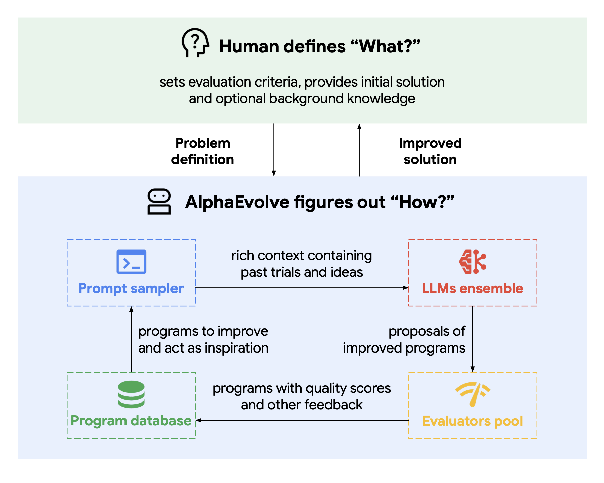
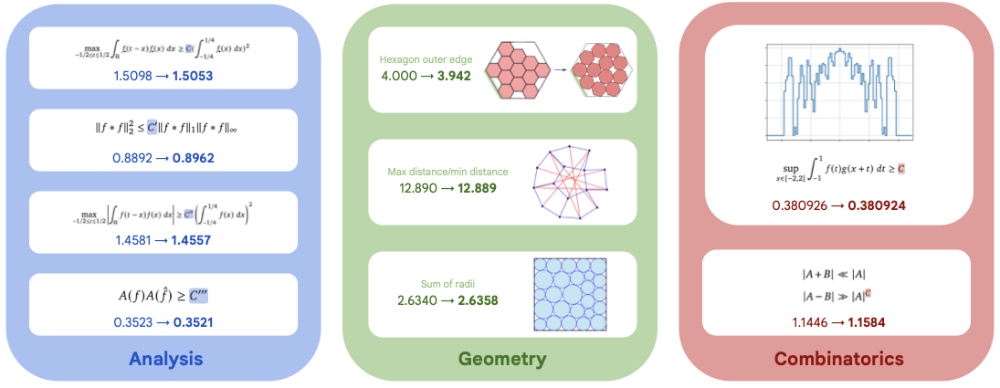

# 26.4 How LLMs Search for New Algorithms: Evolutionary Search and Scientific Discovery

Suppose we want a faster matrix-multiplication kernel. A language model proposes a program, an evaluator compiles it and checks correctness, and a search procedure keeps the strongest candidates. The next proposal is generated from programs that survived the previous round. Here the model is not selecting one action in a fixed episode; it is expanding a population of executable hypotheses.

This setup works when evaluation is cheap and difficult to game. Code can be executed, proofs can be checked, and hardware performance can be measured. In slower sciences, simulation error and experimental cost become part of the problem. This section follows that boundary through AlphaEvolve, interactive world models, test-time memory, multi-agent search, and recursive self-improvement.

## 26.4.1 AlphaEvolve: Put Code Inside an Evolutionary Loop

[AlphaEvolve](https://arxiv.org/abs/2506.13131) combines language-model program generation with evolutionary selection and automatic evaluators. The system receives an initial program, a task description, and one or more evaluators, then searches for programs that score better while preserving correctness constraints.



<div style="text-align: center; font-size: 0.9em; color: var(--vp-c-text-2); margin-top: -10px; margin-bottom: 20px;">
  <em>Figure 1: AlphaEvolve combines a program database, LLM-generated changes, automatic evaluation, and evolutionary selection. Source: <a href="https://arxiv.org/abs/2506.13131" target="_blank" rel="noopener noreferrer">AlphaEvolve paper</a>.</em>
</div>

### Core Idea of AlphaEvolve

Model mathematical discovery as **evolutionary search + LLM code generation**:

```text
┌─────────────────────────────────────────────────────────────┐
│ 1. Population Initialization: Existing algorithms / proofs   │
│    (e.g., Strassen's algorithm for matrix multiplication)    │
├─────────────────────────────────────────────────────────────┤
│ 2. LLM Mutation: Let Gemini generate branches                 │
│    "Please improve this algorithm" / "Try different approaches" │
│    Output: New code                                           │
├─────────────────────────────────────────────────────────────┤
│ 3. Automatic Evaluation: Run the code, measure performance    │
│    (e.g., the number of multiplications for matrix multiplication) │
├─────────────────────────────────────────────────────────────┤
│ 4. Selection: Retain the ones with good performance, eliminate the poor ones │
├─────────────────────────────────────────────────────────────┤
│ 5. Iteration: Return to step 2                                │
└─────────────────────────────────────────────────────────────┘
```

This process is almost identical to the [classic genetic algorithm (GA)](../../chapter03_mdp/dp-mc-td) — the only difference is that the mutation operation changes from "random modification" to "LLM intelligent generation."

### Key Innovations of AlphaEvolve

**Innovation 1: LLM as an Intelligent Mutation Operator**

Traditional GA mutation is random modification — with low success rate. LLM mutation is "understanding the current code + proposing meaningful improvements" — with high success rate.

**Innovation 2: Code as Genes**

Instead of using bit strings as genes, AlphaEvolve uses **executable code**. This allows fitness to be **automatically measured** — by running the code, we can evaluate its performance.

**Innovation 3: Gemini as the LLM Backend**

AlphaEvolve uses Gemini Pro/Ultra as the LLM backend — strong LLMs significantly improve the quality of mutations.

### Discoveries of AlphaEvolve

AlphaEvolve has made **real new discoveries** in multiple domains:

**Discovery 1: New Algorithm for Matrix Multiplication**

For multiplying $4\times4$ complex matrices, the paper reports a program using 48 scalar multiplications. The previous best construction for this setting used 49, corresponding to Strassen's 1969 method. The improvement is valuable because the candidate can be executed and independently checked.



<div style="text-align: center; font-size: 0.9em; color: var(--vp-c-text-2); margin-top: -10px; margin-bottom: 20px;">
  <em>Figure 2: Selected mathematical results reported in the AlphaEvolve paper. The 48-multiplication construction is especially easy to state and verify. Source: <a href="https://arxiv.org/abs/2506.13131" target="_blank" rel="noopener noreferrer">AlphaEvolve paper</a>.</em>
</div>

**Discovery 2: New Bounds in Combinatorics**

In combinatorial problems such as [tensor decomposition](https://en.wikipedia.org/wiki/Tensor_decomposition) and [sorting networks](https://en.wikipedia.org/wiki/Sorting_network), AlphaEvolve has discovered multiple new bounds that surpass the known optimal results.

**Discovery 3: Optimization of Google Infrastructure**

Within DeepMind, AlphaEvolve has been used to optimize:

- Data center scheduling algorithms (saving 0.7% of global computing resources)
- TPU matrix multiplication hardware design
- Machine learning kernel optimization

### The Significance of AlphaEvolve

AlphaEvolve demonstrates:

1. **LLMs can perform real scientific research** — not just "answer questions," but "discover new knowledge"
2. **Evolution + LLM is a powerful combination** — LLM provides intelligence, evolution provides exploration
3. **Automatic evaluation is critical** — only domains that can be automatically evaluated are suitable for this paradigm

## 26.4.2 Genie 3 and Generative World Models

[Genie 3](https://deepmind.google/models/genie/) (DeepMind, 2025.08) is a representative work of generative world models.

### What is a World Model?

A world model is a model that can **predict environmental dynamics**:

```text
Input: current state s_t + action a_t
Output: next state s_{t+1}
```

In reinforcement learning, a world model can **replace the real environment** — policy is trained on the world model, avoiding the costly interaction with the real environment.

### Evolution of the Genie Series

**Genie 1** (2024.02): Learning a world model from videos

- Input: Internet videos
- Output: Can generate controllable "game" environments
- Key: No explicit action labels, the model learns "what is an action" on its own

**Genie 2** (2024.12): 3D world model

- Input: A single image
- Output: Can generate interactive 3D environments
- Key: The environment can maintain consistency for several minutes

**Genie 3** (2025.08): Large-scale, controllable, long-horizon

- Input: Natural language description
- Output: Fully controllable, long-horizon 3D environments
- Key: Can be used to train embodied agents

### Training Genie 3

```text
┌─────────────────────────────────────────────────────────┐
│ Phase 1: Video Pretraining                              │
│   - Large amounts of unlabeled videos                   │
│   - Learning "how the world works"                      │
├─────────────────────────────────────────────────────────┤
│ Phase 2: Action Labeling                                 │
│   - Letting LLM label actions in videos                  │
│   - Learning "what actions lead to what changes"        │
├─────────────────────────────────────────────────────────┤
│ Phase 3: World Model Training                            │
│   - (s_t, a_t, s_{t+1}) triplets                         │
│   - Training a model that can predict s_{t+1}           │
├─────────────────────────────────────────────────────────┤
│ Phase 4: RL Training                                     │
│   - Policy trained on the world model                    │
│   - Avoiding expensive real environment interactions     │
└─────────────────────────────────────────────────────────┘
```

### Applications of Genie 3

**Application 1: Training Embodied Agents**

Robots learn to walk, grasp, and manipulate objects within a world model, avoiding trial-and-error on real robots (which is costly and dangerous).

**Application 2: Game Generation**

Genie 3 can automatically generate playable games. Players describe the desired game, and Genie 3 generates the complete environment.

**Application 3: Simulation Training**

High-risk scenarios such as autonomous driving, industrial control, and surgical procedures can be trained within a world model and then deployed into real-world environments.

### Limitations of Genie 3

- **Accuracy**: The world model is not 100% accurate—long-term predictions may drift.
- **Generalization**: Simulating environments outside the training distribution is challenging.
- **Computational Cost**: High-quality world model inference is computationally expensive.

## 26.4.3 Titans and Long-Term Memory Architecture

[Titans](https://arxiv.org/abs/2501.00663) (Google, 2024.12 release, 2025 revised version) represent a new direction in LLM architecture—**long-term memory**.

### Motivation for Titans

Transformers have a fundamental limitation: the **context window**. Even when extended to 1M tokens, they cannot handle "infinite-length" inputs. Titans aim to address this issue.

### Design of Titans

Titans introduces a **neural long-term memory**:

```text
┌──────────────────────────────────────────────────────────┐
│ Short-term memory: attention (standard Transformer)      │
│   - Processes recent tokens                              │
│   - Limited capacity (context window)                    │
├──────────────────────────────────────────────────────────┤
│ Long-term memory: neural memory module (new)             │
│   - Continuously learns and stores                       │
│   - Infinite capacity                                     │
├──────────────────────────────────────────────────────────┤
│ Persistent memory: task-related knowledge (system prompt, knowledge base) │
│   - Constant                                           │
└──────────────────────────────────────────────────────────┘
```

The three-layer memory system enables Titans to handle **infinite-length inputs**—the long-term memory continuously stores historical information.

### The Relationship Between Titans and RL

The core of Titans is **learning how to remember**—and this itself is an RL problem:

- **State**: Current input + current memory
- **Action**: How to update memory (write / forget / update)
- **Reward**: Future task performance (if useful information is remembered, task performance improves)

Titans use **surprise** as an internal reward—when the input is "surprising," memory is strengthened; when the input is "repetitive," memory is weakened. This is a form of **self-supervised RL**—the model generates its own reward.

### Experimental Results of Titans

On long-horizon tasks, Titans significantly outperform Transformers:

- **Task — Language modeling (10M context)**
  - Transformer: OOM
  - Titans: 67% perplexity improvement
- **Task — Long-document QA**
  - Transformer: 55%
  - Titans: 78%
- **Task — Temporal prediction**
  - Transformer: 65%
  - Titans: 82%

Titans demonstrate that **long-term memory is the next direction for scaling**—not just "wider and deeper," but also "better at remembering."

## 26.4.4 M-GRPO and Multi-Agent Search Training

[Multi-Agent Deep Research: Training Multi-Agent Systems with M-GRPO](https://arxiv.org/abs/2511.13288) (Byte Seed, 2025.11) uses M-GRPO — a multi-agent extension of Group Relative Policy Optimization — to train multi-agent search systems.

### System Design of M-GRPO

A multi-agent system consists of a main agent and multiple sub-agents:

```text
┌─────────────────────────────────────────────────────────┐
│ Main Agent (planner): Overall planning                  │
│   - Receives a task                                     │
│   - Breaks it into subtasks                             │
│   - Schedules sub-agents                                │
├─────────────────────────────────────────────────────────┤
│ Sub Agents (tool executors): Tool execution             │
│   - Multi-round invocation of search, code, etc. tools  │
│   - Each has a different frequency and variable call count │
├─────────────────────────────────────────────────────────┤
│ Hierarchical Credit Assignment                          │
│   - The main agent and sub-agents compute group-relative │
│   - Exchange minimal statistics via a shared store      │
└─────────────────────────────────────────────────────────┘
```

### Training Method of M-GRPO

M-GRPO addresses three challenges in multi-agent reinforcement learning training:

- **Hierarchical credit assignment**: The main agent and sub-agents separately compute group-relative advantages, avoiding "contribution confusion"
- **Trajectory alignment**: Sub-agent call counts vary, and trajectory alignment schemes are used to generate fixed-size batches
- **Decoupled training**: Agents are distributed across independent servers, exchanging statistics through a shared store, without requiring cross-server backpropagation

On benchmarks such as GAIA, XBench-DeepSearch, and WebWalkerQA, M-GRPO consistently outperforms single-agent GRPO and multi-agent GRPO with "frozen sub-agents."

### Relationship Between M-GRPO and AlphaEvolve

Both approaches use LLM + RL/search, but from different perspectives:

- **AlphaEvolve**: Evolutionary search (gradient-free, population-based), focused on algorithm discovery
- **M-GRPO**: Multi-agent RL (based on GRPO), focused on tool-enhanced deep research

They represent two complementary paradigms in LLM-driven discovery.

## 26.4.5 Recursive Self-Improvement

**Recursive Self-Improvement (RSI)** is the ultimate form of LLM-driven discovery — **the model improves itself**.

This concept represents the next stage in the evolution of LLMs, where the model not only learns from data but also iteratively refines its own architecture, training procedures, and reasoning capabilities. RSI enables models to autonomously enhance their performance, leading to more sophisticated and adaptive systems.

### The Core Loop of RSI

```text
┌─────────────────────────────────────────────────────┐
│ 1. Current model M_t evaluates its own capabilities  │
│    - In which tasks does it perform well? In which   │
│      tasks does it perform poorly?                   │
├─────────────────────────────────────────────────────┤
│ 2. Generate improvement plans                        │
│    - Design new training data                        │
│    - Adjust training hyperparameters                 │
│    - Improve algorithms                              │
├─────────────────────────────────────────────────────┤
│ 3. Execute improvements                              │
│    - Train a new model M_{t+1} using the plan         │
├─────────────────────────────────────────────────────┤
│ 4. Evaluate the new model                           │
│    - Is M_{t+1} better than M_t?                     │
│    - If yes, retain M_{t+1}; if not, roll back       │
├─────────────────────────────────────────────────────┤
│ 5. Return to step 1                                  │
└─────────────────────────────────────────────────────┘
```

### Current State of RSI

By mid-2026, RSI remains a **research concept** with no industrial-level implementation. The reasons are as follows:

**Challenge 1: Inaccuracy in Self-Assessment**

Models find it difficult to accurately evaluate their own capabilities — they are prone to overestimation (Dunning-Kruger effect).

**Challenge 2: Explosion of Search Space for Improvement Strategies**

The possible combinations of training data, hyperparameters, and algorithms are astronomically large.

**Challenge 3: Safety Risks**

If a model can improve itself indefinitely, it may surpass human control — this is a core concern in [AI safety](../../chapter30_alignment_failures/classical-failures).

### Partial Implementations of RSI

Although there is no complete RSI system, there are several **partial implementations**:

- **AutoGPT** (2023): An early attempt with limited effectiveness
- **SRPO** ([arXiv:2406.01660](https://arxiv.org/abs/2406.01660)): Trains a preference model using self-improvement process (Cohere, 2024)
- **Voyager** ([arXiv:2305.16291](https://arxiv.org/abs/2305.16291)): A Minecraft agent that autonomously learns new skills
- **DeepMind's Self-Play System**: A model improves itself by playing against itself

These are early forms of RSI — demonstrating partial feasibility, but still far from the true "recursive self-improvement."

## 26.4.6 Common Pattern of LLM-driven Discovery

The common pattern of these works (AlphaEvolve, Genie 3, Titans, MIRAS, RSI):

### LLM as Intelligent Guidance for Search

Traditional search (MCTS, Beam Search) requires manually designed heuristics. LLMs can **automatically generate heuristics** — making the search more intelligent.

### Automatic Evaluation is Key

AlphaEvolve is able to discover new algorithms because **the performance of algorithms can be automatically measured** (by running the code). This is the prerequisite for LLM-driven discovery — **only domains that can be automatically evaluated are suitable**.

### Combination > Single Method

- AlphaEvolve = LLM + Evolution
- Genie 3 = LLM + World Model
- Titans = LLM + Long-term Memory
- Multi-Agent Deep Research = LLM + Multi-agent + RL

**Combining multiple methods** is stronger than using a single method — this is the new form of RL in the LLM era.

### From "Training Policy" to "Training a System"

Traditional RL trains a single policy. LLM-driven discovery trains a **complete research system** — multiple agents + memory + search + tools.

## 26.4.7 Future Directions

### Scientific Discovery

Extend the AlphaEvolve approach to:

- **Biology**: Protein design, drug discovery
- **Chemistry**: New molecular synthesis pathways
- **Physics**: New experimental design, new theory validation

### Education

Use LLM-driven discovery to personalize education — identifying the most suitable learning path for each student.

## 26.4.7 How to Decide Whether the System Discovered Something New

Before accepting an “AI discovery,” record four facts:

1. What is the candidate object: a program, parameter set, environment, memory, or model weight?
2. Which constraints does the evaluator check, and how could a candidate exploit it?
3. How many candidates were tested, including failures, and what was the total compute cost?
4. Can an independent implementation, proof checker, experiment, or hardware run reproduce the best result?

AlphaEvolve's matrix result is persuasive because these questions have concrete answers. Moving to biology, chemistry, or education makes evaluation slower and introduces simulation bias, safety constraints, and long-term outcomes. Candidate generation is often easier than obtaining a cheap and trustworthy verifier.

The common discovery loop is bounded: generate candidates, observe consequences, write feedback back into the system, and retain a rollback path. Genie 3 supplies interactive generated environments, Titans studies memory updated at test time, M-GRPO trains hierarchical multi-agent search, and recursive self-improvement expands the object being modified. None removes the need for independent evaluation.

## References

- Novikov et al. [AlphaEvolve: A Coding Agent for Scientific and Algorithmic Discovery](https://arxiv.org/abs/2506.13131).
- Google DeepMind. [AlphaEvolve: A Gemini-Powered Coding Agent for Designing Advanced Algorithms](https://deepmind.google/blog/alphaevolve-a-gemini-powered-coding-agent-for-designing-advanced-algorithms/).
- Google DeepMind. [Original AlphaEvolve announcement URL](https://deepmind.google/discover/blog/alphaevolve-a-gemini-powered-coding-agent-for-designing-advanced-algorithms/).
- Google DeepMind. [Genie 3](https://deepmind.google/models/genie/).
- Behrouz, Zhong, and Mirrokni. [Titans: Learning to Memorize at Test Time](https://arxiv.org/abs/2501.00663).
- Hong et al. [Multi-Agent Deep Research: Training Multi-Agent Systems with M-GRPO](https://arxiv.org/abs/2511.13288).
- Choi et al. [Self-Improving Robust Preference Optimization](https://arxiv.org/abs/2406.01660).
- Wang et al. [Voyager: An Open-Ended Embodied Agent with Large Language Models](https://arxiv.org/abs/2305.16291).
