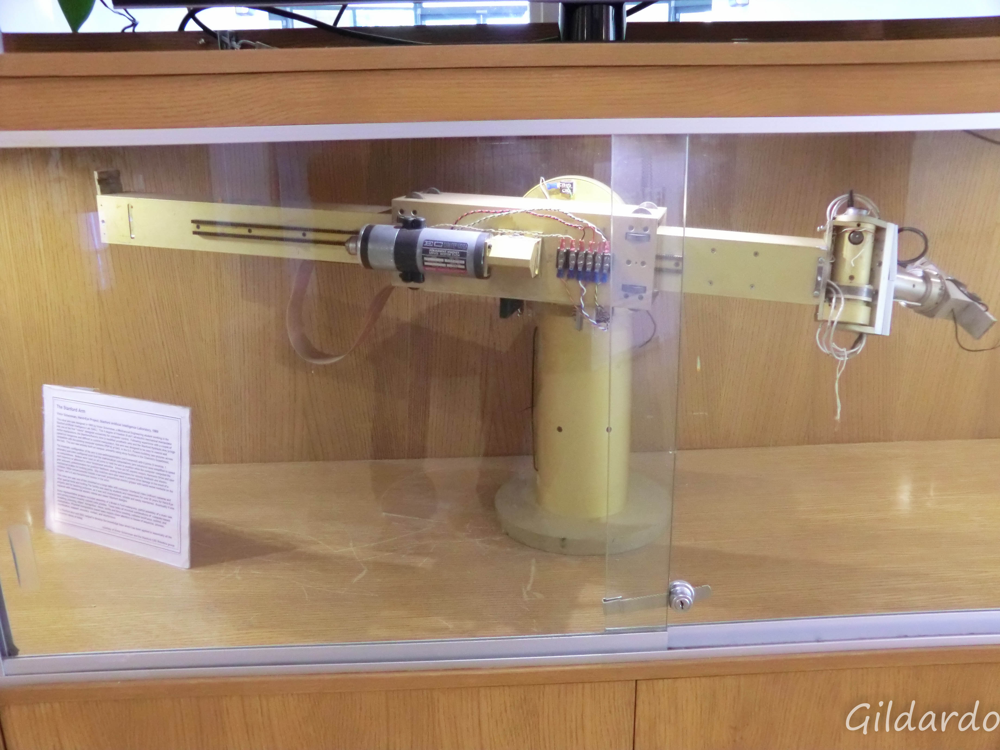
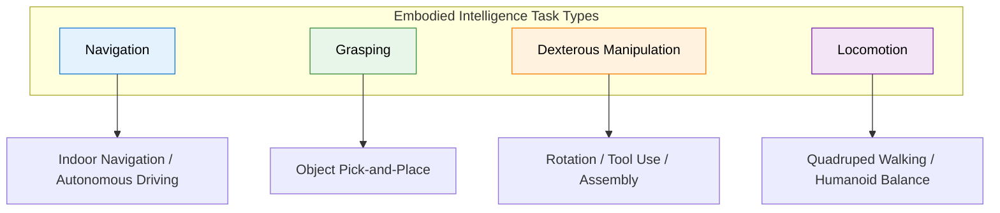
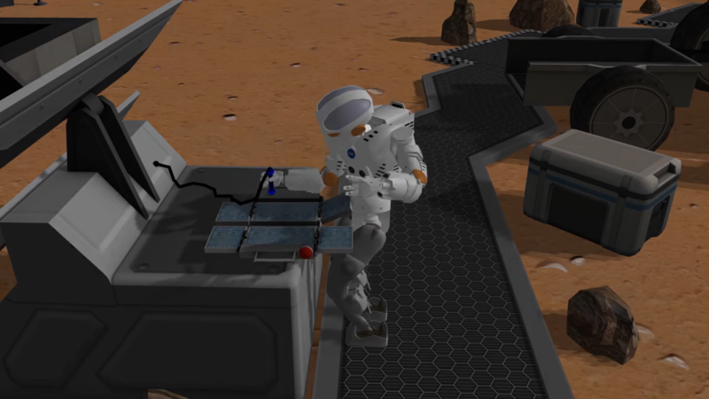
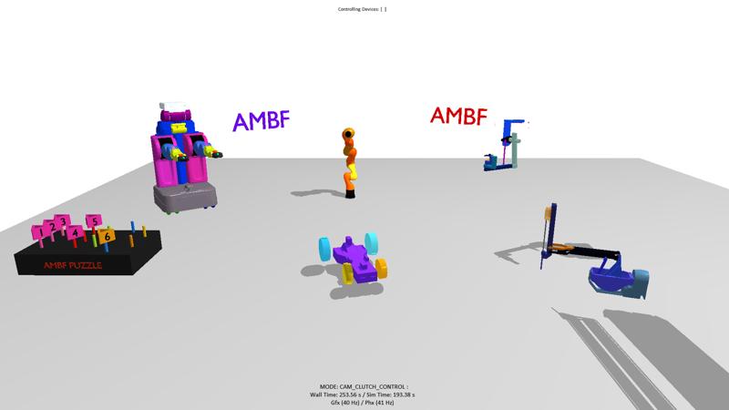
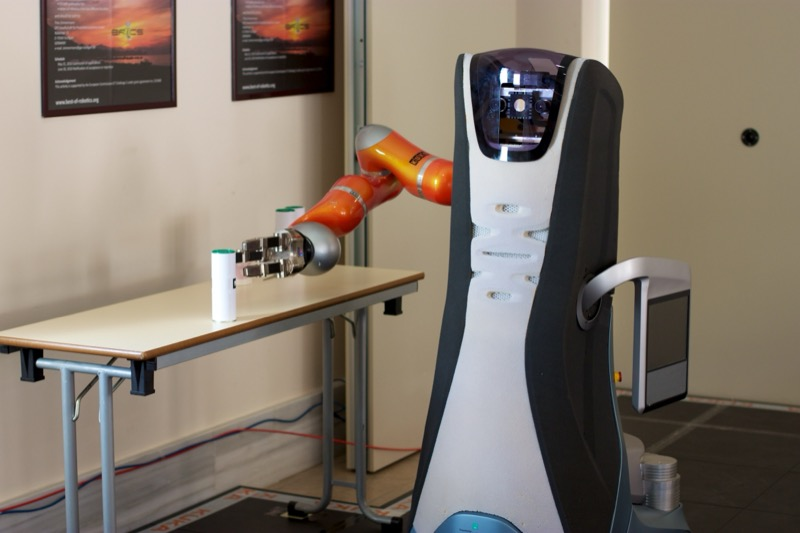
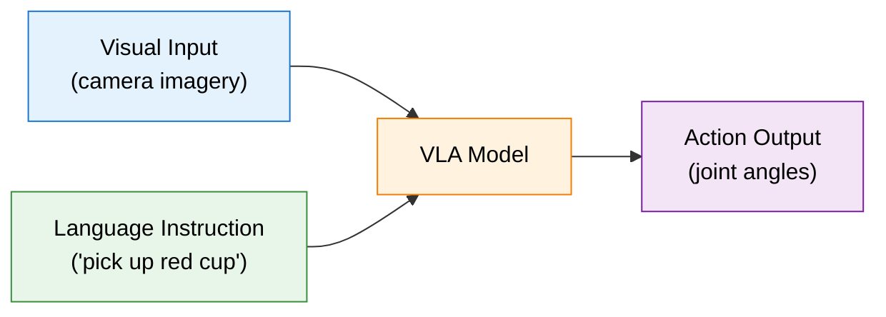
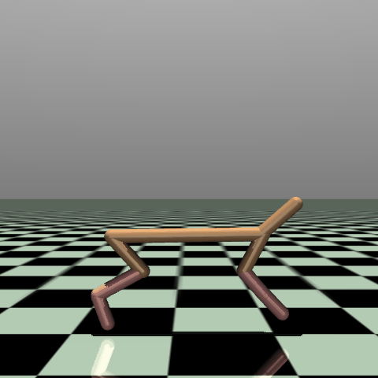
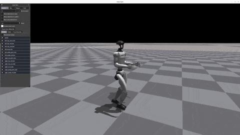

# 10.1 Embodied Intelligence -- Bringing RL into the Physical World

In the previous eight chapters, our agents lived in the "digital world" -- CartPole's inverted pendulum, Atari's pixels, LLM's tokens. These settings share a common property: trial-and-error is nearly free, `env.reset()` completes in milliseconds, and the environment is fully controllable. But the ultimate goal of RL goes far beyond this -- we want agents that can enter the real world, control robots, drive cars, and complete complex tasks in factories and hospitals.

This is the problem **Embodied Intelligence** aims to solve: giving AI a "body" to perceive, decide, and act in the physical world.

## What Is Embodied Intelligence?

Embodied intelligence refers to **AI systems that interact with the environment through a physical body, completing tasks within a perception-decision-action closed loop**. It is not "disembodied intelligence" that purely processes data in digital space, but rather emphasizes that intelligence must arise from and be manifested through a body's interaction with the real world.

This concept comes from a fundamental insight in cognitive science: human intelligence is not "thought up" in a vacuum, but is shaped through continuous interaction with the physical world. Infants understand physical laws through grasping, crawling, and colliding -- this "bodily experience" is the foundation of cognitive development. Embodied intelligence brings this idea to AI -- letting AI also learn through "bodily experience."



<div style="text-align: center; font-size: 0.9em; color: var(--vp-c-text-2); margin-top: -10px; margin-bottom: 20px;">
  <em>Figure 1: The Stanford Arm, the world's first fully electric, computer-controlled robotic arm, which pioneered complex manipulation in the physical world. Source: <a href="https://commons.wikimedia.org/wiki/File:The_Stanford_Arm.jpg" target="_blank" rel="noopener noreferrer">Wikimedia Commons</a></em>
</div>

### Core Characteristics

Embodied intelligence systems have three core characteristics:

1. **Embodiment**: The agent has a physical or simulated body that can apply force to the environment, move objects, and change the world state
2. **Perception-action closed loop**: The agent's perception influences its actions, actions change the environment, and environmental changes feed back to perception -- forming a closed loop
3. **Physical constraints**: Actions are constrained by physical laws (gravity, friction, collision); trial-and-error has costs; failures have consequences

## How Embodied RL Differs from Standard RL

You may have noticed that embodied intelligence also uses the RL framework -- states, actions, rewards, policies. So what is the fundamental difference from CartPole or PPO-trained LLMs?

| Dimension               | Standard RL (CartPole, LLM)                | Embodied RL                                                          |
| ----------------------- | ------------------------------------------ | -------------------------------------------------------------------- |
| Action space            | Mostly discrete (left/right, tokens)       | Continuous and high-dimensional (joint angles, torques, velocities)  |
| State space             | Low-dimensional vectors or token sequences | Multimodal (vision + force + proprioception + language)              |
| Environment dynamics    | Fast simulation, instant reset             | Expensive physical simulation, real-world nearly impossible to reset |
| Cost of trial-and-error | Nearly zero                                | High (time, equipment wear, safety risks)                            |
| Generalization          | Fixed environment suffices                 | Must adapt to varied physical conditions                             |
| Sample efficiency       | Can afford massive trial-and-error         | Must use every interaction efficiently                               |

The core difference comes down to one point: **in standard RL, you don't need to care about "how actions change the physical world"; in embodied intelligence, this is the starting point for every problem.**

## Mainstream Embodied Intelligence Task Types

Embodied intelligence tasks vary widely, but by how the agent interacts with the environment, they can be grouped into several major categories. In these tasks, reinforcement learning plays different roles and solves different pain points:

### 1. Navigation

**Core objective**: The agent moves to a target location in an unknown or partially known environment (e.g., a robot vacuum returning to charge, an autonomous vehicle driving from point A to point B).

- **Task subdivisions**:
  - **PointGoal Navigation**: The target is given as relative coordinates ("walk 5 meters forward, turn left"), primarily testing obstacle avoidance and path planning.
  - **ObjectGoal Navigation**: The target is a semantic concept ("find the refrigerator in the kitchen"), requiring the agent to have commonsense reasoning and scene understanding.
- **Technical principles**: Traditional methods rely on SLAM (Simultaneous Localization and Mapping) for map construction followed by A\* path planning. In embodied RL, **end-to-end learning** is popular: directly input RGB-D camera and LiDAR data, extract features through CNN/Transformer, and output discrete (forward, turn left, turn right) or continuous chassis velocity commands.
- **Challenges**: Mapping between visual features and geometric space, long-term memory (explored dead ends should not be revisited).

### 2. Grasping

**Core objective**: A robotic arm picks up objects of specified shapes, materials, or stacking configurations from a tabletop.

- **Task details**: Grasping is the most basic sub-task of robotic manipulation. For a parallel jaw gripper, the agent needs to predict a **6-DoF (six degrees of freedom) grasp pose** (x, y, z coordinates plus Roll, Pitch, Yaw rotation angles) and decide when to close the gripper.
- **Technical principles**:
  - In RL, grasping is typically modeled as a multi-step Markov Decision Process. The state is a point cloud or depth map of tabletop objects.
  - **Reward shaping** is critically important in grasping training. If you only give +1 reward for "successful grasp," the agent faces an extremely sparse reward signal. Therefore, intermediate rewards are typically set: approaching the object (+0.1) -> touching the object (+0.3) -> successfully grasping and lifting (+1.0).

### 3. Dexterous Manipulation

**Core objective**: Using multi-finger dexterous hands (such as the Shadow Hand) for object rotation, bimanual coordination, tool use (such as screwing, cutting).

- **Technical principles**: More complex manipulation than grasping. Dexterous hands have very high degrees of freedom (e.g., the Shadow Hand has 24 joint degrees of freedom), and the action space dimension easily exceeds 20. Exploration in this high-dimensional continuous space is very difficult.
- **Classic case**: OpenAI training a robotic hand to solve a Rubik's Cube. They used the PPO algorithm and introduced extreme **Asymmetric Domain Randomization (ADR)** in simulation, training a policy network that could rotate a Rubik's Cube with one hand in the real world.
- **Challenges**: Extremely complex **contact dynamics** -- sliding, friction, and micro-deformation between fingers and object surfaces are very difficult to perfectly reproduce in simulation engines.


<div style="text-align: center; font-size: 0.9em; color: var(--vp-c-text-2); margin-top: -10px; margin-bottom: 20px;">
  <em>Figure 2: The PR2 robot equipped with advanced grasping hands, commonly used for research in dexterous manipulation and human-robot interaction. Source: <a href="https://commons.wikimedia.org/wiki/File:PR2_robot_with_advanced_grasping_hands.JPG" target="_blank" rel="noopener noreferrer">Wikimedia Commons</a></em>
</div>

### 4. Quadruped / Humanoid Locomotion

**Core objective**: Controlling a robot's joints to maintain dynamic balance and complete movement on complex terrain such as flat ground, stairs, and grass (e.g., Boston Dynamics' Atlas, Unitree's Go2 and H1).

- **Technical principles**:
  - Traditional control theory typically uses ZMP (Zero Moment Point) and MPC (Model Predictive Control) to compute foot placement.
  - Modern embodied RL uses neural networks to directly output **target joint angles**. At the low level, a high-frequency (e.g., 1000Hz) PD controller converts angle differences into actual motor torques: $\tau = K_p (q_{target} - q_{current}) - K_d \dot{q}_{current}$.
  - The RL policy network typically runs at 50Hz, receiving IMU (attitude, angular velocity) and joint encoder data, and outputting target angles $q_{target}$ to the low-level PD controller.
- **Challenges**: Balance in underactuated systems, bipedal robots' high center of gravity making them prone to falling.


<div style="text-align: center; font-size: 0.9em; color: var(--vp-c-text-2); margin-top: -10px; margin-bottom: 20px;">
  <em>Figure 3: Boston Dynamics' BigDog quadruped robot, capable of maintaining dynamic balance and walking on complex terrain. Source: <a href="https://commons.wikimedia.org/wiki/File:Big_dog_military_robots.jpg" target="_blank" rel="noopener noreferrer">Wikimedia Commons</a></em>
</div>



## From Math and Code: Embodied Intelligence vs. Traditional RL

How does the RL we studied in earlier chapters (such as CartPole or Atari games) differ from RL running on embodied agents (like robot dogs, robotic arms)? We can compare from two dimensions: mathematical modeling and code implementation.

### 1. From MDP to POMDP (Partial Observability)

- **Traditional RL (fully observable)**: Typically assumes the environment is a Markov Decision Process (MDP). For example, CartPole's state $S = [x, \dot{x}, \theta, \dot{\theta}]$ is only 4-dimensional, containing **all** the physical information of the system. Given this state, the next step is fully determined.
- **Embodied intelligence (partially observable)**: The physical world is a **Partially Observable Markov Decision Process (POMDP)**. A robot can never access the "absolute true physical state of the world" (e.g., exact center-of-mass velocity, ground friction coefficient); it can only obtain noisy **observations** $O_t$ through sensors.
  - **Mathematical derivation**: The policy is no longer simply $\pi(a_t | s_t)$, but depends on the history of observations to form a **belief state**: $b_t(s) = \mathbb{P}(s_t | O_1, A_1, ..., O_t)$.
  - **Code in practice**: In traditional RL, you might only need an MLP. But in embodied RL, you must use **multi-frame observation stacking** or RNN/LSTM to recover implicit information (e.g., estimating velocity from two consecutive frames of position).

    ```python
    # Traditional RL observation space (CartPole)
    observation_space = gym.spaces.Box(low=-inf, high=inf, shape=(4,))

    # Embodied intelligence (e.g., Unitree Go2 quadruped robot) observation space
    # is typically a high-dimensional dictionary including historical frames
    observation_space = gym.spaces.Dict({
        'base_lin_vel': Box(shape=(3,)),         # Estimated center-of-mass linear velocity
        'base_ang_vel': Box(shape=(3,)),         # IMU-measured angular velocity
        'projected_gravity': Box(shape=(3,)),    # Projected gravity (reflects body tilt)
        'dof_pos': Box(shape=(12,)),             # Current angles of 12 joints
        'dof_vel': Box(shape=(12,)),             # Angular velocities of 12 joints
        'history': Box(shape=(5, 33))            # Observation history stack from past 5 frames
    })
    ```

### 2. Action Space: From Low-Dimensional Discrete to High-Dimensional Continuous

- **Traditional RL (discrete output)**: Atari game actions are discrete (up, down, left, right), $a_t \in \{0, 1, ..., N\}$. The policy network's final layer is typically Softmax outputting probabilities for each action.
- **Embodied intelligence (continuous control)**: Real robot joint motors require continuous voltage, torque, or target angle inputs. For example, a humanoid robot with 19 degrees of freedom (such as Unitree H1) has an action $a_t \in \mathbb{R}^{19}$ that is a 19-dimensional continuous vector.
  - **Mathematical modeling**: Continuous control cannot enumerate with Softmax. We typically assume the policy follows a **Multivariate Gaussian Distribution**:
    $$
    \pi_\theta(a|s) = \frac{1}{\sqrt{(2\pi)^k |\Sigma|}} \exp\left(-\frac{1}{2}(a-\mu_\theta(s))^T \Sigma^{-1} (a-\mu_\theta(s))\right)
    $$
    The neural network outputs a $k$-dimensional mean vector $\mu_\theta$ (corresponding to target actions for each joint) and a $k$-dimensional standard deviation vector (determining exploration randomness).
  - **Code in practice**: The network's continuous output is typically in `[-1, 1]` and must be mapped to real-world joint angle ranges through **action scaling**:

    ```python
    # Policy network outputs actions (assuming 12-DOF robot dog)
    action = policy_net(observation)  # 12-dimensional vector in range [-1.0, 1.0]

    # Convert to real-world target joint angles (rad)
    # default_dof_pos is the robot dog's initial standing pose,
    # action_scale is typically set to around 0.25
    target_dof_pos = default_dof_pos + action * action_scale

    # Send target_dof_pos to the low-level PD controller to produce motor torques
    ```

### 3. Environment Dynamics and the Sim-to-Real Gap

- **Traditional RL (environment consistency)**: The transition dynamics $\mathcal{P}(s_{t+1}|s_t, a_t)$ are identical between training and testing environments. The Atari model you train on your computer runs the same Atari code during testing.
- **Embodied intelligence (Sim-to-Real Gap)**: Trial-and-error on real hardware is too expensive (breaking equipment worth tens of thousands), so training must happen in simulation. But the simulation engine's physical parameters $\mu_{sim}$ (friction, mass, latency) cannot perfectly match the real world $\mu_{real}$.
  - **Mathematical modeling**: To prevent the policy from overfitting in simulation, **domain randomization** is introduced. We treat physical parameters $\mu$ as a distribution $p(\mu)$, and the objective changes from "maximize return in a single environment" to "maximize average return over the parameter distribution":
    $$
    J(\theta) = \mathbb{E}_{\mu \sim p(\mu)} \left[ \mathbb{E}_{\tau \sim \mathcal{P}_\mu}[R(\tau)] \right]
    $$
  - **Code in practice**: During the RL code's `reset()` or `step()` phases, you must inject aggressive randomization for various "dirty data" in the physical world:

    ```python
    def apply_domain_randomization(self):
        # 1. Randomly change the robot's mass distribution (e.g., +/- 20%)
        self.model.body_mass[:] *= np.random.uniform(0.8, 1.2)

        # 2. Randomly change ground friction (simulating tile, carpet, concrete, etc.)
        self.model.geom_friction[:] *= np.random.uniform(0.5, 1.5)

        # 3. Simulate real motor latency (communication delay)
        # Real robots have 10~20ms delay for commands to reach motors;
        # without simulating this, the real robot will certainly fall
        delayed_action = self.action_history[-self.delay_steps]

        # 4. Inject Gaussian noise into observation data (simulating sensor error)
        noisy_observation = true_observation + np.random.normal(0, noise_std)
        return noisy_observation
    ```

### 4. Reward Function Design: From Sparse Goals to Extremely Dense Reward Engineering

- **Traditional RL (sparse rewards)**: In Atari games or Go, rewards are typically very simple. +1 for winning, -1 for losing. The RL algorithm must figure out over thousands of delayed steps which step was correct.
- **Embodied intelligence (dense engineering)**: If you only give the robot "reach the goal +1, fall -1," in the continuous high-dimensional physical world, the robot may never learn to walk (it might discover that rolling in place also inches toward the goal).
  - **Core insight**: Most effort in embodied RL goes into designing a **composite reward function** with a dozen or more sub-terms.
  - **Mathematical modeling**: The reward is decomposed into a weighted sum of "task rewards" and "regularization penalties":
    $$
    R_t = \sum_{i} w_i r_{task, i} - \sum_{j} \lambda_j c_{penalty, j}
    $$
  - **Code in practice**: Looking at actual quadruped robot RL code (e.g., in `unitree_rl_gym`), each frame's reward calculation can span dozens of lines, like carefully crafting a work of art:

    ```python
    def compute_reward(self):
        # 1. Task reward: encourage the robot to move toward target velocity (command tracking)
        lin_vel_error = np.sum(np.square(self.commands[:2] - self.base_lin_vel[:2]))
        reward_tracking = np.exp(-lin_vel_error / 0.25) * self.dt

        # 2. Orientation penalty: penalize body tilt to keep it stable
        penalty_orientation = np.sum(np.square(self.projected_gravity[:2])) * -0.5

        # 3. Energy penalty: penalize excessive motor torque to prevent overheating
        penalty_torques = np.sum(np.square(self.torques)) * -0.00001

        # 4. Action smoothness penalty: penalize large action changes between
        #    adjacent frames to prevent robot twitching (very common on real hardware)
        penalty_action_rate = np.sum(np.square(self.last_actions - self.actions)) * -0.01

        return reward_tracking + penalty_orientation + penalty_torques + penalty_action_rate
    ```

### 5. Network Architecture Insight: Asymmetric Actor-Critic

- **Traditional RL**: In Actor-Critic algorithms like PPO, the Actor network (policy $\pi$) and Critic network (value $V$) typically receive **exactly the same** observation data (state/observation).
- **Embodied intelligence (Privileged Learning)**: In simulation environments, we actually have a "God's-eye view." The simulation engine knows the absolute precise mass, friction coefficient, wind speed, and other hidden information. But a real robot in the physical world can only see noisy camera and IMU data.
  - **Core insight**: Why not let the Critic have the "God's-eye view" while keeping the Actor at the "robot's view"? This is the **Asymmetric Actor-Critic (teacher-student paradigm)**.
  - **Mathematical and engineering advantages**: Since the Critic can see noise-free privileged states ($S_{priv}$) during training, its estimate of value $V(S_{priv})$ is extremely accurate. This greatly reduces the variance of policy gradients, allowing the Actor $\pi(a|O_{noisy})$ to converge quickly and stably. At deployment, we only need to take the Actor network; the Critic is not needed.
  - **Code in practice**: The network inputs become separated:

    ```python
    # Asymmetric Actor-Critic in embodied intelligence training

    # 1. Real-world observation (noisy IMU, camera depth maps, etc.)
    obs = env.get_noisy_observation()

    # 2. Simulation-only privileged information (absolute velocity, friction coefficient, push disturbances)
    privileged_obs = env.get_privileged_state()

    # 3. Value network (Critic) takes privileged information; V estimates are very accurate
    value = critic_net(privileged_obs)

    # 4. Policy network (Actor) only takes noisy observations,
    #    learning to make decisions under uncertainty
    action = actor_net(obs)

    # When deploying to real hardware, discard the Critic, keep only the Actor
    ```

## Mainstream Embodied RL Paradigms

Embodied RL training does not invent new algorithms from scratch. Instead, it selects the most suitable algorithms from what we learned earlier and adapts them for the physical world.

### On-Policy: PPO -- The Most Common Choice in Embodied RL

[PPO](https://arxiv.org/abs/1707.06347) is the **most widely used RL algorithm** in embodied intelligence. The reasons are straightforward:

- **Stability**: PPO's clipping mechanism naturally suits continuous action spaces and avoids policy collapse like Vanilla PG
- **Scalability**: PPO can efficiently train across large numbers of parallel simulators, which is critical in embodied intelligence
- **Data utilization**: Compared to off-policy algorithms like SAC, PPO's data utilization is slightly lower, but training throughput is higher

On [NVIDIA Isaac Gym](https://developer.nvidia.com/isaac-gym), PPO is used to simultaneously train thousands of robots -- its advantage in large-scale parallel sampling makes it the default choice for embodied RL. OpenAI's robotic hand solving a Rubik's Cube ([Solving Rubik's Cube with a Robot Hand](https://openai.com/index/solving-rubiks-cube/)), the quadruped robot [ANYmal](https://www.anybotics.com/)'s terrain walking, are all representative applications of PPO.

### Off-Policy: SAC's Role

[SAC](https://arxiv.org/abs/1801.01290) (Soft Actor-Critic) plays a "fine-tuning" role in embodied intelligence. Its maximum entropy framework encourages policy exploration -- particularly valuable for tasks requiring diverse behaviors like dexterous manipulation.

SAC's advantage lies in **sample efficiency** -- it reuses historical data through experience replay, allowing each interaction's data to be learned multiple times. When training on real robots (not simulation), sample efficiency is critical because real interaction is so expensive.

In practice, a typical embodied RL paradigm is: **pretrain with PPO in large-scale simulation, then fine-tune with SAC on real robots** -- leveraging SAC's sample efficiency to minimize real-world interactions.

## Common Simulation Environments for Embodied Intelligence


<div style="text-align: center; font-size: 0.9em; color: var(--vp-c-text-2); margin-top: -10px; margin-bottom: 20px;">
  <em>Figure 4: Robot control testing in a simulation environment. High-quality physics simulation engines are essential infrastructure for training embodied agents. Source: <a href="https://commons.wikimedia.org/wiki/File:5R_robot.gif" target="_blank" rel="noopener noreferrer">Wikimedia Commons</a></em>
</div>

Simulation environments are the infrastructure of embodied RL -- without high-quality simulators, embodied intelligence can only trial-and-error on real robots, which is prohibitively expensive. Here are the most commonly used simulators in industry and research:

### MuJoCo



<div style="text-align: center; font-size: 0.9em; color: var(--vp-c-text-2); margin-top: -10px; margin-bottom: 20px;">
  <em>Figure 5: Robot joint and dynamics simulation example. Physics engines like MuJoCo provide accurate contact modeling and kinematic computation. Source: <a href="https://commons.wikimedia.org/wiki/File:SpaceRoboticsChallenge_Task2.png" target="_blank" rel="noopener noreferrer">Wikimedia Commons</a></em>
</div>

[MuJoCo](https://mujoco.org/) (Multi-Joint dynamics with Contact) is the "venerable standard" in robot simulation. Its core advantage is **accurate contact dynamics modeling and fast simulation speed**. MuJoCo can precisely simulate collisions and contact forces between rigid bodies -- critical for grasping, walking, and similar tasks. DeepMind's [dm_control](https://github.com/google-deepmind/dm_control) suite and OpenAI Gym's continuous control environments are built on MuJoCo. In 2021, MuJoCo was acquired by DeepMind and open-sourced; it is now freely available.

### Isaac Gym / Isaac Sim



<div style="text-align: center; font-size: 0.9em; color: var(--vp-c-text-2); margin-top: -10px; margin-bottom: 20px;">
  <em>Figure 6: Multi-robot parallel simulation framework. The Isaac Gym/Sim series leverages GPU parallelism to enable simultaneous training of large numbers of robots. Source: <a href="https://commons.wikimedia.org/wiki/File:Asynchronous_Multi-Body_Framework,_AMBF.png" target="_blank" rel="noopener noreferrer">Wikimedia Commons</a></em>
</div>

NVIDIA's Isaac series represents **GPU-parallel robot simulation**. Isaac Gym (now deprecated; successor is Isaac Lab/Isaac Sim) can parallelize thousands of robot environments on a single GPU, achieving training speeds one to two orders of magnitude faster than MuJoCo.

::: info Isaac Lab Replaces Isaac Gym
NVIDIA's Isaac Gym has been marked as deprecated. Its successor, **Isaac Lab**, is now the standard tool for GPU-parallel robot simulation. Isaac Lab is built on Isaac Sim, supports training tens of thousands of robots simultaneously, and is compatible with the Gymnasium interface. Installation: `pip install isaacsim[all]`. See [Isaac Lab GitHub](https://github.com/isaac-sim/IsaacLab).
:::

The core value of the Isaac series is **freeing simulation from the CPU bottleneck**. The PPO + Isaac Gym combination shortens training from days to tens of minutes.

### ManiSkill / Sapien


<div style="text-align: center; font-size: 0.9em; color: var(--vp-c-text-2); margin-top: -10px; margin-bottom: 20px;">
  <em>Figure 7: Simulation scene for grasping and manipulation tasks using a robotic arm. This is the domain where ManiSkill and Sapien excel. Source: <a href="https://commons.wikimedia.org/wiki/File:Robotic_simulation_using_Robcad_software.jpg" target="_blank" rel="noopener noreferrer">Wikimedia Commons</a></em>
</div>

[ManiSkill](https://maniskill.readthedocs.io/) (based on the [Sapien](https://sapien.ucsd.edu/) simulator) is a simulation benchmark focused on **robot manipulation**. It provides a series of standardized manipulation tasks -- from simple pushing to complex multi-step assembly -- and a unified evaluation interface. If you work on grasping, placing, or assembly tasks, ManiSkill is currently the most mature benchmark.

| Simulator             | Core Advantage                                            | Best Suited For                                            |
| --------------------- | --------------------------------------------------------- | ---------------------------------------------------------- |
| MuJoCo                | Accurate contact modeling, high physical fidelity         | Fine control, academic research benchmarks                 |
| Isaac Lab / Isaac Sim | GPU parallelism, 10K+ environments simultaneously         | Large-scale policy training, quadruped/humanoid locomotion |
| ManiSkill / Sapien    | Standardized manipulation tasks, comprehensive evaluation | Grasping, placing, assembly tasks                          |

## Sim-to-Real: Core Ideas for Simulation-to-Reality Transfer


<div style="text-align: center; font-size: 0.9em; color: var(--vp-c-text-2); margin-top: -10px; margin-bottom: 20px;">
  <em>Figure 8: Comparison of simulation and real-world environments. The core challenge of Sim-to-Real is bridging the gap between the physical and digital worlds (Sim-to-Real Gap). Source: <a href="https://commons.wikimedia.org/wiki/File:Xenobot_sim_to_real.png" target="_blank" rel="noopener noreferrer">Wikimedia Commons</a></em>
</div>

After training a policy in simulation, the next step is transferring it to a real robot. This process is called **Sim-to-Real (from simulation to reality)**, and is the most critical and difficult part of embodied intelligence.

Why can't you directly deploy a simulation policy on a real robot? Because **there is a gap between simulation and reality (Sim-to-Real Gap)**:

- **Physics gap**: Friction, gravity, and collisions in simulators are idealized; the real world's physics are much more complex
- **Perception gap**: Simulators provide precise state information (joint angles, object positions); real robots can only estimate through cameras and force sensors
- **Dynamics gap**: Motor response in simulators is instantaneous; real motors have latency and nonlinearity

### Domain Randomization

The most commonly used technique for addressing the Sim-to-Real Gap. The core idea is extremely simple: **heavily randomize simulation parameters during training** -- friction randomly between 0.3-0.7, random object colors, random lighting conditions, random sensor noise. The trained policy no longer depends on specific physical parameters but learns to work under various conditions.

```python
def domain_randomized_env(base_params):
    """Domain randomization: randomize physical parameters during training"""
    randomized = {}
    randomized["friction"] = np.random.uniform(0.3, 0.7)
    randomized["gravity"] = base_params["gravity"] * np.random.uniform(0.9, 1.1)
    randomized["joint_damping"] = np.random.uniform(0.01, 0.1)
    randomized["object_mass"] = base_params["mass"] * np.random.uniform(0.8, 1.2)
    return randomized
```

Intuitively, this is like a basketball player training with balls of different air pressure on floors with different friction -- so that in an official game, they can adapt to any conditions.

### System Identification

Another approach is to **make simulation closer to reality**: first use real robot data to estimate physical parameters (friction coefficients, joint damping, etc.), then train policies on these "calibrated" parameters. This is more precise than domain randomization but also more time-consuming.

In practice, the two are often combined: domain randomization as a base policy covering uncertainty, and system identification to narrow the range needing randomization.

## Frontiers of Embodied Intelligence

### Diffusion Policy

In Chapter 7 we learned PPO's deterministic policy output -- given a state, the network outputs an action vector. But many manipulation tasks have multimodal action distributions: for the same goal, there may be multiple valid grasping approaches.

[Diffusion Policy](https://diffusion-policy.cs.columbia.edu/) models action generation as a **denoising diffusion process** -- starting from random noise, progressively denoising to generate the final action. This is the same idea as image diffusion models, except the generated object changes from "images" to "action sequences." Diffusion policy naturally supports multimodal action distributions and performs excellently on dexterous manipulation tasks.

### Vision-Language-Action Models (VLA)



<div style="text-align: center; font-size: 0.9em; color: var(--vp-c-text-2); margin-top: -10px; margin-bottom: 20px;">
  <em>Figure 9: A robot system with visual perception and grasping capabilities. VLA models combine visual input and natural language instructions to directly generate robot physical actions, a key technology for achieving general-purpose embodied intelligence. Source: <a href="https://commons.wikimedia.org/wiki/File:Care-O-Bot_grasping_an_object_on_the_table_(5117071459).jpg" target="_blank" rel="noopener noreferrer">Wikimedia Commons</a></em>
</div>

VLA (Vision-Language-Action) is the newest and most exciting direction in embodied intelligence. It unifies visual understanding, language instruction understanding, and action generation into a single model.

Typical workflow: the robot receives the instruction "pick up the red cup on the table" -> the VLA model receives camera imagery + language instruction -> directly outputs the robot's joint control commands.

Google's [RT-2](https://robotics-transformer2.github.io/) (Robotic Transformer 2) is a representative VLA work: it uses a pretrained vision-language model to transform robot control tasks into a "visual question answering" problem -- inputting images and language instructions, outputting action tokens. This follows the same philosophy as Chapter 11's VLM RL -- except the output changes from "text answers" to "physical actions."



The core significance of VLA is that it advances embodied intelligence from "training specific policies for specific tasks" to "general policies that understand language instructions and execute them" -- a critical step toward general-purpose embodied intelligence.

## Hands-On: Training a Simulated Robot to Run with PPO

To give you direct experience with embodied intelligence training, we provide a **very lightweight** hands-on exercise. You only need a regular laptop (no GPU required, CPU only) and can train a virtual robot (HalfCheetah) to run forward in just a few minutes.

We will use the `MuJoCo` physics simulation engine mentioned earlier (now open-source and integrated in Gymnasium), along with the `PPO` algorithm from the `Stable-Baselines3` library.

### 1. Environment and Robot Setup

First, ensure you have the following dependencies installed:

```bash
pip install gymnasium[mujoco] stable-baselines3
```



<div style="text-align: center; font-size: 0.9em; color: var(--vp-c-text-2); margin-top: -10px; margin-bottom: 20px;">
  <em>Figure 10: The HalfCheetah robot model in Gymnasium. You will use the PPO algorithm to train it from random flailing to smooth forward running.</em>
</div>

> **Where does this HalfCheetah robot come from?**
> It is actually a classic continuous control benchmark model included with the `gymnasium[mujoco]` library. You don't need to design 3D models, joints, or physics calculations yourself -- the MuJoCo environment already includes this biomechanical model composed of multiple rigid bodies (torso, thigh, shin, foot) connected by rotational joints.

### 2. Training Code

Create a file named `train_cheetah.py` and run the following code. This code demonstrates the classic **simulation training -> rendering test** Sim-to-Real prototype (though only reaching the Sim stage here):

```python
import gymnasium as gym
from stable_baselines3 import PPO

# ==========================================
# Phase 1: Fast training in invisible (no rendering) simulation
# ==========================================
# 1. Create MuJoCo simulation environment (HalfCheetah robot, continuous state, continuous actions)
# - Observation: joint angles, angular velocities, etc. (17 dimensions)
# - Action: torques applied to 6 motors (6-dimensional continuous values)
# - Reward: higher forward speed = higher reward; energy consumption or falling = penalty
env = gym.make("HalfCheetah-v4")

# 2. Initialize PPO agent
# MlpPolicy uses a multi-layer perceptron as the policy network
# verbose=1 prints training progress to terminal (explained variance, losses, etc.)
model = PPO("MlpPolicy", env, verbose=1)

print("Starting PPO training in MuJoCo simulation...")
# 3. Begin training
# HalfCheetah is relatively easy to train. On a regular laptop CPU:
# - 200K steps (about 2-3 minutes): robot learns to inch forward or stumble-walk
# - 1M steps (about 10 minutes): robot learns a very smooth, coordinated running gait
model.learn(total_timesteps=200_000)

# 4. Save the trained "brain"
model.save("ppo_halfcheetah")
env.close()
print("Training complete, model saved!")

# ==========================================
# Phase 2: Load the "brain" and run visual testing
# ==========================================
# Recreate an environment with visualization (render_mode="human")
eval_env = gym.make("HalfCheetah-v4", render_mode="human")
model = PPO.load("ppo_halfcheetah")

obs, info = eval_env.reset()

print("Starting robot visualization...")
for _ in range(1000):
    # Agent outputs action based on current state
    # (deterministic=True means no exploration, directly outputs optimal action)
    action, _states = model.predict(obs, deterministic=True)

    # Simulation physics engine computes action effects, returns next frame, state, and reward
    obs, reward, terminated, truncated, info = eval_env.step(action)

    if terminated or truncated:
        obs, info = eval_env.reset()

eval_env.close()
```

### 3. What You Will See

1. **Terminal output**: You will see PPO printing `ep_rew_mean` (mean episode reward). You will notice this value starts from a negative or small positive number and steadily increases with timesteps.
2. **Visualization window**: After training completes, a MuJoCo rendering window will appear. You will see a bipedal "HalfCheetah" robot running forward as fast as it can in the physics world -- this is the physical control policy learned purely through **trial-and-error** and **reward feedback**.

This is the fundamental logic of embodied intelligence: **the physics simulator provides interaction feedback, and the RL algorithm (like PPO) optimizes the control policy network.**

## Connections to Previous Chapters

| Concept from Previous Chapters                | Correspondence in Embodied Intelligence                                         |
| --------------------------------------------- | ------------------------------------------------------------------------------- |
| PPO's stability and parallel sampling (Ch. 7) | Most commonly used training algorithm, supports large-scale parallel simulation |
| Actor-Critic architecture (Ch. 6)             | Foundation for SAC, used for efficient fine-tuning on real robots               |
| VLM RL's multimodal fusion (Ch. 11)           | VLA models: vision + language -> action                                         |
| Policy gradient theorem (Ch. 5)               | Mathematical foundation for continuous action space policy optimization         |
| RLHF reward modeling (Ch. 8)                  | Human preference feedback for aligning robot behavior                           |

<details>
<summary>Exercise: Why is PPO more commonly used than SAC for large-scale embodied simulation training?</summary>

The core reason is **training throughput**. In large-scale parallel simulation (like Isaac Lab), you can run thousands of environments simultaneously on a GPU. PPO's on-policy nature means each batch of data can be discarded after use -- no need to maintain an experience replay buffer, giving excellent memory efficiency.

SAC's off-policy framework, while more sample-efficient per sample, requires a large experience replay buffer. When thousands of parallel environments are producing data simultaneously, the buffer's memory overhead and sampling overhead become bottlenecks.

In short: **PPO sacrifices per-sample utilization for higher overall training throughput** -- in large-scale simulation, this tradeoff is worthwhile.

</details>

::: tip Continue Reading: Model-Based RL
When embodied intelligence truly enters the physical world, the biggest bottleneck is often not the algorithm formulas but the cost of real-world interaction. The next section expands MBRL into a standalone topic: [Model-Based RL: From Model-Free to Model-Based](./model-based-rl/).
:::

## Further Reading: Unitree Robotics Open-Source Ecosystem

If you want to actually deploy a running, jumping robot in the physical world, you need not only theory but also reliable hardware and open-source frameworks. Chinese robotics company **Unitree Robotics** provides one of the most complete RL open-source ecosystems in industry. You can reference these materials to apply our simulation-trained "brain" approach to real quadruped or humanoid robots:



<div style="text-align: center; font-size: 0.9em; color: var(--vp-c-text-2); margin-top: -10px; margin-bottom: 20px;">
  <em>Figure 11: Unitree Robotics' Go2 quadruped robot and H1 humanoid robot trained with reinforcement learning. Source: <a href="https://github.com/unitreerobotics/unitree_rl_gym" target="_blank" rel="noopener noreferrer">unitree_rl_gym GitHub</a></em>
</div>

### 1. Core Training Framework: `unitree_rl_gym`

- **GitHub repository**: [unitreerobotics/unitree_rl_gym](https://github.com/unitreerobotics/unitree_rl_gym)
- **Details**: An RL codebase based on Isaac Gym and MuJoCo, designed specifically for Unitree Go2 (quadruped), G1, and H1 (humanoid) robots.
- **What pain points does it solve?**
  - **End-to-end pipeline**: It defines an extremely clear pipeline: `Train -> Play -> Sim2Sim -> Sim2Real`.
  - **Reward function design**: You can see extremely complex `Reward Shaping` in the code (e.g., penalizing excessive joint velocity, penalizing foot sliding, rewarding target velocity tracking).
  - **Domain randomization**: The code has built-in randomization configurations for friction, motor stiffness, and even latency, ensuring the model can run directly on real hardware.

### 2. Fusion of Traditional and Modern Control: `unitree_guide`

- **GitHub repository**: [unitreerobotics/unitree_guide](https://github.com/unitreerobotics/unitree_guide)
- **Details**: If you want to understand not only deep RL but also traditional robotics control, this repository is a treasure trove.
- **Why do you need it?**
  - Real robot control is typically not "pure RL." In industry, the most mature approach is often **the combination of RL and MPC (Model Predictive Control)**.
  - This repository includes how to solve robot dynamics equations through traditional WBC (Whole-Body Control) and MPC. You can very intuitively compare traditional control equations with RL neural network "end-to-end" black-box control.

### 3. Embodied Intelligence Developer Community Guide

- **Documentation link**: [Unitree Developer Support](https://support.unitree.com/home/zh/developer)
- **Learning suggestions**: Here you can find step-by-step tutorials from scratch (e.g., how to install PyTorch, Isaac Gym, how to configure `rsl_rl`). For developers who want to personally deploy RL algorithms to real motors, this is essential hands-on reading.
