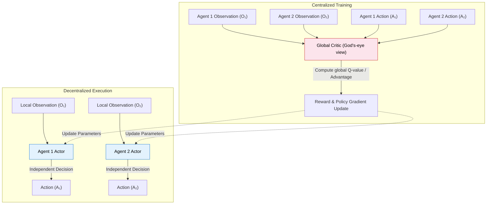
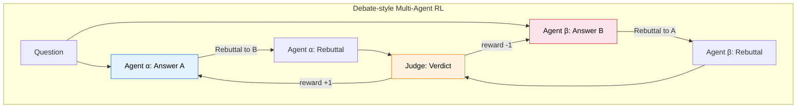
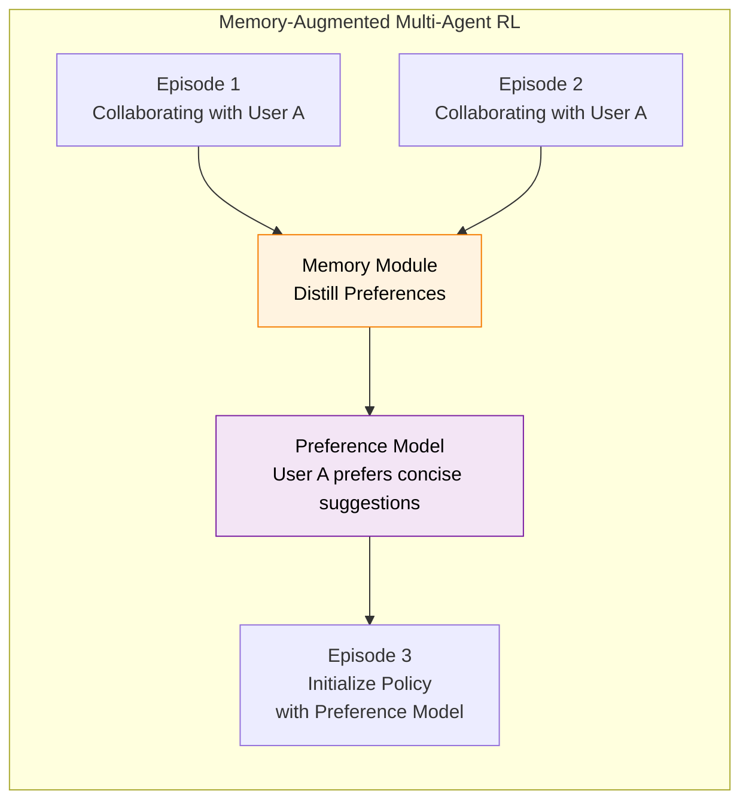
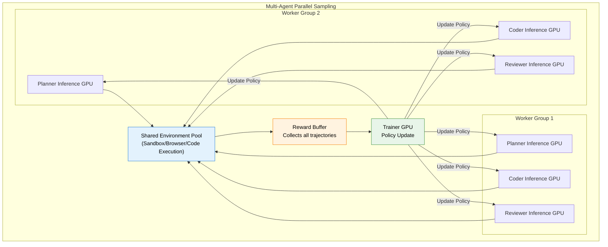
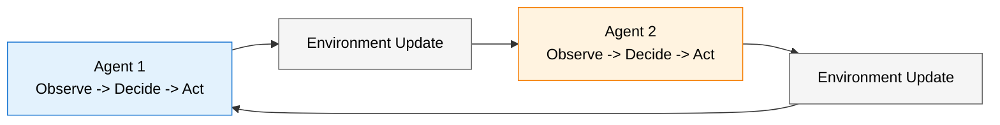

# 10.4 LLM Multi-Agent Reinforcement Learning

Before discussing LLM-driven multi-agent systems, let us quickly review the core framework of traditional multi-agent RL (MARL). The biggest challenge in MARL is **non-stationarity**: when you learn a new policy, your teammates are also learning -- the "environment" you face is constantly changing. The current mainstream paradigm is **CTDE (Centralized Training with Decentralized Execution)**: during training, a "God's-eye view" global Critic sees all agents' observations and actions; during execution, each agent can only make decisions based on its local observations.



<div style="text-align: center; font-size: 0.9em; color: var(--vp-c-text-2); margin-top: -10px; margin-bottom: 20px;">
  <em>Figure: CTDE (Centralized Training with Decentralized Execution) paradigm. This is the foundation of RL algorithms like MAPPO and MADDPG. In LLM scenarios, the global Critic is typically served by a powerful model that can review all agents' dialogue history (e.g., GPT-4) or an outcome-based verifier.</em>
</div>

| Algorithm  | Core Idea                                                        | Applicable Scenarios                              |
| ---------- | ---------------------------------------------------------------- | ------------------------------------------------- |
| **IPPO**   | Each agent runs PPO independently, no communication              | Baseline method, identical roles                  |
| **MAPPO**  | PPO + global value function (CTDE)                               | Team tasks requiring coordination                 |
| **QMIX**   | Mixing network ensures monotonicity between local Q and global Q | Cooperative tasks                                 |
| **MADDPG** | Each agent uses DDPG + global Critic                             | Continuous actions, mixed cooperation/competition |

These algorithms perform well in robot collaboration, multi-vehicle scheduling, and similar scenarios. But when we switch to **LLM-driven multi-agent systems**, we face entirely new challenges -- you cannot directly apply MAPPO to LLMs:

| Dimension              | Traditional MARL                                                       | LLM Multi-Agent RL                                                               |
| ---------------------- | ---------------------------------------------------------------------- | -------------------------------------------------------------------------------- |
| **Action space**       | Low-dimensional continuous/discrete (movement direction, acceleration) | Natural language (generating token sequences)                                    |
| **Role heterogeneity** | Usually homogeneous (multiple taxis, multiple robots)                  | Highly heterogeneous (Coder and Reviewer have completely different capabilities) |
| **Episode structure**  | Fixed steps or fixed termination conditions                            | Multi-turn dialogue, wildly varying lengths                                      |
| **Communication**      | Parameterized message vectors                                          | Natural language dialogue (interpretable but high-dimensional)                   |
| **Human involvement**  | Usually none                                                           | Human-AI collaboration is a core scenario                                        |

Let us now break down the core problems, typical architectures, and frontier advances of multi-agent RL in the LLM era.

## Three Typical Architectures

### Architecture 1: Role-Playing Collaboration

This is the most intuitive architecture -- multiple LLM Agents play different roles, each responsible for sub-tasks they excel at, collaborating to complete a complex goal. **ChatDev**, jointly proposed by Tsinghua University and Tsinghua-affiliated startup ModelBest, is a representative work of this architecture.


<div style="text-align: center; font-size: 0.9em; color: var(--vp-c-text-2); margin-top: -10px; margin-bottom: 20px;">
  <em>Figure 1: ChatDev virtual software company architecture. By assigning LLMs different roles (CEO, CTO, Programmer, Reviewer, etc.) and using multi-agent collaboration flows (design, coding, testing, documentation), the model can automatically complete software development like a human team. Source: <a href="https://arxiv.org/abs/2307.07924" target="_blank" rel="noopener noreferrer">ChatDev Paper</a></em>
</div>

```
Task: "Fix this GitHub Issue"
├── Planner: Analyze the Issue, create a fix plan
├── Coder: Write fix code based on the plan
├── Reviewer: Review code quality, suggest modifications
└── Tester: Run tests, verify the fix works
```

This architecture is consistent with the CTDE approach mentioned above, but has several unique RL training challenges in the LLM setting.

**Action granularity mismatch.** Traditional MARL actions are low-dimensional vectors, while an LLM Agent's "action" is a complete text passage (hundreds of tokens). Traditional Q-values struggle to evaluate "the quality of this code." The solution is to **use the entire multi-turn dialogue trajectory (rollout) as one policy update unit**, with the final task outcome as the reward signal.

**Reward design.** The most effective approach in practice is a **outcome-driven + process-assisted** hybrid reward:

$$R_i = \alpha \cdot R^{\text{outcome}} + (1-\alpha) \cdot R_i^{\text{process}}$$

where $R^{\text{outcome}}$ is the shared task outcome reward (did the tests pass? was the issue fixed?), and $R_i^{\text{process}}$ is the process reward for role $i$ (code quality score, review accuracy, etc.). $\alpha$ is typically 0.5-0.7, placing more weight on measurable outcomes. This directly corresponds to the ORM vs. PRM credit assignment discussed in Chapter 9 -- only extended from single-agent multi-turn interaction to multi-agent collaboration.

Another representative work, **MetaGPT**, encodes Standardized Operating Procedures (SOPs) into system prompts. From an RL perspective, SOPs act as a **strong prior constraint** -- restricting the policy space, greatly reducing search difficulty and improving training stability, similar to the KL constraint from the reference model in PPO (Chapter 7).


<div style="text-align: center; font-size: 0.9em; color: var(--vp-c-text-2); margin-top: -10px; margin-bottom: 20px;">
  <em>Figure 2: MetaGPT architecture. It not only encapsulates agents in different roles but also introduces Standardized Operating Procedures (SOPs) to constrain agent workflows and communication protocols, greatly alleviating the "information hallucination" problem during multi-agent communication. Source: <a href="https://arxiv.org/abs/2308.01432" target="_blank" rel="noopener noreferrer">MetaGPT Paper</a></em>
</div>

### Architecture 2: Debate and Competition

Section 12.3 introduced debate-style self-play training; here we re-examine it from the **multi-agent RL** perspective. In a debate architecture, two LLM Agents give different answers to the same question, challenge each other through multiple rounds of debate, and a Judge ultimately determines the winner.

The difference from Section 12.3 is: self-play typically uses **multiple instances of the same model**, while debate from a multi-agent perspective can use **models with different training strategies**. This introduces the idea of population training -- maintaining multiple models with different strategies, randomly pairing them for debate, preventing all models from converging to the same strategy.



### Architecture 3: Open-Ended Multi-Agent Environments

The first two architectures have clear task objectives and win/loss conditions, but multi-agent RL also has a freer form: **open-ended environments**, where agents have no fixed goals and complex behaviors emerge from continuous interaction. Stanford's **Generative Agents (Stanford Small Town)** is representative -- 25 LLM-driven Agents live in a virtual town and spontaneously organize complex social behaviors.

From an RL perspective, this brings several unique challenges:

- **Multi-objective reward design**: Not a single "score," but a combination of multiple objectives -- behavioral coherence, social plausibility, goal achievement, etc., similar to Multi-Objective RL: $$R_t = \sum_{m=1}^{M} w_m \cdot r_m(s_t, a_t)$$ The weights $w_m$ of each objective determine the direction of emergent behavior.
- **Exploration is exploration of social strategies**: Agents explore the social behavior space ("who to interact with," "what to talk about") rather than physical action space. This is similar to Chapter 4's epsilon-greedy exploration in DQN, but exploring a high-dimensional social strategy space.
- **Evaluation problem**: With no ground truth, how do we judge whether one social strategy is "better"? Currently, evaluation relies primarily on **human assessment + LLM-as-Judge**, but this introduces the "self-loop degradation" risk discussed in Section 12.3.

The core RL value of open-ended environments is: they test whether agents can **emerge meaningful collaborative behaviors through interaction without explicit reward shaping** -- this is an important testbed on the path to general intelligence.

## Core Challenges of LLM Multi-Agent RL

### Challenge 1: Amplified Non-Stationarity

Traditional MARL already has non-stationarity problems -- when you learn a new policy, your teammates are also changing. LLM multi-agent amplifies this challenge:

- **Role heterogeneity causes unsynchronized updates**: The Coder model and Reviewer model may have different learning rates and update frequencies. When the Coder upgrades its code style, the Reviewer's review strategy needs to re-adapt.
- **Language action space exacerbates instability**: Traditional MARL actions are low-dimensional vectors, and policy changes are usually gradual. LLM actions are language; a single policy update may cause completely different output styles (e.g., suddenly switching from Python to Java), making it hard for teammates to adapt quickly.

**Mitigation**: Adopt a **freeze-rotate** strategy -- update only one role's policy at a time while keeping others fixed. Similar to curriculum learning: first train stable basic roles, then gradually introduce more complex ones.

### Challenge 2: Cross-Role Credit Assignment

Chapter 9 discussed credit assignment in multi-turn interaction (Section 9.1) -- if a 7-turn interaction fails, who is to blame? Multi-agent extends this dimension further: **multiple independent decision-makers are simultaneously acting; whose contribution is greatest?**

In a software project, the Coder writes code, the Reviewer spots a potential bug and suggests a fix, and the Coder revises and passes the tests. How should the final "passed tests" reward be distributed?

- The Coder contributed "writing basically usable code" and "revising based on feedback"
- The Reviewer contributed "spotting the potential issue"
- Without the Reviewer's feedback, the Coder's original code might not have passed tests

This is consistent with CTDE's global Critic approach -- a "God's-eye view" that sees all roles' actions is needed to evaluate each one's contribution. But in LLM scenarios, "contribution" is not just "was the action correct," but also includes more abstract dimensions like "quality of generated text" and "helpfulness of suggestions."

**Practical approach**: Combine process rewards and outcome rewards. Process rewards evaluate each role's intermediate output quality (e.g., code quality score, review accuracy), and outcome rewards check whether the final task was completed. The weighted combination:

$$R_i = \alpha \cdot R_i^{\text{process}} + (1 - \alpha) \cdot R^{\text{outcome}}$$

where $R_i^{\text{process}}$ is the process reward for role $i$, and $R^{\text{outcome}}$ is the shared outcome reward.

### Challenge 3: Memory Mechanisms and Long-Term Strategy

In human-AI collaboration scenarios, agents need to remember past experience collaborating with the same person -- what style of topics did the streamer prefer last time? What types of suggestions did the user respond coldly to? These memories need to accumulate across episodes, influencing future strategy choices.

This is fundamentally different from DQN's experience replay (Chapter 4): DQN's experience replay **reuses** old data as-is, while human-AI collaboration memory needs **distillation** -- abstracting "what this person likes" as a preference model from past interactions, then using it in new episodes.



The RL training of memory mechanisms faces a special challenge: **memory updates themselves also need RL optimization**. Simply "remembering all history" is not effective -- memory capacity is limited, and the system must learn "what to remember, what to forget." This can be modeled as a **meta-learning problem**: the outer loop optimizes the memory strategy (what to remember, how to use it), and the inner loop optimizes the task strategy (how to make decisions based on memory).

## Representative Works

### MAPoRL: A New Paradigm for Multi-Agent Collaborative Training


<div style="text-align: center; font-size: 0.9em; color: var(--vp-c-text-2); margin-top: -10px; margin-bottom: 20px;">
  <em>Figure 3: MAPoRL architecture. A multi-agent RL reinforcement post-training (Post-Co-Training) framework designed specifically for collaborative LLMs. It not only evaluates each model's quality on its independent task, but also designs a "Collaboration Reward" to evaluate the coordination between different roles (e.g., Coder and Reviewer), using RL to directly optimize multi-model interaction efficiency. Source: <a href="https://arxiv.org/abs/2502.18439" target="_blank" rel="noopener noreferrer">MAPoRL Paper</a></em>
</div>

MAPoRL [^maporl] models the collaboration of multiple LLM Agents as a joint policy optimization problem. The core innovation is introducing **collaboration rewards** -- not only evaluating each role's independent sub-task performance, but also evaluating the "coordination" between roles. For example, is the code generated by the Coder easy for the Reviewer to understand? Do the Tester's test cases cover the boundary conditions of the Coder's code?

### M-GRPO: The Multi-Agent Extension of GRPO

Recall GRPO from Chapter 9: the same model generates multiple responses and compares within a group. M-GRPO [^mgrpo] extends this idea to multi-agent scenarios -- multiple groups of outputs from multiple roles are compared together. For example, for the same programming task, generate 3 "Coder-Reviewer-Tester" teams and compare which team has a higher task completion rate.

$$\text{Advantage}_i = \frac{R_i - \text{mean}(R_{1..G})}{\text{std}(R_{1..G})}$$

where $R_i$ is the total reward for team $i$. This preserves GRPO's core advantage (no Critic needed) while introducing inter-group competition to drive collaboration capability improvement.

### SAGE: Closed-Loop Self-Evolution Multi-Agent Framework

SAGE [^sage] implements a **closed-loop self-evolution** multi-agent system: multiple Agents collaborate to complete tasks -> evaluate collaboration effectiveness -> identify weak links -> targeted training of weak roles' policies -> re-collaborate. This cycle is similar to Section 12.3's self-evolution system but extended to multi-agent scenarios.

### MARTI: Multi-Agent Debate Framework

MARTI [^marti] improves reasoning quality through multi-agent debate. The core idea: multiple LLM Agents debate the same question over multiple rounds; in each round, they can see other Agents' arguments and rebut them. The final "consensus answer" serves as the training signal, and each debating Agent optimizes its debate strategy through RL.

## Connections to Previous Chapters

| Previous Chapter                                   | Correspondence in LLM Multi-Agent RL                            |
| -------------------------------------------------- | --------------------------------------------------------------- |
| CTDE global Critic                                 | Theoretical foundation for cross-role credit assignment         |
| Self-play Generator-Judge (Section 12.3)           | Direct predecessor of debate/competition architecture           |
| Multi-turn credit assignment ORM/PRM (Section 9.1) | Methodological foundation for cross-role credit assignment      |
| GRPO within-group comparison (Chapter 9)           | M-GRPO extends within-group comparison to multi-agent           |
| DQN experience replay (Chapter 4)                  | Memory mechanisms: from raw reuse to preference distillation    |
| PPO (Chapter 7)                                    | Foundation algorithm for multi-agent policy optimization        |
| Training stability (Chapter 7)                     | Amplified non-stationarity requires stronger stability controls |
| Bespoke Labs KL=0.001 (Section 9.5)                | KL constraints are equally critical in multi-agent scenarios    |

The deepest connection may be: **LLM multi-agent RL is the "highest-difficulty comprehensive application" of all core concepts in this book**. It requires simultaneously handling multi-turn credit assignment (Section 9.1), policy gradient optimization (Chapters 5-6), training stability (Chapter 7), reward design (Section 9.5) -- only extended from single-agent to multi-agent, where each problem's difficulty increases by an order of magnitude.

## Training Recipes: From Theory to Practice

We discussed three architectures and three core challenges above. Now let us look at how to actually train a multi-agent RL system in practice.

### Recipe 1: Freeze-Rotate Training

This is the most stable training scheme, suitable for initial exploration:

**Step 1: SFT each role separately.** First use supervised learning to give each role basic capabilities -- the Coder learns code formatting, the Reviewer learns review patterns, the Tester learns to write test cases.

**Step 2: Freeze other roles, RL train one role.** For example, freeze Reviewer and Tester, and only RL-train the Coder. The Coder needs to adapt to the fixed Reviewer and Tester -- "since the Reviewer always checks boundary conditions, I should proactively handle boundary cases."

**Step 3: Rotate.** After training the Coder, freeze the Coder and RL-train the Reviewer. The Reviewer needs to adapt to the trained Coder -- "the Coder's code style has changed, so my review strategy needs to adjust too."

**Step 4: Iterate multiple rounds.** Repeat Steps 2-3 until convergence.

```python
class FreezeRotateTrainer:
    """Freeze-rotate multi-agent trainer"""

    def __init__(self, agents, env, num_rounds=3):
        self.agents = agents  # {"coder": model_c, "reviewer": model_r, ...}
        self.env = env
        self.num_rounds = num_rounds

    def train(self, tasks):
        for round_idx in range(self.num_rounds):
            for role, model in self.agents.items():
                print(f"Round {round_idx}: Training {role}")

                # Freeze other roles
                for other_role, other_model in self.agents.items():
                    if other_role != role:
                        other_model.freeze()

                # RL train current role
                for task_batch in tasks:
                    trajectories = self.rollout_multi_agent(task_batch)
                    rewards = self.compute_multi_agent_reward(trajectories)
                    model.update(trajectories, rewards, role)

                # Unfreeze all roles
                for m in self.agents.values():
                    m.unfreeze()

    def rollout_multi_agent(self, tasks):
        """Multi-agent joint rollout"""
        trajectories = []
        for task in tasks:
            state = {"task": task, "history": []}

            # Execute in role order
            for role, model in self.agents.items():
                action = model.act(state, role)
                state["history"].append({
                    "role": role, "action": action
                })

            trajectories.append(state)
        return trajectories

    def compute_multi_agent_reward(self, trajectories):
        """Compute multi-agent collaboration reward"""
        rewards = []
        for traj in trajectories:
            # Outcome reward (shared)
            outcome = self.env.evaluate(traj)
            outcome_reward = 1.0 if outcome["success"] else 0.0

            # Process reward (per role)
            process_rewards = {}
            for step in traj["history"]:
                role = step["role"]
                quality = self.env.evaluate_step(step)
                process_rewards[role] = quality

            # Combined reward
            total_reward = 0.6 * outcome_reward + 0.4 * sum(
                process_rewards.values()
            ) / max(len(process_rewards), 1)

            rewards.append(total_reward)
        return rewards
```

### Recipe 2: Joint GRPO (M-GRPO in Practice)

M-GRPO extends GRPO's group sampling idea to multi-agent -- instead of within-group comparison of a single model's outputs, it performs within-group comparison of **entire teams'** collaborative performance:

```
Task: Fix GitHub Issue #1234

Team A (Sample 1):
  Planner -> Plan: Analyze->Locate->Fix->Verify
  Coder   -> Code: Modified line 45
  Reviewer -> Review: Suggest adding error handling
  Tester  -> Test: 3/3 passed
  Team reward: 0.85

Team B (Sample 2):
  Planner -> Plan: Search keyword directly->Modify
  Coder   -> Code: Modified lines 12 and 45
  Reviewer -> Review: LGTM
  Tester  -> Test: 2/3 passed (boundary case failed)
  Team reward: 0.60

Team C (Sample 3):
  Planner -> Plan: Analyze Issue->Reproduce->Locate->Fix
  Coder   -> Code: Modified line 45, added boundary handling
  Reviewer -> Review: Suggest optimizing variable naming
  Tester  -> Test: 3/3 passed
  Team reward: 0.90

GRPO update: Team C is reinforced, Team B is weakened
           -> Each role's policy shifts toward Team C's behavior
```

The key decision in M-GRPO is **how to distribute reward to each role**. Two common strategies:

**Shared reward**: All roles use the same team reward. The advantage is encouraging collaboration; the disadvantage is potential "free-riding" by some roles.

**Role-specific reward**: Each role receives a weighted combination -- $\alpha \times$ team reward + $(1-\alpha) \times$ role process reward. $\alpha$ is typically 0.5-0.7.

### Recipe 3: Self-Play Training

Multi-agent self-play does not require manually designing role divisions -- let different instances of the same model compete against each other:

**Generator vs Judge**: The Generator produces answers, and the Judge evaluates quality. Both co-evolve through RL -- the Generator learns to produce harder-to-evaluate answers, and the Judge learns to evaluate more accurately.

**Proposer vs Solver**: The Proposer generates problems, and the Solver tries to solve them. A good Proposer should generate problems that are "just beyond the Solver's current capability" -- too hard and the Solver learns nothing; too easy and there is no challenge. This "difficulty-adaptive" capability is also learned through RL.

The core challenge of self-play is **avoiding mode collapse** -- two models may converge to a fixed strategy equilibrium and stop evolving. A mitigation is maintaining a **strategy pool** (Population): instead of two models playing against each other, randomly pair from a pool containing 10-20 historical strategies. FlexMARL [^flexmarl] is the first end-to-end framework that jointly optimizes sampling, training, and orchestration for multi-agent systems, solving such parallel scheduling problems at the engineering level.

## Engineering Practice: Multi-Agent RL Infrastructure

The engineering complexity of multi-agent RL far exceeds single-agent -- you need to simultaneously manage inference for multiple models, interactions across multiple environments, and complex communication protocols. FlexMARL [^flexmarl] and KD-MARL [^kdmarl] address infrastructure-level challenges from the perspectives of end-to-end training and decentralized deployment, respectively.

### Parallel Sampling Architecture



Key design principles:

**Role inference decoupling.** Different roles' models may have different sizes -- Planner uses 14B, Coder uses 32B, Reviewer uses 7B. Their inference speeds differ, so asynchronous queues must be used for decoupling to prevent fast roles from waiting for slow ones.

**Environment sandbox isolation.** Each team (a group of roles) needs an independent environment sandbox to prevent cross-team environment interference. Code execution environments are especially important -- code written by one Coder must not affect other teams' execution environments.

**Communication protocol standardization.** The message format passed between roles needs to be unified -- even if roles' internal models differ, message formats should be consistent. A common approach is to define message formats with JSON Schema, similar to the tool-calling format in Section 9.3.

## Model-Based RL: From Blind Trial-and-Error to Mental Simulation

The multi-agent approaches above are all **Model-Free** -- agents do not know how the environment works and can only accumulate experience through trial-and-error. Q-Learning, DQN, PPO, DPO, GRPO covered in this book are all Model-Free. But there is another path: **Model-Based RL (MBRL) first learns a "world model," then "imagines" and "plans" within this virtual world.**

|                           | Model-Free (this book's main thread)       | Model-Based                                         |
| ------------------------- | ------------------------------------------ | --------------------------------------------------- |
| Needs environment model   | No                                         | Yes, must first learn a world model                 |
| Sample efficiency         | Low (requires massive trial-and-error)     | High (can "imagine" countless times internally)     |
| Policy quality            | Usually higher (directly optimizes policy) | May be suboptimal (limited by world model accuracy) |
| Representative algorithms | DQN, PPO, DPO, GRPO                        | Dreamer, MuZero, AlphaZero                          |
| Analogy                   | Learning to drive by experience            | First learn physics, then deduce how to drive       |

The world model $\hat{P}(s_{t+1}|s_t, a_t)$ learns to predict "what happens to the environment if action $a_t$ is taken in state $s_t$." With it, agents can simulate countless interactions in their head, while the real environment only needs to provide a small amount of data to train the world model itself.

### Why Is MBRL Important for Large Models?

A large language model itself is a **world model** for language. When you ask a large model to perform multi-step reasoning with chain-of-thought (CoT), it is essentially doing some form of "internal planning":

$$\text{CoT reasoning} \approx \text{Planning in a world model}$$

More specifically:

- **World model** = the large model's language modeling capability (predicting the next token)
- **Planning** = chain-of-thought multi-step reasoning
- **Actions** = choosing reasoning paths (verification, backtracking, exploring new directions)
- **Reward** = correctness of the final answer

This is why Chapter 9's GRPO and DeepSeek-R1 can elicit reasoning capability through RL -- the large model itself is a powerful world model, and RL teaches it how to better utilize this world model to plan reasoning paths.

### Multi-Agent + MBRL: "Mental Simulation" in Collaboration

MBRL has unique value in multi-agent scenarios: **the world model can predict other agents' behavior**. Traditional Model-Free MARL can only passively observe teammates' behavior, while Model-Based MARL can actively predict "if I do A, how will my teammates react?"

This transforms the multi-agent non-stationarity problem into a planning problem: if the world model accurately enough predicts other agents' behavior, then even as teammate strategies change, the current agent can adapt through planning. Of course, the accuracy of the world model is itself a challenge -- if teammate strategies change dramatically, the world model may predict inaccurately.

**AlphaZero / MuZero** are classic examples of MBRL. AlphaGo needed humans to tell it the rules of Go, but MuZero starts completely from scratch -- learning the environment's dynamics on its own, then using MCTS to plan internally. The **Dreamer series** builds world models in latent space, achieving sample efficiency an order of magnitude higher than Model-Free methods.

The intersection of MARL and MBRL is **multi-robot collaboration**: multiple robots need to collaborate on tasks, while each robot's policy needs to plan based on a world model (predicting "if I push here, how will the object move? How will other robots react?"). This superimposes multi-agent non-stationarity, world model bias, and physical-world safety constraints, and is currently in early exploration stages.

## Summary

This section started from traditional MARL and discussed the core problems and frontier advances of multi-agent RL in the LLM era:

1. **Amplified non-stationarity**: Language action space and role heterogeneity make multi-agent training more unstable. Freeze-rotate training is a practical mitigation.
2. **Cross-role credit assignment**: Contributions from multiple independent decision-makers are hard to evaluate. Combining process rewards and outcome rewards is currently the most effective approach.
3. **Memory and long-term strategy**: Human-AI collaboration requires cross-episode preference accumulation. Memory mechanisms themselves also need RL optimization.
4. **Model-based RL**: World models let agents move from "blind trial-and-error" to "mental simulation." Large models' CoT reasoning is essentially planning using a language world model.

In practice, three training recipes each suit different scenarios:

- **Freeze-rotate**: Most stable, suitable for initial exploration and scenarios with large role differences
- **Joint GRPO (M-GRPO)**: Most efficient, suitable for scenarios with comparable role capabilities and tight collaboration
- **Self-play**: No need to design role divisions, suitable for adversarial tasks and adaptive difficulty

Next, we will do a multi-agent RL hands-on exercise with PettingZoo, and finally discuss [Offline Reinforcement Learning (CQL / IQL / DT)](../offline-rl/).

---

## Hands-On: Multi-Agent RL with PettingZoo

So far, all our experiments have had only one agent. But the real world is rarely a solo endeavor -- autonomous vehicles must coordinate in traffic, robot teams must divide and cooperate. [PettingZoo](https://github.com/Farama-Foundation/PettingZoo) is the standard multi-agent environment library for MARL, maintained by the same team (Farama Foundation) as Gymnasium, providing a unified multi-agent environment API.

### From Single-Agent to Multi-Agent: What Changes?

|                           | Single-Agent (Gymnasium)                 | Multi-Agent (PettingZoo)                                              |
| ------------------------- | ---------------------------------------- | --------------------------------------------------------------------- |
| Number of agents          | 1                                        | 2 to hundreds                                                         |
| Environment stationarity  | Stationary (environment rules unchanged) | Non-stationary (other agents are also learning and changing)          |
| Credit assignment         | Not needed (all good/bad is your own)    | Core challenge (team succeeds, who gets credit?)                      |
| Exploration strategy      | epsilon-greedy / entropy regularization  | Must also consider whether other agents will exploit your exploration |
| Representative algorithms | DQN / PPO / SAC                          | QMIX / MAPPO / MADDPG                                                 |

### PettingZoo Environment Overview

```bash
pip install pettingzoo
```

| Family      | Type                    | Representative Environments                   | Description                                               |
| ----------- | ----------------------- | --------------------------------------------- | --------------------------------------------------------- |
| `classic`   | Game theory             | `chess_v3`, `connect_four_v3`, `tictactoe_v3` | Classic board games, turn-based competition               |
| `butterfly` | Cooperative/Competitive | `cooperative_pong_v5`, `pistonball_v6`        | Multiple agents must collaborate to achieve goals         |
| `mpe`       | Mixed                   | `simple_adversary_v3`, `simple_spread_v3`     | Multi-particle environments, communication and navigation |
| `sisl`      | Competitive/Cooperative | `pursuit_v4`, `waterworld_v4`                 | Pursuit-evasion, resource collection                      |
| `atari`     | Competitive             | `pong_v3`                                     | Multi-agent Atari                                         |

### Quick Start: Connect Four

Connect Four is one of the simplest multi-agent environments -- two agents take turns placing pieces:

```python
from pettingzoo.classic import connect_four_v3

env = connect_four_v3.env(render_mode="human")
env.reset()

for agent in env.agent_iter():
    observation, reward, termination, truncation, info = env.last()

    if termination or truncation:
        action = None
    else:
        mask = observation["action_mask"]
        valid_actions = [i for i, m in enumerate(mask) if m == 1]
        action = valid_actions[0]  # Simple strategy: pick first valid position

    env.step(action)

env.close()
```

PettingZoo uses the **AEC (Agent Environment Cycle) model**: agents take turns acting, with only one agent executing an action at a time.



### In Practice: Cooperative Navigation in Multi-Particle Environments

`simple_spread` is a classic multi-agent RL benchmark: N agents must cooperatively cover N target locations on a map while avoiding collisions.

```python
from pettingzoo.mpe import simple_spread_v3
import numpy as np

env = simple_spread_v3.env(N=3, local_ratio=0.5, max_cycles=100)
env.reset()

total_rewards = {agent: 0 for agent in env.agents}

for agent in env.agent_iter():
    obs, reward, termination, truncation, info = env.last()

    if termination or truncation:
        action = None
    else:
        action = env.action_space(agent).sample()

    env.step(action)
    if reward is not None:
        total_rewards[agent] += reward

print("Cumulative rewards per agent:")
for agent, reward in total_rewards.items():
    print(f"  {agent}: {reward:.2f}")

env.close()
```

The key parameter `local_ratio=0.5` controls the ratio of "global reward" to "local reward" in the total reward -- this directly reflects the multi-agent credit assignment problem.

### Training Multi-Agent Policies

Here is a simple approach using Independent PPO (IPPO) -- each agent uses an independent PPO policy:

```python
from pettingzoo.mpe import simple_spread_v3
from stable_baselines3 import PPO
import supersuit as ss

env = simple_spread_v3.env(N=3)
env = ss.pettingzoo_env_to_vec_env_v1(env)
env = ss.concat_vec_envs_v1(env, 8, num_cpus=1, base_env="single")

model = PPO("MlpPolicy", env, verbose=1, learning_rate=3e-4, n_steps=2048)
model.learn(total_timesteps=200_000)
model.save("./models/ippo_simple_spread")
```

::: tip
Here all agents share the same policy network (parameter sharing), which is standard practice in environments with identical roles. If roles differ (e.g., pursuers and escapees in a pursuit-evasion game), each needs its own independent network.
:::

### From Multi-Agent to Agentic RL

Multi-agent in PettingZoo means "multiple RL agents in the same environment." Agentic RL discussed in Chapter 9 is "one agent interacting with external tools and environments." The intersection is precisely **multi-agent LLM collaboration** -- multiple LLM Agents playing different roles, learning to collaborate on complex tasks through RL.

## References

[^maporl]: Park C, Han S, et al. "[MAPoRL: Multi-Agent Post-Co-Training for Collaborative Large Language Models with Reinforcement Learning](https://arxiv.org/abs/2502.18439)." 2025. -- A new paradigm for multi-LLM Agent collaborative training, introducing collaboration rewards.

[^mgrpo]: Hong H, Yin J, et al. "[Multi-Agent Deep Research: Training Multi-Agent Systems with M-GRPO](https://arxiv.org/abs/2511.13288)." 2025. -- Extends GRPO to multi-agent scenarios while preserving the Critic-free advantage.

[^sage]: Peng Y, et al. "[SAGE: Multi-Agent Self-Evolution for LLM Reasoning](https://arxiv.org/abs/2603.15255)." 2026. -- Closed-loop self-evolution multi-agent framework.

[^marti]: Zhang K, Tian K, et al. "[MARTI: A Framework for Multi-Agent LLM Systems Reinforced Training and Inference](https://openreview.net/forum?id=E7jZqo0A50)." ICLR 2026. -- Multi-agent RL training and inference framework. [GitHub](https://github.com/TsinghuaC3I/MARTI)

- Zhang G, et al. "[The Landscape of Agentic Reinforcement Learning for LLMs: A Survey](https://arxiv.org/abs/2509.02547)." 2025. -- Agentic RL survey, including multi-agent collaboration section.
- Tran K-T, et al. "[Multi-Agent Collaboration Mechanisms: A Survey of LLMs](https://arxiv.org/abs/2501.06322)." 2025. -- LLM multi-agent collaboration survey, covering cooperation/competition/coopetition classification, communication protocols, and evaluation methods.
- Jin W, et al. "[A Comprehensive Survey on Multi-Agent Cooperative Decision-Making](https://arxiv.org/abs/2503.13415)." 2025. -- Panoramic survey from traditional MARL to LLM-driven multi-agent collaboration.
- Li J, et al. "[FlexMARL: Rollout-Training Co-Design for Efficient LLM-Based Multi-Agent Reinforcement Learning](https://arxiv.org/abs/2602.09578)." 2026. -- First end-to-end framework jointly optimizing sampling, training, and orchestration for multi-agent systems.
- Pavel M I, Hu S, Masum M A, Pratama M, Kowalczyk R, Cao Z J. "[KD-MARL: Resource-Aware Knowledge Distillation in Multi-Agent Reinforcement Learning](https://arxiv.org/abs/2604.06691)." 2026. -- Transferring centralized coordination behavior to lightweight decentralized agents through knowledge distillation.

[^flexmarl]: Li J, et al. "[FlexMARL: Rollout-Training Co-Design for Efficient LLM-Based Multi-Agent Reinforcement Learning](https://arxiv.org/abs/2602.09578)." 2026. -- First end-to-end framework jointly optimizing sampling, training, and orchestration for multi-agent systems.

[^kdmarl]: Pavel M I, Hu S, Masum M A, Pratama M, Kowalczyk R, Cao Z J. "[KD-MARL: Resource-Aware Knowledge Distillation in Multi-Agent Reinforcement Learning](https://arxiv.org/abs/2604.06691)." 2026. -- Transferring centralized coordination behavior to lightweight decentralized agents through knowledge distillation.
