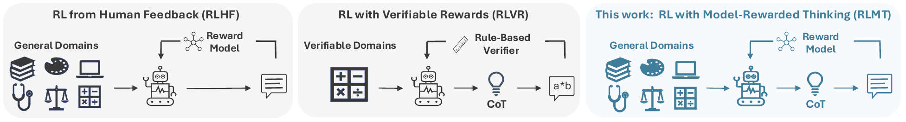
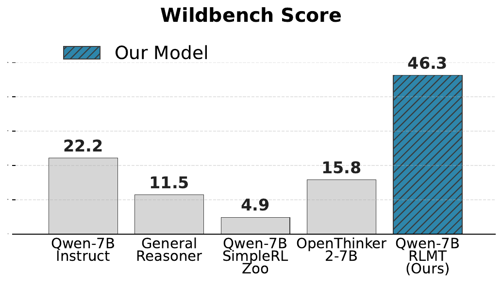
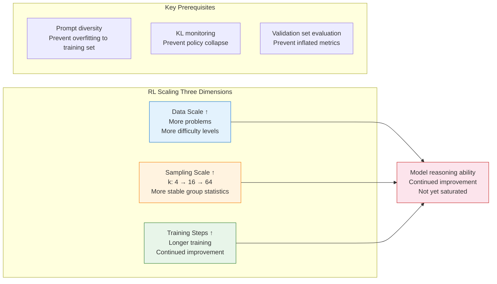
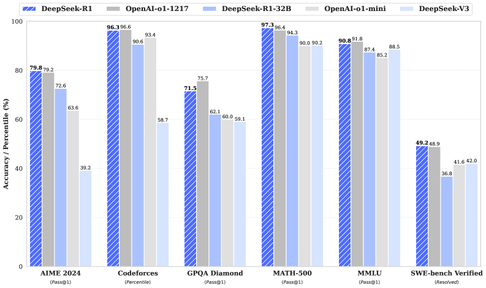
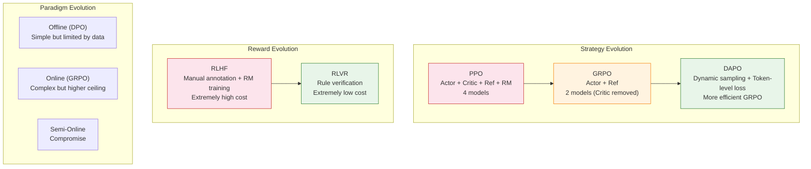

# 26.2 Where Should Additional Compute Go? RL and Test-Time Scaling

Assume a reasoning model answers one problem correctly with probability 0.30. If we sample independently five times and keep a correct answer whenever a verifier finds one, the probability of at least one success is

$$
1-(1-0.30)^5\approx0.83.
$$

The model weights did not change; we spent more compute at inference. Alternatively, we could spend that compute during training so that one sample becomes more reliable. These two investments answer different questions, and comparing them requires a shared total-compute budget.

This section separates three axes that are often mixed together: when training data is generated, how much optimization is performed during training, and how many candidates or reasoning steps are used at test time. It also explains when outcome and process reward models provide useful evidence.

## 26.2.1 When Is Training Data Generated: Offline, Online, or Periodically Updated?

After learning [DPO](https://arxiv.org/abs/2305.18290), GRPO, and DAPO, the first decision is when the policy sees new data.

- **Data source**
  - Offline (DPO): Fixed offline preference dataset
  - Online (PPO/GRPO): Generated in real-time by current model
  - Semi-Online: Offline data + periodic updates
- **Exploration**
  - Offline (DPO): None (limited by dataset)
  - Online (PPO/GRPO): Yes (model explores new strategies)
  - Semi-Online: Partial
- **Theoretical ceiling**
  - Offline (DPO): Limited by data quality
  - Online (PPO/GRPO): Higher in principle
  - Semi-Online: Compromise
- **Engineering complexity**
  - Offline (DPO): Low (standard supervised learning)
  - Online (PPO/GRPO): High (online sampling loop)
  - Semi-Online: Medium
- **Memory requirements**
  - Offline (DPO): Low
  - Online (PPO/GRPO): High
  - Semi-Online: Medium
- **Representative methods**
  - Offline (DPO): DPO, KTO, SimPO, IPO
  - Online (PPO/GRPO): PPO, GRPO, DAPO
  - Semi-Online: Iterative DPO, RLOO
- **Analogy**
  - Offline (DPO): Learning to drive from videos
  - Online (PPO/GRPO): Learning by actually driving
  - Semi-Online: Videos + occasional practice

### Practical Recommendations

A workflow validated by extensive practice goes like this:

1. **Step 1: DPO for rapid validation**. First use DPO to verify data quality and model baselines. DPO is the simplest and fastest; if even DPO cannot train well, the data has issues, and switching to PPO/GRPO will not help.
2. **Step 2: GRPO to raise the ceiling**. After DPO validation passes, switch to GRPO for online optimization. GRPO's online exploration capability can break through DPO's data limitations.
3. **Step 3: DAPO for fine-tuning**. If compute budget allows, use DAPO's dynamic sampling and token-level loss to further improve efficiency.

```python
# ==========================================
# Typical training code comparison for three paradigms (pseudocode)
# ==========================================

# ---- Offline (DPO) ----
# Feature: simplest, only needs preference dataset
# dpo_trainer = DPOTrainer(model, ref_model, dataset=preference_pairs)
# dpo_trainer.train()

# ---- Online (GRPO) ----
# Feature: online sampling, no Critic needed
# grpo_trainer = GRPOTrainer(model, reward_fn=rule_based_reward, k=8)
# grpo_trainer.train()

# ---- Semi-Online (Iterative DPO) ----
# Feature: periodically generate new data with current model, then train with DPO
# for iteration in range(num_iterations):
#     new_data = model.generate_and_label(prompts)  # generate + label
#     dpo_trainer.train_on(new_data)                 # DPO training
#     model = dpo_trainer.get_updated_model()        # update model

print("Training paradigm decision tree:")
print("  Data quality uncertain? → DPO first for validation")
print("  DPO validation passed? → GRPO to raise ceiling")
print("  Limited compute? → Iterative DPO (semi-online)")
print("  Pursuing maximum performance? → DAPO (dynamic sampling + token-level loss)")
```

## RLMT: Moving "Thinking" from Math to General Chat

The three paradigms discussed above (DPO/GRPO/DAPO) and this chapter's RLVR all focus on one question: **how to make models reason better on math and code**. But a natural follow-up is — can this "think before answering" capability also be applied to general chat, creative writing, and other open-ended scenarios?

A 2025 paper, [Language Models that Think, Chat Better](https://arxiv.org/abs/2509.20357), proposes **RLMT (Reinforcement Learning with Model-Rewarded Thinking)**. It uses an explicit thinking structure for open-ended prompts and lets a preference reward model evaluate the response.



<div style="text-align: center; font-size: 0.9em; color: var(--vp-c-text-2); margin-top: -10px; margin-bottom: 20px;">
  <em>Figure 1: RLHF, RLVR, and RLMT differ in response structure and reward source. Source: <a href="https://arxiv.org/abs/2509.20357" target="_blank" rel="noopener noreferrer">Language Models that Think, Chat Better</a>.</em>
</div>

### The Dilemma of Existing Methods

- **Method — RLHF**
  - Chain of Thought: None
  - Reward Source: Human preference reward model
  - Applicable Domain: General chat
  - Shortcoming: No thinking, insufficient depth
- **Method — RLVR**
  - Chain of Thought: Yes
  - Reward Source: Rules / ground truth
  - Applicable Domain: Math/Code
  - Shortcoming: Cannot generalize to open-ended chat
- **Method — RLMT**
  - Chain of Thought: **Yes**
  - Reward Source: **Human preference reward model**
  - Applicable Domain: **General chat**
  - Shortcoming: Reward model quality is critical

RLHF has the model directly output answers without deep reasoning; RLVR forces the model to write long chains of thought, but the reward signal (answer correctness) only applies to tasks with ground-truth answers. RLMT's core insight is: **retain RLVR's "think before answering" structure, but use RLHF's preference reward model for scoring** — so the chain of thought can serve general chat.

### RLMT Training Methods

RLMT has two routes, similar to DeepSeek-R1's SFT route and Zero route:

**Route 1: SFT warm-up + RLMT**

1. First use Gemini/GPT-4 to generate "thinking process + final answer" data for supervised fine-tuning, teaching the model "what a chain of thought looks like"
2. Then use GRPO online reinforcement learning for optimization, with reward signals from the preference reward model

**Route 2: RLMT-Zero (train directly from base model)**

No SFT at all; apply RLMT training directly to the base model. The results are surprising:

- Only **7K real conversation prompts**
- Llama-3.1-8B base + RLMT-Zero
- Results **exceed** Llama-3.1-8B-Instruct trained with 25 million samples in multiple stages

This experiment shows that, under the paper's setup, RL can elicit the response structure without an SFT warm-up. It does not establish that every base model or open-ended reward model will behave the same way.

### Results: Thinking Small Models > Non-Thinking Large Models

Comprehensive validation on Llama-3.1-8B and Qwen-2.5-7B:

- **Chat benchmarks** (AlpacaEval2 / WildBench / ArenaHardV2) improved by 3–7 points on average
- **Creative writing, commonsense, instruction following** improved by 1–3 points consistently
- Llama-3.1-8B-Instruct + RLMT **exceeds GPT-4o** in chat and creative writing, approaching Claude 3.7 Sonnet
- Significantly better than 10x larger Llama-3.1-70B and Qwen2.5-72B

These comparisons use one paper's reward models and automated evaluation pipeline. They show that post-training can substantially change the behavior of a fixed base model; comparisons across model sizes also mix pretraining data, instruction tuning, and evaluator preference, so they do not imply that small models generally outperform large models.



<div style="text-align: center; font-size: 0.9em; color: var(--vp-c-text-2); margin-top: -10px; margin-bottom: 20px;">
  <em>Figure 2: Reported open-ended chat comparisons in the RLMT paper. Read these as results under the paper's evaluator and prompt distribution, not as a universal model ranking. Source: <a href="https://arxiv.org/abs/2509.20357" target="_blank" rel="noopener noreferrer">RLMT paper</a>.</em>
</div>

### What Kind of "Thinking" Does the Model Learn?

The paper analyzes changes in the model's thinking patterns before and after RLMT training:

- **Phase — SFT phase**
  - Thinking Characteristics: Linear listing, bullet points, rigid planning
  - Analogy: A clerk filling out a form
- **Phase — After RLMT**
  - Thinking Characteristics: Organize constraints → group → weigh perspectives → iterate
  - Analogy: An experienced consultant reasoning at a whiteboard

Meanwhile, the model automatically increases chain-of-thought and answer length — not artificially set, but naturally emerging during RL optimization: longer thinking → better answers → higher rewards.

### RLMT Practical Points

```python
# ==========================================
# Key differences between RLMT and RLVR (pseudocode)
# ==========================================

# ---- RLVR (learned in this chapter) ----
# Reward = whether the answer is correct (rule verification)
# def rlvr_reward(response, question):
#     answer = extract_answer(response)
#     return 1.0 if answer == ground_truth else 0.0

# ---- RLMT (new in this section) ----
# Reward = preference reward model score (general chat quality)
# def rlmt_reward(response, question):
#     # response contains <think>thinking process</think> + final answer
#     return preference_reward_model(question, response)

# Key differences:
# 1. RLMT response structure = <think>thinking</think> + answer
# 2. Reward signal comes from preference RM, not rule verification
# 3. Training prompts must be close to real user chat; too many math problems actually hurts

print("RLMT practical points:")
print("  Reward model quality is critical — a weak RM will ruin performance")
print("  Training prompts must be close to real user chat scenarios")
print("  GRPO significantly outperforms PPO and DPO; best suited for thinking-style training")
print("  Base model can be directly aligned with RLMT, overturning traditional three-stage training")
```

### RLMT's Connection to Previous Chapters

RLMT stands at the intersection of Chapter 15 RLVR and Chapter 13 RLHF:

- **Concept Source — RLVR's long chain of thought (Ch8):** Retain the "think before answering" output structure
- **Concept Source — RLHF's preference reward (Ch7):** Replace rule verification with preference RM
- **Concept Source — GRPO's within-group comparison (Ch8):** The most effective online training method for RLMT
- **Concept Source — DeepSeek-R1-Zero (Ch8):** Direct inspiration for RLMT-Zero

The significance of RLMT is: **it proves that "thinking" is not exclusive to mathematical reasoning; general chat also benefits from deep thinking.** This opens a new direction for RL training — instead of having the model think only on math problems, have it "think carefully before speaking" in all scenarios.

<details>
<summary>Discussion Question: Why can't RLVR's chain of thought be directly transferred to general chat, while RLMT can?</summary>

The core difference lies in **matching the reward signal**. RLVR's chain of thought is trained under the "answer correctness" reward signal — the model learns "how to think to get the correct answer." But general chat has no ground-truth answers; the "correct/incorrect" reward signal does not exist, so this thinking strategy fails.

RLMT's key insight is to replace the reward signal with a preference reward model. The preference RM can judge "whether this answer is good" (helpful, harmless, honest), not just "whether the answer is correct." The chain of thought trained under this reward signal naturally applies to general scenarios — the model learns "how to think to write better answers," not "how to think to calculate the correct answer."

This also explains why reward model quality is critical: if the preference RM itself has poor judgment, the chain of thought trained under its guidance will also go astray.

</details>

## RL Scaling: More Compute for Stronger Reasoning

One of the most exciting discoveries of 2025: **RL training returns have not yet saturated**. DeepSeek-R1's experiments show that for mathematical reasoning, RL training's scaling curve is steeper than SFT's. Continuing to increase training steps, the model's pass@1 continues to improve without clear saturation.

### Three Dimensions of RL Scaling

- **Dimension — Data scale**
  - Meaning: More training prompts of varying difficulty
  - Practical Method: Auto-generate + filter for quality
  - Key Finding: Diversity matters more than quantity
- **Dimension — Sampling scale**
  - Meaning: More sampled answers per prompt (increasing k)
  - Practical Method: k from 4 to 16 or even 64
  - Key Finding: Within-group comparisons are more stable, but diminishing returns
- **Dimension — Training steps**
  - Meaning: Longer RL training
  - Practical Method: Monitor KL divergence and evaluation metrics
  - Key Finding: Pass@1 continues to improve, not yet saturated



The key prerequisite is sufficiently diverse prompt data. If the training data types are too narrow, the model will overfit to the training set — high scores on the training set but poor performance on different problems. DeepSeek-R1's solution is to use automated methods to generate and filter training problems, ensuring coverage across different difficulty levels and types.

### Agentic RL Scaling Laws

The three dimensions above focus on standard RL scaling. In agentic settings, the policy can also generate and execute code while solving a problem. [Agent RL Scaling Law](https://arxiv.org/abs/2505.07773) studies how training progress, code-use behavior, and mathematical accuracy change together under its ZeroTIR setup. Code-execution frequency is a useful logged variable in that experiment, but it is not a universal early-stopping rule; it must be checked against held-out task accuracy and total execution cost.

## Test-time Scaling: More Compute at Inference Time Too

Complementary to RL Scaling (investing more compute at training time) is another approach: **also let the model "think more" at inference time**.

Standard inference is "Prompt → model directly outputs answer." Test-time Scaling's approach is "Prompt → generate multiple candidates → verify/vote/search → select the best."

- **Method — Best-of-N sampling**
  - Principle: Generate N answers, select the one with highest reward
  - Additional Cost: Grows linearly with N
  - Applicable Scenarios: Simple, direct, general
- **Method — Majority voting**
  - Principle: Generate N answers, select the most frequent answer
  - Additional Cost: Grows linearly with N
  - Applicable Scenarios: Math/code (has deterministic answers)
- **Method — MCTS / Tree of Thought**
  - Principle: Tree search in reasoning space, backtrack wrong branches
  - Additional Cost: Exponential (needs pruning)
  - Applicable Scenarios: Complex reasoning tasks
- **Method — Verifier-guided**
  - Principle: Use a verifier to dynamically prune during reasoning
  - Additional Cost: Medium
  - Applicable Scenarios: Code/math

### The Relationship Between RL and Test-time Scaling

An open frontier debate is: **Does RLVR only improve test-time search efficiency, rather than injecting genuine reasoning ability?**

- Supporters argue: Models trained with RL perform better with the same sampling budget, indicating that RL genuinely changes the model's internal policy, not just search efficiency.
- Skeptics argue: A base model without RL training, given enough sampling attempts (N → ∞), could theoretically achieve similar results — RL only makes the model "search more efficiently."
- The reality is: In practice, the efficiency improvement from RL training is enormous — enabling the model to produce high-quality answers with minimal sampling. Even if RL's essence is "improving search efficiency," this efficiency improvement is extremely valuable in engineering.

## PRM vs ORM: Process Supervision vs. Outcome Supervision

In reasoning scenarios, the credit assignment problem takes a concrete form: **should we only look at the final outcome (whether the answer is correct), or evaluate each reasoning step (whether intermediate steps are correct)?** This is the distinction between PRM (Process Reward Model) and ORM (Outcome Reward Model).

### ORM (Outcome Reward Model)

ORM only looks at the final outcome: correct answer gets positive reward, incorrect gets zero. Its advantage is simple annotation — you only need to know whether the final answer is correct. The disadvantage is sparse signal — out of 7 reasoning steps, only the last step has feedback; the correctness of intermediate steps is unknown.

### PRM (Process Reward Model)

PRM evaluates each reasoning step: is step 1 correct? Is step 2 correct? ... Each step has feedback. The advantage is dense learning signals that can precisely guide the improvement direction of each step. The disadvantage is extremely high annotation cost — requiring human experts to judge the correctness of each reasoning step.

### PRM's Practical Effect

- **Method — ORM only**
  - GSM8K Accuracy: ~82%
  - MATH Accuracy: ~40%
  - Annotation Cost: Low
- **Method — PRM only**
  - GSM8K Accuracy: ~85%
  - MATH Accuracy: ~45%
  - Annotation Cost: Extremely high
- **Method — ORM + RL**
  - GSM8K Accuracy: ~88%
  - MATH Accuracy: ~50%
  - Annotation Cost: Low
- **Method — PRM + RL**
  - GSM8K Accuracy: ~90%
  - MATH Accuracy: ~55%
  - Annotation Cost: Extremely high

PRM's improvement is real (5 percentage points higher than ORM on MATH), but so is its cost. OpenAI's PRM800K dataset required math experts to annotate each reasoning step — a cost not every team can bear.

### Exploring Automated PRM

Since manual step-by-step annotation is too expensive, researchers have begun exploring automated process supervision:

```python
# ==========================================
# Auto PRM: estimating per-step correctness probability via Monte Carlo sampling
# ==========================================
def auto_prm(model, prompt, reasoning_steps, num_samples=32):
    """
    Estimate each reasoning step's correctness probability via Monte Carlo sampling

    Idea: starting from step i, re-sample subsequent reasoning N times
    Check the proportion of correct final answers → this is step i's "quality score"
    """
    step_scores = []

    for i in range(len(reasoning_steps)):
        # Keep the first i steps, re-generate subsequent steps
        correct_count = 0
        for _ in range(num_samples):
            # Re-sample starting from step i
            new_completion = model.generate(
                prompt + reasoning_steps[:i+1],
                temperature=0.7  # high temperature sampling, increase diversity
            )
            # Check if final answer is correct
            if check_answer_correct(new_completion):
                correct_count += 1

        # Step i's quality score = probability of getting correct answer from here
        step_scores.append(correct_count / num_samples)

    return step_scores

# Example output
# reasoning_steps = ["Let x = number of apples", "x = 15 - 3 - 5", "x = 7"]
# step_scores = [0.85, 0.90, 1.00]
# Step 1 has an 85% probability of eventually getting the correct answer, indicating a good start
```

The core idea of automated PRM is: **no need for humans to annotate each step; use Monte Carlo sampling to automatically estimate each step's "correctness probability."** Starting from step $i$, re-sample subsequent reasoning $N$ times and check the proportion of correct final answers — this is step $i$'s "quality score." The cost of this method is computational (each step requires $N$ samples), but it does not rely on manual annotation and has better scalability.

## 26.2.6 How to Produce a Credible Scaling Curve

A rising curve proves only that a particular experiment has not saturated over the observed interval. It does not establish a universal scaling law. Fix the base model, task version, prompt, verifier, and test-time sampling budget; then vary one training-compute axis at a time and repeat on a held-out set.



<div style="text-align: center; font-size: 0.9em; color: var(--vp-c-text-2); margin-top: -10px; margin-bottom: 20px;">
  <em>Figure 3: DeepSeek-R1 combines several post-training stages. A final score therefore cannot be attributed to one scaling variable without an ablation. Source: <a href="https://arxiv.org/abs/2501.12948" target="_blank" rel="noopener noreferrer">DeepSeek-R1 technical report</a>.</em>
</div>

Record accuracy together with generated tokens, valid-sample rate, KL, entropy, and wall-clock time. Then draw training compute and test-time compute on separate axes. This makes it possible to answer the practical question from the opening: whether the next unit of compute is more valuable in the weights or in candidate search.

## Section Summary

In Chapter 8, we completed a full evolution path of RL training:



Three core dimensions can be independently chosen and flexibly combined:

- **Strategy side**: PPO → GRPO → DAPO (gradual simplification)
- **Reward side**: RLHF → RLVR (gradual automation)
- **Paradigm choice**: Offline → Online → Semi-Online (trade-off based on scenario)

The future of RL training has two clear directions: **RL Scaling** (investing more compute at training time) and **Test-time Scaling** (investing more compute at inference time). These two are complementary, jointly pushing improvements in model reasoning ability. The development of PRM and automated process supervision is expected to provide finer-grained training signals in the future, further accelerating RL training efficiency.

<details>
<summary>Discussion question: Which investment should come first?</summary>

The answer depends on the application and its resource constraints:

- **If inference cost is the bottleneck** (e.g., an online service serving millions of users), prioritize RL Scaling — train a stronger model so it can produce high-quality answers in a single inference pass without multiple sampling. Training cost is high but a one-time investment; inference cost is ongoing, and the savings far exceed the training investment.

- **If answer quality is the bottleneck** (e.g., math competitions, coding contests, where inference time doesn't matter), prioritize Test-time Scaling — use Best-of-N or MCTS to let the model "think more," spending more compute at inference time for better results.

- **If neither is a bottleneck** (e.g., internal research, small-scale deployment), investing a small amount in both is sufficient. RL Scaling's "data diversification" is the safest investment direction — more diverse training data is almost always beneficial.

The two directions can be combined, but the combined gain must be measured with an ablation. The DeepSeek-R1 report demonstrates large-scale RL and variable-length reasoning; it does not define the deployed service as one fixed Best-of-$N$ system.

</details>

The next section moves to [multi-agent RL](./llm-multi-agent-rl/), where several policies jointly produce one trajectory and compute is no longer the only difficulty: communication and credit assignment become part of the training problem.

## References

- Bhaskar, Ye, and Chen. [Language Models that Think, Chat Better](https://arxiv.org/abs/2509.20357).
- DeepSeek-AI. [DeepSeek-R1: Incentivizing Reasoning Capability in LLMs via Reinforcement Learning](https://arxiv.org/abs/2501.12948).
- Mai et al. [Agent RL Scaling Law: Agent RL with Spontaneous Code Execution for Mathematical Problem Solving](https://arxiv.org/abs/2505.07773).
- Lightman et al. [Let's Verify Step by Step](https://arxiv.org/abs/2305.20050).
