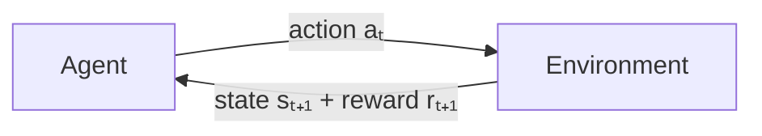
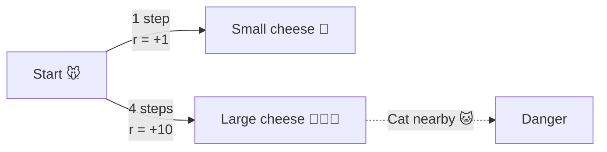
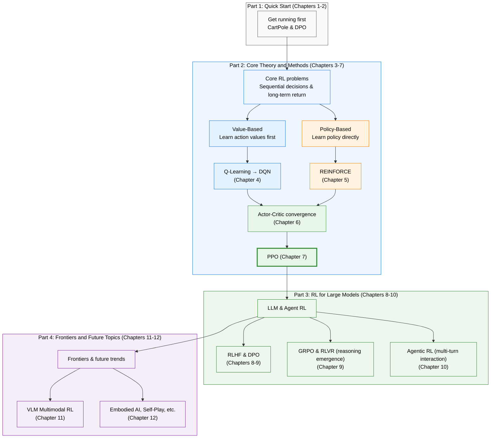

# Course Overview

::: info Note
We hope this open-source tutorial gives more people the courage to push toward the frontier of intelligence, tackling ever more problems on the path to AGI.

This course is under rapid iteration. We recommend starting with chapters not marked 🚧. Chapters under construction likely contain errors; corrections and suggestions are very welcome. If you find it useful, please give the [GitHub repository](https://github.com/walkinglabs/hands-on-modern-rl) a Star 🌟 to help speed up updates.
:::

::: tip Looking for Support
Because compute resources are limited, we are looking for GPU sponsorship. If you can offer GPU access, please contact us at [physicoada@gmail.com](mailto:physicoada@gmail.com).
:::

## Why Reinforcement Learning?

In 2019, Richard Sutton — one of the founding figures of reinforcement learning — wrote a short essay of less than two pages titled [_The Bitter Lesson_](http://www.incompleteideas.net/IncIdeas/BitterLesson.html). He reviewed 70 years of AI history and reached a conclusion that many researchers found hard to accept:

> The biggest lesson that can be read from 70 years of AI research is that general methods that leverage computation are ultimately the most effective, and by a large margin.
>
> —— Rich Sutton, 2019. Sutton and his advisor Andrew Barto were jointly awarded the 2024 ACM Turing Award for laying the theoretical foundations of reinforcement learning.

<em>Richard S. Sutton, one of the founding figures of reinforcement learning and 2024 Turing Award laureate. Source: <a href="https://commons.wikimedia.org/wiki/File:Rich_Sutton_on_Reinforcement_Learning-_Alpha_Go_Zero_to_60_(cropped).jpg" target="_blank" rel="noopener noreferrer">Wikimedia Commons</a> (CC BY 2.0)</em>

Why is it "bitter"? Because the same story has repeated itself throughout AI history. In computer chess, researchers carefully encoded opening repertoires and endgame strategies, only to be defeated by Deep Blue's brute-force search. In speech recognition and computer vision, people hand-designed feature extractors, only to be comprehensively replaced by deep networks that learned features from data. Go took this to its extreme — researchers invested enormous effort in using human knowledge to reduce search, while AlphaGo Zero simply removed all human input, played purely from self-play, and performed even better.

Sutton concluded: **researchers consistently try to make systems work the way they think the human mind works, but this ultimately proves counterproductive.** The two meta-techniques that truly drive breakthroughs — search and learning — are effective precisely because they can scale indefinitely with compute.

And what is the most natural, most primitive form of "learning"? It is not sitting in a classroom listening to lectures, nor reading labeled datasets. It is what all organisms do: **act in the real world, observe consequences, and adjust behavior — that is, trial and error.**

Think about the earliest skills you learned — walking, talking, riding a bicycle. Which of these did you learn by "reading a textbook"? Nobody gave you a checklist of "step with the left foot first, shift center of gravity forward." You just kept trying, falling, and getting back up, until one day your body automatically remembered what to do.

Take riding a bicycle. If you wanted to teach a child to ride, what would you do?

  <em>Figure 1: Teaching a child to ride a bike is a classic trial-and-error learning process. Source: <a href="https://commons.wikimedia.org/wiki/File:Dad_teaching_child_to_ride_a_bike.jpg" target="_blank" rel="noopener noreferrer">Wikimedia Commons</a></em>

You would not hand them a book called _The Physics of Bicycles and Balance Equations_, nor would you tell them before they mount: "when the frame tilts 5 degrees left, apply 10 Newtons with your right foot." Those precise rules are useless to their brain. Instead, you hold the saddle and encourage them to pedal. A scraped knee is negative feedback; the wind in their face as they ride stable is reward. After a few rounds, the brain automatically learns to adjust the center of mass through trial and error.

This ability — **learning in unknown environments through trial and error, guided by eventual outcomes** — is the most instinctive form of learning for all organisms. Yet strangely, the past decade of AI largely bypassed it. We taught machines to recognize cats and dogs, translate languages, and generate images, all using the same method: give them thousands of labeled correct answers and have them imitate. But when the problem shifts from "recognition" to "decision-making" — having a robotic arm grasp a cup, having AI defeat professional players in StarCraft, or teaching a large language model to respond appropriately — you fundamentally cannot label the correct answer for every step.

For these challenges that require sequential decisions in dynamic environments, **Reinforcement Learning (RL) provides a fundamentally different approach: don't tell AI how to act; tell it what is good and what is bad, and let it figure out the rest.** From Q-Learning to DQN, from PPO to DPO and GRPO — each evolution of RL has continuously expanded the boundaries of artificial intelligence.

This book will guide you through this journey hands-on with code. From the basic CartPole, all the way to using RL to unlock the reasoning capabilities of large language models. This is not just a technology — it is an entirely new perspective on understanding how intelligence emerges.

  <em>Figure 2: CartPole environment: the cart moves left and right to keep the pole balanced upright. Source: <a href="https://gymnasium.farama.org/environments/classic_control/cart_pole/" target="_blank" rel="noopener noreferrer">Gymnasium</a></em>

## What Is Reinforcement Learning?

The previous section used the "teaching a child to ride a bicycle" example to build intuition about RL. Now let us make it more precise.

> Reinforcement learning is a family of computational methods for solving **sequential decision-making problems**. An **agent** exists in an **environment**. At each time step, it observes the environment's **state**, selects an **action** based on that observation; the environment receives the action, transitions to a new state, and gives the agent a scalar **reward** as the sole feedback signal. The agent's goal: maximize the **cumulative reward** over the entire interaction process.

Note three key elements: **sequential decision-making** (making multiple consecutive choices, where current decisions affect the future), **the only feedback is reward** (unlike supervised learning which has standard answers, the agent only knows "how many points it got"), and **the goal is cumulative return** (not greedy for single-step reward, but focusing on the long term).

### The Core Loop

The RL interaction process is a repeating cycle:

1. The agent observes the current state $s_t$ and selects action $a_t$
2. The environment executes the action, transitions to new state $s_{t+1}$, and returns reward $r_{t+1}$
3. Return to step 1

The loop produces a **trajectory**: $s_0, a_0, r_1, s_1, a_1, r_2, s_2, \ldots$

Here are several important distinctions. **State** is a complete description of the environment (e.g., a chess board), while **observation** is a partial description (e.g., in Super Mario, you can only see the area around the character) — this book generally uses "state" to refer to both, and in code you will see the variable name `obs`. **Action spaces** come in two types: **discrete** (e.g., Mario only has 4 actions: left, right, jump, crouch) and **continuous** (e.g., a robotic arm's joint angles can take any real value). Different types require different algorithms.

Regarding rewards, if the agent only looks at immediate single-step reward, it becomes very "short-sighted." Therefore, what the agent truly cares about is **cumulative return $G_t$** — the sum of all future rewards from the current time step $t$ until the end of the episode.

However, simply adding up future rewards has a problem: rewards further in the future are more uncertain. Like a mouse in a maze — the small cheese right in front is immediately available, but the large cheese near the cat in the distance is full of risk. To capture "1 point in the future is worth less than 1 point now," we introduce the **discount factor $\gamma$** (ranging from 0 to 1, typically set to 0.95–0.99).

With the discount factor, future rewards get discounted when summed — the further away, the heavier the discount. Let us look at the formula:

$$G_t = r_{t+1} + \gamma\, r_{t+2} + \gamma^2\, r_{t+3} + \cdots = \sum_{k=0}^{\infty} \gamma^k\, r_{t+k+1}$$

The formula looks long, but it is very intuitive when broken down:

- $r_{t+1}$ is the reward you get immediately, **no discount** (multiplied by $\gamma^0 = 1$).
- $r_{t+2}$ is the reward two steps away, discounted once, multiplied by $\gamma^1$.
- $r_{t+3}$ is the reward three steps away, discounted twice, multiplied by $\gamma^2$.
- And so on: the reward at future step $k+1$ is multiplied by $\gamma^k$. Since $\gamma$ is a fraction less than 1 (e.g., 0.9), $\gamma^k$ gets smaller as steps increase (0.9, 0.81, 0.729...).

So the value of $\gamma$ determines the agent's "horizon." Let us use the mouse below to do the math:

The mouse has two paths:

- **Short-sighted path (1 step)**: Eat the small cheese immediately, reward is +1. Since it is right there, no discount is needed, so the actual value is **1 point**.
- **Long-term path (4 steps)**: Travel 4 steps to reach the large cheese, reward is +10. Because of the distance, the reward gets discounted, multiplied by $\gamma^3$ (discounted 3 times).

At this point, the value of $\gamma$ becomes decisive:

- **If $\gamma = 0.1$ (short-sighted)**: The large cheese's perceived value becomes $10 \times 0.1^3 = 0.01$ points. The mouse sees 0.01 points is far less than the 1 point right in front, so it **goes straight for the small cheese**.
- **If $\gamma = 0.9$ (far-sighted)**: The large cheese's perceived value becomes $10 \times 0.9^3 = 7.29$ points. The mouse calculates 7.29 points is far greater than the 1 point in front, so it is willing to resist the immediate temptation and **take the risk to go for the large cheese**.

  <em>Figure 3: A mouse navigating a maze to find cheese is a commonly used pathfinding and decision-making model in RL. Source: <a href="https://commons.wikimedia.org/wiki/File:MAZE_Mouse_Cheese.jpg" target="_blank" rel="noopener noreferrer">Wikimedia Commons</a></em>

The entire RL framework is built on a philosophical stance — the **reward hypothesis**: all goals can be described as "maximizing expected cumulative reward." As long as you can quantify "good" and "bad" as numerical signals, RL has a way to make the agent learn.

There are also two task types: **episodic** tasks have a clear start and end (one game of Super Mario, one episode of CartPole), while **continuing** tasks have no endpoint (automated stock trading). All experiments in this book are episodic, making it convenient to measure progress by "score per episode."

### How to Solve: Two Routes

All RL algorithms answer the same question: how to choose actions to **maximize cumulative return**? The cumulative return $G_t$ is the sum of all discounted rewards the agent receives starting from time step $t$:

$$G_t = r_{t+1} + \gamma\, r_{t+2} + \gamma^2\, r_{t+3} + \cdots = \sum_{k=0}^{\infty} \gamma^k\, r_{t+k+1}$$

It measures "how many total points were earned over the course of one episode" rather than the immediate reward at a single step. There are two fundamentally different routes to answer this question. Before diving in, let us meet a core concept — **policy $\pi$**, which is the agent's "brain," a function that maps states to actions. The ultimate training goal is to find the **optimal policy $\pi^*$**. Policies come in two types: **deterministic** policies always output the same action for the same state ($a = \pi(s)$), while **stochastic** policies output a probability distribution over actions ($\pi(a|s) = P(a|s)$) — the latter naturally balances exploration because there is always some probability of trying non-preferred actions.

So, how do we find the optimal policy? There are two fundamentally different routes:

**Route 1: Value-Based** — First figure out how many "points" each action is worth, then choose the highest-scoring one. Imagine walking through a maze; at every fork you see a sign: going left yields an expected total of 80 points, going right yields 30 — so you choose left. That "sign" is the **action-value function (Q-function)**, representing how many total future points you can expect after choosing a particular action in a particular state:

$$Q^{\pi}(s, a) = \mathbb{E}_{\pi}\left[G_t \mid s_t = s,\, a_t = a\right]$$

You might wonder: **if you haven't reached the end yet, how can you know how many points the future holds? How are these Q-values actually computed?**

This is the most elegant part of RL: **start with random guesses, then correct step by step.** And the theoretical foundation that makes this possible is the **Markov Decision Process (MDP)**.

The core assumption of MDP is that "the future depends only on the present, not the past." With this foundation, we can play a mathematical trick, cutting the infinite future at any point — this is the **Bellman Equation**. It tells us that Q-values don't need to be computed by playing to the end; they can be directly decomposed into two parts:
**Current Q-value = immediate reward + next step's Q-value**

With this equation, the algorithm's operation becomes extremely intuitive:
Initially, the scores on all signs at every fork are randomly written (random initialization). You take a random step, receive 1 point reward, and see the next fork's sign reads 10 points. You immediately understand: "Oh, the true value of that last step is about 1+10=11 points!" So you take out a pen and update the sign at the previous fork to 11.

Through repeated trial and error in the maze, using "next step's sign" to correct "previous step's sign," all Q-values eventually converge to their true scores (satisfying the **Bellman optimality equation**). At that point, always choosing the highest-scoring action naturally yields the optimal policy: $a^* = \arg\max_a Q^*(s, a)$. The representative algorithms of this route range from the classic Q-Learning to DQN in the deep learning era.

**Route 2: Policy-Based** — Skip the scoring and directly learn "when you see this, do that." Back to the maze example — instead of scoring each path, you repeatedly walk through the maze many times: when you reach the end, you strengthen confidence in every choice made along the way; when you fall into a trap, you weaken those choices. Over many walks, the probability of good actions naturally rises while the probability of bad ones falls. Formally, the policy $\pi_\theta$ is defined by parameters $\theta$, and we optimize it by maximizing expected return:

$$J(\theta) = \mathbb{E}_{\pi_\theta}\left[G_t\right], \quad \theta^* = \arg\max_\theta J(\theta)$$

The representative algorithms of this route range from the basic REINFORCE to PPO, which is widely used in large model alignment today.

Both routes have shortcomings, and their weaknesses point directly to a core dilemma of RL — **Exploration vs. Exploitation**: exploit the best known action to secure reward, or take the risk of trying unknown actions to discover better strategies? Like choosing restaurants — going to the same good one every day (exploitation) means you might never discover the better one around the corner (exploration); but trying a new restaurant every day (over-exploration) means frequent disappointments. Too much exploration wastes resources; too little leads to suboptimal solutions and no further progress. Route 1 is good at scoring but not at exploring; Route 2 is good at exploring but scoring is less accurate.

**Actor-Critic** combines both — using Route 1's approach to train a **"Critic"** that evaluates how good each action is, and Route 2's approach to train an **"Actor"** that selects actions. Specifically:

- **Critic** is a value function responsible for answering "in state $s$, is executing action $a$ good or bad?" It doesn't select actions directly but scores them — for example, telling you "this step is expected to earn +5 points." The more accurate the scoring, the more the Actor knows which directions are worth trying and which to avoid.
- **Actor** is a policy function $\pi_\theta(a|s)$, responsible for answering "in state $s$, what should I do?" It adjusts its behavior based on the Critic's scores: actions that receive high scores are selected more often in the future; those scored low are selected less.

The two form a virtuous cycle: the more accurate the Critic's scores, the faster the Actor improves; the more new actions the Actor tries, the richer the data the Critic sees, and the more accurate its scores become. This is like the relationship between an intern actor and an experienced director — the director points out problems in the performance, the actor improves accordingly, and the actor's new attempts give the director a deeper understanding of "what makes a good performance."

In RL terminology, algorithms can also be classified by **whether they learn the environment's dynamics**:

- **Model-Free methods**: The agent doesn't care about how the environment works internally, only about "how many points do I get if I do this?" Whether value-based, policy-based, or Actor-Critic, as long as it accumulates experience through trial and error in the environment, it is Model-Free. Like playing Super Mario — you don't need to know the game engine's code; you naturally learn how to jump by dying a few times.
- **Model-Based methods**: The agent first builds a "world model" in its mind (a model of the environment), predicting "if I do this, what will the environment become?" For example, when AlphaGo plays Go, it knows the rules of Go (the model), and can simulate several moves ahead in its mind before making a decision.

This book primarily focuses on **Model-Free** algorithms (such as DQN, PPO, DPO, etc.), because they are more general and absolutely dominate in today's large language model alignment and complex environments.

  <em>Figure 4: Actor-Critic architecture diagram: the Actor is responsible for executing actions, while the Critic scores actions based on environment rewards and guides the Actor to improve.</em>

One final question: what do these "score tables" and "behavior manuals" actually look like? In simple environments they can be a small table — just look it up. For example, a tiny maze with only 16 cells, you just need a 16-row table, each row writing "in this cell, how many points is left/right worth" — this is the classic Q-Learning approach:

| State | $\leftarrow$ | $\rightarrow$ | $\uparrow$ | $\downarrow$ |
| :---: | :----------: | :-----------: | :--------: | :----------: |
| $s_0$ |     0.1      |    **0.8**    |    0.3     |     -0.2     |
| $s_1$ |   **0.7**    |      0.2      |    0.5     |     0.0      |
|   ⋮   |      ⋮       |       ⋮       |     ⋮      |      ⋮       |

Table lookup is sufficient for decision-making: in $s_0$ choose "right" (0.8 is highest), in $s_1$ choose "left" (0.7 is highest). The policy table is similar, with each row showing "the probability of going in each direction from this cell."

But in Atari games, a single frame has $210 \times 160 = 33,600$ pixels, each with 128 possible colors — the number of possible states far exceeds the number of atoms in the universe. A table simply cannot hold it. **Deep Reinforcement Learning (Deep RL)** uses neural networks to "compress" this infinitely large table: the network takes state (e.g., game screen) as input and outputs Q-values or action probabilities. The network doesn't need to store every row — it **generalizes** through weights, so having seen similar screens, it can guess similar scores.

- If the neural network learns a "score table" (input state, output Q-values for each action), it is Value-Based (e.g., DQN);
- If it learns a "behavior manual" (input state, output action probability distribution), it is Policy-Based (e.g., REINFORCE);
- If it learns both — one network for scoring, one for selecting actions — it is Actor-Critic (e.g., PPO).

All algorithms in this book are Deep RL.

### The Large Model Era

The RL framework discussed above — agent, environment, reward — was developed in traditional settings like games and robotics. A natural question is: **what happens when this framework meets large language models?**

In 2016, AlphaGo defeated Lee Sedol, proving RL's power in perfect-information games. But what truly brought RL into the public spotlight was the 2022 release of ChatGPT — people discovered that the key technology for making large models go from "can talk" to "talk well" was none other than reinforcement learning.

  <em>Figure 5: ChatGPT brought large language models to public attention and turned RLHF from a training pipeline in papers into a key technology behind real products. Source: OpenAI <a href="https://openai.com/index/chatgpt/" target="_blank" rel="noopener noreferrer">Introducing ChatGPT</a></em>

In game environments, reward signals are clear and automatic: eating a coin is +1, falling into a pit is -100. But when we want AI to learn to "speak well," a problem arises: what is a "good" response? Polite? Helpful? Safe? Human preferences are so complex that the environment cannot automatically judge how many points a response should receive.

**RLHF (Reinforcement Learning from Human Feedback)** provided the first solution, completing the transformation from "can talk" to "talk well" in three stages:

  <em>Figure 6: The three-step training pipeline used by OpenAI in InstructGPT: first supervised fine-tuning, then reward model training, and finally RL policy optimization. Source: OpenAI <a href="https://openai.com/index/instruction-following/" target="_blank" rel="noopener noreferrer">Aligning language models to follow instructions</a></em>

1. **Supervised Fine-Tuning (SFT)**: Fine-tune the model with high-quality dialogue examples written by humans, teaching it basic conversation format.
2. **Reward Model Training (RM)**: Have humans rank multiple model responses, then train a scoring model that can "imitate" human preferences.
3. **RL Optimization (RL)**: Use algorithms like PPO with the reward model's scores as the signal to further optimize the model's response strategy.

RL in the large model era has evolved two key routes. **Route 1: Preference-based alignment (RLHF / DPO)** — when the judgment standard is "do humans like it" (polite tone, safe response), the environment cannot automatically score. We first train a reward model with human annotations to "imitate" human preferences, then use it to guide RL training. DPO goes further, cleverly "hiding" the reward signal in the policy probability ratio, bypassing the explicit reward model — you will practice this pipeline hands-on in Chapters 8-9. **Route 2: Verifiable-reward pure RL (RLVR)** — when turning to math, code, or complex reasoning tasks, the correctness of answers is objectively verifiable. Frontier work like DeepSeek-R1-Zero proves that SFT and reward models are no longer necessary: as long as you give the model rule-based feedback, pure RL can drive a base model to spontaneously emerge long Chain-of-Thought reasoning and powerful reasoning capabilities. This is one of the most cutting-edge explorations on the path to AGI.

  <em>Figure 7: DeepSeek-R1's training pipeline pushes "RL in the large model era" toward another route: on verifiable tasks, let the model self-improve through online sampling, rule rewards, and GRPO-style optimization. Source: <a href="https://arxiv.org/abs/2501.12948" target="_blank" rel="noopener noreferrer">DeepSeek-R1 Paper</a></em>

Remember PPO from earlier? In the large model era, it went from being the pinnacle of game control to the foundation of the entire LLM alignment industry. But PPO requires an additional Critic network to evaluate action quality, which means enormous computational overhead for large models. **GRPO (Group Relative Policy Optimization)** was born — it replaces the Critic network with within-group relative advantages, comparing multiple responses from the same generation to learn "which is better" directly. This simplification dramatically reduces RL training costs and has become one of the mainstream choices for aligning large models in the open-source community.

### The Future

RL is moving from "making AI do single-step decisions" to "making AI complete entire tasks." Along this path, three directions are worth watching.

The first direction is **Agentic RL**. Current large language models are essentially "single-turn QA machines" — you ask one question, they give one answer. But real-world tasks often require multi-turn interaction: planning a trip requires searching multiple websites for price comparison; debugging code requires repeatedly running tests, reading error messages, modifying and verifying. Agentic RL trains AI to act continuously in environments, call tools, dynamically adjust strategies based on intermediate results, and ultimately complete long-horizon complex tasks. This is the key transition from "dialogue models" to "autonomous agents," which you will practice in depth in Chapter 10.

The second direction is **multimodal and embodied intelligence**. RL is breaking through the boundaries of pure text: vision-language models (VLMs) extend RL's reach to image understanding and visual reasoning, while embodied AI pushes RL into the physical world — letting robots learn to walk, grasp, and manipulate through trial and error in real environments. The biggest challenge is the simulation-to-reality gap (Sim-to-Real Gap): policies trained in virtual environments may fail completely in the real world. Techniques like domain randomization are helping to alleviate this problem, while Model-Based RL and self-play are opening new possibilities.

The third direction may also be the ultimate destination — **toward more general intelligence**. Returning to Sutton's "bitter lesson": general methods will ultimately prevail. From games to language, from language to vision, from vision to the physical world, every expansion of RL validates the same judgment — letting agents learn through trial and error is more effective than humans manually encoding knowledge. And the end of this road may be AGI.

---

The above is the conceptual framework of reinforcement learning. If you encounter this for the first time, the terminology can feel dense — no need to dwell here. The following chapters will unfold each concept through code and experiments. Each time you encounter a concept, you will have concrete hands-on experience to match it with.

## About This Book

In 2016, AlphaGo defeated Lee Sedol, and RL stunned the public for the first time. In 2022, ChatGPT was released, and people discovered that RL was precisely the key technology for making large language models go from "can talk" to "talk well." From DeepSeek-R1 to various open-source alignment models, algorithms like RLHF, DPO, and GRPO have profoundly reshaped the entire AI industry.

  <em>Figure: Game 5 of the five-game match between AlphaGo and Lee Sedol in 2016. AlphaGo won 4:1, marking the first time RL stunned the public. Source: <a href="https://commons.wikimedia.org/wiki/File:Lee_Sedol_(B)_vs_AlphaGo_(W)_-_Game_5.svg" target="_blank" rel="noopener noreferrer">Wikimedia Commons</a> (CC BY-SA 4.0)</em>

However, available learning resources lag severely behind industry practice. Mainstream tutorials gloss over RL, while dedicated RL textbooks remain stuck in traditional frameworks and don't mention PPO, DPO, or GRPO. An engineer who wants to understand the RLHF pipeline must laboriously bridge classic textbooks and cutting-edge papers on their own. We set out to write this book to fill that gap.

This book represents our attempt — **to make modern reinforcement learning accessible, teaching core concepts through a blend of code, math, and intuition.**

### A "Hands-On First, Theory Second" Learning Path

Many textbooks first cover all properties of MDPs, then the Bellman equation, and only then let you touch a single line of code. In this book, **you will start training an agent from the very first line of code in Chapter 1.** When you see the CartPole go from wobbling to standing steady, when you personally use DPO to teach a large model to "speak well," and then go back to understand the underlying math, the learning process is more natural and the understanding more lasting.

Each chapter follows a four-step cycle: first give you runnable code to gain direct experience; then guide you to observe key phenomena on training curves; then explain mathematical principles on top of the intuition; and finally use theory to re-interpret the earlier phenomena, completing the loop from intuition to formalization.

### Code and Theory Together

Every chapter includes runnable code examples. **Many intuitions in RL can only be built through trial and error** — tweak the learning rate, observe oscillation in the reward curve; change the clip parameter, see if the policy collapses. These experiences cannot be gained by reading formulas alone.

### Content and Structure

The book can be roughly divided into four parts, shown in different colors in the core map below:

The diagram above shows the main thread of the book's algorithms. **Part 1** (gray) gets you started quickly with first-hand experience on CartPole and DPO. **Part 2** (blue) builds core theory: the left blue branch is Value-Based — first estimate how many points each action is worth, then choose the highest-scoring one; the right orange branch is Policy-Based — skip scoring and directly learn what to do in each state. The two routes merge at Actor-Critic, from which PPO emerges. **Part 3** (green) enters the large model era: PPO is the backbone for all subsequent large model alignment and agent algorithms, extending to RLHF, DPO, GRPO, and Agentic RL. **Part 4** (purple) looks at frontiers, exploring multimodal RL and embodied intelligence.

Here is a detailed introduction to each chapter's content.

**Part 1 covers quick start.**

- **Chapter 1** guides you from zero to running your first RL training script, gaining first-hand experience of "AI can learn something on its own" on the CartPole inverted pendulum.
- **Chapter 2** switches the scenario from "game control" to "language alignment," using a complete DPO fine-tuning pipeline to teach a large language model to "not blindly follow the user," experiencing how modern RL directly acts on large models.

**The next five chapters focus on building the theory and methodology of reinforcement learning.**

- **Chapter 3** introduces the mathematical foundation of RL — the Markov Decision Process (MDP), starting from the multi-armed bandit problem, progressively building the formal framework of states, actions, and rewards, and deriving the Bellman equation.
- **Chapter 4** enters deep reinforcement learning, showing how DQN moves Q-Learning from a small table into a neural network, using experience replay and target networks to let agents learn to make decisions directly from Atari game pixels — a milestone in the fusion of deep learning and RL.
- **Chapter 5** turns to the other route — policy gradient methods, from REINFORCE to policy gradients with baselines, understanding the basic paradigm of policy optimization.
- **Chapter 6** builds the Actor-Critic architecture, introducing the advantage function and Critic training methods, merging the Value-Based and Policy-Based routes.
- **Chapter 7** focuses on PPO, diving deep into the two core mechanisms of clipping and Generalized Advantage Estimation (GAE), practicing the art of stable training on the Lunar Lander — PPO is both the pinnacle of the game control era and the starting point for all subsequent large model alignment algorithms.

**Part 3 discusses alignment and agent algorithms in the large model era.**

- **Chapter 8** connects the SFT → RM → RL three stages, building a complete RLHF engineering pipeline, covering core practical challenges including data engineering, reward function design, training stability control, and self-play data flywheels.
- **Chapter 9** introduces frontier algorithms for post-training alignment. It reveals mathematically how DPO "hides" the reward signal in the policy probability ratio to bypass the reward model; then introduces how GRPO uses within-group relative advantages to further eliminate the Critic network. The focus is on **RLVR (RL with Verifiable Rewards)**, analyzing how rule-based feedback replaces human annotation, and tracing the latest progress in **DeepSeek-R1-Zero**'s pure RL-driven emergence of reasoning capabilities (CoT).
- **Chapter 10** focuses on **Agentic RL**. It explores how to use RL to train agents that can act continuously in environments, call tools, and interact over multiple turns, covering tool calling, trajectory synthesis, credit assignment, and industrial practice (such as Deep Research Agents). This is the key transition from "dialogue models" to "autonomous agents."

**Part 4 extends RL to vision, the physical world, and frontier directions.**

- **Chapter 11** pushes RL from pure text into vision-language models (VLMs), analyzing unique problems in multimodal RL such as visual hallucination and reward attribution, and introducing frontier frameworks like Open-R1 in visual reasoning and generation.
- **Chapter 12** surveys the future trends of RL. It covers not only the core challenges of **embodied intelligence** — from discrete to continuous action control and Sim-to-Real domain randomization — but also frontier directions that will fundamentally reshape intelligent systems: Model-Based RL, Self-Play, LLM multi-agent cooperation, and Offline RL.

### Target Audience

This book is aimed at students, engineers, and researchers. No prior deep learning or machine learning background is required — only basic Python programming ability, linear algebra (matrix operations), calculus (partial derivatives, chain rule), and probability fundamentals (expectation, conditional probability). Most of the time, we prioritize intuition and ideas over mathematical rigor.

## Environment and Hardware Requirements

The course's experimental code is compatible with major operating systems:

- **Linux** (recommended): Ubuntu 20.04 and above, with the most complete support for the deep learning ecosystem.
- **Windows**: Run all experiments through WSL2 (Windows Subsystem for Linux 2), easy to install.
- **macOS**: Both Apple Silicon (M1/M2/M3/M4) and Intel Macs can run most experiments.

GPU and VRAM requirements are divided into three tiers:

| Tier              | VRAM Required        | Coverage                                                                                        | Typical Hardware                    |
| ----------------- | -------------------- | ----------------------------------------------------------------------------------------------- | ----------------------------------- |
| Intro experiments | CPU only / 4GB+ VRAM | Classic RL experiments like CartPole, Atari, policy gradients                                   | Integrated graphics, GTX 1650, etc. |
| Core experiments  | 24GB VRAM            | LLM-related experiments like DPO alignment, PPO training, GRPO                                  | RTX 3090, RTX 4090, A5000, etc.     |
| Large projects    | 80GB VRAM            | A small number of large-scale model training runs (e.g., complete RLHF pipeline for 7B+ models) | A100, H100, etc.                    |

Most experiments are designed to run within **24GB VRAM** — a single consumer-grade GPU (like RTX 3090/4090) is sufficient for over 90% of the hands-on content in the entire book. Only a few advanced projects involving full-parameter training of large models require 80GB-class GPUs.

::: tip
The cost of experiencing this course is not high. An ordinary laptop can run the intro experiments, and a consumer GPU with 24GB VRAM covers the vast majority of core content.
:::

## Summary

- **Foundational understanding**: RL is the form of learning closest to biological instinct — optimizing behavior through trial and error and reward signals. Sutton's "bitter lesson" tells us that general methods will ultimately prevail over manually encoded human knowledge.
- **Core theory**: RL's theoretical framework centers on the agent-environment interaction loop. Value functions and policy gradients are the two core solution routes, and Actor-Critic merges both.
- **The large model era**: From RLHF to DPO, from PPO to GRPO and RLVR, RL has become the key technology for large language model alignment and the emergence of reasoning capabilities.
- **The future**: Agentic RL, multimodal RL, and embodied intelligence are pushing RL from dialogue to action, from text to the physical world, toward more general intelligence.
- This book uses a "hands-on first, theory second" teaching approach. Only basic Python programming and math foundations are needed to begin learning.
