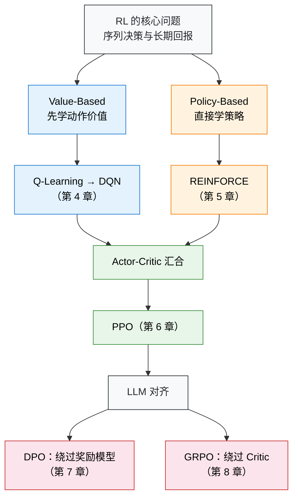

# 写在开头

## 为什么需要强化学习？

教一个小孩骑自行车，你会怎么做？

你不会先递给他一本《自行车物理学与平衡方程》，也不会在他上车前规定"当车身向左倾斜 5 度时右脚施力 10 牛顿"。你只是扶着后座，鼓励他自己去蹬。摔了，擦伤的膝盖就是负面反馈；稳了，迎面吹来的风就是奖励。几次下来，他的大脑在试错中自动学会了调整重心。

这种能力——**在未知环境中通过试错来学习，以最终的回报为导向**——是所有生物最本能的学习方式。可奇怪的是，过去十年的人工智能恰恰绕开了它。我们教会了机器认猫认狗、翻译语言、生成图片，用的全是同一种方法：给它成千上万个标注好的正确答案，让它照着学。但当问题从"识别"变成"决策"——让机械臂抓取水杯，让 AI 在星际争霸中打败职业选手，或者让大语言模型学会得体地回答问题——你根本无法为每一步标注出标准答案。

面对这些需要在动态变化中做连续决策的难题，**强化学习（Reinforcement Learning, RL）提供了一套截然不同的思路：不告诉 AI 怎么做，只告诉它什么好、什么不好，剩下的让它自己摸索。**从 Q-Learning 到 DQN，从 PPO 到 DPO 和 GRPO——强化学习的每一次进化，都在不断拓宽人工智能的能力边界。

本书将带你亲手用代码重走这段旅程。从最基础的倒立摆（CartPole），一路走到如何用 RL 激发大语言模型的推理能力。这不仅是一门技术，更是一种理解智能如何涌现的全新视角。

## 为什么是现在？

2016 年，AlphaGo 击败李世石，强化学习第一次震撼公众。2022 年 ChatGPT 发布，人们发现 RL 正是让大语言模型从"能说话"变成"说好话"的关键技术。从 DeepSeek-R1 到各类开源对齐模型，RLHF、DPO、GRPO 等算法已经深刻地重塑了整个 AI 行业。

然而，**市面上的学习资源严重滞后于行业实践**。主流教程对 RL 一笔带过，专门的 RL 教材又停留在传统框架，对 PPO、DPO、GRPO 只字不提。**一个想要理解 RLHF 流程的工程师，不得不在经典教材和最新论文之间艰难地自行搭建桥梁。**我们着手写这本书，就是为了填补这道鸿沟。

## 关于本书

这本书代表了我们的尝试——**让现代强化学习变得平易近人，用代码、数学和直觉的融合来教会人们核心概念。**

### 一种"先动手、后理论"的学习路径

许多教科书先讲完 MDP 的全部性质，再讲贝尔曼方程，最后才允许你碰一行代码。在这本书中，**你将从第一章的第一行代码开始训练一个智能体**。当你亲眼看到 CartPole 的小车从摇摇晃晃到稳稳站立，亲手用 DPO 让一个大模型学会"说好话"，再回过头理解背后的数学时，学习过程会更加自然，理解也会更加持久。

每一章都遵循一个四步循环：先给你一段可运行的代码，让你获得直接经验；然后引导你关注训练曲线上的关键现象；接着在具备直觉的基础上讲解数学原理；最后用理论重新解读之前的现象，完成从直觉到形式化的闭环。

### 代码与理论并重

本书的每一章都包含可运行的代码示例。**强化学习中的许多直觉只能通过试错来建立**——调一调学习率，观察 reward 曲线的振荡；改一改 clip 参数，看看策略是否会崩溃。这些经验无法仅靠阅读公式来获得。

### 内容和结构

全书大致可分为四个部分，在下图的核心脉络中用不同的颜色呈现：

所有 RL 算法本质上只做两件事中的一件——**Value-Based**（蓝色）先搞清楚"每个动作值多少分"再选最好的，**Policy-Based**（橙色）跳过打分直接学"什么情况做什么动作"。两条路线在 Actor-Critic 架构中汇合，成为 PPO 的骨架，也是后续所有 LLM 对齐算法的出发点。之后每章开头都会回到这张图，标出"你在这里"——让你始终知道当前位置在整个知识版图上的位置。

**第一部分包括快速入门。** 1 章带你零基础运行第一个 RL 训练脚本，在 CartPole 倒立摆上获得"AI 能自己学会一件事"的第一手感受。然后在 2 章中，我们将场景从"游戏控制"切换到"语言对齐"，用一个完整的 DPO 微调流程让大语言模型从"毒舌"变成"礼貌"，体验现代 RL 如何直接作用于大模型。

**接下来的四章集中构建强化学习的理论与方法体系。** 3 章引入 RL 的数学基石——马尔可夫决策过程（MDP），从多臂老虎机问题出发，逐步建立状态、动作、奖励的形式化框架，并推导出贝尔曼方程。4 章进入深度强化学习，展示 DQN 如何将 Q-Learning 从一张小表格搬进神经网络，通过经验回放和目标网络让智能体直接从 Atari 游戏像素中学会决策——这也是深度学习与强化学习融合的里程碑。5 章转向另一条路线——策略梯度方法，从 REINFORCE 到带基线的策略梯度，再搭建 Actor-Critic 架构，让 Value-Based 和 Policy-Based 两条路线在此汇合。6 章聚焦 PPO，深入裁剪（Clipping）和广义优势估计（GAE）两大核心机制，在月球着陆器上实践稳定训练的艺术——PPO 既是游戏控制时代的集大成者，也是后续所有 LLM 对齐算法的出发点。

**第三部分讨论大语言模型时代的对齐算法。** 7 章从数学上揭示 DPO 如何将奖励信号"隐藏"在策略概率比中，绕过整个奖励模型训练环节，并扩展到 KTO、SimPO 等 DPO 变体，构成一个完整的离线偏好优化方法族。8 章介绍 GRPO 如何用组内相对优势进一步省去 Critic 网络，以及 RLVR（Reinforcement Learning with Verifiable Rewards）如何用数学题的标准答案和代码测试用例替代人工标注的奖励模型，追踪 DeepSeek-R1-Zero 和 DAPO 的最新进展，展望 RL Scaling 的未来。

**第四部分将 RL 基础与工业界前沿场景对接。** 9 章从离散动作扩展到连续力矩控制，介绍 DDPG、TD3 和 SAC 等连续动作空间算法，这是 RL 走向机器人控制等物理世界的必经之路。10 章串联 SFT → RM → RL 三阶段，构建一条完整的 RLHF 工程流水线，覆盖数据工程、奖励函数设计和训练稳定性控制等实际工作中的核心挑战。11 章把 RL 从纯文本推进到视觉-语言模型（VLM），分析多模态 RL 中视觉幻觉、奖励归因等独特问题。12 章聚焦 Agentic RL——如何用 RL 训练能在环境中连续行动、调用工具、多轮交互的智能体，这是从"对话模型"到"自主智能体"的关键跨越。最后，13 章展望 Test-time Reasoning、具身智能、多智能体协作、离线 RL 和自博弈等前沿方向。

### 目标读者

本书面向学生、工程师和研究人员。不需要过往的深度学习或机器学习背景，只需基本的 Python 编程能力、线性代数（矩阵运算）、微积分（偏导数、链式法则）和概率论基础（期望、条件概率）。大多数时候，我们会优先考虑直觉和想法，而不是数学的严谨性。

## 小结

- 强化学习已经从实验室走向工业界，成为大语言模型后训练、机器人控制、游戏 AI 等领域的核心技术。
- 本书采用"先动手、后理论"的教学路径，每章都包含可运行的代码和系统化的数学讲解。
- 全书覆盖从 MDP、Q-Learning 到 PPO、DPO、GRPO，再到 LLM 对齐和智能体 RL 的完整知识图谱。
- 只需基本的 Python 编程和数学基础即可开始学习。
