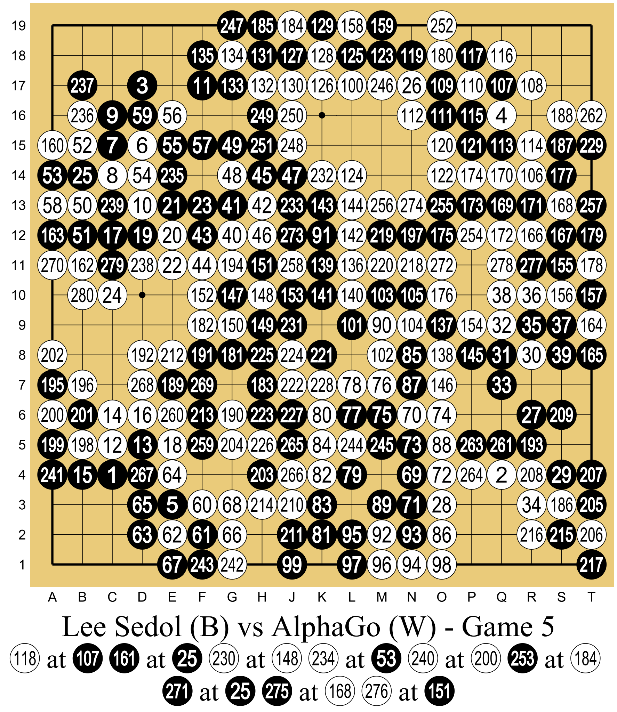

# 强化学习导论

::: warning 📣 公告
感谢大家对教程的支持！当前教程快速迭代中，近期将会有版本更新，目前很多内容还在整理和完善中，请大家多点耐心。也欢迎大家多提建议和修正。欢迎给 [GitHub 仓库](https://github.com/walkinglabs/hands-on-modern-rl) 点个 Star 🌟 加速一下更新～

**希望本开源教程能够让更多人拥有向智能上限发起攀登的勇气，解决更多通往 AGI 道路上的问题。**

由于资源稀缺问题，我们正在寻求显卡支持，如果您有显卡使用方式愿意支持非常欢迎联系 [physicoada@gmail.com](mailto:physicoada@gmail.com)。
:::

## 强化学习的应用价值

2019 年，强化学习领域的奠基人之一理查德·萨顿（Richard Sutton）写了一篇不到两页的短文，题目叫《苦涩的教训》（[The Bitter Lesson](http://www.incompleteideas.net/IncIdeas/BitterLesson.html)）。他回顾了人工智能 70 年的历史，得出了一个让许多研究者难以接受的结论：

> The biggest lesson that can be read from 70 years of AI research is that general methods that leverage computation are ultimately the most effective, and by a large margin.
>
> 从 70 年的 AI 研究中可以得出的最大教训是：利用计算能力的通用方法终将是最有效的，而且会遥遥领先。
>
> —— Rich Sutton, 2019. 萨顿与导师安德鲁·巴托（Andrew Barto）因奠定了强化学习的理论基础，共同获得 2024 年 ACM 图灵奖。

<em>理查德·萨顿（Richard S. Sutton），强化学习奠基人之一，2024 年图灵奖得主。来源：<a href="https://commons.wikimedia.org/wiki/File:Rich_Sutton_on_Reinforcement_Learning-_Alpha_Go_Zero_to_60_(cropped).jpg" target="_blank" rel="noopener noreferrer">Wikimedia Commons</a>（CC BY 2.0）</em>

为什么说它"苦涩"？因为同样的故事在 AI 历史上一遍又一遍地上演。在计算机国际象棋中，研究者精心编码开局定式和残局策略，结果被暴力搜索的深蓝击败；在语音识别和计算机视觉中，人们手工设计特征提取器，结果被从数据中自己学特征的深度网络全面取代。围棋更是登峰造极——研究者投入巨大精力利用人类知识来减少搜索量，而 AlphaGo Zero 干脆去掉一切人类输入，从零自我对弈，反而下得更好。

萨顿总结道：**研究者总是试图让系统按照他们认为人类心智运作的方式去工作，但最终这被证明是适得其反的。** 真正推动突破的两大元技术——搜索和学习——之所以有效，恰恰是因为它们能随算力的增长而无限扩展。

而"学习"最自然、最原始的形态是什么？不是坐在教室里听课，不是阅读标注好的数据集，而是像所有生物一样：**在真实世界中行动、观察后果、调整行为——也就是试错。**

想一想，你人生中最早学会的那些技能——走路、说话、骑自行车——有哪一个是靠"读教材"学会的？没有人给你列一张"左脚先迈、重心前移"的步骤清单。你只是不断地尝试，摔倒，再爬起来，直到某一天身体自己记住了该怎么做。

以骑自行车为例。假设你要教一个小孩学会骑车，你会怎么做？

  <em>图 1：教小孩骑自行车的过程，正是一个典型的试错（Trial-and-Error）学习过程。来源：<a href="https://commons.wikimedia.org/wiki/File:Dad_teaching_child_to_ride_a_bike.jpg" target="_blank" rel="noopener noreferrer">Wikimedia Commons</a></em>

你不会先递给他一本《自行车物理学与平衡方程》，也不会在他上车前规定"当车身向左倾斜 5 度时右脚施力 10 牛顿"——这些精确的知识对他的大脑毫无用处。你只是扶着后座，鼓励他自己去蹬。摔了，擦伤的膝盖就是负面反馈；稳了，迎面吹来的风就是奖励。几次下来，他的大脑在试错中自动学会了调整重心。

这种能力——**在未知环境中通过试错来学习，以最终的回报为导向**——是所有生物最本能的学习方式。可奇怪的是，过去十年的人工智能恰恰绕开了它。我们教会了机器认猫认狗、翻译语言、生成图片，用的全是同一种方法：给它成千上万个标注好的正确答案，让它照着学。但当问题从"识别"变成"决策"——让机械臂抓取水杯，让 AI 在星际争霸中打败职业选手，或者让大语言模型学会得体地回答问题——你根本无法为每一步标注出标准答案。

面对这些需要在动态变化中做连续决策的难题，**强化学习（Reinforcement Learning, RL）提供了一套截然不同的思路：不告诉 AI 怎么做，只告诉它什么好、什么不好，剩下的让它自己摸索**。从 Q-Learning 到 DQN，从 PPO 到 DPO 和 GRPO——强化学习的每一次进化，都在不断拓宽人工智能的能力边界。

本书将带你亲手用代码重走这段旅程。从最基础的倒立摆（CartPole），一路走到如何用 RL 激发大语言模型的推理能力。这不仅是一门技术，更是一种理解智能如何涌现的全新视角。

  <em>图 2：CartPole 倒立摆环境：小车通过左右移动来保持杆子竖直平衡。图源：<a href="https://gymnasium.farama.org/environments/classic_control/cart_pole/" target="_blank" rel="noopener noreferrer">Gymnasium</a></em>

## 强化学习的定义

上一节我们用"教小孩骑自行车"的例子建立了对强化学习的直觉。现在，让我们把它变得更精确。

> 强化学习是一类解决**序列决策问题**的计算方法。一个**智能体（Agent）** 处在某个**环境（Environment）** 中，在每个时刻观察环境的**状态（State）**，据此选择一个**动作（Action）**；环境接收动作后转移到新状态，并给智能体一个标量**奖励（Reward）** 作为唯一的反馈信号。智能体的目标：最大化整个交互过程中的**累积奖励**。

注意三个关键要素：**序列决策**（连续做多步选择，当前决策影响未来），**唯一的反馈是奖励**（不像监督学习有标准答案，智能体只知道"得了多少分"），**目标是累积回报**（不贪心单步奖励，着眼长期）。

### 核心循环

强化学习的交互过程是一个不断重复的循环：

  

  <em>图：强化学习核心循环。智能体执行动作，环境返回新状态与奖励。</em>

1. 智能体观察到当前状态 $s_t$，选择动作 $a_t$
2. 环境执行动作，转移到新状态 $s_{t+1}$，返回奖励 $r_{t+1}$
3. 回到第 1 步

循环产出一条**轨迹**：$s_0, a_0, r_1, s_1, a_1, r_2, s_2, \ldots$

这里有几个重要的区分。**状态（State）** 是对环境的完整描述（如国际象棋棋盘），**观测（Observation）** 是部分描述（如超级马里奥只能看到角色附近画面）——本书通常用"状态"统称两者，代码中你会看到 `obs` 这个变量名。**动作空间**分两类：**离散**的（如马里奥只有左、右、跳、蹲 4 个动作）和**连续**的（如机械臂关节角度可取任意实数），不同类型需要不同算法。

关于奖励，如果只看眼前的单步奖励，智能体就会变得非常“短视”。因此，智能体真正关心的目标是**累积回报（Return） $G_t$**——也就是从当前时刻 $t$ 开始，直到一局游戏结束，未来所有奖励的总和。

但是，把未来的奖励直接加起来有一个问题：越远未来的奖励越不确定。就像迷宫中的老鼠，眼前的小奶酪马上就能吃到，但远处猫旁边的大奶酪却充满风险。为了体现“未来的 1 分不如现在的 1 分值钱”，我们引入了**折扣因子（Discount Factor） $\gamma$**（取值在 0~1 之间，通常设为 0.95~0.99）。

有了折扣因子，未来的奖励在加和时就会被打个折扣，离得越远，折扣越狠。我们来看看这个公式：

$$G_t = r_{t+1} + \gamma\, r_{t+2} + \gamma^2\, r_{t+3} + \cdots = \sum_{k=0}^{\infty} \gamma^k\, r_{t+k+1}$$

公式看起来有点长，但拆开看非常直观：

- $r_{t+1}$ 是马上就能拿到的奖励，**不打折**（乘上 $\gamma^0 = 1$）。
- $r_{t+2}$ 是走两步才能拿到的奖励，打一次折，乘上 $\gamma^1$。
- $r_{t+3}$ 是走三步才能拿到的奖励，打两次折，乘上 $\gamma^2$。
- 依此类推，未来的第 $k+1$ 步奖励，就要乘上 $\gamma^k$。因为 $\gamma$ 是个小于 1 的小数（例如 0.9），所以 $\gamma^k$ 会随着步数的增加而越来越小（0.9, 0.81, 0.729...）。

所以，$\gamma$ 的大小决定了智能体的”视野”。让我们用一个简单的例子来算一笔账：

  

  <em>图：折扣因子决定决策偏好。即时奖励与远期奖励（伴随风险）的权衡。</em>

智能体面临两条路径：

- **即时奖励**：距离近，奖励是 +1。不需要打折，实际价值就是 **1 分**。
- **远期奖励**：距离远，奖励是 +10，但伴随风险。因为隔了步数，奖励要被打折，假设要乘上 $\gamma^3$（打了 3 次折）。

这个时候，$\gamma$ 的取值就成了决定性因素：

- **如果 $\gamma = 0.1$（目光短浅）**：远期奖励在智能体眼里的价值变成了 $10 \times 0.1^3 = 0.01$ 分。0.01 分远不如眼前的 1 分，于是智能体**选择即时奖励**。
- **如果 $\gamma = 0.9$（目光长远）**：远期奖励在智能体眼里的价值变成了 $10 \times 0.9^3 = 7.29$ 分。7.29 分远大于眼前的 1 分，于是智能体愿意抵御眼前的诱惑，**选择远期奖励**。

  <em>图 3：老鼠走迷宫寻找奶酪，是强化学习中常用的寻路与决策模型。来源：<a href="https://commons.wikimedia.org/wiki/File:MAZE_Mouse_Cheese.jpg" target="_blank" rel="noopener noreferrer">Wikimedia Commons</a></em>

整个 RL 大厦建立在一个哲学立场——**奖励假设**——之上：所有目标都可以描述为"最大化期望累积奖励"。只要能把"好"和"坏"量化成数字信号，RL 就有办法让智能体学会。

任务类型也有两种：**回合制（Episodic）** 有明确的起点和终点（一局超级马里奥、一局 CartPole），**持续性（Continuing）** 没有终点（自动化股票交易）。本书的实验都是回合制，方便用”每回合得分”衡量进展。

### 两条路线

所有 RL 算法都在回答同一个问题：如何选择动作以**最大化累积回报**？所谓累积回报 $G_t$，就是智能体从时刻 $t$ 起获得的所有折扣奖励之和：

$$G_t = r_{t+1} + \gamma\, r_{t+2} + \gamma^2\, r_{t+3} + \cdots = \sum_{k=0}^{\infty} \gamma^k\, r_{t+k+1}$$

它衡量的是"一局游戏从头到尾总共拿了多少分"，而不是某一步的即时奖励。回答这个问题有两条截然不同的路线，在此之前先认识一个核心概念——**策略（Policy）$\pi$**，它是智能体的"大脑"，即给定状态输出动作的函数。训练的终极目标就是找到**最优策略 $\pi^*$**。策略分两种：**确定性**策略对同一状态永远输出同一动作（$a = \pi(s)$），**随机性**策略输出动作的概率分布（$\pi(a|s) = P(a|s)$）——后者天然兼顾探索，因为总有小概率去尝试非首选动作。

那么，怎么找到最优策略？有两条截然不同的路线：

**路线一：基于价值（Value-Based）**——先搞清楚每个动作"值多少分"，再选最高分。想象你在走迷宫，每到一个岔路口，你都能看到一块牌子：往左走预计总共能拿 80 分，往右走预计总共能拿 30 分——于是你选往左。这块"牌子"就是**动作价值函数（Q 函数）**，代表在这个状态选了这个动作后，未来一共能拿多少分：

$$Q^{\pi}(s, a) = \mathbb{E}_{\pi}\left[G_t \mid s_t = s,\, a_t = a\right]$$

你肯定会疑惑：**如果我还没走到终点，怎么知道未来能拿多少分？这些 Q 值到底是怎么算出来的？**

这正是强化学习最精妙的地方：**靠“先瞎猜”，然后“一步步纠错”**。而允许我们这么做的理论基石，就是**马尔可夫决策过程（MDP）**。

MDP 的核心假设是“未来只依赖当前，与过去无关”。因为有这个地基，我们可以玩一个数学魔术，把无限长的未来从中间切断——这就是**贝尔曼方程（Bellman Equation）**。它告诉我们，Q 值不用非得玩到底才能算，它可以直接拆解成两部分：
**当前的 Q 值 = 眼前的即时奖励 + 下一步的 Q 值**

有了这个等式，算法的实际运作就极其直观了：
一开始，所有岔路口牌子上的分数都是乱写的（随机初始化）。你随便走了一步，拿到 1 分奖励，并看到下一个路口的牌子上写着 10 分。你立刻就明白了：“哦，刚才那一步的真正价值大约是 1+10=11 分！”于是你掏出笔，把刚才路口牌子上的分数改成了 11。

通过这样在迷宫里不断试错，用“下一步的牌子”来纠正“上一步的牌子”，所有 Q 值最终都会收敛到真实的分数（满足**贝尔曼最优方程**）。这时候，永远选分数最高的动作，最佳策略自然就出来了：$a^* = \arg\max_a Q^*(s, a)$。这一路线的代表算法是从经典的 Q-Learning 发展到深度学习时代的 DQN。

**路线二：基于策略（Policy-Based）**——跳过打分，直接学"看到什么就做什么"。还是走迷宫的例子，你不给路打分了，而是反复走很多次迷宫：走到终点就加强沿途每个选择的信心，掉进陷阱就削弱。走得多了，好动作的概率自然上升，坏动作的概率自然下降。形式化地说，策略 $\pi_\theta$ 由参数 $\theta$ 定义，我们通过最大化期望回报来优化它：

$$J(\theta) = \mathbb{E}_{\pi_\theta}\left[G_t\right], \quad \theta^* = \arg\max_\theta J(\theta)$$

这一路线的代表算法是从基础的 REINFORCE 发展到当今大模型对齐广泛使用的 PPO。

两条路线都要处理 RL 的核心困境——**探索与利用（Exploration vs. Exploitation）**：利用已知最好的动作稳拿奖励，还是冒险尝试未知动作以发现更好的策略？就像选餐厅，每天都去同一家好吃的店（利用），可能永远错过街角那家更好的（探索）；但每天试新店（过度探索），又经常踩雷。探索太多浪费资源，太少则容易陷入次优策略。价值方法通常显式加入 $\varepsilon$-greedy 等探索机制，策略方法则可以通过随机策略和熵奖励调节探索程度。

**Actor-Critic** 把两者拼在一起——用路线一的方法训练一个 **"评委"（Critic）** 来评估每个动作的好坏，再用路线二的方法训练一个 **"演员"（Actor）** 来选动作。具体来说：

- **Critic（评委）** 是一个价值函数，负责回答"在状态 $s$ 下执行动作 $a$，到底好不好？"。它不直接选动作，而是给动作打分——比如告诉你"这一步预计能拿 +5 分"。打分越准，演员就知道哪些方向值得尝试、哪些该避开。
- **Actor（演员）** 是一个策略函数 $\pi_\theta(a|s)$，负责回答"在状态 $s$ 下，该做什么？"。它根据评委的打分来调整自己的行为：被评委给出高分的动作，以后多选；被打低分的，以后少选。

两者形成良性循环：评委的评分越准，演员的进步就越快；演员尝试的新动作越多，评委看到的数据就越丰富，评分也越准。这就像一个实习演员和一位老导演之间的关系——导演指出表演中的问题，演员据此改进，而演员的新尝试又让导演对"什么是好表演"有了更深的理解。

在强化学习的术语中，根据**是否学习环境的运作规律**，算法还可以分为另外两类：

- **无模型（Model-Free）方法**：智能体不关心环境内部是怎么运作的，只关心“我这么做能拿多少分”。无论是基于价值、基于策略还是 Actor-Critic，只要它是通过在环境中疯狂试错来积累经验的，都属于 Model-Free。就像你玩超级马里奥，你不需要知道游戏引擎的代码，只要多死几次自然就学会了怎么跳。
- **基于模型（Model-Based）方法**：智能体会先在脑海中构建一个“世界模型”（Model of the environment），预测“如果我这么做，环境会变成什么样”。比如 AlphaGo 下围棋时，它知道围棋的规则（模型），可以在脑海中推演几步之后的棋局，然后再做决定。

本书主要聚焦于 **Model-Free** 算法（如 DQN, PPO, DPO 等），因为它们更通用，且在当今的大语言模型对齐和复杂环境中占据绝对主导地位。

  <em>图 4：Actor-Critic 架构示意图：演员（Actor）负责执行动作，评委（Critic）负责根据环境奖励为动作打分并指导演员改进。</em>

最后一个问题：这些"打分表"和"行为手册"具体长什么样？简单环境下可以是一张小表格，查表就行。比如一个只有 16 个格子的小迷宫，你只需要一张 16 行的表，每行写上"在这个格子里往左/往右分别值多少分"——这就是经典 Q-Learning 的做法：

| 状态  | $\leftarrow$ | $\rightarrow$ | $\uparrow$ | $\downarrow$ |
| :---: | :----------: | :-----------: | :--------: | :----------: |
| $s_0$ |     0.1      |    **0.8**    |    0.3     |     -0.2     |
| $s_1$ |   **0.7**    |      0.2      |    0.5     |     0.0      |
|   ⋮   |      ⋮       |       ⋮       |     ⋮      |      ⋮       |

查表就能做决策：在 $s_0$ 选"往右"（0.8 最高），在 $s_1$ 选"往左"（0.7 最高）。策略表也类似，每行写"在这个格子往各方向走的概率"。

但像 Atari 游戏那样，一帧画面就有 $210 \times 160 = 33600$ 个像素，每个像素取 128 种颜色——可能的状态数远超宇宙中的原子数，表格根本装不下。**深度强化学习（Deep RL）** 的做法是用神经网络来"压缩"这张无限大的表格：网络以状态（如游戏画面）为输入，以 Q 值或动作概率为输出。网络不需要逐行存储，而是通过权重来**泛化**——见过相似的画面，就能猜出差不多的分数。

- 如果神经网络学的是"打分表"（输入状态，输出每个动作的 Q 值），它就是 Value-Based（如 DQN）；
- 如果学的是"行为手册"（输入状态，输出动作的概率分布），它就是 Policy-Based（如 REINFORCE）；
- 如果同时学两者——一个网络打分，一个网络选动作——它就是 Actor-Critic（如 PPO）。

本书所有算法都属于 Deep RL。

### 大模型时代

前文讨论的强化学习框架——智能体、环境、奖励——是在游戏和机器人等传统场景中发展起来的。一个自然的疑问是：**当这套框架遇到大语言模型时，会发生什么？**

2016 年，AlphaGo 击败李世石，证明了强化学习在完美信息博弈中的威力。但真正让 RL 走向大众视野中心的，是 2022 年 ChatGPT 的发布——人们发现，让大模型从"能说话"变成"说好话"的关键技术，正是强化学习。

  <em>图 5：ChatGPT 将大语言模型带入大众视野，也让 RLHF 从论文中的训练流程变成了真实产品背后的关键技术。来源：OpenAI <a href="https://openai.com/index/chatgpt/" target="_blank" rel="noopener noreferrer">Introducing ChatGPT</a></em>

在游戏环境中，奖励信号是清晰且自动的：吃金币 +1 分，掉坑里 -100 分。但当我们要让 AI 学会"好好说话"时，问题来了：什么是"好"的回答？礼貌？有用？安全？人类偏好如此复杂，环境根本无法自动判断一句回答该得几分。

**RLHF（Reinforcement Learning from Human Feedback）** 给出了第一套解决方案，通过三个阶段完成从"能说话"到"说好话"的转变：

  <em>图 6：OpenAI 在 InstructGPT 中使用的三步训练流程：先监督微调，再训练奖励模型，最后用强化学习优化策略。来源：OpenAI <a href="https://openai.com/index/instruction-following/" target="_blank" rel="noopener noreferrer">Aligning language models to follow instructions</a></em>

1. **监督微调（SFT）**：用人类撰写的高质量对话示例微调模型，让它学会基本的对话格式。
2. **奖励模型训练（RM）**：让人类对模型的多个回答进行排序，训练一个能"模仿"人类偏好的打分模型。
3. **强化学习优化（RL）**：用 PPO 等算法，以奖励模型的分数为信号，进一步优化模型的回答策略。

大模型时代的 RL 演化出了两条关键路线。**路线一：基于偏好的对齐（RLHF / DPO）**——当判断标准是"人类是否喜欢"（语气是否礼貌、回答是否安全）时，环境无法自动给分。我们先用人类标注训练一个奖励模型来"模仿"人类偏好，再用它指导 RL 训练。DPO 则更进一步，巧妙地将奖励信号"隐藏"在策略概率比中，绕过了显式的奖励模型——你将在第 8-9 章亲手实践这条流水线。**路线二：基于可验证奖励的纯强化学习（RLVR）**——当转向数学、代码或复杂推理任务时，答案的对错是客观可验证的。DeepSeek-R1-Zero 等前沿工作证明：不再需要预先进行 SFT 或训练奖励模型，只要给模型一个基于规则的反馈，纯粹的强化学习就能驱动基础模型自发涌现出长思维链（Chain-of-Thought）和强大的推理能力。这是当前 AI 迈向 AGI 的最前沿探索之一。

  <em>图 7：DeepSeek-R1 的训练流水线把“大模型时代的 RL”推向另一条路线：在可验证任务上，让模型通过在线采样、规则奖励和 GRPO 类优化自我提升。来源：<a href="https://arxiv.org/abs/2501.12948" target="_blank" rel="noopener noreferrer">DeepSeek-R1 Paper</a></em>

还记得前文介绍的 PPO 吗？在大模型时代，它从游戏控制的集大成者，变成了整个 LLM 对齐工业的基石。但 PPO 需要一个额外的 Critic 网络来评估动作好坏，对于大模型来说这意味着巨大的计算开销。**GRPO（Group Relative Policy Optimization）** 应运而生——它用组内相对优势替代 Critic 网络，在同一次生成的多个回答之间比较优劣，直接从中学习"哪个更好"。这一简化让 RL 训练的成本大幅降低，成为开源社区对齐大模型的主流选择之一。

### 未来

强化学习正在从"让 AI 做单步决策"走向"让 AI 完成完整任务"，这条路上有三个值得关注的方向。

第一个方向是**智能体强化学习（Agentic RL）**。当前的大语言模型本质上是"单轮问答机器"——你问一句，它答一句。但现实中的任务往往需要多轮交互：规划旅行时要搜索多个网站比价，调试代码时要反复运行测试、阅读报错、修改再验证。Agentic RL 正是训练 AI 在环境中连续行动、调用工具、根据中间结果动态调整策略，最终完成长周期的复杂任务。这是从"对话模型"到"自主智能体"的关键跨越，你将在第 8 章深入实践。

第二个方向是**多模态与具身智能**。RL 正在突破纯文本的边界：视觉-语言模型（VLM）让 RL 的触角延伸到图像理解和视觉推理，而具身智能（Embodied AI）则将 RL 推向物理世界——让机器人在真实环境中通过试错学会行走、抓取和操作。其中最大的挑战在于仿真与现实的差距（Sim-to-Real Gap）：在虚拟环境中训练好的策略，到真实世界可能完全失效。域随机化（Domain Randomization）等技术正在缓解这一问题，而 Model-Based RL 和自我博弈（Self-Play）也在打开新的可能性。

第三个方向或许也是最终的走向——**通向更通用的智能**。回到萨顿的"苦涩的教训"：通用方法终将胜出。从游戏到语言，从语言到视觉，从视觉到物理世界，强化学习的每一步扩展都在验证同一个判断——让智能体自己通过试错来学习，比人类手动编码知识更有效。而这条路的尽头，或许就是 AGI。

---

以上是强化学习的概念框架。初次接触难免觉得术语密集，不必在此停留太久——后续各章会通过代码和实验逐一展开，每遇到一个概念，你都会有具体的动手经验与之对应。

## 关于本书

2016 年，AlphaGo 击败李世石，强化学习第一次震撼公众。2022 年 ChatGPT 发布，人们发现 RL 正是让大语言模型从"能说话"变成"说好话"的关键技术。从 DeepSeek-R1 到各类开源对齐模型，RLHF、DPO、GRPO 等算法已经深刻地重塑了整个 AI 行业。

  <em>图：2016 年 AlphaGo 与李世石五番棋第五局棋谱。AlphaGo 以 4:1 获胜，标志着强化学习第一次震撼公众。来源：<a href="https://commons.wikimedia.org/wiki/File:Lee_Sedol_(B)_vs_AlphaGo_(W)_-_Game_5.svg" target="_blank" rel="noopener noreferrer">Wikimedia Commons</a>（CC BY-SA 4.0）</em>

然而，市面上的学习资源严重滞后于行业实践。主流教程对 RL 一笔带过，专门的 RL 教材又停留在传统框架，对 PPO、DPO、GRPO 只字不提。一个想要理解 RLHF 流程的工程师，不得不在经典教材和最新论文之间艰难地自行搭建桥梁。我们着手写这本书，就是为了填补这道鸿沟。

这本书代表了我们的尝试——**让现代强化学习变得平易近人，用代码、数学和直觉的融合来教会人们核心概念。**

### 一种"先动手、后理论"的学习路径

许多教科书先讲完 MDP 的全部性质，再讲贝尔曼方程，最后才允许你碰一行代码。在这本书中，**你将从第一章的第一行代码开始训练一个智能体**。当你亲眼看到 CartPole 的小车从摇摇晃晃到稳稳站立，亲手用 DPO 让一个大模型学会"说好话"，再回过头理解背后的数学时，学习过程会更加自然，理解也会更加持久。

每一章都遵循一个四步循环：先给你一段可运行的代码，让你获得直接经验；然后引导你关注训练曲线上的关键现象；接着在具备直觉的基础上讲解数学原理；最后用理论重新解读之前的现象，完成从直觉到形式化的闭环。

### 代码与理论并重

本书的每一章都包含可运行的代码示例。**强化学习中的许多直觉只能通过试错来建立**——调一调学习率，观察 reward 曲线的振荡；改一改 clip 参数，看看策略是否会崩溃。这些经验无法仅靠阅读公式来获得。

### 内容和结构

全书分为七个部分，在下图的核心脉络中用不同的颜色呈现：

```mermaid
graph TD
    subgraph P1["Part I · 基础与经典强化学习（第 1-4 章）"]
        Q["CartPole 入门<br/>问题定义与经典方法"]
    end

    subgraph P2["Part II · 深度强化学习（第 5-9 章）"]
        A["RL 的核心问题<br/>序列决策与长期回报"] --> B["Value-Based<br/>学习动作价值"]
        A --> C["Policy-Based<br/>直接学策略"]
        B --> D["Q-Learning → DQN<br/>（第 5 章）"]
        C --> E["REINFORCE<br/>（第 6 章）"]
        D --> F["Actor-Critic 汇合<br/>（第 7 章）"]
        E --> F
        F --> G["TRPO 与 PPO<br/>（第 8 章）"]
        G --> H["连续控制与 Model-Based RL<br/>（第 9 章）"]
    end

    subgraph P3["Part III · 高级强化学习方法（第 10-12 章）"]
        I["离线强化学习"] --> J["模仿学习、逆强化学习与元强化学习"]
        J --> K["探索、多智能体与分层强化学习"]
    end

    subgraph P4["Part IV · 大语言模型对齐与后训练（第 13-18 章）"]
        L["RLHF、RLAIF 与工业训练<br/>（第 13-14 章）"] --> M["DPO、GRPO 与 RLVR<br/>（第 15-16 章）"]
        M --> N["推理模型与 PRM<br/>（第 17-18 章）"]
    end

    subgraph P5["Part V · Agentic 强化学习（第 19-22 章）"]
        O["工具调用与多轮 RL"] --> P["代码、浏览器与 GUI Agent"]
    end

    subgraph P6["Part VI · 多模态强化学习（第 23-24 章）"]
        R["视觉语言模型 RL<br/>（第 23 章）"] --> S["前沿多模态 RL<br/>（第 24 章）"]
    end

    subgraph P7["Part VII · 安全、评估与研究前沿（第 25-26 章）"]
        T["奖励黑客与 RL 评估"] --> U["Self-Play、Scaling 与研究前沿"]
    end

    Q --> A
    H --> I
    K --> L
    N --> O
    P --> R
    S --> T

    style P1 fill:#f8f9fa,stroke:#616161,color:#000
    style P2 fill:#eef6ff,stroke:#1976d2,color:#000
    style P3 fill:#edf7ed,stroke:#2e7d32,color:#000
    style P4 fill:#f5eef8,stroke:#7b1fa2,color:#000
    style P5 fill:#fff8e1,stroke:#f9a825,color:#000
    style P6 fill:#e0f7fa,stroke:#00838f,color:#000
    style P7 fill:#fce4ec,stroke:#c2185b,color:#000
    style Q fill:#f8f9fa,stroke:#616161,color:#000
    style A fill:#eef6ff,stroke:#1976d2,color:#000
    style B fill:#e3f2fd,stroke:#1976d2,color:#000
    style D fill:#e3f2fd,stroke:#1976d2,color:#000
    style C fill:#fff3e0,stroke:#f57c00,color:#000
    style E fill:#fff3e0,stroke:#f57c00,color:#000
    style F fill:#e8f5e9,stroke:#388e3c,color:#000
    style G fill:#e8f5e9,stroke:#388e3c,stroke-width:3px,color:#000
    style I fill:#edf7ed,stroke:#2e7d32,color:#000
    style J fill:#edf7ed,stroke:#2e7d32,color:#000
    style K fill:#edf7ed,stroke:#2e7d32,color:#000
    style L fill:#f5eef8,stroke:#7b1fa2,color:#000
    style M fill:#f5eef8,stroke:#7b1fa2,color:#000
    style N fill:#f5eef8,stroke:#7b1fa2,color:#000
    style O fill:#fff8e1,stroke:#f9a825,color:#000
    style P fill:#fff8e1,stroke:#f9a825,color:#000
    style R fill:#e0f7fa,stroke:#00838f,color:#000
    style S fill:#e0f7fa,stroke:#00838f,color:#000
    style T fill:#fce4ec,stroke:#c2185b,color:#000
    style U fill:#fce4ec,stroke:#c2185b,color:#000

```

以下是七个部分的主要内容。

**Part I（第 1 至 4 章）** 从 CartPole 开始，依次建立强化学习的问题定义、价值函数、贝尔曼方程和经典求解方法。

**Part II（第 5 至 9 章）** 进入深度强化学习：DQN 学习动作价值，策略梯度直接优化策略，Actor-Critic 将两条路线结合，PPO 提供稳定的策略更新，Off-Policy 与 Model-Based RL 进一步提升样本效率。

**Part III（第 10 至 12 章）** 讨论离线强化学习、模仿学习、逆强化学习、元强化学习、探索、多智能体强化学习与分层强化学习，为更复杂的数据和环境设定补齐方法工具。

**Part IV（第 13 至 18 章）** 覆盖 RLHF、RLAIF、DPO、GRPO、RLVR、推理模型、过程奖励模型和工业训练，形成完整的大模型后训练路线。

**Part V（第 19 至 22 章）** 把训练对象从一段回答扩展到完整轨迹，依次讨论多轮交互、工具调用、代码智能体、浏览器智能体与 GUI Agent。

**Part VI（第 23 至 24 章）** 先讨论视觉语言模型 RL，再把音频 Agent、VLA 与视觉生成收进“前沿多模态 RL”，形成从多模态理解到交互与生成的连续路线。

**Part VII（第 25 至 26 章）** 集中讨论奖励黑客、强化学习评测、Self-Play、Scaling Laws、多智能体协作和研究前沿。

### 目标读者

本书面向学生、工程师和研究人员。不需要过往的深度学习或机器学习背景，只需基本的 Python 编程能力、线性代数（矩阵运算）、微积分（偏导数、链式法则）和概率论基础（期望、条件概率）。大多数时候，我们会优先考虑直觉和想法，而不是数学的严谨性。

## 环境与硬件要求

本课程的实验代码兼容主流操作系统：

- **Linux**（推荐）：Ubuntu 20.04 及以上版本，对深度学习生态支持最为完善。
- **Windows**：通过 WSL2（Windows Subsystem for Linux 2）即可运行全部实验，安装简便。
- **macOS**：Apple Silicon（M1/M2/M3/M4）和 Intel Mac 均可运行大部分实验。

GPU 与显存需求按三个层级划分：

| 层级     | 显存需求             | 覆盖范围                                            | 典型硬件                     |
| -------- | -------------------- | --------------------------------------------------- | ---------------------------- |
| 入门实验 | CPU 即可 / 4GB+ 显存 | CartPole、Atari、策略梯度等经典 RL 实验             | 集成显卡、GTX 1650 等        |
| 核心实验 | 24GB 显存            | DPO 对齐、PPO 训练、GRPO 等大模型相关实验           | RTX 3090、RTX 4090、A5000 等 |
| 大型项目 | 80GB 显存            | 少量大规模模型训练（如 7B+ 模型的完整 RLHF 流水线） | A100、H100 等                |

大部分实验控制在 **24GB 显存**内即可完成，一张消费级显卡（如 RTX 3090 / 4090）足以覆盖全书超过 90% 的动手内容。只有少量涉及大模型全参数训练的进阶项目才需要 80GB 级别的显卡。

::: tip
体验本课程的成本并不高。一台普通笔记本就能跑通入门实验，一张 24GB 显存的消费级显卡足以覆盖绝大多数核心内容。
:::

## 小结

- **基础理解**：强化学习是最接近生物本能的学习方式——通过试错和奖励信号来优化行为，萨顿的"苦涩的教训"告诉我们，通用方法终将胜过人类手动编码的知识。
- **核心理论**：RL 的理论框架围绕智能体-环境交互循环展开，价值函数和策略梯度是两条核心求解路线，Actor-Critic 将两者融合。
- **大模型时代**：从 RLHF 到 DPO，从 PPO 到 GRPO 和 RLVR，强化学习已成为大语言模型对齐和推理能力涌现的关键技术。
- **未来**：Agentic RL、多模态 RL 和具身智能正在将 RL 从对话推向行动、从文本推向物理世界，通向更通用的智能。
- 本书采用"先动手、后理论"的教学路径，只需基本的 Python 编程和数学基础即可开始学习。
